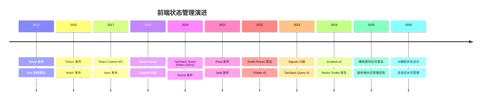
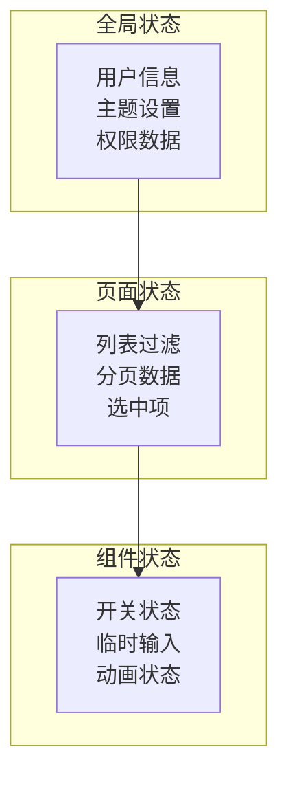
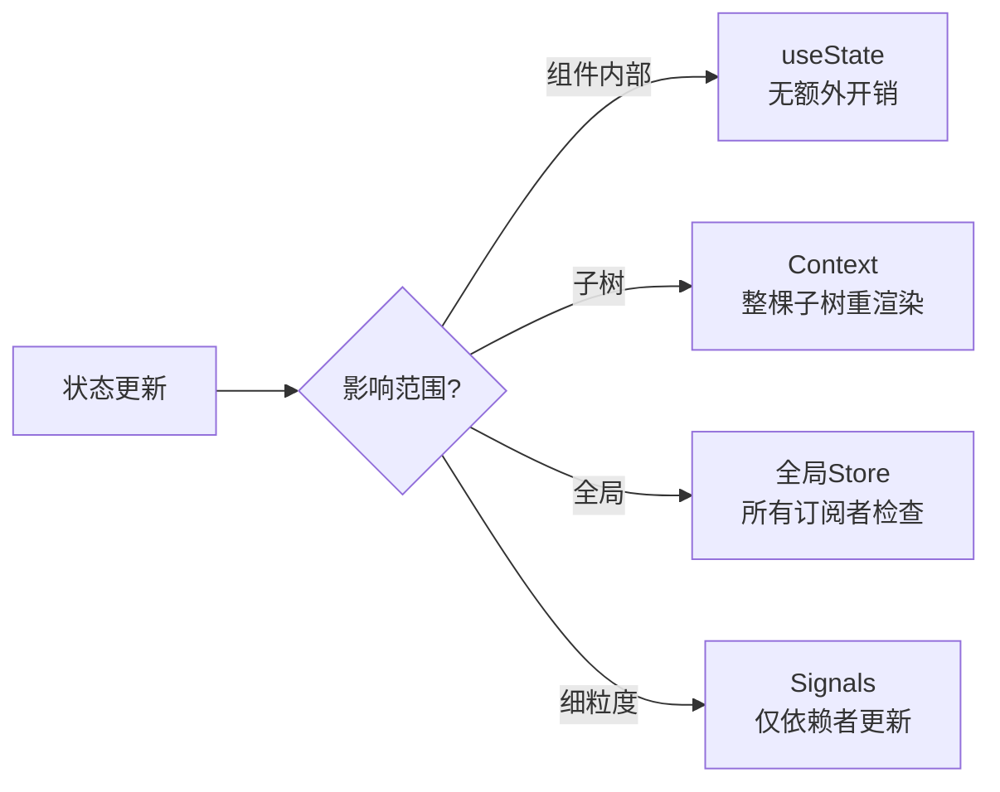

# 状态管理专题

> **核心问题**: 在复杂的现代前端应用中，如何正确选择和管理不同类型的状态？

## 什么是状态？

**状态（State）** 是应用在某个时间点的数据快照。任何会随时间变化、影响UI渲染的数据都是状态。

```js
// 这些都是状态
const [count, setCount] = useState(0);           // UI状态
const [user, setUser] = useState(null);          // 业务数据
const [isLoading, setIsLoading] = useState(false); // 异步状态
const [theme, setTheme] = useState('light');     // 主题状态
```

## 状态分类体系

```mermaid
graph TD
    State[应用状态] --> Local[本地状态<br/>Local State]
    State --> Global[全局状态<br/>Global State]
    State --> Server[服务端状态<br/>Server State]
    State --> Form[表单状态<br/>Form State]
    State --> URL[URL状态<br/>URL State]
    State --> Async[异步状态<br/>Async State]
    State --> Machine[状态机<br/>State Machine]

    Local --> L1[useState]
    Local --> L2[$state]
    Local --> L3[ref]

    Global --> G1[Redux]
    Global --> G2[Zustand]
    Global --> G3[Pinia]
    Global --> G4[Context]

    Server --> S1[TanStack Query]
    Server --> S2[SWR]
    Server --> S3[Apollo Client]

    Form --> F1[React Hook Form]
    Form --> F2[Formik]
    Form --> F3[Superforms]

    URL --> U1[query params]
    URL --> U2[hash]
    URL --> U3[path segments]

    Async --> A1[Promise]
    Async --> A2[Async/Await]
    Async --> A3[RxJS]

    Machine --> M1[XState]
    Machine --> M2[Robot]
    Machine --> M3[自定义]
```



## 状态管理范式对比

| 维度 | 本地状态 | 全局状态 | 服务端状态 | 表单状态 |
|------|---------|---------|-----------|---------|
| **生命周期** | 组件挂载到卸载 | 应用启动到关闭 | 缓存到失效 | 表单展示到提交 |
| **共享范围** | 单个组件 | 整个应用 | 全局缓存 | 表单内部 |
| **更新频率** | 高（用户交互） | 中（业务事件） | 低（API响应） | 高（输入事件） |
| **持久化** | 不持久化 | 可选（localStorage） | HTTP缓存 | 可选（自动保存） |
| **代表方案** | useState, ref | Redux, Zustand | TanStack Query | React Hook Form |
| **复杂度** | 低 | 中~高 | 低 | 中 |

## 状态管理演进时间线



## 选择决策树

```
状态需要跨组件共享？
  ├── 否 → 本地状态（useState / $state / ref）
  │         ├── 简单计数/开关 → useState / $state
  │         ├── DOM引用 → useRef / bind:this
  │         └── 派生计算 → useMemo / $derived
  │
  └── 是 → 状态来源？
            ├── 服务端API → 服务端状态管理
            │               ├── REST API → TanStack Query / SWR
            │               ├── GraphQL → Apollo Client / urql
            │               └── WebSocket → 自定义 + Zustand
            │
            ├── 用户输入 → 表单状态管理
            │               ├── 简单表单 → 受控组件
            │               ├── 复杂表单 → React Hook Form / Superforms
            │               └── 动态字段 → Formik + FieldArray
            │
            ├── 需要在URL中体现 → URL状态
            │               ├── 查询参数 → useSearchParams
            │               ├── 路由参数 → useParams
            │               └── 复杂状态 → nuqs
            │
            ├── 有明确状态流转 → 状态机
            │               ├── 复杂交互 → XState
            │               └── 简单状态机 → 自定义 reducer
            │
            └── 纯客户端全局状态 → 全局状态管理
                            ├── 小型应用 → Context + useReducer
                            ├── 中型应用 → Zustand / Pinia
                            ├── 大型应用 → Redux Toolkit
                            └── 原子化状态 → Jotai / Recoil
```

## 核心原则

### 1. 状态最小化

```js
// ❌ 冗余状态
const [fullName, setFullName] = useState('');
const [firstName, setFirstName] = useState('');
const [lastName, setLastName] = useState('');

// ✅ 派生状态
const [firstName, setFirstName] = useState('');
const [lastName, setLastName] = useState('');
const fullName = `${firstName} ${lastName}`.trim();
```

### 2. 单一数据源

```js
// ❌ 多处维护同一数据
const [users, setUsers] = useState([]);        // 组件A
const [userList, setUserList] = useState([]);  // 组件B

// ✅ 使用共享状态
// store/users.ts
export const useUsers = create(() => ({
  users: [],
  setUsers: (users) => set({ users })
}));
```

### 3. 状态提升与下沉



| 层级 | 存放状态 | 示例 |
|------|---------|------|
| **全局** | 跨页面共享 | 当前用户、主题、语言 |
| **页面** | 同页面共享 | 筛选条件、分页、选中项 |
| **组件** | 组件内部 | 开关、hover、临时输入 |
| **服务端** | API缓存 | 用户列表、商品数据 |

### 4. 不可变更新

```js
// ❌ 直接修改
const users = [...state.users];
users[0].name = 'New Name';  // 修改了引用
setUsers(users);

// ✅ 不可变更新
setUsers(users.map((user, index) =>
  index === 0 ? { ...user, name: 'New Name' } : user
));

// ✅ 使用Immer
import { produce } from 'immer';
setUsers(produce(users, draft => {
  draft[0].name = 'New Name';
}));
```

## 反模式清单

| 反模式 | 说明 | 危害 | 解决方案 |
|--------|------|------|----------|
| 状态膨胀 | 将所有数据放入全局状态 | 不必要的重渲染 | 就近原则，局部化状态 |
| 双向绑定滥用 | 无限制的双向同步 | 状态流难以追踪 | 单向数据流 + 显式事件 |
| 派生状态冗余 | 同时存储计算前后的值 | 数据不一致风险 | 使用计算属性/selector |
| 异步状态遗漏 | 只处理成功态 | UI异常 | 完整状态机：idle/loading/success/error |
| URL与状态不同步 | 页面刷新后状态丢失 | 无法分享/刷新 | URL即状态，同步管理 |
| 服务端状态本地缓存 | 手动管理API缓存 | 过期/不一致 | 使用TanStack Query/SWR |

## 性能考量



| 方案 | 更新粒度 | 重渲染范围 | 适用场景 |
|------|---------|-----------|----------|
| useState | 组件级 | 当前组件 | 简单本地状态 |
| Context | 子树级 | Provider下所有Consumer | 主题/语言 |
| Redux | 全局级 | 所有connect组件检查 | 大型应用 |
| Zustand | 全局级 | 仅变更订阅者 | 中小型应用 |
| Signals | 值级 | 仅使用处 | 高频更新 |
| TanStack Query | 缓存级 | 使用该query的组件 | 服务端数据 |

## 本专题章节导航

1. **[本地状态](./01-local-state)** — useState、$state、ref、响应式基础
2. **[全局状态](./02-global-state)** — Redux、Zustand、Pinia、Context
3. **[服务端状态](./03-server-state)** — TanStack Query、SWR、缓存策略
4. **[表单状态](./04-form-state)** — React Hook Form、Superforms、验证模式
5. **[URL状态](./05-url-state)** — 查询参数、路由状态、nuqs
6. **[异步状态](./06-async-state)** — Promise、Async/Await、Suspense
7. **[状态机](./07-state-machines)** — XState、有限状态机、工作流

## 参考资源

- [React State Management](https://react.dev/learn/thinking-about-react-state) ⚛️
- [Vue State Management](https://vuejs.org/guide/scaling-up/state-management.html) 💚
- [Svelte Runes](https://svelte.dev/docs/runes) 🧡
- [Redux Style Guide](https://redux.js.org/style-guide/) 📘
- [Zustand Documentation](https://docs.pmnd.rs/zustand/getting-started/introduction) 🐻
- [TanStack Query](https://tanstack.com/query/latest) 🔄
- [XState Documentation](https://stately.ai/docs) 🚦

> 最后更新: 2026-05-02
