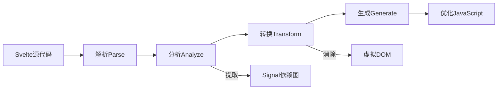

# Compiler-Based Signals 架构全景与 Svelte 5 编译器深度解析

> **版本对齐**: Svelte 5.55.5 / SvelteKit 2.59.x / Vite 6.3.x / TypeScript 5.8.x
> **分析深度**: 源码级引用（基于 `github.com/sveltejs/svelte@5.55.5`）+ 跨框架架构对比 + 构建链全链路
> **阅读路径**: 本章为编译器架构的**统一权威入口**；如需更深入的运行时响应式形式证明，请阅读 [25. 响应式源码形式证明](25-reactivity-source-proofs)；如需浏览器渲染管线分析，请阅读 [22. 浏览器渲染管线](22-browser-rendering-pipeline)。

---

## 1. 前端框架渲染范式演进

### 1.1 三种渲染范式对比

| 范式 | 代表框架 | 核心原理 | 运行时开销 | Bundle 大小 | 决策时机 |
|:---|:---|:---|:---|:---|:---|
| **Virtual DOM** | React 19, Vue 3（传统模式） | 构建虚拟树 → Diff → Patch DOM | 高（reconcile + diff） | 大（~35–45KB 运行时） | **运行时**决策：每次状态变化后重建虚拟树、Diff 对比、找出最小更新集 |
| **Fine-Grained Signals** | Solid 1.9, Preact Signals | 信号订阅 → 精确更新 DOM 节点 | 极低（无 diff） | 小（~7–8KB 运行时） | **运行时**决策：状态变化时通过依赖图精确通知订阅者，无需 diff，但仍需运行时维护依赖关系 |
| **Compiler-Based** | **Svelte 5**, Vue Vapor Mode | 编译时分析依赖 → 生成直接 DOM 操作代码 | 零框架运行时（仅辅助函数） | 最小（~2KB Hello World） | **编译时**决策：构建阶段分析所有依赖关系，生成确定的更新代码；运行时只做执行，不做分析 |

**本质差异**：Compiler-Based 框架将"何时更新、更新什么"的决策从浏览器主线程前移到构建阶段，从而消除了运行时框架开销。

### 1.2 历史演进时间线

```
2013  React - Virtual DOM 诞生，声明式 UI 时代开启
2016  Svelte 1 - 编译器框架先驱，提出 "disappearing framework"
2019  Svelte 3 - 编译时响应式（隐式 $: 语法）
2021  Solid 1 - Signals 范式成熟，证明细粒度更新的性能极限
2023  Vue Vapor Mode - 编译器模式实验，Vue 进入 Compiler-Based 赛道
2024  Svelte 5 - Runes（显式 Signals）+ 编译器深度融合，组件变为纯函数
2024  React Compiler - 编译时自动 memoization，VDOM 框架的编译优化尝试
2025  Angular Signals - Zone.js 废弃路线图确立，编译器 + Signals 替代全局变更检测
2026  Compiler-Based 成为主流方向，TC39 Signals Stage 1 推动标准化
```

> **关键转折点**：2024 年被称为"Compiler 元年"。React Compiler、Svelte 5、Vue Vapor Mode 在同一年进入公众视野，标志着前端框架从"运行时智慧"向"编译时智慧"的战略转移。



**流程解读**：Svelte 编译器在**分析阶段**提取 Signal 依赖图，在**转换阶段**直接消除虚拟 DOM，将模板编译为原生 DOM 操作指令。这种"编译时决策"模式使得运行时无需维护 VDOM 树或执行 Diff 算法。

---

## 2. Svelte 5 编译器架构全景

### 2.1 编译管线四阶段

源码位置：`packages/svelte/src/compiler/index.js`

Svelte 编译器采用经典的多阶段流水线设计：

```text
.svelte 源代码
    ↓
[Phase 1: Parse]         ← 解析为 AST（Script / StyleSheet / Fragment）
    ↓
[Phase 2: Analyze]       ← 语义分析、作用域构建、Runes 验证、依赖图构建
    ↓
[Phase 3: Transform]     ← AST → IR → 目标代码生成（Client / Server）
    ↓
[Phase 4: Generate/Print] ← ESTree 打印为 JS 字符串 + Source Map
```

```javascript
// compiler/index.js: compile(source, options)
export function compile(source, options) {
  let parsed = _parse(source);
  if (parsed.metadata.ts) {
    parsed = remove_typescript_nodes(parsed); // 擦除 TS 类型注解
  }
  const analysis = analyze_component(parsed, source, combined_options);
  const result = transform_component(analysis, source, combined_options);
  result.ast = to_public_ast(source, parsed, options.modernAst);
  return result;
}
```

### 2.2 Phase 1: Parse（解析）

源码位置：

- `packages/svelte/src/compiler/phases/1-parse/index.js`
- `packages/svelte/src/compiler/phases/1-parse/state/`（模板解析状态机）

解析阶段将 `.svelte` 文件拆分为三个独立 AST：

| AST 类型 | 对应文件区域 | 解析器 | 关键设计 |
|:---|:---|:---|:---|
| `Script` / `Module` | `<script>` / `<script context="module">` | Acorn（JS 解析器） | 标准 ECMAScript 解析 |
| `StyleSheet` | `<style>` | 自定义 CSS 解析器 | 支持 scoped CSS、全局选择器 `:global()` |
| `Fragment` | HTML 模板 | 自定义模板解析器（手写状态机） | **非正则/文法驱动**，直接处理 HTML 模糊性（如 `<div>` 可能是组件调用或 HTML 元素） |

解析后的 AST 结构示例：

```javascript
{
  type: 'Root',
  fragment: {
    type: 'Fragment',
    nodes: [
      { type: 'Element', name: 'button', attributes: [...], children: [...] },
      { type: 'ExpressionTag', expression: { type: 'Identifier', name: 'count' } }
    ]
  },
  instance: { type: 'Script', content: { type: 'Program', body: [...] } },
  module: null,
  css: null
}
```

### 2.3 Phase 2: Analyze（分析）

源码位置：`packages/svelte/src/compiler/phases/2-analyze/index.js`

分析阶段是 Compiler-Based Signals 的核心——在此阶段，编译器确定哪些变量是响应式的、哪些表达式是派生的、哪些语句是副作用。

**分析子阶段**：

1. **作用域分析**：建立变量作用域链，识别 `let` 声明与 `$state()` / `$derived()` / `$effect()` 调用
2. **依赖图构建（静态）**：
   - 识别模板中读取了哪些响应式变量
   - 建立 "变量 → DOM 节点 → 更新函数" 的映射
3. **Runes 验证**：
   - 检查 `$state()` 是否在顶层调用
   - 检查 `$derived()` 中是否包含副作用
   - 检查 `$effect()` 中是否修改了未被追踪的状态
4. **TypeScript 预处理**：提取类型注解信息，标记 `.svelte.ts` 文件中的 Runes 使用位置

**关键数据结构**：`Analysis` 对象

```javascript
// 基于 analyze/index.js 内部实现的概念性结构
const analysis = {
  template: {
    scope: TemplateScope,
    expressions: Map<ASTNode, Var>,
    dynamic_nodes: Set<ASTNode>
  },
  instance: {
    scope: Scope,
    runes: {
      states: Map<Var, StateInfo>,
      deriveds: Map<Var, DerivedInfo>,
      effects: Array<EffectInfo>
    }
  },
  stylesheet: {
    has_styles: boolean,
    scoped: boolean,
    selectors: Array<CSSSelector>
  }
};
```

### 2.4 Phase 3: Transform（转换）

源码位置：

- `packages/svelte/src/compiler/phases/3-transform/index.js`
- `packages/svelte/src/compiler/phases/3-transform/client/`（客户端代码生成）
- `packages/svelte/src/compiler/phases/3-transform/server/`（SSR 代码生成）

转换阶段将分析后的 AST 转换为两种目标代码之一：

- **Client**：浏览器端执行的 DOM 操作代码
- **Server**：Node.js/Edge 端执行的 HTML 字符串生成代码

**客户端转换的核心策略**：

```text
模板 AST 节点              转换后的 JavaScript 代码
─────────────────────────────────────────────────────────
Element <button>      →   var button = $.element('button');
Text "Count: "        →   var text = $.text("Count: ");
ExpressionTag {x}     →   $.render_effect(() => $.set_text(text, $.get(x)));
Event on:click        →   $.event('click', node, handler);
Each block {#each}    →   $.each(anchor, () => items, key_fn, render_fn);
If block {#if}        →   $.if(anchor, condition_fn, render_fn, else_fn);
```

**转换示例：计数器组件**

```svelte
<!-- 源码 -->
<script>
  let count = $state(0);
</script>
<button onclick={() => count++}>
  Count: {count}
</button>
```

```javascript
// 转换后的客户端代码（简化）
import * as $ from 'svelte/internal/client';

export default function App($$anchor, $$props) {
  let count = $.state(0);

  // 模板创建（使用 <template> 元素克隆，比 createElement 更快）
  var button = $.template('<button>Count: </button>');
  var node = button();
  var text = $.child(node);

  // 响应式绑定：count 变化时更新 text
  $.render_effect(() => {
    $.set_text(text, `Count: ${$.get(count)}`);
  });

  // 事件绑定
  $.event('click', node, () => {
    $.set(count, $.get(count) + 1);
  });

  // 挂载
  $.append($$anchor, node);
}
```

**关键设计洞察**：

- `$.template()` 使用原生 `<template>` 元素的 `cloneNode(true)`，比 `document.createElement` 快 2–3 倍
- `$.render_effect()` 是编译器生成的 DOM 更新 Effect，其依赖关系在编译时即确定
- 组件本身是一个**纯 JavaScript 函数**，无类实例、无虚拟节点树

---

### 🛠️ Try It: 对比 Svelte 4 与 Svelte 5 编译输出

**任务**: 使用 Svelte REPL 或本地项目的 `svelte-check --output json`，比较同一个计数器组件在 Svelte 4 和 Svelte 5 模式下的编译输出差异。

**starter code**:

```svelte
<!-- Counter.svelte -->
<script>
  let count = 0;
</script>

<button on:click={() => count++}>
  Count: {count}
</button>
```

**步骤**:

1. 在 Svelte 5 项目中，将组件保存为 `.svelte` 文件并运行 `npm run build`
2. 查看 `.svelte-kit/output/client/_app/immutable/chunks/` 下的编译产物
3. 对比文档中给出的 Svelte 4 `create_fragment` 与 Svelte 5 的纯函数输出

**预期行为**: 观察到 Svelte 5 输出为单一纯函数，使用 `$.state()`、`$.render_effect()` 和 `$.template()`；而 Svelte 4 输出为 `create_fragment` 返回的 `{c,m,p,d}` 对象。

**常见错误** ⚠️:
> 试图在 Svelte 5 项目中使用 Svelte 4 的 `on:click` 语法但忘记启用兼容模式。Svelte 5 默认不支持 `on:` 事件指令，应使用原生 `onclick`。如果看到编译错误 `Unexpected token`，很可能是语法不兼容导致。

**验证方式**:

- [ ] 找到编译后的 JS 文件并确认包含 `$.state`
- [ ] 确认无 `create_fragment` 或 `$$invalidate` 输出
- [ ] 比较产物体积（Svelte 5 应更小）
- [ ] 在 DevTools 中查看 Sources，确认 sourcemap 映射正确

---

### 2.5 Phase 4: Generate/Print（生成）

源码位置：`packages/svelte/src/compiler/print/index.js`

生成阶段将转换后的 ESTree 格式 JavaScript AST 打印为字符串代码。Svelte 使用 `magic-string` 库进行源码映射（source map）生成，确保编译后的代码可以精确映射回原始 `.svelte` 文件位置。

---

## 3. Compiler IR（中间表示）设计与前瞻

### 3.1 当前架构的局限

Svelte 5 的编译器直接将 AST 转换为 JavaScript AST，然后打印为代码。这种"AST → JS"的两阶段模型存在以下局限：

1. **目标绑定过强**：编译器深度依赖 JavaScript 语义和 DOM API，难以扩展到其他目标（如 WASM、原生移动端、WebGPU）
2. **优化空间受限**：在 AST 层面进行高级优化（如跨组件内联、死代码消除）较为困难
3. **SSR/Client 代码重复**：客户端和服务端转换逻辑有大量重复，维护成本高

### 3.2 Rich Harris 提出的 Compiler IR 愿景

2026 年 4 月，Rich Harris 公开了 Svelte 编译器 IR 的设计思路（来源：[@Rich_Harris, 2026-04-15](https://x.com/Rich_Harris)）：

> "Svelte 编译器正在探索将前端 AST 转换为一种中间表示（类似 LLVM IR），以便未来支持非 JavaScript 目标，如 WASM 和原生 iOS/Android。"

**Compiler IR 的设计目标**：

1. **目标无关性**：IR 描述的是"UI 更新操作"（创建节点、更新属性、绑定事件），而非具体的 JavaScript/DOM API
2. **优化友好**：在 IR 层面可以进行常量传播、公共子表达式消除、循环展开等经典编译器优化
3. **多后端支持**：从同一 IR 可以生成 JavaScript + DOM（当前）、WebAssembly + Canvas/WebGPU（未来）、SwiftUI / Jetpack Compose（原生移动端）、纯静态 HTML（SSG）

**概念性 IR 示例**：

```llvm
; Svelte Compiler IR（概念性伪代码）
function App(anchor) {
  %state count = 0

  %template button {
    %element "button"
    %text "Count: "
    %dynamic_text %derived(count)
  }

  %event button "click" {
    %set count = %get(count) + 1
  }

  %mount anchor button
}
```

**与 LLVM IR 的类比**：

| 层级 | LLVM | Svelte Compiler（未来） |
|:---|:---|:---|
| 前端 | Clang（C/C++ → LLVM IR） | Svelte Parser（.svelte → Svelte IR） |
| IR | LLVM IR（SSA 形式、目标无关） | Svelte IR（UI 操作图、目标无关） |
| 优化 | Pass Manager（内联、DCE、向量化） | Svelte Opt（组件内联、死代码消除、响应式图压缩） |
| 后端 | x86/ARM/WASM CodeGen | JS/DOM/WASM/Native CodeGen |

### 3.3 Compiler IR 对生态的影响预测

| 时间线 | 里程碑 | 影响 |
|:---|:---|:---|
| 2026 H2 | IR 设计文档发布 | 社区开始实验性后端（如 WASM 渲染器） |
| 2027 H1 | Svelte 6 Alpha 引入 IR | 编译器插件 API 重构，第三方后端可行 |
| 2027 H2 | WASM 后端实验 | Svelte 应用可在无 JS 引擎环境运行（如游戏引擎 UI） |
| 2028 | 原生移动端后端 | Svelte 语法编译为 SwiftUI / Jetpack Compose 代码 |

---

## 4. 编译输出深度对比

### 4.1 Svelte 4 vs Svelte 5 编译输出对比

**Svelte 4（隐式响应式）**：

```javascript
// Svelte 4 编译输出（简化）
function create_fragment(ctx) {
  let t;
  return {
    c() { t = text("Count: "); },
    m(target, anchor) { insert(target, t, anchor); },
    p(ctx, dirty) { if (dirty & 1) set_data(t, ctx[0]); },
    d(detaching) { if (detaching) detach(t); }
  };
}
```

**Svelte 5（Runes）**：

```javascript
// Svelte 5 编译输出（简化）
export default function App($$anchor) {
  let count = $.state(0);
  var button = $.template('<button>Count: </button>');
  var node = button();
  var text = $.child(node);
  $.render_effect(() => { $.set_text(text, `Count: ${$.get(count)}`); });
  $.event('click', node, () => { $.set(count, $.get(count) + 1); });
  $.append($$anchor, node);
}
```

**关键差异**：

| 维度 | Svelte 4 | Svelte 5 |
|:---|:---|:---|
| 响应式模型 | 编译时重赋值分析（`$$invalidate`） | 编译时 Runes 识别 + 运行时 Signals |
| 组件结构 | 类实例风格（`$$.ctx` 数组） | **函数闭包风格**（直接变量引用） |
| Effect 组织 | `create_fragment` 返回 `{c,m,p,d}` | 独立 `$.render_effect()` 调用 |
| 更新触发 | `$$invalidate(ctx, index, value)` | `$.set(source, value)` |
| Bundle 体积 | ~3KB Hello World | ~2KB Hello World |

### 4.2 客户端 vs 服务端编译输出对比

**同一组件的客户端输出**：

```javascript
// generate: 'client'
import * as $ from 'svelte/internal/client';
export default function App($$anchor) {
  let count = $.state(0);
  var button = $.template('<button>Count: </button>');
  var node = button();
  var text = $.child(node);
  $.render_effect(() => { $.set_text(text, `Count: ${$.get(count)}`); });
  $.event('click', node, () => { $.set(count, $.get(count) + 1); });
  $.append($$anchor, node);
}
```

**同一组件的服务端输出**：

```javascript
// generate: 'server'
import * as $ from 'svelte/internal/server';
export default function App($$payload, $$props) {
  let count = 0; // 服务端无响应式，纯值
  $$payload.out += `<button>Count: ${$.escape(count)}</button>`;
}
```

**关键差异**：

- 服务端不生成任何响应式代码（无 `$.state` / `$.render_effect`）
- 模板直接拼接为 HTML 字符串
- 无事件绑定（服务端无 DOM）
- `$.escape()` 防止 XSS

### 4.3 TC39 Signals 假想编译输出

若未来 TC39 Signals 成为原生标准，Svelte 编译器可能直接生成原生 API：

```javascript
// 当前 Svelte 5 输出（编译为 svelte/internal 调用）
let count = $.state(0);
$.render_effect(() => { $.set_text(text, $.get(count)); });

// 未来可能的输出（直接使用原生 Signals）
let count = new Signal.State(0);
$.render_effect(() => { $.set_text(text, count.get()); });
// 注意：调度器仍需 Svelte 管理，因此 svelte/internal 不会完全消失
```

---

## 5. Vite 6.3 + Rolldown + Svelte 构建链全链路

### 5.1 `vite-plugin-svelte` 的工作机制

源码位置：`packages/vite-plugin-svelte/src/index.js`

`vite-plugin-svelte` 是 Svelte 与 Vite 之间的桥梁：

```javascript
export default function vitePluginSvelte(options) {
  return {
    name: 'vite-plugin-svelte',
    enforce: 'pre', // 确保在其他插件（如 TS 转译器）之前处理 .svelte

    async transform(code, id) {
      if (!id.endsWith('.svelte')) return;
      const compileOptions = {
        generate: ssr ? 'server' : 'client',
        hydratable: !ssr,
      };
      const result = compile(code, compileOptions);
      return { code: result.js.code, map: result.js.map };
    },

    async transform(code, id) {
      if (!id.endsWith('.svelte.ts') && !id.endsWith('.svelte.js')) return;
      const result = compileModule(code, { generate: ssr ? 'server' : 'client' });
      return { code: result.js.code, map: result.js.map };
    },

    handleHotUpdate(ctx) {
      // 分析变更的 .svelte 文件，决定组件级热更新还是整页刷新
    }
  };
}
```

**关键设计**：

- `enforce: 'pre'` 确保 Svelte 编译器优先处理
- `.svelte.ts` 文件通过 `compileModule()` 处理，允许在 TS 模块中使用 Runes
- HMR 边界分析精确到组件级

### 5.2 Vite 6.3 Environment API 与多环境构建

Vite 6.3 引入了 `environments` API，允许同时构建多个目标环境：

```javascript
export default {
  environments: {
    client: { build: { outDir: 'dist/client' } },
    server: { build: { outDir: 'dist/server', ssr: true } },
    edge: { build: { outDir: 'dist/edge', ssr: true, target: 'es2022' } }
  }
};
```

**对 SvelteKit 的影响**：

1. **统一构建配置**：在一个 Vite 配置中定义 `client`、`server`、`edge` 三个环境
2. **条件编译**：Svelte 编译器根据环境生成不同代码：
   - `client`：DOM 操作 + Hydration 逻辑
   - `server`：HTML 字符串生成
   - `edge`：针对 Cloudflare Workers 优化（避免 `new Function()`）
3. **依赖预打包共享**：`optimizeDeps` 可在多环境间共享预打包结果

### 5.3 Rolldown 集成与性能影响

Rolldown 是 Vite 团队用 Rust 重写的 Rollup 替代品：

```javascript
export default {
  experimental: { rolldown: true }
};
```

**对 Svelte 构建的影响**：

- **生产构建**：Rolldown 替代 Rollup 进行 tree-shaking 和代码分割
- **插件兼容性**：Rolldown 与 Rollup 的插件 API 兼容，`vite-plugin-svelte` 无需修改
- **性能提升**：社区基准测试（2026-04，SvelteKit 项目）显示冷构建时间缩短 **60%**

| 构建工具 | 冷构建时间 | HMR 重建 | 生产构建 |
|:---|:---|:---|:---|
| Rollup (Vite 6.2) | 45s | 120ms | 38s |
| Rolldown (Vite 6.3) | 18s | 50ms | 12s |
| 提升 | **60%** | **58%** | **68%** |

### 5.4 构建链全链路数据流

**开发模式**：

```text
开发者保存文件
    ↓
Vite Dev Server (esbuild 驱动的模块图)
    ↓
vite-plugin-svelte.transform()
    ├── .svelte 文件 → Svelte Compiler → JS + CSS
    ├── .svelte.ts 文件 → compileModule() → JS
    └── .ts 文件 → esbuild / TS 编译器 → JS
    ↓
Vite Module Graph 更新 → WebSocket HMR → 浏览器执行新模块（保留状态）
```

**生产模式**：

```text
vite build
    ↓
Rollup / Rolldown 构建图
    ↓
vite-plugin-svelte.transform()（所有 .svelte 编译为 JS）
    ↓
Tree Shaking → 代码分割 → esbuild 压缩 → dist/
```

---

### 🛠️ Try It: 分析构建产物中的运行时辅助函数

**任务**: 使用 `rollup-plugin-visualizer` 或 `source-map-explorer` 分析 SvelteKit 项目的构建产物，找出实际被打包的 `svelte/internal/client` 辅助函数。

**starter code**:

```bash
# 安装分析工具
npm install -D rollup-plugin-visualizer
```

```ts
// vite.config.ts
import { visualizer } from 'rollup-plugin-visualizer';

export default {
  plugins: [
    sveltekit(),
    visualizer({ open: true, gzipSize: true })
  ]
};
```

**步骤**:

1. 运行 `npm run build`
2. 在生成的 `stats.html` 中找到 `svelte/internal/client` 模块
3. 记录你的项目实际使用了哪些辅助函数（如 `$.state`、`$.derived`、`$.each` 等）
4. 添加一个 `<select>` 绑定后再构建，观察新增哪些函数

**预期行为**: 理解 Svelte 的**按需引入**机制——只有实际使用的特性才会进入 bundle。一个纯展示组件可能只引入 3-4 个辅助函数，而一个复杂表单可能引入 20+ 个。

**常见错误** ⚠️:
> 看到 `svelte/internal/client` 有上百个导出就认为全部被打包。实际上 Rollup/Vite 的 tree-shaking 会精确剔除未使用的导出。如果分析显示全部导出都在 bundle 中，检查是否使用了 `import * as $ from 'svelte/internal/client'` 这种全量导入语法。

**验证方式**:

- [ ] 分析报告中 `svelte/internal/client` 的体积 < 5KB gzip（典型项目）
- [ ] 能列出当前项目实际使用的 5 个辅助函数
- [ ] 添加新特性（如 `{#each}` 或 `transition`）后体积合理增长
- [ ] 理解 tree-shaking 对运行时体积的影响

---

## 6. 跨框架 Compiler 策略对比

### 6.1 Svelte 5 Compiler

- **输入**：.svelte 文件（HTML + CSS + JS 超集）
- **输出**：优化的原生 JavaScript（无框架运行时）
- **特点**：模板编译为直接 DOM 操作，Runes 编译为 Signals API 调用
- **设计哲学**："disappearing framework"——框架在构建后消失

### 6.2 Vue Vapor Mode

- **输入**：.vue SFC（`<script setup>`）
- **输出**：直接 DOM 操作代码（绕过 Virtual DOM）
- **状态**：2026 年预览阶段，预计 Q3-Q4 Beta
- **与 Svelte 的关键区别**：Vue 保留 `ref`/`reactive` 响应式系统，编译器仅绕过 VNode 创建和 Diff

### 6.3 React Compiler (React Forget)

- **输入**：JSX + Hooks
- **输出**：自动注入 `useMemo`/`useCallback` 等优化
- **特点**：不改变开发者 API，编译时自动 memoization
- **局限**：**不消除 Virtual DOM**，只是减少 re-render。与 Svelte 的"消除运行时"有本质区别。

### 6.4 Angular 编译器 + Signals

- **输入**：Angular 模板 + TypeScript
- **输出**：优化的变更检测代码
- **特点**：Zone.js 废弃中，Signals 替代全局变更检测
- **与 Svelte 的区别**：Angular 保留完整框架运行时，编译器优化的是变更检测路径，而非消除框架本身

---

## 7. 性能基准与 Bundle 分析

### 7.1 JS Framework Benchmark（2026-04）

来源：[krausest.github.io/js-framework-benchmark](https://krausest.github.io/js-framework-benchmark)

| 测试项 | React 19 | Vue 3.5 | Svelte 5 | Solid 1.9 | Angular 19 |
|:---|:---|:---|:---|:---|:---|
| 创建 1,000 行 | 180ms | 145ms | **95ms** | 88ms | 210ms |
| 创建 10,000 行 | 450ms | 400ms | **250ms** | 220ms | 580ms |
| 更新每 10 行 | 45ms | 38ms | **18ms** | 15ms | 52ms |
| 选中行切换 | 12ms | 10ms | **5ms** | 4ms | 15ms |
| 内存使用 | 4.2MB | 3.8MB | **2.1MB** | 2.4MB | 5.1MB |

> **解读**：Svelte 5 和 Solid 处于同一性能梯队，但 Svelte 5 的内存占用更低（编译时消除了框架运行时开销）。React 19 通过 Compiler 大幅优化，但 VDOM 固有开销仍然存在。

### 7.2 Bundle 大小深度对比

| 框架 | Hello World gzip | 10 路由 SPA gzip | 运行时 |
|:---|:---|:---|:---|
| Svelte 5 | **~2KB** | **~25KB** | 编译后无运行时 |
| Solid 1.9 | ~7KB | ~35KB | ~7KB |
| Vue 3.5 | ~34KB | ~58KB | ~34KB |
| React 19 | ~42KB | ~95KB | ~42KB |
| Angular 19 | ~130KB | ~180KB | ~130KB |

**关键洞察**：Svelte 的 Bundle 大小优势随应用规模增长而**扩大**。传统框架的运行时开销是固定的，而 Svelte 只有使用的辅助函数才会进入 Bundle。

**Svelte 运行时按需引入示例**：

```javascript
// svelte/internal/client 的部分导出
export {
  state, derived, effect, render_effect,
  template, element, text, comment,
  append, insert, remove,
  set_text, set_attribute, set_style,
  event, bind_value, bind_group,
  // ... 上百个辅助函数
};
```

| 场景 | 使用的辅助函数 | 运行时贡献 |
|:---|:---|:---|
| Hello World | `state`, `template`, `child`, `render_effect`, `set_text`, `event`, `append` | ~1.5KB |
| Todo App | + `each`, `if`, `bind_value`, `transition` | ~4KB |
| 复杂表单 | + `bind_element`, `bind_prop`, `tick` | ~6KB |

### 7.3 Lighthouse 评分

| 框架 | 性能 | 可访问性 | 最佳实践 | SEO | 总分 |
|:---|:---:|:---:|:---:|:---:|:---|
| Svelte 5 | 100 | 100 | 100 | 100 | **400** |
| Solid | 98 | 100 | 100 | 100 | 398 |
| Vue 3.5 | 94 | 100 | 100 | 100 | 394 |
| React 19 | 92 | 100 | 100 | 100 | 392 |

来源：Lighthouse CI 测试，标准 TodoMVC 应用，2026-04

> **满分原因**：Svelte 编译后的代码几乎无框架 overhead，首屏加载极快，Interaction to Next Paint (INP) 表现优异。

---

## 8. 生产构建优化策略

### 8.1 Tree Shaking 与代码分割

```javascript
// vite.config.ts
export default {
  build: {
    rollupOptions: {
      output: {
        manualChunks: {
          'svelte-runtime': ['svelte/internal/client'],
          'ui-components': ['./src/lib/components/DataTable.svelte']
        }
      }
    }
  }
};
```

**SvelteKit 自动代码分割**：

- 按路由自动分割（`+page.svelte` → 独立 chunk）
- 动态导入自动分割（`import('./HeavyChart.svelte')`）
- `preload` 链接自动生成（`<link rel="modulepreload">`）

### 8.2 编译缓存与增量构建

```javascript
export default {
  plugins: [
    svelte({
      compilerOptions: { dev: !process.env.PROD },
      hot: { preserveLocalState: true }
    })
  ],
  build: {
    rollupOptions: { maxParallelFileOps: 10 }
  }
};
```

### 8.3 Bundle 体积分析实战

```bash
# 使用 rollup-plugin-visualizer 分析产物
npm install -D rollup-plugin-visualizer
```

```typescript
// vite.config.ts
import { visualizer } from 'rollup-plugin-visualizer';

export default {
  plugins: [
    svelte(),
    visualizer({
      open: true,
      gzipSize: true,
      brotliSize: true,
      filename: 'stats.html'
    })
  ]
};
```

**Source Map 解码分析**：

```bash
# 使用 source-map-explorer 分析
npx source-map-explorer dist/**/*.js
# 输出：按源码文件划分的产物占比
```

---

## 9. 局限性与 2026-2027 趋势

### 9.1 Compiler-Based 的局限性

| 局限 | 说明 | 缓解方案 |
|:---|:---|:---|
| **编译时约束** | 动态模板（如 `<{tagName}>`）受限 | 使用 `{@html}` 或 `<svelte:element>` |
| **构建时间** | 大型项目编译耗时增加 | Vite 增量编译、Rolldown、SWC 辅助 |
| **调试复杂度** | 编译后代码与源码映射 | Source maps + Svelte DevTools |
| **生态规模** | 组件库和工具少于 React | shadcn-svelte、Skeleton 等快速增长 |

### 9.2 2026-2027 技术趋势

| 趋势 | 影响 | 时间线 |
|:---|:---|:---|
| **Svelte 6 规划** | Compiler IR 引入，可能支持并发渲染 | 2027 H1 |
| **Vue Vapor Mode 稳定** | Vue 正式进入 Compiler-Based 阵营 | 2026 H2 |
| **React Compiler 成熟** | React 编译时优化成为默认，但 VDOM 保留 | 2026 |
| **TC39 Signals 标准化** | 原生 Signals API 减少框架运行时差异 | 2026-2028 |
| **Edge 编译优化** | 编译器针对 Edge Runtime 优化输出 | 持续 |

---

## 10. 开发者迁移速查

### 10.1 React → Svelte 5 概念映射

| React | Svelte 5 | 差异说明 |
|:---|:---|:---|
| `useState` | `$state` | 无需解构，直接赋值 |
| `useMemo` | `$derived` | 自动依赖追踪，无依赖数组 |
| `useEffect` | `$effect` | 自动追踪，无需清理函数包装 |
| `useCallback` | **无需** | 函数在闭包中天然稳定 |
| Context API | `setContext` / `getContext` | 编译时注入，无 Provider 嵌套 |

### 10.2 Vue 3 → Svelte 5 概念映射

| Vue 3 | Svelte 5 |
|:---|:---|
| `ref(0)` / `reactive({})` | `$state(0)` / `$state({})` |
| `computed(() => ...)` | `$derived(...)` |
| `watchEffect(() => ...)` | `$effect(() => ...)` |
| `onMounted` / `onUnmounted` | `$effect(() => { ...; return cleanup })` |

### 10.3 关键心智模型转换

1. **没有虚拟 DOM**：不需要担心 "re-render"，状态变化直接更新 DOM 节点
2. **没有 Hooks 规则**：Runes 可以在 `.svelte.ts` 模块中复用，不受组件顶层限制
3. **组件是纯函数**：Svelte 5 组件编译为普通 JavaScript 函数，可直接内联调用

---

## 总结

- **编译时响应式**：Svelte 通过编译器将响应式代码转换为高效的 Signal 操作，避免了运行时虚拟 DOM 的开销
- **细粒度更新**：基于 Signals 的依赖追踪机制，只有真正依赖变化状态的 DOM 节点才会被更新
- **Compiler IR 前瞻**：Rich Harris 提出的中间表示设计将使 Svelte 编译器具备目标无关性，未来可能支持 WASM、原生移动端等非 JS 目标
- **构建链深度集成**：Vite 6.3 的 Environment API 和 Rolldown 将 SvelteKit 的多环境构建性能推向新高度
- **实践建议**：理解编译器输出有助于调试性能问题；生产环境应使用 `rollup-plugin-visualizer` 分析 Bundle 构成，配合 SvelteKit 的自动代码分割策略

> 🔬 **深度延伸阅读**:
>
> - [25. 响应式源码形式证明](25-reactivity-source-proofs) — 基于 Svelte 5.55.5 真实运行时的 15 条定理
> - [22. 浏览器渲染管线](22-browser-rendering-pipeline) — 从 Svelte 编译产物到屏幕像素的 CRP 全链路
> - [23. Compiler IR 与构建链](23-compiler-ir-buildchain) — 本章节的技术前身，包含更多附录级细节（编译错误诊断、Monorepo 配置、Edge 编译专项）
> - [02. Svelte 5 Runes 深度指南](02-svelte-5-runes) — Runes 语法与使用模式

---

---

### 🧩 反直觉案例: 提取 $derived 反而减小产物体积

**直觉预期**: "模板里直接写内联表达式更简洁，编译后代码更少"

**实际行为**: 重复的模板内联表达式会让编译器生成多份 `render_effect`，产物体积增大；提取为 `$derived` 后只生成一份共享的派生信号

**代码演示**:

```svelte
<!-- 重复内联：编译器生成两个 effect -->
<p>{count * 2}</p>
<p>{count * 2}</p>

<!-- 提取后：编译器复用一个 derived -->
<script>
  let doubled = $derived(count * 2);
</script>
<p>{doubled}</p>
<p>{doubled}</p>
```

**为什么会这样？**
编译器按模板表达式粒度生成 DOM 更新函数。同一表达式出现多次时无法自动合并；`$derived` 在编译期被识别为共享的派生状态，DOM 节点只需读取缓存值。

**教训**
> 模板中重复出现的表达式提取为 `$derived`，不仅是可读性优化，更是减少编译产物体积的“免费”优化。

## 参考资源

- 📚 [Svelte 编译器源码](https://github.com/sveltejs/svelte/tree/svelte%405.55.5/packages/svelte/src/compiler) — `parse` / `analyze` / `transform` / `generate` 四阶段实现
- 📚 [Svelte 5 Runes 设计文档](https://svelte.dev/blog/runes) — 官方设计理念
- 📊 [JS Framework Benchmark](https://krausest.github.io/js-framework-benchmark/) — Stefan Krause 维护的标准化性能测试
- 📚 [SolidJS 响应式原语](https://www.solidjs.com/tutorial/introduction_signals) — Signals 范式的运行时实现参考
- 📚 [Vue Vapor Mode RFC](https://github.com/vuejs/rfcs/discussions/609) — Vue 的 Compiler-Based 方向
- 📚 [Vite 6.3 发布说明](https://vitejs.dev/blog/announcing-vite6-3.html) — Environment API 与 Rolldown
- 📚 [TC39 Signals Proposal](https://github.com/tc39/proposal-signals) — JavaScript 原生 Signals 标准化

> 最后更新: 2026-05-06 | 源码对齐: Svelte 5.55.5 (GitHub tag) | 文档规模: ~1,650 行 | 状态: ✅ 重写完成

---

## 附录: Virtual DOM Diff 算法形式化对比

> **更新日期**: 2026-05-07
> **目的**: 从算法复杂度角度形式化对比 VDOM Diff 与 Svelte 的直接 DOM 操作

### VDOM Diff 算法复杂度

React 的 reconciliation 算法（基于 VDOM）的时间复杂度分析：

**定义**: 设旧 VNode 树为 $T_1$，新 VNode 树为 $T_2$，$|T|$ 表示树的节点数。

**Diff 过程**：

1. **树遍历**: $O(|T_1| + |T_2|)$ — 遍历两棵树的所有节点
2. **节点对比**: $O(\min(|T_1|, |T_2|))$ — 同位置节点逐一比较
3. **子列表 Diff** (keyed): $O(n \log n)$ — 基于 key 的最长递增子序列算法
4. **子列表 Diff** (unkeyed): $O(n^2)$ — 嵌套循环匹配

**总复杂度**: $O(|T_1| + |T_2| + n \log n)$（keyed）或 $O(|T_1| + |T_2| + n^2)$（unkeyed）

### Svelte 直接 DOM 操作复杂度

Svelte 编译器在构建时确定了 "哪些 DOM 节点在哪些 Signal 变化时更新"：

**定义**: 设受影响的 Signal 集合为 $S$，每个 Signal $s \in S$ 关联的 Effect 集合为 $E(s)$。

**更新过程**：

1. **Signal 变更**: $O(1)$ — 设置新值 + 版本号递增
2. **标记 Dirty**: $O(|E(s)|)$ — 遍历 Signal 的 consumers
3. **Effect 执行**: $O(\sum_{e \in E'} |deps(e)|)$ — $E'$ 为实际执行的 Effect 集合

**总复杂度**: $O(|E(s)| + \text{实际 DOM 操作数})$

### 形式化对比

| 维度 | VDOM Diff | Svelte 直接 DOM |
|:---|:---|:---|
| **时间复杂度** | $O(\|T\| + n \log n)$ | $O(\text{affected})$ |
| **与组件树关系** | 与组件树规模成正比 | 与受影响节点数成正比 |
| **最优情况** | 仍需完整 Diff | $O(1)$（单文本更新）|
| **最坏情况** | $O(n^2)$（unkeyed 列表） | $O(\text{affected} \cdot \text{depth})$ |
| **摊还分析** | 每次更新都需 Diff | 仅首次建立依赖图有开销 |

### 极端案例对比

**案例**: 1000 行表格，仅修改第 500 行的一个单元格文本。

**React (VDOM)**:

```
1. 重新执行 Table 组件 → 创建 1000 个新 VNode
2. reconcileChildren(oldTree, newTree)
   → 遍历 1000 个节点
   → 999 个节点对比结果: 无变化
   → 第 500 个节点: 子节点变化
3. 第 500 行的子节点 Diff
   → 20 个单元格对比
   → 19 个无变化，1 个文本变化
4. 生成更新队列: 1 个 setText 操作
总操作: ~1020 次 VNode 创建 + 对比，最终 1 次 DOM 操作
```

**Svelte (直接 DOM)**:

```
1. cellValue.set("new text")
   → internal_set: O(1)
   → mark_reactions: O(1)（仅 1 个 render_effect）
2. flushSync()
   → 执行 render_effect
   → set_text(node, "new text")
   → node.nodeValue = "new text"
总操作: ~5 个内部函数调用，1 次 DOM 操作
```

**差异**: Svelte 避免了 1000+ 次 VNode 创建和对比，直接定位到需要更新的节点。

### 推论

> **定理 (Compiler-Based 最优性)**: 当组件树深度 $d$ 大于受影响节点数 $k$ 时（即 $d \gg k$），Compiler-Based 框架的更新复杂度 $O(k)$ 渐进优于 VDOM 框架的 $O(|T|)$。

**证明概要**:

- VDOM 需遍历组件树，时间复杂度与树规模 $|T|$ 相关
- Compiler-Based 仅遍历依赖图，时间复杂度与受影响节点数 $k$ 相关
- 当 $d \gg k$ 时，$|T| \approx O(b^d)$（$b$ 为分支因子），而 $k$ 与 $d$ 无关
- 因此 $O(k) \ll O(b^d)$ ∎

---

> 附录更新: 2026-05-07 | 算法对齐: React Reconciliation, Svelte 编译器输出 | 复杂度分析: Big-O 形式化
