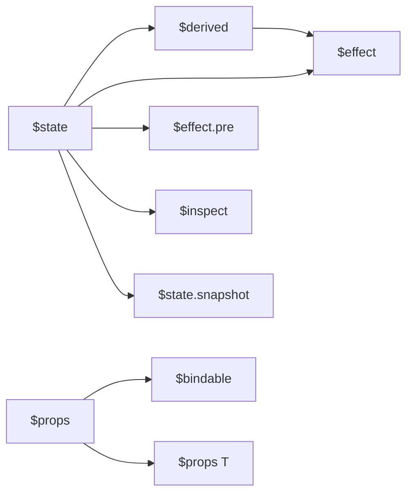

# Svelte 5 Runes 完全指南

Svelte 5（2024-10 发布）是一次根本性重写，Runes 语法取代了经典的 `let` 隐式响应式声明。
Runes 基于 Signals 实现，但通过编译器优化达到零运行时框架代码。

| 版本 | 发布时间 | 核心变化 |
|------|----------|----------|
| Svelte 3 (2019) | 编译时革命，无 VDOM | 隐式 `let` 响应式 |
| Svelte 4 (2023) | 性能优化，维护更新 | 同上 |
| **Svelte 5 (2024)** | **Runes 重写，Signals 融合** | **显式 `$state`/`$derived`/`$effect`** |
| Svelte 6 (预计 2027) | 并发渲染？ | 规划中 |

## 概述：为什么需要 Runes？

Svelte 3/4 的隐式响应式系统虽然优雅，但在大型应用和复杂组件中暴露出一些根本性问题：

1. **作用域模糊**：`let` 声明的变量是否在模板中使用时自动变成响应式，这让开发者难以判断一个变量是否是响应式的
2. **跨文件状态困难**：Svelte 4 的 Store（`writable`、`readable`）需要显式的 `subscribe`/`unsubscribe`，类型支持也不够完善
3. **派生逻辑混乱**：`$:` 标签既可以用于派生计算，也可以用于副作用，边界模糊
4. **TypeScript 集成不佳**：隐式系统难以提供精确的类型推断

Runes 的设计哲学：**显式优于隐式**。通过编译器识别的特殊函数调用（以 `$` 开头），Svelte 5 实现了：

- 精确的依赖追踪（基于 Signals）
- 跨文件共享状态（`.svelte.ts`）
- 清晰的派生与副作用分离
- 完整的 TypeScript 支持

## Runes 核心原语

### $state — 响应式状态

`$state` 是 Runes 系统的基石，它将任意 JavaScript 值转换为深度响应式的 Signal。

#### 基本用法

```svelte
<script>
  let count = $state(0);
</script>

<button onclick={() => count++}>
  Count: {count}
</button>
```

> 💡 **在线体验**: 在 [Svelte REPL](https://svelte.dev/playground) 中尝试上述代码

#### 深层响应式（Deep Reactivity）

Svelte 5 使用 JavaScript `Proxy` 实现对象的深层响应式，这意味着嵌套属性的修改也能自动触发更新：

```svelte
<script>
  let user = $state({
    name: 'Alice',
    age: 30,
    address: {
      city: 'Beijing',
      zip: '100000'
    }
  });

  function updateUser() {
    user.age++;                    // ✅ 触发更新
    user.address.city = 'Shanghai'; // ✅ 同样触发更新
  }
</script>

<p>{user.name} lives in {user.address.city}</p>
<button onclick={updateUser}>Update</button>
```

#### 数组突变

这是 Svelte 5 相对 Svelte 4 的重大改进。
在 Svelte 4 中，数组方法（`push`、`pop`、`splice` 等）不会触发更新，必须赋值新数组。
Svelte 5 的 Proxy 拦截了这些方法：

```svelte
<script>
  let items = $state([1, 2, 3]);

  function addItem() {
    items.push(items.length + 1); // ✅ 自动触发更新
    // Svelte 4 中需要：items = [...items, items.length + 1]
  }

  function removeLast() {
    items.pop(); // ✅ 同样有效
  }

  function insertAt(index, value) {
    items.splice(index, 0, value); // ✅ 完全支持
  }
</script>

<ul>
  {#each items as item}
    <li>{item}</li>
  {/each}
</ul>
<button onclick={addItem}>Add</button>
<button onclick={removeLast}>Remove Last</button>
```

#### 类实例响应式

`$state` 也支持类实例，这对于面向对象的状态管理非常有用：

```svelte
<script>
  class Counter {
    count = $state(0);

    increment() {
      this.count++;
    }

    get doubled() {
      return $derived(this.count * 2);
    }
  }

  const counter = new Counter();
</script>

<button onclick={() => counter.increment()}>
  {counter.count} / {counter.doubled}
</button>
```

#### 注意事项与限制

```svelte
<script>
  // ❌ 错误：$state 必须在顶层调用
  function createState() {
    return $state(0); // 运行时错误
  }

  // ✅ 正确：在顶层声明
  let count = $state(0);

  // ❌ 解构会失去响应性
  let { name, age } = $state({ name: 'Alice', age: 30 });
  name = 'Bob'; // 不会触发更新！

  // ✅ 使用完整对象引用
  let user = $state({ name: 'Alice', age: 30 });
  user.name = 'Bob'; // 正确触发更新

  // ✅ 或使用 getter 模式
  let state = $state({ name: 'Alice', age: 30 });
  let name = $derived(state.name);
</script>
```

### $derived — 派生计算

`$derived` 用于创建基于其他响应式值的纯计算属性。
它自动追踪依赖，并在依赖变化时重新计算。

#### 基本用法

```svelte
<script>
  let count = $state(0);
  let doubled = $derived(count * 2);
  let quadrupled = $derived(doubled * 2); // 可以链式派生
</script>

<p>{count} x 2 = {doubled}</p>
<p>{count} x 4 = {quadrupled}</p>
```

#### $derived.by — 复杂计算

当派生逻辑较复杂时，使用 `$derived.by` 配合箭头函数：

```svelte
<script>
  let items = $state([1, 2, 3, 4, 5]);

  let stats = $derived.by(() => {
    const sum = items.reduce((a, b) => a + b, 0);
    const avg = sum / items.length;
    const max = Math.max(...items);
    const min = Math.min(...items);

    return { sum, avg, max, min };
  });
</script>

<p>Sum: {stats.sum}, Avg: {stats.avg.toFixed(2)}</p>
<p>Range: [{stats.min}, {stats.max}]</p>
```

#### 与 $state 的区别

| 特性 | `$state` | `$derived` |
|------|----------|------------|
| 是否可手动赋值 | ✅ 可以 | ❌ 只读 |
| 用途 | 可变状态 | 纯计算派生 |
| 执行时机 | 赋值时 | 依赖变化时 |
| 副作用 | 可以包含 | 不应包含 |

```svelte
<script>
  let firstName = $state('John');
  let lastName = $state('Doe');

  // ✅ 正确：纯计算
  let fullName = $derived(`${firstName} ${lastName}`);

  // ❌ 错误：$derived 中不应有副作用
  let badDerived = $derived.by(() => {
    console.log('This is a side effect!'); // 不要这样做
    return firstName + ' ' + lastName;
  });
</script>
```

### $effect — 副作用

`$effect` 用于处理副作用，如 DOM 操作、网络请求、订阅外部数据源等。
它在组件挂载时运行，并在依赖变化时重新运行。

#### 基本用法

```svelte
<script>
  let count = $state(0);

  $effect(() => {
    console.log(`Count changed to ${count}`);
    document.title = `Count: ${count}`;
    // 自动追踪 count 依赖
    // 组件卸载时自动清理
  });
</script>

<button onclick={() => count++}>
  Count: {count}
</button>
```

#### 带清理的 Effect

返回清理函数，在下一次 effect 运行前或组件卸载时执行：

```svelte
<script>
  let count = $state(0);

  $effect(() => {
    const interval = setInterval(() => {
      count++;
    }, 1000);

    // 清理函数
    return () => clearInterval(interval);
  });
</script>

<p>Auto-incrementing: {count}</p>
```

#### 事件订阅模式

```svelte
<script>
  let online = $state(navigator.onLine);

  $effect(() => {
    const handleOnline = () => online = true;
    const handleOffline = () => online = false;

    window.addEventListener('online', handleOnline);
    window.addEventListener('offline', handleOffline);

    return () => {
      window.removeEventListener('online', handleOnline);
      window.removeEventListener('offline', handleOffline);
    };
  });
</script>

<p>Status: {online ? '🟢 Online' : '🔴 Offline'}</p>
```

---

### 🛠️ Try It: 实现可复用的定时器 Hook

**任务**: 使用 `.svelte.ts` 创建一个可复用的定时器模块，支持启动、暂停、重置和读取已过去的时间（秒）。在组件中使用它实现一个倒计时器。

**starter code**:

```ts
// timer.svelte.ts
export function createTimer(initialSeconds = 60) {
  // 你的实现...
}
```

```svelte
<!-- Timer.svelte -->
<script>
  import { createTimer } from './timer.svelte.ts';
  const timer = createTimer(10);
</script>

<!-- 实现显示和按钮控制 -->
```

**预期行为**:

- 显示剩余秒数（如 "10s"）
- 提供 Start / Pause / Reset 三个按钮
- 倒计时到 0 时自动停止，显示 "Time's up!"
- 组件卸载时自动清理定时器

**常见错误** ⚠️:
> 在 `$effect` 中忘记返回清理函数，导致组件卸载后 `setInterval` 仍在后台运行，造成内存泄漏和幽灵更新。定时器类副作用**必须**返回清理函数。

**验证方式**:

- [ ] 倒计时正常递减
- [ ] Pause 能暂停，Start 能从暂停处继续
- [ ] Reset 回到初始值
- [ ] 组件卸载后控制台无残留 interval 报错

---

#### Effect 追踪规则

`$effect` 只追踪在同步执行期间读取的响应式值：

```svelte
<script>
  let count = $state(0);
  let multiplier = $state(2);

  $effect(() => {
    // count 被追踪，multiplier 未被追踪
    console.log(count * 10); // 只追踪 count
  });

  $effect(() => {
    // 两个都被追踪
    console.log(count * multiplier);
  });

  $effect(() => {
    // 异步回调中读取的值不会被追踪！
    setTimeout(() => {
      console.log(count); // ❌ 不会触发重新运行
    }, 0);
  });
</script>
```

### $props — 组件 Props

`$props` 替代了 Svelte 4 的 `export let` 语法，提供更清晰的 props 声明方式。

#### 基本用法

```svelte
<script>
  let { name, age = 18 } = $props();
</script>

<p>Hello {name}, you are {age}</p>
```

#### TypeScript 完整类型

```svelte
<script lang="ts">
  interface Props {
    name: string;
    age?: number;
    items: string[];
    onSelect: (id: string) => void;
    onDelete?: (id: string) => boolean;
  }

  let {
    name,
    age = 18,
    items,
    onSelect,
    onDelete
  }: Props = $props();
</script>

<ul>
  {#each items as item}
    <li onclick={() => onSelect(item)}>{item}</li>
  {/each}
</ul>
```

#### 解构与剩余 Props

```svelte
<script>
  let {
    class: className,   // 重命名（class 是保留字）
    style,
    ...rest            // 剩余 props
  } = $props();
</script>

<!-- 将剩余 props 传递给子元素 -->
<div class={className} {style} {...rest}>
  <slot />
</div>
```

#### $bindable — 双向绑定

```svelte
<!-- Child.svelte -->
<script>
  let { value = $bindable() } = $props();
</script>

<input bind:value />
```

```svelte
<!-- Parent.svelte -->
<script>
  import Child from './Child.svelte';
  let text = $state('');
</script>

<Child bind:value={text} />
<p>You typed: {text}</p>
```

#### $bindable 的高级用法

```svelte
<script>
  // 带默认值
  let {
    visible = $bindable(false),
    count = $bindable(0)
  } = $props();
</script>

<button onclick={() => visible = !visible}>
  Toggle
</button>
<input type="number" bind:value={count} />
```

### $inspect — 调试工具

`$inspect` 是一个开发辅助工具，在开发模式下自动在值变化时输出日志。

#### 基本用法

```svelte
<script>
  let count = $state(0);
  let user = $state({ name: 'Alice', age: 30 });

  // 输出: count 0 → count 1 → count 2
  $inspect(count);

  // 输出: user Object → user Object（引用变化）
  $inspect(user);
</script>

<button onclick={() => count++}>Increment</button>
<button onclick={() => user.age++}>Age++</button>
```

#### 自定义输出

```svelte
<script>
  let count = $state(0);

  $inspect(count).with((label, value) => {
    console.log(`[DEBUG] ${label}:`, value);
    // 可以发送到外部日志服务
    // sendToLogService(label, value);
  });
</script>
```

## .svelte.ts — 跨文件共享状态

`.svelte.ts`（或 `.svelte.js`）是 Svelte 5 最重要的新特性之一。它允许在常规 TypeScript/JavaScript 文件中使用 Runes，实现跨组件状态共享，完全替代了 Svelte 4 的 Store 系统。

### 工厂模式

```ts
// stores.svelte.ts
export function createCounter(initial = 0) {
  let count = $state(initial);
  let doubled = $derived(count * 2);
  let history = $state<number[]>([]);

  function increment() {
    history.push(count);
    count++;
  }

  function decrement() {
    history.push(count);
    count--;
  }

  function reset() {
    history = [];
    count = initial;
  }

  // 使用 getter 暴露只读值
  return {
    get count() { return count; },
    get doubled() { return doubled; },
    get history() { return history; },
    increment,
    decrement,
    reset
  };
}
```

```svelte
<!-- Counter.svelte -->
<script>
  import { createCounter } from './stores.svelte.ts';

  const counter = createCounter(10);
</script>

<div>
  <p>Count: {counter.count}</p>
  <p>Doubled: {counter.doubled}</p>
  <button onclick={counter.increment}>+</button>
  <button onclick={counter.decrement}>-</button>
  <button onclick={counter.reset}>Reset</button>

  <p>History: {counter.history.join(', ')}</p>
</div>
```

---

### 🛠️ Try It: 修复响应式丢失的购物车

**任务**: 下面的代码试图实现一个简单的购物车，但存在响应式 bug。找到并修复它，使得点击 "Add" 按钮后列表正确更新。

**starter code**:

```svelte
<script>
  let items = $state(['Apple', 'Banana']);

  function addItem() {
    const newItems = items;
    newItems.push('Orange');
    items = newItems;
  }
</script>

<ul>
  {#each items as item}
    <li>{item}</li>
  {/each}
</ul>
<button onclick={addItem}>Add Orange</button>
```

**预期行为**: 点击按钮后，列表应立即显示新增的 "Orange"。

**常见错误** ⚠️:
> 将数组赋值给中间变量再修改，然后重新赋回同一个引用。Svelte 的 Proxy 虽然能追踪属性修改，但重新赋值相同引用不会触发更新通知。应直接修改原数组 `items.push('Orange')`，或创建新数组引用 `items = [...items, 'Orange']`。

**验证方式**:

- [ ] 点击 "Add Orange" 后列表实时更新
- [ ] 控制台无报错
- [ ] 连续点击能持续添加项目

---

### 单例模式（全局状态）

```ts
// globalState.svelte.ts
export const globalCounter = createCounter(0);

// 购物车状态
export function createCart() {
  let items = $state<Array<{ id: string; name: string; price: number; qty: number }>>([]);

  let total = $derived.by(() =>
    items.reduce((sum, item) => sum + item.price * item.qty, 0)
  );

  let count = $derived(items.reduce((sum, item) => sum + item.qty, 0));

  function add(item: { id: string; name: string; price: number }) {
    const existing = items.find(i => i.id === item.id);
    if (existing) {
      existing.qty++;
    } else {
      items.push({ ...item, qty: 1 });
    }
  }

  function remove(id: string) {
    items = items.filter(i => i.id !== id);
  }

  function updateQty(id: string, qty: number) {
    const item = items.find(i => i.id === id);
    if (item) {
      if (qty <= 0) {
        remove(id);
      } else {
        item.qty = qty;
      }
    }
  }

  return {
    get items() { return items; },
    get total() { return total; },
    get count() { return count; },
    add,
    remove,
    updateQty
  };
}

export const cart = createCart();
```

```svelte
<!-- CartBadge.svelte -->
<script>
  import { cart } from './globalState.svelte.ts';
</script>

<span class="badge">
  🛒 {cart.count} items - ${cart.total.toFixed(2)}
</span>
```

```svelte
<!-- ProductList.svelte -->
<script>
  import { cart } from './globalState.svelte.ts';

  const products = [
    { id: '1', name: 'Laptop', price: 999 },
    { id: '2', name: 'Mouse', price: 29 },
    { id: '3', name: 'Keyboard', price: 79 }
  ];
</script>

{#each products as product}
  <div class="product">
    <h3>{product.name}</h3>
    <p>${product.price}</p>
    <button onclick={() => cart.add(product)}>
      Add to Cart
    </button>
  </div>
{/each}
```

### 与 Svelte 4 Store 对比

| 特性 | Svelte 4 Store | Svelte 5 .svelte.ts |
|------|----------------|---------------------|
| 订阅方式 | `$store` 或 `subscribe()` | 直接属性访问 |
| 类型支持 | 需手动定义 | 原生 TypeScript |
| 派生 | 需 `derived()` store | `$derived` 原生支持 |
| 跨文件 | 支持 | 支持（更自然）|
| 学习成本 | Store API | 普通 JavaScript |
| 运行时开销 | Store 订阅系统 | 零（编译器优化）|

## Snippets — 替代 Slots

Snippets 是 Svelte 5 替代 Svelte 4 Slots 的新机制。它本质上是一种"可复用的模板片段"，可以像函数一样接受参数，在任意位置渲染。

### 基础概念

```svelte
<!-- 定义 snippet -->
{#snippet greeting(name)}
  <p>Hello, <strong>{name}</strong>!</p>
{/snippet}

<!-- 渲染 snippet -->
{@render greeting('World')}
{@render greeting('Svelte')}
```

### 替代具名 Slots

```svelte
<!-- Card.svelte -->
<script>
  let { title, children } = $props();
</script>

<div class="card">
  <div class="card-header">
    {#if title}
      {@render title()}
    {/if}
  </div>
  <div class="card-body">
    {@render children()}
  </div>
</div>
```

```svelte
<!-- App.svelte -->
<script>
  import Card from './Card.svelte';
</script>

<Card>
  {#snippet title()}
    <h2>My Card Title</h2>
  {/snippet}

  {#snippet children()}
    <p>This is the card content.</p>
  {/snippet}
</Card>
```

### Snippets 接受参数（Slots 无法做到）

这是 Snippets 相对于 Slots 的最大优势：

```svelte
<!-- DataTable.svelte -->
<script>
  let { items, columns, row } = $props();
</script>

<table>
  <thead>
    <tr>
      {#each columns as column}
        <th>{column.header}</th>
      {/each}
    </tr>
  </thead>
  <tbody>
    {#each items as item}
      {@render row(item)}
    {/each}
  </tbody>
</table>
```

```svelte
<!-- App.svelte -->
<script>
  import DataTable from './DataTable.svelte';

  const users = $state([
    { id: 1, name: 'Alice', age: 30, role: 'Admin' },
    { id: 2, name: 'Bob', age: 25, role: 'User' },
    { id: 3, name: 'Carol', age: 35, role: 'Editor' }
  ]);

  const columns = [
    { key: 'name', header: 'Name' },
    { key: 'age', header: 'Age' },
    { key: 'role', header: 'Role' }
  ];
</script>

<DataTable {items} {columns}>
  {#snippet row(user)}
    <tr>
      <td>{user.name}</td>
      <td>{user.age}</td>
      <td>
        <span class="badge" class:admin={user.role === 'Admin'}>
          {user.role}
        </span>
      </td>
    </tr>
  {/snippet}
</DataTable>
```

### 将 Snippet 作为 Props 传递

```svelte
<!-- List.svelte -->
<script>
  let { items, itemRender } = $props();
</script>

<ul>
  {#each items as item}
    <li>{@render itemRender(item)}</li>
  {/each}
</ul>
```

```svelte
<!-- App.svelte -->
<script>
  import List from './List.svelte';

  const numbers = [1, 2, 3, 4, 5];
</script>

<List items={numbers}>
  {#snippet itemRender(n)}
    <span style="font-size: {n * 10}px">{n}</span>
  {/snippet}
</List>
```

### Snippets vs Slots 对比

| 特性 | Svelte 4 Slots | Svelte 5 Snippets |
|------|----------------|-------------------|
| 参数传递 | ❌ 不支持 | ✅ 完全支持 |
| 多次渲染 | ❌ 只能渲染一次 | ✅ 可多次 `@render` |
| 运行时开销 | 组件实例化 | 无（纯函数调用）|
| TypeScript | 类型支持有限 | 完整类型推断 |
| 嵌套使用 | 有限制 | 完全自由 |

### Snippets 高级特性（5.29+）

#### `{@attach}` — DOM 节点行为挂载（5.29+）

`{@attach}` 是一个新的特殊标签，用于在 Snippet 渲染时将行为（behavior）附加到生成的 DOM 节点上，无需创建包裹组件。它是 Action 的轻量级替代，专门用于 Snippet 上下文。

```svelte
<!-- Tooltip.svelte -->
<script>
  let { content, trigger } = $props();
</script>

<button>
  {@render trigger()}
  {@attach (node) => {
    // node 是 trigger() 渲染出的第一个 DOM 节点
    const tooltip = document.createElement('div');
    tooltip.textContent = content;
    tooltip.className = 'tooltip';
    document.body.appendChild(tooltip);

    const show = () => tooltip.style.display = 'block';
    const hide = () => tooltip.style.display = 'none';
    node.addEventListener('mouseenter', show);
    node.addEventListener('mouseleave', hide);

    return () => {
      // 清理函数，节点卸载时调用
      node.removeEventListener('mouseenter', show);
      node.removeEventListener('mouseleave', hide);
      tooltip.remove();
    };
  }}
</button>
```

> 💡 **与 Action 的区别**: Action 通过 `use:` 指令绑定到组件元素，`{@attach}` 则绑定到 Snippet 的渲染输出节点，更适合**无包裹层**的 UI 模式。

#### Snippet 泛型参数（5.30+）

Snippet 现在支持泛型类型参数，使得可复用的列表渲染模板可以获得完整的类型推断。

```svelte
<!-- DataTable.svelte -->
<script generics="T extends { id: string }">
  let { items, row }: {
    items: T[];
    row: import('svelte').Snippet<[T]>;
  } = $props();
</script>

<table>
  {#each items as item (item.id)}
    <tr>
      {@render row(item)}
      <!-- item 的类型被精确推断为 T，而非 any -->
    </tr>
  {/each}
</table>

<!-- 使用方 -->
<DataTable items={users}>
  {#snippet row(user)}
    <!-- user 被推断为 User 类型 -->
    <td>{user.name}</td>
    <td>{user.email}</td>
  {/snippet}
</DataTable>
```

**编译器优化**: 带有 `generics` 的组件，Svelte 5.30+ 编译器会在生成 `.d.ts` 时保留泛型参数，第三方库消费时无需额外类型断言。

#### Async Components — 异步组件加载（5.36+）

Svelte 5.36 引入了原生异步组件支持，允许在 `<script>` 模块顶层使用 `await` 导入动态组件，无需手动管理 `{#await}` 块。

```svelte
<!-- Dashboard.svelte -->
<script>
  import { lazy } from 'svelte';

  // 异步加载重型图表组件，自动处理 loading / error 状态
  const Chart = lazy(() => import('./HeavyChart.svelte'));

  let data = $state([]);
</script>

<Chart {data} fallback={<p>正在加载图表组件...</p>} />
```

**等效手写模式**（用于理解编译器输出）：

```svelte
<script>
  let ChartComponent = $state(null);
  let error = $state(null);

  async function loadChart() {
    try {
      const mod = await import('./HeavyChart.svelte');
      ChartComponent = mod.default;
    } catch (e) {
      error = e;
    }
  }

  loadChart();
</script>

{#if error}
  <p class="error">加载失败: {error.message}</p>
{:else if ChartComponent}
  <ChartComponent />
{:else}
  <p>正在加载...</p>
{/if}
```

> ⚠️ **限制**: `lazy()` 仅在客户端可用。SSR 场景下应使用 `+page.js` 的 `export const ssr = false` 或在 `onMount` 中动态导入。

---

### 🛠️ Try It: 将 Svelte 4 Store 迁移为 .svelte.ts

**任务**: 将下面的 Svelte 4 writable store 重写为 Svelte 5 的 `.svelte.ts` 模块，保持相同的对外接口。

**starter code**:

```ts
// Svelte 4 版本
import { writable, derived } from 'svelte/store';

export const todos = writable([
  { id: 1, text: 'Learn Svelte 5', done: false }
]);

export const remaining = derived(todos, $todos =>
  $todos.filter(t => !t.done).length
);

export function addTodo(text: string) {
  todos.update(list => [...list, { id: Date.now(), text, done: false }]);
}
```

**预期行为**: 重写后的模块应支持 `import { todos, remaining, addTodo } from './todos.svelte.ts'`，且 `todos` 和 `remaining` 在组件模板中保持响应式。

**常见错误** ⚠️:
> 直接导出 `$state` 变量本身（如 `export let todos = $state([...])`）。这样导出的不是响应式引用，外部读取的是当前值的快照。正确做法是用工厂函数封装状态，通过 getter 暴露只读访问，通过函数暴露修改操作。

**验证方式**:

- [ ] `.svelte.ts` 文件能在组件中正确导入
- [ ] 列表和剩余计数在模板中自动更新
- [ ] 外部只能通过 `addTodo` 添加项目，不能直接修改内部状态

---

## Svelte 4 → Svelte 5 迁移指南

### 自动化迁移工具

Svelte 官方提供了 `sv migrate` 命令来自动化大部分迁移工作：

```bash
# 确保你在 SvelteKit 项目根目录
npx sv migrate svelte-5

# 工具会自动处理：
# - export let → $props()
# - $: 派生 → $derived
# - 生命周期 → $effect
# - Slots → Snippets（部分情况）
```

::: warning
自动化工具不会处理所有边缘情况，仍需手动检查和测试。
:::

### 详细迁移对照表

#### 1. 状态声明

**Svelte 4:**

```svelte
<script>
  let count = 0;
  let user = { name: 'Alice' };
</script>
```

**Svelte 5:**

```svelte
<script>
  let count = $state(0);
  let user = $state({ name: 'Alice' });
</script>
```

#### 2. 派生计算

**Svelte 4:**

```svelte
<script>
  let count = 0;
  $: doubled = count * 2;
  $: quadrupled = doubled * 2;
</script>
```

**Svelte 5:**

```svelte
<script>
  let count = $state(0);
  let doubled = $derived(count * 2);
  let quadrupled = $derived(doubled * 2);
</script>
```

#### 3. 副作用与生命周期

**Svelte 4:**

```svelte
<script>
  import { onMount, onDestroy } from 'svelte';

  let interval;

  onMount(() => {
    interval = setInterval(() => {
      console.log('tick');
    }, 1000);
  });

  onDestroy(() => {
    clearInterval(interval);
  });
</script>
```

**Svelte 5:**

```svelte
<script>
  $effect(() => {
    const interval = setInterval(() => {
      console.log('tick');
    }, 1000);

    return () => clearInterval(interval);
  });
</script>
```

#### 4. Props 声明

**Svelte 4:**

```svelte
<script>
  export let name;
  export let age = 18;
</script>
```

**Svelte 5:**

```svelte
<script>
  let { name, age = 18 } = $props();
</script>
```

#### 5. 事件处理

**Svelte 4:**

```svelte
<script>
  import { createEventDispatcher } from 'svelte';
  const dispatch = createEventDispatcher();

  function handleClick() {
    dispatch('select', { id: 1 });
  }
</script>

<button on:click={handleClick}>Select</button>
```

**Svelte 5:**

```svelte
<script>
  let { onSelect } = $props();

  function handleClick() {
    onSelect({ id: 1 });
  }
</script>

<button onclick={handleClick}>Select</button>
```

**父组件使用：**

```svelte
<script>
  import Child from './Child.svelte';

  function handleSelect(event) {
    console.log('Selected:', event.id);
  }
</script>

<!-- Svelte 4 -->
<Child on:select={handleSelect} />

<!-- Svelte 5 -->
<Child onSelect={handleSelect} />
```

#### 6. Slots → Snippets

**Svelte 4:**

```svelte
<!-- Modal.svelte -->
<div class="modal">
  <div class="header">
    <slot name="header">Default Header</slot>
  </div>
  <div class="body">
    <slot />
  </div>
</div>
```

```svelte
<!-- App.svelte -->
<Modal>
  <h2 slot="header">Custom Header</h2>
  <p>Modal content here</p>
</Modal>
```

**Svelte 5:**

```svelte
<!-- Modal.svelte -->
<script>
  let { header, children } = $props();
</script>

<div class="modal">
  <div class="header">
    {#if header}
      {@render header()}
    {:else}
      Default Header
    {/if}
  </div>
  <div class="body">
    {@render children()}
  </div>
</div>
```

```svelte
<!-- App.svelte -->
<Modal>
  {#snippet header()}
    <h2>Custom Header</h2>
  {/snippet}

  {#snippet children()}
    <p>Modal content here</p>
  {/snippet}
</Modal>
```

### 迁移检查清单

- [ ] 所有响应式 `let` 变量 → `$state()`
- [ ] 所有 `$:` 派生语句 → `$derived()` 或 `$derived.by()`
- [ ] 所有 `$:` 副作用 → `$effect()`
- [ ] 所有 `export let` → `$props()`
- [ ] 所有 `<slot>` → `{#snippet}` + `{@render}`
- [ ] 所有事件 dispatch → props 回调函数
- [ ] `onMount`/`onDestroy` → `$effect()`（评估是否必要）
- [ ] Store（`writable`/`readable`/`derived`）→ `.svelte.ts` + `$state`/`$derived`
- [ ] 运行 `svelte-check` 验证类型
- [ ] 运行测试套件验证功能

## Runes 与 TypeScript 深度集成

### 泛型与 Runes

```svelte
<script lang="ts">
  // 泛型状态工厂
  function createStore<T>(initial: T) {
    let value = $state<T>(initial);

    return {
      get value() { return value; },
      set value(v: T) { value = v; }
    };
  }

  const numberStore = createStore(0);
  const stringStore = createStore('hello');
  const userStore = createStore<{ name: string; age: number } | null>(null);
</script>
```

### 接口与类型别名

```svelte
<script lang="ts">
  interface User {
    id: string;
    name: string;
    email: string;
    role: 'admin' | 'user' | 'editor';
  }

  let users = $state<User[]>([]);
  let selectedId = $state<string | null>(null);
  let searchQuery = $state('');

  // 派生过滤列表
  let filteredUsers = $derived.by(() => {
    if (!searchQuery) return users;
    const q = searchQuery.toLowerCase();
    return users.filter(u =>
      u.name.toLowerCase().includes(q) ||
      u.email.toLowerCase().includes(q)
    );
  });

  // 派生选中用户
  let selectedUser = $derived(
    users.find(u => u.id === selectedId) ?? null
  );

  // 派生权限检查
  let canEdit = $derived(selectedUser?.role === 'admin' || selectedUser?.role === 'editor');
</script>
```

### Props 类型模式

```svelte
<script lang="ts">
  // 标准 Props 模式
  interface Props {
    /** 用户显示名称 */
    name: string;
    /** 用户年龄，默认 18 */
    age?: number;
    /** 是否激活 */
    active?: boolean;
    /** 点击回调 */
    onClick?: (name: string) => void;
    /** 自定义渲染 */
    customRender?: import('svelte').Snippet;
  }

  let {
    name,
    age = 18,
    active = false,
    onClick,
    customRender
  }: Props = $props();
</script>
```

### 类型安全的 Snippets

```svelte
<script lang="ts">
  interface Item {
    id: string;
    label: string;
  }

  interface Props {
    items: Item[];
    renderItem: import('svelte').Snippet<[Item]>;
  }

  let { items, renderItem }: Props = $props();
</script>

{#each items as item (item.id)}
  {@render renderItem(item)}
{/each}
```

## 性能优化最佳实践

### 列表渲染优化

```svelte
<script>
  let items = $state([
    { id: '1', name: 'Item 1' },
    { id: '2', name: 'Item 2' }
  ]);
</script>

<!-- ✅ 使用 key 实现高效的列表 diff -->
{#each items as item (item.id)}
  <ListItem {item} />
{/each}

<!-- ❌ 无 key，大列表性能差 -->
{#each items as item}
  <ListItem {item} />
{/each}
```

### 状态拆分原则

```svelte
<script>
  // ❌ 避免：单一大对象，任何属性变化都会触发所有依赖检查
  let form = $state({
    username: '',
    email: '',
    password: '',
    confirmPassword: '',
    errors: {}
  });

  // ✅ 推荐：拆分为独立的 $state
  let username = $state('');
  let email = $state('');
  let password = $state('');
  let confirmPassword = $state('');
  let errors = $state<Record<string, string>>({});

  // 派生值只在真正依赖变化时重新计算
  let isPasswordMatch = $derived(password === confirmPassword);
  let isFormValid = $derived.by(() => {
    return username.length > 0 &&
           email.includes('@') &&
           password.length >= 8 &&
           isPasswordMatch;
  });
</script>
```

### 派生 vs Effect 的正确使用

```svelte
<script>
  let count = $state(0);

  // ✅ 正确：纯计算使用 $derived
  let doubled = $derived(count * 2);
  let message = $derived(
    count > 10 ? 'Large number' : 'Small number'
  );

  // ❌ 错误：在 $effect 中做计算
  let badDoubled = 0;
  $effect(() => {
    badDoubled = count * 2; // 不必要的 effect
  });

  // ✅ 正确：副作用使用 $effect
  $effect(() => {
    console.log(`Count is now ${count}`);
  });

  // ✅ 正确：DOM 操作使用 $effect
  $effect(() => {
    const element = document.getElementById('counter');
    if (element) {
      element.style.color = count > 10 ? 'red' : 'black';
    }
  });
</script>
```

### 事件处理优化

```svelte
<script>
  let count = $state(0);

  // ✅ 推荐：内联箭头函数（Svelte 编译器会自动优化）
  <button onclick={() => count++}>Increment</button>

  // ✅ 推荐：如果逻辑复杂，提取函数
  function handleSubmit(event: Event) {
    event.preventDefault();
    // 复杂逻辑...
  }

  // ❌ 避免：不必要的函数包装
  function increment() {
    count++;
  }
</script>
```

### 动画与过渡

```svelte
<script>
  let visible = $state(false);
  let items = $state(['Apple', 'Banana', 'Cherry']);
</script>

<!-- ✅ 使用内置 transition -->
{#if visible}
  <div transition:fade>
    Content
  </div>
{/if}

<!-- ✅ 使用 animate 实现列表重排动画 -->
{#each items as item, i (item)}
  <div animate:flip>
    {item}
  </div>
{/each}

<!-- ❌ 避免：第三方动画库（除非非常复杂的需求） -->
```

## 常见陷阱与解决方案

### 陷阱 1：在 `$effect` 中修改状态

```svelte
<script>
  let count = $state(0);

  // ❌ 无限循环！
  $effect(() => {
    count = count + 1;
  });

  // ✅ 正确：使用条件判断
  $effect(() => {
    if (count < 0) {
      count = 0; // 修正非法值
    }
  });
</script>
```

### 陷阱 2：Proxy 的引用问题

```svelte
<script>
  let items = $state([{ id: 1, name: 'A' }]);

  // ❌ 不会触发更新（获取的是原始数组快照）
  function badUpdate() {
    const item = items[0];
    item.name = 'B';
  }

  // ✅ 正确：通过 Proxy 修改
  function goodUpdate() {
    items[0].name = 'B';
  }

  // ✅ 也正确：替换整个元素
  function anotherUpdate() {
    items[0] = { ...items[0], name: 'B' };
  }
</script>
```

### 陷阱 3：解构丢失响应性

```svelte
<script>
  let user = $state({ name: 'Alice', age: 30 });

  // ❌ 解构后失去响应性
  let { name, age } = user;
  name = 'Bob'; // 不会更新 UI

  // ✅ 保持对象引用
  let userRef = $state({ name: 'Alice', age: 30 });
  userRef.name = 'Bob'; // 正确更新

  // ✅ 使用 $derived 获取单个属性
  let userName = $derived(user.name);
</script>
```

### 陷阱 4：Effect 依赖遗漏

```svelte
<script>
  let a = $state(0);
  let b = $state(0);

  // ❌ b 的变化不会触发这个 effect
  $effect(() => {
    console.log(a);
    // 忘记使用 b
  });

  // ✅ 如果需要追踪多个值，确保在同步执行中读取
  $effect(() => {
    console.log(a, b);
  });
</script>
```

## Runes 语义模型（形式化定义）

以下采用"定义 → 属性 → 关系 → 解释"的形式化方法，精确界定每个 Runes 的语义边界。

### 语义公理体系

> **Axiom 1（状态公理）**: `$state(initial)` 创建一个响应式信号（Signal），该信号持有值 `initial`，并维护一个消费者集合（consumers）。任何在 effect 或 derived 执行期间对该信号的读取操作，都会将当前执行上下文注册为消费者。

> **Axiom 2（派生公理）**: `$derived(fn)` 创建一个派生信号，其值为 `fn()` 的返回值。派生信号自动追踪 `fn` 执行期间读取的所有源信号，并在任一源信号变化时重新求值。

> **Axiom 3（副作用公理）**: `$effect(fn)` 注册一个副作用函数。该函数在依赖的信号变化时执行，执行期间读取的信号构成其依赖集。函数可返回一个清理函数，在 effect 重新执行或组件销毁时调用。

> **Axiom 4（Props 公理）**: `$props()` 声明组件的外部输入接口。Props 是单向数据流：父组件传递值，子组件接收但不应直接修改。

### 语义规则与推导

| 规则 | 内容 | 推导结果 |
|------|------|----------|
| **Rule 1: 依赖追踪** | 在 `$derived` 或 `$effect` 的同步执行体中读取 `$state`，即建立依赖关系 | 依赖图是有向无环图（DAG） |
| **Rule 2: 更新传播** | 当 `$state` 被赋值时，标记所有消费者为"脏"，下一微任务批次中按拓扑顺序重新执行 | 同一事件循环的多次赋值只触发一次更新 |
| **Rule 3: Effect 纯净性** | `$effect` 回调应仅执行副作用（DOM操作、网络请求、日志），不应修改其依赖的状态 | 违反此规则可能导致无限循环 |
| **Rule 4: 清理顺序** | `$effect` 返回的清理函数在以下时机调用：(a) effect 重新执行前 (b) 组件销毁时 | 清理函数本身不应依赖响应式状态 |

### Runes 关系图谱



**解读**: `$state` 是所有响应式的核心源头。`$derived` 和 `$effect` 通过读取 `$state` 建立依赖关系。`$props` 是组件的外部输入接口，`$bindable` 使其支持双向绑定。

### 概念精确界定

| 概念 | 是什么 | 不是什么 |
|------|--------|--------|
| **$state** | 编译器感知的响应式信号容器 | 不是普通变量、不是 Vue 的 ref、不是 React 的 useState |
| **$derived** | 基于依赖自动重新计算的纯函数 | 不是缓存函数、不是 useMemo、不应包含副作用 |
| **$effect** | 响应式副作用注册机制 | 不是生命周期钩子、不是 watch、不应修改依赖 |
| **$props** | 组件外部输入接口声明 | 不是全局状态、不是双向绑定（除非配合 $bindable）|
| **$bindable** | Props 的双向绑定增强标记 | 不是独立的状态管理工具、必须配合 $props 使用 |

### 与 Svelte 4 标签语义的映射关系

| Svelte 4 标签 | 语义 | Svelte 5 Runes | 语义等价性 |
|--------------|------|---------------|-----------|
| `let count = 0` | 顶层变量即状态 | `let count = $state(0)` | 等价，但显式声明 |
| `$: doubled = count * 2` | 标签派生 | `let doubled = $derived(count * 2)` | 等价，但 $derived 更精确 |
| `$: { console.log(count); }` | 标签副作用 | `$effect(() => { console.log(count); })` | 等价，但执行时机有差异 |
| `export let prop` | 导出即 Props | `let { prop } = $props()` | 等价，但支持解构和默认值 |

## 完整反例集

以下反例遵循"错误代码 → 错误输出/现象 → 根本原因 → 修复代码"的教学链条。

### 反例 5：在 $effect 中同步修改依赖状态

```svelte
<script>
  // ❌ 错误代码
  let count = $state(0);
  $effect(() => {
    console.log(count);
    count = count + 1; // 修改了依赖自己的状态！
  });
  // 错误输出: Maximum call stack size exceeded
  // 根本原因: 每次 effect 执行修改 count → count 变化触发 effect → 无限循环
</script>
```

```svelte
<script>
  // ✅ 修复代码
  let count = $state(0);
  let doubled = $derived(count * 2); // 用 $derived 代替 effect 中的计算
  $effect(() => {
    console.log(count);
  });
</script>
```

### 反例 6：$derived 中执行副作用

```svelte
<script>
  // ❌ 错误代码
  let count = $state(0);
  let logCount = $derived(() => {
    console.log('count changed:', count); // 副作用在 $derived 中！
    return count * 2;
  });
  // 根本原因: $derived 应该是纯函数。副作用会导致不可预测的重复执行
</script>
```

```svelte
<script>
  // ✅ 修复代码
  let count = $state(0);
  let doubled = $derived(count * 2);
  $effect(() => {
    console.log('count changed:', count); // 副作用放在 $effect 中
  });
</script>
```

### 反例 7：解构 $state 数组后期望响应式

```svelte
<script>
  // ❌ 错误代码
  let items = $state(['a', 'b', 'c']);
  let first = items[0]; // 解构/索引访问获取的是值，不是信号
  first = 'z'; // 不会触发 items 更新
  // 根本原因: 数组索引访问返回原始值，失去与源信号的连接
</script>
```

```svelte
<script>
  // ✅ 修复代码
  let items = $state(['a', 'b', 'c']);
  let first = $derived(items[0]); // 使用 $derived 保持响应式
  // 或者直接操作数组
  items[0] = 'z'; // 正确：直接修改 $state 数组
</script>
```

### 反例 8：Props 直接赋值

```svelte
<script>
  // ❌ 子组件中直接修改 Props
  let { value } = $props();
  function handleClick() {
    value = value + 1; // 违反单向数据流！
  }
  // 根本原因: Props 是父组件的状态引用，子组件修改会破坏数据流一致性
</script>
```

```svelte
<script>
  // ✅ 修复代码：使用回调 Props
  let { value, onChange } = $props();
  function handleClick() {
    onChange(value + 1); // 通过回调通知父组件更新
  }
</script>
```

### 反例 9：忘记 $effect cleanup 导致内存泄漏

```svelte
<script>
  // ❌ 错误代码
  let intervalId;
  $effect(() => {
    intervalId = setInterval(() => {
      console.log('tick');
    }, 1000);
  });
  // 根本原因: 组件销毁时 interval 仍在运行，且每次 effect 重新执行都会创建新 interval
</script>
```

```svelte
<script>
  // ✅ 修复代码
  $effect(() => {
    const intervalId = setInterval(() => {
      console.log('tick');
    }, 1000);
    return () => clearInterval(intervalId); // 返回清理函数
  });
</script>
```

### 反例 10：$state.snapshot 的误用

```svelte
<script>
  // ❌ 错误代码
  let user = $state({ name: 'Alice', prefs: { theme: 'dark' } });
  let snapshot = $state.snapshot(user);
  snapshot.name = 'Bob'; // 修改 snapshot，期望 user 也变化
  // 根本原因: $state.snapshot 返回的是当前值的浅拷贝，不是响应式引用
</script>
```

```svelte
<script>
  // ✅ 修复代码
  let user = $state({ name: 'Alice', prefs: { theme: 'dark' } });
  // 正确用法：snapshot 用于传递给不需要响应式的 API
  function saveToServer() {
    fetch('/api/user', {
      method: 'POST',
      body: JSON.stringify($state.snapshot(user))
    });
  }
</script>
```

## Runes 内部实现简述

虽然 Runes 的编译器优化细节非常复杂，但理解其高层模型有助于正确使用：

1. **编译时转换**：Svelte 编译器将 `$state()` 转换为 Signal 的创建和读取调用
2. **依赖追踪**：`$derived` 和 `$effect` 在执行时自动记录访问过的 Signal，建立依赖图
3. **精确更新**：当 Signal 值变化时，只有真正依赖它的 derived 和 effect 会重新执行
4. **批处理**：同一事件循环中的多个状态更新会被批处理，只触发一次重新渲染

这种"编译时 Signals"的架构，让 Svelte 5 既拥有 Signals 的细粒度响应性，又保持了零运行时开销的优势。

## 总结

- **Runes 核心原语**：`$state` 管理状态，`$derived` 创建派生值，`$effect` 处理副作用，`$props` 接收组件参数。
- **编译时转换**：编译器将 Runes 转换为底层 Signal 的创建与订阅调用，实现零运行时开销的响应性。
- **Snippets 取代 Slots**：`{#snippet}` 和 `{@render}` 提供了更灵活、类型更安全的组件内容组合机制。
- **迁移路径**：从 Svelte 4 迁移需系统替换 `let`、`$:`、`export let` 和 `<slot>` 为对应的 Runes 语法。
- **实践建议**：优先使用 `$state` 和 `$derived` 管理数据流，利用 Svelte REPL 验证迁移后的行为。

> 💡 **相关阅读**: [Svelte 语言完全参考](12-svelte-language-complete) · [响应式系统深度原理](14-reactivity-deep-dive)

## 参考资源

- [Svelte 5 官方文档](https://svelte.dev/docs/svelte/v5-migration-guide) 📚
- [Runes 设计文档](https://svelte.dev/blog/runes) 📚
- [Snippets 文档](https://svelte.dev/docs/svelte/svelte-snippet) 📚
- [Svelte REPL](https://svelte.dev/playground) 🛠️
- [Svelte 5 源码](https://github.com/sveltejs/svelte/tree/main/packages/svelte) 🔧

> 最后更新: 2026-05-02 | Svelte 版本: 5.55.x | 数据来源: svelte.dev 官方文档
