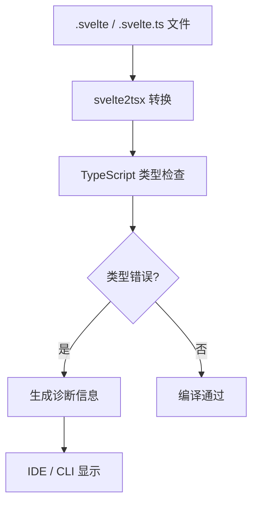

# TypeScript + Svelte 编译运行时：从基础到 5.8+ 深度融合

> **TypeScript 版本对齐**: 5.8.x（稳定）/ 5.9.x（RC）/ 6.0（过渡预告）/ 7.0（原生编译器路线图）
> **Svelte 版本**: 5.55.5
> **核心议题**: TS 5.8+ 的新类型特性如何增强 Svelte Runes 的类型安全？`.svelte.ts` 的类型系统边界在哪里？TS 7.0 原生编译器将如何改变 Svelte 的类型检查性能？

---

## 1. 概述与版本演进

Svelte 5 实现了原生 TypeScript 支持，无需预处理器。`.svelte.ts` 文件允许在组件外部使用 Runes，实现类型安全的共享状态。这一变化不仅是语法层面的简化，更意味着 Svelte 编译器本身能够理解 TypeScript 类型注解，并将其融入响应式系统的依赖追踪与代码生成过程中。

| 特性 | Svelte 4 | Svelte 5 |
|:---|:---|:---|
| TypeScript 支持 | 需 `svelte-preprocess` | 原生内置 |
| 模板类型检查 | 有限 | 完整（`svelte-check`） |
| 泛型组件 | 不支持 | 支持（`generics` 属性） |
| `.svelte.ts` 文件 | 不存在 | 原生支持 Runes |
| Props 类型推断 | 手动声明 | `$props()` 自动推断 |
| 模板表达式类型 | 无检查 | `svelte-check` 深度检查 |
| Snippet 类型 | 不支持 | `Snippet<T>` 泛型支持 |

### 1.1 TypeScript 版本时间线与 Svelte 生态关联

| 版本 | 发布时间 | 关键特性 | 对 Svelte 的直接影响 |
|:---|:---|:---|:---|
| **5.5** | 2024-06 | 类型推断改进、正则表达式类型 | Svelte 5 初始支持的 TS 基线 |
| **5.6** | 2024-09 | 禁止隐式 any 的严格检查增强 | `svelte-check` 错误检测能力提升 |
| **5.7** | 2024-12 | 相对路径解析优化、搜索依赖检查 | Monorepo 中 `.svelte.ts` 模块解析更快 |
| **5.8** | 2025-04 | `satisfies` 增强、`--module node18`、声明文件 emit 优化 | `.svelte.ts` 的类型约束模式更丰富 |
| **5.9** | 2025-08 | 类型变量推断修复、`NoInfer<T>` 泛用化 | 泛型组件 Props 推断更精确 |
| **6.0** | 预计 2026 H2 | TS 7.0 过渡版本，API 兼容性调整 | 为原生编译器迁移做准备 |
| **7.0** | 预计 2027 | Go/Rust 原生编译器 | `svelte-check` 性能可能提升 10x |

### 1.2 类型检查流程



Svelte 的类型检查并非原生 TypeScript 直接处理，而是通过 `svelte2tsx` 先将 `.svelte` 文件转换为等效的 `.tsx` 表示，再交由 TypeScript 编译器进行标准类型分析。这种桥接设计让模板中的表达式、Props 绑定和事件处理都能获得完整的类型推断。

---

## 2. `.svelte.ts` 文件与 Runes 类型安全

### 2.1 核心特性

- **Runes 可用性**：在 `.svelte.ts` 文件中，所有 Runes（`$state`、`$derived`、`$effect`、`$inspect` 等）均可直接使用
- **编译时转换**：Svelte 编译器在编译阶段将 Runes 转换为原生 JavaScript 的 Signal 操作
- **类型保留**：TypeScript 类型注解在编译后会被擦除，但在开发阶段由 `svelte-check` 和 IDE 完整保留
- **ESM 兼容**：`.svelte.ts` 文件作为标准 ES Module 导出，可被任意 `.svelte` 组件或 `.ts` 文件导入

### 2.2 计数器工厂示例

```ts
// counter.svelte.ts
export interface Counter {
  readonly count: number;
  readonly doubled: number;
  readonly history: readonly number[];
  increment(): void;
  decrement(): void;
  reset(): void;
}

export function createCounter(initial = 0): Counter {
  let count = $state(initial);
  let doubled = $derived(count * 2);
  let history = $state<number[]>([]);

  function increment() {
    history = [...history, count];
    count++;
  }

  function decrement() {
    history = [...history, count];
    count--;
  }

  function reset() {
    count = initial;
    history = [];
  }

  return {
    get count() { return count; },
    get doubled() { return doubled; },
    get history() { return history; },
    increment,
    decrement,
    reset
  };
}
```

**关键模式**：通过 getter 返回 `$state` 变量。直接返回 `count` 会丢失响应性（返回的是当前值的快照），而 getter 确保每次访问都读取最新的 Signal 值。

### 2.3 在组件中使用

```svelte
<script lang="ts">
  import { createCounter } from './counter.svelte.ts';
  const counter = createCounter(10);
</script>

<div class="counter">
  <button onclick={counter.decrement} aria-label="Decrease">−</button>
  <span class="value">{counter.count} (x2 = {counter.doubled})</span>
  <button onclick={counter.increment} aria-label="Increase">+</button>
  <button onclick={counter.reset}>Reset</button>
</div>
```

---

## 3. `$props` 类型推断与泛型组件

### 3.1 基础类型定义

```svelte
<script lang="ts">
  interface Props {
    name: string;
    age?: number;
    items: string[];
    onSelect: (id: string) => void;
  }

  let { name, age = 18, items, onSelect }: Props = $props();
</script>

<h1>Hello, {name}</h1>
<ul>
  {#each items as item}
    <li><button onclick={() => onSelect(item)}>{item}</button></li>
  {/each}
</ul>
```

`$props()` 的运行时值即为解构后的对象，TypeScript 在编译时验证所有 Props 的类型兼容性和完整性。

### 3.2 绑定 Props（`$bindable`）

```svelte
<script lang="ts">
  interface Props {
    value?: string;
    label: string;
    type?: 'text' | 'email' | 'password';
  }

  let { value = $bindable(), label, type = 'text' }: Props = $props();
</script>

<label>
  <span>{label}</span>
  <input {type} bind:value />
</label>
```

### 3.3 泛型组件

Svelte 5 通过 `<script>` 标签的 `generics` 属性支持泛型组件：

```svelte
<!-- List.svelte -->
<script lang="ts" generics="T extends { id: string }">
  interface Props {
    items: T[];
    renderItem: (item: T) => string;
    key?: (item: T) => string;
    emptyMessage?: string;
  }

  let { items, renderItem, key = (item) => item.id, emptyMessage = 'No items' }: Props = $props();
</script>

{#if items.length === 0}
  <p>{emptyMessage}</p>
{:else}
  <ul>
    {#each items as item (key(item))}
      <li>{renderItem(item)}</li>
    {/each}
  </ul>
{/if}
```

使用时 TypeScript 自动推断类型参数 `T`：

```svelte
<script lang="ts">
  import List from './List.svelte';
  interface User { id: string; name: string; email: string; }
  const users: User[] = [...];
  function renderUser(user: User): string { return `${user.name}`; }
</script>

<List items={users} renderItem={renderUser} />
<!-- T 被自动推断为 User -->
```

---

## 4. TS 5.8+ 深度特性与 Svelte Runes 融合

### 4.1 `satisfies` 关键字与 `$state` 约束模式

TypeScript 5.8 强化了 `satisfies`，允许表达式保留原始推断类型，同时检查是否满足某个约束：

```svelte
<script lang="ts">
  interface Theme {
    primary: string;
    secondary: string;
    borderRadius: number;
  }

  // ❌ 传统方式：丢失字面量类型
  let theme: Theme = $state({ primary: '#3b82f6', secondary: '#64748b', borderRadius: 8 });
  // theme.primary 的类型是 string

  // ✅ satisfies 方式：保留字面量类型 + 约束检查
  let theme = $state({
    primary: '#3b82f6',
    secondary: '#64748b',
    borderRadius: 8
  } satisfies Theme);
  // theme.primary 的类型是 '#3b82f6'
  // 若拼错属性名，编译时立即报错
</script>
```

**编译输出**：`satisfies` 在编译后完全擦除，不影响运行时性能：

```javascript
let theme = $.state({ primary: '#3b82f6', secondary: '#64748b', borderRadius: 8 });
```

### 4.2 `NoInfer<T>` 与泛型组件 Props 推断

TypeScript 5.9 将 `NoInfer<T>` 提升为标准公用类型，阻止 TS 从特定位置推断类型：

```svelte
<!-- DataList.svelte -->
<script lang="ts" generics="T extends { id: string }">
  interface Props {
    items: T[];
    renderItem: (item: T) => string;
    fallback?: NoInfer<T>; // 阻止从 fallback 推断 T
  }

  let { items, renderItem, fallback }: Props = $props();
</script>
```

**作用**：`T` 只能从 `items` 推断，`fallback` 必须服从 `items` 推断出的类型，防止错误收窄。

### 4.3 条件类型与 `$derived` 的联合类型收窄

```svelte
<script lang="ts">
  type Status =
    | { type: 'loading' }
    | { type: 'success'; data: string }
    | { type: 'error'; message: string };

  let status = $state<Status>({ type: 'loading' });

  // ✅ $derived 自动收窄类型
  let displayText = $derived(
    status.type === 'success' ? status.data :
    status.type === 'error' ? status.message :
    'Loading...'
  );
  // displayText 的类型是 string
</script>

{#if status.type === 'loading'}
  <p>Loading...</p>
{:else if status.type === 'success'}
  <p>Data: {status.data}</p>
{:else}
  <p>Error: {status.message}</p>
{/if}
```

### 4.4 模板字面量类型与 `$props` 验证

```svelte
<script lang="ts">
  type Size = 'sm' | 'md' | 'lg';
  type Color = 'red' | 'blue' | 'green';
  type ButtonClass = `btn-${Size}-${Color}`;

  interface Props {
    variant: ButtonClass;
    onClick: () => void;
  }

  let { variant, onClick }: Props = $props();
</script>

<button class={variant} onclick={onClick}>Click</button>

<!-- ✅ variant="btn-md-blue" 合法 -->
<!-- ❌ variant="btn-xl-yellow" TS 报错：不在联合类型中 -->
```

---

## 5. `.svelte.ts` 模块的类型导出与跨包传播

### 5.1 类型擦除与 `.d.ts` 生成

`.svelte.ts` 文件在编译时经历以下类型处理流程：

```text
stores.svelte.ts
    ↓ Svelte 编译器 (compileModule)
stores.js              ← 运行时代码（Runes 转换为 Signal API 调用）
stores.svelte.d.ts    ← 类型声明文件（保留原始类型信息）
```

**类型擦除策略**：

- `$state<T>(v)` → 在 `.d.ts` 中完全擦除，变量类型为 `T`
- `$derived<T>(fn)` → 擦除，派生值的类型为 `T`
- `$effect(fn)` → 擦除，不出现在类型声明中
- 返回的 getter 函数保留类型信息

```typescript
// stores.svelte.ts（源码）
export function createCounter(initial = 0) {
  let count = $state(initial);
  let doubled = $derived(count * 2);
  return { get count() { return count; }, get doubled() { return doubled; }, increment() { count++; } };
}

// stores.svelte.d.ts（生成的声明文件）
export function createCounter(initial?: number): {
  get count(): number;
  get doubled(): number;
  increment(): void;
};
```

### 5.2 跨包类型安全（Monorepo）

```typescript
// packages/core/src/stores.svelte.ts
export interface AppState {
  user: { id: string; name: string } | null;
  theme: 'light' | 'dark';
}

export function createAppState() {
  let state = $state<AppState>({ user: null, theme: 'light' });
  return { get state() { return state; }, setTheme(t: AppState['theme']) { state.theme = t; } };
}
```

```svelte
<!-- packages/web/src/routes/+page.svelte -->
<script>
  import { createAppState } from '@myapp/core/stores.svelte';
  const app = createAppState();
  // ✅ 类型安全：app.state.theme 只能是 'light' | 'dark'
</script>
```

**关键点**：`package.json` 需正确配置 `exports` 字段指向 `.svelte.ts` 的 `.d.ts` 声明；`svelte-package` 在构建时自动生成正确的类型声明路径；`moduleResolution: "bundler"`（TS 5.0+）确保跨包解析正确。

---

### 🛠️ Try It: 用 `satisfies` 约束 $state 类型并保留字面量推断

**任务**: 创建一个主题配置对象，要求满足 `Theme` 接口约束，同时让 TypeScript 精确推断每个属性的字面量类型（而非宽泛的 `string`）。

**starter code**:

```svelte
<script lang="ts">
  interface Theme {
    primary: string;
    secondary: string;
    borderRadius: number;
  }

  // ❌ 传统方式：丢失字面量类型
  let themeA: Theme = $state({
    primary: '#3b82f6',
    secondary: '#64748b',
    borderRadius: 8
  });
  // themeA.primary 的类型是 string

  // ✅ 你的任务：使用 satisfies，保留字面量类型
  let themeB = $state({
    // ...
  });
  // themeB.primary 的类型应该是 '#3b82f6'
</script>
```

**额外挑战**: 如果向 `themeB` 添加接口中不存在的属性（如 `tertiary: '#fff'`），会发生什么？

**预期行为**: `satisfies` 在编译时检查结构兼容性，但保留右侧表达式的精确推断类型。拼写错误（如 `primay`）会在编译时报错。

**常见错误** ⚠️:
> 混淆 `satisfies` 与 `as` 类型断言。`as Theme` 会**强制**告诉编译器"我相信这是 Theme"，跳过类型检查；而 `satisfies Theme` 会**验证**结构是否满足 Theme，同时保留原始推断。在 `$state` 中应始终使用 `satisfies` 而非 `as`。

**验证方式**:

- [ ] `themeB.primary` 的类型是字面量 `'#3b82f6'` 而非 `string`
- [ ] 拼写错误属性名时 TypeScript 报错
- [ ] 添加接口外属性时 TypeScript 报错
- [ ] 编译后的 JS 中不包含 `satisfies`（完全擦除）

---

## 6. `svelte-check` 工具链与架构

### 6.1 架构概览

```
┌─────────────────────────────────────────────────────────────┐
│                     svelte-check 4.x                         │
├─────────────────────────────────────────────────────────────┤
│  ┌──────────────┐  ┌──────────────┐  ┌──────────────────┐  │
│  │ 文件扫描器   │  │ svelte2tsx   │  │ TypeScript LSC   │  │
│  │ (glob)       │  │ (转换层)     │  │ (语言服务)       │  │
│  └──────┬───────┘  └──────┬───────┘  └────────┬─────────┘  │
│         │                 │                    │            │
│         ▼                 ▼                    ▼            │
│  ┌──────────────────────────────────────────────────────┐  │
│  │              诊断结果聚合器                            │  │
│  │  ┌─────────────┐ ┌─────────────┐ ┌─────────────────┐  │  │
│  │  │ Svelte 错误  │ │ TS 类型错误  │ │ 配置/语法错误    │  │  │
│  │  └─────────────┘ └─────────────┘ └─────────────────┘  │  │
│  └──────────────────────────────────────────────────────┘  │
└─────────────────────────────────────────────────────────────┘
```

**关键组件**：

- **文件扫描器**：递归查找 `.svelte`、`.svelte.ts`、`.ts` 文件
- **svelte2tsx**：将 Svelte 组件转换为虚拟 `.tsx` 文件供 TypeScript 分析
- **TypeScript LSC**：标准 TypeScript 语言服务，提供类型推断和错误检查

### 6.2 CLI 用法

```bash
# 一次性类型检查
npx svelte-check

# 监视模式（开发常用）
npx svelte-check --watch

# CI 模式（严格，失败即退出）
npx svelte-check --fail-on-warnings --fail-on-hints

# 输出 JSON（CI 场景）
npx svelte-check --output json

# 增量检查（只检查变更的文件）
npx svelte-check --watch --incremental
```

---

### 🛠️ Try It: 为 $props 泛型组件编写精确的类型约束

**任务**: 完善下面的 `SortableList` 组件，使其支持泛型类型 `T`，并确保 `key` 函数和 `renderItem` 函数的类型与 `items` 的元素类型一致。

**starter code**:

```svelte
<!-- SortableList.svelte -->
<script lang="ts" generics="T">
  interface Props {
    items: T[];
    key: (item: T) => string;
    renderItem: (item: T) => string;
    onReorder: (items: T[]) => void;
  }

  let { items, key, renderItem, onReorder }: Props = $props();
</script>

<ul>
  {#each items as item (key(item))}
    <li>{renderItem(item)}</li>
  {/each}
</ul>
```

```svelte
<!-- App.svelte -->
<script>
  import SortableList from './SortableList.svelte';

  const products = [
    { sku: 'A001', name: 'Laptop', price: 999 },
    { sku: 'A002', name: 'Mouse', price: 29 }
  ];
</script>

<SortableList
  items={products}
  key={(p) => p.sku}
  renderItem={(p) => `${p.name}: $${p.price}`}
  onReorder={(newItems) => console.log(newItems)}
/>
```

**问题**:

1. 当前 `generics="T"` 缺少约束，如何限制 `T` 必须有一个 `sku` 或 `id` 字段？
2. 如果不传 `onReorder`，TypeScript 应该报错还是允许？
3. 如何让 `renderItem` 的返回值类型更灵活（如允许 `string | Snippet`）？

**预期行为**: TypeScript 在编译时推断 `T` 为 `{ sku: string; name: string; price: number }`，并对类型不匹配给出精确错误。

**常见错误** ⚠️:
> 在 `generics` 属性中使用复杂的 TypeScript 泛型约束（如 `T extends { id: string }`）时忘记转义引号，导致 Svelte 解析器报错。正确的写法是 `generics="T extends { id: string }"`，使用单引号或转义双引号。

**验证方式**:

- [ ] `key` 函数访问不存在的属性时 TS 报错
- [ ] `items` 传入非数组时 TS 报错
- [ ] `onReorder` 参数类型正确推导为 `typeof products`
- [ ] 组件能正常渲染和运行

---

## 7. SvelteKit 类型生成

SvelteKit 通过代码生成提供强大的类型系统支持。

### 7.1 应用级类型声明

```ts
// src/app.d.ts
/// <reference types="@sveltejs/kit" />

declare global {
  namespace App {
    interface Error { message: string; code?: string; status?: number; }
    interface Locals { user: import('$lib/types').User | null; db: import('$lib/db').Database; }
    interface PageData { /* 全局页面数据类型 */ }
    interface Platform { env?: { DB: D1Database; KV: KVNamespace; }; }
  }
}
export {};
```

### 7.2 路由级类型

SvelteKit 为每个路由自动生成类型，可通过 `$types` 别名导入：

```ts
// +page.ts
import type { PageLoad } from './$types';
export const load: PageLoad = async ({ fetch, params }) => {
  const response = await fetch(`/api/items/${params.id}`);
  return { item: await response.json() };
};
```

```svelte
<!-- +page.svelte -->
<script lang="ts">
  import type { PageData } from './$types';
  let { data }: { data: PageData } = $props();
</script>
<h1>{data.item.name}</h1>
```

### 7.3 Server Actions 类型

```ts
// +page.server.ts
import type { Actions } from './$types';
import { fail } from '@sveltejs/kit';

export const actions: Actions = {
  default: async ({ request, locals }) => {
    const formData = await request.formData();
    const name = formData.get('name');
    if (!name || typeof name !== 'string') {
      return fail(400, { name, error: 'Name is required' });
    }
    const user = await locals.db.users.create({ name });
    return { user };
  }
};
```

---

## 8. 生产实践配置

### 8.1 推荐的 `tsconfig.json`（SvelteKit + TS 5.8+）

```json
{
  "extends": "./.svelte-kit/tsconfig.json",
  "compilerOptions": {
    "target": "ESNext",
    "module": "ESNext",
    "moduleResolution": "bundler",
    "lib": ["ESNext", "DOM", "DOM.Iterable"],
    "strict": true,
    "exactOptionalPropertyTypes": true,
    "noUnusedLocals": true,
    "noUnusedParameters": true,
    "noImplicitReturns": true,
    "noFallthroughCasesInSwitch": true,
    "declaration": true,
    "declarationMap": true,
    "sourceMap": true,
    "esModuleInterop": true,
    "skipLibCheck": true,
    "forceConsistentCasingInFileNames": true,
    "resolveJsonModule": true,
    "isolatedModules": true,
    "allowJs": true,
    "checkJs": true,
    "verbatimModuleSyntax": true,
    "types": ["svelte", "vite/client"]
  },
  "include": ["src/**/*", "tests/**/*"],
  "exclude": ["node_modules", ".svelte-kit", "dist"]
}
```

关键配置项：

| 配置项 | 作用 | 必要性 |
|:---|:---|:---|
| `moduleResolution: "bundler"` | 支持 `exports` 字段和裸导入 | **必需** |
| `isolatedModules: true` | 确保每个文件可独立编译 | **必需**（Vite 要求） |
| `verbatimModuleSyntax: true` | 保留 `import type` / `export type` | **强烈推荐** |
| `strict: true` | 启用所有严格类型检查选项 | **强烈推荐** |

### 8.2 CI 中的类型检查流水线

```yaml
# .github/workflows/type-check.yml
name: Type Check
on: [push, pull_request]
jobs:
  typecheck:
    runs-on: ubuntu-latest
    steps:
      - uses: actions/checkout@v4
      - uses: pnpm/action-setup@v3
        with: { version: 10 }
      - uses: actions/setup-node@v4
        with: { node-version: 22, cache: 'pnpm' }
      - run: pnpm install
      - run: pnpm svelte-kit sync
      - run: pnpm svelte-check --tsconfig ./tsconfig.json --fail-on-warnings
      - run: pnpm tsc --noEmit
```

---

### 🛠️ Try It: 配置 CI 中的严格类型检查流水线

**任务**: 为 SvelteKit + TypeScript 项目配置 GitHub Actions 工作流，确保每次 push 时都运行 `svelte-check` 和 `tsc --noEmit`，且任何类型错误都会阻塞合并。

**starter code**:

```yaml
# .github/workflows/type-check.yml
name: Type Check
on: [push, pull_request]
jobs:
  typecheck:
    runs-on: ubuntu-latest
    steps:
      - uses: actions/checkout@v4
      - uses: pnpm/action-setup@v3
        with: { version: 10 }
      - uses: actions/setup-node@v4
        with: { node-version: 22, cache: 'pnpm' }
      - run: pnpm install
      # 你的任务：补充以下步骤...
```

**要求**:

1. 运行 `svelte-kit sync` 生成类型
2. 运行 `svelte-check --tsconfig ./tsconfig.json --fail-on-warnings`
3. 运行 `tsc --noEmit` 做额外的 TS 检查
4. 如果任一步骤失败，整个 workflow 标记为失败

**预期行为**: PR 中有任何 `.svelte` 文件的类型错误（如 `$props` 类型不匹配、模板表达式类型错误）都会阻止合并。

**常见错误** ⚠️:
> 忘记在 CI 中运行 `svelte-kit sync`。SvelteKit 的 `$types` 文件（如 `./$types`）是在 `sync` 阶段自动生成的，如果跳过这一步，`svelte-check` 会因找不到类型文件而报错。另一个常见错误是 `tsconfig.json` 未包含 `.svelte` 文件，导致 `tsc --noEmit` 不检查模板中的类型。

**验证方式**:

- [ ] 故意引入一个类型错误（如 `let x: string = 123`）并推送，确认 CI 失败
- [ ] 修复错误后 CI 通过
- [ ] 检查 CI 日志中 `svelte-check` 的报告格式
- [ ] 确认 `tsc --noEmit` 也参与了类型检查

---

## 9. TS 6.0 / 7.0 路线图与 Svelte 前瞻

### 9.1 TS 7.0 原生编译器的影响

Microsoft 正在将 TypeScript 编译器从 JavaScript 移植到原生代码（Go 或 Rust）：

| 指标 | 当前 (TS 5.x JS) | 预期 (TS 7.0 Native) | 对 Svelte 的影响 |
|:---|:---|:---|:---|
| 编译速度 | 基准 1x | **10x** | `svelte-check` 从 30s → 3s |
| 内存占用 | 基准 1x | **0.3x** | 大型项目内存压力显著降低 |
| LSP 响应 | 100ms | **10ms** | VS Code 中 `.svelte` 文件类型提示几乎零延迟 |
| 启动时间 | 2s | **0.2s** | Language Server 冷启动更快 |

### 9.2 Svelte 团队的适配策略

1. `svelte2tsx` 可能需要重写以适配 TS 7.0 的新 API
2. `language-tools` 包需要与新的 LSP 实现集成
3. `.svelte.ts` 文件的类型检查可能成为原生编译器的"一等公民"，无需桥接转换

### 9.3 长期愿景：类型感知的编译器优化

未来 Svelte 编译器可能利用 TypeScript 的类型信息进一步优化编译输出：

```typescript
// 源码
let count = $state(0); // TS 知道 count 是 number
let doubled = $derived(count * 2); // TS 知道 doubled 是 number
```

编译器获知类型后，可以跳过某些运行时类型检查、优化模板中的类型分支（如 `{#if typeof x === 'number'}`）。

---

## 10. 高级类型模式与常见陷阱

### 10.1 Snippet 类型

```svelte
<script lang="ts">
  import type { Snippet } from 'svelte';
  interface Props<T> {
    data: T[];
    columns: { key: keyof T; title: string }[];
    rowActions?: Snippet<[T]>;
  }
  let { data, columns, rowActions }: Props<unknown> = $props();
</script>
```

### 10.2 上下文类型（Context API）

```ts
// stores/context.svelte.ts
import { getContext, setContext } from 'svelte';

export interface ThemeContext {
  theme: 'light' | 'dark';
  toggle(): void;
}

const THEME_KEY = Symbol('theme');
export function setThemeContext(ctx: ThemeContext) { setContext(THEME_KEY, ctx); }
export function getThemeContext(): ThemeContext { return getContext(THEME_KEY) as ThemeContext; }
```

### 10.3 常见陷阱与规避

| 陷阱 | 错误示例 | 正确做法 |
|:---|:---|:---|
| `$state` 初始值类型过宽 | `let items = $state(['a', 1])` | `let items = $state<string[]>(['a'])` 或 `satisfies string[]` |
| `$derived` 循环依赖 | `let a = $derived(b + 1); let b = $derived(a + 1)` | 重构为单向依赖 |
| `.svelte.ts` 导出类型丢失 | `export const config = $state({ count: 0 })` | 显式接口 `export interface Config { count: number }` |
| 泛型组件未声明 `generics` | `let { items }: { items: T[] } = $props()` | 使用 `<script generics="T">` |
| 直接解构 `$state` 对象 | `const { count } = state` | 使用 getter 或保持对象引用 |

---

## 总结

- **Props 与 State 类型安全**：通过 `interface Props` 和泛型 `$state<T>` 确保组件边界和数据流的编译时检查。
- **TS 5.8+ 深度融合**：`satisfies` 在 `$state` 中保留字面量类型并强制接口约束；`NoInfer<T>` 防止泛型组件的错误推断；条件类型与 `$derived` 实现联合类型自动收窄。
- **`.svelte.ts` 类型导出**：`compileModule` 的类型擦除策略、`svelte-package` 的 `.d.ts` 生成、以及跨包类型安全传播机制。
- **svelte-check 架构**：基于 `svelte2tsx` 桥接转换 + TypeScript 语言服务的双层类型检查体系。
- **TS 7.0 前瞻**：原生编译器将带来 5-10x 类型检查加速，`svelte-check` 和 Language Server 的响应性将实现质的飞跃。
- **实践建议**：结合 `svelte-check` 和 `import type` 规范，在 CI 中运行严格模式类型检查；善用 `satisfies` 和 `NoInfer` 提升泛型代码的健壮性。

> 🔬 **深度延伸阅读**:
>
> - [24. TypeScript 5.8+ 深度融合](24-typescript-58-svelte-fusion) — 本文档的技术前身，包含更多附录级细节（`svelte2tsx` 转换示例、完整配置模板、设计模式）
> - [12. Svelte 语言完全参考](12-svelte-language-complete) — 系统语法大全与语义模型
> - [02. Svelte 5 Runes 深度指南](02-svelte-5-runes) — Runes 语法与使用模式

---

## 参考资源

- 📚 [Svelte TypeScript 文档](https://svelte.dev/docs/typescript) — 官方类型系统指南
- 📚 [SvelteKit 类型文档](https://kit.svelte.dev/docs/types) — 路由与数据类型生成
- 📚 [Announcing TypeScript 5.8](https://devblogs.microsoft.com/typescript/announcing-typescript-5-8/) — TS 5.8 官方发布说明
- 📚 [Announcing TypeScript 5.9](https://devblogs.microsoft.com/typescript/announcing-typescript-5-9/) — TS 5.9 与 TS 7.0 路线图
- 📚 [TypeScript 5.9 NoInfer 文档](https://www.typescriptlang.org/docs/handbook/utility-types.html#noinfertype) — `NoInfer<T>` 使用指南
- 📚 [svelte-check](https://github.com/sveltejs/language-tools/tree/master/packages/svelte-check) — 命令行类型检查工具
- 📚 [Svelte Language Tools](https://github.com/sveltejs/language-tools) — VS Code 扩展与 Language Server
- 📚 [Svelte 5.55.5 源码 - compileModule](https://github.com/sveltejs/svelte/blob/svelte%405.55.5/packages/svelte/src/compiler/index.js) — `.svelte.ts` 编译入口

> 最后更新: 2026-05-06 | TypeScript 对齐: 5.8.x / 5.9.x / 6.0(预告) / 7.0(路线图) | Svelte 对齐: 5.55.5
