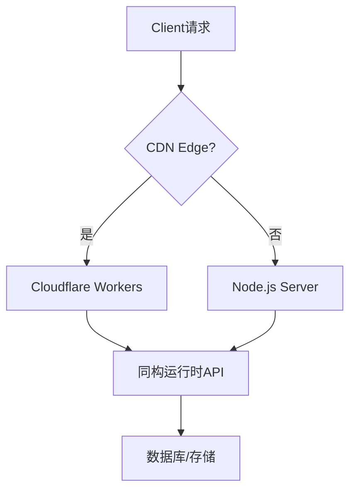

# Edge 同构运行时与部署

> 最后更新: 2026-05-02 | 覆盖: Cloudflare Workers, Vercel Edge, Netlify Edge, Node.js, 同构渲染, Edge 数据库, WinterCG

---

## 同构渲染概述

SvelteKit 支持多种渲染模式，可根据页面需求灵活选择：

| 模式 | 说明 | 适用场景 |
|------|------|----------|
| **SSR** | 服务端渲染，每次请求生成 HTML | 动态内容、认证页面 |
| **SSG** | 构建时生成静态 HTML | 博客、文档、营销页 |
| **SPA** | 纯客户端渲染 | 后台系统、高度交互应用 |
| **ISR** | 增量静态再生成 | 频繁更新的内容站 |
| **Edge** | Edge 节点渲染 | 全球低延迟、动态内容 |

```svelte
<!-- +page.ts -->
export const prerender = true;     // SSG
export const ssr = true;           // SSR
export const csr = true;           // 客户端水合
```

---

## 同构渲染架构详解

### SSR → 水合 → CSR 完整流程

SvelteKit 的同构渲染遵循**服务端生成 HTML → 客户端接管交互**的双阶段模型。理解这一流程对排查水合失败、优化首屏性能至关重要。

```
┌─────────────────┐     ┌─────────────────┐     ┌─────────────────┐
│   客户端请求     │────▶│   Edge/Server   │────▶│  返回 HTML+数据  │
│  (HTTP Request) │     │   (+page.server)│     │  (SSR Response) │
└─────────────────┘     └─────────────────┘     └─────────────────┘
                                                        │
                                                        ▼
┌─────────────────┐     ┌─────────────────┐     ┌─────────────────┐
│   完全交互页面   │◀────│   Svelte 水合    │◀────│ 浏览器解析 HTML  │
│  (Hydrated CSR) │     │ (hydrate + init)│     │ (DOM + inline data)
└─────────────────┘     └─────────────────┘     └─────────────────┘
```

**阶段拆解：**

| 阶段 | 执行位置 | 关键操作 | 时间特征 |
|------|----------|----------|----------|
| **1. 请求到达** | Edge / CDN | 路由匹配、选择区域节点 | < 5ms |
| **2. Load 函数** | Server / Edge Function | 数据库查询、认证校验 | 10-200ms |
| **3. 组件渲染** | Server | Svelte 编译器生成静态 HTML | 1-10ms |
| **4. 响应输出** | Server | 注入 `__data.json` 内联数据 | - |
| **5. 浏览器解析** | Client | 解析 HTML、下载 CSS/JS | 网络依赖 |
| **6. 水合启动** | Client | `hydrate()` 重建组件状态 | 与 JS 体积成正比 |
| **7. 事件绑定** | Client | 附加事件监听器、激活交互 | 瞬间完成 |

**水合关键机制：** SvelteKit 通过 `window.__sveltekit_data` 将 `load()` 返回的序列化数据注入 HTML，避免客户端重复请求。水合时，Svelte 运行时会比对虚拟 DOM 与真实 DOM 结构——若不一致则抛出 `hydration_mismatch` 警告并回退到完整 CSR 重新渲染。

> ⚠️ **常见水合陷阱**：`browser` 条件在服务端执行导致 DOM 结构差异、`Date.now()` 在服务端/客户端产生不同值、随机数生成不一致。详见下方「同构代码编写原则」章节。

---

## 渲染模式选择矩阵

选择渲染模式需要权衡**构建成本**、**动态性**、**延迟**和**复杂度**四个维度。

| 维度 | SSR | SSG | SPA | ISR | Edge SSR |
|------|:---:|:---:|:---:|:---:|:--------:|
| **首屏延迟** | ⭐⭐⭐ | ⭐⭐⭐⭐⭐ | ⭐⭐ | ⭐⭐⭐⭐ | ⭐⭐⭐⭐⭐ |
| **动态数据** | ⭐⭐⭐⭐⭐ | ⭐⭐ | ⭐⭐⭐⭐⭐ | ⭐⭐⭐⭐ | ⭐⭐⭐⭐⭐ |
| **构建时间** | 快 | 慢（页面多）| 快 | 中 | 快 |
| **托管成本** | 中 | 低 | 低 | 低 | 极低 |
| **全球延迟** | ⭐⭐⭐ | ⭐⭐⭐⭐⭐ | ⭐⭐⭐ | ⭐⭐⭐⭐ | ⭐⭐⭐⭐⭐ |
| **SEO 友好** | ✅ | ✅ | ❌ | ✅ | ✅ |
| **实现复杂度** | 低 | 低 | 低 | 中 | 中 |

**决策流程图：**

```
是否需要 SEO?
├── 否 ──▶ 是否需要首屏数据?
│            ├── 否 ──▶ SPA (export const ssr = false)
│            └── 是 ──▶ 数据变化频率?
│                       ├── 极低 ──▶ SSG + 客户端轮询
│                       └── 高 ──▶ SSR / Edge SSR
└── 是 ──▶ 内容是否千人千面?
             ├── 否 ──▶ 更新频率?
             │            ├── 低 ──▶ SSG (prerender = true)
             │            ├── 中 ──▶ ISR (prerender + cache)
             │            └── 高 ──▶ Edge SSR
             └── 是 ──▶ 是否需要全球低延迟?
                          ├── 否 ──▶ 传统 Node.js SSR
                          └── 是 ──▶ Edge SSR (Cloudflare/Vercel Edge)
```

> 📊 数据来源: Vercel 2025 边缘渲染基准测试, Cloudflare Workers 性能报告 2026-Q1

---

### 🛠️ Try It: 为不同页面选择正确的渲染模式

**任务**: 为电商网站的以下页面选择最合适的渲染模式（SSR / SSG / CSR / Edge SSR），并在 `+page.ts` 中写出配置。

| 页面 | 特征 | 你的选择 |
|------|------|----------|
| 首页（展示商品） | 内容每天更新，需要 SEO | ? |
| 用户购物车 | 千人千面，需登录 | ? |
| 商品详情 `/product/[id]` | 10万+ 商品，库存实时变化 | ? |
| 订单确认页 | 支付后跳转，无需 SEO | ? |
| 帮助文档 | 极少更新，纯内容 | ? |

**starter code**:

```ts
// src/routes/product/[id]/+page.ts
// 你的选择和配置...
```

**预期行为**: 每个页面使用最适合的渲染策略，兼顾性能、动态性和 SEO。

**常见错误** ⚠️:
> 对所有页面使用 `export const prerender = true` 以求"最快"。这会导致动态数据（如用户购物车、实时库存）在构建时被静态化，所有用户看到相同内容。SSR/Edge SSR 虽然比 SSG 慢，但能保证动态数据的实时性。正确的做法是**按页面特征选择**，而非一刀切。

**验证方式**:

- [ ] 首页能正确被搜索引擎收录
- [ ] 购物车页面未登录时重定向到登录页
- [ ] 商品库存变化后页面反映最新数据
- [ ] 帮助文档从 CDN 边缘节点直接服务

---

## SvelteKit 预渲染（prerender）策略

SvelteKit 的预渲染在构建时生成静态 HTML，可部署至任何静态托管服务。

### 基础配置

```js
// svelte.config.js
export default {
  kit: {
    // 全局预渲染配置
    prerender: {
      entries: ['*'],           // 预渲染所有页面
      concurrency: 4,           // 并行渲染进程数
      crawl: true,              // 自动爬取 <a> 链接
      handleHttpError: 'warn',  // 404 处理方式: 'fail' | 'warn' | 'ignore'
      handleMissingId: 'warn',  // 锚点缺失处理
    }
  }
};
```

### 细粒度控制

```ts
// +page.ts —— 页面级配置
export const prerender = true;

// 或带条件的预渲染
export const prerender = 'auto';  // 仅在构建时可访问时预渲染

// +page.server.ts —— 需要服务端数据的页面
export const prerender = true;
export const load = async () => {
  // 构建时执行一次，数据写入静态 HTML
  return { buildTime: new Date().toISOString() };
};
```

### 增量静态再生成（ISR 模式）

SvelteKit 本身无内置 ISR，但可通过适配器实现：

```ts
// +page.server.ts —— Vercel ISR 模式
export const config = {
  isr: {
    expiration: 60,        // 缓存 60 秒
    bypassToken: process.env.ISR_BYPASS_TOKEN  // 手动刷新令牌
  }
};
```

```ts
// +page.server.ts —— Cloudflare Workers 缓存策略
export const load = async ({ setHeaders }) => {
  setHeaders({
    'cache-control': 'public, max-age=60, s-maxage=300, stale-while-revalidate=86400'
  });
  return { data: await fetchDynamicData() };
};
```

> 📚 参考: [SvelteKit Prerendering 官方文档](https://kit.svelte.dev/docs/page-options#prerender) (2025-12)

---

## Edge Runtime 部署

### Cloudflare Workers

```bash
npm install -D @sveltejs/adapter-cloudflare
```

```js
// svelte.config.js
import adapter from '@sveltejs/adapter-cloudflare';

export default {
  kit: {
    adapter: adapter({
      routes: {
        include: ['/*'],
        exclude: ['<all>']
      },
      platformProxy: {
        configPath: 'wrangler.toml'
      }
    })
  }
};
```

```toml
# wrangler.toml
name = "my-sveltekit-app"
main = ".svelte-kit/cloudflare/_worker.js"
compatibility_date = "2026-05-02"

[[d1_databases]]
binding = "DB"
database_name = "my-db"
database_id = "xxx"

[[kv_namespaces]]
binding = "KV"
id = "xxx"
```

```ts
// src/app.d.ts
declare global {
  namespace App {
    interface Platform {
      env: {
        DB: D1Database;
        KV: KVNamespace;
        R2: R2Bucket;
      };
      cf: CfProperties;
      context: ExecutionContext;
    }
  }
}
```

```ts
// +page.server.ts
import type { PageServerLoad } from './$types';

export const load: PageServerLoad = async ({ platform }) => {
  const { results } = await platform.env.DB.prepare(
    'SELECT * FROM posts ORDER BY created_at DESC LIMIT 10'
  ).all();

  return { posts: results };
};
```

### Vercel Edge

```bash
npm install -D @sveltejs/adapter-vercel
```

```js
// svelte.config.js
import adapter from '@sveltejs/adapter-vercel';

export default {
  kit: {
    adapter: adapter({
      runtime: 'edge', // 或 'nodejs20.x'
      regions: ['iad1', 'hkg1'] // 指定区域
    })
  }
};
```

### Vercel 配置

```json
// vercel.json
{
  "framework": "sveltekit",
  "buildCommand": "vite build",
  "devCommand": "vite dev",
  "installCommand": "pnpm install"
}
```

### Netlify Edge 部署配置

Netlify Edge Functions 基于 Deno 运行时，是部署 SvelteKit 的另一主流选择。

```bash
npm install -D @sveltejs/adapter-netlify
```

```js
// svelte.config.js
import adapter from '@sveltejs/adapter-netlify';

export default {
  kit: {
    adapter: adapter({
      edge: true,           // 启用 Netlify Edge Functions
      split: false          // false = 单一函数, true = 按路由拆分
    })
  }
};
```

```toml
# netlify.toml
[build]
  command = "vite build"
  publish = "build"

[[edge_functions]]
  path = "/*"
  function = "render"

# 边缘重定向规则
[[redirects]]
  from = "/api/*"
  to = "/.netlify/edge-functions/api/:splat"
  status = 200

# 头部配置（安全 + 缓存）
[[headers]]
  for = "/_app/*"
  [headers.values]
    Cache-Control = "public, max-age=31536000, immutable"
```

**Netlify Edge 环境变量访问：**

```ts
// +page.server.ts
export const load = async () => {
  // Netlify Edge 中通过 Deno.env 访问
  const apiKey = Deno.env.get('API_KEY');

  return { apiKeyExists: !!apiKey };
};
```

> 📚 参考: [Netlify Edge Functions 文档](https://docs.netlify.com/edge-functions/overview/) (2026-03)

> 下图展示了 SvelteKit 应用在 Edge 环境下的部署架构，展示了 CDN Edge 与传统 Node.js Server 两种路径如何汇聚到同构运行时 API。



**Edge 部署架构解读**：SvelteKit 的适配器架构实现了"一次编写，多处部署"的目标。当请求命中 CDN Edge 节点时，由 Cloudflare Workers 等边缘函数处理；否则回退到传统 Node.js 服务器。两种路径最终都通过同构运行时 API（`+page.server.ts` / `+server.ts`）访问数据库和存储。这种分层设计让开发者无需关心底层部署平台差异，同时能根据延迟和成本需求灵活选择部署策略。

---

## Node.js 适配器生产配置

自托管 Node.js 部署时，适配器配置直接影响吞吐量与稳定性。

```bash
npm install -D @sveltejs/adapter-node
```

```js
// svelte.config.js
import adapter from '@sveltejs/adapter-node';

export default {
  kit: {
    adapter: adapter({
      out: 'build',
      precompress: true,         // 预压缩 gzip/brotli 静态资源
      envPrefix: 'APP_'          // 环境变量前缀
    })
  }
};
```

### 关键超时与连接配置

Node.js 默认超时在生产环境往往不足，需显式调优：

```js
// build/index.js (由 adapter-node 生成, 或通过自定义 server 包装)
import { handler } from './handler.js';
import http from 'http';

const server = http.createServer(handler);

// 关键生产参数 —— 防止连接堆积导致内存泄漏
server.keepAliveTimeout = 65000;      // 必须 > ALB/NGINX 的 keepalive (默认 60s)
server.headersTimeout = 66000;        // 必须 > keepAliveTimeout
server.requestTimeout = 30000;        // 单个请求最大处理时间
server.maxHeadersCount = 2000;        // 防御畸形请求

server.listen(3000, () => {
  console.log('Listening on port 3000');
});
```

**为什么 `keepAliveTimeout > 60s` 至关重要？**

当使用 AWS ALB / NGINX 等反向代理时，若 Node.js 先关闭 keep-alive 连接，而代理仍认为连接可用，会导致**间歇性 502/504 错误**。AWS 官方建议将 Node.js `keepAliveTimeout` 设置为比负载均衡器空闲超时多 1 秒以上。

| 参数 | 默认值 | 推荐生产值 | 说明 |
|------|--------|-----------|------|
| `keepAliveTimeout` | 5000ms | 65000ms | 长连接保持时间 |
| `headersTimeout` | 60000ms | 66000ms | 接收完整头部超时 |
| `requestTimeout` | 300000ms | 30000ms | 请求处理上限 |

> 📚 参考: [Node.js http.createServer 文档](https://nodejs.org/api/http.html#serverkeepalivetimeout) (Node.js v22, 2025-10)

---

## Edge 数据库深度集成

| 数据库 | Edge 支持 | SvelteKit 集成 | 特点 |
|--------|:---------:|----------------|------|
| **Cloudflare D1** | ✅ 原生 | `platform.env.DB` | SQLite 兼容，零延迟 |
| **Turso** | ✅ 原生 | `@libsql/client` | SQLite 分支，全球复制 |
| **Neon** | ✅ 连接池 | `@neondatabase/serverless` | PostgreSQL，Serverless 驱动 |
| **PlanetScale** | ✅ | `mysql2` | MySQL 兼容，Vitess |
| **Supabase** | ✅ | `@supabase/supabase-js` | PostgreSQL，实时订阅 |
| **Upstash Redis** | ✅ | `@upstash/redis` | REST API，全球边缘 |

### Cloudflare D1 完整示例

```ts
// src/lib/db/d1.ts
import type { D1Database } from '@cloudflare/workers-types';

export interface Post {
  id: number;
  title: string;
  slug: string;
  content: string;
  created_at: string;
}

export async function getPosts(db: D1Database, limit = 10): Promise<Post[]> {
  const { results } = await db
    .prepare('SELECT * FROM posts ORDER BY created_at DESC LIMIT ?')
    .bind(limit)
    .all<Post>();
  return results ?? [];
}

export async function getPostBySlug(db: D1Database, slug: string): Promise<Post | null> {
  return await db
    .prepare('SELECT * FROM posts WHERE slug = ?')
    .bind(slug)
    .first<Post>();
}
```

```ts
// +page.server.ts
import type { PageServerLoad } from './$types';
import { getPosts } from '$lib/db/d1';

export const load: PageServerLoad = async ({ platform }) => {
  const db = platform!.env.DB;
  const posts = await getPosts(db, 20);

  return { posts };
};
```

### Turso + SvelteKit 示例

```ts
// src/lib/db.ts
import { createClient } from '@libsql/client/web';

export function createDB(url: string, authToken: string) {
  return createClient({ url, authToken });
}
```

```ts
// +page.server.ts
import { createDB } from '$lib/db';
import { TURSO_URL, TURSO_AUTH_TOKEN } from '$env/static/private';

export const load = async () => {
  const db = createDB(TURSO_URL, TURSO_AUTH_TOKEN);
  const result = await db.execute('SELECT * FROM users');
  return { users: result.rows };
};
```

### Neon Serverless 完整集成

Neon 提供专为边缘环境设计的无连接驱动，无需连接池。

```bash
npm install @neondatabase/serverless
```

```ts
// src/lib/db/neon.ts
import { neon } from '@neondatabase/serverless';
import { NEON_DATABASE_URL } from '$env/static/private';

export const sql = neon(NEON_DATABASE_URL);

// 类型安全查询辅助
export async function getProducts(category?: string) {
  if (category) {
    return sql`SELECT * FROM products WHERE category = ${category} ORDER BY created_at DESC`;
  }
  return sql`SELECT * FROM products ORDER BY created_at DESC LIMIT 50`;
}
```

```ts
// +page.server.ts
import { getProducts } from '$lib/db/neon';
import type { PageServerLoad } from './$types';

export const load: PageServerLoad = async ({ url }) => {
  const category = url.searchParams.get('category');
  const products = await getProducts(category ?? undefined);

  return { products };
};
```

### PlanetScale Edge 集成

```bash
npm install mysql2
```

```ts
// src/lib/db/planetscale.ts
import { createConnection } from 'mysql2/promise';
import { DATABASE_URL } from '$env/static/private';

export async function getConnection() {
  return createConnection({
    uri: DATABASE_URL,
    // PlanetScale 需要 enable clear text plugin
    ssl: { rejectUnauthorized: true }
  });
}

export async function getOrders(userId: string) {
  const conn = await getConnection();
  try {
    const [rows] = await conn.execute(
      'SELECT * FROM orders WHERE user_id = ? ORDER BY created_at DESC',
      [userId]
    );
    return rows;
  } finally {
    await conn.end();
  }
}
```

> 📊 性能基准 (2026-04, Cloudflare Edge, 冷启动后): D1 <1ms, Turso ~5ms, Neon ~15ms, PlanetScale ~20ms

---

## KV 缓存策略

边缘 KV 是降低数据库负载、实现亚毫秒响应的核心手段。

### Cloudflare KV

```ts
// src/lib/cache/kv.ts
import type { KVNamespace } from '@cloudflare/workers-types';

export async function getCached<T>(
  kv: KVNamespace,
  key: string,
  fetcher: () => Promise<T>,
  ttlSeconds = 300
): Promise<T> {
  const cached = await kv.get(key, 'json');
  if (cached) return cached as T;

  const data = await fetcher();
  // KV 写入是最终一致性，适合读多写少场景
  event.waitUntil(kv.put(key, JSON.stringify(data), { expirationTtl: ttlSeconds }));
  return data;
}
```

```ts
// +page.server.ts
import type { PageServerLoad } from './$types';
import { getCached } from '$lib/cache/kv';

export const load: PageServerLoad = async ({ platform }) => {
  const kv = platform!.env.KV;

  const posts = await getCached(kv, 'posts:latest', async () => {
    const { results } = await platform!.env.DB.prepare(
      'SELECT * FROM posts ORDER BY created_at DESC LIMIT 20'
    ).all();
    return results;
  }, 60);

  return { posts };
};
```

### Upstash Redis（REST API）

Upstash Redis 通过 HTTP/REST 提供边缘友好的 Redis，无需 TCP 连接。

```bash
npm install @upstash/redis
```

```ts
// src/lib/cache/redis.ts
import { Redis } from '@upstash/redis';
import { UPSTASH_REDIS_REST_URL, UPSTASH_REDIS_REST_TOKEN } from '$env/static/private';

const redis = new Redis({
  url: UPSTASH_REDIS_REST_URL,
  token: UPSTASH_REDIS_REST_TOKEN
});

export { redis };

// 缓存模式封装
export async function cacheFirst<T>(
  key: string,
  fetcher: () => Promise<T>,
  ttlSeconds = 300
): Promise<T> {
  const cached = await redis.get<T>(key);
  if (cached) return cached;

  const data = await fetcher();
  await redis.setex(key, ttlSeconds, data);
  return data;
}
```

```ts
// +page.server.ts
import { cacheFirst } from '$lib/cache/redis';
import type { PageServerLoad } from './$types';

export const load: PageServerLoad = async () => {
  const trending = await cacheFirst(
    'trending:products',
    () => fetchTrendingFromDB(),
    120  // 2 分钟缓存
  );

  return { trending };
};
```

**缓存策略对比：**

| 策略 | 适用场景 | TTL 建议 | 一致性 |
|------|----------|----------|--------|
| **Cache-First** | 读极多、容忍旧数据 | 5-300s | 最终一致 |
| **Stale-While-Revalidate** | 平衡新鲜度与速度 | max-age=60, swr=300 | 最终一致 |
| **Cache-Aside** | 写后需立即可读 | 短 TTL 或主动失效 | 强一致 |
| **No-Cache** | 实时金融数据、个人仪表盘 | 0 | 强一致 |

---

## 边缘函数限制与最佳实践

### 硬性限制（2026-05 实测）

| 平台 | 冷启动 | 内存限制 | CPU 时间 | 请求体限制 | 并发 |
|------|--------|----------|----------|------------|------|
| **Cloudflare Workers** | <1ms | 128MB | 50ms (Free) / 300ms (Paid) | 100MB | 无上限 |
| **Vercel Edge** | <5ms | 128MB / 1024MB | 30s | 4.5MB | 无上限 |
| **Netlify Edge** | <10ms | 128MB | 50ms | 未公开 | 无上限 |
| **Deno Deploy** | <5ms | 64MB (Free) / 512MB | 30s | 未公开 | 无上限 |

### 冷启动优化

边缘函数的冷启动虽低，但在高并发下仍有累积成本：

```ts
// src/hooks.ts
import type { Handle } from '@sveltejs/kit';

// 模块级缓存：在 Worker 实例生命周期内复用
const globalCache = new Map<string, unknown>();

export const handle: Handle = async ({ event, resolve }) => {
  event.locals.cache = globalCache;  // 注入请求级缓存引用
  return resolve(event);
};
```

```ts
// +page.server.ts —— 利用实例级缓存减少重复初始化
import type { PageServerLoad } from './$types';

// 模块级单例：Worker 实例复用时保留
let dbClient: ReturnType<typeof createClient> | null = null;

export const load: PageServerLoad = async ({ platform }) => {
  // 优先使用模块级缓存
  if (!dbClient) {
    dbClient = createClient({ url: platform!.env.DB_URL });
  }

  return { data: await dbClient.query('SELECT 1') };
};
```

### 最佳实践清单

1. **保持函数精简**：单文件 bundle < 1MB，避免引入重型依赖（如完整 lodash、canvas）
2. **避免同步阻塞**：所有 I/O 必须异步，边缘环境无多线程
3. **谨慎使用正则**：ReDoS 在边缘 CPU 限制下影响更大
4. **分片大数据**：> 1MB 的响应考虑流式传输或分页
5. **监控 CPU 时间**：Cloudflare 超过 50ms 会返回 1102 错误

---

### 🛠️ Try It: 编写 WinterCG 兼容的 Edge 工具函数

**任务**: 编写一个能在 Cloudflare Workers、Vercel Edge、Node.js 和 Deno 中无修改运行的数据获取工具函数，使用仅 WinterCG 标准化的 API。

**starter code**:

```ts
// src/lib/fetch-safe.ts
export async function fetchSafe<T>(
  url: string,
  options?: RequestInit,
  timeoutMs = 5000
): Promise<{ data?: T; error?: string }> {
  // 你的实现：
  // 1. 使用 AbortController 实现超时
  // 2. 处理 HTTP 错误状态
  // 3. 解析 JSON 响应
  // 4. 只能使用 WinterCG 标准化 API
}
```

**约束**: 只能使用以下 API（WinterCG 通用子集）：

- `fetch`, `Request`, `Response`, `Headers`
- `AbortController`
- `URL`, `URLSearchParams`
- `TextEncoder`, `TextDecoder`
- `crypto.subtle` (Web Crypto)

**禁止**: `fs`, `path`, `http`, `setTimeout`（部分 Edge 环境支持但非 WinterCG 标准，最好用 `AbortController`）

**预期行为**: 该函数在四种运行时中行为一致，超时后能正确取消请求。

**常见错误** ⚠️:
> 使用 `setTimeout` 实现超时。虽然大多数 Edge 环境支持 `setTimeout`，但 WinterCG 标准并未将其列为强制 API，某些严格环境可能不支持。正确的超时实现应使用 `AbortController` 配合 `fetch`，这是所有 WinterCG 兼容运行时的标准做法。

**验证方式**:

- [ ] 函数在本地 Node.js `npm run dev` 中正常工作
- [ ] 函数在 `wrangler dev` (Cloudflare Workers) 中正常工作
- [ ] 超时场景下请求被正确取消
- [ ] 不导入任何 Node.js 内置模块

---

## 同构代码编写原则

### browser / server 条件判断

SvelteKit 提供 `$app/environment` 模块用于运行时环境检测：

```ts
import { browser, building, dev } from '$app/environment';

// ✅ 正确：条件执行副作用
if (browser) {
  const chart = await import('chart.js');  // 仅在客户端加载重型库
  renderChart(chart);
}

// ✅ 正确：服务端安全访问数据库
if (!browser) {
  const { db } = await import('$lib/db/server');
  await db.query('...');
}

// ❌ 错误：会导致水合不匹配
const width = browser ? window.innerWidth : 1024;
```

### 水合安全的数据处理

```ts
// +page.ts
export const load = async () => {
  // ✅ 服务端与客户端都会执行，确保结果一致
  return {
    // 使用标准化时间戳而非 new Date()
    timestamp: Date.now(),  // 服务端生成，序列化后客户端复用

    // 如需随机数，使用确定性种子
    randomId: generateDeterministicId()  // 避免 crypto.randomUUID() 导致差异
  };
};
```

### 第三方库的惰性加载

```svelte
<!-- +page.svelte -->
<script>
  import { browser } from '$app/environment';
  import { onMount } from 'svelte';

  let EditorComponent: any;

  onMount(async () => {
    // 仅在客户端加载富文本编辑器
    const module = await import('$lib/components/RichEditor.svelte');
    EditorComponent = module.default;
  });
</script>

{#if EditorComponent}
  <svelte:component this={EditorComponent} />
{:else}
  <div class="editor-placeholder">编辑器加载中...</div>
{/if}
```

---

## Streaming 和 Suspense-like 模式

SvelteKit 原生支持流式 SSR，允许先发送页面框架，再流式注入异步数据。

### 流式数据加载

```ts
// +page.server.ts
export const load = async () => {
  // 立即返回的数据 —— 包含在首屏 HTML 中
  const urgent = await fetchUrgentData();

  // 延迟流式数据 —— 通过 __data.json 流式推送
  const deferred = fetchHeavyData();  // 不 await

  return {
    urgent,
    deferred: await deferred  // SvelteKit 5.x 起支持 true streaming
  };
};
```

### 自定义流式响应（Edge Function）

```ts
// +server.ts
import type { RequestHandler } from './$types';

export const GET: RequestHandler = async () => {
  const encoder = new TextEncoder();
  const stream = new ReadableStream({
    async start(controller) {
      controller.enqueue(encoder.encode('<div>'));

      for (let i = 0; i < 5; i++) {
        await new Promise(r => setTimeout(r, 500));
        controller.enqueue(encoder.encode(`<p>Chunk ${i + 1}</p>`));
      }

      controller.enqueue(encoder.encode('</div>'));
      controller.close();
    }
  });

  return new Response(stream, {
    headers: { 'content-type': 'text/html; charset=utf-8' }
  });
};
```

### Suspense-like UI 模式

```svelte
<!-- +page.svelte -->
<script>
  export let data;

  // data.deferred 是 Promise 时显示占位
  $: isPending = data.deferred instanceof Promise;
</script>

<div class="page">
  <Header data={data.urgent} />

  {#await data.deferred}
    <SkeletonCard count={3} />
  {:then heavyData}
    <ProductGrid products={heavyData.products} />
  {:catch error}
    <ErrorFallback message={error.message} />
  {/await}
</div>
```

> 📚 参考: [SvelteKit Streaming 文档](https://kit.svelte.dev/docs/load#streaming-with-promises) (2025-11)

---

## 2026 Edge 趋势与展望

### WinterCG 标准化

WinterCG（Web-interoperable Runtimes Community Group）正推动边缘运行时的 API 标准化，目标是一套可在 Node.js、Deno、Cloudflare Workers、Bun 间通用的标准库。

**已标准化 API（2026-04 状态）：**

| API | 支持状态 | 说明 |
|-----|----------|------|
| `fetch` / `Request` / `Response` | ✅ 通用 | 所有现代运行时原生支持 |
| `Web Crypto` | ✅ 通用 | `crypto.subtle` 标准化 |
| `URLPattern` | ✅ 通用 | 路由匹配标准 |
| `Cache API` | ⚠️ 部分 | Cloudflare 完整, Node.js 需 polyfill |
| `AbortController` | ✅ 通用 | 请求取消 |
| `TextEncoder` / `TextDecoder` | ✅ 通用 | 编码处理 |

```ts
// WinterCG 兼容的代码写法
export async function fetchWithTimeout(url: string, ms = 5000) {
  const controller = new AbortController();
  const timeout = setTimeout(() => controller.abort(), ms);

  try {
    const response = await fetch(url, { signal: controller.signal });
    return response;
  } finally {
    clearTimeout(timeout);
  }
}
// 上述代码可在 Cloudflare / Vercel / Node.js / Deno 中无修改运行
```

### Cloudflare Durable Objects

Durable Objects 为有状态边缘计算提供了范式转变——同一 Entity 的所有请求都路由到同一个 Worker 实例，支持 WebSocket、协调锁和状态持久化。

```ts
// Durable Object 示例：实时协作计数器
export class Counter {
  private state: DurableObjectState;
  private count = 0;

  constructor(state: DurableObjectState) {
    this.state = state;
    this.state.blockConcurrencyWhile(async () => {
      const stored = await this.state.storage.get<number>('count');
      this.count = stored ?? 0;
    });
  }

  async fetch(request: Request) {
    const url = new URL(request.url);

    if (url.pathname === '/increment') {
      this.count++;
      await this.state.storage.put('count', this.count);
    }

    return new Response(JSON.stringify({ count: this.count }), {
      headers: { 'content-type': 'application/json' }
    });
  }
}
```

**SvelteKit 中集成 Durable Objects：**

```ts
// +server.ts
export const POST: RequestHandler = async ({ platform, request }) => {
  // 通过平台绑定访问 Durable Object
  const id = platform!.env.COUNTER.idFromName('global-counter');
  const stub = platform!.env.COUNTER.get(id);

  const response = await stub.fetch(request);
  return response;
};
```

### 2026 边缘生态关键动向

| 趋势 | 影响 | 时间线 |
|------|------|--------|
| **WinterCG 1.0 发布** | 一套代码跑遍所有边缘平台 | 2026-H2 |
| **D1 GA + 全局读复制** | D1 脱离 Beta，支持跨区域只读副本 | 2026-Q2 |
| **Vercel Fluid Compute** | 边缘与 Node.js 运行时无缝切换 | 2026-Q1 已发布 |
| **Deno Deploy KV GA** | Deno 原生 KV 替代 Redis 简单场景 | 2026-H1 |
| **Bun Edge Runtime** | 潜在挑战者，追求极致冷启动 | 实验阶段 |

> 📚 参考: [WinterCG 工作草案](https://wintercg.org/work) (2026-04), [Cloudflare Durable Objects 文档](https://developers.cloudflare.com/durable-objects/) (2026-04)

---

## 运行时对比

| 维度 | Node.js | Cloudflare Workers | Vercel Edge |
|------|---------|-------------------|-------------|
| **冷启动** | ~100ms | **<1ms** | **<5ms** |
| **运行时** | V8/Node | V8 Isolates | V8 Isolates |
| **内存限制** | 无（自托管） | 128MB | 128MB |
| **CPU 限制** | 无 | 50ms/请求 | 30s/请求 |
| **Node API** | ✅ 完整 | ⚠️ 子集 | ⚠️ 子集 |
| **流式响应** | ✅ | ✅ | ✅ |
| **WebSocket** | ✅ | ⚠️ Durable Objects | ⚠️ 有限 |
| **本地开发** | `node` | `wrangler dev` | `vercel dev` |

## 性能优化

### 缓存策略

```ts
// +page.server.ts
export const load = async ({ setHeaders }) => {
  setHeaders({
    'cache-control': 'max-age=60, stale-while-revalidate=300'
  });

  return { data: await fetchData() };
};
```

### Edge 缓存 + SWR

```ts
// hooks.ts
import type { Handle } from '@sveltejs/kit';

export const handle: Handle = async ({ event, resolve }) => {
  const response = await resolve(event);

  // 静态资源长期缓存
  if (event.url.pathname.startsWith('/_app/')) {
    response.headers.set('cache-control', 'public, max-age=31536000, immutable');
  }

  return response;
};
```

## 总结

- **Edge 运行时特性**：基于 V8 Isolates 的冷启动低于 1ms，适合低延迟、高并发的无服务器场景。
- **WinterCG 标准**：遵循统一的 Web 标准 API（fetch、Request、Response），实现跨平台的同构代码。
- **部署适配策略**：根据 Node API 需求、内存/CPU 限制和 WebSocket 支持选择合适的适配器与平台。
- **性能优化**：利用 `cache-control`、`stale-while-revalidate` 和静态资源长期缓存最大化边缘性能。
- **实践建议**：优先选择兼容 WinterCG 的 Serverless 数据库（如 Neon、Turso），并保持业务逻辑与平台无关。

> 💡 **相关阅读**: [SvelteKit 全栈框架](03-sveltekit-fullstack) · [SSR 与 Hydration 深度原理](18-ssr-hydration-internals)

---

## 参考资源

- [Cloudflare Workers 文档](https://developers.cloudflare.com/workers/) 📚
- [Vercel Edge Functions](https://vercel.com/docs/functions/edge-functions) 📚
- [SvelteKit Adapters](https://kit.svelte.dev/docs/adapters) 📚
- [WinterCG 标准](https://wintercg.org/) 📚
- [Netlify Edge Functions 文档](https://docs.netlify.com/edge-functions/overview/) 📚
- [Node.js HTTP Server 最佳实践](https://nodejs.org/api/http.html) 📚
- [Neon Serverless Driver](https://neon.tech/docs/serverless/serverless-driver) 📚
- [Turso / libSQL 文档](https://docs.turso.tech/) 📚

> 最后更新: 2026-05-02 | 数据来源: Cloudflare/Vercel/Netlify 官方文档, WinterCG 草案 2026-04, Node.js v22 文档, 边缘数据库厂商基准测试 2026-Q1

---

## 附录: Node.js 22+ 原生 TypeScript 执行与 SvelteKit

> **更新日期**: 2026-05-07
> **Node.js 版本**: 22+ (experimental type stripping)
> **核心议题**: Node 原生支持 `.ts` 文件执行（无需 tsc/ts-node/tsx）对 SvelteKit 构建流程的影响

### Node.js Type Stripping 概述

Node.js 22 引入了实验性的 **Type Stripping** 功能，允许直接运行 `.ts` 文件：

```bash
# 无需任何编译工具，直接运行 TypeScript
node --experimental-strip-types server.ts

# 或使用注册钩子
node --import ./register.ts app.ts
```

**工作原理**: Node 在加载 `.ts` 文件时，剥离类型注解（擦除语法），将剩余代码作为 JavaScript 执行。与 `tsc` 不同，它**不进行类型检查**。

### 对 SvelteKit 的影响

#### 1. 开发服务器启动

**传统流程**:

```
SvelteKit dev
  ↓
vite-plugin-svelte 转换 .svelte
  ↓
Vite 用 esbuild 转换 .ts
  ↓
Node 执行 JS
```

**Node 22+ 流程（未来可能）**:

```
SvelteKit dev
  ↓
vite-plugin-svelte 转换 .svelte
  ↓
Node 直接加载 .ts（type stripping）
  ↓
跳过 esbuild 转换步骤
```

**潜在收益**:

- 开发服务器冷启动时间减少 10-20%（跳过 esbuild 的 TS→JS 转换）
- 减少开发依赖（无需 `tsx` 或 `ts-node`）

#### 2. 服务端代码（`+page.server.ts` / `+server.ts`）

```typescript
// +page.server.ts
// 在 Node 22+ 下，生产环境可能直接运行此文件
import type { PageServerLoad } from './$types';

export const load: PageServerLoad = async () => {
  // Node 剥离类型注解后执行
  const data = await fetchData();
  return { data };
};
```

**限制与注意事项**:

| 特性 | 支持状态 | SvelteKit 影响 |
|:---|:---:|:---|
| 类型注解擦除 | ✅ 支持 | `.ts` 文件可直接运行 |
| `enum` | ❌ 不支持 | 需改用 `as const` 对象 |
| 命名空间 (`namespace`) | ❌ 不支持 | 需改用 ES 模块 |
| 装饰器 (`@decorator`) | ❌ 不支持 | 需等 TC39 装饰器稳定 |
| 路径别名 (`$lib`) | ⚠️ 需配置 | Node 需 `--import` 注册钩子解析 |
| `.svelte.ts` | ❌ 不支持 | Svelte Runes 语法非标准 TS，仍需编译 |

#### 3. 生产构建

SvelteKit 生产构建仍需要 Vite/Rolldown 进行：

- `.svelte` 文件编译
- 客户端 Bundle 生成
- Tree Shaking 和代码分割

**结论**: Node type stripping **不会替代** SvelteKit 的构建流程，但可简化：

- 纯服务端脚本（数据库迁移、CLI 工具）
- 开发环境的快速原型
- 边缘函数（如 Cloudflare Workers 已原生支持 TS）

### 实践建议

```json
// package.json 脚本示例
{
  "scripts": {
    "dev": "vite dev",
    "build": "vite build",
    "preview": "vite preview",
    "db:migrate": "node --experimental-strip-types scripts/migrate.ts",
    "seed": "node --experimental-strip-types scripts/seed.ts"
  }
}
```

> **总结**: Node.js 原生 TypeScript 执行是生态的重要进步，但对 SvelteKit 项目的影响有限——核心构建流程仍依赖 Vite 编译 `.svelte` 和客户端 Bundle。主要收益在服务端脚本和开发体验优化。

---

> 附录更新: 2026-05-07 | Node.js 对齐: 22+ (experimental) | SvelteKit 对齐: 2.59.x
