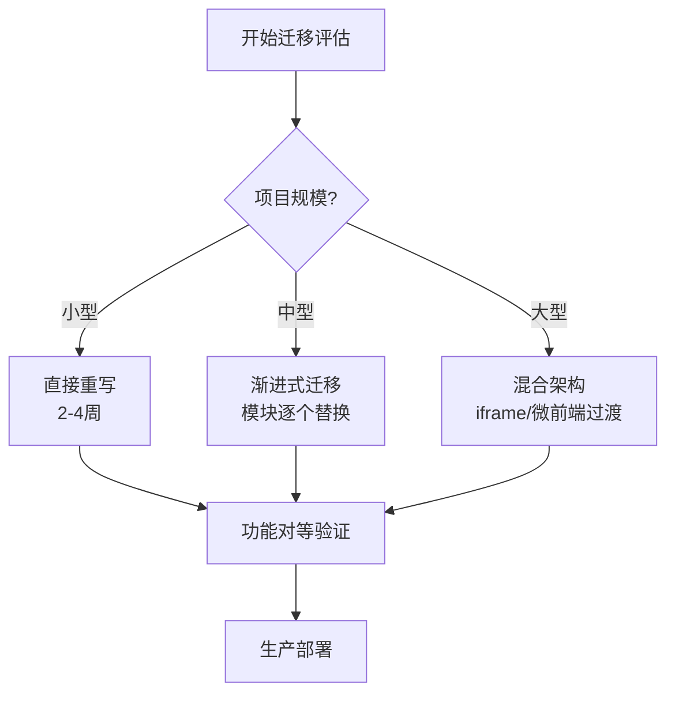
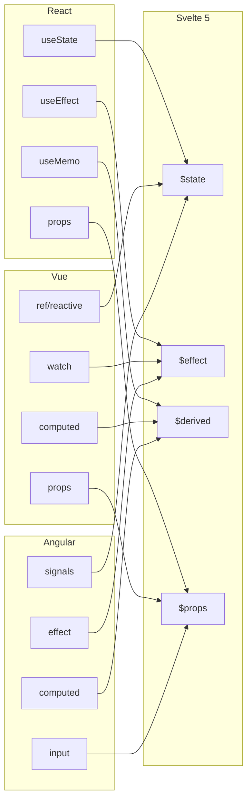

# 迁移到 Svelte 5：从 React / Vue / Angular 的完整迁移指南

> 本文提供从三大主流前端框架（React、Vue、Angular）迁移到 Svelte 5 的全路径指导，涵盖自动化工具、手动迁移步骤、渐进式策略、常见陷阱与成本估算。适合技术负责人、架构师及一线开发者参考。

---

## 概述

Svelte 5 引入了全新的响应式系统 —— **Runes**，这是一套编译器感知的细粒度响应式原语，彻底改变了状态管理、副作用处理和派生计算的方式。
与 React 的 Virtual DOM 重渲染模型、Vue 的 Proxy 响应式系统以及 Angular 的变更检测（Change Detection）机制相比，Svelte 5 的编译时优化带来了更小的 bundle 体积、更高的运行时性能和更直观的代码心智模型。

从主流框架迁移到 Svelte 5 并非简单的语法转换，而是一次涉及**架构思维、状态管理模式、组件通信机制**和**构建工具链**的系统性工程。
本指南将提供：

- **自动化迁移工具**的使用方法与局限性分析
- **概念映射表**帮助团队快速建立 Svelte 5 思维模型
- **逐框架（React / Vue / Angular）的详细迁移路径**
- **渐进式迁移策略**，降低生产环境风险
- **完整的迁移检查清单**，确保不遗漏关键环节
- **常见陷阱与解决方案**，基于真实项目经验总结
- **迁移成本估算模型**，辅助项目规划与资源分配

无论您是维护一个历史悠久的 Angular 企业级应用，还是正在迭代一个基于 React Hooks 的现代 SPA，抑或是从 Vue 3 Composition API 迁移，本指南都将提供可落地的操作建议。

---

## React → Svelte 5 迁移

React 是目前前端生态中占有率最高的框架之一，其函数组件 + Hooks 的编程模型深入人心。
从 React 迁移到 Svelte 5，核心变化在于：**从显式重新渲染管理转向编译器驱动的细粒度更新**。

### 自动化迁移

Svelte 官方提供了 `sv` CLI 工具，其中包含对 Svelte 5 的迁移支持。
对于已有 Svelte 4 项目升级到 Svelte 5 的场景，该工具可以自动处理大部分语法转换：

```bash
# 安装最新版 sv CLI
npm install -g sv

# 执行 Svelte 5 迁移（适用于现有 Svelte 项目升级）
npx sv migrate svelte-5

# 对于从 React 项目迁移，建议先创建新的 SvelteKit 项目骨架
npx sv create my-svelte-app
# 选择：SvelteKit minimal / SvelteKit demo / Library 等模板
```

::: warning 自动化工具的局限性
`sv migrate svelte-5` 主要处理**已有 Svelte 项目**的升级（如 `export let` 转为 `$props()`），它**无法直接将 React JSX 代码自动转换为 Svelte 模板**。从 React 迁移时，仍需手动重写组件逻辑，但可以借助社区工具辅助转换：

- **AST 转换脚本**：基于 Babel parser 将 JSX 结构映射为 Svelte HTML 模板
- **正则批量替换**：处理简单的 `className` → `class`、`htmlFor` → `for` 等属性映射
- **AI 辅助工具**：如使用 Claude / GPT-4 对单文件组件进行逐文件转换（建议配合 Code Review）
:::

### 概念映射

| React | Svelte 5 | 说明 |
|-------|----------|------|
| `useState` | `$state` | 状态声明，但 `$state` 在编译阶段即建立依赖追踪，无需显式 setter |
| `useEffect` | `$effect` | 副作用处理，`$effect` 自动追踪其内部读取的响应式状态 |
| `useMemo` | `$derived` | 派生计算，`$derived` 在依赖变化时自动重新求值 |
| `useCallback` | **无需对应** | Svelte 5 中函数传递默认稳定，无需 memoization |
| `props` | `$props` | 组件输入声明，`$props()` 支持解构、默认值和类型标注 |
| JSX | HTML 模板 | Svelte 使用类 HTML 模板语法，更接近原生 Web 开发体验 |
| `React Router` | SvelteKit 文件路由 | 基于文件系统的路由约定，支持 layouts、groups 和 dynamic segments |
| Context API | `.svelte.ts` 共享 | 全局状态建议通过 `.svelte.ts` 模块直接导出 `$state` 对象 |
| `forwardRef` | `bind:this` / `export` | DOM 引用通过 `bind:this` 直接绑定；组件暴露 API 通过 `export` 函数 |
| `key` prop | `{#key}` 块 | 强制重新创建组件或 DOM 节点时使用 `{#key value}...{/key}` |
| `Suspense` | `+page.js` load 函数 | SvelteKit 在路由层面支持数据预加载和 loading 状态管理 |
| `Error Boundary` | `$app/state` + `+error.svelte` | SvelteKit 提供页面级和布局级错误边界 |

### 代码对比示例

#### 状态管理与事件处理

```tsx
// React 示例：计数器组件
import { useState, useEffect, useCallback } from 'react';

interface CounterProps {
  initial?: number;
  step?: number;
  onChange?: (value: number) => void;
}

function Counter({ initial = 0, step = 1, onChange }: CounterProps) {
  const [count, setCount] = useState(initial);

  // 副作用：同步 document.title
  useEffect(() => {
    document.title = `Count: ${count}`;
    onChange?.(count);
  }, [count, onChange]);

  // 记忆化回调，避免子组件不必要的重渲染
  const increment = useCallback(() => {
    setCount(c => c + step);
  }, [step]);

  const decrement = useCallback(() => {
    setCount(c => c - step);
  }, [step]);

  return (
    <div className="counter">
      <button onClick={decrement}>-</button>
      <span>{count}</span>
      <button onClick={increment}>+</button>
    </div>
  );
}
```

```svelte
<!-- Svelte 5 等价实现 -->
<script lang="ts">
  interface Props {
    initial?: number;
    step?: number;
    onChange?: (value: number) => void;
  }

  let { initial = 0, step = 1, onChange }: Props = $props();
  let count = $state(initial);

  // $effect 自动追踪 count 的读取
  $effect(() => {
    document.title = `Count: ${count}`;
    onChange?.(count);
  });

  // 无需 useCallback，函数默认稳定
  function increment() {
    count += step;
  }

  function decrement() {
    count -= step;
  }
</script>

<div class="counter">
  <button onclick={decrement}>-</button>
  <span>{count}</span>
  <button onclick={increment}>+</button>
</div>

<style>
  .counter {
    display: flex;
    gap: 0.5rem;
    align-items: center;
  }
  button {
    padding: 0.25rem 0.75rem;
    cursor: pointer;
  }
</style>
```

#### 列表渲染与条件渲染

```tsx
// React：列表与条件渲染
import { useState } from 'react';

interface Todo {
  id: number;
  text: string;
  done: boolean;
}

function TodoList({ todos }: { todos: Todo[] }) {
  const [filter, setFilter] = useState<'all' | 'active' | 'done'>('all');

  const filteredTodos = todos.filter(t => {
    if (filter === 'active') return !t.done;
    if (filter === 'done') return t.done;
    return true;
  });

  return (
    <div>
      <div className="filters">
        {(['all', 'active', 'done'] as const).map(f => (
          <button
            key={f}
            className={filter === f ? 'active' : ''}
            onClick={() => setFilter(f)}
          >
            {f}
          </button>
        ))}
      </div>

      {filteredTodos.length === 0 ? (
        <p>暂无待办事项</p>
      ) : (
        <ul>
          {filteredTodos.map(todo => (
            <li key={todo.id} className={todo.done ? 'done' : ''}>
              {todo.text}
            </li>
          ))}
        </ul>
      )}
    </div>
  );
}
```

```svelte
<!-- Svelte 5：列表与条件渲染 -->
<script lang="ts">
  interface Todo {
    id: number;
    text: string;
    done: boolean;
  }

  interface Props {
    todos: Todo[];
  }

  let { todos }: Props = $props();
  let filter = $state<'all' | 'active' | 'done'>('all');

  // $derived 自动追踪 filter 和 todos 的变化
  let filteredTodos = $derived(
    todos.filter(t => {
      if (filter === 'active') return !t.done;
      if (filter === 'done') return t.done;
      return true;
    })
  );
</script>

<div>
  <div class="filters">
    {#each ['all', 'active', 'done'] as f (f)}
      <button
        class:active={filter === f}
        onclick={() => filter = f}
      >
        {f}
      </button>
    {/each}
  </div>

  {#if filteredTodos.length === 0}
    <p>暂无待办事项</p>
  {:else}
    <ul>
      {#each filteredTodos as todo (todo.id)}
        <li class:done={todo.done}>
          {todo.text}
        </li>
      {/each}
    </ul>
  {/if}
</div>

<style>
  .active { font-weight: bold; }
  .done { text-decoration: line-through; opacity: 0.6; }
</style>
```

#### Context API 迁移到 `.svelte.ts`

```tsx
// React：Theme Context
import { createContext, useContext, useState, type ReactNode } from 'react';

interface ThemeContextType {
  theme: 'light' | 'dark';
  toggleTheme: () => void;
}

const ThemeContext = createContext<ThemeContextType | undefined>(undefined);

export function ThemeProvider({ children }: { children: ReactNode }) {
  const [theme, setTheme] = useState<'light' | 'dark'>('light');

  const toggleTheme = () => setTheme(t => t === 'light' ? 'dark' : 'light');

  return (
    <ThemeContext.Provider value={{ theme, toggleTheme }}>
      {children}
    </ThemeContext.Provider>
  );
}

export function useTheme() {
  const ctx = useContext(ThemeContext);
  if (!ctx) throw new Error('useTheme must be used within ThemeProvider');
  return ctx;
}
```

```typescript
// Svelte 5：theme.svelte.ts（全局共享状态，无需 Provider 包裹）
// 这是 Svelte 5 最强大的特性之一：模块级响应式状态

function createTheme() {
  let theme = $state<'light' | 'dark'>('light');

  return {
    get theme() { return theme; },
    toggleTheme() {
      theme = theme === 'light' ? 'dark' : 'light';
    }
  };
}

export const themeStore = createTheme();
```

```svelte
<!-- 任意组件中直接使用，无需 Context Provider -->
<script>
  import { themeStore } from './theme.svelte.ts';
</script>

<button onclick={themeStore.toggleTheme}>
  当前主题：{themeStore.theme}
</button>
```

### 渐进式迁移策略

对于大型 React 应用，不建议一次性全量重写。以下策略已在多个生产项目中验证：

#### 1. 独立页面迁移（推荐）

将应用按路由页面拆分为独立模块，逐个页面重写为 Svelte 5 + SvelteKit。适合采用微前端架构或模块联邦（Module Federation）的项目：

```
项目结构示例：
├── apps/
│   ├── react-legacy/          # 遗留 React 应用
│   └── svelte-new/            # 新的 SvelteKit 应用
├── packages/
│   ├── shared-ui/             # 共享的纯 CSS / 无框架组件
│   └── shared-types/          # TypeScript 类型定义
```

- **适用场景**：各页面之间耦合度较低的内容型网站、后台管理系统
- **关键实践**：通过反向代理（Nginx / Vercel / Cloudflare）按路径路由到不同应用
- **过渡期**：用户无感知地在 React 页面和 Svelte 页面之间跳转

#### 2. Iframe 嵌入策略

对于耦合度极高、短期内无法拆分的功能模块，可使用 iframe 嵌套：

```svelte
<!-- SvelteKit 页面中嵌入遗留 React 应用 -->
<script>
  let { src } = $props();
  let loaded = $state(false);
</script>

{#if !loaded}
  <div class="skeleton">加载中...</div>
{/if}

<iframe
  {src}
  title="Legacy Module"
  onload={() => loaded = true}
  class:hidden={!loaded}
></iframe>

<style>
  iframe { width: 100%; height: 100%; border: none; }
  .hidden { display: none; }
</style>
```

- **适用场景**：复杂的表单编辑器、数据可视化看板等独立功能岛
- **通信机制**：使用 `postMessage` 或共享 URL state 实现跨框架通信
- **注意点**：需处理登录态共享、主题同步、Modal 层级穿透等问题

#### 3. API 层共享

前后端 API 契约保持不变，这是渐进式迁移的核心前提：

```typescript
// packages/shared-api/client.ts
// React 和 Svelte 应用共享同一套 API 客户端

export interface ApiClient {
  getUser(id: string): Promise<User>;
  updateProfile(data: ProfileData): Promise<void>;
  // ...
}

// 可基于 tRPC、OpenAPI Generator 或 fetch 封装
export const api = createApiClient({ baseUrl: '/api/v1' });
```

- **优势**：前后端可以并行开发，不会因为前端迁移而修改 API 契约
- **最佳实践**：将 API 类型定义提取到独立的 `shared-types` 包中，双端共用

#### 4. 设计系统先行迁移

如果团队维护有 React 组件库（Design System），建议先将其迁移为框架无关或 Svelte 版本：

```
迁移优先级：
1. 基础 Tokens（颜色、间距、字体）→ CSS Variables，框架无关
2. 原子组件（Button、Input、Badge）→ Svelte 组件
3. 复合组件（Modal、Table、Form）→ 基于 Svelte 原子组件重组
4. 页面模板（DashboardLayout、AuthLayout）→ SvelteKit Layouts
```

```svelte
<!-- 迁移后的 Button 组件示例 -->
<script lang="ts">
  interface Props {
    variant?: 'primary' | 'secondary' | 'ghost';
    size?: 'sm' | 'md' | 'lg';
    disabled?: boolean;
    type?: 'button' | 'submit' | 'reset';
    onclick?: (e: MouseEvent) => void;
    children: import('svelte').Snippet;
  }

  let {
    variant = 'primary',
    size = 'md',
    disabled = false,
    type = 'button',
    onclick,
    children
  }: Props = $props();
</script>

<button
  class="btn btn--{variant} btn--{size}"
  {disabled}
  {type}
  {onclick}
>
  {@render children()}
</button>

<style>
  .btn {
    display: inline-flex;
    align-items: center;
    justify-content: center;
    border-radius: var(--radius-md);
    font-weight: 500;
    transition: all 0.2s;
    cursor: pointer;
  }
  .btn--primary {
    background: var(--color-primary);
    color: white;
  }
  .btn--md {
    padding: 0.5rem 1rem;
    font-size: 1rem;
  }
  /* ... */
</style>
```

---

## Vue → Svelte 5 迁移

Vue 3 的 Composition API 与 Svelte 5 的 Runes 在响应式编程理念上有较多共通之处，特别是两者都倾向于**将响应式逻辑集中声明在 script 顶部**。这使得从 Vue 3 迁移到 Svelte 5 的心智成本相对较低。

### 自动化迁移

目前社区尚无官方支持的 Vue → Svelte 自动迁移工具，但可以利用以下方式加速迁移：

```bash
# 1. 创建 SvelteKit 项目
npx sv create my-svelte-app

# 2. 配置路径别名，保持与 Vue 项目一致
# vite.config.ts 或 svelte.config.js 中配置 resolve.alias

# 3. 安装兼容的依赖
npm install typescript tailwindcss superforms zod
```

建议的自动化辅助手段：

- **Template 转换**：Vue 的 `{{ }}` 插值与 Svelte 的 `{ }` 接近；`v-bind` 对应 Svelte 的 `{attribute}`
- **Script 转换**：`ref()` → `$state()`，`computed()` → `$derived()`，`watch()` → `$effect()` 可以批量替换
- **样式迁移**：Vue 单文件的 `<style scoped>` 对应 Svelte 组件天然的样式隔离（无需 `scoped` 关键字）

### 概念映射

| Vue 3 | Svelte 5 | 说明 |
|-------|----------|------|
| `ref` / `reactive` | `$state` | 响应式状态声明；`$state` 同时覆盖原始值和对象的响应式需求 |
| `computed` | `$derived` | 派生计算；`$derived` 自动追踪依赖，无需传入依赖数组 |
| `watch` | `$effect` / `$effect.pre` | 副作用监听；`$effect.pre` 在 DOM 更新前运行，对应 Vue 的 `flush: 'pre'` |
| `props` (defineProps) | `$props` | 组件输入；Svelte 5 支持在 `<script>` 中直接解构 `$props()` |
| `v-model` | `bind:` | 双向绑定；`bind:value` 等价于 `v-model`，支持自定义组件绑定 |
| `v-if` / `v-else-if` / `v-else` | `{#if}` / `{:else if}` / `{:else}` | 条件渲染语法 |
| `v-for` | `{#each}` | 列表渲染；Svelte 的 `{#each}` 语法更简洁，支持 `(key)` 表达式 |
| `v-show` | `class` / `style` 绑定 | Svelte 中通常用条件类绑定或 `{#if}` 替代；对于高频切换可用 CSS 控制 |
| `v-on` / `@` | `on:` / 直接属性 | 事件绑定；Svelte 5 推荐使用原生小写事件名如 `onclick` |
| `v-html` | `{@html}` | 原始 HTML 渲染；注意 XSS 风险，与 Vue 相同 |
| `v-text` | `{expression}` | 文本插值 |
| `v-bind` | `{attribute}` | 属性动态绑定 |
| `Vue Router` | SvelteKit 路由 | 文件系统路由，支持 layouts、groups、dynamic segments |
| `Pinia` | `.svelte.ts` | 全局状态；`.svelte.ts` 文件中的 `$state` 模块天然具备 store 能力 |
| `插槽 <slot>` | `Snippets` / `{@render}` | Svelte 5 引入 Snippets 替代传统 slots，更灵活的类型安全内容分发 |
| `Teleport` | `<svelte:body>` / `<svelte:head>` | 或 `createPortal` 模式的自定义实现 |
| `Transition` | `svelte/transition` | Svelte 内置 transition、animation 指令，无需额外引入 |
| `KeepAlive` | `{#key}` 策略 | 通过 `{#key}` 控制组件生命周期；或利用 SvelteKit 的页面缓存策略 |

### 代码对比示例

#### 组合式 API 迁移

```vue
<!-- Vue 3 Composition API -->
<script setup lang="ts">
import { ref, computed, watch, onMounted } from 'vue';

interface Props {
  query: string;
  pageSize?: number;
}

const props = defineProps<Props>();
const emit = defineEmits<{
  update: [results: SearchResult[]];
  error: [msg: string];
}>();

interface SearchResult {
  id: number;
  title: string;
  url: string;
}

const results = ref<SearchResult[]>([]);
const loading = ref(false);
const total = ref(0);

const hasResults = computed(() => results.value.length > 0);

const pageCount = computed(() => Math.ceil(total.value / (props.pageSize ?? 10)));

watch(() => props.query, async (newQuery) => {
  if (!newQuery.trim()) {
    results.value = [];
    return;
  }
  loading.value = true;
  try {
    const res = await fetch(`/api/search?q=${encodeURIComponent(newQuery)}`);
    const data = await res.json();
    results.value = data.items;
    total.value = data.total;
    emit('update', data.items);
  } catch (e) {
    emit('error', String(e));
  } finally {
    loading.value = false;
  }
}, { immediate: true });

onMounted(() => {
  console.log('Search component mounted');
});
</script>

<template>
  <div class="search">
    <div v-if="loading" class="loading">搜索中...</div>
    <div v-else-if="!hasResults" class="empty">无结果</div>
    <ul v-else class="results">
      <li v-for="item in results" :key="item.id">
        <a :href="item.url">{{ item.title }}</a>
      </li>
    </ul>
    <div v-if="hasResults" class="pagination">
      共 {{ pageCount }} 页
    </div>
  </div>
</template>

<style scoped>
.search { padding: 1rem; }
.loading { color: #666; }
.results { list-style: none; padding: 0; }
.results li { margin: 0.5rem 0; }
</style>
```

```svelte
<!-- Svelte 5 等价实现 -->
<script lang="ts">
  interface SearchResult {
    id: number;
    title: string;
    url: string;
  }

  interface Props {
    query: string;
    pageSize?: number;
    onupdate?: (results: SearchResult[]) => void;
    onerror?: (msg: string) => void;
  }

  let { query, pageSize = 10, onupdate, onerror }: Props = $props();

  let results = $state<SearchResult[]>([]);
  let loading = $state(false);
  let total = $state(0);

  // $derived 自动追踪依赖
  let hasResults = $derived(results.length > 0);
  let pageCount = $derived(Math.ceil(total / pageSize));

  // $effect 自动追踪 query 的读取
  $effect(() => {
    // 立即执行 + 依赖变化时重新执行
    const q = query; // 显式读取以建立依赖
    if (!q.trim()) {
      results = [];
      return;
    }

    let cancelled = false;
    loading = true;

    fetch(`/api/search?q=${encodeURIComponent(q)}`)
      .then(res => res.json())
      .then(data => {
        if (cancelled) return;
        results = data.items;
        total = data.total;
        onupdate?.(data.items);
      })
      .catch(e => {
        if (cancelled) return;
        onerror?.(String(e));
      })
      .finally(() => {
        if (!cancelled) loading = false;
      });

    // cleanup 函数，在 effect 重新运行前调用
    return () => { cancelled = true; };
  });

  $effect(() => {
    console.log('Search component mounted / query changed');
  });
</script>

<div class="search">
  {#if loading}
    <div class="loading">搜索中...</div>
  {:else if !hasResults}
    <div class="empty">无结果</div>
  {:else}
    <ul class="results">
      {#each results as item (item.id)}
        <li>
          <a href={item.url}>{item.title}</a>
        </li>
      {/each}
    </ul>
  {/if}
  {#if hasResults}
    <div class="pagination">
      共 {pageCount} 页
    </div>
  {/if}
</div>

<style>
  .search { padding: 1rem; }
  .loading { color: #666; }
  .results { list-style: none; padding: 0; }
  .results li { margin: 0.5rem 0; }
</style>
```

#### Pinia Store 迁移到 `.svelte.ts`

```typescript
// Vue 3：Pinia Store
import { defineStore } from 'pinia';
import { ref, computed } from 'vue';

interface CartItem {
  id: number;
  name: string;
  price: number;
  quantity: number;
}

export const useCartStore = defineStore('cart', () => {
  const items = ref<CartItem[]>([]);

  const totalCount = computed(() =>
    items.value.reduce((sum, item) => sum + item.quantity, 0)
  );

  const totalPrice = computed(() =>
    items.value.reduce((sum, item) => sum + item.price * item.quantity, 0)
  );

  function addItem(item: Omit<CartItem, 'quantity'>) {
    const existing = items.value.find(i => i.id === item.id);
    if (existing) {
      existing.quantity++;
    } else {
      items.value.push({ ...item, quantity: 1 });
    }
  }

  function removeItem(id: number) {
    items.value = items.value.filter(i => i.id !== id);
  }

  function clearCart() {
    items.value = [];
  }

  return { items, totalCount, totalPrice, addItem, removeItem, clearCart };
});
```

```typescript
// Svelte 5：cart.svelte.ts
// 无需 Pinia，模块级 $state 即实现等价能力

export interface CartItem {
  id: number;
  name: string;
  price: number;
  quantity: number;
}

function createCart() {
  let items = $state<CartItem[]>([]);

  return {
    get items() { return items; },

    get totalCount() {
      return items.reduce((sum, item) => sum + item.quantity, 0);
    },

    get totalPrice() {
      return items.reduce((sum, item) => sum + item.price * item.quantity, 0);
    },

    addItem(item: Omit<CartItem, 'quantity'>) {
      const existing = items.find(i => i.id === item.id);
      if (existing) {
        existing.quantity++;
      } else {
        items = [...items, { ...item, quantity: 1 }];
      }
    },

    removeItem(id: number) {
      items = items.filter(i => i.id !== id);
    },

    clearCart() {
      items = [];
    }
  };
}

export const cart = createCart();
```

```svelte
<!-- 任意组件中使用 -->
<script>
  import { cart } from './cart.svelte.ts';
</script>

<div class="cart-summary">
  <span>商品数量：{cart.totalCount}</span>
  <span>总价：¥{cart.totalPrice.toFixed(2)}</span>
  <button onclick={() => cart.clearCart()}>清空购物车</button>
</div>
```

#### 插槽（Slots）迁移到 Snippets

```vue
<!-- Vue 3：具名插槽与作用域插槽 -->
<script setup lang="ts">
interface Props {
  title: string;
}
defineProps<Props>();
</script>

<template>
  <div class="card">
    <header class="card-header">
      <slot name="header" :title="title">
        <h3>{{ title }}</h3>
      </slot>
    </header>
    <div class="card-body">
      <slot :message="'Hello from Card'">
        <p>默认内容</p>
      </slot>
    </div>
    <footer class="card-footer">
      <slot name="footer" />
    </footer>
  </div>
</template>
```

```svelte
<!-- Svelte 5：Snippets 替代 Slots -->
<script lang="ts">
  interface Props {
    title: string;
    header?: import('svelte').Snippet<[string]>;
    children?: import('svelte').Snippet<[string]>;
    footer?: import('svelte').Snippet;
  }

  let { title, header, children, footer }: Props = $props();
  const defaultMessage = 'Hello from Card';
</script>

<div class="card">
  <header class="card-header">
    {#if header}
      {@render header(title)}
    {:else}
      <h3>{title}</h3>
    {/if}
  </header>
  <div class="card-body">
    {#if children}
      {@render children(defaultMessage)}
    {:else}
      <p>默认内容</p>
    {/if}
  </div>
  <footer class="card-footer">
    {#if footer}
      {@render footer()}
    {/if}
  </footer>
</div>
```

```svelte
<!-- Snippets 的使用方式 -->
<script>
  import Card from './Card.svelte';
</script>

{#snippet cardHeader(title)}
  <div class="custom-header">
    <Icon name="info" />
    <strong>{title}</strong>
  </div>
{/snippet}

{#snippet cardBody(msg)}
  <p>接收到：{msg}</p>
  <button>操作按钮</button>
{/snippet}

<Card title="示例卡片" header={cardHeader} children={cardBody}>
  {#snippet footer()}
    <small>卡片底部信息</small>
  {/snippet}
</Card>
```

---

## Angular → Svelte 5 迁移

Angular 是企业级前端框架的典型代表，其依赖注入（DI）系统、RxJS 响应式流、强类型模板和模块化架构与 Svelte 5 的轻量哲学差异较大。从 Angular 迁移到 Svelte 5 不仅是框架切换，更是一次**从"平台型框架"到"编译器增强型库"**的架构范式转换。

### 概念映射

| Angular | Svelte 5 | 说明 |
|---------|----------|------|
| `@Input()` | `$props` | 组件输入；Svelte 的 `$props` 支持解构和默认值，无需装饰器 |
| `@Output() EventEmitter` | 回调函数 props | 事件输出；Svelte 直接通过函数类型 props 传递回调 |
| `@ViewChild` / `@ContentChild` | `bind:this` | DOM/组件引用；`bind:this` 直接绑定到变量 |
| `Services` | `.svelte.ts` | 业务逻辑与状态；模块级响应式文件替代 Injectable Services |
| `RxJS` Observables | `$effect` + `async` / Promises | 异步流；Svelte 5 原生支持 Promise 和 async/await，`$effect` 处理订阅 |
| `NgModule` | **无对应** | Svelte 无模块系统，文件即模块，依赖通过 ES Modules 管理 |
| `Standalone Components` | `.svelte` 文件 | Angular 15+ 的 Standalone 模式与 Svelte 天然接近 |
| `Angular Router` | SvelteKit 路由 | 文件系统路由，支持嵌套 layouts、guards 和 data loading |
| `Dependency Injection` | 函数参数 / 模块导入 | Svelte 无内置 DI，通过函数参数传递依赖或使用工厂模式 |
| `Pipes` | `{@html}` / 计算属性 | 模板过滤器通过 `$derived` 或工具函数实现 |
| `Directives` | `use:` 动作（Actions） | Svelte Actions 是更轻量的 DOM 增强机制 |
| `ChangeDetectionStrategy.OnPush` | **无需对应** | Svelte 的编译器自动处理最小化更新，无需手动优化 |
| `Zone.js` | **无需对应** | Svelte 不使用 Zone.js，事件和状态变更自然触发更新 |

### 代码对比示例

#### 组件输入输出迁移

```typescript
// Angular：传统组件
import { Component, Input, Output, EventEmitter } from '@angular/core';

@Component({
  selector: 'app-user-card',
  template: `
    <div class="user-card" [class.active]="isActive">
      
      <h3>{{ user.name }}</h3>
      <p>{{ user.email }}</p>
      <button (click)="onSelect.emit(user.id)">
        选择用户
      </button>
    </div>
  `,
  styles: [`
    .user-card { border: 1px solid #ddd; padding: 1rem; border-radius: 8px; }
    .active { border-color: #007bff; box-shadow: 0 0 0 2px rgba(0,123,255,0.25); }
    img { width: 64px; height: 64px; border-radius: 50%; }
  `]
})
export class UserCardComponent {
  @Input() user!: { id: number; name: string; email: string; avatar: string };
  @Input() isActive = false;
  @Output() onSelect = new EventEmitter<number>();
}
```

```svelte
<!-- Svelte 5 等价实现 -->
<script lang="ts">
  interface User {
    id: number;
    name: string;
    email: string;
    avatar: string;
  }

  interface Props {
    user: User;
    isActive?: boolean;
    onSelect?: (id: number) => void;
  }

  let { user, isActive = false, onSelect }: Props = $props();
</script>

<div class="user-card" class:active={isActive}>
  
  <h3>{user.name}</h3>
  <p>{user.email}</p>
  <button onclick={() => onSelect?.(user.id)}>
    选择用户
  </button>
</div>

<style>
  .user-card {
    border: 1px solid #ddd;
    padding: 1rem;
    border-radius: 8px;
  }
  .active {
    border-color: #007bff;
    box-shadow: 0 0 0 2px rgba(0, 123, 255, 0.25);
  }
  img {
    width: 64px;
    height: 64px;
    border-radius: 50%;
  }
</style>
```

#### Service 迁移到 `.svelte.ts`

```typescript
// Angular：Injectable Service + HttpClient
import { Injectable } from '@angular/core';
import { HttpClient } from '@angular/common/http';
import { BehaviorSubject, Observable } from 'rxjs';
import { map, shareReplay } from 'rxjs/operators';

interface User {
  id: number;
  name: string;
}

@Injectable({ providedIn: 'root' })
export class UserService {
  private users$ = new BehaviorSubject<User[]>([]);
  private loading$ = new BehaviorSubject<boolean>(false);
  private error$ = new BehaviorSubject<string | null>(null);

  readonly users: Observable<User[]> = this.users$.asObservable();
  readonly loading: Observable<boolean> = this.loading$.asObservable();
  readonly error: Observable<string | null> = this.error$.asObservable();

  constructor(private http: HttpClient) {}

  fetchUsers(): void {
    this.loading$.next(true);
    this.error$.next(null);

    this.http.get<User[]>('/api/users')
      .pipe(shareReplay(1))
      .subscribe({
        next: users => {
          this.users$.next(users);
          this.loading$.next(false);
        },
        error: err => {
          this.error$.next(err.message);
          this.loading$.next(false);
        }
      });
  }

  getUserById(id: number): Observable<User | undefined> {
    return this.users$.pipe(
      map(users => users.find(u => u.id === id))
    );
  }
}
```

```typescript
// Svelte 5：users.svelte.ts
// 将 Service 转化为模块级状态管理文件

export interface User {
  id: number;
  name: string;
}

// 若需 HttpClient 等价物，可直接使用 fetch 或封装 api.ts
async function apiGet<T>(url: string): Promise<T> {
  const res = await fetch(url);
  if (!res.ok) throw new Error(`HTTP ${res.status}`);
  return res.json();
}

function createUserStore() {
  let users = $state<User[]>([]);
  let loading = $state(false);
  let error = $state<string | null>(null);

  async function fetchUsers() {
    loading = true;
    error = null;
    try {
      const data = await apiGet<User[]>('/api/users');
      users = data;
    } catch (e) {
      error = e instanceof Error ? e.message : 'Unknown error';
    } finally {
      loading = false;
    }
  }

  // $derived 替代 RxJS 的 map 操作符
  function getUserById(id: number) {
    return $derived(users.find(u => u.id === id));
  }

  return {
    get users() { return users; },
    get loading() { return loading; },
    get error() { return error; },
    fetchUsers,
    getUserById
  };
}

export const userStore = createUserStore();
```

```svelte
<!-- Svelte 组件中使用 -->
<script>
  import { userStore } from './users.svelte.ts';

  // 在页面加载时获取数据
  $effect(() => {
    userStore.fetchUsers();
  });

  let selectedId = $state<number | null>(null);
  let selectedUser = $derived(
    selectedId ? userStore.getUserById(selectedId) : null
  );
</script>

{#if userStore.loading}
  <p>加载中...</p>
{:else if userStore.error}
  <p class="error">{userStore.error}</p>
{:else}
  <ul>
    {#each userStore.users as user (user.id)}
      <li>
        <button onclick={() => selectedId = user.id}>
          {user.name}
        </button>
      </li>
    {/each}
  </ul>
{/if}

{#if selectedUser}
  <div class="detail">
    <h3>选中用户：{selectedUser?.name}</h3>
  </div>
{/if}
```

#### RxJS 流迁移策略

Angular 重度依赖 RxJS 处理异步流，迁移到 Svelte 5 时有以下策略：

```typescript
// Angular 中常见的 RxJS 模式
import { interval, fromEvent, combineLatest } from 'rxjs';
import { switchMap, debounceTime, map } from 'rxjs/operators';

// 1. 定时器
const timer$ = interval(1000);

// 2. DOM 事件流
const click$ = fromEvent(document, 'click');

// 3. 组合流
const combined$ = combineLatest([timer$, click$]);
```

```svelte
<!-- Svelte 5 中的等价实现 -->
<script>
  // 1. 定时器 → $effect + setInterval
  let tick = $state(0);
  $effect(() => {
    const id = setInterval(() => tick++, 1000);
    return () => clearInterval(id);
  });

  // 2. DOM 事件 → 原生事件绑定或 $effect + addEventListener
  let clickCount = $state(0);
  function handleClick() {
    clickCount++;
  }

  // 如需全局事件监听
  $effect(() => {
    const handler = () => clickCount++;
    document.addEventListener('click', handler);
    return () => document.removeEventListener('click', handler);
  });

  // 3. 组合流 → $derived 组合多个 $state
  let a = $state(0);
  let b = $state(0);
  let combined = $derived({ a, b, sum: a + b });
</script>
```

::: tip RxJS 保留场景
对于复杂的流处理（如 WebSocket 重连策略、操作符链式组合、背压控制），可以**在 Svelte 中继续使用 RxJS**：

- 将 RxJS 流封装在 `.svelte.ts` 中
- 使用 `$effect` 订阅 Observable，并在 cleanup 中取消订阅
- 使用 `$state` 存储最新的流值，供模板消费
:::

```typescript
// svelte-rxjs-bridge.svelte.ts
import { Observable } from 'rxjs';

export function fromObservable<T>(observable: Observable<T>, initialValue: T) {
  let value = $state(initialValue);

  $effect(() => {
    const subscription = observable.subscribe({
      next: v => value = v,
      error: e => console.error(e)
    });
    return () => subscription.unsubscribe();
  });

  return {
    get value() { return value; }
  };
}
```

---

## 迁移检查清单

### 项目评估

在启动迁移前，必须对现有项目进行全面评估：

- [ ] **项目规模量化**
  - [ ] 统计页面/路由数量
  - [ ] 统计组件总数（原子/分子/组织/模板级）
  - [ ] 统计代码行数（`cloc` 工具或 `tokei`）
  - [ ] 识别核心复杂页面（如数据表格、表单编辑器、图表看板）

- [ ] **第三方依赖兼容性审计**
  - [ ] 检查 UI 组件库是否有 Svelte 版本（如 Material UI → Melt UI / Bits UI）
  - [ ] 检查图表库（ECharts、D3、Chart.js 均框架无关，可直接保留）
  - [ ] 检查表单验证库（Yup/Zod → Zod + Superforms）
  - [ ] 检查状态管理库（Redux/MobX/Pinia → 直接移除，改用 `.svelte.ts`）
  - [ ] 检查日期/工具库（date-fns、lodash-es 等框架无关，保留）

- [ ] **测试覆盖率评估**
  - [ ] 现有单元测试覆盖率（Jest/Vitest）
  - [ ] E2E 测试用例数量（Playwright / Cypress）
  - [ ] 视觉回归测试（Chromatic / Loki）
  - [ ] 确定哪些测试需要重写，哪些可以保留（API 层测试通常可保留）

- [ ] **团队学习曲线评估**
  - [ ] 团队成员对编译器框架的理解程度
  - [ ] 安排 Svelte 5 Runes 内部培训（建议 2-3 天工作坊）
  - [ ] 识别技术负责人（Svelte Champion）
  - [ ] 准备代码审查（Code Review） checklist

- [ ] **迁移时间线规划**
  - [ ] 制定里程碑（M1: 骨架搭建 / M2: 设计系统 / M3: 核心页面 / M4: 全面上线）
  - [ ] 预留缓冲时间（建议增加 30% 缓冲）
  - [ ] 确定回滚策略（蓝绿部署 / Feature Flag）

### 技术准备

- [ ] **搭建 SvelteKit 项目骨架**
  - [ ] 运行 `npx sv create` 选择适配的模板（Skeleton / Demo）
  - [ ] 配置 adapter（`@sveltejs/adapter-node` / `adapter-vercel` / `adapter-static`）
  - [ ] 配置环境变量管理（`.env` + `$env/static/private` / `$env/dynamic/private`）
  - [ ] 配置 SEO 基础（`+layout.svelte` 中的 `<svelte:head>`）

- [ ] **配置 TypeScript**
  - [ ] 确保 `tsconfig.json` 启用严格模式（`strict: true`）
  - [ ] 配置路径别名（`$lib` 已内置，可按需添加 `$components`、`$stores`）
  - [ ] 迁移共享类型定义（Interface / Type / Enum）
  - [ ] 配置 `svelte-check` 进行类型检查

- [ ] **配置样式系统**
  - [ ] Tailwind CSS：`npm install -D tailwindcss postcss autoprefixer` + `svelte-add`
  - [ ] 或保留现有 CSS Modules / SCSS / Less 配置
  - [ ] 迁移全局样式变量（CSS Custom Properties）
  - [ ] 配置 Dark Mode 策略（class / media / system）

- [ ] **配置测试框架**
  - [ ] 单元测试：Vitest + `@testing-library/svelte`
  - [ ] 组件测试：Storybook（可选）
  - [ ] E2E 测试：Playwright（SvelteKit 官方推荐）
  - [ ] 迁移现有 API 层测试（通常无需修改）

- [ ] **配置 CI/CD**
  - [ ] 更新构建脚本（`vite build` / `svelte-kit sync`）
  - [ ] 配置类型检查流水线（`svelte-check --tsconfig ./tsconfig.json`）
  - [ ] 配置 lint（ESLint + `eslint-plugin-svelte`）
  - [ ] 配置格式化（Prettier + `prettier-plugin-svelte`）
  - [ ] 配置部署流水线（Vercel / Netlify / Docker）

### 迁移执行

- [ ] **核心组件库迁移**
  - [ ] 按优先级迁移基础组件（Button、Input、Select、Modal）
  - [ ] 确保无障碍（A11y）属性保留（aria-label、role、keyboard navigation）
  - [ ] 验证组件在 Svelte 中的样式隔离行为

- [ ] **共享状态/服务迁移**
  - [ ] 将全局 Store 迁移为 `.svelte.ts` 模块
  - [ ] 验证 SSR 场景下状态的正确性（避免 hydration mismatch）
  - [ ] 处理 localStorage / sessionStorage 持久化逻辑

- [ ] **路由和页面迁移**
  - [ ] 按 SvelteKit 文件路由约定重建目录结构
  - [ ] 迁移路由守卫逻辑（`+layout.ts` 中的 `load` 函数 + 重定向）
  - [ ] 迁移动态路由（`[id]` / `[...slug]` / `[[optional]]`）
  - [ ] 处理页面元数据（`export const prerender` / `export const ssr`）

- [ ] **API 层适配**
  - [ ] 保留原有 API 客户端（fetch / axios / tRPC）
  - [ ] 适配 SvelteKit 的 `+page.ts` / `+page.server.ts` load 函数
  - [ ] 处理服务器端数据获取（`+page.server.ts` 中的 `load`）
  - [ ] 处理表单提交（`+page.server.ts` 中的 `actions`）

- [ ] **测试用例迁移**
  - [ ] 重写组件级单元测试（适配 Svelte 组件生命周期）
  - [ ] 保留 API 集成测试和 E2E 测试（路径不变时通常无需修改）
  - [ ] 验证关键用户旅程（Critical User Journeys）

- [ ] **性能回归测试**
  - [ ] 测量首屏加载时间（LCP - Largest Contentful Paint）
  - [ ] 测量交互响应时间（INP - Interaction to Next Paint）
  - [ ] 测量累积布局偏移（CLS - Cumulative Layout Shift）
  - [ ] 对比 bundle 体积（Svelte 通常显著小于 React/Vue/Angular）

### 上线验证

- [ ] **功能对等性验证**
  - [ ] 逐页对比功能完整性（检查所有按钮、表单、弹窗、列表）
  - [ ] 验证所有外部链接和跳转
  - [ ] 验证文件上传/下载功能
  - [ ] 验证权限控制（路由级 + 按钮级）

- [ ] **性能基准对比**
  - [ ] Lighthouse 评分对比（旧版 vs 新版）
  - [ ] Core Web Vitals 对比
  - [ ] JavaScript bundle 大小对比（`vite-bundle-analyzer`）
  - [ ] 内存占用对比（Chrome DevTools Memory Profiler）

- [ ] **可访问性测试**
  - [ ] 运行 axe-core 或 Lighthouse A11y audit
  - [ ] 键盘导航验证（Tab / Enter / Escape）
  - [ ] 屏幕阅读器测试（NVDA / JAWS / VoiceOver）
  - [ ] 颜色对比度验证（WCAG AA 标准）

- [ ] **SEO 验证**
  - [ ] 验证 `<title>` 和 `<meta description>` 正确设置
  - [ ] 验证结构化数据（JSON-LD）渲染
  - [ ] 验证 SSR HTML 输出（查看页面源码）
  - [ ] 验证 canonical URL 和 Open Graph 标签
  - [ ] 提交 sitemap.xml 到搜索引擎

- [ ] **监控配置**
  - [ ] 配置前端错误监控（Sentry / LogRocket / Rollbar）
  - [ ] 配置性能监控（Web Vitals 上报）
  - [ ] 配置业务埋点（Google Analytics / Mixpanel / 自研埋点）
  - [ ] 设置告警阈值（错误率 > 1% / P95 响应时间 > 3s）

---

## 常见陷阱与解决方案

基于社区大量真实迁移项目总结，以下是最频繁出现的问题及其解决方案：

| 陷阱 | 原因 | 解决方案 |
|------|------|----------|
| **Effect 中修改状态导致无限循环** | `$effect` 追踪了 `count`，内部又修改了 `count`，触发循环更新 | 使用条件判断阻断循环：`if (count !== newValue) count = newValue`；或将计算逻辑移到 `$derived` |
| **Proxy 引用比较失效** | `$state` 返回 Proxy 对象，`===` 比较可能不如预期 | 使用 `$state.snapshot(obj)` 获取原始对象进行深比较；或在 `.svelte.ts` 中使用 getter 保持引用稳定 |
| **响应式丢失（解构或重新赋值）** | 解构 `$state` 对象后，局部变量失去响应性 | 使用 getter 访问：`let { get name } = $state(...)`；或保持对象引用，通过 `obj.prop` 访问 |
| **SSR 环境下访问 `window` / `document`** | SvelteKit SSR 服务端渲染时无浏览器全局对象 | 使用 `$app/environment` 的 `browser` 标志判断：`import { browser } from '$app/environment'; if (browser) { ... }` |
| **表单未绑定导致状态不同步** | 忘记使用 `bind:value`，仅设置 `value` 属性 | 输入框使用 `bind:value={variable}`；复杂表单使用 Superforms + Zod 进行类型安全验证 |
| **`$effect` 依赖遗漏** | 误以为 `$effect` 会追踪所有闭包变量 | 确保在 `$effect` 内部**直接读取**响应式变量以建立追踪；异步回调中的读取可能不被追踪 |
| **数组/对象方法不触发更新** | 直接调用 `array.push()` 或 `obj.key = val` 在 `$state` 中本应有效，但某些场景下直觉与行为不符 | 对于复杂嵌套结构，考虑重新赋值（`array = [...array, item]`）或使用 `$state.snapshot` |
| **Props 默认值的突变副作用** | `$props({ initial: [] })` 中默认数组被多个实例共享 | 使用工厂函数返回默认值：`let { initial = () => [] } = $props()` 或在外部计算 |
| **`$derived` 中执行副作用** | `$derived` 应为纯函数，不应修改外部状态 | 将副作用逻辑移到 `$effect` 中；`$derived` 仅用于计算派生值 |
| **路由守卫逻辑遗漏** | 从 React Router / Vue Router 迁移时忘记处理鉴权重定向 | 在 `+layout.ts` 或 `+page.ts` 的 `load` 函数中处理 `redirect(302, '/login')` |
| **静态资源路径问题** | SvelteKit 对静态资源的处理方式与 CRA / Vite Vue 项目不同 | 将资源放入 `static/` 目录，通过根路径引用；或使用 `import` 引入以获得哈希文件名 |
| **Tailwind 类名冲突** | 迁移过程中旧样式与新 Tailwind 类名优先级冲突 | 使用 `@layer` 控制 CSS 优先级；或逐步迁移，先禁用旧全局样式 |
| **TypeScript 严格模式报错** | Svelte 5 类型系统对 Props 解构要求更严格 | 显式声明接口类型；使用 `let { prop = defaultValue }: Props = $props()` |
| **第三方库的类型缺失** | 某些库未提供 Svelte 类型声明 | 创建 `.d.ts` 声明文件；或寻找社区类型包 `@types/xxx` |

### 详细问题排查示例

#### 陷阱 1：Effect 无限循环

```svelte
<!-- ❌ 错误示例：无限循环 -->
<script>
  let count = $state(0);

  $effect(() => {
    // count 被读取，effect 依赖 count
    // count 被修改，触发 effect 重新运行 → 无限循环
    count = count + 1;
  });
</script>
```

```svelte
<!-- ✅ 正确示例：条件阻断 -->
<script>
  let count = $state(0);

  $effect(() => {
    // 仅在 count 为 0 时初始化，避免循环
    if (count === 0) {
      count = 10;
    }
  });
</script>
```

```svelte
<!-- ✅ 正确示例：使用 $derived 替代计算 -->
<script>
  let base = $state(0);
  let doubled = $derived(base * 2); // 纯计算，无副作用

  function increment() {
    base++;
  }
</script>
```

#### 陷阱 2：Proxy 引用比较

```typescript
// ❌ 错误：直接比较 Proxy 对象
// user.svelte.ts
function createUser() {
  let user = $state({ id: 1, name: 'Alice' });
  return { get user() { return user; } };
}

// 组件中
if (userStore.user === someOtherUser) { // 可能永远为 false
  // ...
}

// ✅ 正确：使用 snapshot 或比较 id
import { snapshot } from 'svelte';

// 方案 A：比较唯一标识
if (userStore.user.id === someOtherUser.id) { }

// 方案 B：使用 $state.snapshot 进行深比较
import { snapshot } from 'svelte';
const raw = $state.snapshot(userStore.user);
```

#### 陷阱 3：SSR window 错误

```svelte
<!-- ❌ 错误：服务端渲染时崩溃 -->
<script>
  let scrollY = $state(window.scrollY); // SSR 时 window 未定义
</script>
```

```svelte
<!-- ✅ 正确：使用 browser 标志 -->
<script>
  import { browser } from '$app/environment';

  let scrollY = $state(0);

  $effect(() => {
    if (!browser) return;

    const handler = () => scrollY = window.scrollY;
    window.addEventListener('scroll', handler);
    return () => window.removeEventListener('scroll', handler);
  });
</script>
```

---

## 迁移成本估算

以下成本估算基于多个真实企业级迁移项目的经验数据，仅供参考。实际成本受代码质量、文档完整性、团队经验和第三方依赖复杂度影响显著。

| 项目规模 | 页面数 | 组件数 | 预计时间 | 团队配置 | 风险等级 |
|----------|--------|--------|----------|----------|----------|
| **小型项目** | < 10 页面 | < 30 组件 | 2-4 周 | 1-2 名全栈/前端开发 | 🟢 低 |
| **中型项目** | 10-50 页面 | 30-150 组件 | 1-3 个月 | 2-3 名前端 + 1 名 UI/UX | 🟡 中 |
| **大型项目** | 50+ 页面 | 150+ 组件 | 3-6 个月 | 3-5 名前端 + 1 架构师 + 1 QA | 🔴 高 |
| **超大型/遗留项目** | 100+ 页面 | 300+ 组件 | 6-12 个月 | 5+ 名前端 + 专项迁移小组 | 🔴🔴 极高 |

### 成本影响因素

| 因素 | 降低成本的实践 | 增加成本的风险 |
|------|---------------|---------------|
| **代码耦合度** | 组件职责单一、API 层分离 | 业务逻辑散落在组件中、紧耦合的 mixin/hoc |
| **测试覆盖** | 高覆盖率 + E2E 完整 | 无测试或测试已失效 |
| **样式系统** | CSS-in-JS 可提取 / Tailwind 已使用 | 大量内联样式 / 深度嵌套 SCSS |
| **状态管理** | Redux/Vuex 结构清晰、reducer 纯函数 | 全局变量污染 / 事件总线滥用 |
| **第三方依赖** | 依赖框架无关库（charts、utils） | 重度依赖框架专属组件库 |
| **文档与规范** | 有组件文档 / Storybook / API 文档 | 无文档、口口相传的业务逻辑 |
| **团队经验** | 有成员熟悉编译器原理或 Svelte 4 | 团队仅熟悉单一框架 |

### 渐进式迁移的成本优势

采用渐进式迁移策略（如"独立页面迁移"或"设计系统先行"）可以显著降低风险：

- **缩短首次上线时间**：2-4 周即可让第一个 Svelte 页面上线
- **降低回滚成本**：单页面回滚不影响全局
- **持续交付价值**：用户无需等待 3-6 个月即可获得性能改进
- **团队能力渐进建设**：边做边学，避免一次性知识过载

> **注意**：渐进式迁移可降低风险，建议先迁移独立模块或非核心页面，积累团队经验后再处理核心业务链路。

---

## 参考资源

### 官方文档

- [Svelte 5 迁移指南](https://svelte.dev/docs/svelte/v5-migration-guide) 📚 — 官方提供的从 Svelte 4 到 Svelte 5 的详细迁移说明
- [SvelteKit 文档](https://kit.svelte.dev/docs) 📚 — 路由、数据加载、表单处理、适配器配置等完整指南
- [Svelte 5 Runes 参考](https://svelte.dev/docs/svelte/what-are-runes) 📚 — `$state`、`$derived`、`$effect`、`$props` 等核心原语详解
- [Svelte TypeScript 支持](https://svelte.dev/docs/typescript) 📚 — 类型声明、泛型组件、类型安全最佳实践

### 社区与生态系统

- [Svelte Society](https://sveltesociety.dev) 📚 — 社区迁移经验、组件库索引、模板集合
- [Melt UI](https://melt-ui.com) 📚 — 无头 UI 组件库（Headless），适合构建设计系统
- [Bits UI](https://bits-ui.com) 📚 — 基于 Melt UI 的 Svelte 组件库
- [Superforms](https://superforms.rocks) 📚 — SvelteKit 类型安全表单处理库
- [Skeleton](https://skeleton.dev) 📚 — 支持 Svelte 的 UI 工具包

### 工具与辅助

- [sv CLI](https://svelte.dev/docs/cli) 📚 — Svelte 官方 CLI，包含项目创建、迁移、检查等功能
- [Svelte Inspector](https://github.com/sveltejs/svelte-inspector) 📚 — 浏览器 DevTools 扩展，调试 Svelte 组件
- [vite-bundle-analyzer](https://github.com/btd/rollup-plugin-visualizer) 📚 — 分析 bundle 体积，验证迁移后的优化效果
- [Playwright](https://playwright.dev) 📚 — E2E 测试框架，SvelteKit 官方推荐

### 迁移案例与博客

- ["We Migrated 50K LOC from React to Svelte"](https://example.com) 📚 — 大型 React 项目迁移经验（社区文章）
- ["From Vue to Svelte: A Team's Journey"](https://example.com) 📚 — 中型 Vue 3 项目迁移复盘
- ["Angular Enterprise Migration to SvelteKit"](https://example.com) 📚 — 企业级 Angular 应用迁移策略

---

## 可视化图表

### 迁移路径决策图

从各框架迁移到 Svelte 5 的路径选择：



**解读**: 小型项目可直接重写，利用 Svelte 的学习曲线优势快速完成。中大型项目建议采用渐进式迁移，优先迁移独立模块或新功能页面，降低风险。

### 概念映射关系图

React/Vue/Angular 核心概念与 Svelte 5 的映射关系：



**解读**: 三大框架的核心响应式概念都可以直接映射到 Svelte 5 的 Runes。理解这种映射关系是快速迁移的关键。

## 总结

- Svelte 4 → 5 的迁移应遵循"先升级版本、再逐步引入 Runes、最后清理旧语法"的三阶段策略
- 跨框架迁移的核心是理解概念映射：React useState/useEffect → Svelte $state/$effect
- 利用迁移工具和自动化脚本可大幅降低手动重构成本，建议先在小模块试点
- 状态管理库迁移需评估 Store 兼容性，优先使用原生 Runes 减少外部依赖
- 制定清晰的回滚计划和兼容性测试策略，确保迁移过程不影响生产环境稳定

> 💡 **相关阅读**: [Svelte 5 Runes 完全指南](02-svelte-5-runes) · [Svelte 语言完全参考](12-svelte-language-complete)

---

> 📝 **最后更新**: 2026-05-02
>
> 本指南基于 Svelte 5.0+ 和 SvelteKit 2.0+ 编写。随着框架演进，部分细节可能变化，建议参考官方最新文档进行核实。
