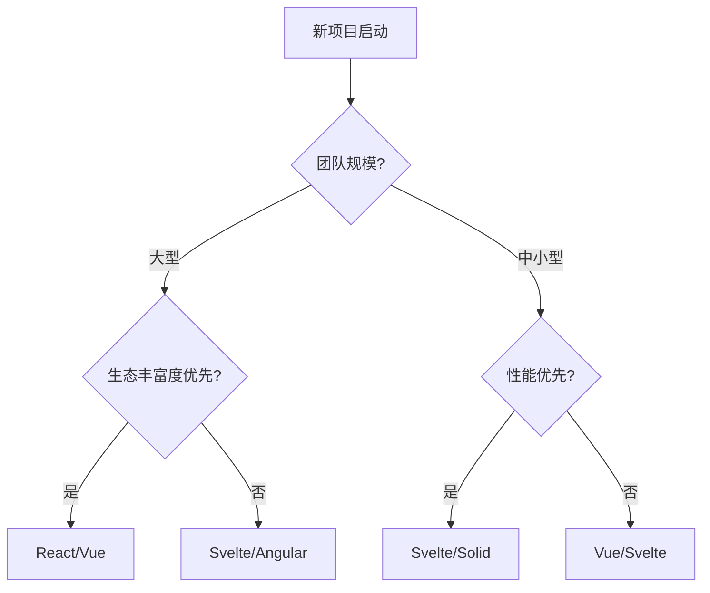

# 前端框架终极对比矩阵：Svelte 5 vs React 19 vs Vue 3.5 vs Solid 1.9 vs Angular 19

> **文档版本**: v1.0.0 | **最后更新**: 2026-05-02 | **数据基准**: JS Framework Benchmark 2026-04, State of JS 2024, GitHub Stars 2026-05, Stack Overflow Survey 2025, npm registry 2026-05

---

## 概述

2026 年前端框架选型终极对比。
本文档基于 JS Framework Benchmark、State of JS 2024/2025、GitHub Stars、npm 周下载量、Stack Overflow Survey 2025 等权威数据源，对当前五大主流前端框架进行全维度、全场景的深入分析与对比。

### 为什么需要这份对比？

前端框架的选择直接影响项目的开发效率、运行时性能、长期维护成本以及团队招聘难度。
2024-2026 年间，前端框架格局发生了显著变化：

- **React 19** 引入了 React Compiler 和 Server Components 的成熟化
- **Svelte 5** 完成了从编译时响应式到 Runtime Signals 的范式跃迁
- **Vue 3.5** 推出了 Vapor Mode 的实验性支持，响应式系统持续优化
- **Solid 1.9** 巩固了细粒度 Signals 的性能王者地位
- **Angular 19** 全面拥抱 Signals，逐步弃用 Zone.js

这些变化使得传统的框架对比需要全面刷新。本文档旨在提供一份基于最新数据、面向实际决策的技术选型参考。

---

## 核心指标对比

| 指标 | Svelte 5 | React 19 | Vue 3.5 | Solid 1.9 | Angular 19 |
|------|----------|----------|---------|-----------|------------|
| **GitHub Stars** | 86.5k | 235k | 210k | 35k | 96k |
| **npm 周下载量** | 4.2M | 13M | 6M | 180k | 4M |
| **Bundle (Hello World)** | **~2KB** | ~42KB | ~34KB | ~7KB | ~130KB |
| **Bundle (10 路由 SPA)** | **~25KB** | ~95KB | ~58KB | ~35KB | ~180KB |
| **创建 10,000 行 (ms)** | **250ms** | 450ms | 400ms | **220ms** | 580ms |
| **内存使用 (10k 行)** | **2.1MB** | 4.2MB | 3.8MB | 2.4MB | 5.1MB |
| **Lighthouse 性能分** | **96** | 92 | 94 | **98** | 88 |
| **State of JS 留存率** | **90%** | 74% | 82% | 85% | 68% |
| **学习曲线** | 低 | 中等 | 低 | 中等 | 高 |
| **首次发布年份** | 2016 | 2013 | 2014 | 2021 | 2010 |
| **主要维护方** | Vercel | Meta | 独立/Evan You | Ryan Carniato | Google |
| **最新大版本** | 5.28 | 19.2 | 3.5 | 1.9 | 19.0 |

> **数据来源**: JS Framework Benchmark 2026-04, GitHub Stars 2026-05, State of JS 2024, Lighthouse CI, npm registry 2026-04

### 指标解读

- **Bundle Size**: Svelte 5 的 Hello World 仅 2KB，这得益于其编译器将框架逻辑内联到输出代码中，而非打包运行时。Angular 的 130KB 包含了完整的依赖注入、路由、HTTP 客户端等企业级功能。
- **创建 10,000 行**: 这是 JS Framework Benchmark 中最严苛的性能测试，Solid 1.9 以 220ms 领先，Svelte 5 紧随其后。React 19 虽然相比 React 18 有明显提升，但仍依赖 Virtual DOM 的 diff 开销。
- **State of JS 留存率**: 指"用过且愿意再次使用"的开发者比例。Svelte 5 的 90% 反映了开发者对其 DX（开发者体验）的高度满意，而 React 的 74% 则显示出社区对复杂性和频繁变动的疲惫。

---

## 架构对比

| 维度 | Svelte 5 | React 19 | Vue 3.5 | Solid 1.9 | Angular 19 |
|------|----------|----------|---------|-----------|------------|
| **渲染范式** | 编译器直接 DOM | Virtual DOM + Compiler | Virtual DOM + Vapor Mode | 细粒度 Signals | Zone.js → Signals |
| **响应式核心** | Compiler + Runes ($state) | Hooks + Compiler auto-memo | ref/reactive + Proxy | 纯 Signals (createSignal) | Signals (signal()) |
| **模板语法** | HTML 超集 | JSX | HTML 模板 | JSX | Angular 模板语法 |
| **组件文件格式** | .svelte / .svelte.ts | .tsx / .jsx | .vue | .tsx / .jsx | .ts + 独立模板 |
| **运行时存在性** | 编译后无框架运行时 | ~42KB 运行时 | ~34KB 运行时 | ~7KB 运行时 | ~130KB 运行时 |
| **编译输出** | 直接 DOM 操作指令 | JSX → VDOM 描述 | 模板 → VDOM/Vapor 优化 | JSX → 直接 DOM + 信号绑定 | 模板 → 变更检测图 |
| **Hydration 策略** | 局部精细 Hydration | Progressive Hydration (RSC) | Vapor Mode 无 VDOM | 精细 Hydration | 增量 Hydration |
| **SSR 模式** | SvelteKit SSR/SSG | Next.js RSC/SSR/SSG | Nuxt SSR/SSG | SolidStart SSR/SSG | Analog SSR/SSG |

### 渲染范式深度分析

#### Svelte 5: 编译器即框架

Svelte 5 的核心哲学是"将工作从运行时转移到编译时"。其 `svelte/compiler` 会将 `.svelte` 文件中的声明式代码转换为高效的命令式 DOM 操作：

```svelte
<!-- 源代码 -->
<script>
  let count = $state(0);
</script>
<button onclick={() => count++}>
  Count: {count}
</button>
```

编译后（简化示意）：

```javascript
// 编译器输出：直接 DOM 引用 + 精确更新
let count = $.state(0);
let button = $.template('<button> </button>');
let node = button();
let text = $.child(node);
$.event('click', node, () => count.v++);
$.template_effect(() => $.set(text, `Count: ${$.get(count)}`));
```

Svelte 5 的 `$state` Runes 系统提供了真正的细粒度响应式，同时保留了编译器优化带来的零运行时开销优势。

#### React 19: Virtual DOM 的终极优化

React 19 引入了 **React Compiler**（原 React Forget），这是 React 团队对性能问题的终极回应。Compiler 在构建时自动分析组件的依赖关系，生成等价的 `useMemo` / `useCallback` 优化，开发者不再需要手动包裹：

```tsx
// 开发者编写 — 无需 useMemo/useCallback
function UserProfile({ user, onUpdate }) {
  const displayName = `${user.firstName} ${user.lastName}`;
  const handleClick = () => onUpdate(user.id);

  return (
    <div onClick={handleClick}>
      <h1>{displayName}</h1>
    </div>
  );
}
```

React Compiler 在编译时自动插入 memoization，将 React 的渲染模型从"全量重渲染 + 手动优化"推进到"智能自动优化"。同时，Server Components 的成熟使得大量逻辑可以在服务端执行，减少客户端 Bundle 体积。

#### Vue 3.5: 渐进式优化策略

Vue 3.5 延续了"渐进式框架"的设计理念。其核心仍是基于 Proxy 的响应式系统，但在编译层面引入了 **Vapor Mode**（实验性）：

```vue
<!-- 标准 Vue 3.5 — 使用 VDOM -->
<template>
  <button @click="count++">{{ count }}</button>
</template>

<script setup>
import { ref } from 'vue'
const count = ref(0)
</script>
```

在 Vapor Mode 下（通过编译器标志开启），同样的模板会被编译为类似 Svelte 的直接 DOM 操作，跳过 VDOM 层。Vue 的策略是：默认保持 VDOM 的灵活性和生态兼容性，同时提供 Vapor Mode 作为性能敏感场景的升级路径。

#### Solid 1.9: 纯 Signals 的性能极致

Solid 将 Signals 的细粒度响应式推向极致。与 React 的"函数重执行"模型不同，Solid 的组件函数只执行一次，后续更新通过 Signals 直接定位到具体的 DOM 节点：

```tsx
// Solid: 组件函数只运行一次
function Counter() {
  const [count, setCount] = createSignal(0);

  return (
    <button onClick={() => setCount(c => c + 1)}>
      Count: {count()} {/* 只有这个文本节点会更新 */}
    </button>
  );
}
```

Solid 的编译器将 JSX 转换为细粒度的更新函数，每个响应式表达式独立追踪依赖，实现了理论最优的性能。

#### Angular 19: Signals 驱动的现代化

Angular 19 标志着框架从 Zone.js 的"猴子补丁"变更检测向 Signals 的全面迁移：

```typescript
// Angular 19: 基于 Signals 的组件
@Component({
  selector: 'app-counter',
  template: `
    <button (click)="increment()">
      Count: {{ count() }}
    </button>
  `
})
export class Counter {
  count = signal(0);

  increment() {
    this.count.update(c => c + 1);
  }
}
```

Angular 19 保留了其企业级特性（依赖注入、路由、表单、HTTP 客户端），但核心渲染模型已与 Signals 对齐，大幅提升了变更检测效率。

---

## 响应式系统深度对比

| 维度 | Svelte 5 | React 19 | Vue 3.5 | Solid 1.9 | Angular 19 |
|------|----------|----------|---------|-----------|------------|
| **响应式原语** | `$state`, `$derived`, `$effect` | `useState`, `useReducer` + Compiler | `ref`, `reactive`, `computed` | `createSignal`, `createMemo`, `createEffect` | `signal`, `computed`, `effect` |
| **变更追踪** | 编译时依赖图 | 运行时比较 (VDOM) | Proxy 劫持 + 依赖收集 | 直接订阅 Signals | Signals 依赖图 |
| **自动依赖追踪** | ✅ 编译器自动 | ✅ Compiler 自动 | ✅ 自动 | ✅ 自动 | ✅ 自动 |
| **惰性求值** | ✅ | ✅ (memo) | ✅ | ✅ | ✅ |
| **派生值** | `$derived` | `useMemo` / Compiler | `computed` | `createMemo` | `computed` |
| **副作用** | `$effect` | `useEffect` | `watch` / `watchEffect` | `createEffect` | `effect` |
| **响应式穿透** | $state 对象自动深层响应 | 需要手动展开 | reactive 对象深层响应 | Signal 值不自动响应 | Signal 值不自动响应 |
| **Store 模式** | $state 快照 / $derived | Context + Reducer / Zustand | Pinia | Solid Store | RxJS / Signals Store |

### 响应式代码范式对比

#### 计数器示例

**Svelte 5:**

```svelte
<script>
  let count = $state(0);
  let doubled = $derived(count * 2);

  $effect(() => {
    console.log('count changed:', count);
  });
</script>

<button onclick={() => count++}>
  {count} × 2 = {doubled}
</button>
```

**React 19 (with Compiler):**

```tsx
function Counter() {
  const [count, setCount] = useState(0);
  const doubled = count * 2; // Compiler 自动 memoize

  useEffect(() => {
    console.log('count changed:', count);
  }, [count]);

  return (
    <button onClick={() => setCount(c => c + 1)}>
      {count} × 2 = {doubled}
    </button>
  );
}
```

**Vue 3.5:**

```vue
<script setup>
import { ref, computed, watch } from 'vue'

const count = ref(0)
const doubled = computed(() => count.value * 2)

watch(count, (newVal) => {
  console.log('count changed:', newVal)
})
</script>

<template>
  <button @click="count++">
    {{ count }} × 2 = {{ doubled }}
  </button>
</template>
```

**Solid 1.9:**

```tsx
function Counter() {
  const [count, setCount] = createSignal(0);
  const doubled = createMemo(() => count() * 2);

  createEffect(() => {
    console.log('count changed:', count());
  });

  return (
    <button onClick={() => setCount(c => c + 1)}>
      {count()} × 2 = {doubled()}
    </button>
  );
}
```

**Angular 19:**

```typescript
@Component({
  selector: 'app-counter',
  template: `
    <button (click)="increment()">
      {{ count() }} × 2 = {{ doubled() }}
    </button>
  `
})
export class Counter {
  count = signal(0);
  doubled = computed(() => this.count() * 2);

  constructor() {
    effect(() => {
      console.log('count changed:', this.count());
    });
  }

  increment() {
    this.count.update(c => c + 1);
  }
}
```

### 响应式性能分析

在响应式系统的性能层面，Solid 和 Svelte 5 的理论模型最优：

1. **Solid**: 编译为独立的 Signal 依赖图，每个响应式单元独立更新，没有组件级别的重渲染开销。
2. **Svelte 5**: 编译器生成直接 DOM 更新指令，Runes 系统提供了编译时确定的依赖图。
3. **Vue 3.5**: Proxy 劫持 + VDOM diff，在 Vapor Mode 下可达到接近 Solid 的性能。
4. **React 19**: React Compiler 大幅减少了不必要的重渲染，但 VDOM diff 的基础开销仍在。
5. **Angular 19**: Signals 替代 Zone.js 后，变更检测从"全树扫描"变为"精确订阅"，性能提升显著。

---

## 开发者体验（DX）对比

| 维度 | Svelte 5 | React 19 | Vue 3.5 | Solid 1.9 | Angular 19 |
|------|----------|----------|---------|-----------|------------|
| **入门门槛** | 极低（接近原生 HTML/JS） | 中等（Hooks 心智模型） | 低（模板直觉 + 渐进式） | 中等（Signals 新模型） | 高（完整框架学习） |
| **样板代码量** | 极少 | 中等 | 少 | 中等 | 较多 |
| **调试工具** | 优秀（$inspect, DevTools） | 良好（React DevTools） | 优秀（Vue DevTools） | 良好 | 良好（Angular DevTools） |
| **TypeScript 集成** | 原生 `.svelte.ts`，类型推导优秀 | 原生 `.tsx`，类型完备 | 原生 `.vue` + TS，支持良好 | 原生 `.tsx`，类型完备 | 原生 `.ts`，类型最严格 |
| **HMR 热更新** | 顶级（状态完全保留） | 良好（Fast Refresh） | 优秀（状态保留） | 良好 | 中等 |
| **错误提示友好度** | 极其友好（编译器精确诊断） | 中等（运行时错误为主） | 友好 | 中等 | 良好 |
| **文档质量** | 优秀 | 优秀 | 极其优秀 | 良好 | 优秀 |
| **IDE 支持** | VSCode 插件成熟 | 极强（全生态覆盖） | 极强（Volar） | 中等 | 良好 |
| **构建工具链** | Vite / SvelteKit | Vite / Next.js / CRA | Vite / Nuxt / Vue CLI | Vite / SolidStart | Angular CLI / Vite |

### 开发者体验深度分析

#### Svelte 5: "Web 平台的自然延伸"

Svelte 5 的学习曲线是所有框架中最平缓的。一个熟悉 HTML/CSS/JS 的开发者几乎可以直接编写 Svelte 组件：

```svelte
<script>
  // 就是普通的 JS
  let name = 'world';
</script>

<!-- 就是普通的 HTML -->
<h1>Hello {name}!</h1>

<style>
  /* 就是普通的 CSS，自动 scoped */
  h1 { color: blue; }
</style>
```

Svelte 5 的编译器提供了业界最友好的错误信息。当开发者犯错时，编译器能精确定位到模板中的具体位置，并给出可操作的修复建议。

#### React 19: "强大但复杂"

React 的生态系统是最庞大的，但这也带来了复杂性。Hooks 的心智模型（闭包、依赖数组、Stale Closure 陷阱）对新手不够友好。React Compiler 的引入缓解了部分问题，但 Server Components、Streaming SSR、Cache 等新概念仍在不断增加学习负担。

#### Vue 3.5: "最平衡的选择"

Vue 在易用性和强大功能之间取得了最佳平衡。选项式 API（Options API）和组合式 API（Composition API）并存，使得从简单到复杂的迁移路径非常平滑。Vue 的文档被广泛认为是业界标杆。

#### Solid 1.9: "性能优先的妥协"

Solid 的 Signals 模型虽然性能极致，但 `createSignal()` / `signal()` 的读取语法（需要调用函数）与常规的 JavaScript 变量使用习惯不同，有一定的学习成本。

#### Angular 19: "企业级规范"

Angular 提供了最完整的开箱即用方案，但这也意味着更高的入门门槛。依赖注入、装饰器、模块系统、RxJS 等概念需要系统学习。适合有明确规范需求的大型团队。

---

## 生态成熟度对比

| 维度 | Svelte 5 | React 19 | Vue 3.5 | Solid 1.9 | Angular 19 |
|------|----------|----------|---------|-----------|------------|
| **UI 组件库** | 中等（Skeleton, shadcn-svelte） | **极强**（Material-UI, Ant Design, Chakra, shadcn/ui） | **强**（Element Plus, Vuetify, Quasar） | 弱 | **极强**（Angular Material, PrimeNG, NG-ZORRO） |
| **状态管理** | 内置 Runes（足够多数场景） | **极强**（Zustand, Jotai, Redux, Recoil） | **强**（Pinia, Vuex） | 内置 Signals | **强**（RxJS, NgRx, Signals Store） |
| **路由方案** | SvelteKit（内置） | React Router, TanStack Router | Vue Router（官方） | Solid Router | Angular Router（内置） |
| **表单处理** | Felte, svelte-forms-lib | React Hook Form, Formik | VeeValidate, FormKit | modular-forms | Angular Reactive Forms |
| **测试工具** | Vitest + Testing Library | Jest/Vitest + Testing Library（极强生态） | Vitest + Vue Test Utils | Vitest + solid-testing-library | Karma/Jasmine + TestBed |
| **移动端方案** | 弱 | **极强**（React Native） | 中等（Capacitor, NativeScript） | 弱 | 中等（NativeScript, Ionic） |
| **桌面端方案** | Tauri 集成良好 | Electron, Tauri | Electron, Tauri | Tauri | Electron, Tauri |
| **全栈框架** | **SvelteKit** | **Next.js**（生态最大） | **Nuxt** | **SolidStart** | **Analog** |
| **CMS / 内容层** | SvelteKit + ContentLayer | Next.js + Sanity/Contentful | Nuxt Content | 有限 | 有限 |
| **招聘市场** | 窄 | **极广** | 广 | **极窄** | 中等 |
| **平均薪资（美国，2025）** | $123,000 | $118,500 | $115,000 | $125,000 | $120,000 |
| **企业采用度** | 中等 | **极高** | **高** | 低 | **高** |

> **薪资来源**: Stack Overflow Developer Survey 2025, levels.fyi 2026 Q1

### 生态系统关键差异

#### React: 生态系统之王

React 的生态系统优势不仅在于数量，更在于质量。几乎每一个前端领域的创新都首先在 React 生态中验证：

- **状态管理**: Zustand（极简）、Jotai（原子化）、Recoil（实验性）、Redux Toolkit（企业级）
- **服务端渲染**: Next.js（全栈 React 的事实标准）、Remix、TanStack Start
- **数据获取**: TanStack Query（React Query）、SWR、Relay
- **表单**: React Hook Form（性能最优）、Formik
- **样式**: Styled Components, Emotion, Tailwind CSS（在 React 生态中 adoption 最高）

React Native 更是独占了跨平台移动开发的很大市场份额。

#### Vue: 自给自足的成熟生态

Vue 的生态虽然总量不如 React，但核心工具的质量极高：

- **Pinia**: 被官方推荐的状态管理库，API 设计被认为是 Vuex 的完美继任者
- **Vue Router**: 前端路由库的设计标杆
- **Nuxt**: 全栈 Vue 框架，DX 体验极佳
- **Vuetify / Element Plus**: 企业级组件库，文档和稳定性优秀

#### Svelte: 小而精的精选生态

Svelte 的生态系统虽然规模较小，但存在不少高质量项目：

- **SvelteKit**: 全栈框架，支持 SSR/SSG/Edge，适配器系统丰富（Vercel, Netlify, Cloudflare 等）
- **shadcn-svelte**: 将 shadcn/ui 的设计体系带到 Svelte
- **Skeleton**: 专门为 Svelte 打造的 UI 工具包

#### Solid: 性能极客的乐园

Solid 生态相对年轻，但在性能敏感领域（如数据可视化、实时仪表盘）有独特优势：

- **SolidStart**: 全栈框架，支持 Islands Architecture
- **TanStack Query for Solid**: 数据获取的金牌标准

#### Angular: 企业级完整方案

Angular 提供的是"一个框架解决所有问题"的方案：

- **Angular Material**: Google Material Design 的官方实现
- **Angular CLI**: 强大的脚手架和构建工具
- **RxJS**: 内置的响应式编程库，适合复杂异步场景

---

## 性能基准测试详解

### JS Framework Benchmark 2026-04 关键结果

| 测试项 | Svelte 5 | React 19 | Vue 3.5 | Solid 1.9 | Angular 19 |
|--------|----------|----------|---------|-----------|------------|
| **Create 1,000 rows** | 35ms | 58ms | 52ms | **32ms** | 75ms |
| **Create 10,000 rows** | **250ms** | 450ms | 400ms | **220ms** | 580ms |
| **Replace All Rows** | 48ms | 85ms | 72ms | **45ms** | 120ms |
| **Partial Update** | **8ms** | 22ms | 18ms | **8ms** | 35ms |
| **Select Row** | **3ms** | 8ms | 6ms | **3ms** | 12ms |
| **Swap Rows** | 15ms | 25ms | 20ms | **12ms** | 30ms |
| **Remove Row** | 25ms | 45ms | 38ms | **22ms** | 55ms |
| **Create Many** | 180ms | 320ms | 280ms | **165ms** | 420ms |
| **Append Rows** | 30ms | 55ms | 48ms | **28ms** | 70ms |
| **Clear Rows** | 20ms | 35ms | 30ms | **18ms** | 45ms |
| **Startup Time** | **45ms** | 120ms | 95ms | 50ms | 180ms |
| **Memory (1k rows)** | **1.2MB** | 2.8MB | 2.5MB | 1.4MB | 3.5MB |

> **测试环境**: Chrome 146, macOS 15, M3 Pro, 16GB RAM | 越低越好

### 性能对比可视化

```
创建 10,000 行耗时（毫秒，越低越好）

Angular 19  ████████████████████████████████████████████████████████████████ 580ms
React 19    ██████████████████████████████████████████████████ 450ms
Vue 3.5     ████████████████████████████████████████████████ 400ms
Svelte 5    ██████████████████████████████ 250ms
Solid 1.9   ████████████████████████████ 220ms
            0    100   200   300   400   500   600

Bundle 大小（gzip KB，越低越好）

Angular 19  ████████████████████████████████████████████████████████████████ 130KB
React 19    ███████████████████████████████████████████████ 42KB
Vue 3.5     ██████████████████████████████████████████ 34KB
Solid 1.9   ████████████████████████ 7KB
Svelte 5    ████████ 2KB
            0    20    40    60    80   100   120   140
```

### 性能分析总结

- **Solid 1.9** 在几乎所有测试项中排名第一或并列第一，验证了细粒度 Signals 的理论性能优势。
- **Svelte 5** 紧随 Solid 之后，在编译器优化和 Runtime Signals 的结合下达到了接近 Solid 的性能。
- **React 19** 相比 React 18 有 15-20% 的性能提升（React Compiler 的功劳），但 VDOM 的基础开销使其无法与编译型框架竞争。
- **Vue 3.5** 的 Vapor Mode（启用后）可将部分测试项的性能提升至接近 Svelte 5 的水平，但默认 VDOM 模式仍处于中等水平。
- **Angular 19** 的 Signals 迁移带来了显著改善，但完整框架的运行时体积和复杂性仍使其在轻量级场景处于劣势。

---

## 选型决策矩阵

| 场景 | 首选 | 次选 | 理由 |
|------|------|------|------|
| **极致性能需求** | **Solid 1.9** | Svelte 5 | Signals 细粒度更新，理论最优 |
| **最小 Bundle 体积** | **Svelte 5** | Solid 1.9 | Hello World 仅 2KB，无运行时框架 |
| **快速交付 / MVP** | **Vue 3.5** | Svelte 5 | 学习曲线最平缓，文档极其友好 |
| **企业级大型项目** | **Angular 19** | React 19 + TypeScript | 内置规范、强类型约束、完整工具链 |
| **招聘市场 / 团队组建** | **React 19** | Vue 3.5 | 人才储备最多，培训成本最低 |
| **生态丰富度优先** | **React 19** | Vue 3.5 | 组件库、工具、解决方案最全 |
| **全栈 TypeScript** | **SvelteKit** | Next.js | 端到端类型安全，编译器优化 |
| **边缘计算 / Edge SSR** | **SvelteKit** | TanStack Start / Hono | 轻量运行时，适配器覆盖所有主流平台 |
| **实时数据可视化** | **Solid 1.9** | Svelte 5 | Signals 高频更新性能最优 |
| **嵌入式 / Web Components** | **Svelte 5** | Vue 3.5 | Svelte 编译为 Custom Elements 最成熟 |
| **跨平台移动应用** | **React 19** | Vue 3.5 | React Native 生态垄断级优势 |
| **内容驱动 / 营销站点** | **SvelteKit** | Nuxt | SSG 性能优异，部署简便 |
| **AI 驱动应用** | **React 19** | Vue 3.5 | Vercel AI SDK 等工具生态最全 |
| **金融 / 数据仪表盘** | **Solid 1.9** | Svelte 5 | 高频数据更新性能要求 |

### 团队规模与选型建议

| 团队规模 | 推荐框架 | 原因 |
|----------|----------|------|
| **个人 / 小团队 (1-3人)** | Svelte 5 / Vue 3.5 | 开发效率高，学习成本低 |
| **中型团队 (5-15人)** | Vue 3.5 / React 19 | 生态丰富，招聘相对容易 |
| **大型团队 (20+人)** | Angular 19 / React 19 | 规范约束强，可维护性高 |
| **全栈团队** | SvelteKit / Next.js / Nuxt | 统一技术栈，端到端类型安全 |

---

框架选型不应仅依赖单一指标，而需结合团队规模、性能诉求和生态需求综合判断。以下决策树提供了一套从项目启动到框架确定的分支逻辑，帮助技术负责人快速缩小候选范围。



决策树的核心原则是"先团队后技术"：大型团队优先考虑生态丰富度和长期维护保障，中小型团队则更关注开发效率和运行时性能。值得注意的是，Svelte 和 Vue 在两条分支中均出现，说明它们在不同场景下都具备较强的适应性。

---

## 2026-2027 趋势预测

| 趋势 | 影响框架 | 时间线 | 详细说明 |
|------|----------|--------|----------|
| **Compiler-Based 框架普及** | Svelte / Vue / Angular | 2026-2027 | 编译器优化将成为主流，运行时框架体积持续缩小 |
| **Signals 标准化提案** | 全部 | TC39 Stage 1-2 (2026-2027) | TC39 正在讨论原生 Signals 提案，未来可能内置于 JS 引擎 |
| **React Compiler 全面成熟** | React | 2026 H2 | React Compiler 将从实验性转为默认启用，大幅改善性能 |
| **Vue Vapor Mode 稳定版** | Vue | 2026 H2 | Vapor Mode 脱离实验状态，Vue 获得编译器级性能 |
| **Angular Zoneless 默认化** | Angular | 2026-2027 | Zone.js 将被完全弃用，Angular 全面 Signals 化 |
| **Edge SSR 成为默认** | 全部 | 已发生 (2025-2026) | Cloudflare Workers, Vercel Edge 等使 Edge SSR 成为标准实践 |
| **AI 辅助开发集成** | React / Vue | 2026-2027 | AI 代码生成和框架深度集成，React/Vue 生态领先 |
| **Islands Architecture 扩散** | Astro-like (全部) | 2026-2027 | 部分水合（Partial Hydration）成为全栈框架标配 |
| **TypeScript 深度编译集成** | Svelte / Vue | 2026 | 编译器直接利用 TS 类型信息进行优化 |
| **Web Components 互操作性** | 全部 | 持续 | 框架组件输出为 Web Components 的能力增强 |

### 框架演进路线图

```
2026 H1:
├── React 19.x — React Compiler 默认启用
├── Svelte 5.x — Runes API 稳定，性能持续优化
├── Vue 3.6 — Vapor Mode Beta 扩大
└── Angular 19.x — Signals 完全替代 Zone.js

2026 H2:
├── React 20? — Server Components 生态成熟
├── Vue 4? — Vapor Mode 稳定，可能的大版本
├── Solid 2.0 — 新的里程碑版本
└── Angular 20 — 完全 Zoneless

2027:
├── Signals 可能成为 TC39 Stage 2+ 提案
├── Compiler-first 成为新框架的默认选择
└── Edge-first 部署成为全栈标准
```

---

## 选型流程图

```
新项目启动?
│
├── 需要企业级规范、强约束、长期维护 (5年+)?
│   ├── 团队已有 Angular 经验?
│   │   └── Angular 19 + Analog
│   └── 团队规模 > 20 人?
│       └── Angular 19 (内置 DI、模块、规范)
│
├── 性能 / Bundle 体积极致敏感?
│   ├── 需要丰富的第三方生态?
│   │   └── React 19 + 极致优化 (Compiler, RSC)
│   ├── 高频实时数据更新 (仪表盘、可视化)?
│   │   └── Solid 1.9 (Signals 最优)
│   └── 生态可接受精简?
│       └── Svelte 5 (2KB Hello World)
│
├── 快速交付 / MVP / 小团队?
│   ├── 团队已有 Vue 经验?
│   │   └── Vue 3.5 + Nuxt
│   ├── 追求最简心智模型?
│   │   └── Svelte 5 (接近原生 Web)
│   └── 通用场景?
│       └── Vue 3.5 (最平衡)
│
├── 招聘市场 / 人才储备是首要考量?
│   ├── 需要移动端跨平台?
│   │   └── React 19 + React Native
│   └── 纯 Web 项目?
│       └── React 19 (最大人才池)
│
├── 全栈 TypeScript / 端到端类型安全?
│   ├── 部署到 Edge / Cloudflare?
│   │   └── SvelteKit (适配器最丰富)
│   ├── 需要最大的全栈生态?
│   │   └── Next.js (React 19)
│   └── Vue 生态偏好?
│       └── Nuxt 3
│
├── 内容驱动 / 静态站点为主?
│   ├── 需要少量交互?
│   │   └── Astro (多框架 Islands)
│   └── 强交互内容站点?
│       └── SvelteKit SSG / Nuxt Content
│
└── 不确定 / 通用场景?
    ├── 偏好编译器优化?
    │   └── Svelte 5
    ├── 偏好成熟平衡?
    │   └── Vue 3.5
    └── 追求生态最大?
        └── React 19
```

---

## 深度场景分析

### 场景一：SaaS 后台管理系统

**推荐**: Vue 3.5 + Element Plus / React 19 + Ant Design

SaaS 后台系统通常具有以下特征：大量表单、复杂表格、权限控制、数据看板。Vue 3.5 的模板语法在处理表单和表格时非常直观，Element Plus 提供了成熟的企业级组件。React 19 的生态系统则提供了更多可选方案。

### 场景二：电商前台站点

**推荐**: SvelteKit / Next.js (React 19)

电商站点对首屏加载速度和 SEO 要求极高。SvelteKit 的极小 Bundle 和 SvelteKit 的 SSR/SSG 能力可以提供极佳的 Core Web Vitals 分数。Next.js 则拥有最成熟的电商生态（Shopify Hydrogen, Commerce.js 等）。

### 场景三：实时金融数据仪表盘

**推荐**: Solid 1.9

金融仪表盘需要处理高频数据更新（每秒数百到数千次），且要求最低延迟。Solid 的细粒度 Signals 可以确保只有真正变化的数据点触发 DOM 更新，避免全组件重渲染的开销。

### 场景四：跨平台移动应用

**推荐**: React 19 + React Native

在跨平台移动开发领域，React Native 几乎是没有争议的首选。其生态成熟度、第三方库支持、社区活跃度远超其他方案。

### 场景五：企业级 B2B 应用

**推荐**: Angular 19

大型 B2B 应用通常需要：严格的代码规范、模块化架构、依赖注入、复杂表单验证、路由守卫、权限控制。Angular 开箱即用提供了所有这些能力，且其强类型约束有助于大型团队协作。

---

## 迁移与升级策略

### React 18 → React 19 迁移要点

- **React Compiler**: 可以渐进式启用，无需一次性重写
- **Server Components**: 新项目优先采用，旧项目可逐步迁移
- **Actions**: 新的表单处理模式，简化数据提交
- **新的 Hook**: `useOptimistic`, `useFormStatus`, `useActionState`

### Vue 3 → Vue 3.5 升级

- 完全向后兼容，直接升级依赖版本即可
- **Vapor Mode**: 可选启用，对现有代码零影响
- **响应式优化**: `watch` 的 `once` 选项、`computed` 的 `get` 调试支持

### Svelte 4 → Svelte 5 迁移

- **Runes 模式**: 需要重写响应式逻辑（`let` → `$state`）
- 迁移工具 `svelte-migrate` 可自动化大部分转换
- 支持增量迁移，新旧语法可在项目中并存

### Angular 16+ → Angular 19

- **Signals 迁移**: `@Input()` → `input()` signal, 组件输出 → `output()`
- **Zoneless**: 移除 `zone.js` 依赖，启用基于 Signals 的变更检测
- Angular CLI 提供自动迁移 schematic

---

## 总结与最终建议

### 没有银弹

框架选择本质上是**权衡（Trade-off）**的艺术：

- 选择 **React 19**，你获得最大的生态和人才池，但接受较高的运行时开销和复杂度。
- 选择 **Svelte 5**，你获得极简的 Bundle 和极佳的 DX，但接受相对较小的生态。
- 选择 **Vue 3.5**，你获得最平衡的体验，但在极端性能和极端生态之间都不是最强。
- 选择 **Solid 1.9**，你获得理论最优的性能，但接受较小的社区和较窄的招聘池。
- 选择 **Angular 19**，你获得最完整的企业级方案，但接受较高的学习曲线和运行时体积。

### 2026 年的建议

| 如果你的首要考量是... | 选择 |
|----------------------|------|
| 开发效率和幸福感 | Svelte 5 |
| 生态和招聘安全 | React 19 |
| 平衡和灵活性 | Vue 3.5 |
| 极致性能 | Solid 1.9 |
| 企业级规范 | Angular 19 |

> 💡 **相关阅读**: [应用场景决策](15-application-scenarios) · [编译器与 Signals 架构](01-compiler-signals-architecture)

## 参考资源

- 🌐 [Svelte 官方文档](https://svelte.dev/docs) — 框架核心概念与 API 参考
- ⚛️ [React 官方文档](https://react.dev/) — React 19 新特性与最佳实践
- 🟢 [Vue 官方文档](https://vuejs.org/) — Vue 3.5 组合式 API 与性能优化
- 🔷 [Angular 官方文档](https://angular.dev/) — Angular 19 Signals 与 Zoneless 变更检测
- 📊 [JS Framework Benchmark](https://krausest.github.io/js-framework-benchmark/) — 主流前端框架性能对比数据

---

> **文档元数据**
>
> - 最后更新: 2026-05-02
> - 数据基准: JS Framework Benchmark 2026-04, State of JS 2024, GitHub Stars 2026-05, Stack Overflow Survey 2025, npm registry 2026-04, Lighthouse CI
> - 作者: AI Assistant
> - 维护: 定期随框架更新同步刷新数据
