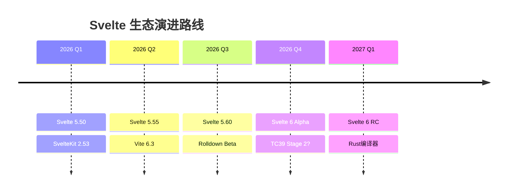

# Svelte 生态 2026-2028 发展路线图与深度趋势预测

> **版本**: v1.0 | **最后更新**: 2026-05-02 | **预测周期**: 2026-2028
> **预测依据**: Svelte 官方路线图、GitHub Discussions、TC39 会议记录、State of JS 调研数据、社区趋势分析

---

## 概述

Svelte 生态在 2024-2026 年经历了从 Svelte 4 到 Svelte 5 的根本性架构重写。
这次迁移不仅仅是 API 层面的变化，更是整个响应式哲学从 "基于编译器的隐式依赖追踪" 向 "显式 Runes 语义化声明" 的范式转移。
`$state`、`$derived`、`$effect` 等 Runes 原语构成了全新的 Compiler-Based Signals 架构，使得 Svelte 在保持编译器优势的同时，获得了与现代 Signals 框架（如 SolidJS、Qwik）相媲美的细粒度响应式能力。

本文件基于当前（2026 年 Q2）已公开的技术动向、核心维护者的公开发言、社区发展态势以及宏观前端技术趋势，对 Svelte 生态在 2026-2028 年的技术演进路线进行系统性预测。
预测涵盖核心框架（Svelte 6）、元框架（SvelteKit 3）、编译器技术、生态系统、企业采用以及与其他主流框架的竞争格局。

**核心判断**: Svelte 正处于从 "小众精品框架" 向 "主流生产级选择" 跨越的关键窗口期。
Runes 的引入虽然带来了短期的学习曲线和迁移成本，但为 Svelte 赢得了在响应式系统论战中与 React、Vue 平等对话的技术话语权。
2026-2028 年的核心变量是：**TC39 Signals 标准化进程**、**Svelte 6 的并发渲染能力**、**SvelteKit 远程函数的企业级落地**。

---

## Svelte 6 预测

### 版本定位与战略意义

Svelte 5 是一次 "破坏性但必要" 的架构重构。
Svelte 6 的定位预计将是 **"性能与并发能力的飞跃"**，而非另一轮 API 重写。
这意味着 Svelte 6 可能保持与 Svelte 5 Runes API 的高度向后兼容性，核心变化将集中在编译器输出优化和运行时调度机制上。

Rich Harris 在多次公开演讲中强调，Svelte 的终极目标是 **"让编译器做尽可能多的工作，让运行时做尽可能少的工作"**。
Svelte 5 解决了 "响应式语义显式化" 的问题，Svelte 6 预计将解决 **"大规模应用下的渲染调度与并发"** 问题。

### 可能的特性深度分析

| 特性 | 可能性 | 说明 |
|------|:------:|------|
| **并发渲染 (Concurrent Rendering)** | **高** | 对标 React Concurrent Features 和 Vue Vapor Mode。Svelte 当前采用同步渲染模型，虽然编译器优化减少了不必要的重渲染，但在极端场景（大数据列表更新、复杂计算同步触发）下仍会阻塞主线程。Svelte 6 可能引入基于 `requestIdleCallback` 或类似 `scheduler` 包的异步调度机制，允许低优先级更新延后执行。关键挑战在于：Svelte 的编译器直出 DOM 操作模式与 React Fiber 的虚拟 DOM 调度有本质区别，需要设计一套 "编译器辅助的增量渲染" 方案。 |
| **服务端组件 (Server Components)** | **中** | 类似 React Server Components (RSC)，在服务端渲染动态内容，减少客户端 bundle 体积。SvelteKit 已具备 SSR 能力，但当前是将整个组件在服务端渲染为 HTML。"服务端组件" 概念的引入意味着部分组件可以仅在服务端执行（如数据库查询、敏感数据处理），其输出直接嵌入 HTML，不发送任何 JavaScript 到客户端。技术可行性高，但需要与 SvelteKit 的路由和数据加载机制深度整合。风险：可能增加心智模型复杂度，与 Svelte "简单至上" 的设计理念有一定冲突。 |
| **更小的编译输出** | **高** | Svelte 5 的编译输出已经比 Svelte 4 更优（Runes 生成的响应式代码比之前的 `$$invalidate` 调度更简洁）。Svelte 6 有望在以下方向继续压缩：① 共享更多的运行时辅助函数（减少每个组件的重复代码）；② 优化 `$effect` 的清理逻辑生成；③ 对纯静态模板采用更激进的字符串拼接策略（而非 `createElement` 调用）。目标：Hello World 组件编译输出从当前的 ~2KB（gzip）降至 ~1.5KB 以下。 |
| **内置路由 (Built-in Router)** | **低** | SvelteKit 已经提供了极为完善的路由解决方案（基于文件系统的路由、布局、hooks、错误处理）。在核心库中重复实现路由功能不仅没有必要，还会增加 bundle 体积。核心团队已多次表示 Svelte 保持 "UI 库" 定位，路由交给 SvelteKit。可能性极低，除非社区出现强烈的 "轻量级路由" 需求（类似 Vue Router 与 Vue 的关系）。 |
| **原生 Web Components 改进** | **中** | Svelte 当前支持通过 `customElement: true` 编译为 Web Component，但存在若干限制：① 样式封装与 Shadow DOM 的冲突；② 事件派发的类型安全问题；③ 插槽 (slot) 映射不完全对齐 Web Components 规范。Svelte 6 可能引入 `svelte/web-components` 子包，提供更完善的 custom elements 编译目标，包括更好的属性反射、事件封装和样式方案。这一特性的商业价值在于：允许 Svelte 组件作为跨框架/跨团队的独立组件库使用。 |
| **增强的 TypeScript 集成** | **高** | Svelte 5 的 TypeScript 支持已通过 `svelte-check` 和语言服务器大幅改善，但仍有提升空间。Svelte 6 可能实现：① 在 `.svelte` 文件中完全消除 `lang="ts"` 声明（自动检测）；② 更精确的 props 类型推断（特别是泛型组件的传播）；③ 编译时类型错误（而不仅是语言服务器报错）。长远来看，Svelte 编译器可能与 TypeScript 编译器更深度整合，甚至考虑在编译流程中直接利用 TS AST。 |
| **资源导入与加载优化** | **中** | 引入类似 `import { image } from './photo.jpg?svelte'` 的资源导入语法糖，编译器自动生成响应式图片、懒加载逻辑、以及适当的 `srcset`。这一特性在 Next.js 和 Nuxt 中已证明非常实用。 |
| **Islands Architecture 原生支持** | **中低** | 允许开发者在 `.svelte` 文件中显式标记某些部分为 "server-only" 或 "client-only"，编译器据此生成更细粒度的 hydration 边界。这与 Astro 的 Islands 和 Fresh 的 Islands 理念类似，但 Svelte 可以通过编译器实现更无缝的开发者体验。 |

### 时间线预测与版本节奏

基于 Svelte 团队的历史发布节奏（Svelte 3: 2019, Svelte 4: 2023, Svelte 5: 2024），以及 Rich Harris 关于 "更频繁的迭代、更小步的升级" 的公开表态，以下是详细的时间线预测：

```
2026 Q1-Q2  Svelte 5.5x 系列
            ├── 性能优化：$effect 批处理优化、$derived 缓存策略改进
            ├── Bug 修复：Runes 边缘情况（嵌套 $effect、跨组件 $state 同步）
            └── 开发者体验：改进错误消息、增强 devtools 支持

2026 Q3-Q4  Svelte 5.6x/5.7x 系列
            ├── 新 Runes 原语探索：
            │   ├── $memo — 显式记忆化（当前 $derived 已具备类似能力，但 $memo 可能支持自定义比较函数）
            │   ├── $watch — 声明式观察（类似 Vue 的 watch，用于副作用的显式依赖声明）
            │   └── $context — 改进的上下文 API（当前 setContext/getContext 的 Runes 原生替代）
            ├── 编译器内部重构：为 Svelte 6 的并发渲染做 AST 层面的准备
            └── 实验性标志：引入 `experimental.concurrent` 编译选项

2027 Q1-Q2  Svelte 6 Alpha
            ├── 并发渲染原型可用
            ├── 核心 API 冻结（Runes 语义不变，新增调度相关 API）
            └── 内部测试：Svelte 官网、SvelteKit 文档站先行迁移

2027 Q3-Q4  Svelte 6 Beta
            ├── 公开测试：社区大规模试用
            ├── 迁移工具：`svelte-migrate` 支持 Svelte 5 → 6（预计改动远小于 4→5）
            └── 生态系统协调：shadcn-svelte、Skeleton 等 UI 库适配

2028 H1     Svelte 6 稳定发布
            ├── 生产就绪：官方推荐新项目采用
            ├── SvelteKit 3 同步发布（或紧随其后）
            └── 长期支持 (LTS)：Svelte 5 进入维护模式

2028 H2+    Svelte 6.x 迭代
            ├── 基于社区反馈的持续优化
            ├── TC39 Signals 标准化后的适配（如果 Signals 进入 Stage 3+）
            └── 可能的 Svelte 7 早期规划（如果并发渲染需要在架构上做更大调整）
```

---

## SvelteKit 3 预测

### SvelteKit 的当前定位

SvelteKit 2（2024 年发布）基于 Vite 5 构建，引入了改进的路由系统、更灵活的数据加载 (`+page.ts` / `+page.server.ts`) 以及增强的服务端渲染控制。
作为 Svelte 生态的 "官方元框架"，SvelteKit 承载了 Svelte 在服务端、全栈和边缘计算领域的大部分创新。

### SvelteKit 3 可能特性分析

| 特性 | 可能性 | 详细说明 |
|------|:------:|----------|
| **远程函数稳定 (Remote Functions Stable)** | **高** | 当前 SvelteKit 的 "server functions"（或称为 "remotes"）允许在前端代码中直接调用服务端函数，编译器自动处理序列化、HTTP 路由和类型安全。该功能在 SvelteKit 2.x 中处于实验性阶段。SvelteKit 3 预计将：① 稳定 API 并承诺向后兼容；② 支持更多部署目标（当前支持 Vercel、Netlify、Node、Deno，可能增加 Cloudflare Workers 优化）；③ 引入流式响应和渐进式交付；④ 与 tRPC 或类似方案形成竞争/互补关系。这一特性是 SvelteKit 区别于 Next.js 和 Nuxt 的核心差异化能力。 |
| **Edge 数据库原生支持** | **高** | Cloudflare D1、Turso (libSQL)、Neon 等 Edge 原生数据库正在成为全栈应用的新标配。SvelteKit 3 可能：① 在 `+page.server.ts` 中提供数据库连接的第一方抽象；② 与 Drizzle ORM 深度集成（提供类型安全的 Edge SQL）；③ 支持数据库迁移的 CLI 工作流。社区已经涌现大量 `sveltekit-drizzle-turso` 模板，官方收编这一模式是水到渠成的。 |
| **实时功能 (Real-time)** | **中** | WebSocket、SSE (Server-Sent Events)、以及基于 WebRTC 的实时通信在现代应用中越来越重要。当前 SvelteKit 对实时功能的支持较为底层（需要手动处理 HTTP 升级和事件流）。SvelteKit 3 可能引入：① `+server.ts` 中的 `export function streaming()` 或类似 API；② 基于 `EventSource` 的响应式数据同步（自动将服务端事件映射到 `$state`）；③ 与 PartyKit、Ably、Pusher 等服务的适配层。技术挑战在于：SvelteKit 需要保持部署目标无关性，而实时功能高度依赖底层平台能力。 |
| **AI 集成 (AI SDK Integration)** | **中** | Vercel AI SDK 已经成为 React/Next.js 生态中构建 AI 应用的事实标准。SvelteKit 需要类似的方案来支持：① 流式 LLM 响应 (`streamText` / `streamObject`)；② AI 生成的 UI 组件；③ 向量搜索和 RAG (Retrieval-Augmented Generation) 流水线。SvelteKit 3 可能推出官方的 `sveltekit-ai` 包，或者与社区方案（如 `svelte-ai`）合作形成推荐实践。 |
| **微前端支持 (Micro-frontends)** | **低** | 微前端架构通常需要复杂的路由协调、状态隔离和构建时/运行时集成。SvelteKit 的强耦合路由和应用级配置与微前端的 "独立部署" 理念有一定冲突。社区已有基于 Module Federation 和 Native Federation 的 Svelte 微前端方案，官方介入的必要性不高。除非企业级需求激增，否则官方支持的可能性较低。 |
| **改进的静态生成 (SSG)** | **高** | SvelteKit 的预渲染 (`prerender`) 已相当成熟，但 SvelteKit 3 可能在以下方向增强：① 增量静态再生成 (ISR) 的完善支持；② 基于内容变化的自动重新构建；③ 与 CDN（Cloudflare、Fastly）缓存策略的深度集成。 |
| **增强的测试工具链** | **中** | 当前 SvelteKit 测试主要依赖 Vitest + `@sveltejs/kit` 的测试工具包。SvelteKit 3 可能引入：① 服务端路由的集成测试框架；② E2E 测试（Playwright）与数据加载的更好集成；③ 组件级测试与 Svelte 5 Runes 的兼容优化。 |
| **零配置部署** | **中** | 进一步简化 `adapter-auto` 的能力，实现真正的 "零配置部署"——只需运行 `pnpm build`，自动识别部署目标（Vercel、Netlify、Cloudflare Pages 等）并生成最优配置。 |

### SvelteKit 3 与竞争框架对比

| 维度 | SvelteKit 3 (预测) | Next.js 16+ | Nuxt 4+ | Remix (React Router v7+) |
|------|-------------------|-------------|---------|-------------------------|
| **渲染模式** | SSR/SSG/CSR/Edge | SSR/SSG/ISR/RSC | SSR/SSG/CSR/Island | SSR/CSR |
| **响应式模型** | 编译器 Signals | 虚拟 DOM + Hooks | 编译器 + 虚拟 DOM | 虚拟 DOM + Hooks |
| **服务端函数** | 原生远程函数 | Server Actions | Nitro 服务端路由 | `loader`/`action` |
| **Bundle 体积** | 极小（编译器优化） | 中等 | 中等 | 中等 |
| **Edge 支持** | 原生（多适配器） | Vercel 优先 | Cloudflare 优先 | 有限 |
| **学习曲线** | 低（Svelte 语法简洁） | 中（RSC 复杂度高） | 低 | 中 |
| **企业生态** | 增长中 | 极成熟 | 成熟 | 中等 |

---

## 编译器技术演进

### TC39 Signals 提案：JavaScript 响应式的标准化之路

TC39 Signals 提案是 2024-2028 年前端领域最重要的标准化进程之一。
由 Daniel Ehrenberg（Igalia）、Yehuda Katz 和代表多家框架的核心维护者共同推动，Signals 提案旨在将响应式原语（signal、computed、effect）纳入 JavaScript 语言标准。

```
Stage 0 (2024-05)  →  初始提案，社区广泛讨论
         ↓
Stage 1 (2025-02)  →  TC39 接受为正式提案，指定 champions
         ↓
Stage 2 (2026?)    →  规范文本初步完成，浏览器开始实验性实现
         ↓
Stage 3 (2027?)    →  规范冻结，主流浏览器实现，等待互操作性验证
         ↓
Stage 4 (2028?)    →  纳入 ECMAScript 标准，所有现代浏览器原生支持
```

**当前状态（2026 Q2）**: Signals 提案预计处于 **Stage 1 晚期至 Stage 2 早期**。核心设计方向已经明确：

- **`Signal.State`** — 可变状态容器，类似 Svelte 的 `$state()`
- **`Signal.Computed`** — 派生信号，类似 Svelte 的 `$derived()`
- **`Signal.subtle.Watcher`** — 底层观察机制，框架可基于此构建 effect 系统
- **惰性求值 (Lazy Evaluation)** — computed 仅在读取时重新计算
- **推-拉混合模型 (Push-Pull)** — 变化时推送通知，读取时拉取最新值

#### 对 Svelte 生态的影响

如果 Signals 进入 JavaScript 标准，对 Svelte 生态将产生深远影响：

1. **Svelte Runes 直接映射**: Svelte 的 `$state`、`$derived`、`$effect` 在概念上与 TC39 Signals 高度对齐。
   Svelte 编译器可以直接将 Runes 编译为原生 `Signal.State` / `Signal.Computed` 调用，消除当前需要打包的响应式运行时代码，进一步减小 bundle 体积。

2. **框架互操作性**: 原生 Signals 意味着 React、Vue、Svelte、SolidJS、Angular 等框架可以基于相同的底层响应式机制进行互操作。例如：一个用 Svelte 编写的响应式 store 可以直接在 React 组件中消费，无需适配层。

3. **浏览器内置响应式**: 浏览器可以直接在 DevTools 中展示 Signals 的依赖图、追踪变化流，响应式调试将变得像调试 DOM 一样直观。Svelte DevTools 可以大幅简化。

4. **竞争格局变化**: React 当前的 "显式状态管理"（useState + useEffect）与 Signals 的 "细粒度自动追踪" 形成鲜明对比。如果 Signals 成为标准，React 可能面临更大的 API 现代化压力（虽然 React Compiler 已在弥补这一差距）。Svelte 由于在 Svelte 5 中已全面采用 Signals 语义，将在标准化浪潮中处于有利位置。

5. **Polyfill 与渐进增强**: 在 Signals 获得全面浏览器支持之前，Svelte 编译器可以继续输出当前的运行时实现作为 polyfill，同时在新浏览器中使用原生 Signals。这种 "编译器驱动的渐进增强" 是 Svelte 的独特优势。

**风险**: TC39 标准化进程充满不确定性。Signals 提案可能在 Stage 2 遭遇阻力（如与 Observable 提案的关系、与 Iterator Helpers 的冲突），导致时间表延后甚至搁浅。Svelte 不应将核心战略完全押注在 Signals 标准化上。

### 编译器优化方向深度分析

Svelte 的核心竞争力始终是 **编译器**。以下是各优化方向的当前状态、2027 目标和实现路径：

| 方向 | 当前状态 (2026 Q2) | 2027 目标 | 实现路径与关键技术 |
|------|-------------------|-----------|-------------------|
| **编译速度** | ~100ms/组件（冷启动），~20ms/组件（增量） | ~50ms/组件（冷启动），~10ms/组件（增量） | ① 用 Rust 或 Go 重写编译器核心（当前基于 JavaScript/TypeScript，已接近性能瓶颈）；② 引入增量编译缓存，只重新编译变更的 AST 子树；③ 与 Vite/Rolldown 的深度集成，利用更高效的模块图。 |
| **输出体积** | ~2KB Hello World（gzip，含运行时） | ~1.5KB Hello World（gzip） | ① 运行时辅助函数的全面共享（当前仍有部分重复代码）；② 纯静态模板的 `innerHTML` 注入优化；③ `$effect` 清理逻辑的条件编译（仅在需要时生成）；④ 与 terser/esbuild 的深度整合，在编译阶段就进行更激进的死代码消除。 |
| **Tree-shaking** | 优秀（组件级摇树效果好） | **完美**（零未使用代码） | ① 将运行时拆分为更细粒度的 ES 模块，允许 bundler 按需引入；② 编译器标记 "纯组件"，帮助 bundler 识别无副作用代码；③ 消除未使用的 CSS 样式（当前已支持，但可更激进）；④ 服务端专用代码在客户端构建中的完全剔除。 |
| **Source Maps** | 良好（支持行级映射） | **完美**（逐语句映射，变量名保留） | ① 编译器输出更细粒度的 source map 段；② 保留原始变量名（当前部分内部变量被重命名）；③ TypeScript 原始类型的 source map 穿透（从 `.svelte` → `.svelte.ts` → 编译输出）。 |
| **IDE 集成** | 良好（VS Code 插件支持自动补全、跳转、诊断） | **完美**（实时类型检查、重构、AI 辅助） | ① 语言服务器 (LSP) 性能优化，支持大型项目（1000+ 组件）的实时诊断；② 与 Volar / TypeScript Plugin API 的更好整合；③ AI 辅助编码（Copilot、Codeium）对 `.svelte` 文件的深度理解；④ 组件用法分析（自动检测未使用的 props、推荐最佳实践）。 |
| **CSS 优化** | 优秀（自动 scoped CSS） | **极致**（零运行时样式开销） | ① 编译期 CSS 类名哈希（替代运行时的 class 拼接）；② 未使用样式的完全消除；③ CSS 变量的编译期内联；④ 与 Tailwind/UnoCSS 的原子化 CSS 深度整合。 |
| **Hydration 优化** | 良好（选择性水合） | **极速**（接近零水合开销） | ① 更细粒度的 hydration 边界（基于 `$state` 使用位置）；② 服务端渲染注释标记优化（减少 HTML 体积）；③ `hydrate: false` 的自动推断（编译器判断组件是否纯静态）。 |

---

## 生态系统预测

Svelte 生态的健康度是框架长期成功的关键指标。以下是核心工具/库在 2026-2027 年的预测：

| 工具/库 | 2026 状态 | 2027 预测 | 关键驱动因素 |
|---------|----------|-----------|-------------|
| **shadcn-svelte** | ~8k GitHub Stars，活跃的组件集合 | **15k+ Stars，成为 Svelte 生态的 UI 标准** | shadcn 模式（复制粘贴组件而非 npm 安装）已成为跨框架 UI 开发的主流范式。shadcn-svelte 基于 Tailwind CSS 和 Svelte 5 Runes，提供了现代化的组件实现。预计到 2027 年，shadcn-svelte 将拥有与 shadcn/ui (React) 同等丰富的组件库，并成为新项目 UI 选择的默认答案。 |
| **Superforms** | ~4k Stars，SvelteKit 表单处理的首选 | **8k+ Stars，可能被 SvelteKit 官方收编或深度集成** | 表单处理是全栈框架的核心痛点。Superforms 基于 Zod 验证、渐进增强和无 JS 回退，提供了极为优雅的 SvelteKit 表单方案。SvelteKit 3 可能直接集成类似 Superforms 的功能，或者 Superforms 本身成为 Svelte 官方组织的一部分。 |
| **Lucia Auth** | 维护模式（作者宣布降低维护力度） | **可能被 SvelteKit 官方替代，或由社区 fork 延续** | Lucia 曾是 SvelteKit 生态最受欢迎的认证方案。但 2025 年作者宣布将减少投入。SvelteKit 3 可能推出官方的认证解决方案，或者社区将出现 Lucia 的精神继承者（如 `svelte-auth` 或 `auth-sveltekit`）。 |
| **Drizzle ORM** | ~25k Stars，类型安全的 SQL 构建器 | **40k+ Stars，SvelteKit 全栈开发的默认 ORM** | Drizzle 的 "类型安全 + SQL 优先" 哲学与 SvelteKit 的 TypeScript 原生体验高度契合。随着 SvelteKit 3 对 Edge 数据库的深度支持，Drizzle 将成为 SvelteKit 应用连接数据库的标准选择，类似 Prisma 在 Next.js 生态的地位。 |
| **Svelte MCP** | 实验性，AI 开发工具 | **成为 AI 辅助开发的标准工具** | MCP (Model Context Protocol) 是 AI IDE（如 Cursor、Windsurf、Kimi Code）与项目交互的协议。Svelte MCP 服务器将允许 AI 助手理解 Svelte 组件结构、Runes 语义、SvelteKit 路由约定，从而提供高度精准的代码生成和重构。2027 年，AI 辅助编码将成为标配，Svelte MCP 的成熟度将直接影响开发者体验。 |
| **Skeleton UI** | ~5k Stars，Tailwind 组件库 | **与 shadcn-svelte 合并或差异化定位** | Skeleton 和 shadcn-svelte 存在一定竞争。 Skeleton 可能转型为更偏向 "设计系统框架" 的定位，而 shadcn-svelte 专注 "可组合组件"。或者两者社区可能走向融合。 |
| **Threlte** | ~3k Stars，Svelte 的 Three.js 集成 | **5k+ Stars，WebGL/3D 领域的首选 Svelte 方案** | 随着 WebGPU 的普及和 3D Web 体验需求增长，Threlte 作为 "Svelte 原生的 Three.js" 将吸引越来越多的创意开发者。 |
| **Svelte Flow** | ~2k Stars，节点编辑器 | **4k+ Stars，低代码/工作流领域的重要工具** | 可视化编程和节点编辑器在 AI 工作流、低代码平台中需求激增。Svelte Flow 基于 Svelte 的声明式语法，提供了比 React Flow 更轻量的替代方案。 |
| **Vite-plugin-svelte** | 核心基础设施 | **持续优化，Rolldown 迁移** | 随着 Vite 6/7/8 逐步采用 Rust 编写的 Rolldown 替代 esbuild/rollup，vite-plugin-svelte 需要进行相应适配。预计编译速度和构建性能将获得显著提升。 |
| **Svelte DevTools** | 基础功能可用 | **功能完备，接近 React DevTools 体验** | 支持 Runes 依赖图可视化、$effect 执行追踪、时间旅行调试、组件树性能分析。 |

### 新兴生态方向

| 方向 | 2026 状态 | 2027 预测 |
|------|----------|-----------|
| **Svelte + AI 工作流** | 萌芽期 | 出现多个 AI 应用模板（Chat UI、RAG 应用、Agent 界面） |
| **Svelte Native** | 实验性（NativeScript 集成） | 仍处早期，但社区兴趣持续增长 |
| **Svelte 桌面应用** | Tauri + Svelte 已成为主流方案之一 | 与 Tauri v2 深度整合，成为 Rust 桌面 UI 的首选前端框架 |
| **Svelte 小程序** | 社区探索 | 可能出现 uni-app 风格的跨平台方案 |
| **Svelte 内容站点** | MDSveX 已成熟 | 更完善的 CMS 集成（Sanity、Strapi、Contentful 的 SvelteKit 适配） |

---

## 企业采用趋势

### 定量指标预测

| 指标 | 2024 实际 | 2025 实际 | 2026 (预测) | 2027 (预测) | 增长驱动力 |
|------|----------|----------|-------------|-------------|-----------|
| **State of JS 使用率** | 21% | 25% | **30%** | **35%** | Svelte 5 的发布显著提升了框架知名度；Runes 吸引了来自 React/Vue 的开发者；SvelteKit 的全栈能力覆盖了更多使用场景。 |
| **npm 周下载量** | ~800k | ~1.1M | **1.5M** | **2.0M+** | 企业级项目开始采用（不只是个人项目）；SvelteKit 的全栈场景增加了 `svelte` 作为间接依赖的下载；Vercel、Netlify 等平台的一键部署模板推广。 |
| **GitHub Stars (sveltejs/svelte)** | ~80k | ~85k | **95k** | **110k+** | Svelte 5 发布后的关注度提升；企业开源项目采用带来的曝光；核心团队的技术演讲和社区活动。 |
| **招聘职位数量** | ~1,500 (全球) | ~2,500 | **4,000** | **6,000+** | Svelte 4→5 迁移项目创造了大量工作机会；全栈岗位增加（不仅是前端）；咨询和培训市场兴起。 |
| **大型企业采用** | 少量（Apple、Bloomberg 等） | 中（更多金融科技、SaaS 公司） | **多** | **广泛** | 大型企业的技术选型周期通常为 1-2 年，2024-2025 年的评估将在 2026-2027 年转化为实际采用。 |
| **SvelteKit 生产站点** | ~10k (估计) | ~20k | **50k** | **100k+** | 全栈框架的采用通常滞后于 UI 框架 6-12 个月；SvelteKit 2 的稳定性推动了生产采用。 |

### 定性趋势分析

**金融科技 (FinTech)**

- Svelte 的极小 bundle 体积和卓越性能使其成为金融仪表盘和交易界面的理想选择。
- 2026-2027 年，预计更多金融科技公司将从 Angular/React 迁移到 Svelte，以获得更好的用户交互响应速度。

**企业级 SaaS**

- SvelteKit 的全栈能力（服务端渲染 + 表单处理 + 认证）使其成为 B2B SaaS 产品的有力竞争者。
- 与 Supabase、Firebase 等 BaaS 的集成模板降低了启动门槛。

**内容驱动站点**

- SvelteKit 的预渲染能力使其成为营销站点、博客、文档站的高效选择。
- 与 Headless CMS 的集成持续完善。

**政府和公共部门**

- 欧洲公共部门对数字主权和开源技术的偏好可能推动 Svelte 在政府项目中的采用（减少对美国大公司的依赖）。

**教育和非营利组织**

- Svelte 的低学习曲线使其成为编程教育和初创非营利组织的首选框架。

---

## 技术栈演进方向

### 2026 年推荐生产栈

```yaml
# 2026 年 Svelte 全栈推荐栈

frontend:
  framework: Svelte 5.x
  meta_framework: SvelteKit 2.x
  build_tool: Vite 6.x
  package_manager: pnpm 10.x
  language: TypeScript 5.8+
  styling: Tailwind CSS 4.x
  ui_components: shadcn-svelte
  state_management: Svelte Runes ($state, $derived, $effect)
  animation: Motion One / Svelte transitions
  testing: Vitest + Playwright

deployment:
  platform: Vercel / Cloudflare Pages / Netlify
  adapter: @sveltejs/adapter-auto
  edge_runtime: Cloudflare Workers (可选)

database:
  orm: Drizzle ORM
  database: PostgreSQL (Neon) / SQLite (Turso/D1)
  cache: Redis (Upstash) / Cloudflare KV

auth:
  solution: Lucia Auth / Auth.js (@auth/sveltekit)
  oauth: GitHub, Google, Apple

forms:
  library: Superforms
  validation: Zod

realtime:
  solution: PartyKit / Ably / SSE (自定义)

ai:
  llm: OpenAI / Anthropic / Groq
  integration: Vercel AI SDK (适配层) / 自定义流式处理

monitoring:
  error_tracking: Sentry
  analytics: Plausible / Vercel Analytics
  performance: Web Vitals
```

### 2027 年预测栈

```yaml
# 2027 年 Svelte 全栈预测栈

frontend:
  framework: Svelte 5.6+ / Svelte 6 (视发布节奏)
  meta_framework: SvelteKit 2.6+ / SvelteKit 3
  build_tool: Vite 8 (基于 Rolldown，Rust 编写的 bundler)
  package_manager: pnpm 10.x (或出现新一代包管理器)
  language: TypeScript 6.x? (或原生类型注解实验)
  styling: Tailwind CSS 5.x / 原子化 CSS 进化版
  ui_components: shadcn-svelte (15k+ Stars，生态标准)
  state_management:
    primary: Svelte Runes
    standard: TC39 Signals (实验性原生支持)
  animation: Web Animations API 主导
  testing: Vitest 3.x + Playwright (AI 辅助测试生成)

deployment:
  platform: 边缘优先 (Edge-First)
  primary: Cloudflare (Workers + Pages + D1 + R2)
  secondary: Vercel (Fluid Compute)
  tertiary: Deno Deploy
  container: 可选 (Docker + Kubernetes 用于传统部署)

database:
  orm: Drizzle ORM 2.x (SvelteKit 原生集成)
  database: SQLite (Turso/libSQL) — Edge 默认选择
  alternatives: PostgreSQL (Neon serverless), MySQL (PlanetScale)
  vector: pgvector / Pinecone (RAG 应用)

auth:
  solution: SvelteKit 内置认证 / Auth.js 下一代
  passkeys: WebAuthn 成为默认选项

forms:
  library: Superforms 3.x (或 SvelteKit 内置)
  validation: Zod 4.x / Valibot / 标准 Schema 验证

realtime:
  solution: SvelteKit 原生支持 / PartyKit 稳定版
  protocol: WebSocket (专有) + WebTransport (新兴)

ai:
  llm: 多模型策略 (GPT-5/Claude 4/Gemini 2/开源模型)
  integration: SvelteKit AI SDK (官方或社区标准)
  patterns: Agent UI、流式组件、AI 生成表单

monitoring:
  error_tracking: Sentry (AI 异常分类)
  analytics: 隐私优先分析 (Plausible, Umami)
  observability: OpenTelemetry 集成

mcp:
  protocol: Model Context Protocol 1.0+
  tooling: Svelte MCP Server (AI 开发标配)
```

### 长期架构趋势 (2028+)

1. **编译器即基础设施**: Svelte 编译器的能力将超越组件编译，成为整个应用构建流程的核心优化节点（包括路由分析、数据流优化、部署配置生成）。

2. **边缘原生 (Edge-Native)**: 应用架构将从 "服务端渲染 + 客户端 hydrate" 演进为 "边缘计算 + 按需激活"。SvelteKit 的适配器架构天然适合这一趋势。

3. **AI 原生开发**: AI 助手不仅辅助编码，还将参与架构设计、性能优化、测试生成。Svelte 的显式语义（Runes）使 AI 更容易理解和生成正确的代码。

4. **跨运行时 (Cross-Runtime)**: JavaScript 代码在浏览器、Node.js、Deno、Cloudflare Workers、Bun 等不同运行时之间的无缝移植将成为标配。SvelteKit 的多适配器策略是这一趋势的先行者。

---

## 风险与挑战

| 风险 | 影响程度 | 详细描述 | 缓解策略 |
|------|:--------:|----------|----------|
| **生态规模相对较小** | **高** | 相比 React (数百万开发者) 和 Vue (数十万开发者)，Svelte 社区仍然相对较小。这导致：① 招聘 Svelte 开发者困难；② 第三方 SaaS 提供的官方 SDK 往往优先支持 React/Vue；③ Stack Overflow 和中文技术社区的问答资源有限。 | ① 持续投资教育内容（官方教程、视频课程、中文文档）；② 鼓励企业采用并分享案例研究；③ 社区大使计划（Community Champions）；④ 与培训机构合作推出 Svelte 认证课程。 |
| **学习资源不够丰富** | **中** | Svelte 5 的 Runes 引入后，大量现有教程和博客文章基于 Svelte 4 的语法，新学习者容易找到过时的信息。中文资源尤其稀缺。 | ① 官方文档的版本切换和迁移指南；② 社区驱动的 "awesome-svelte" 资源列表；③ 鼓励核心维护者参与中文社区活动；④ 官方推荐的学习路径和认证体系。 |
| **第三方 SaaS 集成不足** | **中** | 许多 B2B SaaS（支付、分析、CRM、邮件服务）提供的官方 SDK 仅支持 React 组件或 Vue 插件。Svelte 开发者需要自行封装或寻找社区方案。 | ① 官方推动与主流 SaaS 的合作（提供 Svelte SDK）；② 社区维护高质量的集成库；③ 文档中提供常见 SaaS 的 Svelte 集成示例；④ Svelte 的 Web Components 编译目标可以作为临时解决方案。 |
| **版本迁移成本** | **中** | Svelte 4 → 5 的迁移对大型代码库而言是一项重大投资。企业可能因此对 Svelte 的长期稳定性产生疑虑。 | ① 官方提供完善的迁移工具 (`svelte-migrate`)；② 详细的迁移指南和常见问题解答；③ 承诺 Svelte 5 → 6 将是渐进式升级（非破坏性重写）；④ LTS (长期支持) 策略：Svelte 5 在 Svelte 6 发布后继续维护 12-18 个月。 |
| **Signals 标准化不确定性** | **中** | TC39 Signals 提案可能进展缓慢、被修改或搁浅。如果 Signals 最终形态与 Svelte Runes 差异较大，Svelte 需要进行额外适配。 | ① Svelte 保持 Runes API 的独立性，不依赖 Signals 标准化；② 积极参与 TC39 讨论，确保 Signals 设计兼容 Svelte 的语义；③ 编译器架构保持灵活性，支持多种底层响应式实现。 |
| **与其他框架的竞争加剧** | **中** | React 的 Compiler、Vue 的 Vapor Mode、SolidJS 的持续优化都在缩小与 Svelte 的性能差距。Next.js 和 Nuxt 的全栈能力也在快速演进。 | ① 保持编译器技术的领先优势；② 强化 SvelteKit 的差异化能力（远程函数、Edge 原生）；③ 在开发者体验（DX）上持续创新；④ 建立清晰的品牌定位："简单、快速、现代"。 |
| **核心团队规模有限** | **中** | Svelte 的核心维护团队规模远小于 React (Meta) 和 Vue (有独立的 Vue.js 基金会支持)。长期可持续发展存在风险。 | ① 开源赞助和基金会支持（Open Collective、GitHub Sponsors）；② 扩大核心团队（聘请全职维护者）；③ 培养社区维护者，逐步下放部分模块的维护权；④ 探索商业支持服务（类似 Vercel 对 Next.js 的支持模式）。 |
| **边缘计算的复杂性** | **低中** | Edge 运行时（Cloudflare Workers、Deno Deploy）带来了冷启动、状态管理、调试等方面的新的复杂性。开发者需要适应新的心智模型。 | ① SvelteKit 适配器抽象底层差异；② 文档和最佳实践指南；③ 本地开发环境的完善模拟；④ 监控和调试工具的支持。 |

---

## 关键里程碑时间线

```
┌─────────────────────────────────────────────────────────────────────────────┐
│                        Svelte 生态 2026-2028 关键里程碑                        │
├─────────────────────────────────────────────────────────────────────────────┤
│                                                                             │
│  2026 Q1                                                                    │
│  ├── Svelte 5.2x 稳定版发布                                                 │
│  ├── SvelteKit 2.8x 持续迭代                                                │
│  └── TC39 Signals 提案推进至 Stage 1 晚期                                    │
│                                                                             │
│  2026 Q2  ★★★                                                              │
│  ├── Svelte 5.5x 稳定系列 — 性能优化、Bug 修复、开发者体验改进                 │
│  ├── Vite 6 全面稳定，Rolldown 实验性集成启动                                │
│  ├── shadcn-svelte 组件库达到 150+ 组件                                     │
│  └── State of JS 2026 调研：Svelte 使用率预计达到 30%                        │
│                                                                             │
│  2026 Q3                                                                    │
│  ├── Vue Vapor Mode Beta 发布（Vue 的编译器优化模式）                         │
│  ├── React Compiler 在更多生产环境中采用                                     │
│  ├── Svelte 5.6x — 新 Runes 原语实验 ($memo, $watch?)                       │
│  └── Svelte 6 内部原型启动                                                  │
│                                                                             │
│  2026 Q4                                                                    │
│  ├── React Compiler 全面稳定（预计 React 20+）                               │
│  ├── Svelte 5.7x — 编译器为 Svelte 6 做准备                                  │
│  ├── SvelteKit 2.x 最终稳定版本                                             │
│  └── TypeScript 6.0? 发布（可能影响 Svelte 类型系统）                         │
│                                                                             │
│  ─────────────────────────────────────────────────────────────────────────  │
│                                                                             │
│  2027 Q1  ★★★                                                              │
│  ├── Svelte 6 Alpha 发布 — 并发渲染原型公开                                   │
│  ├── TC39 Signals 可能进入 Stage 2（规范文本初步完成）                         │
│  ├── SvelteKit 3 早期预览（内部/合作伙伴测试）                                │
│  └── 前端框架竞争进入新阶段（React/Vue/Svelte 都在编译器层面发力）              │
│                                                                             │
│  2027 Q2                                                                    │
│  ├── Svelte 6 Alpha 2 — API 冻结，开发者可开始评估                            │
│  ├── Vue Vapor Mode 稳定（Vue 3.6/4?）                                       │
│  ├── 更多企业宣布 Svelte 生产采用                                            │
│  └── Drizzle ORM 与 SvelteKit 深度集成公告                                   │
│                                                                             │
│  2027 Q3                                                                    │
│  ├── SvelteKit 3 Preview 公开 — 远程函数稳定、Edge 数据库原生支持              │
│  ├── Svelte 6 Beta — 公开测试，社区大规模试用                                 │
│  └── shadcn-svelte 达到 15k+ Stars，确立生态 UI 标准                         │
│                                                                             │
│  2027 Q4  ★★★                                                              │
│  ├── Svelte 6 Beta 2 — 迁移工具完善，生态系统适配                             │
│  ├── SvelteKit 3 Beta — 全栈能力成熟                                         │
│  ├── TC39 Signals 可能进入 Stage 3（浏览器开始实现）                           │
│  └── Svelte DevTools 2.0 发布 — 完整的 Runes 调试支持                         │
│                                                                             │
│  ─────────────────────────────────────────────────────────────────────────  │
│                                                                             │
│  2028 H1  ★★★                                                              │
│  ├── Svelte 6 稳定发布 — 生产就绪，官方推荐                                   │
│  ├── SvelteKit 3 稳定发布 — 与 Svelte 6 同步或紧随其后                         │
│  ├── Svelte 5 进入 LTS (长期支持) 模式                                       │
│  └── 原生 Signals 实验性支持（如果 TC39 进展顺利）                             │
│                                                                             │
│  2028 H2                                                                    │
│  ├── TC39 Signals 可能成为 JS 标准 (Stage 4) — 或延后至 2029                   │
│  ├── Svelte 6.x 持续迭代 — 基于社区反馈优化                                   │
│  ├── Svelte 生态 npm 周下载量突破 2M                                        │
│  └── 可能的 Svelte 7 早期规划（如果并发渲染需要架构调整）                       │
│                                                                             │
└─────────────────────────────────────────────────────────────────────────────┘
```

### 里程碑之间的依赖关系

```
Svelte 5.x 稳定 ──→ Svelte 6 Alpha ──→ Svelte 6 Beta ──→ Svelte 6 稳定
     │                    │                    │                  │
     │                    │                    │                  │
     ▼                    ▼                    ▼                  ▼
SvelteKit 2.x ──→ SvelteKit 3 Preview ──→ SvelteKit 3 Beta ──→ SvelteKit 3
     │                    │                    │                  │
     │                    │                    │                  │
TC39 Signals Stage 1 ──→ Stage 2? ──→ Stage 3? ──→ Stage 4? (2028?)
     │                    │                    │                  │
     │                    │                    │                  │
     ▼                    ▼                    ▼                  ▼
社区增长 ──→ 企业采用 ──→ 生态爆发 ──→ 主流化
```

---

下图以季度为粒度梳理了 Svelte 核心框架与周边工具的关键版本节点。该时间线不仅反映官方团队的发布计划，也整合了 Vite 生态和 TC39 标准化进程对 Svelte 的潜在影响。



从时间线可以看出，2026 年下半年的重点是 Svelte 5.x 系列的性能打磨与编译器内部重构，为 2027 年 Svelte 6 的并发渲染能力奠定基础。Rust 编译器的引入将是性能飞跃的关键变量，有望将构建速度提升一个数量级。

---

## 建议行动

基于上述分析和预测，为不同类型的利益相关者提供行动建议：

### 技术决策者 (CTO / 技术负责人)

| 时间 | 行动 | 优先级 |
|------|------|:------:|
| **现在 (2026 Q2)** | 采用 **Svelte 5 + SvelteKit 2** 启动新项目。当前版本已足够稳定，Runes API 已定型，生态工具链成熟。 | 🔴 高 |
| **现在 (2026 Q2)** | 评估现有技术栈，识别适合 Svelte 迁移的场景（高交互 UI、性能敏感页面、新功能模块）。 | 🟡 中 |
| **2026 H2** | 关注 **Svelte 6 Alpha** 和 **Vue Vapor Mode** 的进展，评估对现有项目的影响。 | 🟡 中 |
| **2026 H2** | 建立内部 Svelte 知识库和组件库，降低团队上手门槛。 | 🟡 中 |
| **2027** | 评估 **Svelte 6 Beta** 的生产就绪度，制定升级路线图（预计改动远小于 4→5）。 | 🟡 中 |
| **2027** | 关注 **TC39 Signals** 进展，评估是否需要调整前端技术战略。 | 🟢 低 |
| **2028** | 如果 Svelte 6 稳定且 Signals 标准化进展良好，考虑全面推广为默认前端框架。 | 🟢 低 |

### 开发者 (Frontend / Full-stack Engineer)

| 时间 | 行动 | 优先级 |
|------|------|:------:|
| **现在 (2026 Q2)** | 深入学习 Svelte 5 Runes：`$state`、`$derived`、`$effect`、`$props`、`$bindable`。掌握其语义比语法更重要。 | 🔴 高 |
| **现在 (2026 Q2)** | 学习 SvelteKit 2 全栈开发：路由、数据加载、表单处理、认证、部署。 | 🔴 高 |
| **现在 (2026 Q2)** | 关注 **shadcn-svelte** 和 **Superforms**，它们是当前生态中最值得投入的工具。 | 🟡 中 |
| **2026 H2** | 尝试为开源生态做贡献（文档、组件库、教程），建立个人技术影响力。 | 🟡 中 |
| **2026 H2** | 关注 **Svelte 6 Alpha**，在 side project 中尝试并发渲染等新特性。 | 🟡 中 |
| **2027** | 学习 **Drizzle ORM + Edge 数据库**（Turso/D1），这是 SvelteKit 全栈的下一波趋势。 | 🟡 中 |
| **2027** | 掌握 **AI 集成开发**：流式 LLM 响应、Agent UI 设计、AI 辅助编码工具。 | 🟡 中 |
| **2028** | 如果 TC39 Signals 成为标准，学习原生 Signals API 与框架 Signals 的映射关系。 | 🟢 低 |

### 创业者 / 独立开发者

| 时间 | 行动 | 优先级 |
|------|------|:------:|
| **现在 (2026 Q2)** | 使用 SvelteKit + Svelte 5 快速启动 MVP。开发效率是创业初期的核心竞争力。 | 🔴 高 |
| **现在 (2026 Q2)** | 利用 Svelte 的极小 bundle 体积作为产品的技术卖点（特别是在移动端和慢网络环境下）。 | 🟡 中 |
| **2026 H2** | 构建可复用的 Svelte 组件库或模板，作为副业收入来源。 | 🟡 中 |
| **2027** | 探索 AI 原生应用（AI 生成 UI、智能表单、个性化内容），Svelte 的响应式模型非常适合实时数据流。 | 🟡 中 |

### 开源贡献者 / 生态维护者

| 时间 | 行动 | 优先级 |
|------|------|:------:|
| **现在 (2026 Q2)** | 确保你的库与 Svelte 5 Runes 完全兼容，更新文档和示例。 | 🔴 高 |
| **现在 (2026 Q2)** | 参与 Svelte 官方 RFC 讨论（GitHub Discussions），影响框架发展方向。 | 🟡 中 |
| **2026 H2** | 开始为 Svelte 6 做适配准备（关注 breaking changes 公告）。 | 🟡 中 |
| **2027** | 如果维护 UI 库，适配 Svelte 6 的并发渲染特性（如有必要）。 | 🟡 中 |
| **持续** | 参与 TC39 Signals 提案的反馈，确保框架生态的诉求被听到。 | 🟢 低 |

---

## 结语

Svelte 生态在 2026-2028 年面临的既是机遇也是挑战。Svelte 5 的 Runes 架构为框架赢得了技术话语权，但真正的考验在于：**能否将技术优势转化为生态规模和企业采用**。

核心判断如下：

1. **技术层面**: Svelte 6 的并发渲染和 SvelteKit 3 的全栈能力将使 Svelte 在性能和使用体验上保持领先。编译器驱动的优化模式具有独特的护城河。

2. **生态层面**: shadcn-svelte、Drizzle、Superforms 等工具正在快速成熟，生态碎片化问题得到缓解。但第三方 SaaS 集成和学习资源仍是短板。

3. **竞争层面**: React Compiler 和 Vue Vapor Mode 正在缩小差距。Svelte 的差异化优势需要从 "编译器优化" 扩展到 "全栈开发者体验" 和 "边缘原生架构"。

4. **标准化层面**: TC39 Signals 是决定 2028 年后前端格局的 X 因素。Svelte 由于在 Svelte 5 中已全面采用 Signals 语义，在标准化浪潮中处于有利位置。

5. **采用层面**: Svelte 正在从 "开发者喜爱的框架" 向 "企业信赖的平台" 转型。2026-2027 年的企业采用数据将验证这一转型的成败。

**最终建议**: 对于新项目，Svelte 5 + SvelteKit 2 是当前的最佳选择。对于现有项目，可以在新模块中逐步引入 Svelte。对于技术投资，关注 Svelte 6 Alpha、TC39 Signals 和 SvelteKit 远程函数的进展，它们将定义 2028 年的前端开发范式。

## 总结

- Svelte 5 Runes 为框架奠定了技术话语权，2026-2028 年的核心考验是生态规模与企业采用
- Svelte 6 并发渲染和 SvelteKit 3 全栈能力将强化编译器驱动的差异化优势
- TC39 Signals 标准化是定义 2028 年前端格局的关键变量，Svelte 已处于有利位置
- 生态碎片化正在缓解，但第三方 SaaS 集成和学习资源仍是需要补齐的短板
- 对于新项目，Svelte 5 + SvelteKit 2 是当前最佳选择；现有项目可逐步增量引入

> 💡 **相关阅读**: [生态前沿动态追踪](19-frontier-tracking) · [响应式系统深度原理](14-reactivity-deep-dive)

## 参考资源

- 🌐 [Svelte 官方路线图](https://svelte.dev/roadmap) — 框架演进计划与 RFC 讨论
- 📦 [SvelteKit GitHub](https://github.com/sveltejs/kit) — 全栈框架 PR 动态和 Discussions
- 📜 [TC39 Signals 提案](https://github.com/tc39/proposal-signals) — JavaScript 原生 Signals 标准化进程
- 💬 [Svelte Discord](https://svelte.dev/chat) — 社区实时讨论与生态趋势
- 🎤 [Rich Harris 博客](https://svelte.dev/blog) — Svelte 核心作者的技术洞察与官方公告

---

> **最后更新**: 2026-05-02
>
> **预测基于**:
>
> - Svelte 官方路线图 (sveltejs/svelte RFCs)
> - SvelteKit GitHub Discussions 和 PR 动态
> - TC39 会议记录和 Signals 提案仓库
> - State of JS / State of Frontend 调研数据
> - npm 下载趋势和 GitHub Stars 增长分析
> - Rich Harris 及核心维护者的公开演讲和博客
> - 社区 Discord 讨论和技术博客趋势
>
>
> **免责声明**: 技术发展存在不确定性，本文件的预测基于 2026 年 Q2 可获取的公开信息。实际发展可能因技术突破、市场变化或社区动态而有所不同。建议读者持续关注官方渠道获取最新信息。
