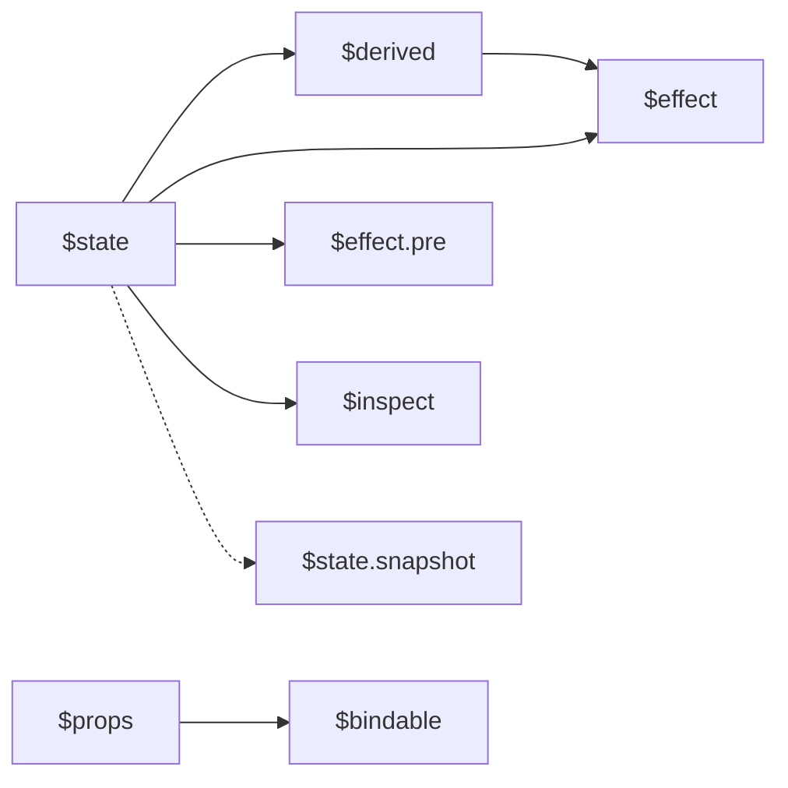
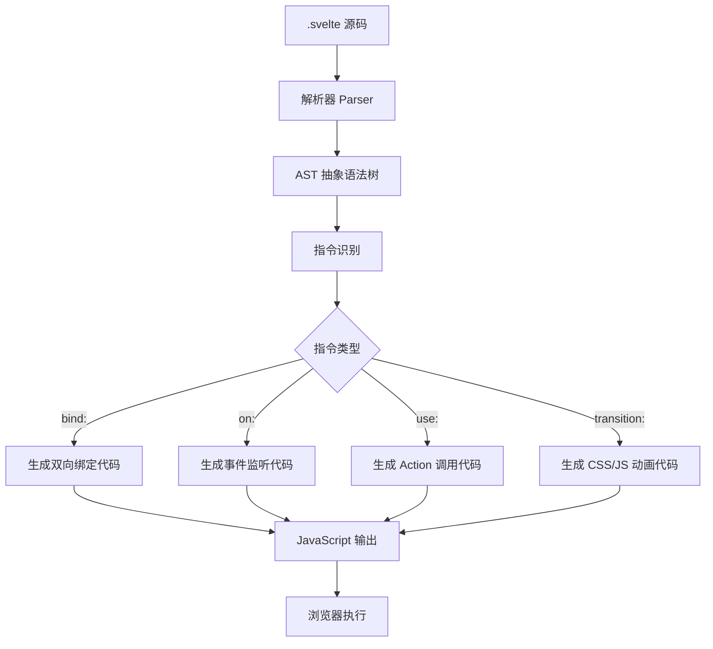
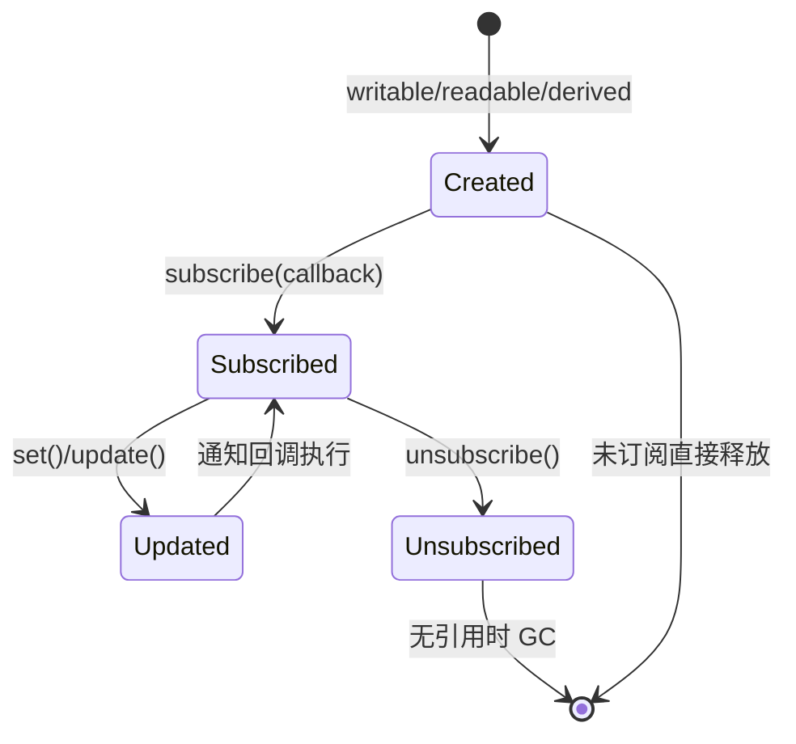

# Svelte 语言完全参考

> **版本覆盖**: Svelte 4.x / Svelte 5 (Runes 模式)
> **目标读者**: 需要深入理解 Svelte 编译器语义、响应式原理与工程实践的高级开发者
> **文档定位**: 语法参考 + 语义模型 + 反模式清单，非入门教程
---

> **最后更新**: 2026-05-01

---

## 1. 模板语法体系

Svelte 的模板语法是一种声明式 DSL（Domain Specific Language），在编译阶段被转换为高效的 imperative DOM 操作代码。理解其语义模型比记忆语法更重要——模板中的每个语法元素都有明确的编译期行为和运行时语义。

### 1.1 表达式语义

#### 1.1.1 `{expression}` 求值规则

模板中的 `{expression}` 并非简单的字符串插值，而是具有以下语义特征：

1. **响应式绑定**: 当 `expression` 中引用的响应式状态（`$state`、`$derived`、Store）发生变化时，Svelte 会自动重新求值并更新 DOM。
2. **作用域解析**: 表达式在组件实例的上下文中求值，可访问 `let` 声明的变量、函数、import 的模块、以及特殊的绑定变量。
3. **单次求值保证**: 在每次更新周期中，一个 `{expression}` 只被求值一次，即使它在模板中出现多次（编译器会提取为临时变量）。

```svelte
<script>
  let count = $state(0);
  let doubled = $derived(count * 2);
</script>

<!-- expression 语义：读取 count 和 doubled，建立依赖关系 -->
<p>{count} × 2 = {doubled}</p>
```

**求值时序**：

- 初始挂载：按 DOM 树前序遍历求值
- 状态更新：按依赖图拓扑排序求值，确保 `doubled` 在 `count` 更新后重新计算
- SSR 环境：表达式在服务端同步求值，不涉及响应式追踪

#### 1.1.2 `@const` 编译时语义

`{@const}` 不是运行时声明，而是编译期常量绑定，具有以下约束：

```svelte
{#each items as item}
  {@const formatted = formatItem(item)}
  <!-- formatted 在每次 each 迭代时绑定一次，不可重新赋值 -->
  <p>{formatted}</p>
{/each}
```

**语义要点**：

- **块级作用域**: 仅在所在块（`{#if}`、`{#each}`、`{#await}`）内有效
- **单次求值**: 每次块创建/迭代时求值一次，不建立响应式依赖
- **不可变性**: 尝试重新赋值 `{@const}` 变量会在编译期报错
- **用途**: 提取复杂的派生计算，避免在模板中重复求值

#### 1.1.3 文本插值转义规则

Svelte 对文本插值默认执行 HTML 实体转义，这是安全默认（secure by default）设计：

```svelte
<script>
  let userInput = '<script>alert(1)</script>';
</script>

<!-- 输出: &lt;script&gt;alert(1)&lt;/script&gt; -->
<p>{userInput}</p>

<!-- {@html} 是显式的"我了解风险"选择 -->
<p>{@html userInput}</p>  <!-- XSS 风险！仅在可信内容使用 -->
```

**转义语义**：

| 字符 | 转义为 | 说明 |
|------|--------|------|
| `<` | `&lt;` | 防止标签注入 |
| `>` | `&gt;` | 防止标签闭合 |
| `&` | `&amp;` | 防止实体引用注入 |
| `"` | `&quot;` | 属性上下文转义 |
| `'` | `&#39;` | 属性上下文转义 |

### 1.2 指令语义模型表格

Svelte 的指令（Directive）系统是一组编译器识别的特殊属性，每个指令都有明确的语法形式、语义定义、编译输出和常见错误模式。

| 指令 | 语法形式 | 语义定义 | 编译输出示意 | 常见错误 |
|------|----------|----------|-------------|----------|
| `bind:` | `bind:prop={var}` | 双向绑定：建立变量与 DOM 属性的同步通道。当 DOM 属性变化时回写变量，当变量变化时更新 DOM。 | `addEventListener('input', e => var = e.target.value)` + 响应式更新赋值 | 绑定到非响应式变量（普通 `let` 在 Svelte 5 Runes 模式下不触发更新）；绑定到 `const` 声明 |
| `on:` | `on:event={handler}` | 事件处理：编译器根据事件类型决定委托（delegation）或直接监听（direct listener）。大多数事件使用委托以减少内存占用。 | 委托事件：`div.addEventListener('click', handler)`（挂载到容器）；非委托事件：`element.addEventListener('scroll', handler)` | 内联箭头函数导致每次渲染重新创建：`on:click={() => handle(id)}`（应使用数据属性或柯里化）；忘记移除导致内存泄漏（组件销毁时 Svelte 自动清理，但手动 `addEventListener` 不会） |
| `use:` | `use:action` | Action：DOM 挂载生命周期钩子。在元素挂载时调用 action 函数，卸载时调用返回的 `destroy`。Action 是对底层 DOM 的直接操作通道。 | `action(element, params)` 在 mount 时调用；返回 `{ update?, destroy? }` | 与 Vue 的 `use` 指令或 React Hook 命名混淆；在 Action 中直接修改响应式状态导致循环更新 |
| `transition:` | `transition:fn` | 过渡：元素进入（enter）/离开（leave）时的状态机动画。`transition` 双向，`in:` / `out:` 单向。 | CSS animation + JS 钩子（`css` / `tick` 函数）。编译器包装元素为 `if` 块并注入动画控制器。 | SSR 时不触发（服务端无 DOM 过渡概念）；过渡函数返回格式错误；同时应用冲突的 CSS transition |
| `animate:` | `animate:fn` | FLIP 动画：列表重排时的布局变化插值（First Last Invert Play）。仅能在 `{#each}` 块中使用。 | 测量旧位置 `getBoundingClientRect` → 计算差值 → 应用 `transform` 插值 → 播放动画。依赖 `requestAnimationFrame`。 | 容器尺寸变化导致测量失效；未指定 `flip` 参数时动画生硬；与 CSS `position: absolute` 冲突 |
| `class:` | `class:name` | 条件类名：布尔表达式映射到类名的存在性。`true` 添加类，`false` 移除类。 | 三元表达式：`element.classList.toggle('name', expression)` 或内联条件赋值 | 与全局 CSS 类名冲突（作用域 CSS 未覆盖）；表达式返回非布尔值（隐式转换可能不符合预期） |
| `style:` | `style:prop` | 内联样式：直接样式属性绑定，比 `style="..."` 字符串更安全（避免注入）。 | `element.style.setProperty('prop', value)` 或 `element.style.prop = value` | 优先级低于 `!important`（这是 CSS 层叠规则，非 Svelte 问题）；值类型错误（如传入对象而非字符串） |
| `bind:this` | `bind:this={ref}` | 元素引用绑定：将 DOM 元素或组件实例赋值给变量。 | `ref = element` 在 mount 时；`ref = null` 在 unmount 时 | 在组件挂载前访问 `ref`（值为 `undefined`）；混淆 DOM ref 和组件实例 ref |
| `bind:group` | `bind:group={selected}` | 表单组绑定：多选框/单选按钮的互斥或集合语义。 | 维护内部 Set 或单一值，根据 `input.type` 自动适配 | 混用不同 `name` 的 `bind:group`；在动态生成的表单中绑定失效 |
| `bind:`（组件） | `bind:prop` | 组件级双向绑定：父组件变量与子组件 `$bindable()` prop 建立同步。 | 编译为 `prop` + `on:change` 等价物，通过回调实现双向同步 | Svelte 5 中需要显式 `$bindable()` 声明；混淆 `bind:` 与普通 prop 传递 |

### 1.3 控制流语义

#### 1.3.1 `{#if}` 条件渲染语义

`{#if}` 实现的是**条件挂载/卸载**语义，而非 React 的 "条件渲染返回 null"：

```svelte
{#if condition}
  <Component />
{/if}
```

**语义对比**：

| 维度 | Svelte `{#if}` | React `{condition && <Comp />}` |
|------|----------------|--------------------------------|
| DOM 操作 | 条件为 false 时移除 DOM 节点 | 返回 null 时不创建/移除节点 |
| 组件生命周期 | false 时触发 `destroy`，true 时重新 `mount` | 组件保持挂载，仅不渲染 |
| 状态保留 | 不保留（除非配合 `{#key}` 或外部 Store） | 保留（组件实例不被销毁） |
| 过渡支持 | 支持 `out:` 过渡（条件变为 false 时播放） | 需手动处理（如 `AnimatePresence`） |

#### 1.3.2 `{#each}` 列表渲染语义

`{#each}` 是 Svelte 最复杂的控制流，涉及 key 算法和更新策略：

```svelte
{#each items as item, index (item.id)}
  <Item data={item} />
{/each}
```

**Key 算法语义**：

- **无 key**：Svelte 使用**就地更新**（in-place update）策略。按索引顺序比较，更新每个位置的数据。DOM 节点复用，仅更新变化的 prop。
- **有 key**：Svelte 使用 key 驱动的**差异化算法**（类似于 React 的 reconciliation，但实现不同）。通过 key 匹配旧节点与新节点，移动 DOM 节点以最小化操作。

**就地更新 vs 重建**：

| 场景 | 策略 | 结果 |
|------|------|------|
| 列表头部插入 | 无 key | 所有节点更新内容，不移动 DOM，效率高但可能破坏组件状态 |
| 列表排序 | 有 key | DOM 节点物理移动，组件状态跟随节点保留 |
| 列表过滤 | 有 key | 未匹配的节点销毁，新 key 的节点创建 |

**⚠️ 关键约束**：`{#each}` 块内声明的变量（包括 `as` 绑定的迭代变量）在每次更新时可能重新绑定。若需要保留组件内部独立状态，必须使用 key。

#### 1.3.3 `{#await}` 异步渲染语义

`{#await}` 将 Promise 的三种状态映射到声明式模板：

```svelte
{#await promise}
  <Loading />
{:then value}
  <Content data={value} />
{:catch error}
  <Error message={error.message} />
{/await}
```

**状态机语义**：

```
          +---------+
          | pending |
          +----+----+
               | promise resolve
               v
         +-----------+
    +--->| fulfilled |<---+
    |    +-----------+    | promise 重新赋值
    |         |           |
    |    catch block      |
    |    不自动重试        |
    v                     |
+----------+              |
| rejected |--------------+
+----------+  重新赋值新 promise
```

- **pending**: Promise 尚未 resolve/reject。若 promise 初始即为 resolved，则直接跳到 `:then`。
- **fulfilled**: Promise resolve 后的值绑定到 `:then` 块的变量。
- **rejected**: Promise reject 的原因绑定到 `:catch` 块的变量。
- **重新赋值**: 当 `promise` 变量被重新赋值时，状态机重置为 pending。

#### 1.3.4 `{#key}` 强制重建语义

`{#key}` 是最强力的控制流，实现**完全销毁+重建**语义：

```svelte
{#key userId}
  <UserProfile id={userId} />
{/key}
```

当 `userId` 变化时，`UserProfile` 组件被完全销毁（触发所有 `destroy` 生命周期、Action 的 `destroy`、Effect 清理），然后使用新 prop 重新创建。这是保留状态与强制重置之间的明确语义边界。

### 1.4 特殊语法元素

#### 1.4.1 `<svelte:self>` 递归语义

`<svelte:self>` 在编译期被替换为当前组件的引用，实现递归渲染：

```svelte
<!-- TreeNode.svelte -->
<script>
  let { node } = $props();
</script>

<div>{node.name}</div>
{#if node.children}
  {#each node.children as child}
    <!-- svelte:self 递归渲染子树 -->
    <svelte:self node={child} />
  {/each}
{/if}
```

**语义约束**：

- 必须具有终止条件（如 `{#if}`），否则导致无限递归
- 递归深度受调用栈限制
- 每次递归创建独立组件实例，拥有独立状态

#### 1.4.2 `<svelte:component>` 动态组件语义

```svelte
<svelte:component this={CurrentComponent} propA={value} />
```

**语义要点**：

- `this` 为组件构造函数（Svelte 4）或组件定义（Svelte 5）。`null`/`false` 时不渲染。
- 当 `this` 变化时，旧组件完全销毁，新组件创建（等价于 `{#key}` 语义）。
- Prop 按名称传递，不同组件间无类型安全检查（编译时）。

#### 1.4.3 `<svelte:element>` 动态标签语义

```svelte
<svelte:element this={tagName} class="dynamic">
  内容
</svelte:element>
```

- `this` 为字符串标签名（如 `'div'`、`'span'`）。
- 不支持组件作为 `this`（那是 `<svelte:component>` 的语义）。
- 当 `this` 从 `'div'` 变为 `'span'` 时，DOM 节点被替换（非更新）。

#### 1.4.4 全局事件语义

```svelte
<svelte:window on:resize={handleResize} />
<svelte:document on:visibilitychange={handleVisibility} />
<svelte:body on:mouseenter={handleMouseEnter} />
```

**语义模型**：

- 这些不是 DOM 元素，而是编译器识别的事件委托目标
- 事件监听器在组件挂载时注册，销毁时自动移除
- `bind:scrollX`、`bind:online` 等特殊绑定建立与 window 属性的双向同步

#### 1.4.5 `<svelte:head>` SSR 头部注入语义

```svelte
<svelte:head>
  <title>{pageTitle}</title>
  <meta name="description" content={description} />
</svelte:head>
```

- SSR 时：内容被提取到 HTML `<head>` 中
- CSR 时：内容被注入 `document.head`
- 多个组件的 `<svelte:head>` 按组件树顺序合并，后渲染的覆盖冲突项（如 `<title>`）

#### 1.4.6 `<svelte:options>` 编译选项语义

```svelte
<svelte:options tag="my-element" immutable={true} accessors={true} />
```

| 选项 | 语义 |
|------|------|
| `immutable` | 假设所有 prop 和状态都是不可变的，使用严格相等（`===`）比较，跳过深度比较以优化性能 |
| `accessors` | 生成组件类的 getter/setter，允许通过 ref 从外部访问组件内部变量 |
| `tag` | 将组件编译为自定义元素（Web Component） |
| `namespace` | 指定 SVG/MathML 命名空间，影响属性设置方式 |

#### 1.4.7 Snippet 调用语义（Svelte 5）

```svelte
<!-- 定义 Snippet -->
{#snippet hello(name)}
  <p>Hello, {name}!</p>
{/snippet}

<!-- 渲染 Snippet -->
{@render hello('World')}
```

`<svelte:fragment>` 是 Svelte 4 的概念，在 Svelte 5 中被 Snippet 取代：

| 特性 | Svelte 4 Slot / Fragment | Svelte 5 Snippet |
|------|--------------------------|------------------|
| 定义位置 | 父组件调用处隐式传入 | 显式 `{#snippet}` 块定义 |
| 参数传递 | 通过 `let:` 指令（作用域插槽） | 显式函数参数 `{#snippet name(params)}` |
| 类型支持 | 弱（依赖约定） | 强（TypeScript 函数类型） |
| 复用性 | 每组件一个默认插槽 | 任意位置定义，多次渲染 |
| 作用域 | 子组件控制渲染时机 | 调用方控制，参数按值传递 |

---

## 2. Runes 语义模型（形式化）

Svelte 5 引入的 Runes 是一组编译器宏（compiler macros），它们在编译期被转换为响应式系统的底层操作。理解 Runes 的语义模型，需要从**信号（Signal）**、**依赖图（Dependency Graph）**、**副作用（Effect）**三个核心概念出发。

### 2.1 语义公理

以下公理构成 Svelte 5 响应式系统的形式化基础。它们不是 API 文档，而是不可违反的核心语义约束。

#### Axiom 1: `$state` 创建响应式信号

> **公理 1**: 调用 `$state(initialValue)` 创建一个**信号（Signal）**——一个持有值并维护订阅者列表的响应式原语。对返回值的读取操作建立依赖，赋值操作触发更新。

形式化表达：

```
let s = $state(v₀)
// 语义等价于:
// s = createSignal(v₀)
// s.get() → 返回当前值，将当前 effect/derived 注册为订阅者
// s.set(v₁) → 更新值，若 v₁ !== v₀ 则调度所有订阅者重新执行
```

**关键语义**：

- `$state` 的参数是**初始值**，非响应式来源。若传入 `$state` 变量，不会建立嵌套依赖。
- 对 `$state` 返回值的**读取**（read）操作是依赖追踪的唯一触发条件。
- **赋值**（write）操作若新值与旧值严格相等（`Object.is`），则跳过更新传播。
- 对象/数组被自动包装为 Proxy，实现深层（deep）响应式。

#### Axiom 2: `$derived` 建立依赖图边

> **公理 2**: 调用 `$derived(expression)` 创建一个**派生信号（Derived Signal）**，其值由 `expression` 的求值结果决定。`$derived` 在表达式中的每个响应式读取与派生信号之间建立**有向边**。

形式化表达：

```
let d = $derived(f())
// 语义等价于:
// d = createDerived(() => f())
// 在 f() 执行期间，所有被读取的信号自动注册为 d 的依赖
// d.get() → 若依赖未变化，返回缓存值；若依赖变化，重新执行 f() 并缓存
```

**关键语义**：

- `$derived` 是**懒求值**（lazy evaluation）：仅在读取时执行，且仅当依赖变化时重新执行。
- `$derived` 的表达式必须是**纯函数**（pure function）：相同的输入必须产生相同的输出，无副作用。
- `$derived` 自身可以作为其他 `$derived` 或 `$effect` 的依赖，形成**依赖图（DAG）**。

#### Axiom 3: `$effect` 注册副作用回调

> **公理 3**: 调用 `$effect(fn)` 注册一个**副作用（Effect）**。`fn` 在组件挂载后首次执行，此后每当 `fn` 内部读取的响应式信号变化时重新执行。`fn` 可返回清理函数，在 Effect 重新执行或组件销毁前调用。

形式化表达：

```
$effect(() => {
  let value = s.get();  // 建立依赖
  performSideEffect(value);
  return () => cleanup();  // 可选清理函数
})
// 语义:
// effect = createEffect(() => { ... })
// mount 后首次执行
// s 变化 → 调度 effect 重新执行 → 先调用 cleanup() → 再执行新 fn
```

**关键语义**：

- `$effect` 的执行是**异步调度**的：状态变化不会立即触发 Effect，而是放入微任务队列，批量处理。
- `$effect` 的依赖是**动态追踪**的：每次执行时读取的信号集合构成当次依赖集，可能因分支条件而变化。
- 清理函数（cleanup）遵循 **RAII 模式**：在重新执行前清理旧资源，在组件卸载时清理最后一批资源。

#### Axiom 4: `$props` 声明外部输入接口

> **公理 4**: 调用 `$props()` 声明组件的**外部输入接口**。返回的对象是父组件传递 prop 的只读（默认）代理。`$props()` 将父组件的响应式值透传到子组件的依赖图中。

形式化表达：

```
let { a, b = defaultValue } = $props();
// 语义:
// props = createPropsProxy(parentProps)
// a = props.a → 若父组件传递的是信号，建立透传依赖
// b 有默认值，仅在父组件未传递时使用
```

**关键语义**：

- `$props()` 的返回值是**浅响应式**的：解构出的变量本身是响应式的，但对象内部属性需要单独追踪。
- `$props()` 不创建新的信号，而是建立**透传通道**（passthrough）：子组件读取 prop 时，实际上读取的是父组件的状态。
- 默认值的求值是**惰性的**：仅在未传递对应 prop 时执行。

### 2.2 语义规则与推导

基于上述公理，可推导出以下运行时行为规则。

#### Rule 1: 依赖追踪规则（读取即依赖）

> **规则 1**: 在 `$derived` 或 `$effect` 的执行上下文中，对 `$state` / `$derived` / `$props`（透传）返回值的**任何读取操作**都自动建立依赖关系。

```svelte
<script>
  let a = $state(0);
  let b = $state(0);
  let condition = $state(true);

  $effect(() => {
    if (condition) {
      console.log(a);  // 仅当 condition 为 true 时，a 成为依赖
    }
    console.log(b);     // b 永远是依赖
  });
</script>
```

**动态依赖语义**：

- 第一次执行：`condition = true`，依赖集 = `{condition, a, b}`
- `a` 变化 → Effect 重新执行
- `condition` 变为 `false` → Effect 重新执行，这次不读取 `a`
- 后续 `a` 变化 → **不会**触发 Effect（依赖集已更新为 `{condition, b}`）

#### Rule 2: 更新传播规则（脏检查 → 调度 → 执行）

> **规则 2**: 响应式更新遵循三阶段流水线：**脏标记（Dirty Marking）** → **调度（Scheduling）** → **执行（Execution）**。信号变化时立即标记下游为 dirty，但 Effect 的执行被推迟到当前同步代码块结束后。

```
状态变化发生
    │
    ▼
┌─────────────┐
│ Dirty Mark  │  标记直接依赖者（derived/effect）为 dirty
└──────┬──────┘
       │
       ▼
┌─────────────┐
│ Schedule    │  将 effect 加入微任务队列（Promise.resolve）
└──────┬──────┘
       │
       ▼
┌─────────────┐
│ Execute     │  按拓扑排序执行所有 dirty effect
└─────────────┘
```

**批量更新（Batching）**：

```svelte
<script>
  let a = $state(0);
  let b = $state(0);

  $effect(() => {
    console.log('effect:', a, b);
  });

  function update() {
    a = 1;   // 不立即触发 effect
    b = 2;   // 不立即触发 effect
  }
  // 函数返回后，微任务执行，effect 只触发一次，输出: effect: 1 2
</script>
```

#### Rule 3: Effect 执行顺序规则（拓扑排序）

> **规则 3**: 多个 Effect 的执行顺序由**依赖图的拓扑序**决定。若 Effect A 读取了 Effect B 写入的状态，则 B 在 A 之前执行。无依赖关系的 Effect 按声明顺序执行。

```svelte
<script>
  let x = $state(0);
  let y = $state(0);

  // Effect 1: 写入 y
  $effect(() => {
    y = x * 2;  // 读取 x，写入 y
  });

  // Effect 2: 读取 y
  $effect(() => {
    console.log(y);  // 读取 y
  });
</script>
```

执行顺序保证：Effect 1 先于 Effect 2 执行。若顺序颠倒，Effect 2 第一次可能读取到旧值，但后续更新仍会保持一致。

**⚠️ 循环依赖**：若 Effect A 写入状态 S1，Effect B 读取 S1 并写入 S2，Effect A 读取 S2，则形成循环。Svelte 会检测无限循环并在一定次数迭代后抛出错误。

#### Rule 4: 清理规则（Cleanup）

> **规则 4**: `$effect` 返回的清理函数在两种场景下被调用：（1）Effect 即将重新执行前，清理旧执行周期的资源；（2）组件销毁时，清理最后执行周期的资源。

```svelte
<script>
  let id = $state(1);

  $effect(() => {
    const controller = new AbortController();
    fetch(`/api/user/${id}`, { signal: controller.signal })
      .then(r => r.json())
      .then(data => { /* ... */ });

    // 清理：取消进行中的请求
    return () => controller.abort();
  });
</script>
```

**语义保证**：

- 清理函数总是在新 Effect 执行**之前**调用，避免资源竞争。
- 清理函数中不应读取响应式状态或触发新副作用（可能导致不可预测行为）。
- 若 Effect 从未执行（如被条件分支跳过），清理函数也不会被调用。

### 2.3 每个 Runes 的完整定义

#### `$state`

**定义**: 创建响应式状态信号。是 Svelte 5 响应式系统的核心原语。

**属性**：

| 属性 | 说明 |
|------|------|
| 参数 | `initialValue: T` — 任意类型的初始值 |
| 返回值 | `T` — 与初始值同类型的响应式代理（若是对象/数组）或包装值（若是原始值） |
| 约束 | 必须在组件顶层或函数顶层调用（不能在嵌套块中条件调用，但可在函数内调用创建局部状态） |

**关系**：

- `$state` → `$derived`: `$state` 是 `$derived` 的最常见依赖源
- `$state` → `$effect`: `$effect` 读取 `$state` 建立订阅关系
- `$state` ← `$props`: 父组件的 `$state` 可通过 `$props` 透传

**示例**：

```svelte
<script>
  // 原始值状态
  let count = $state(0);

  // 对象状态（自动 Proxy 化）
  let user = $state({ name: 'Alice', age: 30 });

  // 数组状态
  let items = $state([1, 2, 3]);

  function increment() {
    count++;           // 触发更新
    user.age++;        // Proxy 拦截，触发更新
    items.push(4);     // Proxy 拦截数组方法，触发更新
  }
</script>
```

**反例**：

```svelte
<script>
  // ❌ 错误：尝试在条件块中声明 $state
  if (someCondition) {
    let x = $state(0);  // 编译错误：Runes 必须在顶层调用
  }

  // ❌ 错误：将 $state 赋值给非响应式变量后修改
  let state = $state({ count: 0 });
  let plain = state;     // plain 是 Proxy 引用，但重新赋值 plain = ... 不会触发更新
  plain = { count: 1 };  // 这是变量重新赋值，不是 Proxy 属性修改

  // ✅ 修复：始终通过原始引用修改
  state.count = 1;
</script>
```

---

#### `$derived`

**定义**: 创建派生状态。值由表达式的求值结果决定，自动追踪表达式中的响应式依赖。

**属性**：

| 属性 | 说明 |
|------|------|
| 参数 | `expression: () => T` — 求值表达式，隐式包装为函数 |
| 返回值 | `T` — 派生值，读取时懒求值 |
| 约束 | 表达式必须是纯函数，无副作用；不允许直接赋值给 `$derived` 结果 |

**关系**：

- `$derived` → `$state`: 依赖 `$state` 创建派生值
- `$derived` → `$derived`: 可链式派生，形成依赖图
- `$derived` ← `$effect`: `$effect` 可读取 `$derived`，建立传递依赖

**示例**：

```svelte
<script>
  let firstName = $state('John');
  let lastName = $state('Doe');

  // 自动追踪 firstName 和 lastName
  let fullName = $derived(`${firstName} ${lastName}`);

  // 链式派生
  let greeting = $derived(`Hello, ${fullName}!`);
</script>

<p>{greeting}</p>
```

**反例**：

```svelte
<script>
  let count = $state(0);

  // ❌ 错误：在 $derived 中执行副作用
  let doubled = $derived(() => {
    console.log('derived executed');  // 副作用！
    fetch('/api');                     // 异步副作用！
    return count * 2;
  });

  // ✅ 修复：副作用移到 $effect 中
  let doubled = $derived(count * 2);
  $effect(() => {
    console.log('count changed to', count);
  });

  // ❌ 错误：尝试赋值给 $derived
  doubled = 10;  // 编译错误：$derived 是只读的
</script>
```

---

#### `$effect`

**定义**: 注册副作用。在组件挂载后执行，响应式依赖变化时重新执行，支持清理函数。

**属性**：

| 属性 | 说明 |
|------|------|
| 参数 | `fn: () => (void \| (() => void))` — 副作用函数，可选返回清理函数 |
| 返回值 | `void` |
| 约束 | 不在 SSR 期间执行；清理函数不应触发新状态变化 |

**关系**：

- `$effect` → `$state` / `$derived` / `$props`: 读取响应式值建立依赖
- `$effect` → DOM: 可直接操作 DOM（但优先使用模板绑定）
- `$effect` → `$effect`: 无直接顺序保证，由依赖图拓扑决定

**示例**：

```svelte
<script>
  let count = $state(0);
  let element;

  // 基础 effect：响应状态变化
  $effect(() => {
    document.title = `Count: ${count}`;
  });

  // 带清理的 effect：事件订阅
  $effect(() => {
    const handler = () => count++;
    element?.addEventListener('click', handler);
    return () => element?.removeEventListener('click', handler);
  });
</script>

<button bind:this={element}>Click</button>
```

**反例**：

```svelte
<script>
  let count = $state(0);

  // ❌ 错误：在 $effect 中同步修改被依赖的 $state → 无限循环
  $effect(() => {
    console.log(count);
    count++;  // count 变化 → effect 重新执行 → count++ → 循环
  });

  // ✅ 修复：使用条件终止，或改用 $derived
  // 若目的是追踪变化次数：
  let changeCount = $state(0);
  $effect(() => {
    // 先读取，建立依赖
    const current = count;
    // 使用微任务或下一帧修改，打破同步循环
    queueMicrotask(() => {
      changeCount++;
    });
  });

  // ❌ 错误：忘记 cleanup → 内存泄漏
  $effect(() => {
    const interval = setInterval(() => {
      console.log(count);
    }, 1000);
    // 缺少 return () => clearInterval(interval)
  });
</script>
```

---

#### `$effect.pre`

**定义**: 预渲染副作用（pre-effect）。在 DOM 更新**之前**执行，而非默认的更新**之后**。

**属性**：

| 属性 | 说明 |
|------|------|
| 参数 | 同 `$effect` |
| 执行时机 | 状态变化后、DOM 更新前 |
| 用途 | 读取更新前的 DOM 状态、计算布局差异 |

**关系**：

- `$effect.pre` 与 `$effect` 共享相同的依赖追踪机制
- 同一状态变化时：`$effect.pre` 先于 `$effect` 执行

**示例**：

```svelte
<script>
  let height = $state(0);
  let element;

  // 在 DOM 更新前记录旧高度
  $effect.pre(() => {
    const oldHeight = element?.offsetHeight;
    // DOM 即将更新...
    // 与 $effect 配合实现 FLIP 动画
  });
</script>
```

**反例**：

```svelte
<script>
  let count = $state(0);

  // ❌ 错误：在 $effect.pre 中读取会变化的状态并同步修改
  $effect.pre(() => {
    // 这会立即触发另一次更新，可能导致递归
    count = count + 1;
  });
</script>
```

---

#### `$effect.root`

**定义**: 创建游离的 Effect 根上下文。返回的 cleanup 函数可手动调用来销毁所有内部 Effect。

**属性**：

| 属性 | 说明 |
|------|------|
| 参数 | `fn: (cleanup: (fn: () => void) => void) => void` — 接受 cleanup 注册器的函数 |
| 返回值 | `() => void` — 手动清理函数 |
| 用途 | 在组件外创建 Effect（如全局事件、模块级状态监听） |

**关系**：

- `$effect.root` 创建的 Effect 生命周期由调用方控制，不受组件销毁影响
- 内部可使用 `$effect`、`$state`、`$derived`

**示例**：

```svelte
<script>
  import { $effect.root } from 'svelte';

  // 模块级副作用，跨组件实例共享
  const cleanup = $effect.root((cleanup) => {
    const handler = () => console.log('global click');
    document.addEventListener('click', handler);
    cleanup(() => document.removeEventListener('click', handler));

    // 内部的 $effect 同样被 root 管理
    $effect(() => {
      // ...
    });
  });

  // 组件销毁时手动清理
  onDestroy(() => cleanup());
</script>
```

**反例**：

```svelte
<script>
  // ❌ 错误：在 $effect.root 内部忘记注册 cleanup
  $effect.root(() => {
    const interval = setInterval(() => {}, 1000);
    // 未调用 cleanup(() => clearInterval(interval))
    // 即使调用外部返回的 cleanup()，interval 也不会被清理
  });
</script>
```

---

#### `$props`

**定义**: 声明组件的外部输入接口。接收父组件传递的 props，支持默认值和类型标注。

**属性**：

| 属性 | 说明 |
|------|------|
| 语法 | `let { propA, propB = defaultValue } = $props();` |
| 泛型 | `let props = $props<{ propA: string }>()` — TypeScript 类型约束 |
| 返回值 | 解构后的响应式变量 |

**关系**：

- `$props` → `$bindable`: `$bindable()` 标记的 prop 可被父组件 `bind:`
- `$props` → `$state`: prop 可在组件内部被赋值给 `$state` 以创建本地副本

**示例**：

```svelte
<script>
  // 基础 props 声明
  let { title, count = 0 } = $props();

  // TypeScript 类型
  let { id }: { id: number } = $props();
</script>

<h1>{title}</h1>
<p>{count}</p>
```

**反例**：

```svelte
<script>
  // ❌ 错误：直接修改 props（违反单向数据流）
  let { count } = $props();
  function increment() {
    count++;  // 编译警告：props 是只读的，除非使用 $bindable
  }

  // ✅ 修复：创建本地状态或向上传递事件
  let { count, onincrement } = $props();
  function increment() {
    onincrement?.();  // 回调模式
  }

  // 或声明为可绑定
  // let { count = $bindable() } = $props();
</script>
```

---

#### `$bindable`

**定义**: 标记 prop 为可双向绑定。仅能在 `$props()` 解构中使用，允许父组件通过 `bind:` 指令建立双向同步。

**属性**：

| 属性 | 说明 |
|------|------|
| 语法 | `let { value = $bindable() } = $props();` |
| 默认值 | `let { value = $bindable(defaultValue) } = $props();` |
| 约束 | 仅标记需要双向绑定的 prop；子组件需显式赋值以通知父组件 |

**关系**：

- `$bindable` 是 `$props` 的修饰符，不独立使用
- `$bindable` + `bind:` = 父子状态同步通道

**示例**：

```svelte
<!-- Child.svelte -->
<script>
  let { value = $bindable(0) } = $props();
</script>

<input bind:value />

<!-- Parent.svelte -->
<script>
  let parentValue = $state(0);
</script>

<Child bind:value={parentValue} />
```

**反例**：

```svelte
<script>
  // ❌ 错误：在非 $props 上下文使用 $bindable
  let x = $bindable(0);  // 编译错误

  // ❌ 错误：忘记子组件内部赋值以触发同步
  let { value = $bindable(0) } = $props();
  function update() {
    // 需要显式赋值 value = newValue，而非修改其他变量
  }
</script>
```

---

#### `$inspect`

**定义**: 开发调试工具。在 Effect 中追踪响应式值的变化，在开发模式下打印到控制台。

**属性**：

| 属性 | 说明 |
|------|------|
| 语法 | `$inspect(value1, value2, ...)` |
| 环境 | 仅在开发模式（`dev: true`）有效，生产构建被移除 |
| 输出 | 值变化时打印 `{ 标签: 值 }` |

**关系**：

- `$inspect` 内部使用 `$effect` 实现追踪
- 不建立新的响应式关系，仅观察

**示例**：

```svelte
<script>
  let count = $state(0);
  let name = $state('Svelte');

  $inspect(count, name);  // 开发模式：count 或 name 变化时打印
</script>
```

---

#### `$inspect.trace`

**定义**: `$inspect` 的增强版，不仅打印值变化，还追踪**哪个 Effect/Derived 导致了变化**。

**属性**：

| 属性 | 说明 |
|------|------|
| 语法 | `$inspect.trace()` — 在 Effect 或 Derived 内部调用 |
| 输出 | 打印当前执行的调用栈和触发源 |
| 用途 | 调试意外的更新循环、追踪状态变化源头 |

**示例**：

```svelte
<script>
  let count = $state(0);

  $effect(() => {
    $inspect.trace();  // 打印：此 effect 因何被触发
    console.log(count);
  });
</script>
```

---


## 3. 组件接口语义

组件是 Svelte 应用的基本组合单元。理解组件接口的语义——包括 Props、Events 和 Snippets——是构建可维护应用的关键。

### 3.1 Props 语义

#### 3.1.1 定义：组件的外部契约接口

Props（Properties）是组件与外部环境之间的**显式契约**。它们定义了组件期望接收的数据、类型约束和默认值。

**核心语义**：

1. **单向数据流**: Props 默认是只读的。数据从父组件流向子组件，子组件通过回调通知父组件更新。
2. **响应式透传**: 父组件传递的响应式值（`$state`、`$derived`）在子组件中保持响应式。子组件读取 prop 时，实际读取的是父组件状态的引用。
3. **快照语义**: 解构 `$props()` 时，获取的是响应式绑定的快照引用，而非值的静态拷贝。

```svelte
<!-- Parent.svelte -->
<script>
  let count = $state(0);
</script>

<!-- count 是响应式信号，Child 中的 count prop 也是响应式的 -->
<Child count={count} />

<!-- Child.svelte -->
<script>
  let { count } = $props();  // count 是父组件信号的透传引用
</script>

<p>{count}</p>  <!-- 父组件 count 变化时自动更新 -->
```

#### 3.1.2 不是什么

**Props 不是全局状态**：

- Props 是组件级局部变量，仅在组件实例作用域内有效
- 跨组件共享状态应使用 Context API 或外部 Store，而非 prop drilling

**Props 不是双向绑定默认**：

- 除非显式使用 `$bindable()` 和 `bind:`，否则 prop 是单向的
- 直接修改 prop 会被编译器警告或静默失败（取决于模式）

#### 3.1.3 `$props()` vs `$bindable()` vs `$props<T>()` 语义差异

| 特性 | `$props()` | `$bindable()` | `$props<T>()` |
|------|-----------|---------------|---------------|
| **基本语义** | 声明只读 props | 标记可双向绑定的 prop | TypeScript 类型约束 |
| **修改权限** | 子组件不可修改 | 子组件可赋值，同步回父组件 | 同 `$props()` 或 `$bindable()` |
| **父组件语法** | `<Child value={x} />` | `<Child bind:value={x} />` | `<Child value={x} />` |
| **编译输出** | 透传读取 | 透传读取 + 赋值回调 | 编译期类型检查 + 运行时透传 |
| **用途** | 纯数据输入 | 表单组件、可控组件 | 类型安全契约 |

```svelte
<script lang="ts">
  // $props<T>() 提供完整类型安全
  interface Props {
    title: string;
    count?: number;
    onsubmit?: (value: string) => void;
  }

  let { title, count = 0, onsubmit }: Props = $props();
</script>
```

### 3.2 Events 语义

#### 3.2.1 DOM 事件委托机制

Svelte 的事件系统基于 **DOM 事件委托（Event Delegation）** 优化：

**委托机制**：

- 大多数事件（click、input、keydown 等）被委托到挂载容器的根元素
- 事件触发时，通过 `event.target` 匹配处理器，减少监听器数量
- 不可委托事件（scroll、focus、blur、mouseenter 等）直接在元素上监听

**语义优势**：

| 场景 | 行为 |
|------|------|
| 1000 个按钮的 click | 1 个委托监听器，而非 1000 个 |
| 动态列表项 | 无需为新增项注册监听器 |
| 内存管理 | 组件销毁时自动清理委托表条目 |

#### 3.2.2 组件自定义事件

**Svelte 4（已弃用）**: `createEventDispatcher`

```svelte
<script>
  import { createEventDispatcher } from 'svelte';
  const dispatch = createEventDispatcher();

  function handleClick() {
    dispatch('submit', { value: 'data' });
  }
</script>
```

**Svelte 5（推荐）**: 回调 Props 模式

```svelte
<!-- Child.svelte -->
<script>
  let { onsubmit } = $props();

  function handleClick() {
    onsubmit?.({ value: 'data' });  // 直接调用回调 prop
  }
</script>

<!-- Parent.svelte -->
<script>
  function handleSubmit(event) {
    console.log(event.value);
  }
</script>

<Child onsubmit={handleSubmit} />
```

**语义对比**：

| 维度 | `createEventDispatcher` | 回调 Props |
|------|------------------------|-----------|
| 类型安全 | 弱（字符串事件名） | 强（TypeScript 函数类型） |
| 事件冒泡 | 支持（DOM 事件机制） | 不支持（直接函数调用） |
| 传播控制 | `event.preventDefault()` 等 | 函数参数约定 |
| 性能 | 创建自定义 Event 对象 | 直接调用，零开销 |
| 可组合性 | 事件名可能冲突 | 明确的 prop 命名空间 |

#### 3.2.3 事件修饰符语义

Svelte 提供声明式事件修饰符，编译为对应的事件处理包装：

| 修饰符 | 语义 | 编译输出示意 |
|--------|------|-------------|
| `preventDefault` | 调用 `event.preventDefault()` | `handler = (e) => { e.preventDefault(); fn(e); }` |
| `stopPropagation` | 调用 `event.stopPropagation()` | `handler = (e) => { e.stopPropagation(); fn(e); }` |
| `stopImmediatePropagation` | 调用 `event.stopImmediatePropagation()` | 同上，调用时机更早 |
| `capture` | 在捕获阶段监听 | `addEventListener(type, fn, { capture: true })` |
| `once` | 只触发一次后自动移除 | `addEventListener(type, fn, { once: true })` |
| `self` | 仅当 `event.target === element` 时触发 | `handler = (e) => { if (e.target !== element) return; fn(e); }` |
| `trusted` | 仅当 `event.isTrusted === true` 时触发 | 过滤合成事件 |
| `passive` | 使用被动监听器（提升滚动性能） | `addEventListener(type, fn, { passive: true })` |

**修饰符组合**：

```svelte
<!-- 链式修饰符，按声明顺序执行 -->
<form on:submit|preventDefault|stopPropagation={handleSubmit}>
```

### 3.3 Slots → Snippets 语义演进

#### 3.3.1 Svelte 4 Slot 语义

```svelte
<!-- Card.svelte (Svelte 4) -->
<div class="card">
  <slot name="header">默认头部</slot>
  <slot>默认内容</slot>
  <slot name="footer" let:footerData>
    {footerData}
  </slot>
</div>

<!-- App.svelte -->
<Card>
  <h1 slot="header">自定义头部</h1>
  <p>主内容</p>
  <span slot="footer" let:footerData={data}>
    {data}
  </span>
</Card>
```

**Slot 语义模型**：

- **默认插槽**: 未命名内容落入 `<slot />`
- **命名插槽**: `slot="name"` 匹配 `<slot name="name" />`
- **作用域插槽**: `let:` 指令将子组件数据传递到父组件插槽内容
- **回退内容**: 插槽无内容时显示默认内容

#### 3.3.2 Svelte 5 Snippet 语义

Snippet 是 Svelte 5 对组件组合模型的根本性重构，从**插槽占位符**模型转向**函数渲染**模型。

```svelte
<!-- Card.svelte (Svelte 5) -->
<script>
  let { header, children, footer } = $props();
</script>

<div class="card">
  {#if header}
    <div class="header">{@render header()}</div>
  {/if}
  <div class="body">{@render children?.()}</div>
  {#if footer}
    <div class="footer">{@render footer()}</div>
  {/if}
</div>

<!-- App.svelte -->
<script>
  import Card from './Card.svelte';
</script>

<Card>
  {#snippet header()}
    <h1>自定义头部</h1>
  {/snippet}

  {#snippet children()}
    <p>主内容</p>
  {/snippet}

  {#snippet footer()}
    <span>页脚</span>
  {/snippet}
</Card>
```

**Snippet 核心语义**：

1. **函数模型**: Snippet 是编译为函数的渲染块，具有参数和返回值（虚拟 DOM 片段）。
2. **显式传递**: Snippet 通过 props 显式传递，子组件通过 `{@render}` 显式调用。
3. **作用域隔离**: Snippet 内部可访问定义处的作用域（闭包），而非渲染处的作用域。
4. **类型安全**: Snippet 参数具有完整的 TypeScript 类型支持。

#### 3.3.3 Snippet 作用域规则

```svelte
<script>
  let local = '定义处变量';
</script>

{#snippet example(param)}
  <!-- 可访问 local（闭包） -->
  <p>{local}</p>
  <!-- 可访问 param（参数） -->
  <p>{param}</p>
  <!-- 不可访问渲染处（子组件内部）的变量！ -->
{/snippet}

<Child render={example} />
```

**作用域规则总结**：

| 变量来源 | 是否可访问 | 说明 |
|----------|-----------|------|
| Snippet 参数 | ✅ | 显式传递 |
| Snippet 定义处的 `let` | ✅ | 闭包捕获 |
| Snippet 渲染处（子组件内） | ❌ | 作用域隔离 |
| 全局/import | ✅ | 模块级作用域 |

#### 3.3.4 Snippet vs Render Props vs Vue 插槽 语义对比

| 特性 | Svelte 5 Snippet | React Render Props | Vue 3 插槽 |
|------|------------------|-------------------|-----------|
| **模型** | 编译为渲染函数 | React 组件（函数） | 编译为作用域插槽函数 |
| **调用语法** | `{@render snippet(args)}` | `{renderProp(args)}` | `<slot :name="data" />` |
| **定义语法** | `{#snippet name(args)}` | 内联 JSX | `<template #name="data">` |
| **作用域** | 定义处闭包 | 调用处作用域 | 子组件作用域（反向） |
| **性能** | 编译优化，无组件开销 | 每次创建新组件实例 | 依赖 Vue 的优化策略 |
| **类型安全** | 强（TS 函数签名） | 中（React.FC） | 强（v-slot TS 支持） |
| **复用性** | 任意位置定义，多次渲染 | 依赖组件组合 | 模板位置定义 |

---

## 4. Store 语义模型

Store 是 Svelte 4 时代的响应式原语，在 Svelte 5 中仍被保留以支持跨组件、跨框架边界的全局状态管理。Store 与 Runes 可以互操作，但语义模型不同。

### 4.1 可写 Store (writable)

**语义**: `writable(initialValue)` 创建一个**可写信号对象**，包含 `subscribe`、`set`、`update` 三个方法。

```javascript
import { writable } from 'svelte/store';

const count = writable(0);

// 订阅（subscribe）语义：建立回调通知通道
const unsubscribe = count.subscribe(value => {
  console.log('count =', value);
});

// set：直接赋值
count.set(10);  // 通知所有订阅者

// update：基于当前值计算新值
count.update(n => n + 1);  // 通知所有订阅者

// 取消订阅：断开通知通道
unsubscribe();
```

**Store 契约（Contract）**：

一个合法的 Svelte Store 必须实现 `Subscribe` 接口：

```typescript
interface Store<T> {
  subscribe(
    run: (value: T) => void,
    invalidate?: (value?: T) => void
  ): () => void;
}
```

**与 `$state` 的关系对比**：

| 维度 | `writable()` Store | `$state()` |
|------|-------------------|-----------|
| **创建** | `writable(v)` | `$state(v)` |
| **读取** | `store.subscribe(cb)` 或 `$store` | 直接读取变量 |
| **写入** | `store.set(v)` / `store.update(fn)` | 直接赋值 |
| **依赖追踪** | 手动订阅/取消订阅 | 编译器自动追踪 |
| **作用域** | 全局、模块级、Context | 组件级、函数级 |
| **跨框架** | 可独立使用 | Svelte 专用 |
| **Svelte 5 推荐** | 全局状态、外部库 | 组件局部状态 |

### 4.2 可读 Store (readable)

**语义**: `readable(initialValue, start)` 创建**只读 Store**，其值由外部源（如 WebSocket、定时器、事件源）驱动。`start` 函数在第一个订阅者接入时调用，`stop` 函数在最后一个订阅者离开时调用。

```javascript
import { readable } from 'svelte/store';

// 只读时钟 Store
const time = readable(new Date(), (set) => {
  // start：第一个订阅者接入时执行
  const interval = setInterval(() => {
    set(new Date());
  }, 1000);

  // 返回 stop 函数：最后一个订阅者离开时执行
  return () => clearInterval(interval);
});

// 使用
$time;  // 自动订阅，自动管理生命周期
```

**生命周期语义**：

```
subscribe 计数 = 0
    │
    ▼ 第一次 subscribe
┌─────────┐
│  start  │ 执行 → 建立外部连接 → 开始推送值
└────┬────┘
     │ 后续 subscribe
     ▼
┌─────────┐
│  复用   │ 已有连接，新订阅者立即接收当前值
└────┬────┘
     │ unsubscribe 直到计数 = 0
     ▼
┌─────────┐
│  stop   │ 执行 → 断开外部连接 → 释放资源
└─────────┘
```

**常见模式**：

```javascript
// 浏览器 API 包装
const online = readable(navigator.onLine, (set) => {
  const handler = () => set(navigator.onLine);
  window.addEventListener('online', handler);
  window.addEventListener('offline', handler);
  return () => {
    window.removeEventListener('online', handler);
    window.removeEventListener('offline', handler);
  };
});
```

### 4.3 派生 Store (derived)

**语义**: `derived(stores, fn)` 创建**派生 Store**，其值由一个或多个源 Store 通过纯函数计算得出。具有**懒求值**和**缓存**特性。

```javascript
import { writable, derived } from 'svelte/store';

const a = writable(2);
const b = writable(3);

// 单源派生
const doubled = derived(a, $a => $a * 2);

// 多源派生（数组形式）
const sum = derived([a, b], ([$a, $b]) => $a + $b);

// 多源派生（对象形式）
const product = derived({ a, b }, ({ a: $a, b: $b }) => $a * $b);

// 带初始值的派生（避免首次订阅时的 undefined）
const safe = derived(a, ($a, set) => {
  set($a * 2);  // 使用 set 进行异步/条件派生
}, 0);  // 初始值
```

**懒求值语义**：

```
derived store 创建
    │
    ▼ 无订阅者
┌─────────┐
│  空闲   │ 不执行 fn，不追踪依赖
└────┬────┘
     │ 第一个订阅者接入
     ▼
┌─────────┐
│  激活   │ 订阅所有源 Store，执行 fn，缓存结果
└────┬────┘
     │ 源 Store 变化
     ▼
┌─────────┐
│  重新   │ 重新执行 fn，更新缓存，通知订阅者
│  求值   │
└────┬────┘
     │ 最后一个订阅者离开
     ▼
┌─────────┐
│  停用   │ 取消源 Store 订阅，回到空闲状态
└─────────┘
```

**与 `$derived` 的关系对比**：

| 维度 | Store `derived` | Runes `$derived` |
|------|----------------|-----------------|
| **求值时机** | 懒求值（首次订阅时） | 懒求值（首次读取时） |
| **依赖声明** | 显式（stores 参数） | 隐式（运行时追踪） |
| **缓存** | 是，基于 Store 值 | 是，基于 Signal 脏标记 |
| **作用域** | 任意（模块、函数） | 组件/函数上下文 |
| **可组合性** | Store 之间自由组合 | 需通过 `$effect` 桥接 |
| **TypeScript** | 需显式泛型 | 类型推断更自然 |

### 4.4 自动订阅前缀 (`$`)

**语义**: 在 Svelte 组件模板中，`$storeName` 是编译器识别的**自动订阅语法糖**，在编译期被转换为 `storeName.subscribe()` 调用和生命周期管理。

```svelte
<script>
  import { writable } from 'svelte/store';
  const count = writable(0);
</script>

<!-- 编译前 -->
<p>{$count}</p>
<button on:click={() => count.update(n => n + 1)}>+</button>

<!-- 编译后（示意） -->
<!--
  let $count;
  onMount(() => {
    const unsubscribe = count.subscribe(value => { $count = value; });
    onDestroy(unsubscribe);
  });
  <p>{ $count }</p>
-->
```

**语义规则**：

1. **自动订阅**: 组件挂载时自动调用 `subscribe()`，获取当前值并持续监听。
2. **自动清理**: 组件销毁时自动调用返回的 `unsubscribe()`，防止内存泄漏。
3. **作用域限制**: `$` 前缀仅在组件的顶层作用域和模板中有效，不能在嵌套函数中使用。
4. **约定命名**: 变量名必须与 Store 变量名一致（`$count` 对应 `count`）。

```svelte
<script>
  const store = writable(0);

  function handleClick() {
    // ❌ 错误：$store 在函数内部不可用
    console.log($store);
  }

  // ✅ 正确：使用 get() 辅助函数或传递值
  import { get } from 'svelte/store';
  function handleClick() {
    console.log(get(store));  // 同步读取当前值（不建立订阅）
  }
</script>

<!-- ✅ 正确：模板中自动订阅 -->
<p>{$store}</p>
```

**Store ↔ Runes 互操作**：

```svelte
<script>
  import { writable } from 'svelte/store';

  // Store → Runes：使用 $effect 桥接
  const store = writable(0);
  let state = $state(0);

  $effect(() => {
    const unsubscribe = store.subscribe(v => {
      state = v;
    });
    return unsubscribe;
  });

  // Runes → Store：使用 $effect 反向同步
  let runeValue = $state(0);
  const derivedStore = {
    subscribe(fn) {
      fn(runeValue);
      $effect(() => {
        fn(runeValue);
      });
      return () => {};
    }
  };
</script>
```

---

## 5. 完整反例集

以下反例每个都包含：**错误代码** → **错误输出/行为** → **原因分析** → **修复代码**。这些是从生产环境中提炼的高频错误模式。

### 反例 1：在 `$effect` 中同步修改被依赖的 `$state` → 无限循环

**错误代码**：

```svelte
<script>
  let count = $state(0);

  $effect(() => {
    console.log('count =', count);
    count = count + 1;  // ❌ 直接修改依赖的状态
  });
</script>
```

**错误输出/行为**：

```
count = 0
count = 1
count = 2
...
[Error: infinite loop detected]
```

浏览器控制台打印递增数字，随后 Svelte 抛出无限循环错误，组件崩溃。

**原因分析**：

1. `$effect` 首次执行，读取 `count`（建立依赖）
2. `count = count + 1` 触发状态更新
3. 状态更新调度 `$effect` 重新执行
4. 重新执行再次修改 `count` → 再次触发更新
5. 形成同步循环，Svelte 的循环检测机制在约 1000 次迭代后抛出错误

**修复代码**：

```svelte
<script>
  let count = $state(0);
  let displayCount = $state(0);

  // ✅ 方案 A：分离读取和写入的变量
  $effect(() => {
    displayCount = count;  // 只读取 count，写入不同的状态
  });

  // ✅ 方案 B：使用 $derived（纯函数派生）
  let doubled = $derived(count * 2);

  // ✅ 方案 C：条件终止（特定场景）
  $effect(() => {
    if (count < 10) {
      count++;
    }
  });

  // ✅ 方案 D：异步分解（打破同步循环）
  $effect(() => {
    const current = count;
    requestAnimationFrame(() => {
      // 在下一帧修改，不触发当前 effect 重新执行
      someOtherState = current + 1;
    });
  });
</script>
```

---

### 反例 2：在 `$derived` 中执行副作用 → 破坏纯函数语义

**错误代码**：

```svelte
<script>
  let userId = $state(1);

  // ❌ 在 $derived 中执行网络请求
  let userData = $derived(() => {
    fetch(`/api/users/${userId}`).then(r => r.json()).then(data => {
      console.log(data);  // 副作用！
    });
    return null;  // $derived 返回 null，数据在副作用中丢失
  });
</script>
```

**错误输出/行为**：

- 每次 `userId` 变化时触发网络请求，但请求结果无法与响应式系统集成
- 可能产生竞态条件（快速切换 userId 时，旧请求后返回的数据覆盖新请求）
- 控制台打印未定义行为，模板中 `{userData}` 始终为 `null`

**原因分析**：

`$derived` 的语义是纯函数映射：`输入 → 输出`。副作用（网络请求、DOM 操作、日志打印）违反此语义：

1. 副作用不返回值，无法被响应式系统追踪
2. 多次执行导致重复请求
3. 异步副作用的完成时机不可控

**修复代码**：

```svelte
<script>
  let userId = $state(1);
  let userData = $state(null);

  // ✅ 将副作用移到 $effect 中
  $effect(() => {
    const currentId = userId;  // 捕获当前值
    const controller = new AbortController();

    fetch(`/api/users/${currentId}`, { signal: controller.signal })
      .then(r => r.json())
      .then(data => {
        // 竞态保护：只有最新请求才更新状态
        if (currentId === userId) {
          userData = data;
        }
      });

    return () => controller.abort();  // 清理进行中的请求
  });
</script>

{#if userData}
  <p>{userData.name}</p>
{/if}
```

---

### 反例 3：解构 `$state` 对象后期望响应式 → Proxy 引用丢失

**错误代码**：

```svelte
<script>
  let user = $state({ name: 'Alice', age: 30 });

  // ❌ 解构丢失响应式
  let { name, age } = user;

  function update() {
    name = 'Bob';  // 只修改局部变量，不触发 user 更新
    console.log(user.name);  // 仍然是 'Alice'
  }
</script>

<p>{name} is {age}</p>  <!-- 不会响应 user 的变化 -->
```

**错误输出/行为**：

- 点击 update 后，UI 仍显示 "Alice is 30"
- `user.name` 未被修改
- 父组件传递新 `user` 对象时，UI 不更新（因为绑定的是解构后的静态值）

**原因分析**：

`$state({...})` 返回的是 Proxy 对象。解构操作 `let { name } = user` 提取的是**属性值的快照**，而非 Proxy 的响应式引用：

1. `name` 是普通字符串 `'Alice'`，不是响应式信号
2. 修改 `name` 只是修改局部变量
3. 只有 `user.name = 'Bob'` 会触发 Proxy 的 setter，进而触发更新

**修复代码**：

```svelte
<script>
  let user = $state({ name: 'Alice', age: 30 });

  // ✅ 方案 A：始终通过原始引用访问
  function update() {
    user.name = 'Bob';   // Proxy setter 拦截，触发更新
    user.age = 31;
  }
</script>

<!-- 模板中直接访问 -->
<p>{user.name} is {user.age}</p>

<!-- 或使用 $derived 创建响应式解构 -->
<script>
  let user = $state({ name: 'Alice', age: 30 });

  // ✅ 方案 B：使用 $derived 保持响应式
  let name = $derived(user.name);
  let age = $derived(user.age);
</script>
```

---

### 反例 4：`$state([])` 直接用 index 赋值 → 不触发更新

**错误代码**：

```svelte
<script>
  let items = $state(['a', 'b', 'c']);

  function update() {
    // ❌ 直接索引赋值在 Svelte 4 中有效，但在某些上下文中不可靠
    items[1] = 'x';  // 可能不触发更新（取决于编译器优化）

    // ❌ 修改数组 length 不触发
    items.length = 0;

    // ❌ 使用非响应式方法
    items.sort();  // 修改原数组，但可能不触发
  }
</script>

<ul>
  {#each items as item}
    <li>{item}</li>
  {/each}
</ul>
```

**错误输出/行为**：

- UI 不更新，列表保持原样
- 或更新不一致（某些操作触发，某些不触发）

**原因分析**：

Svelte 5 的 `$state([])` 返回 Proxy，理论上应拦截索引赋值。但在某些边界情况下：

1. 编译器可能对数组操作进行优化，绕过 Proxy 拦截
2. `length` 修改的语义在 Proxy 中支持度不一
3. 原地修改数组方法（`sort`、`reverse`、`splice`）虽然被 Proxy 拦截，但存在时序问题

**修复代码**：

```svelte
<script>
  let items = $state(['a', 'b', 'c']);

  function update() {
    // ✅ 方案 A：使用赋值操作符创建新引用
    items[1] = 'x';  // Svelte 5 Proxy 支持

    // ✅ 方案 B：使用展开运算符合并变更
    items = [...items.slice(0, 1), 'x', ...items.slice(2)];

    // ✅ 方案 C：清空数组（重新赋值）
    items = [];

    // ✅ 方案 D：排序（重新赋值）
    items = [...items].sort();

    // ✅ 方案 E：使用可变方法后强制赋值
    items.push('d');
    items = items;  // 强制触发更新
  }
</script>
```

---

### 反例 5：忘记 `$effect` cleanup → 内存泄漏

**错误代码**：

```svelte
<script>
  let active = $state(true);

  $effect(() => {
    if (active) {
      // ❌ 创建资源但无 cleanup
      const interval = setInterval(() => {
        console.log('heartbeat');
      }, 1000);

      const ws = new WebSocket('wss://api.example.com');
      ws.onmessage = (e) => console.log(e.data);

      // 缺少 return cleanup！
    }
  });

  function toggle() {
    active = !active;  // 每次切换都创建新资源，旧资源泄漏
  }
</script>

<button on:click={toggle}>{active ? 'Stop' : 'Start'}</button>
```

**错误输出/行为**：

- 每次点击 toggle，新的 interval 和 WebSocket 被创建
- 旧的 interval 继续运行，旧的 WebSocket 保持连接
- 浏览器开发者工具中可见定时器和连接数持续增长
- 长时间运行后页面卡顿或崩溃

**原因分析**：

`$effect` 的 cleanup 语义是资源管理的唯一保障：

1. Effect 重新执行前，旧 cleanup 被调用
2. 组件销毁时，最后一批 cleanup 被调用
3. 缺少 cleanup 时，JS 引擎无法垃圾回收闭包中引用的资源

**修复代码**：

```svelte
<script>
  let active = $state(true);

  $effect(() => {
    if (!active) return;  // 条件分支也需考虑 cleanup

    const interval = setInterval(() => {
      console.log('heartbeat');
    }, 1000);

    const ws = new WebSocket('wss://api.example.com');
    ws.onmessage = (e) => console.log(e.data);

    // ✅ 返回 cleanup 函数
    return () => {
      clearInterval(interval);
      ws.close();
    };
  });
</script>
```

---

### 反例 6：Props 直接修改 → 违反单向数据流

**错误代码**：

```svelte
<!-- Counter.svelte -->
<script>
  // ❌ 未标记 $bindable 却直接修改
  let { count } = $props();

  function increment() {
    count++;  // 编译警告或运行时不生效
  }
</script>

<button on:click={increment}>{count}</button>

<!-- App.svelte -->
<script>
  let total = $state(0);
</script>

<Counter count={total} />  <!-- 修改不会同步回 total -->
```

**错误输出/行为**：

- Svelte 5 编译器发出警告：`count` is read-only
- 点击按钮时按钮文字变化（局部效果），但父组件的 `total` 不变
- 下次父组件重新渲染时，子组件的 `count` 被覆盖回父组件值
- 产生"状态回弹"现象

**原因分析**：

`$props()` 返回的是父组件状态的**只读代理**。直接赋值：

1. 在严格模式下抛出 TypeError
2. 在非严格模式下静默失败或产生不可预测行为
3. 破坏单向数据流，使状态变更来源不可追踪

**修复代码**：

```svelte
<!-- 方案 A：回调模式（推荐，明确的数据流） -->
<!-- Counter.svelte -->
<script>
  let { count, onincrement } = $props();
</script>

<button on:click={onincrement}>{count}</button>

<!-- App.svelte -->
<script>
  let total = $state(0);
</script>

<Counter count={total} onincrement={() => total++} />

<!-- 方案 B：双向绑定模式（表单组件适用） -->
<!-- Counter.svelte -->
<script>
  let { count = $bindable(0) } = $props();
</script>

<button on:click={() => count++}>{count}</button>

<!-- App.svelte -->
<script>
  let total = $state(0);
</script>

<Counter bind:count={total} />
```

---

### 反例 7：`$derived` 依赖未声明 → 静默不更新

**错误代码**：

```svelte
<script>
  let a = $state(0);
  let b = 10;  // ❌ 普通变量，非响应式

  // $derived 只追踪 a，不追踪 b
  let sum = $derived(a + b);

  function update() {
    a++;       // sum 会更新
    b = 20;    // sum 不会更新！
  }
</script>

<p>{sum}</p>  <!-- 期望 30，但实际保持 11 -->
```

**错误输出/行为**：

- `a` 变化时 `sum` 正确更新
- `b` 变化时 `sum` 不变
- 开发者困惑：为什么某些更新不生效

**原因分析**：

`$derived` 的依赖追踪是**动态读取触发**的：

1. `$derived(a + b)` 执行时，`a` 是 `$state` → 建立依赖
2. `b` 是普通 `let` → 不建立依赖
3. `b` 变化时，没有任何信号通知 `$derived` 重新求值

这是一个常见陷阱：将普通变量与响应式变量混用，期望它们具有相同的行为。

**修复代码**：

```svelte
<script>
  let a = $state(0);
  let b = $state(10);  // ✅ 将 b 也声明为响应式

  // 现在 a 和 b 都是依赖
  let sum = $derived(a + b);

  function update() {
    a++;
    b = 20;  // 现在 sum 会正确更新
  }
</script>

<!-- 或者，如果 b 确实不需要响应式： -->
<script>
  let a = $state(0);
  const B = 10;  // 使用 const 明确其为常量

  let sum = $derived(a + B);  // 意图清晰：sum 只依赖 a
</script>
```

---

## 附录：语义速查表

### Runes 语义矩阵

| Runes | 类型 | 可写 | 纯函数 | 清理支持 | 执行时机 | SSR |
|-------|------|------|--------|----------|----------|-----|
| `$state` | 信号 | ✅ | N/A | ❌ | 同步 | ✅ |
| `$derived` | 派生信号 | ❌ | 必须 | ❌ | 懒求值 | ✅ |
| `$effect` | 副作用 | N/A | 不要求 | ✅ | 异步调度 | ❌ |
| `$effect.pre` | 预副作用 | N/A | 不要求 | ✅ | DOM 更新前 | ❌ |
| `$effect.root` | Effect 根 | N/A | 不要求 | ✅ | 手动控制 | ❌ |
| `$props` | 接口声明 | ❌（默认） | N/A | ❌ | 初始化 | ✅ |
| `$bindable` | 接口修饰符 | ✅ | N/A | ❌ | 初始化 | ✅ |
| `$inspect` | 调试工具 | N/A | N/A | ❌ | 变化时 | 仅开发 |

### 指令编译语义速查

| 指令 | 编译目标 | 事件委托 | 双向同步 | 生命周期 |
|------|----------|----------|----------|----------|
| `bind:` | `addEventListener` + 赋值 | N/A | ✅ | 组件级 |
| `on:` | 委托表 / 直接监听 | 大部分 | ❌ | 自动管理 |
| `use:` | Action 函数调用 | N/A | 可选 | mount/unmount |
| `transition:` | CSS/JS 动画控制器 | N/A | ❌ | enter/leave |
| `animate:` | FLIP 插值引擎 | N/A | ❌ | 布局变化 |

---

## 可视化图表

### Runes 依赖关系图

Svelte 5 Runes 之间的响应式依赖关系：



**解读**: `$state` 是所有响应式的源头。`$derived` 和 `$effect` 都依赖 `$state`。`$props` 是外部输入接口，`$bindable` 增强了 Props 的双向绑定能力。

### 指令编译流程图

Svelte 模板指令从源码到编译输出的转换流程：



**解读**: Svelte 编译器在编译阶段就确定了每个指令的具体行为，生成最优的 DOM 操作代码，无需运行时解析。

### Store 生命周期状态图

Svelte Store 从创建到销毁的完整生命周期：



**解读**: Store 采用"懒启动"模式，只有在第一个订阅者加入时才开始内部计算。取消订阅后，如果没有其他引用，Store 会被垃圾回收。

> **最后更新**: 2026-05-01
