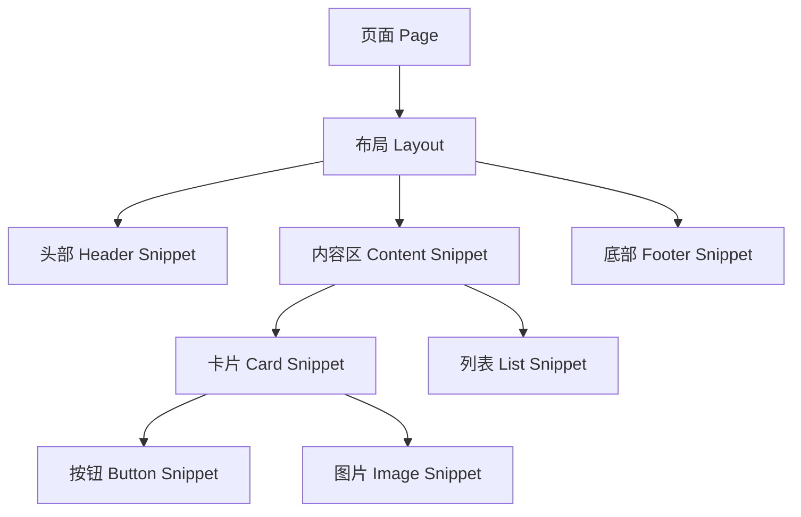
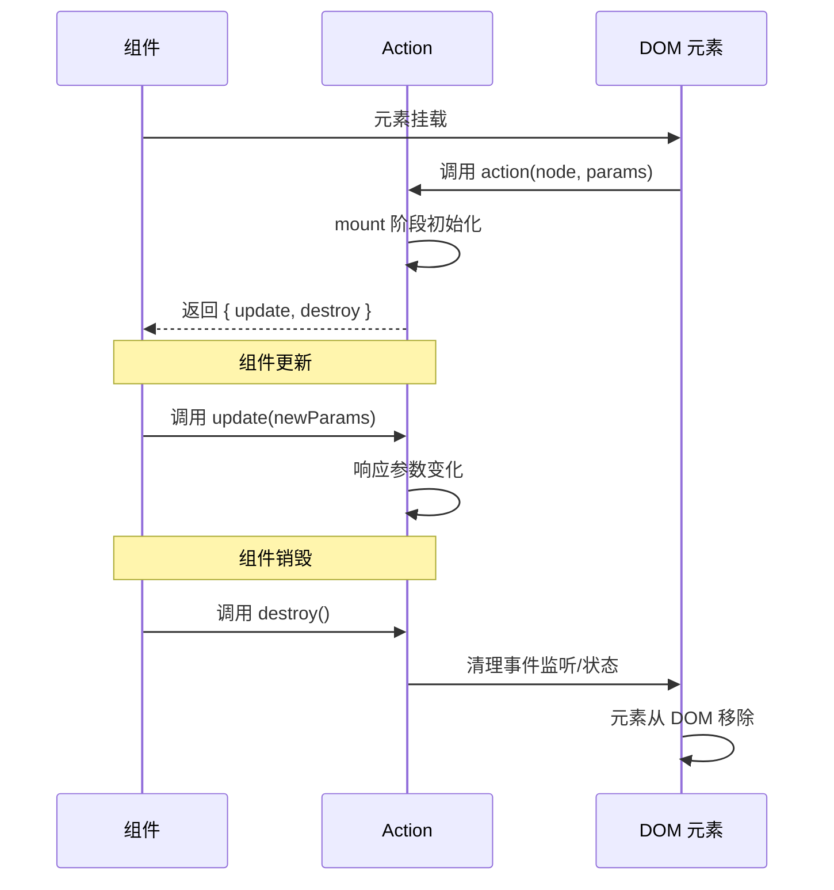
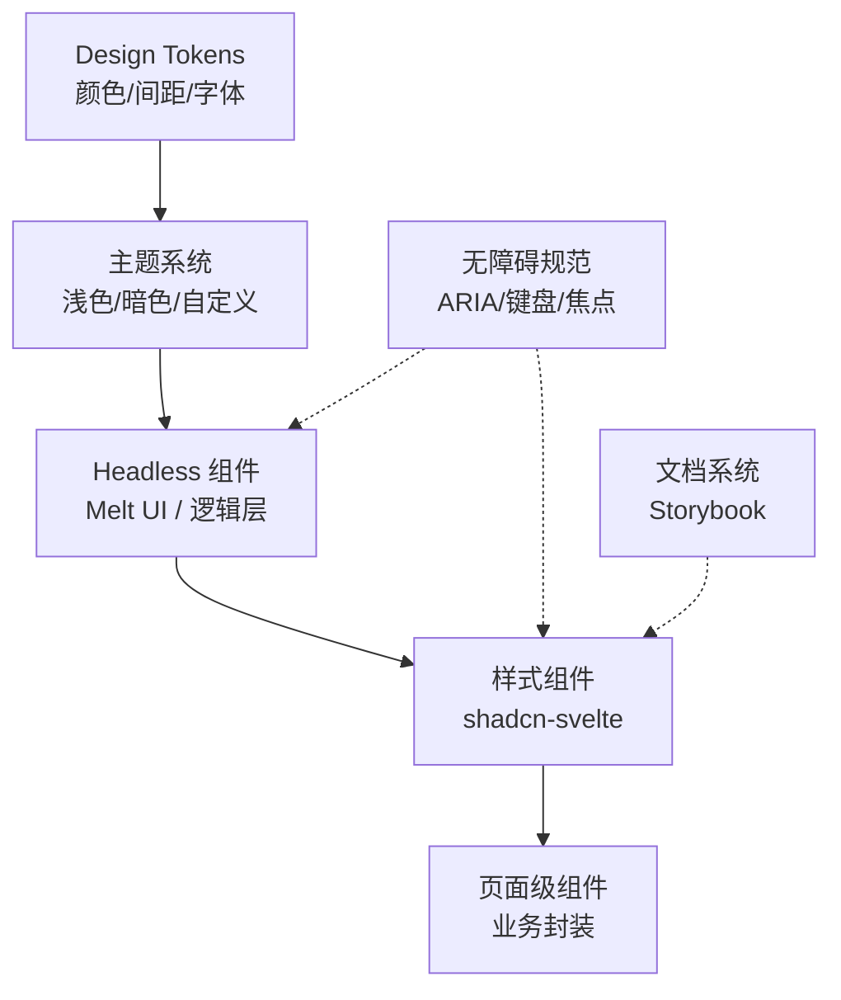

# Svelte 组件开发模式大全

> 从"写组件"到"设计组件体系"的完整组件开发模式指南。
>
> 覆盖 Svelte 5 Runes 时代的组件化最佳实践。

---

## 1. 组件基础模式

### 1.1 组件定义模式

#### 函数式组件思维

Svelte 的组件在编译后会被转换为细粒度的响应式单元，但源码层面仍遵循**函数式组件思维**：

- **输入**：Props（$props）、Context（setContext/getContext）
- **处理**：响应式状态（$state）、计算属性（$derived）、副作用（$effect）
- **输出**：DOM 渲染、Events、Snippets

与 React 的函数式组件不同，Svelte 组件在编译阶段就确定了依赖图，运行时无需 Virtual DOM Diff。这被称为**"编译器组件"**本质——组件不是运行时函数，而是编译器生成的响应式节点图。

```svelte
<!-- Counter.svelte -->
<script lang="ts">
  let { initial = 0 }: { initial?: number } = $props();
  let count = $state(initial);

  const doubled = $derived(count * 2);

  $effect(() => {
    console.log(`count changed to ${count}`);
  });
</script>

<button onclick={() => count++}>
  {count} / {doubled}
</button>
```

#### 组件文件结构约定

Svelte 生态采用三种文件后缀，各有明确语义：

| 后缀 | 用途 | 典型场景 |
|------|------|----------|
| `.svelte` | 带模板的 UI 组件 | 按钮、表单、页面 |
| `.svelte.ts` | 可复用的响应式逻辑模块 | Store、共享状态、工具函数 |
| `.svelte.js` | 无类型的响应式逻辑模块 | 简单工具、配置文件 |

```
components/
├── Button.svelte          # UI 组件
├── useCounter.svelte.ts   # 可复用逻辑（composable）
├── formatters.svelte.js   # 纯工具函数
└── types.ts               # 共享类型定义
```

`.svelte.ts` 文件中的 `$state`、`$derived`、`$effect` 等 runes 在导入到 `.svelte` 组件时保持响应性，这是实现**逻辑复用**的核心机制：

```ts
// useCounter.svelte.ts
export function useCounter(initial = 0) {
  let count = $state(initial);
  const doubled = $derived(count * 2);

  function increment() {
    count++;
  }

  return {
    get count() { return count; },
    get doubled() { return doubled; },
    increment
  };
}
```

### 1.2 Props 设计模式

Props 是组件的公共 API 接口。Svelte 5 使用 `$props()` rune 声明 Props，TypeScript 类型直接作为契约。

---

#### 模式 A：受控组件模式（Controlled Component）

**概念定义**：组件状态完全由外部 Props 控制，内部不持有状态源。状态变化通过回调通知父组件。

**适用场景**：

- 表单输入控件（Input、Select、Checkbox）
- 需要与父组件严格同步状态的组件
- 组件库的基础控件

```svelte
<!-- ControlledInput.svelte -->
<script lang="ts">
  interface Props {
    value: string;
    onChange?: (value: string) => void;
    disabled?: boolean;
  }

  let { value, onChange, disabled = false }: Props = $props();
</script>

<input
  type="text"
  {value}
  {disabled}
  oninput={(e) => onChange?.(e.currentTarget.value)}
/>
```

**使用方**：

```svelte
<script>
  let text = $state('');
</script>

<ControlledInput
  value={text}
  onChange={(v) => text = v}
/>
```

**注意事项**：

- 始终提供 `onChange` 回调，否则组件成为"只读"状态
- 避免在组件内部再包裹 `$state(value)`，这会破坏受控语义

**反例**：❌ 在内部用 `$state` 复制 Prop，形成"半受控"陷阱

```svelte
<script>
  let { value } = $props();
  let internal = $state(value); // ❌ 错！Prop 更新不会同步到 internal
</script>
```

---

#### 模式 B：非受控组件模式（Uncontrolled Component）

**概念定义**：组件内部持有状态源，通过 `bind:` 语法实现双向绑定。父组件可初始化但后续由组件自治。

**适用场景**：

- 独立表单控件（无需实时同步到父组件）
- 内部状态复杂、父组件不关心中间过程的组件
- 需要减少重渲染次数的场景

```svelte
<!-- UncontrolledInput.svelte -->
<script lang="ts">
  interface Props {
    defaultValue?: string;
  }

  let { defaultValue = '' }: Props = $props();
  let value = $state(defaultValue);

  // 暴露读取接口（可选）
  export function getValue() {
    return value;
  }
</script>

<input type="text" bind:value />
```

**使用方**：

```svelte
<UncontrolledInput defaultValue="hello" />
```

**注意事项**：

- 父组件通过 `bind:` 获取值，或通过 `bind:this` + 暴露方法读取
- 不适合需要实时校验、联动逻辑的场景
- 与 React 的 `useRef` + 非受控 input 类似，但 API 更简洁

**反例**：❌ 同时提供 `value` Prop 和内部 `$state`，导致数据源冲突

```svelte
<script>
  let { value } = $props();
  let inner = $state(value);
  // 父组件改 value，inner 不知道；inner 改了自己，父组件不知道
</script>
```

---

#### 模式 C：复合 Props 模式（Object Destructuring + Defaults）

**概念定义**：将相关 Props 封装为对象，通过解构赋默认值，减少 Props 数量并提升可读性。

**适用场景**：

- 样式变体（size、color、variant）
- 配置型 Props（position、animation）
- 组件选项过多时避免 Props 爆炸

```svelte
<!-- Badge.svelte -->
<script lang="ts">
  interface Props {
    label: string;
    variant?: {
      color?: 'primary' | 'success' | 'warning' | 'danger';
      size?: 'sm' | 'md' | 'lg';
      outlined?: boolean;
    };
  }

  let {
    label,
    variant: {
      color = 'primary',
      size = 'md',
      outlined = false
    } = {}
  }: Props = $props();
</script>

<span class="badge {color} {size}" class:outlined>
  {label}
</span>

<style>
  .badge { display: inline-flex; padding: 0.25em 0.75em; border-radius: 9999px; }
  .primary { background: #3b82f6; color: white; }
  .sm { font-size: 0.75rem; }
  .md { font-size: 0.875rem; }
  .lg { font-size: 1rem; }
  .outlined { background: transparent; border: 1px solid currentColor; }
</style>
```

**使用方**：

```svelte
<Badge label="新功能" />
<Badge label="警告" variant={{ color: 'warning', size: 'lg' }} />
```

**注意事项**：

- 对象解构时务必给整体赋 `{}` 默认值，避免 `undefined` 解构报错
- 简单组件不要过度封装，3 个以下独立 Props 直接平铺即可
- TypeScript 类型必须标注可选字段，否则使用者必须传完整对象

**反例**：❌ 解构时忘记给整体默认值

```svelte
let { variant: { color = 'primary' } = {} } = $props(); // ✅ 正确
let { variant: { color = 'primary' } } = $props();       // ❌ variant 为 undefined 时报错
```

---

#### 模式 D：泛型组件模式（Generic Component）

**概念定义**：利用 TypeScript 泛型让组件的 Props、Events、Slots 与具体数据类型解耦。

**适用场景**：

- 列表组件（List、Table、Select）
- 数据驱动组件（Chart、Calendar）
- 需要类型安全的组件库

Svelte 5 对泛型组件的支持通过 `generics` 属性实现：

```svelte
<!-- List.svelte -->
<script lang="ts" generics="T">
  interface Props {
    items: T[];
    renderItem: (item: T) => string;
    keyExtractor?: (item: T) => string | number;
    onSelect?: (item: T) => void;
  }

  let { items, renderItem, keyExtractor, onSelect }: Props = $props();
</script>

<ul>
  {#each items as item (keyExtractor?.(item) ?? item)}
    <li onclick={() => onSelect?.(item)}>
      {renderItem(item)}
    </li>
  {/each}
</ul>
```

**使用方**：

```svelte
<script>
  const users = [
    { id: 1, name: 'Alice', role: 'admin' },
    { id: 2, name: 'Bob', role: 'user' }
  ];
</script>

<List
  items={users}
  renderItem={(u) => u.name}
  keyExtractor={(u) => u.id}
  onSelect={(u) => console.log(u.role)}
/>
```

**注意事项**：

- `generics="T"` 必须在 `<script>` 标签上声明
- 泛型参数在编译时推断，确保 `items` 和 `renderItem` 的参数类型一致
- 当前 Svelte 5 的泛型支持仍在完善中，复杂约束可能需借助 `satisfies`

**反例**：❌ 用 `any[]` 类型逃避泛型，丧失类型安全

```svelte
<script>
  let { items }: { items: any[] } = $props(); // ❌ 任何类型错误都在运行时报
</script>
```

---

### 1.3 状态提升与下沉模式

状态管理的核心问题是**"状态放哪里"**。Svelte 提供了从本地到全局的完整谱系。

#### 本地状态（$state）

组件内部最轻量的状态，无需任何额外抽象：

```svelte
<script>
  let count = $state(0);
  let isOpen = $state(false);
</script>
```

**规则**：如果一个状态只被单个组件使用，永远放在组件内部。

#### 兄弟组件状态共享（.svelte.ts 共享模块）

当两个无层级关系的组件需要共享状态时，提取到 `.svelte.ts` 模块：

```ts
// shared/cart.svelte.ts
function createCart() {
  let items = $state<Array<{ id: number; name: string; qty: number }>>([]);

  const total = $derived(
    items.reduce((sum, item) => sum + item.qty, 0)
  );

  function add(item: { id: number; name: string }) {
    const existing = items.find((i) => i.id === item.id);
    if (existing) {
      existing.qty++;
    } else {
      items = [...items, { ...item, qty: 1 }];
    }
  }

  function remove(id: number) {
    items = items.filter((i) => i.id !== id);
  }

  return {
    get items() { return items; },
    get total() { return total; },
    add,
    remove
  };
}

export const cart = createCart();
```

任何导入 `cart` 的组件自动获得响应式同步。这是 Svelte 5 替代传统 Store 的首选方案。

**对比 Svelte 4 Store**：

| 特性 | .svelte.ts 模块 | Svelte Store (writable) |
|------|----------------|------------------------|
| 语法 | 直接读取 `$state` | `$` 前缀自动订阅 |
| 派生 | `$derived` | `derived()` |
| 可写性 | 通过 getter/setter 控制 | `update`/`set` 方法 |
| 类型安全 | 原生 TypeScript | 需要手动标注 |

#### 跨层级状态（Context API vs Store vs URL State）

| 方案 | 范围 | 生命周期 | 持久化 | 适用场景 |
|------|------|----------|--------|----------|
| Context API | 子树 | 组件挂载期间 | ❌ | 主题、用户认证、页面配置 |
| .svelte.ts Store | 全局 | 应用生命周期 | ❌ | 购物车、通知中心 |
| URL State | 页面 | 路由存在期间 | ✅（刷新保留） | 列表筛选、分页、标签页 |
| LocalStorage | 全局 | 永久 | ✅ | 用户偏好设置 |

**Context API 示例**：

```ts
// 定义上下文
const THEME_KEY = Symbol('theme');

interface ThemeContext {
  mode: 'light' | 'dark';
  toggle: () => void;
}

// 提供者（Provider）
<!-- ThemeProvider.svelte -->
<script>
  import { setContext } from 'svelte';

  let mode = $state<'light' | 'dark'>('light');

  setContext(THEME_KEY, {
    get mode() { return mode; },
    toggle: () => mode = mode === 'light' ? 'dark' : 'light'
  });
</script>

<slot />
```

```svelte
<!-- 消费者（Consumer） -->
<script>
  import { getContext } from 'svelte';
  const theme = getContext(THEME_KEY);
</script>

<div class={theme.mode}>
  <button onclick={theme.toggle}>切换主题</button>
</div>
```

**选择决策树**：

```
状态是否需要跨路由持久化？
├── 是 → URL State / LocalStorage
└── 否 → 是否需要全局共享？
    ├── 是 → .svelte.ts 共享模块
    └── 否 → 是否跨层级但非全局？
        ├── 是 → Context API
        └── 否 → 本地 $state
```

## 2. 高级组件模式

### 2.1 组合模式（Composition）

Svelte 5 引入了 **Snippet** 作为 Slots 的现代替代方案。Snippet 是可传递、可组合、可条件渲染的代码片段，彻底解决了 Svelte 4 Slots 的诸多限制（无法传递参数、无法向外部转发、无法在运行时条件渲染）。

#### Snippet 基础组合（`{@render}`）

```svelte
<!-- Card.svelte -->
<script lang="ts">
  import type { Snippet } from 'svelte';

  interface Props {
    title: string;
    children: Snippet;
    footer?: Snippet;
  }

  let { title, children, footer }: Props = $props();
</script>

<article class="card">
  <header>
    <h3>{title}</h3>
  </header>

  <div class="body">
    {@render children()}
  </div>

  {#if footer}
    <footer>
      {@render footer()}
    </footer>
  {/if}
</article>

<style>
  .card { border: 1px solid #e5e7eb; border-radius: 0.5rem; overflow: hidden; }
  header { padding: 1rem; background: #f9fafb; border-bottom: 1px solid #e5e7eb; }
  .body { padding: 1rem; }
  footer { padding: 1rem; background: #f9fafb; border-top: 1px solid #e5e7eb; }
</style>
```

**使用方**：

```svelte
<Card title="用户概览">
  {#snippet children()}
    <p>本月活跃用户 <strong>1,234</strong> 人</p>
    <div class="chart">...</div>
  {/snippet}

  {#snippet footer()}
    <a href="/users">查看全部 →</a>
  {/snippet}
</Card>
```

**关键改进（对比 Svelte 4 Slots）**：

| 能力 | Svelte 4 Slot | Svelte 5 Snippet |
|------|--------------|------------------|
| 传递参数 | ❌ 不支持 | ✅ `{#snippet name(arg)}` |
| 条件渲染 | ❌ slot 存在性难以检测 | ✅ `{#if snippet}` |
| 运行时选择 | ❌ 静态 | ✅ 可存于变量、可传递 |
| 类型安全 | ⚠️ 弱 | ✅ `Snippet<[ArgType]>` |

---

#### 多 Snippet 接口设计（header / body / footer）

复杂组件应将 UI 区域拆分为具名 Snippet，形成清晰的接口契约：

```svelte
<!-- DataTable.svelte -->
<script lang="ts">
  import type { Snippet } from 'svelte';

  interface Props<T> {
    columns: Array<{ key: string; label: string }>;
    rows: T[];
    header?: Snippet<[{ columns: Props<T>['columns'] }]>;
    row: Snippet<[{ item: T; index: number }]>;
    empty?: Snippet;
    loading?: Snippet;
    isLoading?: boolean;
  }

  let { columns, rows, header, row, empty, loading, isLoading = false }: Props<unknown> = $props();
</script>

<div class="data-table">
  {#if header}
    {@render header({ columns })}
  {:else}
    <div class="default-header">
      {#each columns as col}
        <span>{col.label}</span>
      {/each}
    </div>
  {/if}

  <div class="body">
    {#if isLoading}
      {#if loading}
        {@render loading()}
      {:else}
        <div class="skeleton">加载中...</div>
      {/if}
    {:else if rows.length === 0}
      {#if empty}
        {@render empty()}
      {:else}
        <div class="empty">暂无数据</div>
      {/if}
    {:else}
      {#each rows as item, index (index)}
        {@render row({ item, index })}
      {/each}
    {/if}
  </div>
</div>
```

**使用方完全自定义渲染**：

```svelte
<DataTable
  columns={[{ key: 'name', label: '姓名' }, { key: 'role', label: '角色' }]}
  rows={users}
>
  {#snippet header({ columns })}
    <div class="custom-header">
      {#each columns as col}
        <SortableColumn key={col.key} label={col.label} />
      {/each}
    </div>
  {/snippet}

  {#snippet row({ item })}
    <UserRow user={item} on:click={() => goto(`/users/${item.id}`)} />
  {/snippet}

  {#snippet empty()}
    <EmptyState icon="users" message="还没有用户" />
  {/snippet}
</DataTable>
```

**设计原则**：

- 每个 Snippet 应有**合理的默认实现**（fallback），降低使用成本
- 使用 `Snippet<[Params]>` 精确标注参数类型
- 高频自定义区域才暴露为 Snippet，不要过度拆分

---

#### 条件 Snippet（可选内容区）

Snippet 作为值可以条件传递，实现高度灵活的组件接口：

```svelte
<!-- Modal.svelte -->
<script lang="ts">
  import type { Snippet } from 'svelte';

  interface Props {
    open: boolean;
    onClose: () => void;
    title?: Snippet;
    children: Snippet;
    actions?: Snippet;
  }

  let { open, onClose, title, children, actions }: Props = $props();
</script>

{#if open}
  <div class="backdrop" onclick={onClose}>
    <div class="modal" onclick={(e) => e.stopPropagation()}>
      {#if title}
        <div class="modal-header">
          {@render title()}
          <button class="close" onclick={onClose}>×</button>
        </div>
      {/if}

      <div class="modal-body">
        {@render children()}
      </div>

      {#if actions}
        <div class="modal-footer">
          {@render actions()}
        </div>
      {/if}
    </div>
  </div>
{/if}
```

**技巧：将 Snippet 作为数据传递**

```svelte
<script>
  import Modal from './Modal.svelte';

  const modals = [
    {
      id: 'confirm',
      title: () => `确认删除`,
      body: () => `此操作不可撤销，确定要删除吗？`,
      actions: () => `<button>删除</button><button>取消</button>`
    }
  ];
</script>
```

> 注意：上述字符串示例仅为说明概念，实际中 Snippet 是编译后的函数，不能序列化。

---

#### 代码示例：可复用 Layout 组件

```svelte
<!-- DashboardLayout.svelte -->
<script lang="ts">
  import type { Snippet } from 'svelte';

  interface Props {
    sidebar?: Snippet;
    topbar?: Snippet;
    children: Snippet;
    breadcrumbs?: Snippet;
  }

  let { sidebar, topbar, children, breadcrumbs }: Props = $props();
</script>

<div class="layout">
  {#if sidebar}
    <aside class="sidebar">
      {@render sidebar()}
    </aside>
  {/if}

  <div class="main">
    {#if topbar}
      <header class="topbar">
        {#if breadcrumbs}
          <nav class="breadcrumbs">
            {@render breadcrumbs()}
          </nav>
        {/if}
        {@render topbar()}
      </header>
    {/if}

    <main class="content">
      {@render children()}
    </main>
  </div>
</div>

<style>
  .layout { display: flex; min-height: 100vh; }
  .sidebar { width: 260px; border-right: 1px solid #e5e7eb; }
  .main { flex: 1; display: flex; flex-direction: column; }
  .topbar { height: 64px; border-bottom: 1px solid #e5e7eb; display: flex; align-items: center; padding: 0 1.5rem; }
  .content { flex: 1; padding: 1.5rem; overflow: auto; }
</style>
```

### 2.2 高阶组件模式（HOC）

React 中的 HOC（Higher-Order Component）是通过函数包装组件实现横切关注点（认证、权限、日志）。Svelte 中由于组件是编译产物而非运行时函数，**HOC 模式需要重新思考**。

#### Svelte 中 HOC 的替代方案

**方案 1：Wrapper 组件 + Snippet（推荐）**

将行为封装为 Wrapper 组件，通过 Snippet 接收被包装的内容：

```svelte
<!-- WithAuth.svelte -->
<script lang="ts">
  import type { Snippet } from 'svelte';
  import { auth } from './auth.svelte.ts';

  interface Props {
    fallback?: Snippet;
    children: Snippet;
  }

  let { fallback, children }: Props = $props();
</script>

{#if auth.isAuthenticated}
  {@render children()}
{:else if fallback}
  {@render fallback()}
{:else}
  <div class="auth-gate">
    <p>请先登录</p>
    <button onclick={() => auth.login()}>登录</button>
  </div>
{/if}
```

**使用方**：

```svelte
<WithAuth>
  {#snippet children()}
    <AdminDashboard />
  {/snippet}
  {#snippet fallback()}
    <GuestPrompt />
  {/snippet}
</WithAuth>
```

**方案 2：行为注入模式（Action + Snippet）**

对于 DOM 行为（点击外部、拖拽、快捷键），使用 Action 比 HOC 更自然：

```svelte
<!-- Tooltip.svelte -->
<script lang="ts">
  import { tooltip } from './actions/tooltip';

  interface Props {
    text: string;
    children: import('svelte').Snippet;
  }

  let { text, children }: Props = $props();
</script>

<span use:tooltip={{ text }}>
  {@render children()}
</span>
```

#### 代码示例：withAuth 保护组件

完整实现包含加载态、错误处理、角色权限校验：

```svelte
<!-- RequireAuth.svelte -->
<script lang="ts">
  import type { Snippet } from 'svelte';
  import { auth } from '$lib/auth.svelte.ts';

  interface Props {
    role?: 'user' | 'admin' | 'superadmin';
    loading?: Snippet;
    unauthorized?: Snippet;
    children: Snippet;
  }

  let { role, loading, unauthorized, children }: Props = $props();

  const hasRole = $derived(
    !role || auth.user?.role === role ||
    (role === 'user' && ['user', 'admin', 'superadmin'].includes(auth.user?.role ?? '')) ||
    (role === 'admin' && ['admin', 'superadmin'].includes(auth.user?.role ?? ''))
  );
</script>

{#if auth.isLoading}
  {#if loading}
    {@render loading()}
  {:else}
    <div class="skeleton-page">加载中...</div>
  {/if}
{:else if !auth.isAuthenticated}
  {#if unauthorized}
    {@render unauthorized()}
  {:else}
    <div class="auth-wall">
      <h2>需要登录</h2>
      <button onclick={() => auth.redirectToLogin()}>前往登录</button>
    </div>
  {/if}
{:else if !hasRole}
  <div class="forbidden">
    <h2>权限不足</h2>
    <p>需要 {role} 权限才能访问此页面</p>
  </div>
{:else}
  {@render children()}
{/if}
```

**使用方**：

```svelte
<RequireAuth role="admin">
  {#snippet children()}
    <UserManagement />
  {/snippet}
  {#snippet unauthorized()}
    <CustomLoginPage redirect={$page.url.pathname} />
  {/snippet}
</RequireAuth>
```

### 2.3 渲染控制模式

#### 条件渲染（{#if} vs 短路求值）

Svelte 提供两种条件渲染方式：

```svelte
<!-- 方式 A：{#if} 块（推荐用于复杂条件） -->
{#if user}
  <div class="user-card">
    
    <span>{user.name}</span>
  </div>
{:else}
  <div class="guest-prompt">请先登录</div>
{/if}

<!-- 方式 B：短路求值（适合简单内联） -->
{user && `<span>${user.name}</span>`}

<!-- 方式 C：三元表达式 -->
<div class={isActive ? 'active' : 'inactive'}>
  {isLoading ? '加载中...' : content}
</div>
```

**选择指南**：

| 场景 | 推荐方式 | 原因 |
|------|----------|------|
| 两个分支都有复杂 DOM | `{#if}` | 可读性好，支持 `{:else}` |
| 仅需条件显示文本 | `&&` 或 `? :` | 简洁 |
| 切换动画过渡 | `{#key}` + `{#if}` | 触发过渡效果 |
| 条件渲染组件 | `{#if}` | 控制组件挂载/卸载生命周期 |

---

#### 列表渲染优化（{#each key} vs 索引赋值）

`{#each}` 的 `key` 是 Svelte  diff 算法的核心提示：

```svelte
<!-- ✅ 正确：提供稳定的 key -->
{#each todos as todo (todo.id)}
  <TodoItem {todo} on:toggle={() => toggle(todo.id)} />
{/each}

<!-- ❌ 错误：用索引作为 key -->
{#each todos as todo, index (index)}
  <TodoItem {todo} />
{/each}

<!-- ❌ 错误：完全省略 key -->
{#each todos as todo}
  <TodoItem {todo} />
{/each}
```

**为什么索引作为 key 有害**：

1. 列表重排序时，Svelte 会复用 DOM 节点但更新内容，导致内部状态（input 焦点、滚动位置）错乱
2. 删除中间项时，后续项的过渡动画会异常
3. 与第三方库（SortableJS、DND Kit）集成时行为不可预测

**可复用组件的列表优化**：

```svelte
<!-- VirtualList.svelte -->
<script lang="ts">
  interface Props {
    items: unknown[];
    itemHeight: number;
    overscan?: number;
    children: import('svelte').Snippet<[{ item: unknown; index: number }]>;
  }

  let { items, itemHeight, overscan = 5, children }: Props = $props();

  let containerHeight = $state(0);
  let scrollTop = $state(0);

  const totalHeight = $derived(items.length * itemHeight);
  const startIndex = $derived(Math.max(0, Math.floor(scrollTop / itemHeight) - overscan));
  const endIndex = $derived(Math.min(
    items.length,
    Math.ceil((scrollTop + containerHeight) / itemHeight) + overscan
  ));
  const visibleItems = $derived(
    items.slice(startIndex, endIndex).map((item, i) => ({
      item,
      index: startIndex + i,
      style: `transform: translateY(${(startIndex + i) * itemHeight}px)`
    }))
  );
</script>

<div
  class="virtual-list"
  bind:clientHeight={containerHeight}
  onscroll={(e) => scrollTop = e.currentTarget.scrollTop}
>
  <div class="spacer" style="height: {totalHeight}px">
    {#each visibleItems as { item, index, style } (index)}
      <div class="item" {style}>
        {@render children({ item, index })}
      </div>
    {/each}
  </div>
</div>

<style>
  .virtual-list { overflow-y: auto; position: relative; }
  .spacer { position: relative; }
  .item { position: absolute; left: 0; right: 0; }
</style>
```

---

#### 懒加载组件（`<svelte:component>` + dynamic import）

对于大型应用，应按路由或功能区块拆分 bundle，按需加载组件：

```svelte
<!-- LazyChart.svelte -->
<script lang="ts">
  import type { Component } from 'svelte';

  interface Props {
    type: 'line' | 'bar' | 'pie';
    data: unknown;
  }

  let { type, data }: Props = $props();

  const componentMap = {
    line: () => import('./charts/LineChart.svelte'),
    bar: () => import('./charts/BarChart.svelte'),
    pie: () => import('./charts/PieChart.svelte')
  };

  let ChartComponent = $state<Component | null>(null);
  let isLoading = $state(false);
  let error = $state<Error | null>(null);

  $effect(() => {
    isLoading = true;
    error = null;

    componentMap[type]()
      .then((mod) => {
        ChartComponent = mod.default;
      })
      .catch((err) => {
        error = err;
      })
      .finally(() => {
        isLoading = false;
      });
  });
</script>

{#if isLoading}
  <div class="loading">图表加载中...</div>
{:else if error}
  <div class="error">加载失败: {error.message}</div>
{:else if ChartComponent}
  <ChartComponent {data} />
{/if}
```

**路由级懒加载（SvelteKit）**：

```js
// +page.svelte 的替代：用动态导入
// routes/dashboard/+page.svelte
export const load = async () => {
  const { default: Dashboard } = await import('$lib/components/Dashboard.svelte');
  return { component: Dashboard };
};
```

SvelteKit 自动按目录拆分路由级 chunk，无需手动配置。

### 2.4 表单组件模式

#### 受控表单模式（bind:value + 验证）

Svelte 的 `bind:value` 提供了比 React 更简洁的双向绑定，但大型表单仍需规范化模式：

```svelte
<!-- FormField.svelte -->
<script lang="ts">
  interface Props {
    label: string;
    name: string;
    value: string;
    error?: string;
    type?: 'text' | 'email' | 'password';
    required?: boolean;
    onChange?: (value: string) => void;
  }

  let {
    label,
    name,
    value = $bindable(),
    error,
    type = 'text',
    required = false
  }: Props = $props();
</script>

<div class="field" class:error={!!error}>
  <label for={name}>
    {label}
    {#if required}<span class="required">*</span>{/if}
  </label>
  <input
    {id}
    {name}
    {type}
    bind:value
    aria-invalid={error ? 'true' : undefined}
    aria-describedby={error ? `{name}-error` : undefined}
  />
  {#if error}
    <span id="{name}-error" class="error-text" role="alert">{error}</span>
  {/if}
</div>

<style>
  .field { display: flex; flex-direction: column; gap: 0.25rem; }
  .field.error input { border-color: #ef4444; }
  .error-text { color: #ef4444; font-size: 0.875rem; }
  .required { color: #ef4444; }
</style>
```

**使用方**：

```svelte
<script>
  import FormField from './FormField.svelte';

  let form = $state({
    email: '',
    password: '',
    confirmPassword: ''
  });

  let errors = $state({});

  function validate() {
    errors = {};
    if (!form.email.includes('@')) errors.email = '请输入有效的邮箱';
    if (form.password.length < 8) errors.password = '密码至少 8 位';
    if (form.password !== form.confirmPassword) {
      errors.confirmPassword = '两次输入的密码不一致';
    }
    return Object.keys(errors).length === 0;
  }

  function handleSubmit() {
    if (validate()) {
      api.register(form);
    }
  }
</script>

<form onsubmit={(e) => { e.preventDefault(); handleSubmit(); }}>
  <FormField label="邮箱" name="email" bind:value={form.email} error={errors.email} required />
  <FormField label="密码" name="password" type="password" bind:value={form.password} error={errors.password} required />
  <FormField label="确认密码" name="confirmPassword" type="password" bind:value={form.confirmPassword} error={errors.confirmPassword} required />
  <button type="submit">注册</button>
</form>
```

#### 表单库集成模式（Superforms）

手动管理表单状态在大型应用中很快变得复杂。Superforms 是 SvelteKit 生态的表单解决方案，与 Zod 深度集成：

```svelte
<!-- +page.svelte -->
<script lang="ts">
  import { superForm } from 'sveltekit-superforms';
  import { zodClient } from 'sveltekit-superforms/adapters';
  import { schema } from './schema';

  let { data } = $props();

  const { form, errors, enhance, submitting } = superForm(data.form, {
    validators: zodClient(schema),
    onResult: ({ result }) => {
      if (result.type === 'success') {
        toast.success('提交成功');
      }
    }
  });
</script>

<form method="POST" use:enhance>
  <input name="email" bind:value={$form.email} />
  {#if $errors.email}<span>{$errors.email}</span>{/if}

  <input name="password" type="password" bind:value={$form.password} />
  {#if $errors.password}<span>{$errors.password}</span>{/if}

  <button type="submit" disabled={$submitting}>
    {$submitting ? '提交中...' : '提交'}
  </button>
</form>
```

```ts
// schema.ts
import { z } from 'zod';

export const schema = z.object({
  email: z.string().email('请输入有效的邮箱地址'),
  password: z.string().min(8, '密码至少 8 位').max(100),
});
```

**Superforms 表单组件抽象**：

```svelte
<!-- SuperFormField.svelte -->
<script lang="ts">
  import type { SuperForm, FormPathLeaves } from 'sveltekit-superforms';
  import type { ZodValidation } from 'sveltekit-superforms/adapters';

  interface Props<T extends Record<string, unknown>> {
    form: SuperForm<T, ZodValidation<unknown>>;
    field: FormPathLeaves<T>;
    label: string;
    type?: string;
  }

  let { form, field, label, type = 'text' }: Props = $props();

  const { value, errors } = formFieldProxy(form, field);
</script>

<div class="field">
  <label>{label}</label>
  <input {type} bind:value={$value} aria-invalid={$errors ? 'true' : undefined} />
  {#if $errors}<span class="error">{$errors}</span>{/if}
</div>
```

#### 复合表单字段模式

将多个基础字段组合为业务字段（如"地址选择器"、"日期范围"）：

```svelte
<!-- DateRangeField.svelte -->
<script lang="ts">
  interface DateRange {
    from: string;
    to: string;
  }

  interface Props {
    label: string;
    value?: DateRange;
    onChange?: (range: DateRange) => void;
  }

  let { label, value = { from: '', to: '' }, onChange }: Props = $props();

  function update(field: keyof DateRange, val: string) {
    const next = { ...value, [field]: val };
    onChange?.(next);
  }

  const isValid = $derived(
    !value.from || !value.to || new Date(value.from) <= new Date(value.to)
  );
</script>

<fieldset class="date-range" class:invalid={!isValid}>
  <legend>{label}</legend>
  <input
    type="date"
    value={value.from}
    oninput={(e) => update('from', e.currentTarget.value)}
  />
  <span>至</span>
  <input
    type="date"
    value={value.to}
    min={value.from}
    oninput={(e) => update('to', e.currentTarget.value)}
  />
  {#if !isValid}
    <span class="error">结束日期不能早于开始日期</span>
  {/if}
</fieldset>
```

## 3. Action 设计模式

Action 是 Svelte 的独特抽象——一个与 DOM 元素生命周期绑定的函数。它弥补了"声明式组件"与"命令式 DOM 操作"之间的鸿沟。

### 3.1 Action 语义与生命周期

#### mount → update → destroy 三阶段

Action 函数接收一个 DOM 元素和一个可选参数对象，返回一个包含 `update` 和 `destroy` 方法的对象：

```typescript
type ActionReturn<Params> = {
  update?: (params: Params) => void;
  destroy?: () => void;
};

type Action<Params> = (
  node: HTMLElement,
  params?: Params
) => ActionReturn<Params> | void;
```

**生命周期时序**：

```
1. 组件挂载 → Action 函数执行（mount 阶段）
   └── 返回 { update, destroy }
2. 参数变化 → update(params) 被调用（update 阶段）
3. 组件卸载 → destroy() 被调用（destroy 阶段）
   └── 清理事件监听器、定时器、Observer
```

**最小 Action 骨架**：

```typescript
// actions/minimal.ts
import type { Action } from 'svelte/action';

interface Params {
  color?: string;
}

export const minimal: Action<HTMLElement, Params> = (node, params) => {
  // === Mount ===
  console.log('mounted on', node);
  node.style.borderColor = params?.color ?? 'blue';

  function handleClick() {
    console.log('clicked');
  }
  node.addEventListener('click', handleClick);

  // === Update ===
  return {
    update(newParams) {
      node.style.borderColor = newParams?.color ?? 'blue';
    },
    destroy() {
      node.removeEventListener('click', handleClick);
    }
  };
};
```

#### 参数传递与响应式更新

Action 参数不是自动响应式的——需要组件层用 `$effect` 或 `$:`（Svelte 4）显式触发 `update`：

```svelte
<script>
  let color = $state('blue');
  let nodeRef;
</script>

<div bind:this={nodeRef} use:minimal={{ color }}>
  <!-- 当 color 变化时，Svelte 自动调用 action.update({ color }) -->
</div>
```

**重要**：Action 内部**不要**自己创建 `$state` 或 `$effect`。Action 是纯函数，响应式由调用方管理。

#### 形式化定义：Action 是什么/不是什么

| Action 是 | Action 不是 |
|-----------|------------|
| 与单个 DOM 元素绑定的副作用 | 组件级别的逻辑复用（用 .svelte.ts） |
| 封装命令式 DOM 操作的安全层 | 状态管理工具（用 $state / Store） |
| 第三方库（D3、Chart.js）的集成胶水 | 样式系统（用 CSS / CSS-in-JS） |
| 浏览器 API（IntersectionObserver、ResizeObserver）的包装 | 路由守卫（用 SvelteKit hooks） |

**决策树**：

```
是否需要操作 DOM？
├── 否 → 用 $state / $derived / .svelte.ts
└── 是 → 是否需要复用行为？
    ├── 否 → 直接在组件里操作（$effect + bind:this）
    └── 是 → 封装为 Action
```

### 3.2 常见 Action 实现

#### 点击外部检测（clickOutside）

```typescript
// actions/clickOutside.ts
import type { Action } from 'svelte/action';

interface Params {
  enabled?: boolean;
  exclude?: string[]; // CSS 选择器，匹配的元素不计为"外部"
}

export const clickOutside: Action<HTMLElement, Params> = (node, params) => {
  function handleClick(event: MouseEvent) {
    if (!params?.enabled && params?.enabled !== undefined) return;

    const target = event.target as HTMLElement;

    // 检查是否在排除列表中
    if (params?.exclude?.some((sel) => target.closest(sel))) return;

    if (!node.contains(target) && !event.defaultPrevented) {
      node.dispatchEvent(
        new CustomEvent('clickoutside', { detail: { originalEvent: event } })
      );
    }
  }

  document.addEventListener('click', handleClick, true);

  return {
    update(newParams) {
      params = newParams;
    },
    destroy() {
      document.removeEventListener('click', handleClick, true);
    }
  };
};
```

**使用方**：

```svelte
<div
  use:clickOutside={{ enabled: isOpen, exclude: ['.trigger-button'] }}
  on:clickoutside={() => isOpen = false}
>
  下拉菜单内容
</div>
```

---

#### Intersection Observer（viewportEnter）

```typescript
// actions/viewportEnter.ts
import type { Action } from 'svelte/action';

interface Params {
  threshold?: number;
  rootMargin?: string;
  once?: boolean; // 只触发一次
}

export const viewportEnter: Action<HTMLElement, Params> = (node, params) => {
  const options: IntersectionObserverInit = {
    threshold: params?.threshold ?? 0,
    rootMargin: params?.rootMargin ?? '0px'
  };

  let hasTriggered = false;

  const observer = new IntersectionObserver((entries) => {
    const entry = entries[0];
    if (!entry.isIntersecting) return;
    if (params?.once && hasTriggered) return;

    hasTriggered = true;
    node.dispatchEvent(
      new CustomEvent('viewportenter', { detail: { entry } })
    );
  }, options);

  observer.observe(node);

  return {
    destroy() {
      observer.disconnect();
    }
  };
};
```

**使用方（图片懒加载）**：

```svelte
{#each images as src}
   e.currentTarget.classList.add('loaded')}
  />
{/each}
```

---

#### 键盘快捷键（shortcut）

```typescript
// actions/shortcut.ts
import type { Action } from 'svelte/action';

interface KeyCombo {
  key: string;
  ctrl?: boolean;
  shift?: boolean;
  alt?: boolean;
  meta?: boolean;
}

interface Params {
  combos: Array<{
    combo: KeyCombo;
    handler: (e: KeyboardEvent) => void;
    preventDefault?: boolean;
  }>;
  scope?: 'document' | 'element';
}

function matchCombo(e: KeyboardEvent, combo: KeyCombo): boolean {
  return (
    e.key.toLowerCase() === combo.key.toLowerCase() &&
    !!e.ctrlKey === !!combo.ctrl &&
    !!e.shiftKey === !!combo.shift &&
    !!e.altKey === !!combo.alt &&
    !!e.metaKey === !!combo.meta
  );
}

export const shortcut: Action<HTMLElement, Params> = (node, params) => {
  function handleKeydown(e: KeyboardEvent) {
    if (!params) return;

    for (const { combo, handler, preventDefault = true } of params.combos) {
      if (matchCombo(e, combo)) {
        if (preventDefault) e.preventDefault();
        handler(e);
        return;
      }
    }
  }

  const target = params?.scope === 'element' ? node : document;
  target.addEventListener('keydown', handleKeydown);

  // element scope 时需要 tabindex 才能接收键盘事件
  if (params?.scope === 'element' && !node.hasAttribute('tabindex')) {
    node.tabIndex = 0;
  }

  return {
    update(newParams) {
      params = newParams;
    },
    destroy() {
      target.removeEventListener('keydown', handleKeydown);
    }
  };
};
```

**使用方**：

```svelte
<div
  use:shortcut={{
    combos: [
      { combo: { key: 'k', meta: true }, handler: () => openSearch() },
      { combo: { key: 'Escape' }, handler: () => closeModal() }
    ]
  }}
>
  按 Cmd+K 打开搜索
</div>
```

---

#### 拖拽（draggable）

```typescript
// actions/draggable.ts
import type { Action } from 'svelte/action';

interface Params {
  axis?: 'x' | 'y' | 'both';
  bounds?: 'parent' | 'body' | { left?: number; top?: number; right?: number; bottom?: number };
  onDragStart?: () => void;
  onDragEnd?: (pos: { x: number; y: number }) => void;
}

export const draggable: Action<HTMLElement, Params> = (node, params) => {
  let isDragging = false;
  let startX = 0, startY = 0;
  let initialLeft = 0, initialTop = 0;

  const axis = params?.axis ?? 'both';

  function getBounds() {
    if (!params?.bounds) return null;
    if (params.bounds === 'parent') {
      const parent = node.parentElement;
      if (!parent) return null;
      return {
        left: 0, top: 0,
        right: parent.clientWidth - node.offsetWidth,
        bottom: parent.clientHeight - node.offsetHeight
      };
    }
    if (params.bounds === 'body') {
      return {
        left: 0, top: 0,
        right: document.body.clientWidth - node.offsetWidth,
        bottom: document.body.clientHeight - node.offsetHeight
      };
    }
    return params.bounds;
  }

  function constrain(x: number, y: number) {
    const bounds = getBounds();
    if (!bounds) return { x, y };
    return {
      x: Math.max(bounds.left ?? -Infinity, Math.min(x, bounds.right ?? Infinity)),
      y: Math.max(bounds.top ?? -Infinity, Math.min(y, bounds.bottom ?? Infinity))
    };
  }

  function handlePointerDown(e: PointerEvent) {
    isDragging = true;
    startX = e.clientX;
    startY = e.clientY;
    initialLeft = node.offsetLeft;
    initialTop = node.offsetTop;

    node.setPointerCapture(e.pointerId);
    node.style.cursor = 'grabbing';
    node.style.userSelect = 'none';

    params?.onDragStart?.();
  }

  function handlePointerMove(e: PointerEvent) {
    if (!isDragging) return;

    const dx = e.clientX - startX;
    const dy = e.clientY - startY;

    let x = axis !== 'y' ? initialLeft + dx : initialLeft;
    let y = axis !== 'x' ? initialTop + dy : initialTop;

    const constrained = constrain(x, y);
    node.style.left = `${constrained.x}px`;
    node.style.top = `${constrained.y}px`;
  }

  function handlePointerUp(e: PointerEvent) {
    if (!isDragging) return;
    isDragging = false;
    node.style.cursor = 'grab';
    node.style.userSelect = '';
    params?.onDragEnd?.({ x: node.offsetLeft, y: node.offsetTop });
  }

  node.style.position = 'absolute';
  node.style.cursor = 'grab';
  node.addEventListener('pointerdown', handlePointerDown);
  node.addEventListener('pointermove', handlePointerMove);
  node.addEventListener('pointerup', handlePointerUp);

  return {
    destroy() {
      node.removeEventListener('pointerdown', handlePointerDown);
      node.removeEventListener('pointermove', handlePointerMove);
      node.removeEventListener('pointerup', handlePointerUp);
    }
  };
};
```

---

#### 自动聚焦（autoFocus）

```typescript
// actions/autoFocus.ts
import type { Action } from 'svelte/action';

interface Params {
  delay?: number;
  select?: boolean;
  condition?: boolean;
}

export const autoFocus: Action<HTMLElement, Params> = (node, params) => {
  function focus() {
    if (params?.condition === false) return;

    const delay = params?.delay ?? 0;
    const target = node as HTMLInputElement;

    setTimeout(() => {
      target.focus();
      if (params?.select && 'select' in target) {
        target.select();
      }
    }, delay);
  }

  focus();

  return {
    update(newParams) {
      params = newParams;
      if (newParams?.condition !== false) {
        focus();
      }
    }
  };
};
```

---

#### 浮动定位（floating / popover）

```typescript
// actions/floating.ts
import type { Action } from 'svelte/action';

interface Params {
  reference: HTMLElement;
  placement?: 'top' | 'bottom' | 'left' | 'right';
  offset?: number;
  flip?: boolean;
  shift?: boolean;
}

export const floating: Action<HTMLElement, Params> = (node, params) => {
  function updatePosition() {
    if (!params?.reference) return;

    const refRect = params.reference.getBoundingClientRect();
    const nodeRect = node.getBoundingClientRect();
    const offset = params.offset ?? 8;
    const placement = params.placement ?? 'bottom';

    let top = 0, left = 0;

    switch (placement) {
      case 'bottom':
        top = refRect.bottom + offset + window.scrollY;
        left = refRect.left + window.scrollX;
        break;
      case 'top':
        top = refRect.top - nodeRect.height - offset + window.scrollY;
        left = refRect.left + window.scrollX;
        break;
      case 'left':
        top = refRect.top + window.scrollY;
        left = refRect.left - nodeRect.width - offset + window.scrollX;
        break;
      case 'right':
        top = refRect.top + window.scrollY;
        left = refRect.right + offset + window.scrollX;
        break;
    }

    // 简单 flip：如果超出视口，换到对侧
    if (params.flip) {
      const viewport = { width: window.innerWidth, height: window.innerHeight };
      if (placement === 'bottom' && top + nodeRect.height > viewport.height + window.scrollY) {
        top = refRect.top - nodeRect.height - offset + window.scrollY;
      }
      if (placement === 'right' && left + nodeRect.width > viewport.width + window.scrollX) {
        left = refRect.left - nodeRect.width - offset + window.scrollX;
      }
    }

    // 简单 shift：保持在视口内
    if (params.shift) {
      const viewport = { width: window.innerWidth, height: window.innerHeight };
      left = Math.max(0, Math.min(left, viewport.width - nodeRect.width + window.scrollX));
      top = Math.max(0, Math.min(top, viewport.height - nodeRect.height + window.scrollY));
    }

    node.style.position = 'absolute';
    node.style.top = `${top}px`;
    node.style.left = `${left}px`;
    node.style.zIndex = '9999';
  }

  // 初始定位
  requestAnimationFrame(updatePosition);

  // 监听滚动和尺寸变化
  window.addEventListener('scroll', updatePosition, true);
  window.addEventListener('resize', updatePosition);

  return {
    update(newParams) {
      params = newParams;
      updatePosition();
    },
    destroy() {
      window.removeEventListener('scroll', updatePosition, true);
      window.removeEventListener('resize', updatePosition);
    }
  };
};
```

> 生产环境中推荐使用 `@floating-ui/dom` 替代手动实现，它处理了所有边界情况和可访问性细节。

### 3.3 Action vs Web Components 对比

| 维度 | Svelte Action | Web Components |
|------|--------------|----------------|
| 封装单位 | 函数（轻量） | 类 + Shadow DOM（重） |
| 样式隔离 | 依赖外部约定 | Shadow DOM 天然隔离 |
| 框架依赖 | 绑定 Svelte | 原生浏览器标准 |
| 跨框架复用 | ❌ | ✅（Custom Element） |
| 通信方式 | CustomEvent | 属性 + 事件 |
| 典型场景 | 行为增强 | 独立 UI 组件 |
| 包体积 | 接近 0 额外开销 | 需 polyfill（旧浏览器） |

**选择建议**：

- 需要**行为增强**（拖拽、观察、快捷键）→ **Action**
- 需要**跨团队/跨框架复用 UI 组件** → **Web Components**
- Svelte 应用内部 → 优先 Action + 组件组合

## 4. 组件库设计体系

构建可维护、可扩展的组件库需要超越"写组件"的视角，进入"设计系统"的维度。

### 4.1 设计令牌（Design Tokens）

设计令牌是设计系统的原子级变量，将颜色、间距、字体等抽象为与平台无关的数据。

#### CSS Custom Properties 体系

```css
/* tokens.css */
:root {
  /* 颜色 -- 基础色板 */
  --color-white: #ffffff;
  --color-black: #000000;
  --color-gray-50: #f9fafb;
  --color-gray-100: #f3f4f6;
  --color-gray-200: #e5e7eb;
  --color-gray-300: #d1d5db;
  --color-gray-400: #9ca3af;
  --color-gray-500: #6b7280;
  --color-gray-600: #4b5563;
  --color-gray-700: #374151;
  --color-gray-800: #1f2937;
  --color-gray-900: #111827;

  --color-blue-500: #3b82f6;
  --color-blue-600: #2563eb;
  --color-red-500: #ef4444;
  --color-green-500: #22c55e;
  --color-amber-500: #f59e0b;

  /* 颜色 -- 语义层 */
  --color-primary: var(--color-blue-600);
  --color-primary-hover: var(--color-blue-500);
  --color-danger: var(--color-red-500);
  --color-success: var(--color-green-500);
  --color-warning: var(--color-amber-500);

  /* 背景 */
  --color-bg-base: var(--color-white);
  --color-bg-surface: var(--color-gray-50);
  --color-bg-elevated: var(--color-white);

  /* 文字 */
  --color-text-primary: var(--color-gray-900);
  --color-text-secondary: var(--color-gray-600);
  --color-text-tertiary: var(--color-gray-400);
  --color-text-inverse: var(--color-white);

  /* 边框 */
  --color-border-default: var(--color-gray-200);
  --color-border-focus: var(--color-primary);

  /* 间距 -- 基于 4px 网格 */
  --space-0: 0;
  --space-1: 0.25rem;   /* 4px */
  --space-2: 0.5rem;    /* 8px */
  --space-3: 0.75rem;   /* 12px */
  --space-4: 1rem;      /* 16px */
  --space-5: 1.25rem;   /* 20px */
  --space-6: 1.5rem;    /* 24px */
  --space-8: 2rem;      /* 32px */
  --space-10: 2.5rem;   /* 40px */
  --space-12: 3rem;     /* 48px */
  --space-16: 4rem;     /* 64px */

  /* 字体 */
  --font-sans: ui-sans-serif, system-ui, -apple-system, BlinkMacSystemFont, "Segoe UI", Roboto;
  --font-mono: ui-monospace, SFMono-Regular, "SF Mono", Menlo, Consolas, monospace;

  --text-xs: 0.75rem;
  --text-sm: 0.875rem;
  --text-base: 1rem;
  --text-lg: 1.125rem;
  --text-xl: 1.25rem;
  --text-2xl: 1.5rem;

  --font-normal: 400;
  --font-medium: 500;
  --font-semibold: 600;
  --font-bold: 700;

  /* 圆角 */
  --radius-sm: 0.25rem;
  --radius-md: 0.375rem;
  --radius-lg: 0.5rem;
  --radius-xl: 0.75rem;
  --radius-full: 9999px;

  /* 阴影 */
  --shadow-sm: 0 1px 2px 0 rgb(0 0 0 / 0.05);
  --shadow-md: 0 4px 6px -1px rgb(0 0 0 / 0.1);
  --shadow-lg: 0 10px 15px -3px rgb(0 0 0 / 0.1);
  --shadow-xl: 0 20px 25px -5px rgb(0 0 0 / 0.1);

  /* 过渡 */
  --transition-fast: 150ms ease;
  --transition-base: 250ms ease;
  --transition-slow: 350ms ease;

  /* Z-index */
  --z-dropdown: 1000;
  --z-sticky: 1020;
  --z-fixed: 1030;
  --z-modal-backdrop: 1040;
  --z-modal: 1050;
  --z-popover: 1060;
  --z-tooltip: 1070;
}
```

#### 主题变量命名约定

采用 **"语义 + 层级"** 双层命名：

```
--{category}-{role}-{variant}-{state}

示例：
--color-primary-hover      → 主色悬停态
--color-border-focus       → 聚焦边框
--space-padding-button-lg  → 大按钮内边距
```

**命名规则**：

1. 永远通过语义变量引用，不直接用基础色（`--color-blue-500`）
2. 变体用后缀（`-hover`, `-active`, `-disabled`, `-focus`）
3. 尺寸用 `-sm` / `-md` / `-lg`，不用 `small` / `large`

#### 暗色模式切换机制

```css
/* dark-theme.css */
[data-theme="dark"],
.dark {
  --color-bg-base: var(--color-gray-900);
  --color-bg-surface: var(--color-gray-800);
  --color-bg-elevated: var(--color-gray-700);

  --color-text-primary: var(--color-gray-100);
  --color-text-secondary: var(--color-gray-300);
  --color-text-tertiary: var(--color-gray-500);

  --color-border-default: var(--color-gray-700);

  --shadow-sm: 0 1px 2px 0 rgb(0 0 0 / 0.3);
  --shadow-md: 0 4px 6px -1px rgb(0 0 0 / 0.4);
}
```

```svelte
<!-- ThemeProvider.svelte -->
<script lang="ts">
  import { browser } from '$app/environment';

  interface Props {
    defaultTheme?: 'light' | 'dark' | 'system';
    children: import('svelte').Snippet;
  }

  let { defaultTheme = 'system', children }: Props = $props();

  let theme = $state<'light' | 'dark'>(resolveTheme(defaultTheme));

  function resolveTheme(t: string): 'light' | 'dark' {
    if (t === 'system') {
      return browser && window.matchMedia('(prefers-color-scheme: dark)').matches
        ? 'dark' : 'light';
    }
    return t as 'light' | 'dark';
  }

  $effect(() => {
    document.documentElement.setAttribute('data-theme', theme);
    document.documentElement.classList.toggle('dark', theme === 'dark');
  });

  // 监听系统主题变化
  $effect(() => {
    if (defaultTheme !== 'system') return;
    const mq = window.matchMedia('(prefers-color-scheme: dark)');
    const handler = (e: MediaQueryListEvent) => {
      theme = e.matches ? 'dark' : 'light';
    };
    mq.addEventListener('change', handler);
    return () => mq.removeEventListener('change', handler);
  });

  export function setTheme(t: 'light' | 'dark') {
    theme = t;
    localStorage.setItem('theme', t);
  }
</script>

<div data-theme={theme}>
  {@render children()}
</div>
```

### 4.2 主题系统

#### class strategy vs CSS-in-JS vs 变量注入

| 方案 | 原理 | 优点 | 缺点 | 推荐度 |
|------|------|------|------|--------|
| **CSS 变量（推荐）** | `:root` / `data-theme` 切换变量 | 原生支持、零运行时、SSR 友好 | 不支持动态计算 | ⭐⭐⭐⭐⭐ |
| **class strategy** | Tailwind `dark:` 前缀 | 开发效率高、tree-shaking | 类名冗长、学习曲线 | ⭐⭐⭐⭐ |
| **CSS-in-JS** | 运行时生成样式 | 完全动态、 Scoped | 运行时开销、SSR 复杂 | ⭐⭐ |
| **变量注入** | JS 修改变量值 | 极动态 | 与编译优化冲突 | ⭐ |

**推荐组合**：CSS Custom Properties + Tailwind CSS + `class strategy`

```js
// tailwind.config.js
module.exports = {
  darkMode: ['class', '[data-theme="dark"]'],
  theme: {
    extend: {
      colors: {
        primary: 'var(--color-primary)',
        surface: 'var(--color-bg-surface)',
        // ...
      }
    }
  }
};
```

#### shadcn-svelte 的主题架构分析

shadcn-svelte 采用了**"CSS 变量 + 组件拷贝"**的独特架构：

1. **不发布 npm 包**：组件源码直接拷贝到项目 `components/ui/` 目录
2. **基于 Tailwind CSS**：全部样式通过 Tailwind 工具类实现
3. **CSS 变量主题**：`globals.css` 定义变量，`tailwind.config.js` 映射
4. **Radix UI 行为**：通过 bits-ui（Radix 的 Svelte 移植）提供无障碍行为

```css
/* shadcn 的 globals.css 核心 */
@layer base {
  :root {
    --background: 0 0% 100%;
    --foreground: 222.2 84% 4.9%;
    --card: 0 0% 100%;
    --card-foreground: 222.2 84% 4.9%;
    --popover: 0 0% 100%;
    --popover-foreground: 222.2 84% 4.9%;
    --primary: 222.2 47.4% 11.2%;
    --primary-foreground: 210 40% 98%;
    --secondary: 210 40% 96.1%;
    --secondary-foreground: 222.2 47.4% 11.2%;
    --muted: 210 40% 96.1%;
    --muted-foreground: 215.4 16.3% 46.9%;
    --accent: 210 40% 96.1%;
    --accent-foreground: 222.2 47.4% 11.2%;
    --destructive: 0 84.2% 60.2%;
    --destructive-foreground: 210 40% 98%;
    --border: 214.3 31.8% 91.4%;
    --input: 214.3 31.8% 91.4%;
    --ring: 222.2 84% 4.9%;
    --radius: 0.5rem;
  }

  .dark {
    --background: 222.2 84% 4.9%;
    --foreground: 210 40% 98%;
    --card: 222.2 84% 4.9%;
    --card-foreground: 210 40% 98%;
    --popover: 222.2 84% 4.9%;
    --popover-foreground: 210 40% 98%;
    --primary: 210 40% 98%;
    --primary-foreground: 222.2 47.4% 11.2%;
    --secondary: 217.2 32.6% 17.5%;
    --secondary-foreground: 210 40% 98%;
    --muted: 217.2 32.6% 17.5%;
    --muted-foreground: 215 20.2% 65.1%;
    --accent: 217.2 32.6% 17.5%;
    --accent-foreground: 210 40% 98%;
    --destructive: 0 62.8% 30.6%;
    --destructive-foreground: 210 40% 98%;
    --border: 217.2 32.6% 17.5%;
    --input: 217.2 32.6% 17.5%;
    --ring: 212.7 26.8% 83.9%;
  }
}
```

**shadcn 架构的启示**：

- 组件库不等于 npm 包，源码级定制有其独特价值
- CSS 变量是主题系统的最佳载体
- 行为（无障碍、键盘）与样式应该解耦

### 4.3 无障碍模式（ARIA）

无障碍不是"锦上添花"，而是组件库的**基础要求**。

#### 键盘导航设计

```svelte
<!-- Tabs.svelte -->
<script lang="ts">
  interface Props {
    tabs: Array<{ id: string; label: string }>;
    activeTab: string;
    onChange: (id: string) => void;
  }

  let { tabs, activeTab, onChange }: Props = $props();

  let tabRefs = $state<HTMLButtonElement[]>([]);

  function handleKeydown(e: KeyboardEvent, index: number) {
    let nextIndex = index;

    switch (e.key) {
      case 'ArrowRight':
        nextIndex = (index + 1) % tabs.length;
        break;
      case 'ArrowLeft':
        nextIndex = (index - 1 + tabs.length) % tabs.length;
        break;
      case 'Home':
        nextIndex = 0;
        break;
      case 'End':
        nextIndex = tabs.length - 1;
        break;
      default:
        return;
    }

    e.preventDefault();
    onChange(tabs[nextIndex].id);
    tabRefs[nextIndex]?.focus();
  }
</script>

<div role="tablist" aria-label="导航标签">
  {#each tabs as tab, i (tab.id)}
    <button
      bind:this={tabRefs[i]}
      role="tab"
      id="tab-{tab.id}"
      aria-selected={activeTab === tab.id}
      aria-controls="panel-{tab.id}"
      tabindex={activeTab === tab.id ? 0 : -1}
      onclick={() => onChange(tab.id)}
      onkeydown={(e) => handleKeydown(e, i)}
    >
      {tab.label}
    </button>
  {/each}
</div>

{#each tabs as tab (tab.id)}
  {#if activeTab === tab.id}
    <div
      role="tabpanel"
      id="panel-{tab.id}"
      aria-labelledby="tab-{tab.id}"
    >
      <slot name="panel" {tab} />
    </div>
  {/if}
{/each}
```

**键盘导航检查清单**：

| 组件类型 | 必要键盘支持 |
|----------|-------------|
| Button | `Enter` / `Space` 激活 |
| Dialog/Modal | `Escape` 关闭、`Tab` 循环 |
| Menu | `ArrowUp/Down` 导航、`Enter` 选择、`Escape` 关闭 |
| Tabs | `ArrowLeft/Right` 切换、`Home/End` 首尾 |
| Accordion | `Enter/Space` 展开、`ArrowUp/Down` 切换 |
| Combobox | `ArrowDown` 展开、`ArrowUp/Down` 选择、`Enter` 确认 |

#### 焦点管理（Focus Trap、Focus Restore）

```typescript
// actions/focusTrap.ts
import type { Action } from 'svelte/action';

const FOCUSABLE_SELECTORS = [
  'button:not([disabled])',
  'a[href]',
  'input:not([disabled])',
  'select:not([disabled])',
  'textarea:not([disabled])',
  '[tabindex]:not([tabindex="-1"])'
].join(', ');

export const focusTrap: Action<HTMLElement> = (node) => {
  const previouslyFocused = document.activeElement as HTMLElement | null;

  function getFocusableElements(): HTMLElement[] {
    return Array.from(node.querySelectorAll(FOCUSABLE_SELECTORS));
  }

  function handleKeydown(e: KeyboardEvent) {
    if (e.key !== 'Tab') return;

    const focusable = getFocusableElements();
    if (focusable.length === 0) {
      e.preventDefault();
      return;
    }

    const first = focusable[0];
    const last = focusable[focusable.length - 1];

    if (e.shiftKey && document.activeElement === first) {
      e.preventDefault();
      last.focus();
    } else if (!e.shiftKey && document.activeElement === last) {
      e.preventDefault();
      first.focus();
    }
  }

  // 初始聚焦第一个元素
  requestAnimationFrame(() => {
    getFocusableElements()[0]?.focus();
  });

  node.addEventListener('keydown', handleKeydown);

  return {
    destroy() {
      node.removeEventListener('keydown', handleKeydown);
      previouslyFocused?.focus();
    }
  };
};
```

**Focus Restore 模式**：

```svelte
<script>
  let isOpen = $state(false);
  let triggerRef = $state<HTMLButtonElement>();

  function close() {
    isOpen = false;
    // 模态框关闭后，焦点回到触发按钮
    triggerRef?.focus();
  }
</script>

<button bind:this={triggerRef} onclick={() => isOpen = true}>
  打开对话框
</button>

{#if isOpen}
  <div class="modal" use:focusTrap>
    <button onclick={close}>关闭</button>
  </div>
{/if}
```

#### 屏幕阅读器支持

```svelte
<!-- Alert.svelte -->
<script lang="ts">
  interface Props {
    variant: 'info' | 'success' | 'warning' | 'error';
    title: string;
    message: string;
    dismissible?: boolean;
    onDismiss?: () => void;
  }

  let { variant, title, message, dismissible, onDismiss }: Props = $props();

  const role = $derived(variant === 'error' ? 'alert' : 'status');
  const live = $derived(variant === 'error' ? 'assertive' : 'polite');
</script>

<div
  {role}
  aria-live={live}
  aria-atomic="true"
  class="alert {variant}"
>
  <span class="icon" aria-hidden="true">
    {#if variant === 'success'}✓
    {:else if variant === 'warning'}⚠
    {:else if variant === 'error'}✕
    {:else}ℹ{/if}
  </span>
  <div class="content">
    <strong>{title}</strong>
    <p>{message}</p>
  </div>
  {#if dismissible}
    <button
      onclick={onDismiss}
      aria-label="关闭提示"
    >
      ×
    </button>
  {/if}
</div>
```

**ARIA 常用模式速查**：

| 组件 | 关键 ARIA 属性 |
|------|---------------|
| Modal | `role="dialog"`, `aria-modal="true"`, `aria-labelledby` |
| Tooltip | `role="tooltip"`, `aria-describedby` |
| Toast | `role="status"` / `role="alert"`, `aria-live` |
| Switch | `role="switch"`, `aria-checked` |
| Breadcrumb | `aria-label="Breadcrumb"`, `aria-current="page"` |
| Progress | `role="progressbar"`, `aria-valuenow`, `aria-valuemax` |

### 4.4 组件文档自动生成

#### Storybook 集成

Storybook 是组件开发和文档的行业标准：

```svelte
<!-- Button.stories.svelte -->
<script module>
  import { defineMeta } from '@storybook/addon-svelte-csf';
  import Button from './Button.svelte';

  const { Story } = defineMeta({
    title: 'Components/Button',
    component: Button,
    tags: ['autodocs'],
    argTypes: {
      variant: {
        control: 'select',
        options: ['primary', 'secondary', 'ghost', 'danger']
      },
      size: {
        control: 'select',
        options: ['sm', 'md', 'lg']
      }
    }
  });
</script>

<Story
  name="Primary"
  args={{ label: '点击我', variant: 'primary' }}
/>

<Story
  name="Variants"
  args={{ label: '按钮' }}
>
  <div class="flex gap-2">
    <Button label="Primary" variant="primary" />
    <Button label="Secondary" variant="secondary" />
    <Button label="Ghost" variant="ghost" />
    <Button label="Danger" variant="danger" />
  </div>
</Story>
```

#### Svelte Press 文档生成

Svelte Press 是 Svelte 生态专用的文档站点生成器，基于 VitePress：

```typescript
// vitepress.config.ts
import { defineConfig } from 'vitepress';

export default defineConfig({
  title: 'My Component Library',
  themeConfig: {
    sidebar: [
      {
        text: 'Components',
        items: [
          { text: 'Button', link: '/components/button' },
          { text: 'Input', link: '/components/input' },
          { text: 'Modal', link: '/components/modal' }
        ]
      }
    ]
  }
});
```

#### Props 表格自动生成

通过 `svelte-docgen` 或 `sveld` 从 TypeScript 类型提取 Props 文档：

```json
// sveld.config.json
{
  "input": "./src/components",
  "output": "./docs/api",
  "markdown": true
}
```

生成的文档示例：

```markdown
### Button

#### Props

| Prop | Type | Default | Description |
|------|------|---------|-------------|
| label | `string` | — | 按钮文本 |
| variant | `'primary' \| 'secondary' \| 'ghost' \| 'danger'` | `'primary'` | 视觉变体 |
| size | `'sm' \| 'md' \| 'lg'` | `'md'` | 尺寸 |
| disabled | `boolean` | `false` | 是否禁用 |
| onClick | `() => void` | — | 点击回调 |

#### Slots

| Slot | Description |
|------|-------------|
| default | 自定义按钮内容（覆盖 label） |
| icon | 按钮图标 |

#### Events

| Event | Detail | Description |
|-------|--------|-------------|
| click | `MouseEvent` | 点击时触发 |
```

### 4.5 组件库架构模式

#### 原子设计（Atomic Design）

Brad Frost 提出的设计方法论，将 UI 分为五个层级：

```
Atoms（原子）        → Button, Input, Label, Icon
  └── 不可再分的基础元素
Molecules（分子）     → SearchBar (Input + Button), FormField (Label + Input)
  └── 原子组合成简单功能单元
Organisms（有机体）   → Header, ProductCard, LoginForm
  └── 分子组合成独立区块
Templates（模板）     → PageLayout, DashboardTemplate
  └── 有机体的布局框架
Pages（页面）         → HomePage, ProductPage
  └── 真实数据填充的模板实例
```

**在 Svelte 中的实践**：

```
components/
├── atoms/
│   ├── Button.svelte
│   ├── Input.svelte
│   └── Icon.svelte
├── molecules/
│   ├── FormField.svelte
│   ├── SearchBar.svelte
│   └── BadgeGroup.svelte
├── organisms/
│   ├── Header.svelte
│   ├── ProductCard.svelte
│   └── DataTable.svelte
├── templates/
│   ├── AuthLayout.svelte
│   └── DashboardLayout.svelte
└── pages/
    └── (由路由处理，通常不在组件库中)
```

**好处**：

- 清晰的依赖方向（Pages → Templates → Organisms → Molecules → Atoms）
- 强制复用，避免重复造轮子
- 与设计团队共享同一套语言

#### 复合组件模式（Compound Components）

复合组件将一组紧密相关的子组件通过父组件共享隐式状态：

```svelte
<!-- Select/Select.svelte -->
<script lang="ts">
  import type { Snippet } from 'svelte';
  import { setContext } from 'svelte';

  interface Props {
    value?: string;
    onChange?: (value: string) => void;
    children: Snippet;
  }

  let { value = '', onChange, children }: Props = $props();

  let isOpen = $state(false);
  let highlightedIndex = $state(-1);

  setContext('select', {
    get value() { return value; },
    get isOpen() { return isOpen; },
    get highlightedIndex() { return highlightedIndex; },
    setValue: (v: string) => {
      value = v;
      isOpen = false;
      onChange?.(v);
    },
    toggle: () => isOpen = !isOpen,
    highlight: (i: number) => highlightedIndex = i
  });
</script>

<div class="select-root">
  {@render children()}
</div>
```

```svelte
<!-- Select/Trigger.svelte -->
<script>
  import { getContext } from 'svelte';
  const select = getContext('select');
</script>

<button class="select-trigger" onclick={select.toggle} aria-haspopup="listbox">
  {select.value || '请选择'}
  <span class="chevron" class:open={select.isOpen}>▼</span>
</button>
```

```svelte
<!-- Select/Options.svelte -->
<script lang="ts">
  import { getContext } from 'svelte';
  import type { Snippet } from 'svelte';

  interface Props {
    children: Snippet;
  }

  let { children }: Props = $props();
  const select = getContext('select');
</script>

{#if select.isOpen}
  <ul class="select-options" role="listbox">
    {@render children()}
  </ul>
{/if}
```

```svelte
<!-- Select/Option.svelte -->
<script lang="ts">
  import { getContext } from 'svelte';

  interface Props {
    value: string;
    children: import('svelte').Snippet;
  }

  let { value, children }: Props = $props();
  const select = getContext('select');
</script>

<li
  role="option"
  aria-selected={select.value === value}
  class="select-option"
  class:selected={select.value === value}
  onclick={() => select.setValue(value)}
>
  {@render children()}
</li>
```

**使用方**：

```svelte
<Select value={selected} onChange={(v) => selected = v}>
  <Select.Trigger />
  <Select.Options>
    <Select.Option value="apple">苹果</Select.Option>
    <Select.Option value="banana">香蕉</Select.Option>
    <Select.Option value="cherry">樱桃</Select.Option>
  </Select.Options>
</Select>
```

**复合组件的优势**：

- 使用方自由组合子组件，控制渲染顺序
- 隐式共享状态，减少 Props Drilling
- API 直观，符合 JSX/Svelte 用户的直觉

#### Headless 组件模式（Headless UI / Melt UI）

Headless 组件只提供**行为和可访问性**，完全不提供样式：

```svelte
<!-- HeadlessCombobox.svelte -->
<script lang="ts">
  import { createCombobox, melt } from '@melt-ui/svelte';

  interface Props {
    items: Array<{ value: string; label: string }>;
    value?: string;
    onSelect?: (value: string) => void;
    children: import('svelte').Snippet<[{
      trigger: typeof $trigger;
      menu: typeof $menu;
      item: typeof $item;
      input: typeof $input;
      isOpen: boolean;
      highlightedItem: unknown;
    }]>;
  }

  let { items, value, onSelect, children }: Props = $props();

  const {
    elements: { trigger, menu, item, input },
    states: { open, highlightedItem }
  } = createCombobox({
    onSelectedChange: ({ next }) => {
      onSelect?.(next?.value ?? '');
      return next;
    }
  });
</script>

{@render children({ trigger: $trigger, menu: $menu, item: $item, input: $input, isOpen: $open, highlightedItem: $highlightedItem })}
```

**使用方完全控制样式**：

```svelte
<HeadlessCombobox {items} onSelect={handleSelect}>
  {#snippet children({ trigger, menu, item, input, isOpen })}
    <div class="my-combobox">
      <input use:melt={$input} class="my-input" placeholder="搜索..." />
      <button use:melt={$trigger} class="my-trigger">▼</button>

      {#if isOpen}
        <ul use:melt={$menu} class="my-menu">
          {#each items as i}
            <li use:melt={$item({ item: i, value: i.value })} class="my-item">
              {i.label}
            </li>
          {/each}
        </ul>
      {/if}
    </div>
  {/snippet}
</HeadlessCombobox>
```

**Melt UI** 是 Svelte 生态的 headless 组件库代表，提供了 Dialog、Dropdown Menu、Popover、Tabs 等 20+ 组件的完整无障碍行为。

**Headless vs 复合组件 vs 传统组件**：

| 维度 | 传统组件 | 复合组件 | Headless |
|------|----------|----------|----------|
| 样式控制 | ❌ 内置 | ⚠️ 通过 Snippet 部分控制 | ✅ 完全由使用方决定 |
| 行为封装 | ✅ | ✅ | ✅（最完整） |
| 学习成本 | 低 | 中 | 高 |
| 适用场景 | 快速开发、内部系统 | 需要一定定制化的中后台 | 组件库、设计系统 |

---

## 可视化图表

### 组件组合模式图

Svelte 5 中 Snippet 组合的层次结构：



**解读**: Snippet 提供了比传统 Slots 更灵活的组合能力。每个 Snippet 可以独立定义参数和类型约束，形成清晰的组件层次结构。

### Action 生命周期时序图

Action 从挂载到销毁的完整生命周期：



**解读**: Action 的生命周期与 DOM 元素绑定。`mount` 时初始化，`update` 时响应参数变化，`destroy` 时执行清理。这是 Svelte 中处理副作用的推荐方式。

### 组件库架构层次图

现代 Svelte 组件库的分层架构：



**解读**: 现代组件库采用"头less + 样式分离"架构。Design Tokens 定义视觉基础，Headless 层处理交互逻辑，样式层提供具体外观，无障碍规范贯穿全层。

> 最后更新: 2026-05-01
