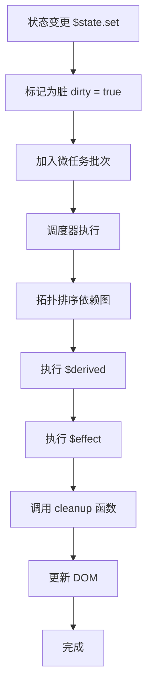
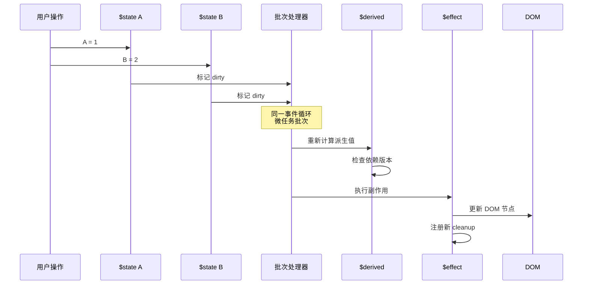
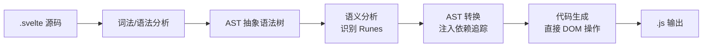

# 响应式系统深度原理

> 从"会用 Runes"到"理解响应式引擎"

当你写下 `let count = $state(0)` 并点击按钮让 `count++` 时，Svelte 5 内部发生了一系列精密协调的操作：编译器在构建阶段将你的声明转换为带有响应式元数据的 Signal 对象；运行时在你读取 `count` 的瞬间悄悄建立了依赖关系图；当你在事件处理器中修改值时，调度器以微任务批量处理所有变更，按照拓扑排序确保 Derived 在 Effect 之前完成计算，然后驱动 DOM 精确更新。这整个过程涉及编译器理论、图算法、内存管理和调度策略的深度融合。

本章将系统性地拆解 Svelte 5 的 Compiler-Based Signals 响应式引擎，从范式对比的数学视角出发，深入运行时架构、编译转换、内存模型和性能优化方法论。

---

## 1. 响应式范式对比（定理式表述）

现代前端框架的响应式系统可以归纳为三种基本模型，它们在表达能力上等价，但在性能特征上存在本质差异。
理解这些差异是掌握 Svelte 5 设计哲学的前提。

### Theorem 1: 三种响应式模型的等价性局限

> **Push (Signals) ≠ Pull (VDOM) ≠ Reactive (Proxy)**
>
> 在细粒度更新场景下，Push 模型的时间复杂度为 **O(受影响的节点数)**，Pull 模型的时间复杂度为 **O(组件树遍历)**。

**形式化表述：**

设组件树 $T$ 有 $N$ 层，包含 $M$ 个叶节点状态。当修改底层状态 $s_i$ 时：

- **Signals (Push)**: 更新代价 $C_{push} = O(|\text{affected}|)$，其中 affected 是直接或间接依赖 $s_i$ 的 effect 和 derived 节点集合。
- **VDOM (Pull)**: 更新代价 $C_{pull} = O(|T_{traversed}|) + O(|\text{diff}|)$，其中 $T_{traversed}$ 是从变更根节点开始重新渲染的子树，diff 是对比开销。
- **Proxy (Reactive)**: 更新代价 $C_{proxy} = O(|\text{affected}|) + O(\text{deps\_tracking})$，依赖追踪在运行时通过属性拦截完成。

**证明思路：**

构造一个 $N$ 层嵌套、每层包含 $k$ 个子节点的组件树，底层有 $M$ 个叶节点状态。修改其中一个叶节点状态：

- **Svelte 5 / SolidJS**: 编译器/运行时已经建立了从 Signal 到 Effect 的直接依赖边。变更仅沿着这些边传播，只重新执行受影响的 $M_{leaf\_affected}$ 个 derived 计算和 DOM 更新 effect。时间复杂度 $O(M_{leaf\_affected})$，与组件树深度 $N$ 无关。
- **React (VDOM)**: 状态变更触发从该组件开始的重新渲染，父组件可能通过 props 传递而重新渲染。React 需要遍历受影响的子树，执行 render 函数生成新 VDOM，然后进行 diff。即使最终只有一个 DOM 节点变化，也需要 $O(N_{components\_traversed})$ 的 render 和 $O(|\text{tree}|)$ 的 diff。时间复杂度与组件树规模相关。
- **Vue 3 (Proxy)**: 通过 Proxy 拦截属性访问和修改，在运行时建立依赖关系。修改叶节点时，通知直接 watcher，然后触发组件重新渲染。虽然粒度比 React 细（组件级），但仍需执行组件的 render 函数。时间复杂度介于两者之间。

> **推论**: 当组件树很深但状态变更影响范围很小时，Push 模型具有渐进优势。当变更影响大范围 UI 时，三种模型趋同。

### 形式化定义对比表

| 维度 | Signals (Push) | VDOM (Pull) | Proxy (Vue Reactive) |
|------|----------------|-------------|---------------------|
| **触发方式** | 显式 `.set()` / 赋值 | `setState()` / 状态变更 | Proxy 属性拦截 |
| **传播方式** | 推送到订阅者 (Push) | 拉取重新渲染 (Pull) | 依赖收集 + 通知 |
| **更新粒度** | **信号级** (Signal-level) | **组件级** (Component-level) | **属性级** (Property-level) |
| **时间复杂度** | $O(\text{affected})$ | $O(\text{tree} + \text{diff})$ | $O(\text{affected} + \text{overhead})$ |
| **空间复杂度** | $O(\text{signals} + \text{effects})$ | $O(\text{vdom})$ | $O(\text{watchers} + \text{proxy\_overhead})$ |
| **依赖关系** | 编译期 + 运行期显式建立 | 运行期通过 render 隐式确定 | 运行期通过 Proxy getter 动态收集 |
| **调度策略** | 微任务批量 + 拓扑排序 | Fiber 优先级调度 / 时间切片 | 异步队列批量 |
| **内存开销** | 低（仅存储依赖图边） | 中（存储两棵 VDOM 树） | 中（Proxy 对象 + Dep 实例） |
| **适用场景** | 高频细粒度更新 | 复杂交互、大表单 | 中等粒度、渐进式框架 |

### Theorem 2: Signals 的最优性条件

> 当满足以下条件时，Compiler-Based Signals 达到理论最优更新性能：
>
> 1. 依赖图在编译期静态可确定（无动态依赖分支）
> 2. Effect 无副作用或副作用可序列化
> 3. 状态变更频率高于组件结构变更频率

**证明概要：**

条件 1 确保编译器可以生成最优的依赖追踪代码，无需运行时的动态收集开销。
条件 2 允许调度器任意重排 effect 执行顺序以实现拓扑最优。
条件 3 使得 $O(\text{affected})$ 的摊还成本显著优于 $O(\text{tree})$。

### 范式演进的工程意义

```text
jQuery (手动 DOM) → MVC (双向绑定) → VDOM (Pull) → Proxy (细粒度 Pull) → Signals (Push)
     ↑                                                            ↓
     └──────────── 抽象层级提升 ───────────────────────────────────┘
     ↑                                                            ↓
     └──────────── 运行时开销降低 ─────────────────────────────────┘
```

Svelte 5 的 Compiler-Based Signals 代表了当前前端响应式系统的工程最优解之一：它将**编译期知识**（哪些变量被读取、哪些表达式是派生的、哪些语句是副作用）转化为**运行期效率**（消除虚拟 DOM、消除动态依赖追踪、最小化更新路径），同时保留了**开发体验**（声明式语法、自动依赖追踪幻觉）。

---

## 2. Svelte 5 响应式引擎架构

Svelte 5 的响应式引擎由两个核心阶段组成：**编译期**（Compiler）和 **运行期**（Runtime）。
编译器分析源码中的 Runes 使用模式，生成带有响应式标记的 JavaScript 代码；
运行时在浏览器中执行这些代码，建立依赖图、追踪变更并调度更新。

### 2.1 运行时数据结构

Svelte 5 运行时的核心数据结构可以用以下类型签名描述（概念性伪代码）：

```typescript
// === 核心信号类型 ===
interface Source<T> {
  // 当前值
  v: T;
  // 版本号，每次更新递增
  version: number;
  // 消费者集合：依赖此 Signal 的 Effect / Derived
  consumers: Set<Reaction>;
  // 标志位：是否为脏状态
  flags: SignalFlags;
}

interface Derived<T> extends Source<T> {
  // 计算函数
  fn: () => T;
  // 依赖的 Source 集合
  sources: Set<Source<any>>;
  // 缓存版本：上次计算时的依赖版本组合
  cachedVersion: number;
  // 计算中标志（防止循环依赖）
  computing: boolean;
}

interface Effect {
  // 执行函数（包含副作用）
  fn: () => void | (() => void);
  // 依赖的 Source / Derived 集合
  dependencies: Set<Source<any>>;
  // 清理函数（上次执行返回的函数）
  cleanup?: () => void;
  // 执行优先级/类型
  flags: EffectFlags;
  // 调度状态
  state: 'clean' | 'dirty' | 'maybe_dirty';
}

// === 标志位枚举 ===
enum SignalFlags {
  DIRTY = 1,         // 已确认脏，需要重新计算
  MAYBE_DIRTY = 2,   // 可能脏，需检查依赖版本
  CLEAN = 4,         // 干净，可直接使用缓存
}

enum EffectFlags {
  PRE = 1,           // 在 DOM 更新前执行
  RENDER = 2,        // DOM 渲染 effect
  POST = 4,          // 在 DOM 更新后执行
  DESTROYED = 8,     // 已销毁
}
```

**数据结构之间的关系：**

```
┌─────────────────────────────────────────────────────────────┐
│                      依赖关系图 (Reactive Graph)             │
├─────────────────────────────────────────────────────────────┤
│                                                             │
│   ┌──────────┐      reads      ┌──────────┐                 │
│   │ Source A │◄────────────────│ Derived X│                 │
│   │  v: 5    │                 │ fn: A*2  │                 │
│   │ ver: 3   │                 │ ver: 3   │                 │
│   └────┬─────┘                 └────┬─────┘                 │
│        │                            │                       │
│        │ subscribes                 │ subscribes            │
│        ▼                            ▼                       │
│   ┌──────────┐                 ┌──────────┐                 │
│   │ Effect E1│                 │ Effect E2│                 │
│   │ DOM更新   │                 │ DOM更新   │                │
│   └──────────┘                 └──────────┘                 │
│                                                             │
│   边类型:                                                    │
│   - Source → Derived: 读取依赖（read dependency）            │
│   - Source → Effect: 订阅关系（subscription）                │
│   - Derived → Effect: 派生订阅（derived subscription）       │
│                                                             │
└─────────────────────────────────────────────────────────────┘
```

### 2.2 依赖追踪算法

Svelte 5 的依赖追踪发生在**读取时**（Read-Time Dependency Tracking），这是 Signals 模型的核心机制。

#### 核心机制：全局栈

```javascript
// 简化版运行时实现（概念模型）

// 当前活跃的 Effect / Derived 栈
const effect_stack = [];

// 获取当前活跃的 Reaction（Effect 或 Derived）
function get_active_reaction() {
  return effect_stack[effect_stack.length - 1];
}

/**
 * Signal 的 getter —— 读取时建立依赖
 */
function get(source) {
  const active = get_active_reaction();

  if (active) {
    // 建立双向依赖关系
    source.consumers.add(active);
    active.dependencies.add(source);

    // 版本检查：如果 source 比 consumer 新，标记为可能脏
    if (source.version > active.version) {
      active.flags |= MAYBE_DIRTY;
    }
  }

  return source.v;
}

/**
 * Signal 的 setter —— 更新时通知消费者
 */
function set(source, value) {
  if (source.v !== value) {
    source.v = value;
    source.version++;

    // 通知所有消费者它们可能脏了
    for (const consumer of source.consumers) {
      mark_dirty(consumer);
    }

    // 调度批量更新
    schedule_update();
  }
}

/**
 * Effect 执行包装器
 */
function execute_effect(effect) {
  // 清理上次的依赖关系
  cleanup_dependencies(effect);

  // 压入栈中，使 get() 能追踪到本 effect
  effect_stack.push(effect);

  try {
    // 执行 effect 函数（内部读取 source 时会自动建立依赖）
    const cleanup_fn = effect.fn();

    if (typeof cleanup_fn === 'function') {
      effect.cleanup = cleanup_fn;
    }
  } finally {
    effect_stack.pop();
    effect.state = 'clean';
  }
}
```

#### 依赖图的构建过程

假设有如下 Svelte 组件代码：

```svelte
<script>
  let count = $state(0);
  let doubled = $derived(count * 2);

  $effect(() => {
    console.log('count changed:', count);
  });
</script>

<p>{count} × 2 = {doubled}</p>
```

**依赖图构建时序：**

```
初始化阶段:
  ├─ $state(0)      → 创建 Source: count = { v: 0, version: 0, consumers: ∅ }
  ├─ $derived(...)  → 创建 Derived: doubled = { fn: () => count * 2, ... }
  │                    └─ 首次执行 doubled.fn()
  │                       └─ get(count) → effect_stack = [doubled]
  │                           → count.consumers.add(doubled)
  │                           → doubled.dependencies.add(count)
  │                       → 返回 0, doubled.v = 0
  ├─ $effect(...)   → 创建 Effect: e1 = { fn: () => console.log(...), ... }
  │                    └─ 首次执行 e1.fn()
  │                       └─ get(count) → effect_stack = [e1]
  │                           → count.consumers.add(e1)
  │                           → e1.dependencies.add(count)
  │                       → 输出: "count changed: 0"
  └─ 模板渲染        → 创建 Effect: render = { fn: () => updateDOM(count, doubled), ... }
                         └─ 执行 render.fn()
                            └─ get(count) → count.consumers.add(render)
                            └─ get(doubled) → doubled.consumers.add(render)
                               → render.dependencies.add(doubled)

最终依赖图:
  count → [doubled, e1, render]
  doubled → [render]
```

#### 动态依赖的处理

条件分支中的依赖是动态的——每次执行时可能读取不同的 Source：

```svelte
<script>
  let mode = $state('a');
  let a = $state(1);
  let b = $state(2);

  $effect(() => {
    if (mode === 'a') {
      console.log(a);  // 仅在 mode === 'a' 时依赖 a
    } else {
      console.log(b);  // 仅在 mode === 'b' 时依赖 b
    }
  });
</script>
```

**动态依赖追踪算法：**

```javascript
function execute_effect_with_dynamic_deps(effect) {
  // 1. 断开旧依赖关系（重要！否则条件变更时会收到无关通知）
  for (const dep of effect.dependencies) {
    dep.consumers.delete(effect);
  }
  effect.dependencies.clear();

  // 2. 重新执行，建立新依赖关系
  effect_stack.push(effect);
  try {
    effect.fn();
  } finally {
    effect_stack.pop();
  }
}
```

> **关键设计**: Svelte 5 在每次执行 Effect / Derived 前先清理旧依赖，确保依赖图始终反映当前控制流。这比 Vue 的 Watcher 模式更精确，因为 Vue 的依赖收集是累加的，可能导致"死依赖"问题。

### 2.3 更新调度算法

当 Signal 被修改时，Svelte 5 使用**微任务批量调度**（Microtask Batching）和**拓扑排序执行**（Topological Execution）来确保更新的一致性、高效性和可预测性。

#### 微任务批量（Microtask Batching）

```javascript
// 简化版调度器
let update_scheduled = false;
const dirty_effects = new Set();

function schedule_update() {
  if (!update_scheduled) {
    update_scheduled = true;
    // 使用 Promise.then() 调度到微任务队列
    // 这确保所有同步的 set() 调用完成后才执行更新
    Promise.resolve().then(flush_updates);
  }
}

function mark_dirty(effect) {
  if (effect.state === 'clean') {
    effect.state = 'dirty';
    dirty_effects.add(effect);
    schedule_update();
  }
}

function flush_updates() {
  update_scheduled = false;

  // 按拓扑顺序执行所有脏 effect
  execute_effects_topologically(dirty_effects);
  dirty_effects.clear();
}
```

**批量更新的好处：**

```javascript
// 同步批量：多次 set 只触发一次更新
function increment() {
  count++;     // 不立即触发更新
  count++;     // 不立即触发更新
  count++;     // 不立即触发更新
}
// 微任务队列: [flush_updates] —— 只执行一次 DOM 更新
```

#### 拓扑排序执行

依赖图是一个有向无环图（DAG，假设无循环依赖）。Svelte 5 按照从 Sources 到 Effects 的拓扑顺序执行更新，确保 Derived 在其依赖的 Source 之后、Effect 在其依赖的 Derived 之后执行。

```javascript
/**
 * 拓扑排序执行算法（简化版）
 */
function execute_effects_topologically(effects) {
  const visited = new Set();
  const executing = new Set();
  const result = [];

  function visit(effect) {
    if (executing.has(effect)) {
      throw new Error('Circular dependency detected!');
    }
    if (visited.has(effect)) return;

    executing.add(effect);

    // 先访问所有依赖（前置节点）
    for (const dep of effect.dependencies) {
      if (dep.consumers) {
        // dep 是 Source，访问依赖它的其他 consumers...
      }
    }

    // 如果 effect 是 Derived，先确保其依赖的 Sources 已更新
    if (effect.sources) {
      for (const source of effect.sources) {
        // Source 不需要"执行"，但确保版本最新
      }
    }

    executing.delete(effect);
    visited.add(effect);
    result.push(effect);
  }

  for (const effect of effects) {
    visit(effect);
  }

  // 按拓扑顺序执行
  for (const effect of result) {
    if (effect.state === 'dirty') {
      execute_effect(effect);
    }
  }
}
```

**实际调度顺序示例：**

```
变更: count = 5 (从 0)

调度队列构建:
  1. count 的 consumers: [doubled, e1, render]
  2. doubled 的 consumers: [render]

执行顺序（拓扑排序后）:
  ┌────────────────────────────────────────────────┐
  │ Step 1: Derived 'doubled'                       │
  │   └─ 读取 count (ver=1) → 计算 5 * 2 = 10      │
  │   └─ version 更新为 1                           │
  ├────────────────────────────────────────────────┤
  │ Step 2: Effect 'e1'                             │
  │   └─ 执行 console.log('count changed:', 5)     │
  ├────────────────────────────────────────────────┤
  │ Step 3: Effect 'render'                         │
  │   └─ 读取 count=5, doubled=10                  │
  │   └─ 更新 DOM: "5 × 2 = 10"                    │
  └────────────────────────────────────────────────┘
```

#### 清理函数注册与调用顺序

`$effect` 可以返回清理函数，在 effect 重新执行前或组件销毁时调用：

```javascript
$effect(() => {
  const interval = setInterval(() => console.log(count), 1000);

  // 返回清理函数
  return () => clearInterval(interval);
});
```

**清理函数的生命周期：**

```
首次执行:   $effect(fn) → fn() → 返回 cleanup → 存储 cleanup
依赖变更:   mark_dirty(effect) → flush 时:
              ├─ 调用 effect.cleanup()  // 清理旧副作用
              ├─ 执行 effect.fn()       // 建立新副作用
              └─ 存储新 cleanup
组件销毁:   遍历所有 effect → 逐个调用 cleanup() → 从图中移除
```

#### 与 React 调度对比

| 维度 | Svelte 5 Signals | React Fiber |
|------|-----------------|-------------|
| **调度单位** | Effect / Derived | Fiber 节点 |
| **优先级** | 无（按拓扑顺序） | Lane 优先级模型 |
| **可中断性** | 不可中断（同步执行） | 可中断 + 恢复 |
| **时间切片** | 无 | 有（5ms 切片） |
| **一致性** | 强一致性（无 tearing） | 可能撕裂（Concurrent Mode） |
| **饥饿问题** | 无 | 有（低优先级可能被饿死） |
| **适用场景** | 高频细粒度更新 | 复杂交互、大列表、优先级任务 |

> **设计哲学差异**: Svelte 5 选择"简单即快"——没有优先级、没有时间切片、没有可中断渲染。它依赖编译器生成的高效代码和 Signals 的固有细粒度来保证性能，而非复杂的运行时调度。这使得 Svelte 5 的更新是**原子性**的：一旦开始 flush，所有 effect 同步执行完毕，DOM 处于一致状态。

### 2.4 版本号机制

版本号是 Svelte 5 实现高效脏检查和缓存一致性的核心机制。

#### Signal.version 的作用

```typescript
interface Source<T> {
  v: T;
  version: number;  // 单调递增整数
}
```

每次 `set()` 修改值时，`version` 自增。Derived 和 Effect 通过比较自身记录的依赖版本和当前 Source 版本，判断是否需要重新计算。

#### 脏检查优化

```javascript
/**
 * Derived 的惰性求值（Lazy Evaluation）
 */
function get_derived(derived) {
  // 检查缓存是否有效：所有依赖的版本是否未变
  if (derived.state === 'clean') {
    return derived.v;
  }

  if (derived.state === 'maybe_dirty') {
    // 精确检查每个依赖的版本
    let all_deps_unchanged = true;
    for (const dep of derived.dependencies) {
      if (dep.version > derived.cached_at_version) {
        all_deps_unchanged = false;
        break;
      }
    }

    if (all_deps_unchanged) {
      derived.state = 'clean';
      return derived.v;
    }
  }

  // 需要重新计算
  derived.computing = true;
  const new_value = derived.fn();
  derived.computing = false;

  derived.v = new_value;
  derived.state = 'clean';
  derived.version++;  // Derived 自身也有版本号
  derived.cached_at_version = derived.version;

  return new_value;
}
```

#### 缓存一致性场景

```
场景: 多层 Derived 链

  Source A (ver=1)
    ↓
  Derived B = A * 2 (ver=1, cached=1)
    ↓
  Derived C = B + 1 (ver=1, cached=1)
    ↓
  Effect D = console.log(C)

当 A 更新 (ver=2):
  1. B 被标记 MAYBE_DIRTY
  2. C 被标记 MAYBE_DIRTY
  3. D 被标记 DIRTY

Flush 时:
  Step 1: D 执行 → get(C)
    Step 1a: C 发现 MAYBE_DIRTY → get(B)
      Step 1a.i: B 发现 MAYBE_DIRTY → get(A)
        - A.ver=2 > B.cached=1 → 重新计算 B
        - B = 新值, B.ver=2
      Step 1a.ii: B.ver=2 > C.cached=1 → 重新计算 C
        - C = 新值, C.ver=2
    Step 1b: C.ver=2 ≤ D.cached? 不需要，D 总是执行
  Step 2: D.fn() 使用最新的 C 值

优化: 惰性传播（Lazy Propagation）
  - B 和 C 不会立即计算
  - 只有当有 consumer 真正读取时才计算
  - 如果 B 没有 consumer 读取，它永远不被重新计算
```

**版本号机制的优势：**

1. **O(1) 脏检查**: 比较整数版本号比深度比较对象快得多
2. **惰性求值**: Derived 不会自动重新计算，只有被读取时才检查
3. **避免重复计算**: 同一 tick 中多个 consumer 读取同一 Derived，只计算一次
4. **内存高效**: 仅需存储一个整数，而非完整快照

---

## 3. 编译器如何生成响应式代码

Svelte 5 的编译器将 `.svelte` 文件中的 Runes 转换为带有响应式追踪的 JavaScript。理解编译输出是深入掌握响应式系统的关键——它揭示了"声明式语法"背后的运行时机制。

### 3.1 $state 编译转换

**源码（开发者编写）：**

```svelte
<script>
  let count = $state(0);
  let user = $state({ name: 'Alice', age: 25 });
</script>
```

**编译输出（简化版，含注释）：**

```javascript
// === 编译器生成的响应式代码 ===
import { source, set } from 'svelte/internal/client';

// 编译器识别: let count = $state(0)
// ↓ 转换为 Source 对象的创建
const count = source(0);
// count 现在是: { v: 0, version: 0, consumers: Set[], ... }

// 编译器识别: let user = $state({ name: 'Alice', age: 25 })
// ↓ 深层响应式对象需要 Proxy 包装
const user = source(
  // 对象/数组通过 deep_reactive() 创建深度响应式 Proxy
  deep_reactive({ name: 'Alice', age: 25 })
);

// === 模板中读取 count 时 ===
// 源码: <p>{count}</p>
// ↓ 编译为:
function render_fragment() {
  // get() 自动建立 effect → count 的依赖关系
  const current_count = get(count);
  // 更新 DOM 文本节点
  text_node.data = current_count;
}

// === 事件处理中修改 count 时 ===
// 源码: onclick={() => count++}
// ↓ 编译为:
function onclick_handler() {
  // set() 触发版本号递增 + 消费者通知
  set(count, get(count) + 1);
}
```

**关键编译规则：**

| 源码模式 | 编译输出 | 说明 |
|---------|---------|------|
| `let x = $state(v)` | `const x = source(v)` | 变量变为不可重新赋值的 Source 引用 |
| `x = newValue` | `set(x, newValue)` | 赋值变为 set() 调用 |
| `x.prop = val` | `x.v.prop = val` (Proxy 拦截) | 对象属性通过 Proxy 追踪 |
| `let x = $state.raw(v)` | `const x = source(v)` | 原始值，不做深度响应式 |

### 3.2 $effect 编译转换

**源码：**

```svelte
<script>
  let count = $state(0);

  $effect(() => {
    console.log('Count is:', count);
    document.title = `Count: ${count}`;
  });
</script>
```

**编译输出：**

```javascript
import { effect, get } from 'svelte/internal/client';

const count = source(0);

// === $effect 编译为 ===
// 编译器分析: $effect 的回调函数读取了 count
// 在回调内部调用 get(count) → 自动追踪依赖

effect(() => {
  // effect() 内部将当前 effect 压入全局栈
  // 然后执行回调函数

  console.log('Count is:', get(count));
  //         ↑ get(count) 执行时:
  //           - 发现 active_effect = 当前 effect
  //           - count.consumers.add(当前effect)
  //           - 当前effect.dependencies.add(count)

  document.title = `Count: ${get(count)}`;
  // 第二次 get(count) 不会重复添加依赖（Set 去重）

  // 回调无返回值 → 无清理函数
});

// === 带清理函数的 $effect ===
// 源码:
// $effect(() => {
//   const timer = setInterval(() => ..., 1000);
//   return () => clearInterval(timer);
// });

// 编译输出:
effect(() => {
  const timer = setInterval(() => ..., 1000);

  // 返回清理函数，由 runtime 存储
  return () => clearInterval(timer);
});
```

### 3.3 $derived 编译转换

**源码：**

```svelte
<script>
  let count = $state(0);
  let doubled = $derived(count * 2);
  let quadrupled = $derived(doubled * 2);
</script>
```

**编译输出：**

```javascript
import { source, derived, get } from 'svelte/internal/client';

const count = source(0);

// === $derived 编译为 ===
// 编译器识别: count * 2 是一个派生表达式
// 创建一个 Derived 信号，其 fn 读取 count

const doubled = derived(() => {
  // 执行时 get(count) 自动建立 derived → count 依赖
  return get(count) * 2;
});
// doubled 结构: { fn, v, version, consumers: Set, dependencies: Set, ... }

const quadrupled = derived(() => {
  // 执行时 get(doubled) 建立 derived → derived 依赖链
  return get(doubled) * 2;
});

// === 模板使用 ===
// <p>{count} → {doubled} → {quadrupled}</p>
// 编译为:
function render() {
  const c = get(count);        // 建立 render → count
  const d = get(doubled);      // 建立 render → doubled
  const q = get(quadrupled);   // 建立 render → quadrupled
  text_node.data = `${c} → ${d} → ${q}`;
}
```

**$derived.by 编译（显式函数）：**

```svelte
<script>
  let items = $state([1, 2, 3]);
  let sum = $derived.by(() => items.reduce((a, b) => a + b, 0));
</script>
```

```javascript
const items = source(deep_reactive([1, 2, 3]));

const sum = derived(() => {
  // get(items) 返回 Proxy 数组
  const arr = get(items);
  // Proxy 拦截 reduce 内部的属性访问，但不再建立新依赖
  // （因为 reduce 内部读取发生在 derived 执行期间，已在依赖图中）
  return arr.reduce((a, b) => a + b, 0);
});
```

### 3.4 依赖图可视化

#### 编译器静态分析

编译器在编译期尽可能确定依赖关系：

```svelte
<script>
  let a = $state(1);
  let b = $state(2);

  // 编译器可以静态分析: c 依赖 a 和 b
  let c = $derived(a + b);
</script>
```

编译器看到 `$derived(a + b)` 时：

1. 识别 `a` 和 `b` 是 Source 标识符
2. 生成 `derived(() => get(a) + get(b))`
3. 运行时执行该函数时自动建立依赖

#### 动态依赖的处理

编译器无法预知条件分支中的依赖：

```svelte
<script>
  let mode = $state('a');
  let a = $state(1);
  let b = $state(2);

  // 编译器无法静态确定 x 依赖 a 还是 b
  let x = $derived(mode === 'a' ? a : b);
</script>
```

**编译输出：**

```javascript
const mode = source('a');
const a = source(1);
const b = source(2);

const x = derived(() => {
  // 运行时决定读取哪个 Source
  return get(mode) === 'a' ? get(a) : get(b);
});
```

**动态依赖的追踪：**

```
初始状态: mode='a'
  x.fn() 执行:
    ├─ get(mode) → x.dependencies = {mode}
    ├─ mode === 'a' → true
    ├─ get(a) → x.dependencies = {mode, a}
    └─ 返回 1

状态变更: mode='b'
  1. set(mode, 'b') → mode.version++
  2. mode.consumers = {x} → x 被标记 MAYBE_DIRTY
  3. flush 时 x 重新执行:
     ├─ 清理旧依赖: x.dependencies.clear(), 从 a.consumers 移除 x
     ├─ get(mode) → x.dependencies = {mode}
     ├─ mode === 'a' → false
     ├─ get(b) → x.dependencies = {mode, b}
     └─ 返回 2

关键: 从 a.consumers 中移除了 x，a 的变更不再通知 x
```

#### 依赖图完整示例

```svelte
<script>
  let first = $state('John');
  let last = $state('Doe');
  let full = $derived(`${first} ${last}`);
  let greeting = $derived(`Hello, ${full}!`);

  $effect(() => {
    console.log(greeting);
  });
</script>

<h1>{greeting}</h1>
```

**运行时依赖图：**

```
┌─────────────────────────────────────────────────────────────────┐
│                        依赖关系图                                 │
├─────────────────────────────────────────────────────────────────┤
│                                                                 │
│   ┌──────────────┐                                              │
│   │ Source: first│────┐                                         │
│   │  v: "John"   │    │ reads                                  │
│   └──────────────┘    ▼                                         │
│                  ┌──────────┐                                   │
│   ┌──────────────┐│ Derived  │────┐                              │
│   │ Source: last ││  full    │    │ reads                        │
│   │  v: "Doe"    │└──────────┘    ▼                              │
│   └──────────────┘         ┌──────────┐                          │
│                            │ Derived  │────┐                     │
│                            │ greeting │    │ reads               │
│                            └──────────┘    ▼                     │
│                                     ┌──────────┐                 │
│                                     │ Effect   │                 │
│                                     │ console  │                 │
│                                     └──────────┘                 │
│                                          │                       │
│                                          │ subscribes            │
│                                          ▼                       │
│                                     ┌──────────┐                 │
│                                     │ Effect   │                 │
│                                     │ DOM      │                 │
│                                     │ <h1>     │                 │
│                                     └──────────┘                 │
│                                                                 │
│   边说明:                                                        │
│   - full 依赖 first, last（通过 get() 建立）                     │
│   - greeting 依赖 full（通过 get() 建立）                        │
│   - console effect 依赖 greeting                                 │
│   - DOM effect 依赖 greeting                                     │
│   - 无直接边: first → greeting（通过 full 间接）                 │
│                                                                 │
└─────────────────────────────────────────────────────────────────┘
```

**更新传播路径：**

```
事件: first = "Jane"

传播路径:
  first.version = 1
    ↓
  first.consumers = {full}
    → full.state = MAYBE_DIRTY
    → full.consumers = {greeting}
      → greeting.state = MAYBE_DIRTY
      → greeting.consumers = {console_effect, dom_effect}
        → console_effect.state = DIRTY
        → dom_effect.state = DIRTY

flush 时执行顺序:
  1. full: 重新计算 → "Jane Doe" (ver=1)
  2. greeting: 重新计算 → "Hello, Jane Doe!" (ver=1)
  3. console_effect: 执行 → 输出 "Hello, Jane Doe!"
  4. dom_effect: 执行 → <h1> 更新为 "Hello, Jane Doe!"
```

---

## 4. 内存模型与生命周期

理解 Signal、Effect 和 Derived 的生命周期对于编写高性能、无泄漏的 Svelte 5 应用至关重要。

### 4.1 Signal 生命周期图

```
┌──────────────────────────────────────────────────────────────────────┐
│                     Signal 完整生命周期                               │
├──────────────────────────────────────────────────────────────────────┤
│                                                                      │
│  创建 (Creation)                                                      │
│    │                                                                 │
│    ▼                                                                 │
│  ┌─────────────┐     首次读取 (First Read)                            │
│  │  Source<T>  │────────────────────────┐                            │
│  │  v = init   │                        │                            │
│  │  consumers=∅│                        ▼                            │
│  │  version=0  │              ┌─────────────────┐                    │
│  └─────────────┘              │  被 Effect/Derived│                   │
│       │                       │  读取 (get())     │                   │
│       │ 被 set()              └────────┬────────┘                   │
│       ▼                                │                            │
│  ┌─────────────┐                       ▼                            │
│  │   更新状态   │              ┌─────────────────┐                    │
│  │ version++   │              │  建立依赖关系    │                    │
│  │ 通知consumers│◄────────────│ source.consumers│                    │
│  └──────┬──────┘              │ .add(reaction)  │                    │
│         │                     │ reaction.deps   │                    │
│         ▼                     │ .add(source)    │                    │
│  ┌─────────────┐              └─────────────────┘                    │
│  │  消费者执行  │                       │                            │
│  │ (Effect/Derived)                     │  组件销毁 / 条件移除        │
│  │             │                        ▼                            │
│  │  - Derived: │              ┌─────────────────┐                    │
│  │    重新计算  │              │   清理阶段       │                    │
│  │  - Effect:  │              │ 1. 遍历所有 deps │                    │
│  │    执行 fn() │────────────►│    从 source.con │                    │
│  │    调用 cleanup│           │    sumers 移除   │                    │
│  └──────┬──────┘              │ 2. 调用 cleanup()│                    │
│         │                     │ 3. 标记 DESTROYED│                    │
│         │                     └─────────────────┘                    │
│         ▼                                                            │
│  ┌─────────────┐                                                     │
│  │   垃圾回收   │  ◄── 无引用时由 JS GC 回收                          │
│  │   (GC)      │                                                     │
│  └─────────────┘                                                     │
│                                                                      │
└──────────────────────────────────────────────────────────────────────┘
```

### 4.2 常见内存泄漏模式

#### 模式一：忘记清理的 $effect

```svelte
<script>
  let element = $state(null);

  // ❌ 危险：如果条件变化，旧的监听器不会被移除
  $effect(() => {
    if (element) {
      // 每次 element 变化都会添加新监听器，旧的不清理！
      element.addEventListener('scroll', handleScroll);
    }
    // 缺少 return cleanup
  });

  // ✅ 正确：提供清理函数
  $effect(() => {
    if (element) {
      element.addEventListener('scroll', handleScroll);

      // 返回清理函数
      return () => {
        element.removeEventListener('scroll', handleScroll);
      };
    }
  });
</script>

<div bind:this={element}>...</div>
```

#### 模式二：全局 Store 持有已销毁组件的闭包

```javascript
// ❌ 危险：全局 store 持有组件级闭包
// stores.js
import { writable } from 'svelte/store';

export const globalStore = writable(0);

// Component.svelte
<script>
  import { globalStore } from './stores.js';

  // 即使组件销毁，这个订阅可能仍存在于全局 store 中
  $effect(() => {
    const unsubscribe = globalStore.subscribe(value => {
      // 闭包捕获了组件内部状态
      localState = value;
    });

    return unsubscribe;  // ✅ 必须返回清理
  });
</script>
```

#### 模式三：循环引用（Signal ↔ Effect）

```svelte
<script>
  // ❌ 危险：Effect 内部持有对组件实例的隐式引用
  let data = $state(null);

  $effect(() => {
    fetch('/api/data').then(r => r.json()).then(result => {
      data = result;  // 闭包引用了组件作用域
    });
  });

  // 如果组件在 fetch 完成前销毁：
  // 1. Promise 回调仍持有对 data 的引用
  // 2. data (Source) 可能仍被其他 Effect 引用
  // 3. 形成闭包引用链，导致组件无法 GC
</script>

// ✅ 正确：使用 AbortController 和条件检查
<script>
  let data = $state(null);

  $effect(() => {
    const controller = new AbortController();

    fetch('/api/data', { signal: controller.signal })
      .then(r => r.json())
      .then(result => {
        // 检查是否已被取消
        if (!controller.signal.aborted) {
          data = result;
        }
      });

    return () => controller.abort();
  });
</script>
```

#### 内存泄漏检测清单

| 检查项 | 风险等级 | 检测方法 |
|--------|---------|---------|
| $effect 是否返回清理函数？ | 🔴 高 | 代码审查：每个 $effect 检查 return |
| 全局事件监听器（window, document） | 🔴 高 | 搜索 addEventListener / removeEventListener 配对 |
| IntersectionObserver / ResizeObserver | 🔴 高 | 确保 observer.disconnect() 在 cleanup 中 |
| setInterval / setTimeout | 🟡 中 | 确保 clearInterval / clearTimeout 在 cleanup 中 |
| Fetch / WebSocket | 🟡 中 | 使用 AbortController 或 close() |
| 全局 Store 订阅 | 🟡 中 | 确保 unsubscribe 在 cleanup 中 |
| $state 对象引用外部 DOM | 🟢 低 | 避免在 $state 中存储 DOM 节点 |

---

## 5. 性能分析方法论

### 5.1 如何测量响应式性能

#### Chrome DevTools Performance 面板

```
测量步骤:
1. 打开 DevTools → Performance 面板
2. 点击 Record
3. 触发状态变更（如点击按钮 increment）
4. 停止录制
5. 分析 Call Tree:
   - 查找 svelte/internal/client 中的函数调用
   - 关注 execute_effect、flush_sync、mark_dirty 的耗时
   - 关注 render effect 中 DOM 操作的时间
```

#### 自定义性能标记

```svelte
<script>
  let count = $state(0);

  $effect(() => {
    // 标记 effect 执行时间
    performance.mark('effect-start');
    console.log('count:', count);
    performance.mark('effect-end');
    performance.measure('effect', 'effect-start', 'effect-end');
  });
</script>
```

#### 关键性能指标 (KPIs)

| 指标 | 目标值 | 测量方法 |
|------|--------|---------|
| 首次更新延迟 (First Update) | < 16ms | Performance.now() 包裹状态变更到 DOM 更新 |
| Effect 执行时间 | < 1ms | DevTools Call Tree |
| Derived 计算时间 | < 0.5ms | 自定义 performance.mark |
| 内存增长速率 | < 1MB/操作 | Memory 面板 Heap Snapshot 对比 |
| 依赖图节点数 | < 1000/组件 | 自定义计数器 |

### 5.2 依赖图可视化（DevTool 扩展）

虽然 Svelte 官方尚未发布依赖图可视化工具，但可以通过运行时注入实现：

```javascript
// dev-only 依赖图导出器
if (import.meta.env.DEV) {
  window.__SVELTE_REACTIVE_GRAPH__ = {
    export() {
      const nodes = [];
      const edges = [];

      // 遍历所有 Source
      for (const [id, source] of __svelte_sources__) {
        nodes.push({ id, type: 'source', value: source.v });
        for (const consumer of source.consumers) {
          edges.push({ from: id, to: consumer.id });
        }
      }

      return { nodes, edges };
    }
  };
}
```

可视化格式（支持导入 D3 / Cytoscape.js）：

```json
{
  "nodes": [
    { "id": "count", "type": "source", "value": 5 },
    { "id": "doubled", "type": "derived", "value": 10 },
    { "id": "render", "type": "effect", "value": null }
  ],
  "edges": [
    { "from": "count", "to": "doubled", "type": "read" },
    { "from": "count", "to": "render", "type": "subscribe" },
    { "from": "doubled", "to": "render", "type": "subscribe" }
  ]
}
```

### 5.3 优化策略

#### 策略一：避免不必要的 $derived

```svelte
<script>
  let items = $state([1, 2, 3, 4, 5]);

  // ❌ 每次 items 变化都重新计算（即使 visible 没变）
  let visibleItems = $derived(items.filter(i => i > 2));
  let count = $derived(visibleItems.length);

  // ✅ 如果 items 很少变化，直接在模板计算
  // 或使用 $state + 手动更新
</script>

<!-- 模板中按需计算 -->
<p>Count: {items.filter(i => i > 2).length}</p>
```

#### 策略二：使用 $state.snapshot 进行引用比较

```svelte
<script>
  let config = $state({ theme: 'dark', fontSize: 14 });

  $effect(() => {
    // ❌ 每次引用变化都执行，即使内容相同
    saveToLocalStorage(config);
  });

  $effect(() => {
    // ✅ 深度比较，仅内容变化时执行
    const snapshot = $state.snapshot(config);
    const prev = previousSnapshot;
    if (JSON.stringify(snapshot) !== JSON.stringify(prev)) {
      saveToLocalStorage(snapshot);
      previousSnapshot = snapshot;
    }
  });
</script>
```

#### 策略三：批量更新策略

```svelte
<script>
  let a = $state(0);
  let b = $state(0);
  let c = $state(0);

  // ❌ 每次 set 都可能触发调度
  function updateOneByOne() {
    a = 1;  // 可能触发 flush
    b = 2;  // 可能触发 flush
    c = 3;  // 可能触发 flush
  }

  // ✅ Svelte 5 自动批量，但显式批量更清晰
  function updateBatch() {
    // 所有 set 在同一事件循环中，自动批量
    a = 1;
    b = 2;
    c = 3;
    // 只触发一次 flush
  }

  // ✅ 使用 untrack 避免中间状态触发 effect
  import { untrack } from 'svelte';

  function updateWithUntrack() {
    untrack(() => {
      a = 1;
      b = 2;
    });
    c = 3;  // 只有 c 的变更触发更新
  }
</script>
```

#### 策略四：大型列表优化

```svelte
<script>
  let items = $state([]);

  // ❌ 大数组的 $derived 每次全量计算
  let processed = $derived(
    items.map(item => expensiveTransform(item))
  );

  // ✅ 使用 Map/Set 缓存，避免重复计算
  const cache = new Map();

  let processed = $derived(
    items.map(item => {
      if (cache.has(item.id)) {
        return cache.get(item.id);
      }
      const result = expensiveTransform(item);
      cache.set(item.id, result);
      return result;
    })
  );
</script>
```

#### 策略五：选择正确的响应式粒度

```svelte
<script>
  // ❌ 过度细分：每个属性一个 Signal
  let first = $state('');
  let last = $state('');
  let age = $state(0);
  let email = $state('');
  // 4 个 Signal = 4 倍的依赖追踪开销

  // ✅ 适度聚合：相关属性组合
  let person = $state({
    first: '',
    last: '',
    age: 0,
    email: ''
  });
  // 1 个 Signal + Proxy 拦截 = 更少的依赖图节点

  // 如果经常单独修改 age，可以分离:
  let person = $state({ first: '', last: '', email: '' });
  let age = $state(0);  // 单独追踪高频变更字段
</script>
```

#### 性能优化决策树

```
性能问题?
├─ 更新延迟高?
│  ├─ Effect 执行慢? → 减少 Effect 内工作量，移出复杂计算到 $derived
│  ├─ Derived 计算慢? → 添加缓存（memoization）
│  └─ DOM 更新慢? → 减少节点数，使用 keyed each 块
├─ 内存占用高?
│  ├─ 检查 $effect cleanup 函数
│  ├─ 减少 $state 对象嵌套深度
│  └─ 使用 $state.raw 避免 Proxy 开销
└─ 初始加载慢?
   ├─ 减少初始依赖图大小
   ├─ 延迟初始化非关键 $state
   └─ 使用 SSR / 预渲染
```

---

## 总结

Svelte 5 的 Compiler-Based Signals 响应式系统代表了前端框架工程的前沿成果。通过将编译期的静态分析与运行时的 Signals 机制相结合，它实现了：

1. **理论最优的更新复杂度**: $O(\text{affected})$ 而非 $O(\text{tree})$
2. **零虚拟 DOM 开销**: 直接编译为精确的原生 DOM 操作
3. **强一致性保证**: 无 tearing、无优先级饥饿、同步原子更新
4. **开发体验与性能的统一**: 声明式语法背后是最优的命令式输出

掌握本章内容意味着你不仅能"使用 Runes"，还能在以下场景中做出工程判断：

- **架构设计**: 选择 Signals vs VDOM vs Proxy 的技术依据
- **性能调优**: 识别依赖图瓶颈、优化 Effect 执行路径
- **问题排查**: 理解内存泄漏根因、诊断更新异常
- **编译器贡献**: 为 Svelte 编译器或运行时提交 PR 的理论基础

---

## 可视化图表

### 依赖追踪算法流程图

Svelte 5 响应式引擎的依赖追踪与更新传播流程：



**解读**: 状态变更不会立即触发更新，而是被加入微任务队列。调度器按拓扑顺序执行派生计算和副作用，确保每个依赖只计算一次。

### Signal-Effect-Derived 关系图

Svelte 5 运行时核心数据结构的关系：

```mermaid
graph TD
    Signal[Signal<br/>{ value, version, consumers }] -->|读取| Effect1[Effect A<br/>{ fn, deps }]
    Signal -->|读取| Effect2[Effect B<br/>{ fn, deps }]
    Signal -->|读取| Derived1[Derived X<br/>{ fn, cached }]
    Derived1 -->|读取| Effect3[Effect C]
    Signal2[Signal 2] -->|读取| Effect1
    Signal2 -->|读取| Derived1
```

**解读**: 每个 Signal 维护一个消费者集合（consumers）。Effect 和 Derived 在执行时自动将自己注册为所读取 Signal 的消费者。这种"推送"模型确保只有真正依赖变化的消费者才会被通知。

### 更新调度时序图

多个状态同时变更时的调度与执行顺序：



**解读**: 同一事件循环内的多次状态变更会被合并为一个批次处理。调度器先计算所有 Derived，再按拓扑顺序执行 Effect，最后统一更新 DOM。

### 编译转换流程图

Svelte 编译器将 Runes 源码转换为 JavaScript 的过程：



**解读**: Svelte 编译器在构建时完成所有响应式分析，将 `$state`、`$derived`、`$effect` 转换为底层的 Signal 创建、依赖注册和副作用调度代码。

> 💡 **相关阅读**: [编译器与 Signals 架构](01-compiler-signals-architecture) · [Svelte 5 Runes 完全指南](02-svelte-5-runes)

---

## 参考资源

- 📘 [Svelte 5 Runes 官方文档](https://svelte.dev/docs/svelte/what-are-runes)
- 🔬 [Svelte 编译器源码](https://github.com/sveltejs/svelte/tree/main/packages/svelte/src/compiler) — 响应式转换实现
- 🧪 [Signals 提案与实现对比](https://github.com/tc39/proposal-signals)
- 📊 [Svelte 5 性能基准测试](https://krausest.github.io/js-framework-benchmark/)
- 🎓 [Rich Harris — Rethinking Reactivity](https://www.youtube.com/watch?v=AdNJ3fydeao)

> **最后更新**: 2026-05-02
