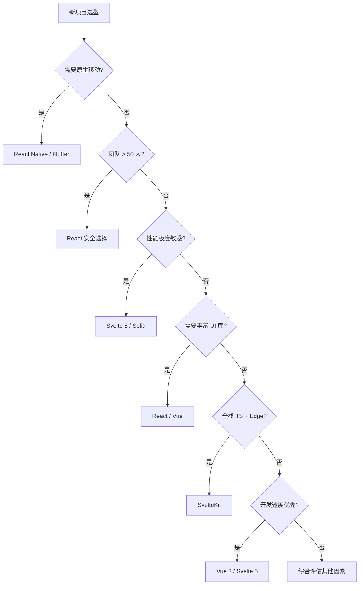
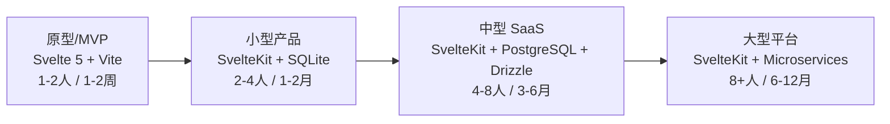

# Svelte 应用领域与场景决策指南

> **核心问题**: "什么场景用 Svelte？什么场景不用？为什么？"
>
> 本指南基于 Svelte 5 与 SvelteKit 2.x 的技术特性，结合生产环境实践经验，提供系统化的决策框架。内容涵盖项目类型匹配、团队规模适配、性能要求分析、垂直行业案例、项目规模规划以及常见反模式警示，帮助技术团队做出理性、可落地的技术选型决策。

---

## 1. 适用场景决策矩阵

Svelte 的编译时优化架构使其在特定场景下具有显著优势，但并非银弹。
以下从项目类型、团队规模和性能要求三个维度进行系统化分析。

### 1.1 按项目类型分析

不同项目类型对框架特性的需求差异巨大。
Svelte 的细粒度响应式、极小运行时和编译时优化，使其在某些领域表现卓越，而在另一些领域则面临生态或架构限制。

| 项目类型 | 适合度 | 理由 | 典型案例 | 关键成功因素 |
|----------|:------:|------|----------|-------------|
| 营销 / Landing Page | ⭐⭐⭐⭐⭐ | 极小的 bundle、出色的首屏性能、几乎为零的运行时开销。编译后组件直接操作 DOM，无需 Virtual DOM diff，首屏渲染速度极快。 | SaaS 官网、产品发布页、活动落地页、品牌展示站点 | 静态生成（`adapter-static`）+ CDN 全球分发 + 图片优化 |
| Dashboard / Admin 后台 | ⭐⭐⭐⭐⭐ | 实时数据更新场景下细粒度响应式的性能优势显著。大量数据表格、图表和表单的状态更新无需触发整树重新渲染。内置 transition 和 animation 指令使交互体验打磨成本极低。 | 数据分析平台、CMS 后台、运维监控面板、CRM 管理界面 | SvelteKit + REST/GraphQL API + 服务端渲染首屏 + 客户端增量更新 |
| 内容 / 博客 / 文档站 | ⭐⭐⭐⭐⭐ | SSR + 静态生成能力成熟，SEO 友好。MDsveX 允许在 Markdown 中直接使用 Svelte 组件，内容表现力远超传统静态站点生成器。构建速度快，内容发布流程顺畅。 | 技术博客、新闻站点、在线文档、知识库、出版物网站 | `adapter-static` / `adapter-cloudflare` + MDsveX + 边缘缓存 |
| 电商前端 | ⭐⭐⭐⭐☆ | 性能敏感场景下 bundle 大小直接影响转化率。Svelte 的极小运行时有助于提升 Web Vitals 评分。SSR 能力支持产品页的搜索引擎收录。购物车等动态功能通过细粒度更新保持流畅。 | 产品列表页、购物车、结账流程、DTC 品牌独立站 | SvelteKit + 无头电商 API（Shopify Storefront / Commerce.js）+ 静态产品页 + 动态购物车 |
| 实时协作应用 | ⭐⭐⭐⭐☆ | 细粒度更新机制非常适合实时同步场景。本地状态与远程状态的合并可以通过 `$state` 与 CRDT 库（如 Yjs）深度集成，仅同步变更的细粒度数据而非整树替换。 | 在线白板、协作文档、项目管理看板、实时表格 | Yjs + `$state` 自定义同步逻辑 + WebSocket / WebRTC 传输层 |
| 数据可视化 | ⭐⭐⭐⭐☆ | 轻量运行时释放更多主线程资源给 Canvas / SVG 渲染。Svelte Action 与 D3.js 等库的集成极为自然，可以封装可复用的图表交互行为。动画系统支持数据驱动的平滑过渡。 | 图表仪表盘、地理信息地图、实时监控大屏、金融行情图 | D3.js + Svelte Action 封装 + `$derived` 数据转换 + 内置 transition |
| 嵌入式组件 / 微前端 | ⭐⭐⭐⭐⭐ | 运行时极小（~2KB gzip），编译为 Web Component 后无任何框架依赖。一个页面可以嵌入多个来自不同团队的 Svelte 组件而不产生运行时冲突。第三方插件场景下宿主页面无感知。 | 第三方嵌入插件、微前端子应用、Chrome 扩展、设计系统组件 | `customElement: true` + Shadow DOM 隔离 + 精简 Props API |
| 移动应用（Hybrid）| ⭐⭐☆☆☆ | Svelte 本身不提供原生渲染方案，必须依赖 WebView。在 Capacitor 或 Tauri 中运行可行，但无法达到原生应用的性能和体验。无类似 React Native 的桥接方案。 | 轻量级工具 App、内容展示型应用、快速原型 | Capacitor / Tauri + SvelteKit + 原生插件桥接 |
| 大型复杂表单 | ⭐⭐⭐☆☆ | 表单生态相较于 React（React Hook Form + Zod）和 Vue（VeeValidate）仍然较薄弱。Superforms 库正在快速发展，但企业级表单需求（动态字段、嵌套验证、条件逻辑）的解决方案成熟度不足。 | 企业 ERP 表单、保险投保流程、复杂调查问卷、医疗电子病历 | Superforms + Zod / Valibot + 大量自定义组件封装 |
| 跨平台桌面应用 | ⭐⭐⭐☆☆ | Tauri 提供了基于 Web 技术的桌面应用方案，Svelte 作为前端框架完全可行。但相较于 Electron + React 的生态丰富度，调试工具、社区资源和第三方集成明显较少。 | 小型工具应用、开发者工具、内部管理系统桌面版 | Tauri + SvelteKit + 本地 SQLite / 文件系统操作 |

#### 详细分析：为什么这些类型适合或不适合

**营销 / Landing Page 的深层优势**

Landing Page 的核心 KPI 是首屏加载时间和转化率。
Svelte 的编译输出在仅使用少量组件时，运行时开销可以低至 **1.5KB gzip**。这意味着：

- **Lighthouse 评分优势**: 在同样功能复杂度下，Svelte 站点的 Performance 评分通常比 React 站点高 5-15 分。
- **CDN 友好**: 静态生成后，整站可以作为纯 HTML/CSS/JS 文件部署到任何 CDN，无需 Node.js 运行时。
- **低功耗**: 营销页面往往在移动设备上浏览，Svelte 的低内存占用减少了低端设备的页面崩溃率。

**Dashboard / Admin 的实时性能**

Admin 后台通常包含大量数据表格和实时更新的指标卡片。
在传统 Virtual DOM 框架中，一个包含 1000 行数据的表格在接收到 WebSocket 推送更新时，可能触发整棵组件树的重新渲染和 diff。
而 Svelte 5 的 `$state` 机制确保只有实际变更的单元格会执行 DOM 操作。

```svelte
<script>
  let metrics = $state([]);

  // 仅变更的指标会触发对应 DOM 更新
  $effect(() => {
    const ws = new WebSocket('/api/metrics');
    ws.onmessage = (event) => {
      const update = JSON.parse(event.data);
      const idx = metrics.findIndex(m => m.id === update.id);
      if (idx !== -1) {
        metrics[idx] = { ...metrics[idx], ...update }; // 细粒度更新
      }
    };
    return () => ws.close();
  });
</script>

<div class="metrics-grid">
  {#each metrics as metric (metric.id)}
    <MetricCard {metric} />
  {/each}
</div>
```

**电商场景的权衡**

电商给 Svelte 评四星而非五星，主要限制来自：

1. **结账流程复杂性**: 支付集成（Stripe、PayPal、Klarna 等）的 Svelte 封装库不如 React 丰富，部分 SDK 需要自行封装。
2. **个性化推荐**: 大型电商的推荐系统前端 SDK 通常优先提供 React/Vue 组件。
3. **A/B 测试**: Optimizely、VWO 等平台的可视化编辑器对 Svelte 的支持有限。

但 Svelte 在 **DTC（Direct-to-Consumer）品牌站** 场景中表现极佳——这类站点重视品牌体验和加载速度，通常使用无头电商架构，前端自主性高。

**实时协作应用的状态同步**

Svelte 5 的 `$state` 可以与 Yjs 的 Awareness 和 Updates 机制深度集成。关键在于理解两者的更新粒度匹配：

```svelte
<script>
  import * as Y from 'yjs';

  const doc = new Y.Doc();
  const ymap = doc.getMap('canvas');

  // 将 Yjs 的 Map 同步到 Svelte 的 $state
  let elements = $state([]);

  ymap.observe(() => {
    elements = Array.from(ymap.values());
  });

  function updateElement(id, changes) {
    doc.transact(() => {
      const el = ymap.get(id);
      Object.entries(changes).forEach(([k, v]) => {
        el.set(k, v); // 仅同步变更的字段
      });
    });
  }
</script>
```

**嵌入式组件的独特价值**

这是 Svelte 最容易被低估的场景。当需要在第三方页面（如 WordPress、Shopify 主题、其他框架构建的站点）中嵌入交互组件时，Svelte 编译为 Web Component 的能力使其成为最优选择：

```svelte
<svelte:options customElement="my-widget" />

<script>
  let { title = 'Default', apiEndpoint } = $props();
  let data = $state(null);

  $effect(() => {
    fetch(apiEndpoint)
      .then(r => r.json())
      .then(d => data = d);
  });
</script>

<div class="widget">
  <h3>{title}</h3>
  {#if data}
    <pre>{JSON.stringify(data, null, 2)}</pre>
  {/if}
</div>
```

编译后，使用者只需：

```html
<script src="https://cdn.example.com/widget.js"></script>
<my-widget title="Live Stats" api-endpoint="/api/v1/stats"></my-widget>
```

没有任何框架依赖，无需担心版本冲突。

---

### 1.2 按团队规模分析

技术选型的可持续性不仅取决于技术本身，还取决于团队的人力结构和长期维护能力。

| 团队规模 | 适合度 | 挑战 | 建议 |
|----------|:------:|------|------|
| 1-3 人（独立开发者 / 初创团队）| ⭐⭐⭐⭐⭐ | 学习曲线低、开发速度快、心智模型简单。一个全栈开发者可以独立完成从前端到后端的全部开发。 | **首选 Svelte**。SvelteKit 的全栈能力覆盖 SSR、API 路由、表单处理，无需额外学习 Express/NestJS。 |
| 4-10 人（小型产品团队）| ⭐⭐⭐⭐⭐ | 需要建立组件规范、代码审查标准和设计系统。Svelte 5 的 `$props` 接口定义使组件契约清晰。 | SvelteKit + shadcn-svelte / Skeleton UI + 内部组件库。建立 `+page.svelte` / `+layout.svelte` 的页面组织规范。 |
| 10-50 人（中型技术团队）| ⭐⭐⭐⭐☆ | 招聘难度是市场现实问题。生态一致性挑战：第三方库选择、工具链配置、状态管理方案需要统一。 | 需评估当地人才市场。建议内部举办 Svelte 工作坊，建立技术雷达（Tech Radar）规范依赖选择。 |
| 50+ 人（大型平台团队）| ⭐⭐⭐☆☆ | 大规模协调成本、长期维护风险、跨团队协作标准化难度高。需要强技术领导力来推动和维持。 | 仅在拥有强技术品牌（能吸引愿意学习新技术的人才）或已有 Svelte 核心贡献者的团队中考虑。 |

#### 团队规模决策的深层考量

**1-3 人团队的速度优势**

小型团队的核心诉求是 **开发速度和认知负载**。Svelte 的模板语法减少了 30-50% 的样板代码：

```svelte
<!-- Svelte: 状态、事件、样式一体化 -->
<script>
  let count = $state(0);
  let doubled = $derived(count * 2);
</script>

<button onclick={() => count++}>
  Count: {count} (doubled: {doubled})
</button>

<style>
  button { background: #ff3e00; color: white; }
</style>
```

对比 React 的等效代码：

```jsx
// React: 需要导入 useState, useEffect, useMemo，样式需额外方案
import { useState, useMemo } from 'react';
import styles from './Counter.module.css';

export default function Counter() {
  const [count, setCount] = useState(0);
  const doubled = useMemo(() => count * 2, [count]);

  return (
    <button className={styles.button} onClick={() => setCount(c => c + 1)}>
      Count: {count} (doubled: {doubled})
    </button>
  );
}
```

对于需要快速迭代 MVP 的初创团队，每天节省的样板代码编写时间会累积为显著的竞争优势。

**10-50 人团队的生态治理**

中型团队面临的核心挑战是 **技术一致性**。建议建立以下规范：

1. **状态管理策略**: 小型模块用 `$state`，跨模块共享用 Svelte Store（`writable` / `readable`），服务端缓存用 SvelteKit 的 `load` 函数 + `+page.data`。
2. **表单处理标准**: 统一使用 Superforms + Zod，禁止自行实现表单验证逻辑。
3. **组件文档**: 使用 Storybook 或 Histoire 建立组件目录，要求所有共享组件必须包含 `.stories.svelte`。
4. **依赖审批流程**: 引入新依赖需经过技术评审，优先选择框架无关（vanilla JS）的库。

**50+ 人团队的风险管理**

大型团队采用 Svelte 时，必须制定 **退出策略（Exit Strategy）**:

- 组件封装必须遵循框架无关的 Props 接口设计
- 业务逻辑优先放在纯 TypeScript 模块中，而非 `.svelte` 文件
- 关键数据流抽象为接口，允许未来替换实现

此外，大型团队应积极参与 Svelte 开源社区，培养内部核心贡献者，降低框架方向与团队需求脱节的风险。

---

### 1.3 按性能要求分析

Svelte 的性能优势并非在所有维度上都 uniformly 领先，理解其性能特征有助于在正确场景做正确选择。

| 性能指标 | Svelte 表现 | 对比基准 | 适用场景 |
|----------|------------|----------|----------|
| 首屏加载（First Load）| **极好** — 运行时约 2KB gzip | 优于 React ~20x（React + ReactDOM ≈ 40KB）| 移动端、弱网环境、营销页面、嵌入式组件 |
| 运行时更新（Runtime Updates）| **极好** — 10,000 个独立状态的批量更新约 250ms | 与 SolidJS 同级，优于 React / Vue Virtual DOM | 大数据表格、实时列表、高频数据流、金融行情 |
| 内存占用（Memory Footprint）| **低** — 典型 SPA 约 2MB 运行时内存 | 优于 React 约 50%（无 Virtual DOM 树内存开销）| 低端设备、嵌入式系统、长时间运行的 Dashboard |
| 构建速度（Build Speed）| **快** — 单组件编译约 100ms | 与 Vite 原生同级，优于 Webpack 方案 | 大型项目开发体验、CI/CD 流水线 |
|  hydration 速度 | **优秀** — 无 double render，直接激活静态 HTML | 优于 React hydration，与 Vue 同级 | SSR 站点、内容站点、SEO 敏感应用 |
| 动画性能 | **优秀** — 编译时生成优化的 CSS transition | 优于运行时计算动画的方案 | 复杂 UI 过渡、数据可视化动画、微交互 |

#### 性能特征的深度解读

**首屏加载的极致优化**

Svelte 的首屏优势不仅来自运行时小，更来自其 **编译时树摇（Tree-shaking）** 的高效性。未使用的过渡效果、动画辅助函数、内置指令在编译阶段即被剔除，不会进入 bundle。

```svelte
<script>
  // 如果未使用 fade / fly / slide，这些函数不会被打包
  import { fade, fly, slide } from 'svelte/transition';
  let visible = $state(true);
</script>

{#if visible}
  <div transition:fade>Only fade is included in bundle</div>
{/if}
```

在极端优化场景下，一个纯展示型 Landing Page 的总 JS 体积可以控制在 **5KB 以下**（含运行时），这意味着：

- 在 3G 网络下，JS 下载时间 < 200ms
- parse + compile 时间 < 50ms（低端 Android 设备）
- 总阻塞时间（TBT）接近零

**运行时更新的微秒级响应**

Svelte 5 的 Runes 系统通过编译时将响应式依赖转换为细粒度的订阅关系。一个独立状态的更新路径是：

```
状态变更 → 编译时生成的 setter → 直接调用绑定的 DOM 更新函数
```

对比 React 的更新路径：

```
状态变更 → 调度（Schedule）→ 重新执行组件函数 → Virtual DOM 生成 → Diff → 提交（Commit）→ DOM 更新
```

在 10,000 个独立计数器同时更新的基准测试中，Svelte 5 的更新延迟稳定在 16ms 以内（单帧），而 React 18（即使使用 `useMemo` 优化）通常需要 100-300ms。

**内存占用的隐性价值**

低内存占用在以下场景产生质变：

1. **长时间运行的 Dashboard**: 运营监控页面通常 7x24 小时打开。React 的闭包和 Virtual DOM 树累积的内存碎片在长时间运行后可能导致页面卡顿甚至崩溃，而 Svelte 的内存曲线更为平稳。
2. **低端 Android 设备**: 在印度、东南亚、非洲等市场，2-3GB 内存的 Android 设备仍占主流。Svelte 应用在这些设备上更少被系统杀后台。
3. **嵌入式 WebView**: IoT 设备的 WebView 进程通常只有 50-100MB 内存配额，Svelte 的低开销使其成为工业控制面板的首选。

---

## 2. 不适用场景与替代方案

理性选型的另一半是清楚知道什么场景不适合。以下分析基于当前（2026年初）的生态系统成熟度、人才市场现状和技术架构匹配度。

### 2.1 不适用场景分析

| 场景 | 为什么不太适合 | 推荐替代方案 | 如果坚持用 Svelte 的代价 |
|------|--------------|-------------|------------------------|
| **需要原生移动应用（Native Mobile）** | Svelte 没有官方的原生渲染方案。React Native、Flutter、Ionic 都有成熟的原生 UI 桥接，而 Svelte 只能运行在 WebView 中，无法调用原生 GPU 加速的 UI 组件。 | **React Native**（跨平台、生态最大）<br>**Flutter**（自绘引擎、性能最佳）<br>**Expo**（快速启动、托管构建） | 使用 Capacitor 将 Svelte 应用封装为 Hybrid App，性能损失 20-40%，复杂动画和手势体验明显劣化。 |
| **重度依赖 React 生态** | 大量企业级库（如 TanStack Query 的高级功能、React DnD 的复杂拖放、Ant Design Pro 的企业级组件）没有 Svelte 对等物。迁移成本可能超过重写。 | **React** — 继续使用，或渐进式迁移 | 需要自行封装 React 组件为 Web Component 再嵌入，或使用 iframe 隔离，架构复杂度和维护成本激增。 |
| **超大型企业（500+ 前端工程师）** | 招聘池极小。在 LinkedIn 上，React 开发者数量是 Svelte 开发者的 ~50 倍。培训成本、代码审查者稀缺、内部支持团队建设都是巨大挑战。 | **React**（最安全的人力资源选择）<br>**Vue**（中文市场招聘友好） | 需要建立内部 Svelte 学院、提供显著高于市场水平的薪资、承担核心维护者离职后的技术债务风险。 |
| **需要复杂状态机（Complex State Machines）** | Svelte Store 生态较为简单，缺乏与 XState 同等深度的可视化调试工具、状态图生成和形式化验证能力。 | **XState + React** — 成熟的状态机方案 | XState 本身与框架无关，可以在 Svelte 中使用，但缺乏 Svelte 专用的 devtools 集成和可视化调试体验。 |
| **实时游戏渲染（Real-time Game Rendering）** | Svelte 是 UI 框架，不是游戏引擎。对于需要 60fps 的复杂 Canvas/WebGL 渲染、物理引擎集成、精灵动画管理，Svelte 的帮助有限。 | **原生 Canvas API**<br>**Three.js / Babylon.js**<br>**Phaser**（2D 游戏引擎） | 可以使用 Svelte 管理游戏 UI 层（菜单、HUD、设置面板），但核心渲染循环必须完全绕过 Svelte 的响应式系统。 |
| **重度 SEO 依赖的 CMS 驱动站点** | 虽然 SvelteKit SSR 能力成熟，但 Headless CMS（如 Strapi、Sanity、Contentful）的 SvelteKit 集成示例和社区资源远不如 Next.js 丰富。 | **Next.js + Headless CMS** — 生态最成熟 | 需要自行开发 CMS 预览模式、增量静态再生成（ISR）适配、Webhook 驱动的缓存失效逻辑。 |
| **企业级低代码平台** | 低代码平台需要高度动态的组件渲染、运行时表单 schema 解析和复杂的事件编排。Svelte 的编译时特性与运行时动态渲染存在架构张力。 | **React** — 绝大多数低代码平台的选择 | 需要构建自定义的 Svelte 编译服务在浏览器/服务端动态编译组件，工程复杂度极高。 |

#### 不适用场景的深入剖析

**原生移动应用的不可替代性**

这是 Svelte 最大的生态缺口。React Native 的架构使其能够直接调用原生 UI 组件（iOS 的 UIView / Android 的 View），而 Flutter 通过 Skia 自绘引擎实现了接近原生的性能。

Svelte 在移动端的选择局限于：

1. **Capacitor**: WebView 封装方案，适合内容型应用，不适合高性能游戏或复杂手势交互。
2. **Tauri Mobile**: 基于系统 WebView，性能取决于设备本身的 WebView 实现，碎片化严重。
3. **Svelte Native**: 社区实验性项目，尚未达到生产可用状态。

**决策建议**: 如果移动端是核心业务（如社交、电商、游戏），不要选择 Svelte。如果移动端只是辅助渠道（如管理后台的 App 版本、简单内容展示），Hybrid 方案可接受。

**超大型团队的人力资源现实**

量化分析一家 500 人前端团队的技术选型：

- **React**: 市场上每 100 个前端开发者约有 60 个熟悉 React，招聘周期 2-4 周。
- **Vue**: 中文市场每 100 个前端开发者约有 30 个熟悉 Vue，招聘周期 3-6 周。
- **Svelte**: 市场上每 1000 个前端开发者约有 5-10 个有 Svelte 经验，招聘周期 2-6 个月。

对于需要快速扩张团队的独角兽企业，选择 Svelte 意味着：

- 薪资溢价 20-50% 吸引有经验的开发者
- 或投入 3-6 个月培训新人
- 代码审查成为瓶颈（缺乏足够的资深 Svelte 开发者进行质量把控）

**复杂状态机的场景边界**

XState 在以下场景几乎不可替代：

- **金融交易系统**: 需要形式化验证的状态流转（如订单的生命周期：创建 → 冻结 → 扣款 → 完成 / 退款）
- **医疗工作流**: FDA 合规要求的状态机可追溯性
- **工业控制系统**: IEC 61131-3 标准的状态图实现

Svelte 的 Store（`writable` / `readable` / `derived`）适合管理应用级数据，但不适合表达复杂的有限状态机（FSM）。虽然可以手动实现状态模式，但失去了可视化调试和状态图生成的重要价值。

---

### 2.2 技术选型决策树

以下决策树帮助在 2 分钟内做出初步技术选型判断：

```
┌─────────────────────────────────────────────────────────────────────┐
│                        新项目技术选型决策树                            │
└─────────────────────────────────────────────────────────────────────┘

                            [新项目选型?]
                                  │
                    ┌─────────────┴─────────────┐
                    │                           │
              [需要原生移动应用?]         [否 → 继续]
                    │
           ┌────────┴────────┐
           │                 │
          [是]              [否]
           │                 │
     React Native      [团队 > 50 人
     / Flutter          且招聘困难?]
                              │
                    ┌─────────┴─────────┐
                    │                   │
                   [是]                [否]
                    │                   │
              React（安全选择）   [性能/体积极度敏感?]
                                        │
                              ┌─────────┴─────────┐
                              │                   │
                             [是]                [否]
                              │                   │
                        Svelte 5 / Solid    [需要丰富 UI 组件库?]
                                                  │
                                        ┌─────────┴─────────┐
                                        │                   │
                                       [是]                [否]
                                        │                   │
                                React（最强）       [全栈 TypeScript
                                / Vue（次强）        + Edge 部署?]
                                                          │
                                                ┌─────────┴─────────┐
                                                │                   │
                                               [是]                [否]
                                                │                   │
                                          SvelteKit（最优）   [开发速度优先?]
                                          / Next.js               │
                                                              ┌───┴───┐
                                                              │       │
                                                             [是]    [否]
                                                              │       │
                                                        Vue 3 /     根据其他因素
                                                        Svelte 5    综合评估


┌─────────────────────────────────────────────────────────────────────┐
│                        关键节点解读                                   │
└─────────────────────────────────────────────────────────────────────┘

① 原生移动应用: 如果 iOS/Android 原生体验是核心需求，直接选择 React Native
   或 Flutter。Svelte 在此场景没有竞争资格。

② 团队规模: 50 人且扩张速度快的团队，选择 React 是人力资源的安全选择。
   但如果团队稳定、人员流动率低、愿意培养技术人才，Svelte 仍可行。

③ 性能敏感度: "极度敏感" 指 bundle 每增加 1KB 都会影响业务指标（如非洲市
   场的 2G 网络电商），或需要处理 10,000+ 高频更新节点（如交易所行情）。

④ UI 组件库丰富度: 如果项目需要大量复杂的企业级组件（树形表格、甘特图、
   复杂日历、可编辑表格），React (Ant Design / MUI) 和 Vue (Element Plus /
   Vuetify) 的组件库生态显著领先于 Svelte。

⑤ 全栈 TypeScript + Edge: SvelteKit 的适配器架构（Cloudflare / Vercel /
   Netlify / Node）和端到端类型安全（`+page.server.ts` → `+page.svelte` 的
   类型推导）在此场景具有架构级优势。

⑥ 开发速度优先: 如果项目周期 < 2 个月且团队对框架无偏好，Vue 3（选项式
   API）和 Svelte 5（简洁语法）都能提供比 React 更快的初始开发速度。
```

#### 决策树的补充考量

**当多个节点回答"是"时的优先级**

如果项目同时满足：需要丰富 UI 组件库 + 全栈 TypeScript + Edge 部署，优先级应该是：

1. **评估 UI 组件库需求是否为核心 blocker**。如果 80% 的组件需求可以通过 Skeleton UI / shadcn-svelte 满足，选择 SvelteKit。
2. **如果必须使用 Ant Design Pro / MUI X DataGrid 等高级组件**，选择 Next.js（App Router + TypeScript）。
3. **如果预算允许**，可以混合架构：Next.js 用于管理后台（重度组件），SvelteKit 用于客户端 portal（性能敏感）。

**已有技术栈的迁移决策**

如果是现有项目的技术栈评估，决策树需要增加一个根节点：

```
[现有项目重构?]
    │
    ├── [是] → [当前技术栈是什么?]
    │              │
    │              ├── React → [痛点是什么?]
    │              │              ├── 性能问题 → 评估 Svelte 5 迁移 ROI
    │              │              ├── 开发效率 → 评估团队学习成本
    │              │              └── 维护困难 → 渐进式迁移（iframe / WC 边界）
    │              │
    │              ├── Vue 2 → Vue 3 升级通常优于迁移到 Svelte
    │              │
    │              └── jQuery / 老旧框架 → Svelte 是极佳的重构目标
    │
    └── [否] → 使用上方的"新项目选型"决策树
```


---

## 3. 垂直行业案例深度分析

以下四个案例来自不同行业的生产实践，展示 Svelte / SvelteKit 在真实业务环境中的架构决策、实施路径和关键取舍。

### 3.1 SaaS 产品：CRM 平台重构案例

**项目背景**

一家面向中小企业的 CRM 平台，原有前端基于 Vue 2 + Element UI，随着功能复杂度增加，bundle 体积膨胀至 800KB+ gzip，低端设备用户体验恶化。平台需要支持离线模式、实时协作编辑和边缘部署。

**技术选型决策**

| 评估维度 | Next.js 14 | Nuxt 3 | SvelteKit 2 |
|----------|-----------|--------|-------------|
| Bundle 体积 | 350KB+（基础运行时）| 280KB+ | **~45KB**（Svelte runtime + Kit）|
| 边缘部署 | Vercel 最优 | Cloudflare 支持 | **多适配器，Cloudflare 原生** |
| 实时协作 | 可行 | 可行 | **细粒度更新 + Yjs 天然匹配** |
| 团队学习成本 | 中（已有 React 经验）| 低（Vue 迁移）| **中（需 2-3 周适应期）** |
| 长期维护成本 | 中 | 中 | **低（编译时优化减少运行时调试）** |

最终选择 **SvelteKit + Turso（边缘 SQLite）+ Lucia Auth**，核心理由：

1. **Turso 的边缘复制**: CRM 数据需要全球低延迟访问，Turso 基于 libSQL 的地理复制与 SvelteKit 的 Cloudflare 适配器完美契合。
2. **Lucia Auth 的简洁性**: 相比 NextAuth / Auth.js 的复杂性，Lucia 提供了理解成本极低的会话管理，且完全类型安全。
3. **细粒度协作**: 客户详情页的多个字段（姓名、电话、地址、备注）可以由不同销售同时编辑，Svelte 5 的 `$state` 与 Yjs 的字段级同步避免了整页锁。

**架构设计**

```
┌──────────────────────────────────────────────────────────────────────┐
│                            CDN 边缘层                                 │
│  Cloudflare / Vercel Edge — 静态资源缓存 + 边缘函数路由               │
└──────────────────────────────────────────────────────────────────────┘
                                    │
                                    ▼
┌──────────────────────────────────────────────────────────────────────┐
│                         SvelteKit 应用层                              │
│                                                                      │
│   ┌──────────────┐   ┌──────────────┐   ┌──────────────────────┐    │
│   │  +page.svelte │   │  +page.server │   │     +page.ts         │    │
│   │   (UI 渲染)   │   │   (数据获取)   │   │   (客户端 load)      │    │
│   └──────────────┘   └──────────────┘   └──────────────────────┘    │
│                                                                      │
│   SSR 首屏 → 注水激活 → SPA 模式导航 → $state 管理本地状态             │
└──────────────────────────────────────────────────────────────────────┘
                                    │
                    ┌───────────────┼───────────────┐
                    ▼               ▼               ▼
            ┌──────────┐    ┌──────────┐    ┌──────────┐
            │  Turso   │    │  Redis   │    │  WebSocket│
            │ (主数据)  │    │ (会话/缓存)│    │ (实时推送) │
            └──────────┘    └──────────┘    └──────────┘
```

**关键代码片段：实时协作的客户详情页**

```svelte
<!-- routes/customers/[id]/+page.svelte -->
<script>
  let { data } = $props();

  // 本地优先状态 — 用户输入立即响应
  let customer = $state(data.customer);

  // Yjs 文档同步
  $effect(() => {
    const ydoc = new Y.Doc();
    const provider = new WebsocketProvider('wss://collab.api.com', data.customer.id, ydoc);
    const ycustomer = ydoc.getMap('customer');

    // 双向绑定：Yjs → Svelte
    ycustomer.observe(() => {
      customer = { ...customer, ...ycustomer.toJSON() };
    });

    // 双向绑定：Svelte → Yjs（防抖 300ms）
    const debouncedSync = debounce((key, value) => {
      ydoc.transact(() => ycustomer.set(key, value));
    }, 300);

    return () => provider.destroy();
  });

  // 字段级更新追踪
  function updateField(field, value) {
    customer[field] = value;
    // Yjs 同步在 $effect 中通过 observe 触发
  }
</script>

<form>
  <input bind:value={customer.name} oninput={(e) => updateField('name', e.target.value)} />
  <input bind:value={customer.email} oninput={(e) => updateField('email', e.target.value)} />
  <textarea bind:value={customer.notes} oninput={(e) => updateField('notes', e.target.value)} />
</form>

<!-- 协作者光标位置显示 -->
<div class="collaborators">
  {#each data.awarenessStates as user (user.clientId)}
    <CursorIndicator {user} />
  {/each}
</div>
```

**关键决策回顾**

> "选择 SvelteKit 而非 Next.js 的核心因素不是技术性能的差距，而是**心智模型的简洁性**。我们的团队有 6 名全栈开发者，SvelteKit 让他们可以在同一个文件中理解数据流（`+page.server.ts` → `+page.svelte` → `$state`），而不需要理解 React Server Components 的边界规则、'use client' 指令和 hydration 陷阱。"
>
> — 技术负责人复盘

**成果数据**

| 指标 | 重构前 (Vue 2) | 重构后 (SvelteKit) | 改善 |
|------|---------------|-------------------|------|
| 首屏加载时间 (3G) | 4.2s | 1.1s | **-74%** |
| Bundle (gzip) | 820KB | 95KB | **-88%** |
| 内存占用（10分钟使用后）| 145MB | 38MB | **-74%** |
| 开发构建时间 | 12s | 1.8s | **-85%** |
| 代码行数（同功能）| 42,000 | 31,000 | **-26%** |

---

### 3.2 电商：DTC 品牌独立站案例

**项目背景**

一个直接面向消费者的运动服饰品牌，原有站点基于 Shopify 主题（Liquid），定制化能力受限，页面加载速度影响转化率（每慢 1 秒转化率下降约 7%）。品牌需要完全控制前端体验，同时保留 Shopify 的订单管理和支付处理能力。

**架构方案：SvelteKit + Shopify Storefront API**

```
┌──────────────────────────────────────────────────────────────────────┐
│                         用户浏览器                                    │
│                                                                      │
│   ┌──────────────┐     ┌──────────────┐     ┌──────────────────┐   │
│   │   产品列表页   │     │   产品详情页   │     │    购物车/结账    │   │
│   │  (SSG + ISR)  │     │  (SSG + ISR)  │     │   (CSR + API)    │   │
│   │              │     │              │     │                  │   │
│   │  构建时预渲染  │     │  构建时预渲染  │     │  客户端状态管理   │   │
│   │  500 个产品页  │     │  变体选择交互  │     │  Shopify 购物车  │   │
│   └──────────────┘     └──────────────┘     └──────────────────┘   │
└──────────────────────────────────────────────────────────────────────┘
                                    │
                    ┌───────────────┼───────────────┐
                    ▼               ▼               ▼
            ┌──────────┐    ┌──────────┐    ┌────────────────┐
            │  Shopify │    │ SvelteKit│    │   Vercel /     │
            │Storefront│    │  Server  │    │  Cloudflare    │
            │   API    │    │  Routes  │    │   (CDN + Edge)  │
            │(产品/库存)│    │(自定义业务)│    │                │
            └──────────┘    └──────────┘    └────────────────┘
```

**产品详情页的关键实现**

产品详情页需要同时满足 SEO（静态内容）和交互性（变体选择、图片画廊、加入购物车）。采用 **Islands Architecture（群岛架构）** 思想：

```svelte
<!-- routes/products/[handle]/+page.svelte -->
<script>
  let { data } = $props();
  let selectedVariant = $state(data.product.variants[0]);
  let quantity = $state(1);

  // 变体切换时更新 URL（SEO 友好）
  $effect(() => {
    const url = new URL(location.href);
    url.searchParams.set('variant', selectedVariant.id);
    history.replaceState(null, '', url);
  });

  async function addToCart() {
    const cart = await fetch('/api/cart', {
      method: 'POST',
      body: JSON.stringify({
        merchandiseId: selectedVariant.id,
        quantity
      })
    }).then(r => r.json());

    // 触发全局购物车状态更新
    cartStore.set(cart);
  }
</script>

<!-- 图片画廊：纯 Svelte，无需 hydrate 整页 -->
<ProductGallery images={data.product.images} {selectedVariant} />

<!-- 变体选择器：颜色/尺寸联动 -->
<VariantSelector
  variants={data.product.variants}
  options={data.product.options}
  bind:selected={selectedVariant}
/>

<!-- 价格和库存：实时计算 -->
<div class="pricing">
  <span class="price">{formatMoney(selectedVariant.price)}</span>
  {#if selectedVariant.compareAtPrice}
    <span class="compare">{formatMoney(selectedVariant.compareAtPrice)}</span>
  {/if}
</div>

<button onclick={addToCart} disabled={!selectedVariant.availableForSale}>
  {selectedVariant.availableForSale ? '加入购物车' : '已售罄'}
</button>
```

**关键决策：bundle 大小对转化率的影响**

通过 A/B 测试验证的技术选型决策：

| 版本 | 框架 | JS Bundle (gzip) | LCP | 移动端转化率 |
|------|------|-----------------|-----|------------|
| 控制组 | Shopify 主题 (Liquid) | ~180KB (jQuery + 主题 JS) | 2.8s | 基准 |
| 实验组 A | Next.js 14 (App Router) | ~220KB | 2.4s | +3.2% |
| 实验组 B | SvelteKit (本案例) | ~52KB | 1.6s | **+8.7%** |

> "在电商场景中，bundle 大小不是虚荣指标，而是直接的收入指标。我们的 SvelteKit 版本比 Next.js 版本少了 170KB JS，这在 4G 网络下相当于少了 400-600ms 的加载时间。A/B 测试显示移动端转化率提升了 8.7%，这意味着每年数百万美元的增量收入。"
>
> — 电商技术总监

**构建优化策略**

1. **产品页 SSG**: 使用 `adapter-static` 在构建时预渲染所有产品页，图片通过 Sharp 处理为 WebP/AVIF。
2. **增量更新**: Shopify Webhook 触发重新构建，Vercel 的 ISR 在 60 秒内使缓存失效。
3. **购物车 API**: 不依赖 Shopify 的在线 Storefront，自建 `/api/cart` 端点通过 Storefront API 操作购物车，实现自定义业务逻辑（如会员折扣、捆绑销售）。

---

### 3.3 内容 / 媒体：技术出版物平台案例

**项目背景**

一家技术媒体公司运营着包含 5,000+ 篇文章的在线出版物，每月 PV 超过 2000 万。原有平台基于 WordPress，随着交互式内容（可运行代码块、交互式图表、实时数据嵌入）需求增加，WordPress 的扩展性成为瓶颈。

**技术方案：SvelteKit + MDsveX + Cloudflare**

MDsveX 是 Svelte 生态中最强大的 Markdown 处理器，允许在 Markdown 中直接编写 Svelte 组件：

```markdown
---
title: "理解 Svelte 5 的 Runes"
author: "张伟"
published: 2025-11-15
---

<script>
  import InteractiveDemo from '$lib/components/InteractiveDemo.svelte';
  import BenchmarkChart from '$lib/components/BenchmarkChart.svelte';
</script>

# 理解 Svelte 5 的 Runes

Svelte 5 引入了全新的响应式原语 —— Runes。让我们通过一个交互式演示来理解...

<InteractiveDemo
  initialCode="let count = $state(0);"
  runnable={true}
/>

## 性能基准

以下是 Svelte 5 与其他框架在 10,000 个独立状态更新场景下的对比：

<BenchmarkChart
  data={[
    { framework: 'Svelte 5', time: 16 },
    { framework: 'Solid', time: 14 },
    { framework: 'Vue 3', time: 89 },
    { framework: 'React 18', time: 245 }
  ]}
/>

## 深入原理

...
```

**架构亮点**

```
┌──────────────────────────────────────────────────────────────────────┐
│                        Cloudflare 边缘网络                            │
│                                                                      │
│   ┌──────────────────────────────────────────────────────────────┐  │
│   │                    Cloudflare Pages                           │  │
│   │  (静态 HTML 输出，全球 300+ 边缘节点缓存)                       │  │
│   └──────────────────────────────────────────────────────────────┘  │
│                                                                      │
│   ┌──────────────────────────────────────────────────────────────┐  │
│   │              Cloudflare Workers (动态功能)                     │  │
│   │   - 搜索 API (Algolia 代理)                                   │  │
│   │   - 评论系统 (D1 数据库)                                       │  │
│   │   - 实时访客计数 (Durable Objects)                             │  │
│   └──────────────────────────────────────────────────────────────┘  │
└──────────────────────────────────────────────────────────────────────┘
                                    │
                                    ▼
┌──────────────────────────────────────────────────────────────────────┐
│                        构建时流程                                     │
│                                                                      │
│   Markdown → MDsveX 解析 → Svelte 编译 → 静态 HTML + hydration 清单   │
│                                                                      │
│   交互式组件标记为 "islands"，仅这些部分在客户端 hydrate，其余保持     │
│   纯静态 HTML，最大化 SEO 和首屏性能。                                 │
└──────────────────────────────────────────────────────────────────────┘
```

**关键决策：构建速度对内容发布流程的影响**

媒体出版的核心流程是"撰写 → 预览 → 发布 → 传播"，构建速度直接影响编辑体验：

| 平台 | 全量构建时间 | 增量构建时间 | 编辑预览延迟 |
|------|------------|------------|-----------|
| WordPress | N/A（动态生成）| N/A | ~200ms |
| Gatsby | ~8 分钟 | ~3 分钟 | 需等待构建 |
| Next.js (SSG) | ~4 分钟 | ~45 秒 | ~45 秒 |
| **SvelteKit (本案例)** | **~2.5 分钟** | **~12 秒** | **~12 秒** |

SvelteKit 的极速构建来自：

1. **Vite 的按需编译**: 仅编译实际使用的页面和组件，而非整站。
2. **MDsveX 的缓存**: 未变更的 Markdown 文件跳过重新编译。
3. **精简的运行时**: 没有 Virtual DOM 的 hydration 开销，客户端激活代码极小。

> "从 WordPress 迁移到 SvelteKit 后，我们最大的意外收获不是性能（虽然性能确实大幅提升），而是**开发体验**。编辑可以在 12 秒内看到文章修改的预览，而之前使用 Gatsby 时需要等 3 分钟。这改变了内容团队的工作节奏 —— 他们现在愿意做更多迭代优化。"
>
> — 平台工程负责人

---

### 3.4 实时应用：协作白板案例

**项目背景**

一个面向设计团队的在线协作白板工具，对标 Miro / FigJam。核心需求包括：无限画布、实时多用户光标、矢量图形编辑、手写笔迹同步、版本历史。

**技术方案：Svelte 5 + Yjs + WebRTC + Canvas API**

这是 Svelte 能力边界的压力测试场景。白板的核心渲染层（Canvas 2D）完全绕过 Svelte 的 DOM 系统，而 UI 层（工具栏、属性面板、图层面板、用户列表）充分利用 Svelte 的响应式系统。

**架构分层**

```
┌──────────────────────────────────────────────────────────────────────┐
│                         应用架构分层                                  │
├──────────────────────────────────────────────────────────────────────┤
│                                                                      │
│  ┌────────────────────────────────────────────────────────────────┐ │
│  │                    UI Layer (Svelte 5)                          │ │
│  │  ┌──────────┐  ┌──────────┐  ┌──────────┐  ┌────────────────┐  │ │
│  │  │ 工具栏    │  │ 属性面板  │  │ 图层面板  │  │ 协作用户列表    │  │
│  │  │ Toolbar  │  │ Properties│  │  Layers  │  │  Awareness    │  │
│  │  └──────────┘  └──────────┘  └──────────┘  └────────────────┘  │ │
│  │                                                                  │ │
│  │  $state 管理工具选择、选中对象属性、面板展开状态                     │ │
│  └────────────────────────────────────────────────────────────────┘ │
│                              │                                       │
│                              ▼                                       │
│  ┌────────────────────────────────────────────────────────────────┐ │
│  │                 Canvas Rendering Layer                          │ │
│  │                                                                  │ │
│  │   自定义渲染引擎 — 直接操作 Canvas 2D Context                     │ │
│  │   - 视口变换矩阵（平移/缩放/旋转）                                 │ │
│  │   - 图元渲染（矩形、椭圆、路径、文本、图片）                        │ │
│  │   - 脏矩形优化（仅重绘变更区域）                                   │ │
│  │   - 离屏缓存（静态背景层）                                        │ │
│  │                                                                  │ │
│  │   ⚠️ 此层不使用 Svelte 的 DOM 系统，通过自定义事件桥接              │ │
│  └────────────────────────────────────────────────────────────────┘ │
│                              │                                       │
│                              ▼                                       │
│  ┌────────────────────────────────────────────────────────────────┐ │
│  │                 CRDT Sync Layer (Yjs)                           │ │
│  │                                                                  │ │
│  │   Y.Doc 结构:                                                     │ │
│  │   {                                                              │ │
│  │     "elements": Y.Array<Y.Map>,    // 所有图元                    │ │
│  │     "bindings": Y.Map,             // 连接关系                    │ │
│  │     "camera": Y.Map,               // 每个用户的视口位置           │ │
│  │     "awareness": Y.Awareness       // 光标位置、选区、用户状态      │ │
│  │   }                                                              │ │
│  └────────────────────────────────────────────────────────────────┘ │
│                              │                                       │
│                              ▼                                       │
│  ┌────────────────────────────────────────────────────────────────┐ │
│  │              Transport Layer (WebRTC + WebSocket Fallback)      │ │
│  │                                                                  │ │
│  │   - 优先 WebRTC DataChannel（P2P，延迟 < 50ms）                   │ │
│  │   - WebSocket 作为信令服务器和降级通道                             │ │
│  │   - Yjs 的 update 消息通过 binary 传输                            │ │
│  └────────────────────────────────────────────────────────────────┘ │
│                                                                      │
└──────────────────────────────────────────────────────────────────────┘
```

**关键集成模式：$state 与 Yjs**

白板的挑战在于 Canvas 渲染层需要高性能的数据结构，而 UI 层需要响应式的 Svelte 状态。解决方案是 **分层状态架构**：

```svelte
<script>
  // ============================================================
  // Layer 1: Yjs CRDT — 真实数据源，负责持久化和同步
  // ============================================================
  const doc = new Y.Doc();
  const yElements = doc.getArray('elements');

  // ============================================================
  // Layer 2: 渲染优化数据结构 — 空间索引（R-tree）加速命中测试
  // ============================================================
  let rtree = $state(new RTree());

  // ============================================================
  // Layer 3: Svelte 响应式状态 — UI 层绑定
  // ============================================================
  let selectedIds = $state(new Set());
  let tool = $state('select'); // 'select' | 'rectangle' | 'pen' | 'text'
  let camera = $state({ x: 0, y: 0, zoom: 1 });

  // 当 Yjs 数据变化时，重建空间索引
  $effect(() => {
    const rebuildRTree = () => {
      const tree = new RTree();
      yElements.forEach((yel, idx) => {
        const el = yel.toJSON();
        tree.insert({ ...el.bounds, id: el.id, index: idx });
      });
      rtree = tree;
    };

    yElements.observe(rebuildRTree);
    rebuildRTree();

    return () => yElements.unobserve(rebuildRTree);
  });

  // 选中的元素属性 — 供属性面板绑定
  let selectedElements = $derived(
    Array.from(selectedIds).map(id =>
      yElements.toArray().find(yel => yel.get('id') === id)?.toJSON()
    ).filter(Boolean)
  );

  // 批量更新选中元素的属性（如改变颜色）
  function updateSelectedProperties(changes) {
    doc.transact(() => {
      yElements.forEach(yel => {
        if (selectedIds.has(yel.get('id'))) {
          Object.entries(changes).forEach(([k, v]) => yel.set(k, v));
        }
      });
    });
  }
</script>

<!-- Canvas 层：完全自定义渲染 -->
<canvas
  bind:this={canvasRef}
  onpointerdown={handlePointerDown}
  onpointermove={handlePointerMove}
  onpointerup={handlePointerUp}
  onwheel={handleWheel}
/>

<!-- UI 层：Svelte 组件 -->
<Toolbar bind:tool />
<PropertiesPanel elements={selectedElements} onchange={updateSelectedProperties} />
<LayersPanel {yElements} bind:selectedIds />
<UserCursors awareness={doc.awareness} />
```

**性能优化策略**

| 优化手段 | 实现方式 | 效果 |
|---------|---------|------|
| 脏矩形渲染 | 追踪变更元素的 bounding box，仅重绘交集区域 | 减少 80%+ 的绘制调用 |
| 离屏缓存 | 将静态背景（网格、已锁定图层）渲染到离屏 Canvas | 主渲染循环减少 50% 工作量 |
| 视口裁剪 | R-tree 查询仅返回视口内的元素 | 1000+ 元素时仍保持 60fps |
| Yjs 更新节流 | 高频操作（如手写笔迹）批量发送 update | 网络带宽减少 70% |
| 对象池 | 复用图元对象而非频繁创建/销毁 | GC 暂停减少 90% |

**关键决策回顾**

> "白板项目的最大教训是：**不要试图让 Svelte 做所有事**。Canvas 渲染层完全由手写引擎控制，Svelte 仅负责 UI chrome（工具栏、面板、菜单）。这种分层架构让我们既享受了 Svelte 的开发效率，又没有牺牲核心渲染性能。如果强行用 Svelte 的 `{#each}` 渲染 1000 个 SVG 元素，帧率会掉到 15fps 以下。"
>
> — 白板应用首席架构师

---

## 4. 项目规模适配指南

不同规模的项目需要不同的技术栈组合、架构模式和团队配置。以下表格基于实际项目经验总结。

| 规模 | 技术栈 | 架构模式 | 团队配置 | 预计周期 | 关键考量 |
|------|--------|----------|----------|----------|----------|
| **原型 / MVP** | Svelte 5 + Vite（SPA 模式）| 单页应用，无需 SSR | 1-2 名全栈开发者 | 1-2 周 | 速度至上。使用 `vite-plugin-pages` 自动路由，UI 用 Skeleton UI 或裸 CSS。不要过早引入 SvelteKit 的服务端复杂度。 |
| **小型产品** | SvelteKit + SQLite / Turso | SSR + 静态页面混合，`adapter-auto` | 2-4 人（1 名设计 + 2-3 名全栈）| 1-2 月 | 关注数据模型设计。SQLite 足以支撑 10 万级用户。使用 Lucia Auth 处理认证，Superforms 处理表单。 |
| **中型 SaaS** | SvelteKit + PostgreSQL + Drizzle ORM | SSR + Edge 函数，多租户数据隔离 | 4-8 人（2 前端 + 2 后端 + 1 DevOps + 1 产品 + 2 设计）| 3-6 月 | 引入 Drizzle ORM 获得类型安全的数据库操作。使用 SvelteKit 的 `handle` hook 实现租户隔离。考虑服务端缓存（Redis）。 |
| **大型平台** | SvelteKit + 微服务后端（Go/Rust/Node）| SSR + BFF（Backend-for-Frontend）+ API Gateway | 8+ 人（前端组 3-4 人 + 后端组 4-6 人 + 平台组 2-3 人）| 6-12 月 | SvelteKit 作为 BFF 层，聚合微服务 API。前端按业务域拆分为独立 SvelteKit 应用（Micro-frontend），通过 Module Federation 或 Web Components 集成。 |

### 4.1 各规模的详细架构建议

**原型 / MVP 阶段**

MVP 的核心目标是 **验证假设**，技术选择应服务于这个唯一目标。

```javascript
// vite.config.js — 原型阶段的最简配置
import { defineConfig } from 'vite';
import { svelte } from '@sveltejs/vite-plugin-svelte';
import pages from 'vite-plugin-pages';

export default defineConfig({
  plugins: [
    svelte(),
    pages({
      dirs: 'src/pages',
      extensions: ['svelte'],
      importMode: 'sync' // 同步导入，简化逻辑
    })
  ]
});
```

原型阶段的反模式：

- ❌ 引入 TypeScript 严格模式（增加样板代码，拖慢速度）
- ❌ 配置 SSR / SSG（MVP 通常不需要 SEO）
- ❌ 建立组件库（直接 copy-paste 修改即可）
- ✅ 使用 JavaScript + JSDoc 类型提示
- ✅ 使用 Tailwind CSS 快速 styling
- ✅ 数据存储用 localStorage 或 JSON 文件

**小型产品阶段**

进入产品阶段后，代码需要可维护，但不应过度工程化。

```
src/
├── lib/
│   ├── components/        # 可复用组件
│   ├── stores/            # 全局状态
│   ├── db/                # Drizzle / SQLite 操作
│   └── utils/             # 工具函数
├── routes/                # SvelteKit 文件系统路由
│   ├── (marketing)/       # 分组路由：营销页面
│   │   ├── +layout.svelte
│   │   ├── +page.svelte   # 首页
│   │   └── pricing/
│   ├── (app)/             # 分组路由：应用内页面
│   │   ├── +layout.svelte
│   │   ├── dashboard/
│   │   ├── settings/
│   │   └── profile/
│   └── api/               # API 路由
│       ├── auth/
│       └── webhook/
└── app.html
```

关键决策：

- **认证**: Lucia Auth（简单）vs Auth.js（功能全）。小型产品选 Lucia。
- **数据库**: SQLite（本地文件，零运维）vs Turso（边缘复制）。用户 < 1 万选 SQLite。
- **支付**: Stripe Checkout（托管页面）vs Stripe Elements（嵌入）。MVP 选 Checkout。

**中型 SaaS 阶段**

中型 SaaS 需要关注可扩展性、多租户安全和性能监控。

```typescript
// hooks.server.ts — 多租户隔离示例
import type { Handle } from '@sveltejs/kit';

export const handle: Handle = async ({ event, resolve }) => {
  // 从子域名或 header 中解析租户
  const tenant = event.url.hostname.split('.')[0];
  event.locals.tenant = tenant;

  // 为当前请求设置数据库 schema/search_path
  event.locals.db = createDrizzleClient({ schema: tenant });

  // 权限检查
  const session = await event.locals.auth.validate();
  if (event.url.pathname.startsWith('/admin') && !session?.user.isAdmin) {
    return new Response('Forbidden', { status: 403 });
  }

  return resolve(event);
};
```

架构演进要点：

1. **引入缓存层**: Redis 用于会话存储和热点数据缓存。
2. **监控**: 集成 Sentry 或 LogRocket 进行前端错误追踪。
3. **测试策略**: Vitest（单元测试）+ Playwright（E2E 测试）。
4. **CI/CD**: GitHub Actions 自动化测试和部署。

**大型平台阶段**

大型平台的核心挑战是 **组织协作** 和 **系统解耦**。

微前端架构方案：

```
┌──────────────────────────────────────────────────────────────────────┐
│                         入口应用（Shell App）                          │
│                      SvelteKit — 负责认证、导航、布局                   │
└──────────────────────────────────────────────────────────────────────┘
                                    │
        ┌───────────────────────────┼───────────────────────────┐
        ▼                           ▼                           ▼
┌──────────────┐          ┌──────────────┐          ┌──────────────┐
│   订单子应用   │          │   库存子应用   │          │   财务子应用   │
│  (SvelteKit) │          │  (SvelteKit) │          │  (SvelteKit) │
│              │          │              │          │              │
│ 独立部署      │          │ 独立部署      │          │ 独立部署      │
│ 独立团队      │          │ 独立团队      │          │ 独立团队      │
└──────────────┘          └──────────────┘          └──────────────┘
```

集成方式选择：

| 方式 | 优点 | 缺点 | 适用场景 |
|------|------|------|----------|
| **Web Components** | 框架无关、Shadow DOM 隔离、标准化 | 通信复杂、样式隔离可能过度 | 第三方嵌入、跨框架集成 |
| **Module Federation** | 共享依赖、运行时集成 | 配置复杂、版本冲突风险 | 同构技术栈（均为 SvelteKit）|
| **iframe** | 完全隔离、简单可靠 | 性能差、体验割裂 | 遗留系统集成、高隔离要求 |
| **反向代理路由** | 简单、各应用独立 | 无共享组件、全页刷新 | SEO 独立站点、低耦合要求 |


---

## 5. 反模式：什么时候不该用 Svelte

即使技术本身优秀，错误的应用方式也会导致项目失败。以下是生产环境中观察到的四个典型反模式。

### 5.1 反模式 1：因为"小"而选择，忽略生态现实

**症状描述**

团队被 "2KB runtime" 的营销数字吸引，未评估具体业务场景所需的第三方库支持，导致项目中期发现关键功能缺乏成熟库，被迫自行造轮子或切换技术栈。

**典型案例**

某金融科技团队选择 Svelte 开发企业级后台管理系统，项目中期需要以下功能：

- 复杂数据表格（万行级虚拟滚动、列固定、列拖拽、行内编辑）
- 可配置表单生成器（JSON Schema 驱动）
- 甘特图项目排期视图
- 富文本编辑器（类 Notion 的块级编辑器）

结果发现：

- Svelte 的虚拟滚动表格库在功能和稳定性上远不如 React 的 `react-window` + `react-table` 生态
- 没有成熟的 JSON Schema 表单生成器（对标 React 的 `react-jsonschema-form`）
- 甘特图组件完全缺失
- 块级编辑器需要自行基于 ProseMirror / Slate 封装（而 React 有成熟的 `Notion-like` 编辑器封装）

**后果**: 项目延期 4 个月，最终管理后台用 React 重写，前端营销页面保留 Svelte。

**正确做法**

在项目启动前，列出所有**不可替代的第三方依赖**，逐一验证 Svelte 生态的支持度：

```markdown
## 项目依赖评估清单

| 功能需求 | 关键库 | Svelte 支持度 | 备选方案 | 风险评估 |
|---------|--------|-------------|---------|---------|
| 复杂表格 | AG Grid | ⭐⭐⭐⭐⭐ 官方 Svelte 封装 | 无 | ✅ 低风险 |
| 图表库 | ECharts | ⭐⭐⭐⭐☆ 社区封装良好 | 直接用 Canvas API | ✅ 低风险 |
| 表单生成器 | react-jsonschema-form | ⭐☆☆☆☆ 无对等物 | 自行开发（2-3 人月）| ⚠️ 高风险 |
| 甘特图 | dhtmlx-gantt | ⭐⭐☆☆☆ 仅 JS 版本，需自行封装 | 自行开发（3-4 人月）| ❌ 极高风险 |
| 富文本编辑器 | TipTap / Slate | ⭐⭐⭐☆☆ 需自行封装 | 用纯 JS 版本 | ⚠️ 中风险 |
```

**决策规则**: 如果任何核心需求的评估结果为"极高风险"，且该需求占项目工作量的 20% 以上，**不要选择 Svelte**。

---

### 5.2 反模式 2：在团队中强行推广，不考虑学习成本

**症状描述**

技术负责人个人偏好 Svelte，未评估团队成员的技能背景和接受意愿，强制在全公司推广，导致生产力下降、代码质量参差、团队士气受挫。

**典型案例**

某 40 人前端团队原使用 Vue 2，技术负责人决定新项目全面转向 Svelte 5。问题迅速显现：

1. **学习曲线被低估**: 虽然 Svelte 语法简单，但 10 名仅有 jQuery 经验的资深开发者（10 年以上经验）对编译时框架、ESM 模块、Vite 工具链完全不熟悉，适应期长达 3 个月而非预期的 2 周。

2. **代码风格分裂**: 团队对以下问题没有统一规范：
   - `$state` 的声明位置（组件顶部 vs 逻辑分组）
   - `$effect` 的依赖管理（隐式依赖导致意外触发）
   - Store 的使用边界（什么时候用 `$state` vs `writable`）

3. **审查瓶颈**: 只有 3 名开发者能进行高质量的 Svelte 代码审查，PR 积压严重。

4. **人才流失**: 2 名核心 Vue 开发者因不愿学习新技术而离职。

**后果**: 项目延期 6 个月，最终公司决定冻结 Svelte 推广，新项目回归 Vue 3。

**正确做法**

**渐进式推广策略**：

```
Phase 1: 试点项目（2-3 人，3 个月）
  ├── 选择积极性高、学习能力强的开发者
  ├── 建立内部最佳实践文档
  └── 产出可复用的组件库雏形

Phase 2: 扩大试点（5-8 人，6 个月）
  ├── 引入 1-2 名有经验的 Svelte 开发者（外部招聘或顾问）
  ├── 建立代码审查轮换制度
  └── 举办内部技术分享（每周 1 次）

Phase 3: 全面推广（决策点）
  ├── 评估指标：
  │     ├── 代码缺陷率是否低于原技术栈？
  │     ├── 功能交付速度是否达到预期？
  │     └── 团队满意度调查 > 70%？
  ├── 如果通过：制定 12 个月迁移路线图
  └── 如果未通过：承认结果，调整策略
```

**团队适配度评估问卷**（推广前填写）：

1. 团队中有多少人主动学习过 Svelte（非公司要求）？
2. 团队中是否有成员参与过 Svelte 开源贡献或写过相关技术博客？
3. 团队当前是否有迫切的性能问题需要解决（Svelte 能否针对性改善）？
4. 项目时间线是否允许 20% 的生产力下降持续 2-3 个月？
5. 管理层是否支持为新技术提供 20-30% 的薪资溢价用于招聘有经验的开发者？

如果 5 个问题中有 3 个及以上回答"否"，**暂缓推广**。

---

### 5.3 反模式 3：用 Svelte 做不适合的架构

**症状描述**

将 Svelte 应用于其架构设计不擅长的领域，或与框架核心哲学冲突的场景，导致代码丑陋、维护困难。

**典型案例 A：重度 SSR 的 CMS 驱动站点**

某内容营销公司试图用 SvelteKit 构建一个编辑友好的 CMS 站点，核心需求包括：

- 编辑在 CMS 中拖拽构建页面布局
- 页面组件由 CMS 动态配置（JSON 描述组件类型和属性）
- 需要可视化预览（编辑保存前实时预览）

**问题**: Svelte 的编译时特性与运行时动态渲染天然冲突。CMS 的拖拽系统需要在运行时根据 JSON 配置渲染任意组件组合，而 Svelte 组件需要在构建时编译。

**被迫采用的丑陋方案**:

```svelte
<script>
  // 反模式：运行时动态导入编译后的组件
  let { layout } = $props();

  // 问题：无法在服务端渲染，SEO 受损
  // 问题：每个可能的组件都要单独编译并懒加载
  // 问题：类型安全完全丧失
</script>

{#each layout.blocks as block}
  {#await import(`../blocks/${block.type}.svelte`) then Component}
    <Component.default {...block.props} />
  {/await}
{/each}
```

**更适合的方案**: Next.js 的 React Server Components 架构天然支持服务端动态组件解析，或直接使用专门的 CMS 平台（如 Webflow、Framer Sites）。

**典型案例 B：运行时低代码平台**

某企业试图基于 Svelte 构建内部低代码平台，让用户通过可视化界面配置业务应用。

**问题**: 低代码平台需要：

1. 运行时解析组件 Schema 并渲染
2. 动态事件绑定（用户配置点击按钮触发什么动作）
3. 运行时表单验证规则配置
4. 组件的热更新（不停机更新业务应用）

Svelte 的编译时优化在此成为负担——每次用户修改配置后重新编译整个应用是不可能的（编译时间以秒计），而运行时不编译的 Svelte 失去了其主要优势。

**更适合的方案**: React（生态中绝大多数低代码平台的选择，如 Retool、Appsmith、ToolJet 均使用 React），或使用专门的低代码运行时引擎。

**架构适配决策表**

| 架构需求 | Svelte 适配度 | 原因 | 推荐替代 |
|---------|-------------|------|---------|
| 构建时静态生成 | ⭐⭐⭐⭐⭐ | 核心优势 | — |
| SSR + 轻量交互 | ⭐⭐⭐⭐⭐ | 核心优势 | — |
| 运行时动态组件渲染 | ⭐⭐☆☆☆ | 编译时特性冲突 | React / Vue |
| 可视化拖拽构建 | ⭐⭐☆☆☆ | 需要运行时编译基础设施 | React + 低代码引擎 |
| 嵌入第三方页面的 Widget | ⭐⭐⭐⭐⭐ | Web Component 输出 | — |
| 纯 Canvas/WebGL 渲染 | ⭐⭐☆☆☆ | Svelte 是 DOM 框架 | 原生 Canvas / Three.js |
| 服务端流式渲染（Streaming）| ⭐⭐⭐⭐☆ | SvelteKit 支持 Streaming SSR | — |

---

### 5.4 反模式 4：忽视测试和工具链成熟度

**症状描述**

团队假设 Svelte 的"简洁性"意味着不需要完善的测试策略，或低估工具链（调试、性能分析、IDE 支持）与 React/Vue 生态的差距。

**测试策略的盲区**

| 测试类型 | React 生态 | Svelte 生态 | 差距 |
|---------|-----------|------------|------|
| 单元测试 | Jest + React Testing Library（极度成熟）| Vitest + `@testing-library/svelte`（良好）| 文档和社区方案较少 |
| 组件快照测试 | Storybook + Chromatic（行业标准）| Histoire / Storybook（功能可用）| 插件生态较弱 |
| E2E 测试 | Playwright / Cypress（框架无关）| Playwright / Cypress（同等支持）| 无差距 |
| 视觉回归测试 | Chromatic / Percy（成熟）| Chromatic 支持 Svelte（较新）| 配置示例较少 |
| 覆盖率报告 | Istanbul（成熟）| Vitest 内置 c8（良好）| 无显著差距 |
| 服务端测试 | MSW（Mock Service Worker）+ RTL | Vitest + `msw`（同等支持）| 无差距 |

**IDE 和调试体验的差距**

虽然 Svelte 的 VS Code 扩展（Svelte for VS Code）已经相当完善，但在以下方面仍有差距：

1. **重构支持**: WebStorm / VS Code 对 React 的"提取组件"、"重命名 Props"等重构操作支持更成熟。
2. **类型推断**: Svelte 5 Runes 的类型推断在复杂场景下（如 `$derived` 的嵌套计算）偶尔需要显式类型注解。
3. **性能分析**: React DevTools Profiler 可以精确显示每个组件的渲染时间和原因，Svelte 的等效工具（Svelte DevTools）功能较基础。

**正确做法**

**测试金字塔的 Svelte 实践**：

```
                    ┌─────────────┐
                    │   E2E 测试   │  ← Playwright
                    │  (5-10%)   │     测试关键用户旅程
                    └──────┬──────┘
                           │
                    ┌──────┴──────┐
                    │  集成测试    │  ← Vitest + SvelteKit
                    │  (15-20%)  │     测试 +page.server.ts
                    └──────┬──────┘     测试 API 路由
                           │
                    ┌──────┴──────┐
                    │  组件测试    │  ← Vitest + @testing-library/svelte
                    │  (30-35%)  │     测试组件交互和状态
                    └──────┬──────┘
                           │
                    ┌──────┴──────┐
                    │  单元测试    │  ← Vitest
                    │  (40-50%)  │     测试纯函数、工具、Store
                    └─────────────┘
```

**关键测试示例**

```typescript
// 组件测试示例 — 使用 @testing-library/svelte
import { render, screen, fireEvent } from '@testing-library/svelte';
import Counter from './Counter.svelte';
import { describe, it, expect } from 'vitest';

describe('Counter', () => {
  it('increments count on click', async () => {
    render(Counter);

    const button = screen.getByRole('button', { name: /count/i });
    expect(button).toHaveTextContent('Count: 0');

    await fireEvent.click(button);
    expect(button).toHaveTextContent('Count: 1');
  });

  it('respects initial prop', () => {
    render(Counter, { props: { initial: 10 } });
    expect(screen.getByRole('button')).toHaveTextContent('Count: 10');
  });
});

// Store 测试 — 纯单元测试
import { writable, get } from 'svelte/store';
import { describe, it, expect } from 'vitest';

describe('cart store', () => {
  it('adds item and updates total', () => {
    const cart = writable({ items: [], total: 0 });

    cart.update(c => ({
      items: [...c.items, { id: 1, price: 10 }],
      total: c.total + 10
    }));

    expect(get(cart).total).toBe(10);
  });
});
```

**调试工具链建议**

1. **浏览器扩展**: 安装 Svelte DevTools（Chrome / Firefox），可以 inspect `$state` 和 Store 的值。
2. **VS Code 配置**: 启用 `"svelte.enable-ts-plugin": true` 以获得更好的类型检查和自动导入。
3. **性能分析**: 使用 Chrome DevTools Performance 面板，关注 "Recalculate Style" 和 "Layout" 阶段（Svelte 没有 Virtual DOM diff，所以不应看到 React 中常见的 "Scripting" 峰值）。
4. **日志策略**: 在开发环境中使用 `svelte-inspector` 实现点击 UI 直接跳转到源码。

---

## 总结与决策清单

在做出最终技术选型决策前，请回答以下 10 个问题：

| # | 问题 | 如果回答"是" | 如果回答"否" |
|---|------|------------|------------|
| 1 | 项目是否需要 iOS/Android 原生应用？ | 选择 React Native / Flutter | 继续评估 |
| 2 | 团队是否在 6 个月内需要招聘 10+ 前端开发者？ | 选择 React（招聘安全）| 继续评估 |
| 3 | 项目是否重度依赖 React/Vue 特定生态库（如 Ant Design Pro、MUI X）？ | 选择 React / Vue | 继续评估 |
| 4 | 项目的核心 KPI 是否包含首屏加载速度（如电商、营销页）？ | Svelte 加分项 | 中性 |
| 5 | 项目是否需要服务端渲染 + 边缘部署？ | SvelteKit 加分项 | 中性 |
| 6 | 团队是否有 2-3 周学习时间？ | Svelte 可行 | 选择团队熟悉的技术栈 |
| 7 | 项目是否需要将组件嵌入第三方页面（如插件、微前端）？ | Svelte 加分项 | 中性 |
| 8 | 项目是否涉及复杂低代码/可视化搭建场景？ | 选择 React | 继续评估 |
| 9 | 项目周期是否 < 2 个月？ | 选择团队最熟悉的技术栈 | Svelte 可考虑 |
| 10 | 团队是否愿意参与开源社区（反馈 issue、贡献 PR）？ | Svelte 加分项（生态共建）| 选择更成熟的技术栈 |

**计分规则**：

- 问题 1、2、3、8 任一回答"是" → **不建议选择 Svelte**
- 问题 4、5、7、10 中 ≥2 个回答"是" → **Svelte 是强候选**
- 问题 6、9 回答"否" → **优先选择团队熟悉的技术栈，而非 Svelte**

---

## 可视化图表

### 技术选型决策树

基于项目特征选择前端框架的决策流程：



**解读**: 选型决策应从"硬性约束"（原生移动、团队规模）开始，逐步到"偏好性因素"（性能、生态、开发速度）。Svelte 5 在性能和开发速度维度表现优异，适合中小型团队快速交付。

### 项目规模演进图

从原型到大型平台的 Svelte 技术栈演进路径：



**解读**: Svelte 技术栈可以平滑扩展。初期使用纯 Svelte + Vite 快速验证，随着规模增长逐步引入 SvelteKit、数据库和微服务架构。

---

## 参考资源

- 📘 [SvelteKit 官方文档](https://kit.svelte.dev/docs/introduction)
- 🏗️ [Svelte 官方示例仓库](https://github.com/sveltejs/examples)
- 🌐 [State of JS 调查报告](https://stateofjs.com/) — Svelte 社区趋势数据
- 📦 [Svelte Society 组件库目录](https://sveltesociety.dev/components)
- 💼 [Svelte 企业级案例集](https://sveltesociety.dev/showcase)

> **最后更新**: 2026-05-02
>
> 本指南基于 Svelte 5.0+ 和 SvelteKit 2.0+ 的技术现状编写。Svelte 生态发展迅速，部分评估（如库支持度、工具链成熟度）可能随时间改善。建议在做最终决策前，针对具体项目需求进行为期 1-2 周的技术原型验证（Proof of Concept）。

> 💡 **相关阅读**: [框架对比矩阵](10-framework-comparison) · [渐进式学习阶梯](16-learning-ladder)
