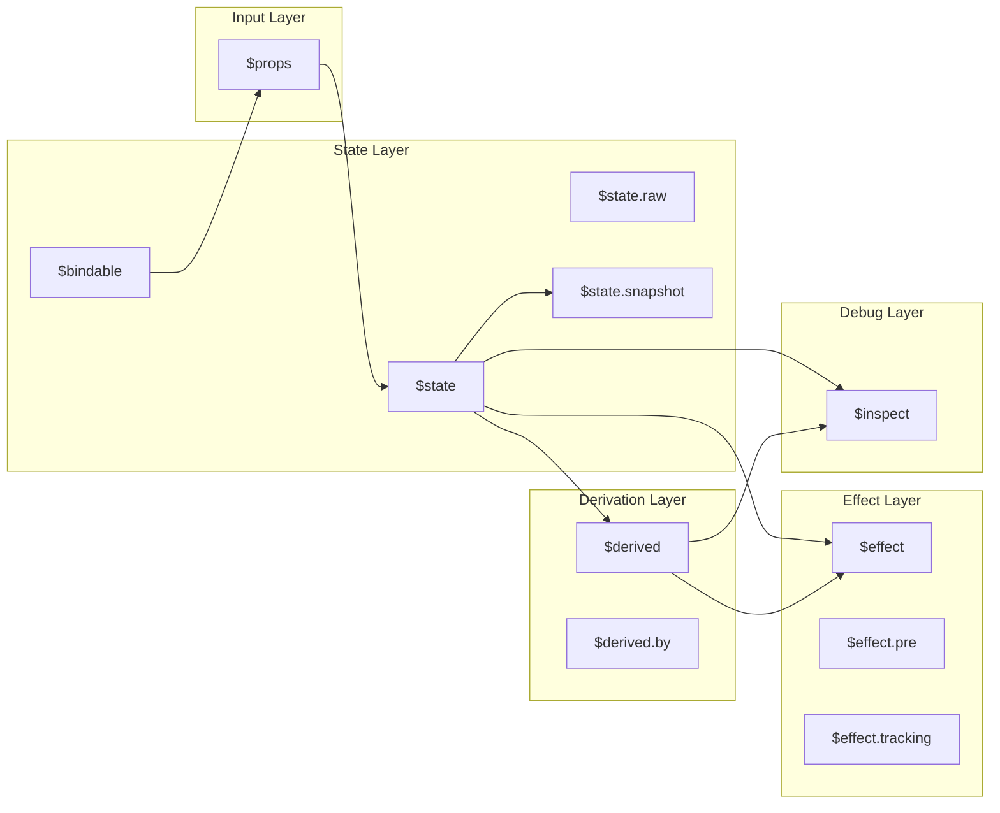
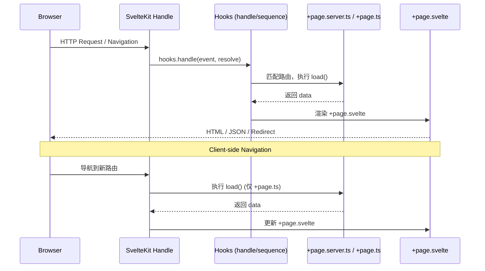
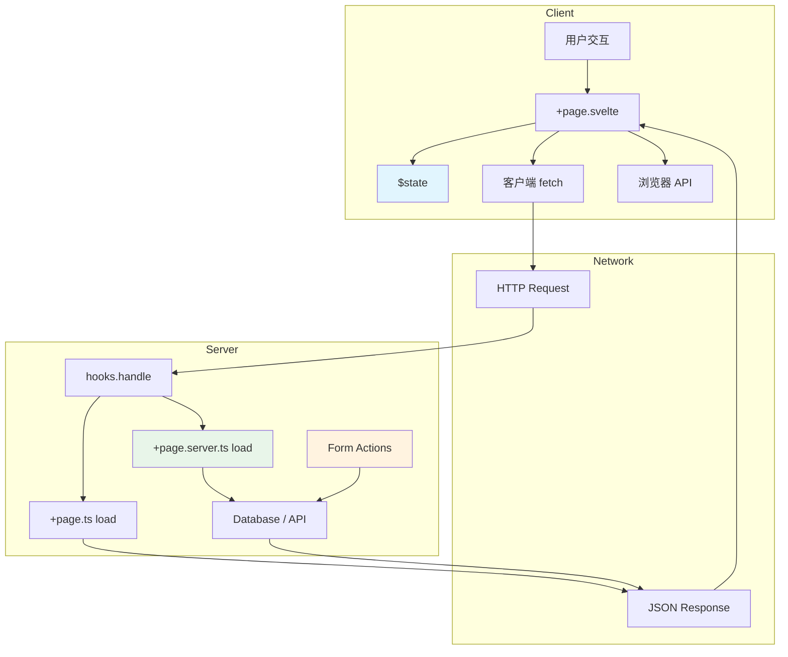

# Svelte 知识图谱与思维工具

> 本页以 10+ 种不同思维表征方式（mind map、decision tree、inference tree、matrix、theorem card、cheatsheet）组织 Svelte/SvelteKit 核心知识，适合快速定位、诊断与决策。

---

## 1. Svelte 知识图谱（Mermaid 图）

### 1.1 概念层次结构

```mermaid
graph TD
    Svelte[Svelte 生态系统]
    Svelte --> Compiler[编译器 Compiler]
    Svelte --> Runtime[运行时 Runtime]
    Svelte --> Language[语言 Language]
    Svelte --> Ecosystem[生态 Ecosystem]

    Compiler --> AST[AST 转换]
    Compiler --> CodeGen[代码生成 CodeGen]
    Compiler --> Optimization[优化 Optimization]
    Compiler --> HMR[热更新 HMR]

    AST --> Parse[解析 .svelte]
    AST --> Transform[魔法重写 / Runes 转换]
    AST --> Analyze[依赖分析]

    CodeGen --> ClientOut[Client-side JS]
    CodeGen --> ServerOut[Server-side JS]
    CodeGen --> CSSOut[Scoped CSS]

    Runtime --> Reactivity[响应式引擎 Signals]
    Runtime --> DOM[DOM 操作 VDOM-less]
    Runtime --> SSR[SSR / Hydration]
    Runtime --> Transition[Transition / Animation]

    Reactivity --> Signal[Signal Graph]
    Reactivity --> Effect[Effect Scheduler]
    Reactivity --> Memo[$derived / Memo]

    Language --> Runes[Runes API]
    Language --> Template[模板语法 Template]
    Language --> Components[组件系统 Components]
    Language --> Styling[样式 Scoped CSS]

    Runes --> State[$state]
    Runes --> Derived[$derived]
    Runes --> Effect[$effect]
    Runes --> Props[$props]
    Runes --> Inspect[$inspect]
    Runes --> Bindable[$bindable]
    Runes --> Snapshot[$state.snapshot]

    Template --> LogicBlock[逻辑块 {#if / #each}]
    Template --> Binding[双向绑定 bind:]
    Template --> Event[事件处理 on:]
    Template --> Slot[Slot / Snippet]

    Components --> PropsDecl[$props 声明]
    Components --> LifeCycle[生命周期]
    Components --> Composition[组合模式]

    Ecosystem --> SvelteKit[SvelteKit 框架]
    Ecosystem --> Vite[Vite 工具链]
    Ecosystem --> Libraries[第三方库]

    SvelteKit --> Routing[文件系统路由]
    SvelteKit --> Load[Load 函数]
    SvelteKit --> Form[Form Actions]
    SvelteKit --> Adapter[Deployment Adapters]
```

### 1.2 Runes 关系图谱



### 1.3 SvelteKit 请求生命周期



---

## 2. 决策树集合

### 2.1 状态管理选型决策树

```
状态范围 State Scope?
├── 单个组件内部 Single Component
│   └── $state（本地本地状态）
│       └── 需要持久化到 localStorage?
│           ├── 是 → $state + $effect 同步 storage
│           └── 否 → 纯 $state
├── 几个相关组件 Small Group
│   ├── 父子关系 Parent-Child
│   │   ├── 状态简单且浅层?
│   │   │   ├── 是 → $props + callbacks (one-way)
│   │   │   └── 否 → bind:prop (two-way, 谨慎使用)
│   │   └── 需要深层传递?
│   │       └── 是 → setContext / getContext
│   └── 兄弟/跨层级 Sibling / Cross-level
│       ├── 共享模块 .svelte.ts (推荐 Svelte 5)
│       │   └── 需要 SSR 兼容?
│   │       │   ├── 是 → 在 .svelte.ts 中判断 browser
│   │       │   └── 否 → 直接使用
│       └── 旧项目 Svelte 4?
│           └── 是 → Writable Store + Context
├── 应用全局 Global App State
│   ├── 简单键值对 Simple KV
│   │   └── Svelte Store (writable / readable)
│   ├── 复杂派生 Complex Derived
│   │   └── derived(store, fn) 或 .svelte.ts 中的 $derived
│   ├── 需要撤销/重做 Undo/Redo?
│   │   └── 是 → $state + Command Pattern + History Stack
│   └── 需要持久化 Persist?
│       └── 是 → Store + storage subscription
├── 服务器状态 Server State
│   ├── SvelteKit Load 函数
│   │   └── 需要实时更新?
│   │       ├── 是 → Streaming + $derived
│   │       └── 否 → 标准 load + 缓存
│   ├── 外部 API External API
│   │   └── 需要客户端缓存?
│   │       ├── 是 → TanStack Query / SvelteQuery
│   │       └── 否 → 原生 fetch + $derived
│   └── Form 提交 Form Submission
│       └── 使用 Form Actions + progressive enhancement
└── URL 状态 URL State
    ├── 简单查询参数 Query Params
    │   └── $page.url.searchParams
    ├── 复杂路由段 Route Params
    │   └── $page.params
    └── 需要同步到组件?
        └── 是 → $page.url + $derived 或 $effect
```

### 2.2 部署平台决策树

```
目标平台?
├── 静态站点 Static Site (JAMStack)
│   ├── 无服务器端逻辑?
│   │   ├── 是 → adapter-static
│   │   └── 否 → 检查是否需要 SSR fallback
│   └── 托管平台?
│       ├── Vercel → adapter-vercel (自动)
│       ├── Netlify → adapter-netlify
│       ├── Cloudflare Pages → adapter-cloudflare
│       ├── GitHub Pages → adapter-static + base path
│       └── 自有服务器 → adapter-static
├── 服务端渲染 SSR / Node.js
│   ├── 平台?
│   │   ├── 自有 VPS / Docker → adapter-node
│   │   ├── Vercel Serverless → adapter-vercel
│   │   ├── Netlify Functions → adapter-netlify
│   │   ├── AWS Lambda → adapter-node 或 custom
│   │   └── Deno Deploy → adapter-deno
│   └── 需要 Edge Runtime?
│       ├── Cloudflare Workers → adapter-cloudflare-workers
│       ├── Vercel Edge → adapter-vercel (edge)
│       └── Deno Edge → adapter-deno
├── 混合渲染 Hybrid
│   ├── 大部分静态 + 少量动态页面?
│   │   └── 使用 prerender + entries 配置
│   ├── 需要 ISR / 增量再生?
│   │   └── Vercel ISR / adapter-vercel 配置
│   └── 需要按路由选择策略?
│       └── 在 +page.ts / +layout.ts 中导出 config
└── 特殊环境 Special
    ├── Electron → adapter-static + Electron main
    ├── Tauri → adapter-static + Tauri config
    ├── Mobile (Capacitor) → adapter-static
    └── 嵌入式 / 微前端 → adapter-static + UMD/ESM
```

### 2.3 渲染策略决策树

```
页面类型 / 目标?
├── 营销页 / 内容站 Marketing / Content
│   ├── 需要 SEO?
│   │   ├── 是 → SSR + prerender (静态生成)
│   │   └── 否 → CSR (若内容少)
│   ├── 内容频繁变化?
│   │   ├── 是 → SSR (服务端实时渲染)
│   │   └── 否 → Prerender (构建时生成)
│   └── 需要个性化内容?
│       └── 是 → SSR + Edge (按地理位置/用户)
├── 应用后台 / Dashboard SPA
│   ├── 强交互 / 实时数据?
│   │   ├── 是 → CSR (SPA 模式)
│   │   └── 否 → 混合模式
│   ├── 需要首屏体验?
│   │   ├── 是 → SSR 骨架屏 + hydration
│   │   └── 否 → 纯 CSR
│   └── 大量数据表格?
│       └── 虚拟滚动 + CSR / 分页 SSR
├── 电商 / 社交 E-commerce / Social
│   ├── 商品详情页 Product Detail
│   │   └── SSR (SEO) + CSR (交互: 购物车)
│   ├── 用户动态 Feed
│   │   └── SSR 首屏 + CSR 无限滚动
│   └── 结账流程 Checkout
│       └── SSR (安全) + 渐进增强
├── 文档 / 博客 Docs / Blog
│   └── Prerender (SSG) — 构建时生成全部页面
│       └── 大量页面?
│           ├── 是 → 增量构建 + 分页
│           └── 否 → 全量 prerender
└── 实时应用 Realtime
    ├── WebSocket 驱动?
    │   └── CSR + SvelteKit server hooks 处理 WS
    ├── Server-Sent Events?
    │   └── SSR 初始态 + SSE 推送更新
    └── 协作编辑?
        └── CSR + Yjs / CRDT + WebSocket
```

---


## 3. 多维对比矩阵

### 3.1 状态管理方案矩阵

| 方案 | 学习成本 | 类型安全 | 调试难度 | 性能 | 适用规模 | SSR 兼容 |
|------|----------|----------|----------|------|----------|----------|
| **$state** (本地) | 极低 | 极佳 (Runes 推断) | 低 | 极佳 (Signal 级) | 单组件 | 完全兼容 |
| **$props + callback** | 低 | 极佳 | 低 | 极佳 | 父子组件 | 完全兼容 |
| **.svelte.ts 共享模块** | 低 | 极佳 | 中 | 极佳 | 中小应用 | 需注意 hydration |
| **Svelte Store (writable)** | 中 | 需手动泛型 | 中 | 好 | 全局简单状态 | 完全兼容 |
| **derived()** | 中 | 需手动泛型 | 中 | 好 (自动缓存) | 派生计算 | 完全兼容 |
| **Context API** | 中 | 中等 | 中 | 好 | 跨层级注入 | 完全兼容 |
| **TanStack Query** | 中 | 好 | 低 (DevTools) | 好 | 服务器状态 | 完全兼容 |
| **Zustand / Pinia** | 低 | 好 | 低 | 好 | 框架无关 | 需适配 |
| **Redux Toolkit** | 高 | 好 | 低 (DevTools) | 中 | 大型应用 | 需配置 |
| **XState** | 高 | 好 | 中 | 中 | 复杂状态机 | 完全兼容 |

**选型建议速查：**

- **Svelte 5 新项目 + 本地/共享状态** → `.svelte.ts` + `$state` (首选)
- **服务器状态 (REST API)** → `+page.ts` load 函数 / TanStack Query
- **全局主题 / UI 状态** → `.svelte.ts` 单例或 writable store
- **复杂表单** → `sveltekit-superforms` + Form Actions
- **需要框架无关 (多技术栈)** → Zustand / Pinia

### 3.2 渲染策略矩阵

| 策略 | 首屏速度 | 交互性 | SEO | 服务器负载 | 适用场景 | 复杂度 |
|------|----------|--------|-----|------------|----------|--------|
| **Prerender (SSG)** | 极快 (CDN) | 需 Hydration | 极佳 | 极低 | 博客 / 文档 / 营销页 | 低 |
| **SSR** | 快 | 需 Hydration | 极佳 | 中 | 电商 / 内容 / SEO 应用 | 中 |
| **CSR (SPA)** | 慢 (首屏) | 极佳 | 差 | 低 | Dashboard / 后台 / 工具 | 低 |
| **Streaming SSR** | 快 (渐进) | 需 Hydration | 好 | 中 | 大数据量首屏 | 高 |
| **ISR (增量静态)** | 极快 | 需 Hydration | 极佳 | 低 | 频繁更新内容站 | 中 |
| **Edge SSR** | 快 (全球) | 需 Hydration | 极佳 | 极低 | 国际化 / 低延迟 | 高 |
| **Islands (部分 Hydration)** | 快 | 按需 | 极佳 | 低 | 内容为主 + 少量交互 | 高 |

### 3.3 Runes vs Svelte 4 API 对比矩阵

| 能力 | Svelte 4 API | Svelte 5 Runes | 迁移难度 | 说明 |
|------|-------------|----------------|----------|------|
| 响应式变量 | `let count = 0` (顶层自动) | `$state(0)` | 低 | 需显式声明 |
| 计算属性 | `$: doubled = count * 2` | `$derived(count * 2)` | 低 | 语义更清晰 |
| 副作用 | `$: { console.log(count) }` | `$effect(() => { ... })` | 中 | 显式依赖追踪 |
| Props | `export let prop` | `let { prop } = $props()` | 中 | 解构赋值模式 |
| 双向绑定 Props | `export let value` + `bind:value` | `let { value = $bindable() }` | 中 | 需显式声明可绑定 |
| Context | `setContext` / `getContext` | 不变 | 无 | API 兼容 |
| Store 订阅 | `$store` 自动订阅 | `$store` 仍然有效 | 无 | 可渐进迁移 |
| 生命周期 | `onMount` / `onDestroy` | 不变 + 新增 `$effect` | 低 | 推荐组合使用 |

---

## 4. 推理判断树

### 4.1 "为什么我的组件不更新？" 诊断树

```
组件不更新?
├── 使用了 Runes?
│   ├── 是 → 变量声明为 $state?
│   │   ├── 否 → 改为 $state(初始值)
│   │   └── 是 → 修改的是对象/数组属性?
│   │       ├── 是 → Svelte 5 自动深层响应?
│   │       │   ├── 否 → 确保使用 $state 而非 $state.raw
│   │       │   └── 是 → 检查是否在 $effect 外读取
│   │       └── 否 → 检查赋值是否为响应式触发
│   │           └── 直接修改数组索引 arr[0] = x?
│   │               └── 是 → 用 arr = [...arr] 或 push + 重新赋值
│   └── 否 (Svelte 4) → 变量在组件顶层?
│       ├── 否 → 提升到顶层 (Svelte 4 仅顶层自动响应)
│       └── 是 → 使用了 $: 正确引用?
│           └── 否 → 检查 $: 语句是否引用了该变量
├── 使用了 Store?
│   ├── 是否正确订阅 ($store 前缀)?
│   │   └── 否 → 在 .svelte 文件中使用 $ 前缀
│   └── Store 值是否被覆盖?
│       └── 检查 set / update 调用
├── 使用了 Props?
│   ├── 父组件是否更新了传入值?
│   │   └── 否 → 问题在父组件
│   └── 子组件是否正确声明 props?
│       └── Svelte 5: 使用 $props() 解构
├── 在 $effect 中?
│   ├── 依赖是否被读取?
│   │   └── 否 → 确保在 effect 函数体内直接读取
│   └── 是否有无限循环?
│       └── 检查 effect 内是否修改了自身依赖
└── SSR / Hydration 问题?
    ├── 服务端与客户端状态不一致?
    │   └── 使用 $state 配合 $effect 重新同步
    └── 浏览器 API 在服务端执行?
        └── 用 typeof window !== 'undefined' 或 $effect 保护
```

### 4.2 "选 CSR 还是 SSR？" 判断树

```
选 CSR 还是 SSR?
├── 首屏内容是否对 SEO 关键?
│   ├── 是 → SSR (或 Prerender)
│   └── 否 → 继续判断
├── 首屏数据是否用户特定 (需要登录态)?
│   ├── 是 → SSR (服务端获取个性化数据)
│   └── 否 → 继续判断
├── 应用是否主要是交互型 Dashboard / 工具?
│   ├── 是 → CSR (SPA 模式)
│   │   └── 但首屏体验重要?
│   │       └── 是 → SSR + hydration 骨架屏
│   └── 否 → 继续判断
├── 内容是否静态且更新不频繁?
│   ├── 是 → Prerender (SSG) — 最优解
│   └── 否 → 继续判断
├── 是否需要极低延迟全球访问?
│   ├── 是 → Edge SSR / Prerender + Edge CDN
│   └── 否 → 标准 SSR
└── 服务器资源是否受限?
    ├── 是 → CSR + API 缓存 或 Prerender
    └── 否 → 全量 SSR
```

### 4.3 "Store 还是 $state？" 判断树

```
需要响应式状态?
├── Svelte 5 项目?
│   ├── 是 → 优先 $state / .svelte.ts
│   │   └── 需要跨框架共享?
│   │       ├── 是 → Store (框架无关)
│   │       └── 否 → $state (推荐)
│   └── 否 (Svelte 4) → Store 为主
├── 状态复杂度?
│   ├── 简单计数/布尔/字符串 → $state
│   ├── 派生计算多 → $derived (或 derived store)
│   ├── 异步数据流 → $state + $effect 或 TanStack Query
│   └── 状态机复杂 → XState (独立于 Svelte)
├── 是否需要时间旅行 / 撤销?
│   └── 是 → Store 历史栈 或 自定义 $state 管理器
└── 团队熟悉度?
    ├── 团队熟悉 Redux → 可继续使用，但 .svelte.ts 更优
    └── 团队新学 Svelte → 直接学 Runes
```

---

## 5. 定理与规则卡片

### Theorem: 响应式传播的最小性 (Minimal Reactivity Propagation)

> **陈述 (Statement):** 在 Svelte 5 的 Signals 实现中，当一个 Signal 的值发生变更时，仅依赖于该 Signal 的 derived 节点和 effect 节点会被标记为 dirty 并进入调度队列；不依赖该 Signal 的节点完全不会受到任何影响。

**证明/解释 (Proof / Explanation):**
Svelte 5 采用基于显式依赖图的 push-pull 模型。每个 `$state` 创建的是一个 `SourceSignal`，`$derived` 创建的是 `ComputedSignal`，`$effect` 创建的是 `Effect` 节点。在 effect / derived 的执行过程中，读取 signal 会自动建立订阅关系（通过 stack-based 的 context 追踪）。当 `SourceSignal.set()` 被调用时，仅遍历该 signal 的 direct dependents 并标记 dirty。这一设计与 VDOM diff 不同：不存在整棵树的重渲染，只有精确受影响的计算和副作用会被重新执行。

**正确示例 (Valid Example):**

```svelte
<script>
  let count = $state(0);
  let doubled = $derived(count * 2);
  let tripled = $derived(count * 3);

  $effect(() => {
    console.log('doubled:', doubled); // 仅在 count 变时执行
  });
</script>
```

当 `count` 改变时，`tripled` 的计算不会触发上述 `$effect`，因为 effect 没有读取 `tripled`。

**反例 (Counter-example / Misconception):**

```svelte
<script>
  let user = $state({ name: 'A', age: 20 });

  $effect(() => {
    console.log(user.name); // 仅依赖 name
  });
</script>
<button onclick={() => user.age++}>加年龄</button>
```

在 Svelte 5 中，点击按钮**不会**触发 effect 重新执行（因为 effect 没有读取 `age`）。如果开发者错误地认为 "任何 user 属性的变化都会触发所有 user 相关的 effect"，就误解了 Svelte 的细粒度响应式。注意：使用 `$state` 时对象是深层响应的，但 effect 的重执行仍取决于**自身读取了哪些属性**。

---

### Rule: Effect 纯净性 (Effect Purity Rule)

> **陈述 (Statement):** `$effect` 的回调函数应当是 "读取响应式数据并执行副作用"，而不应在其中直接同步修改响应式数据；若必须修改，应使用 `$effect.pre` 或确保不会导致无限循环。

**证明/解释 (Proof / Explanation):**
`$effect` 的执行时机是在 DOM 更新之后（post-render）。如果在 effect 中同步修改一个它自身依赖的 signal，会导致：

1. signal 变更 → effect 标记为 dirty
2. effect 执行 → 再次修改 signal → effect 再次标记为 dirty
3. 无限循环（Svelte 运行时会检测到并抛出 `Maximum call stack` 或循环执行警告）。

正确模式是：effect 读取状态 → 产生副作用（DOM 操作、网络请求、日志）。状态修改应来自用户事件或其他外部输入。

**正确示例 (Valid Example):**

```svelte
<script>
  let count = $state(0);

  // ✅ 只读响应式数据，执行副作用
  $effect(() => {
    document.title = `Count: ${count}`;
  });

  // ✅ 用户事件修改状态
  function increment() {
    count++;
  }
</script>
```

**反例 (Counter-example):**

```svelte
<script>
  let count = $state(0);

  // ❌ 危险：同步修改自身依赖
  $effect(() => {
    console.log(count);
    if (count < 10) {
      count++; // 可能导致循环！
    }
  });
</script>
```

如果需要基于状态变化同步更新另一状态，应使用 `$derived` 而非 `$effect`。如果需要在渲染前同步修改，使用 `$effect.pre` 但仍需警惕循环。

---

### Rule: Props 单向性 (Props Unidirectional Rule)

> **陈述 (Statement):** 在 Svelte 中，props 默认是单向数据流（Parent → Child）。子组件不应直接修改接收到的 prop 值；若需双向绑定，必须显式使用 `$bindable()` 声明，且父组件使用 `bind:` 指令。

**证明/解释 (Proof / Explanation):**
这一规则保持了数据流向的可预测性。Svelte 5 中，`$props()` 解构出的值是父组件状态的引用（对于对象）或快照（对于基础类型）。直接修改 prop 不会通知父组件，且对于基础类型，修改的是本地副本而非父状态。`$bindable()` 是 Svelte 5 引入的显式契约：子组件声明 "此 prop 可绑定"，父组件通过 `bind:propName` 授权双向同步。

**正确示例 (Valid Example):**

```svelte
<!-- Parent.svelte -->
<script>
  import Child from './Child.svelte';
  let value = $state('hello');
</script>
<Child bind:value />

<!-- Child.svelte -->
<script>
  let { value = $bindable() } = $props();
</script>
<input bind:value />
```

**反例 (Counter-example):**

```svelte
<!-- Child.svelte -->
<script>
  let { value } = $props(); // 未声明 bindable
</script>
<!-- ❌ 父组件不会感知此修改（且基础类型只改本地） -->
<input bind:value />
```

或更隐蔽的错误：

```svelte
<script>
  let { items } = $props();
  // ❌ 直接修改 prop 引用本身，父组件无感知
  items = [...items, 'new'];
</script>
```

正确做法是将变更通过 callback 通知父组件：

```svelte
<script>
  let { items, onAdd } = $props();
</script>
<button onclick={() => onAdd('new')}>Add</button>
```

---

### Theorem: Hydration 一致性 (Hydration Consistency)

> **陈述 (Statement):** SSR 输出的 HTML 与客户端 hydration 时组件首次渲染的 DOM 结构必须完全一致。任何不一致都会导致 hydration mismatch 错误，且 Svelte 不会自动纠正（会丢弃服务端渲染结果并重新客户端渲染）。

**证明/解释 (Proof / Explanation):**
Hydration 不是完整的重新渲染，而是一个 "注水" 过程：Svelte 在客户端复用服务端已渲染的 DOM 节点，并附加事件监听器和响应式系统。如果服务端和客户端渲染结果不同（通常是因为使用了 `typeof window` 分支、Date.now()、Math.random() 或浏览器 API），Svelte 的 hydration 算法会发现节点不匹配，报错并回退到完整客户端渲染（destroy + recreate）。

**正确示例 (Valid Example):**

```svelte
<script>
  let now = $state('');

  // ✅ 仅在客户端设置
  $effect(() => {
    now = new Date().toLocaleString();
  });
</script>
<p>Server time: {now || 'Loading...'}</p>
```

**反例 (Counter-example):**

```svelte
<script>
  // ❌ SSR 和 CSR 结果不同
  const id = Math.random().toString(36); // 服务端和客户端值不同
</script>
<div data-id={id}></div>
```

正确做法：

```svelte
<script>
  let id = $state('');
  $effect(() => {
    id = Math.random().toString(36);
  });
</script>
<div data-id={id}></div>
```

或使用 SvelteKit 的 `browser` 判断：

```svelte
<script>
  import { browser } from '$app/environment';
  const id = browser ? Math.random().toString(36) : 'ssr';
</script>
```

---


## 6. 可视化速查表

### 6.1 生命周期对比图

#### Svelte 5 组件生命周期

```
组件实例化
    │
    ▼
[$state 初始化] ──► 所有 $state / $props / $derived 初始化
    │
    ▼
[$effect.pre] ────► DOM 渲染前的副作用 (测量布局、同步 DOM 读)
    │                   │
    │                   ▼
    │              [DOM Render]
    │                   │
    ▼                   ▼
[$effect] ─────────► DOM 渲染后的副作用 (数据获取、日志、外部库集成)
    │
    ▼
[交互阶段] ─────────► 用户事件 / 状态变更
    │                   │
    │                   ▼
    │              [$state 变更]
    │                   │
    │                   ▼
    │              [Derived 重新计算] (lazy / pull)
    │                   │
    │                   ▼
    │              [Effect 调度]
    │                   │
    │              ┌────┴────┐
    │              ▼         ▼
    │         [$effect.pre] [$effect] (按顺序执行)
    │              │         │
    │              ▼         ▼
    │         [DOM 更新]  [副作用执行]
    │
    ▼
[组件销毁] ─────────► $effect 清理函数执行 (return 的函数)
    │
    ▼
[垃圾回收]
```

#### Svelte 4 → 5 生命周期映射

| 阶段 | Svelte 4 | Svelte 5 | 说明 |
|------|----------|----------|------|
| 初始化 | `script` 顶部执行 | `script` 顶部 + Runes | Svelte 5 显式声明响应式 |
| 挂载前 | 无直接对应 | `$effect.pre` | DOM 存在但可能未完整 |
| 挂载后 | `onMount` | `$effect` (无依赖时等价) | `onMount` 仍可用 |
| 更新前 | `beforeUpdate` | `$effect.pre` | 读取旧 DOM 状态 |
| 更新后 | `afterUpdate` | `$effect` | 读取新 DOM 状态 |
| 销毁前 | `onDestroy` | `$effect` 返回 cleanup | `onDestroy` 仍可用 |
| 渲染 | `{#if mounted}` 模式 | 无需，直接用 `$effect` | 更简洁 |

---

### 6.2 语法演进对照表（Svelte 4 → 5）

#### 响应式声明

| 场景 | Svelte 4 | Svelte 5 |
|------|----------|----------|
| 响应式变量 | `let count = 0` | `let count = $state(0)` |
| 深层响应对象 | `let user = { name: 'A' }` | `let user = $state({ name: 'A' })` |
| 非响应式 / 原始引用 | `const config = { ... }` | `let config = $state.raw({ ... })` |
| 计算属性 | `$: doubled = count * 2` | `let doubled = $derived(count * 2)` |
| 复杂计算 | `$: { heavyCompute(); }` | `let result = $derived.by(() => { ... })` |
| 副作用 | `$: console.log(count)` | `$effect(() => { console.log(count); })` |
| 前置副作用 | 无直接对应 | `$effect.pre(() => { ... })` |
| 条件副作用 | `$: if (x) { ... }` | `$effect(() => { if (x) { ... } })` |

#### Props

| 场景 | Svelte 4 | Svelte 5 |
|------|----------|----------|
| 基础 Props | `export let value` | `let { value } = $props()` |
| 默认值 | `export let value = 'default'` | `let { value = 'default' } = $props()` |
| 整体 Props | `$$props` | `let props = $props()` |
| 可绑定 Props | `export let value` + `bind:value` | `let { value = $bindable() } = $props()` |
| Props 类型 (TS) | `export let value: string` | `type Props = { value: string }; let { value }: Props = $props()` |

#### 模板语法

| 场景 | Svelte 4 | Svelte 5 |
|------|----------|----------|
| 条件渲染 | `{#if x}...{:else}...{/if}` | 不变 |
| 列表渲染 | `{#each items as item (item.id)}` | 不变 |
| 等待异步 | `{#await promise}...{:then}...{/await}` | 不变 |
| 键块 | `{#key value}...{/key}` | 不变 |
| HTML 渲染 | `{@html htmlString}` | 不变 |
| 调试 | `{@debug variable}` | 不变 |
| Snippet (新) | 无 | `{#snippet hello(name)}...{/snippet}` |
| 渲染 Snippet | `<slot />` | `{@render hello('world')}` |

#### Store (兼容但非首选)

| 场景 | Svelte 4 | Svelte 5 |
|------|----------|----------|
| 订阅 Store | `$storeName` (自动) | `$storeName` (仍然有效) |
| 创建 writable | `writable(initial)` | 仍可用，但推荐 `$state` |
| 创建 readable | `readable(initial, set => { ... })` | 仍可用 |
| 派生 Store | `derived(a, $a => $a * 2)` | 仍可用，但推荐 `$derived` |

---

### 6.3 Runes 速查表

#### 状态 Runes

| Rune | 用法 | 返回值 | 说明 |
|------|------|--------|------|
| `$state(initial)` | `let x = $state(0)` | `T` | 创建深层响应式状态 |
| `$state.raw(initial)` | `let x = $state.raw(obj)` | `T` | 浅层响应，仅引用级 |
| `$state.snapshot(state)` | `$state.snapshot(user)` | `T` | 获取当前值的非响应式深拷贝 |
| `$bindable(default?)` | `let { x = $bindable() } = $props()` | `T` | 声明 prop 可被父组件双向绑定 |

#### 派生 Runes

| Rune | 用法 | 返回值 | 说明 |
|------|------|--------|------|
| `$derived(expr)` | `let d = $derived(a + b)` | `T` | 惰性求值，自动追踪依赖 |
| `$derived.by(fn)` | `let d = $derived.by(() => { ... })` | `T` | 复杂派生，支持多行计算 |

#### 副作用 Runes

| Rune | 用法 | 执行时机 | 说明 |
|------|------|----------|------|
| `$effect(fn)` | `$effect(() => { ... })` | DOM 更新后 | 标准副作用 |
| `$effect.pre(fn)` | `$effect.pre(() => { ... })` | DOM 更新前 | 读取旧 DOM / 同步调整 |
| `$effect.tracking()` | `if ($effect.tracking()) { ... }` | 运行时检测 | 判断当前是否在 effect 追踪上下文 |

#### Props / Debug Runes

| Rune | 用法 | 说明 |
|------|------|------|
| `$props()` | `let { a, b } = $props()` | 接收组件 props |
| `$inspect(x)` | `$inspect(x)` | 开发模式下 console.log 值变化 |
| `$inspect().with(fn)` | `$inspect(x).with(console.trace)` | 自定义日志方式 |

#### 上下文 API (非 Runes 但常用)

| API | 用法 | 说明 |
|-----|------|------|
| `setContext(key, value)` | `setContext('user', user)` | 祖先组件提供数据 |
| `getContext(key)` | `const user = getContext('user')` | 后代组件获取数据 |

---

### 6.4 常见错误模式速查表

| 错误模式 | 错误示例 | 正确做法 |
|----------|----------|----------|
| 解构丢失响应性 | `let { count } = $state({ count: 0 })` | `let obj = $state({ count: 0 }); obj.count++` |
| $state 用于常量 | `const PI = $state(3.14)` | `const PI = 3.14` |
| $derived 中修改状态 | `let x = $derived(count++)` | `let x = $derived(count + 1)` |
| $effect 缺少依赖读取 | `$effect(() => { fetch('/api') })` | `$effect(() => { fetch(`/api/${id}`) })` — 确保读取 `id` |
| 事件监听未清理 | `window.addEventListener(...)` | `$effect(() => { window.addEventListener(...); return () => window.removeEventListener(...) })` |
| Props 直接赋值 | `let { x } = $props(); x = 5` | 通过 callback 或 `$bindable` |
| SSR 使用浏览器 API | `const w = window.innerWidth` | `let w = $state(0); $effect(() => w = window.innerWidth)` |

---

## 7. Mermaid 流程图：SvelteKit 数据流



---

> **最后更新:** 2026-05-02
>
> **相关页面:** Form Actions（参见 03-sveltekit-fullstack）· 性能模式（参见 14-reactivity-deep-dive）
