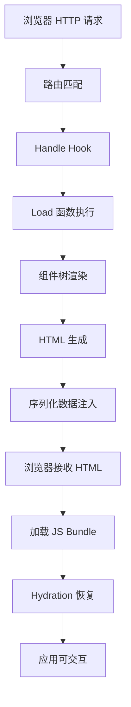
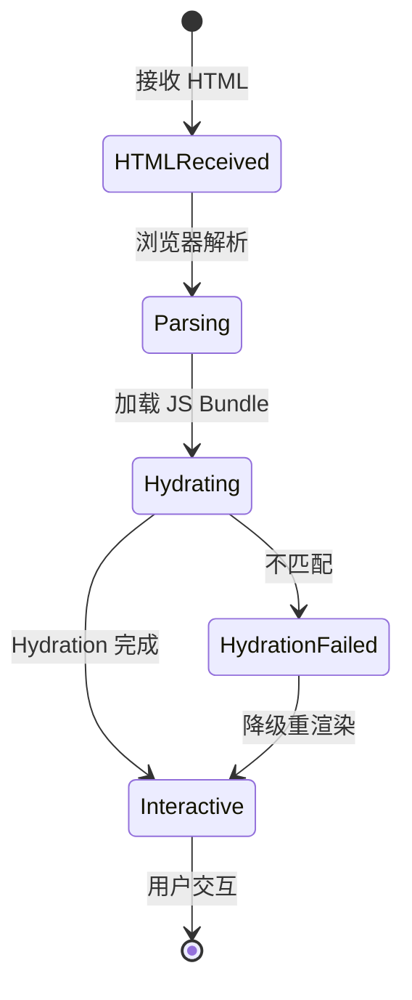
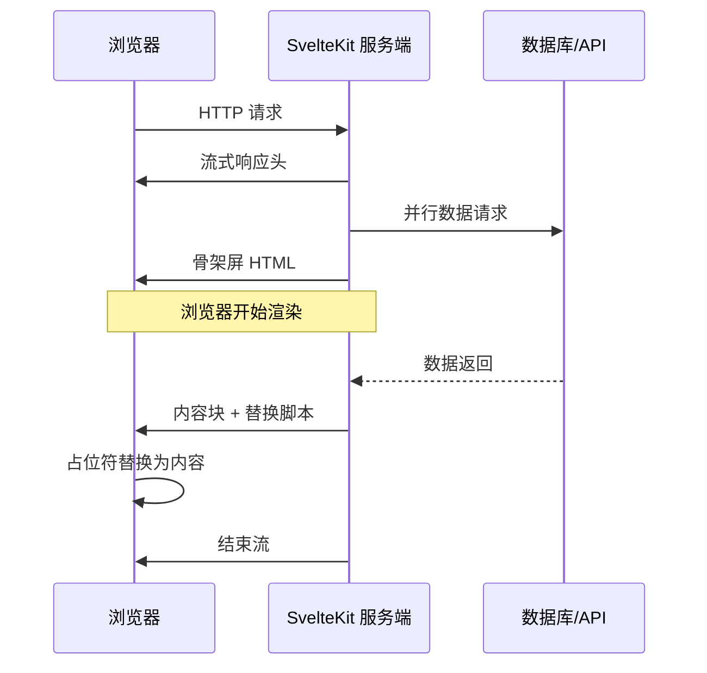

# SSR 与 Hydration 深度原理

> **阅读对象**: 已掌握 Svelte 5 Runes 基础，希望深入理解 SvelteKit 服务端渲染（SSR）内部机制、Hydration 流程与 Streaming 原理的进阶开发者。
>
> **前置知识**: Svelte 5 Runes、SvelteKit 路由系统、HTTP 基础、DOM API。

---

## 1. SSR 渲染流水线

Server-Side Rendering（SSR）是现代 Web 框架实现首屏快速加载与 SEO 友好的核心技术之一。
SvelteKit 的 SSR 流水线并非简单的"字符串拼接"，而是一个涉及路由匹配、Hook 执行、数据获取、组件树序列化、HTML 生成与客户端复活（Hydration）的完整工程体系。
理解这一流水线的每一个环节，对于诊断生产环境中的性能瓶颈、Hydration mismatch 以及内存泄漏问题至关重要。

### 1.1 完整流程图

以下是从浏览器发起请求到应用完全可交互的完整 SSR 生命周期，以 ASCII 流程图呈现：

```
浏览器 HTTP 请求
    │
    ▼
┌─────────────────────────────────────────────────────────┐
│ ① SvelteKit 路由匹配（src/routes 文件系统路由）          │
│   - 解析 URL → 匹配 +page.svelte / +layout.svelte       │
│   - 确定适用的 +page.server.ts / +page.ts               │
└─────────────────────────────────────────────────────────┘
    │
    ▼
┌─────────────────────────────────────────────────────────┐
│ ② handle hook 执行（hooks.js / hooks.server.js）        │
│   - 全局请求拦截、鉴权、日志、Cookie 处理                │
│   - 执行 sequence([auth, logger, i18n])                 │
└─────────────────────────────────────────────────────────┘
    │
    ▼
┌─────────────────────────────────────────────────────────┐
│ ③ load 函数执行（数据获取层）                            │
│   +page.server.ts  ──▶ 服务端 load（直接访问数据库/API） │
│   +page.ts         ──▶ 客户端 load（浏览器端数据获取）   │
│   返回 { props / data } 供组件消费                       │
└─────────────────────────────────────────────────────────┘
    │
    ▼
┌─────────────────────────────────────────────────────────┐
│ ④ 组件树渲染为 HTML 字符串                               │
│   - Svelte 编译器生成 SSR 渲染函数（render）              │
│   - 递归渲染 +layout.svelte → +page.svelte              │
│   - 收集所有 $state、$derived 的当前快照值               │
│   - 生成带 hydration 锚点的 HTML 字符串                  │
└─────────────────────────────────────────────────────────┘
    │
    ▼
┌─────────────────────────────────────────────────────────┐
│ ⑤ HTML 响应 + 序列化数据（`__sveltekit_data`）           │
│   - 将 load 返回的数据与组件状态序列化为 JSON             │
│   - 嵌入 `<script type="application/json">` 标签        │
│   - 插入 `__sveltekit` 启动配置（路由、assets 路径）      │
└─────────────────────────────────────────────────────────┘
    │
    ▼
浏览器接收 HTML（首屏立即显示，无需等待 JS）
    │
    ▼
加载 JavaScript bundle（通过 `<script module>` 动态导入）
    │
    ▼
┌─────────────────────────────────────────────────────────┐
│ ⑥ Hydration：客户端"复活"服务端渲染的 DOM                 │
│   - 读取 `__sveltekit_data` 反序列化状态                 │
│   - 遍历 DOM，根据编译器插入的 comment node 锚点定位组件   │
│   - 重建响应式图（reactivity graph）                      │
│   - 绑定事件监听器                                        │
│   - 注册 Effect（$effect、$effect.pre、$effect.tracking）│
└─────────────────────────────────────────────────────────┘
    │
    ▼
应用变为完全可交互（Time to Interactive，TTI）
```

**关键洞察**：步骤 ①~⑤ 在服务端（Node.js / Edge Runtime）同步完成，步骤 ⑥ 在浏览器异步执行。SSR 的核心价值在于将步骤 ⑤ 的 HTML 提前发送到浏览器，使首屏绘制（FCP）不依赖 JavaScript 的下载与执行。

### 1.2 序列化与反序列化

SvelteKit 的 SSR 不仅仅是输出 HTML 字符串，它必须解决一个根本问题：**服务端组件中的 `$state` 状态如何在客户端被精确恢复？** 这涉及 Svelte 5 的序列化器（devalue-based serializer）的深层机制。

#### 1.2.1 `$state` 的跨端传递

在 Svelte 5 中，`$state` 创建的是通过 Proxy 实现的响应式对象。服务端渲染时，这些 Proxy 的当前值需要被"冻结"并序列化为 JSON；客户端 Hydration 时，这些值需要被反序列化并重新包裹为响应式 Proxy。

```typescript
// +page.svelte（服务端与客户端共享）
<script>
  let { data } = $props();

  // 服务端渲染时 count = 42，需要传递到客户端
  let count = $state(data.initialCount);

  function increment() {
    count += 1;  // 客户端交互后重新建立响应式
  }
</script>
```

序列化后的 `__sveltekit_data` 结构如下：

```html
<script type="application/json" data-sveltekit-fetched data-url="/api/data">
  {
    "status": 200,
    "body": {
      "initialCount": 42,
      "user": {
        "name": "Alice",
        "preferences": { "theme": "dark" }
      }
    }
  }
</script>
```

**反序列化流程**：

1. 浏览器解析 HTML 时，这些 `<script>` 标签的 JSON 内容被解析为普通对象；
2. SvelteKit client router 读取 `data-sveltekit-fetched` 标记的脚本；
3. 数据被注入到 `+page.svelte` 的 `data` prop 中；
4. 当组件执行 `$state(data.initialCount)` 时，Svelte 5 runtime 将普通值重新包装为 Proxy，恢复响应式能力。

#### 1.2.2 循环引用处理

标准 `JSON.stringify` 无法处理循环引用，而 SvelteKit 使用增强版序列化器（基于 `devalue`）：

```javascript
// 服务端：对象含循环引用
const obj = { name: 'root' };
obj.self = obj;  // 循环引用

// 序列化后输出包含引用的标记格式：
// [["name","root"],["self",0]]  // 索引 0 引用自身
```

序列化器通过**引用索引表**解决循环引用：每个对象在首次出现时分配唯一索引，后续引用使用该索引而非重新序列化。这保证了复杂图结构的精确恢复。

#### 1.2.3 自定义类实例的序列化

对于 `Date`、`Map`、`Set`、`URL` 等内置对象，以及用户自定义类，SvelteKit 的序列化器支持**类型标注**：

```javascript
// 服务端 load 返回自定义类实例
class User {
  constructor(name) { this.name = name; }
  greet() { return `Hello, ${this.name}`; }
}

export function load() {
  return { user: new User('Alice') };
}
```

序列化器会将 `User` 实例序列化为带类型标记的对象：

```json
{
  "__type": "User",
  "name": "Alice"
}
```

**限制**：自定义方法（如 `greet()`）不会被序列化。Hydration 后，客户端得到的是普通对象而非真正的 `User` 实例。如果需要在客户端恢复类行为，必须：

1. 在客户端重新实例化：`new User(data.user.name)`；
2. 或使用 `structuredClone` 可序列化的 Plain Object 模式。

#### 1.2.4 `__sveltekit_data` 的数据结构

`__sveltekit_data` 并非单一对象，而是一个分层结构：

```typescript
interface SvelteKitData {
  // 路由级数据（由 +page.server.ts / +page.ts 的 load 返回）
  data: PageData;

  // 表单提交结果（+page.form / +layout.form）
  form?: ActionData;

  // 错误状态（+error.svelte 渲染时的 error 对象）
  error?: App.Error;

  // 状态快照（用于 browser back/forward 时恢复滚动位置等）
  status: number;

  // 嵌套路由的数据数组（layouts 层级）
  route: {
    id: string;
    params: Record<string, string>;
  };
}
```

这些数据通过 `render_response` 函数注入到 HTML 的 `<head>` 末尾：

```html
<head>
  <!-- ... meta, link, preload ... -->
  <script type="application/json" id="__sveltekit_data">
    {"data": {...}, "status": 200, "route": {"id": "/blog/[slug]", "params": {"slug": "ssr-internals"}}}
  </script>
</head>
```

### 1.3 SSR 中的生命周期

Svelte 组件在 SSR 环境下的生命周期与浏览器端有本质不同。理解这些差异是避免 Hydration mismatch 的前提。

#### 1.3.1 服务端生命周期特征

在服务端（Node.js / Edge Runtime），Svelte 组件的执行具有以下特征：

| 特征 | 服务端行为 | 原因 |
|------|-----------|------|
| **执行次数** | 每请求执行一次 | 无状态，请求隔离 |
| **Effect 执行** | `$effect` 完全不执行 | 服务端无 DOM，无浏览时机 |
| **$effect.pre** | 不执行 | 属于 pre-effect，依赖 DOM |
| **$effect.tracking** | 返回 `false` | 服务端不追踪依赖 |
| **DOM API** | 不可访问（`document`/`window` 为 `undefined`） | Node.js 环境无全局 DOM |
| **onMount** | 从不执行 | 只在客户端挂载后执行 |
| **tick()** | 立即 resolve（空操作） | 无 DOM 更新队列 |
| **$inspect** | 仅在服务端控制台输出 | 调试用途 |

```svelte
<script>
  import { onMount } from 'svelte';

  let element = $state();

  // ❌ SSR 时不会执行，且 element 在 SSR 时为 undefined
  onMount(() => {
    element.focus();  // 安全：只在客户端执行
  });

  // ❌ SSR 时不会执行
  $effect(() => {
    console.log('DOM updated:', element);
  });
</script>

<div bind:this={element}>内容</div>
```

#### 1.3.2 客户端 Hydration 后的状态恢复

当 HTML 到达浏览器，SvelteKit 调用 `mount` 或 `hydrate`（取决于是否为首屏）。在 Hydration 模式下：

1. **保留现有 DOM**：不重新创建 DOM 节点，而是"认领"服务端已渲染的节点；
2. **重建响应式图**：为每个 `$state`、`$derived` 重建 Signal-based 的依赖追踪图；
3. **绑定事件**：将模板中的事件处理器（`onclick`、`oninput` 等）附加到现有 DOM；
4. **执行 Effect**：首次执行所有 `$effect`、`$effect.pre`，触发可能的副作用（如数据获取、DOM 测量）。

```svelte
<script>
  let count = $state(0);  // Hydration 时从 __sveltekit_data 恢复为 0

  // Hydration 完成后首次执行
  $effect(() => {
    document.title = `Count: ${count}`;
  });
</script>

<button onclick={() => count++}>
  Clicks: {count}
</button>
```

#### 1.3.3 SSR 与 CSR 的边界条件

SvelteKit 通过 `$app/environment` 提供环境检测：

```svelte
<script>
  import { browser, building, dev } from '$app/environment';

  // browser: true 表示在浏览器环境（包括 Hydration 阶段）
  // browser: false 表示在服务端 SSR

  if (browser) {
    // 安全使用 window、document、localStorage
    const width = window.innerWidth;
  }
</script>
```

**常见陷阱**：在模块顶层（`<script>` 标签的最外层）访问浏览器 API 会导致 SSR 崩溃：

```svelte
<script>
  // ❌ SSR 时抛出 ReferenceError: window is not defined
  const token = window.localStorage.getItem('token');

  // ✅ 正确：在 $effect 或 browser 守卫中访问
  import { browser } from '$app/environment';
  let token = $state('');

  if (browser) {
    token = localStorage.getItem('token');
  }
</script>
```

---

## 2. Hydration 原理

Hydration（水合/激活）是 SSR 架构中最精妙也最容易出错的环节。它回答了一个核心问题：**服务端生成的静态 HTML，如何在客户端变成"活的"应用？** Svelte 的 Hydration 策略与传统 VDOM 框架有本质不同，它利用了编译时信息和无 Virtual DOM 的架构优势，实现了更轻量、更直接的激活机制。

### 2.1 形式化定义

> **定义（Hydration）**：Hydration 是在客户端 DOM 环境中"复活"服务端渲染输出的过程。其形式化组成包括三个核心操作：
>
> 1. **状态恢复（State Restoration）**：将服务端序列化的状态快照（`__sveltekit_data`）反序列化，重建组件级响应式状态（`$state` 的 Signal 网络）；
> 2. **事件绑定（Event Binding）**：将编译器生成的事件处理器映射到已存在的 DOM 节点，建立用户交互通道；
> 3. **Effect 注册（Effect Registration）**：注册所有 `$effect`、`$effect.pre`、`$effect.tracking`，使副作用机制在客户端生效。

与"重新渲染"（Re-render）不同，Hydration 的核心约束是**保留现有 DOM 结构**。这意味着：

- 不能销毁并重建 DOM 节点（否则失去 SSR 的首屏优势）；
- 不能修改已渲染节点的文本内容（除非状态已变化）；
- 必须在现有 DOM 树上"嫁接"响应式能力。

### 2.2 Svelte 的 Hydration 策略

#### 2.2.1 Progressive Enhancement（渐进增强）

SvelteKit 的设计哲学将 SSR 视为**基线体验**而非**优化手段**。即使 JavaScript 加载失败或被禁用，用户仍然能看到完整内容并能通过原生 `<form>` 提交实现基本交互。这种"无 JS 也能工作"的模式称为 Progressive Enhancement。

```svelte
<!-- 即使 hydration 失败，表单仍然可以提交到服务端处理 -->
<form method="POST" action="?/createPost">
  <input name="title" required />
  <button type="submit">发布</button>
</form>
```

服务端 `+page.server.ts` 的 `actions` 会处理这个表单，无需任何客户端 JavaScript。Hydration 成功后，表单可以被增强为 AJAX 提交（通过 `use:enhance`）。

#### 2.2.2 无 VDOM diff 的直接绑定

React 的 Hydration 基于 Virtual DOM diff：服务端渲染的 HTML 被当作"初始真实 DOM"，客户端重新执行 render 生成 VDOM，然后与真实 DOM 进行 diff，确认一致后绑定事件。这种方式的问题是：

- **双重计算**：服务端已经做过一次渲染，客户端还要重新生成 VDOM；
- **mismatch 敏感性**：任何服务端/客户端渲染差异都会导致 hydrateRoot 报错；
- **体积开销**：需要携带完整的 VDOM 运行时。

Svelte 的 Hydration 完全不同。由于 Svelte 是**编译时框架**，编译器在构建阶段已经知道：

- 每个动态表达式对应 DOM 的哪个节点；
- 每个事件处理器应该绑定到哪个元素；
- 每个组件的边界在哪里。

因此，Svelte 的 Hydration 是**直接绑定（Direct Binding）**：编译器生成精确的指令，指导 runtime 直接在现有 DOM 节点上建立状态连接，无需 diff。

#### 2.2.3 编译器生成的 Hydration 锚点（Comment Node）

这是 Svelte Hydration 机制的核心实现细节。编译器在生成 SSR 输出时，会插入特殊的 HTML comment 作为"锚点"，客户端 Hydration 通过这些锚点精确定位组件边界和动态内容插槽。

```svelte
<!-- 源码：一个简单的条件渲染组件 -->
<script>
  let show = $state(true);
</script>

{#if show}
  <p>Visible content</p>
{:else}
  <p>Hidden content</p>
{/if}
<button onclick={() => show = !show}>Toggle</button>
```

**编译器生成的服务端渲染代码（简化）**：

```javascript
// SSR render function (compiled)
function render($$payload, $$props) {
  let show = $$props.show ?? true;

  // 插入 hydration 锚点 comment
  $$payload.out += `<!--[-->`;

  if (show) {
    $$payload.out += `<p>Visible content</p>`;
  } else {
    $$payload.out += `<p>Hidden content</p>`;
  }

  $$payload.out += `<!--]-->`;
  $$payload.out += `<button>Toggle</button>`;
}
```

**服务端实际输出的 HTML**：

```html
<!--[-->
<p>Visible content</p>
<!--]-->
<button>Toggle</button>
```

注意 `<!--[-->` 和 `<!--]-->` 这对 comment node。它们在浏览器渲染时不可见，但会被 DOM API 保留。

**编译器生成的客户端 Hydration 代码（简化）**：

```javascript
// Client hydration function (compiled)
function hydrate(target, $$props) {
  // 1. 定位锚点：找到 <!--[--> 和 <!--]-->
  const anchor = locate_anchor(target);

  // 2. 恢复状态
  let show = $.state($$props.show ?? true);

  // 3. 根据锚点认领现有 DOM
  const if_block = $.if(
    anchor,
    () => show.v,  // 读取 signal 值
    ($$render) => {
      if ($$render) {
        $$render.out += `<p>Visible content</p>`;
      } else {
        $$render.out += `<p>Hidden content</p>`;
      }
    }
  );

  // 4. 定位 button 并绑定事件
  const button = locate_next_sibling(anchor, 'BUTTON');
  $.event('click', button, () => {
    show.v = !show.v;
  });

  // 5. 注册 effect（如有）
  $.effect(() => {
    // 副作用逻辑
  });
}
```

**锚点系统的精妙之处**：

- Comment node 是 DOM 的标准节点类型，不影响视觉渲染；
- 它们不会被浏览器的 HTML 解析器优化掉（不像空白文本节点）；
- 编译器可以通过锚点的层级结构精确定位每个动态区块；
- 即使 `{#if}`、`{#each}` 嵌套多层，锚点也能维持正确的树形关系。

### 2.3 源码 → 服务端输出 → 客户端 Hydration 的完整对比

让我们通过一个更复杂的示例，展示三阶段的完整对应关系。

#### 阶段一：开发者源码

```svelte
<!-- +page.svelte -->
<script>
  let { data } = $props();

  let items = $state(data.items);
  let filter = $state('all');

  let filtered = $derived(
    filter === 'all'
      ? items
      : items.filter(item => item.category === filter)
  );

  function addItem(name) {
    items = [...items, { name, category: 'new' }];
  }
</script>

<h1>Item List</h1>

<div class="filters">
  <button onclick={() => filter = 'all'}>All</button>
  <button onclick={() => filter = 'active'}>Active</button>
</div>

{#if filtered.length > 0}
  <ul>
    {#each filtered as item (item.name)}
      <li class={item.category}>{item.name}</li>
    {/each}
  </ul>
{:else}
  <p>No items found</p>
{/if}

<button onclick={() => addItem('New Item')}>Add</button>
```

#### 阶段二：服务端渲染输出（HTML + 序列化数据）

```html
<!DOCTYPE html>
<html>
<head>
  <script type="application/json" id="__sveltekit_data">
    {"data":{"items":[{"name":"Item A","category":"active"},{"name":"Item B","category":"done"}]}}
  </script>
</head>
<body>
  <div id="svelte">
    <h1>Item List</h1>
    <div class="filters">
      <button>All</button>
      <button>Active</button>
    </div>
    <!--[-->  <!-- {#if} 锚点 -->
      <ul>
        <!--[-->  <!-- {#each} 锚点 -->
          <li class="active">Item A</li>
        <!--]-->
        <!--[-->
          <li class="done">Item B</li>
        <!--]-->
      </ul>
    <!--]-->
    <button>Add</button>
  </div>
  <script type="module" src="/app.js"></script>
</body>
</html>
```

注意 `{#each}` 块为每个 item 生成了独立的锚点对 `<!--[-->` / `<!--]-->`。这是 Svelte 实现 keyed each 块高效更新的基础——每个锚点对应一个独立的响应式边界。

#### 阶段三：客户端 Hydration 过程

```javascript
// 简化后的编译器输出（Svelte 5 internal runtime 风格）
import * as $ from 'svelte/internal/client';

export function hydrate(node, $$props) {
  // ==================== 状态恢复 ====================
  let items = $.source($$props.data.items);      // $state  → source(signal)
  let filter = $.source('all');                  // $state  → source

  // $derived → 创建 computed signal
  let filtered = $.derived(() =>
    filter.v === 'all' ? items.v : items.v.filter(i => i.category === filter.v)
  );

  // ==================== DOM 认领 ====================
  const h1 = $.child(node);                      // <h1>
  const filters_div = $.sibling(h1, 2);          // <div class="filters">
  const btn_all = $.child(filters_div);          // <button>All</button>
  const btn_active = $.sibling(btn_all);         // <button>Active</button>

  // {#if} 锚点定位
  const if_anchor = $.sibling(filters_div, 2);   // <!--[-->

  // ==================== 响应式绑定 ====================
  // if 块：根据 filtered.length 控制显隐
  $.if(if_anchor, () => filtered.v.length > 0, ($$anchor) => {
    // 正分支：显示列表
    const ul = $.child($$anchor);
    const each_anchor = $.child(ul);             // <!--[-->

    // {#each} 块：建立 keyed 迭代
    $.each(each_anchor, () => filtered.v,
      (item) => item.name,  // key function
      ($$anchor, item) => {
        const li = $.child($$anchor);
        // 动态 class 绑定
        $.class(li, 'category', () => item.v.category);
        // 文本节点
        $.text(li, () => item.v.name);
      }
    );
  }, ($$anchor) => {
    // else 分支：显示 "No items found"
    $.text($$anchor, 'No items found');
  });

  // ==================== 事件绑定 ====================
  $.event('click', btn_all, () => { filter.v = 'all'; });
  $.event('click', btn_active, () => { filter.v = 'active'; });

  const btn_add = $.sibling(if_anchor, 2);       // <button>Add</button>
  $.event('click', btn_add, () => {
    items.v = [...items.v, { name: 'New Item', category: 'new' }];
  });

  // ==================== Effect 注册 ====================
  // $derived 已被注册为 computed，无需额外 effect
  // 如有 $effect，在此注册
}
```

**关键洞察**：整个 Hydration 过程中，**没有创建任何新的 DOM 节点**（除了可能的 comment 修复）。所有操作都是在现有 DOM 上建立"神经连接"——状态变化时直接驱动已存在的节点更新。

### 2.4 与 React Hydration 的深度对比

| 维度 | SvelteKit | Next.js (React) |
|------|-----------|-----------------|
| **Hydration 方式** | 直接绑定（Direct Binding）：编译器生成精确指令，直接在现有 DOM 上建立状态连接 | VDOM diff：客户端重新生成 Virtual DOM，与真实 DOM 进行树级对比 |
| **运行时体积** | 极小：无 VDOM 运行时，hydration 代码与组件逻辑打包在一起 | 较大：需携带 React core + reconciler |
| **失败恢复** | 优雅降级：hydration 失败时组件静默重新创建，应用继续工作 | `hydrateRoot` 抛出致命错误，可能导致整棵树崩溃 |
| **选择性 Hydration** | Islands 架构（实验性）：通过 `data-sveltekit-reload` 或第三方实现标记部分区域不 hydrate | Server Components：RSC 不 hydrate，Client Components 选择性 hydrate |
| **水合错误检测** | 编译时为主：编译器确保服务端/客户端生成相同锚点结构；运行时检测 DOM 不匹配 | 运行时为主：`hydrateRoot` 对比 SSR HTML 与客户端首屏 render 输出 |
| **状态恢复机制** | Signal 网络重建：从 `__sveltekit_data` 恢复值，重新包装为 Proxy | 双缓冲：useState/useReducer 从 `__REACT__` 全局恢复，reconcile 到 VDOM |
| **事件绑定时机** | 批量绑定：hydration 遍历完成后统一附加事件委托 | 渐进绑定：事件委托在 reconciliation 过程中逐步建立 |
| **Effect 执行时机** | Hydration 完成后统一执行所有 $effect | useEffect 在 commit 阶段异步执行（可能分多批次） |
| **Streaming 支持** | 原生支持：await 块自动流式输出 | Suspense + `renderToReadableStream`：需要显式边界 |

**选择建议**：

- 如果项目对首屏性能极度敏感（如内容型站点、电商详情页），SvelteKit 的轻量 Hydration 更有优势；
- 如果团队熟悉 React 生态且需要大量第三方组件库，Next.js 的 RSC 架构提供了更细粒度的 hydrate 控制。

---

## 3. Streaming SSR

Streaming SSR（流式服务端渲染）是 SSR 的进化形态。传统 SSR 要求服务端**完全完成**渲染后才能发送首字节（TTFB 受限于最慢的数据源）；Streaming SSR 允许服务端在数据准备就绪时**分段发送** HTML，浏览器可以渐进式渲染，显著改善感知性能。

### 3.1 工作原理

#### 3.1.1 渐进式 HTML 流

传统 SSR 的响应模式：

```
服务端: [等待所有数据] → [渲染完整 HTML] → [一次性发送]
客户端: [等待...] → [接收完整 HTML] → [渲染首屏]
```

Streaming SSR 的响应模式：

```
服务端: [发送 <head> + 布局 shell]
     → [等待数据源 A] → [发送 A 对应的 HTML 片段]
     → [等待数据源 B] → [发送 B 对应的 HTML 片段]
     → [发送 </body></html>]
客户端: [接收 <head>] → [渲染静态骨架]
     → [接收片段 A] → [增量渲染 A]
     → [接收片段 B] → [增量渲染 B]
```

HTTP/1.1 通过 `Transfer-Encoding: chunked` 支持分块传输；HTTP/2 通过多路复用（multiplexing）实现更高效的流式传输。SvelteKit 的 Streaming SSR 基于标准的 Web Streams API（`ReadableStream`），兼容现代 Edge Runtime 和 Node.js 环境。

#### 3.1.2 Suspense 边界

Suspense 边界定义了"可延迟渲染"的作用域。在边界内部的异步数据可以：

- 先显示 fallback UI（占位符）；
- 待数据就绪后，自动替换为真实内容。

在 SvelteKit 中，Suspense 边界通过 `{#await}` 块隐式实现：

```svelte
<!-- Streaming 边界：{#await} 内部是独立的流式区块 -->
{#await fetchComments(postId)}
  <p>Loading comments...</p>  <!-- fallback / 占位符 -->
{:then comments}
  <CommentList {comments} />   <!-- 真实内容 -->
{:catch error}
  <ErrorMessage {error} />     <!-- 错误边界 -->
{/await}
```

#### 3.1.3 占位符 → 内容替换机制

服务端发送的 HTML 流中，异步区块的占位符和内容不会同时存在。SvelteKit 使用一种巧妙的**内联替换**策略：

```html
<!-- 第一次 flush：发送骨架和占位符 -->
<div class="comments-section">
  <template id="svelte-abc123">  <!-- 占位符标记 -->
    <p>Loading comments...</p>
  </template>
</div>

<!-- 第二次 flush：数据就绪后发送替换脚本 -->
<script>
  (function() {
    const template = document.getElementById('svelte-abc123');
    const parent = template.parentNode;
    // 将模板内容替换为真实 HTML
    parent.innerHTML = `<ul><li>Comment 1</li><li>Comment 2</li></ul>`;
  })();
</script>
```

实际上，SvelteKit 使用的是更精细的**DOM 替换**而非粗暴的 `innerHTML`，以保证与客户端 Hydration 的兼容性。每个流式区块有独立的 hydration 锚点，客户端激活时能正确识别这些动态插入的内容。

### 3.2 SvelteKit 实现

#### 3.2.1 `await` 块的流式处理

SvelteKit 的 `{#await}` 在 SSR 模式下会自动启用 Streaming：

```typescript
// +page.svelte
<script>
  let { data } = $props();
  // data.streamed 是一个 Promise，在服务端延迟解析
</script>

<h1>{data.title}</h1>  <!-- 同步渲染，立即发送 -->

{#await data.streamed.comments}
  <CommentsSkeleton />  <!-- 立即发送占位符 -->
{:then comments}
  <Comments {comments} />  <!-- 异步数据就绪后流式发送 -->
{/await}
```

```typescript
// +page.server.ts
export async function load() {
  return {
    title: 'Blog Post',           // 同步数据：包含在首次 flush 中
    streamed: {
      // 将 Promise 放入 streamed，SvelteKit 会自动流式处理
      comments: fetchComments()   // 异步数据：后续 flush
    }
  };
}
```

**关键规则**：只有嵌套在 `streamed` 对象内的 Promise 才会触发 Streaming。直接返回的 Promise（如 `return { comments: fetchComments() }`）会导致服务端 `await` 全部完成后再发送响应，失去流式能力。

#### 3.2.2 错误边界（`+error.svelte`）

流式区块中的错误不会导致整个页面 500。SvelteKit 的错误边界机制：

```svelte
{#await data.streamed.riskyData}
  <Loading />
{:then data}
  <RiskyComponent {data} />
{:catch error}
  <!-- 局部错误，只影响这个区块 -->
  <div class="error-banner">
    <p>Failed to load: {error.message}</p>
    <button onclick={() => location.reload()}>Retry</button>
  </div>
{/await}
```

如果 `riskyData` Promise reject，SvelteKit 会在流中发送错误对应的 fallback HTML，并确保客户端 Hydration 时正确捕获这个错误状态。

#### 3.2.3 流式响应的 HTTP 特征

一个 Streaming SSR 响应的 HTTP 头特征：

```http
HTTP/2 200 OK
Content-Type: text/html; charset=utf-8
Transfer-Encoding: chunked        <!-- HTTP/1.1 分块传输 -->
<!-- 或 HTTP/2 无需显式声明，默认多路复用 -->
X-Sveltekit-Page: true
Cache-Control: private, no-store   <!-- 流式响应通常不可缓存 -->
```

**注意**：流式响应通常不应被 CDN 或浏览器缓存，因为每个用户看到的内容可能不同（取决于异步数据的返回速度）。如需缓存，应仅缓存同步部分（shell），通过 Service Worker 或 Edge Side Includes（ESI）实现。

### 3.3 与 Next.js Streaming 对比

| 维度 | SvelteKit Streaming | Next.js Streaming |
|------|---------------------|-------------------|
| **API 形式** | `{#await}` 块 + `streamed` 对象，声明式 | `<Suspense>` 组件 + `loading.js`，基于 React 约定 |
| **实现层次** | 框架层（SvelteKit 内置） | 运行时层（React Suspense + `react-server-dom`） |
| **错误处理** | `{:catch}` 局部捕获，或 `+error.svelte` 全局捕获 | `error.js` 边界，或 `use` hook 的 try/catch |
| **与 RSC 集成** | 不涉及 RSC，所有组件均可参与 Streaming | RSC 不 hydrate，流式主要服务于 Client Component 的 Suspense |
| **占位符机制** | 编译器生成 `<template>` 占位符 + 替换脚本 | React 发送内联 JSON + `bootstrapScripts` 驱动替换 |
| **兼容性** | 依赖 Web Streams API（现代运行时） | 依赖 React 18+ Streams + Node.js 18+ |
| **可缓存性** | 同步 shell 可缓存，流式部分不可缓存 | 相同限制，RSC payload 可缓存但需复杂配置 |
| **调试体验** | 直观：`{#await}` 块清晰可见 | 抽象：Suspense 边界在组件树中，需 DevTools 定位 |

**SvelteKit Streaming 的优势**：

- 零配置：只需将 Promise 放入 `streamed` 对象即可启用；
- 语义清晰：`{#await}` 块的 `{:then}` / `{:catch}` 分支一目了然；
- 无额外运行时：Streaming 逻辑集成在 SvelteKit 的渲染流水线中，不增加 bundle 体积。

---

## 4. 常见 SSR 问题诊断

生产环境中的 SSR 问题往往具有隐蔽性：它们在开发环境难以复现，在服务端日志中表现为零散的错误片段，在客户端则导致闪烁、崩溃或交互失效。本节系统化梳理 SvelteKit SSR 中最常见的问题模式，提供症状识别、根因分析与解决方案。

### 4.1 问题诊断速查表

| 问题 | 症状 | 根因分析 | 解决方案 |
|------|------|---------|---------|
| **Hydration mismatch** | 浏览器控制台出现黄色警告：`The server did not finish this Suspense boundary` 或 `Hydration failed because the initial UI does not match` | 服务端与客户端对同一组件生成了不同的 HTML 结构。常见诱因：① 使用了 `Math.random()` / `Date.now()` / `crypto.randomUUID()` 等非确定性值；② 服务端与客户端的 `Intl` 时区/语言设置不同；③ 条件渲染依赖了 `window` / `document` 是否存在；④ `{#each}` 遍历未 key 的数组且顺序在两端不一致 | ① 将随机/时间逻辑移入 `$effect` 或 `onMount`；② 统一使用 `+page.server.ts` 返回确定性数据；③ 使用 `$app/environment` 的 `browser` 标志隔离浏览器 API；④ 为 `{#each}` 提供稳定的 `key` |
| **服务端访问 `window` / `document`** | 服务端抛出 `ReferenceError: window is not defined`，返回 500 错误，页面完全无法渲染 | 服务端 Node.js / Edge Runtime 没有全局 DOM API。常见于：① 第三方库在模块初始化时访问 `window`；② 组件顶层直接调用 `document.querySelector`；③ `localStorage` / `sessionStorage` 在 `<script>` 顶层使用 | ① 使用 `$app/environment` 的 `browser` 守卫；② 将 DOM 操作封装在 `onMount` 或 `$effect` 中；③ 对第三方库使用动态导入 `import('lib')` 并在 `browser` 条件下执行；④ 使用 `vite-plugin-top-level-await` 时确保不依赖 DOM |
| **数据闪烁（Flash of Empty State）** | 页面先显示空列表 / 空表单 / loading 占位符，短暂空白后突然跳变为有数据状态 | `load` 函数返回的数据未正确传递到组件，或客户端重复执行了数据获取。常见于：① `+page.ts`（客户端 load）与 `+page.server.ts`（服务端 load）同时存在且返回不同结构；② `data` prop 解构错误；③ Streaming 数据未使用 `streamed` 包装导致客户端等待 | ① 检查 `+page.server.ts` 的 `load` 返回值是否被 `+page.svelte` 正确消费；② 统一使用 `$props()` 接收 `data`，避免手动解构遗漏；③ 对异步数据使用 `streamed` 对象启用 Streaming，减少感知延迟；④ 在 `+page.ts` 中使用 `await parent()` 确保父级数据已加载 |
| **服务端内存泄漏** | Node.js 进程内存持续增长，最终触发 OOM（Out Of Memory）崩溃，需定期重启服务 | 服务端每个请求都创建新的状态引用，但这些引用在请求结束后未被垃圾回收。常见于：① 模块级（`<script>` 顶层）声明了 `$state`，该状态在模块缓存中持久存在，随请求累积；② 全局 EventEmitter / WebSocket 连接未清理；③ `load` 函数中创建了未关闭的数据库连接或文件句柄 | ① **绝不在模块级使用 `$state`**——所有状态应在组件实例或 `load` 函数内创建；② 使用 `EventTarget` 或 `AbortController` 在请求结束时清理监听器；③ `load` 函数中使用 `try/finally` 确保资源释放；④ 启用 Node.js `--inspect` + Chrome DevTools Heap Snapshot 定位泄漏源 |
| **样式闪烁（FOUC / FOUT）** | 页面内容在 JS 加载前无样式或显示默认字体，JS 激活后突然跳变为正确样式 | CSS 未内联到 HTML 中，而是通过 JavaScript 动态注入（如 CSS-in-JS），或 `<link rel="stylesheet">` 放置在 `<body>` 底部。SSR 的 HTML 到达时，浏览器尚未获取 CSS 文件 | ① 使用 `svelte-preprocess` + `scss` / `less` 将样式编译为 `<style>` 块内联到组件中；② 确保关键 CSS 通过 `<link>` 放在 `<head>` 中，并使用 `rel="preload"`；③ 避免在 SvelteKit 中使用运行时 CSS-in-JS（如 `styled-components`）；④ 如需全局样式，使用 `app.html` 中的 `%sveltekit.head%` 注入 |
| **客户端状态丢失（硬刷新后）** | 用户点击浏览器刷新后，页面回到初始状态，表单填写内容丢失 | SSR 重新执行服务端 `load`，组件状态被重置为服务端返回值。`$state` 仅在客户端内存中存续，刷新即销毁 | ① 对持久化状态使用 `localStorage` / `sessionStorage` 并在 `$effect` 中同步；② 表单使用 `enhance` + `action` 将数据提交到服务端存储；③ 使用 URL query params 保存可共享的状态；④ 对复杂状态，考虑 `+page.ts` 的 `load` 从 `localStorage` 恢复 |
| **Streaming 区块永不替换** | 页面显示 "Loading..." 占位符后不再更新，网络面板显示连接已关闭 | `streamed` 中的 Promise 未正确 resolve 或 reject，导致服务端流提前关闭而替换脚本未发送。常见于：① `load` 函数中未 `await` 的 Promise 异常被吞没；② 数据库连接池耗尽导致查询挂起；③ Edge Runtime 的超时限制（如 Cloudflare Workers 50ms / 10s CPU） | ① 为所有 `streamed` Promise 添加 `.catch()` 或 `try/catch` 确保至少 reject；② 设置数据库查询超时；③ 监控 Edge Runtime 的 CPU 时间限制，将重逻辑移至服务端 load；④ 使用 Sentry / Datadog 追踪未处理的 Promise rejection |
| **预渲染（Prerender）与 SSR 冲突** | 构建时 `prerender` 生成静态 HTML，但访问时仍执行服务端 `load`，或静态文件与动态路由 404 冲突 | `prerender` 配置与动态路由参数不匹配，或 `handle` hook 在静态构建时执行了浏览器 API。常见于：① `+page.server.ts` 存在而 `+page.ts` 声明了 `export const prerender = true`；② `[slug]` 动态路由未提供 `entries` 函数生成所有可能路径 | ① 对纯静态页面使用 `+page.ts` + `export const prerender = true`；② 对动态路由，在 `+page.server.ts` 旁创建 `+page.ts` 导出 `entries()` 返回所有有效 slug；③ 使用 `adapter-static` 时确保所有动态路由都有对应的预渲染入口；④ `handle` hook 中使用 `building` 标志（`$app/environment`）隔离构建时逻辑 |

### 4.2 深度诊断：Hydration Mismatch 的排查流程

Hydration mismatch 是最常见也最棘手的 SSR 问题。以下是系统化的排查流程：

```
发现控制台 hydration 警告
    │
    ▼
① 比较服务端 HTML 与客户端首次渲染的 DOM
    - Chrome DevTools → Elements 面板 → 查看源码
    - 或 curl 请求页面，对比 `<div id="svelte">` 内部结构
    │
    ├── 结构完全一致？→ 可能是状态值不一致
    │   └─ 检查 __sveltekit_data 中的值与客户端初始值是否相同
    │
    └── 结构不一致？→ 定位差异节点
        │
        ▼
② 检查差异是否由以下条件引起：
    ├─ 时间/随机值？
    │   └─ 将 new Date() / Math.random() 移入 $effect
    │
    ├─ 浏览器 API？
    │   └─ 检查 $app/environment 的 browser 标志使用
    │
    ├─ 用户代理（User-Agent）相关逻辑？
    │   └─ 服务端 load 中不应依赖 request.headers.get('user-agent') 做渲染决策
    │      （除非通过 handle hook 统一处理并序列化到 data）
    │
    ├─ 语言/时区/国际化？
    │   └─ 确保服务端与客户端使用相同的 locale 和时区设置
    │      （建议在 handle hook 中解析 accept-language 并注入 data）
    │
    └─ 第三方组件库？
        └─ 检查组件是否在 SSR 时生成不同的 class/id/内联样式
           （常见于图表库、地图库、富文本编辑器）
            └─ 解决：用 {browser} 条件包裹，或使用 {@html} 配合 ssr="false"
```

**开发者工具技巧**：

- Chrome DevTools 的 **Rendering → Paint flashing** 可直观看到 Hydration 后的重绘区域；
- Svelte DevTools 浏览器扩展可查看组件树与 Signal 依赖图；
- 在 `vite.config.ts` 中启用 `ssr.noExternal: ['svelte']` 以便调试 Svelte 运行时。

### 4.3 服务端调试与日志

SSR 错误发生在服务端，浏览器看不到完整堆栈。建议配置：

```typescript
// hooks.server.ts
import type { HandleServerError } from '@sveltejs/kit';

export const handleError: HandleServerError = ({ error, event, status, message }) => {
  // 将错误发送到监控系统（Sentry / LogRocket / 自建）
  console.error(`[SSR Error ${status}] ${event.request.url}`, error);

  return {
    message: dev ? message : 'Internal Server Error',
    // 仅在开发环境暴露原始错误
    stack: dev ? (error as Error).stack : undefined
  };
};
```

```typescript
// +page.server.ts
export async function load({ fetch, url }) {
  const start = performance.now();

  try {
    const data = await fetch('/api/data').then(r => r.json());
    return { data };
  } catch (error) {
    // 明确抛出，让 handleError 捕获
    console.error(`[Load Error] ${url.pathname}:`, error);
    throw error;
  } finally {
    console.log(`[Load Timing] ${url.pathname}: ${(performance.now() - start).toFixed(2)}ms`);
  }
}
```

---

## 5. SSR 性能优化

SSR 的性能优化需要同时关注服务端（减少 TTFB）、网络（减少传输量）和客户端（减少 Hydration 时间）三个维度。

### 5.1 缓存策略

#### 5.1.1 HTTP 缓存头

```typescript
// +page.server.ts
export async function load({ setHeaders }) {
  // 对不常变化的数据启用 CDN 缓存
  setHeaders({
    'Cache-Control': 'public, max-age=60, s-maxage=300',
    // max-age: 浏览器缓存 60 秒
    // s-maxage: CDN / 共享缓存 300 秒
    'Vary': 'Accept-Encoding'
  });

  return { posts: await getPosts() };
}
```

#### 5.1.2 SvelteKit 的 `cache` API

```typescript
// +page.server.ts
export async function load({ url, fetch, setHeaders }) {
  // 利用 fetch 的 Response 缓存（需适配器支持，如 Cloudflare）
  const response = await fetch('/api/posts', {
    cf: { cacheTtl: 300, cacheEverything: true }
  });

  return { posts: await response.json() };
}
```

#### 5.1.3 服务端数据缓存

```typescript
// lib/cache.ts
const cache = new Map<string, { data: unknown; expiry: number }>();

export async function cached<T>(key: string, ttl: number, fetcher: () => Promise<T>): Promise<T> {
  const hit = cache.get(key);
  if (hit && hit.expiry > Date.now()) {
    return hit.data as T;
  }

  const data = await fetcher();
  cache.set(key, { data, expiry: Date.now() + ttl });
  return data;
}

// +page.server.ts
import { cached } from '$lib/cache';

export async function load() {
  const posts = await cached('posts', 60_000, () => db.query('SELECT * FROM posts'));
  return { posts };
}
```

**警告**：服务端内存缓存仅在单实例运行时有效。如果使用多进程（Node.js cluster）或多副本（Kubernetes），需改用 Redis 或 Memcached 等分布式缓存。

### 5.2 选择性 Hydration

不是所有页面内容都需要立即激活。SvelteKit 支持通过配置或约定实现选择性 Hydration：

```svelte
<!-- 方式一：使用 {@html} 渲染纯静态内容，不建立响应式连接 -->
<script>
  let { data } = $props();
</script>

<!-- 这段内容会被 SSR 输出，但客户端不会 hydrate 其内部 -->
<article>
  {@html data.articleBody}
</article>

<!-- 方式二：组件级选择性 hydrate（实验性 Islands 架构）-->
<!-- 通过第三方适配器（如 sveltekit-islands）实现 -->
<Island component={HeavyChart} props={data.chart} />
<!-- HeavyChart 组件仅在进入视口时才 hydrate，减少初始激活时间 -->
```

**自实现懒加载 Hydration**：

```svelte
<!-- LazyHydrate.svelte -->
<script>
  import { browser } from '$app/environment';

  let { children } = $props();
  let shouldHydrate = $state(false);
  let container = $state();

  $effect(() => {
    if (!container || shouldHydrate) return;

    const observer = new IntersectionObserver(
      ([entry]) => {
        if (entry.isIntersecting) {
          shouldHydrate = true;
          observer.disconnect();
        }
      },
      { rootMargin: '100px' }  // 提前 100px 开始 hydrate
    );

    observer.observe(container);
    return () => observer.disconnect();
  });
</script>

<div bind:this={container}>
  {#if browser && shouldHydrate}
    {@render children()}
  {:else}
    <!-- SSR 渲染的内容保留，但不激活 -->
    <noscript>{@render children()}</noscript>
  {/if}
</div>
```

### 5.3 预渲染（Prerender）

对于不依赖用户身份、不常变化的内容，预渲染是最佳性能策略：

```typescript
// +page.ts
export const prerender = true;  // 构建时生成静态 HTML

// 或条件预渲染
export const prerender = 'auto';  // SvelteKit 自动判断
```

```typescript
// +page.ts（动态路由预渲染）
export const prerender = true;

// 告诉 SvelteKit 所有可能的 slug
export async function entries() {
  const posts = await fetchAllPosts();
  return posts.map(post => ({ slug: post.slug }));
}
```

**预渲染 vs SSR 的选择矩阵**：

| 场景 | 推荐策略 | 原因 |
|------|---------|------|
| 博客文章、文档页 | `prerender = true` | 内容静态，SEO 要求高，CDN 可完全缓存 |
| 用户仪表盘、后台管理 | `ssr = false` | 高度个性化，SSR 无意义，纯 CSR 即可 |
| 电商商品详情页 | `prerender` 或 SSR + 边缘缓存 | 需要 SEO，但库存/价格需动态更新 |
| 社交网络动态流 | SSR + Streaming | 实时性要求高，数据量大，需渐进加载 |
| 营销落地页 | `prerender = true` + `ssr = false` | 极致首屏速度，无交互复杂度 |

### 5.4 Bundle 体积优化

Hydration 的性能直接受 JavaScript bundle 体积影响：

```javascript
// vite.config.ts
import { sveltekit } from '@sveltejs/kit/vite';
import { defineConfig } from 'vite';
import { visualizer } from 'rollup-plugin-visualizer';

export default defineConfig({
  plugins: [
    sveltekit(),
    visualizer({ open: true, gzipSize: true })  // 分析 bundle 体积
  ],
  build: {
    // 代码分割：按路由自动拆包
    rollupOptions: {
      output: {
        manualChunks: {
          // 将大型第三方库拆分为独立 chunk
          chart: ['chart.js'],
          editor: ['@tiptap/core', '@tiptap/starter-kit']
        }
      }
    }
  },
  ssr: {
    // 确保 SSR 时不打包不必要的浏览器 polyfill
    noExternal: ['svelte']
  }
});
```

**Svelte 5 的运行时体积优势**：

- Svelte 5 的响应式运行时（Signal + effect）gzip 后约 **3.5KB**；
- React 18 core + reconciler gzip 后约 **40KB+**；
- 这意味着 SvelteKit 的 Hydration bundle 天然更小，TTI（Time to Interactive）更短。

---

---

### 🧩 反直觉案例: `localeCompare` 排序差异导致 Hydration Mismatch

**直觉预期**: "同样的代码、同样的数据，服务端和客户端渲染结果必然一致"

**实际行为**: Node.js 与浏览器的默认 `localeCompare` 排序规则可能不同，导致列表顺序不一致，Hydration 静默失败或重新渲染

**代码演示**:

```svelte
<script>
  let files = $state(['file10.txt', 'file1.txt', 'file2.txt']);
</script>
<ul>
  {#each files.sort((a, b) => a.localeCompare(b)) as f}
    <li>{f}</li>
  {/each}
</ul>
```

**为什么会这样？**
不同运行时的 ICU/Collation 默认选项存在差异（如 `numeric` 敏感度）。服务端排好的顺序到客户端可能被重新排列，Hydration 发现 DOM 节点序列不匹配，只能回退到客户端重渲染，失去 SSR 的首屏优势。

**教训**
> 所有依赖环境语义的计算（排序、格式化、随机数）应在 `$effect` 或 `onMount` 中执行，或通过 `+page.server.ts` 返回确定性数据。

## 总结

SvelteKit 的 SSR 与 Hydration 机制体现了"编译时优化"哲学的极致：

1. **SSR 流水线**通过编译器生成的精确渲染函数，将组件树高效转换为 HTML，同时序列化状态为 `__sveltekit_data`；
2. **Hydration**利用 comment node 锚点实现无 VDOM 的直接绑定，以最小的运行时开销"复活"服务端渲染的 DOM；
3. **Streaming SSR**通过 `streamed` 对象和 `{#await}` 块实现渐进式内容交付，改善感知性能；
4. **问题诊断**需要理解服务端与客户端的生命周期差异，善用 `browser` 标志和锚点系统定位 mismatch；
5. **性能优化**应在缓存策略、选择性 Hydration 与预渲染之间找到适合业务场景的均衡点。

理解这些原理后，开发者不仅能高效解决 SSR 相关问题，还能在设计阶段做出正确的架构决策——何时使用 SSR、何时使用 Streaming、何时使用 Prerender——从而构建出既快又稳的 SvelteKit 应用。

---

## 可视化图表

### SSR 渲染流水线

SvelteKit 服务端渲染的完整 8 阶段流程：



**解读**: 前 6 个阶段在服务端完成，生成带有 `__sveltekit_data` 的 HTML。后 4 个阶段在客户端完成，通过 Hydration 恢复组件状态和事件绑定。

### Hydration 状态转换图

从服务端 HTML 到完全可交互应用的状态转换：



**解读**: Hydration 是将"静态 HTML"转换为"可交互应用"的关键过程。如果服务端和客户端渲染结果不一致，会导致 Hydration 失败，框架会回退到客户端重新渲染。

### Streaming SSR 时序图

渐进式 HTML 流的传输与渲染过程：



**解读**: Streaming SSR 允许服务端在数据未完全就绪时先发送骨架屏，数据返回后再流式推送内容块并执行占位符替换，显著改善首屏可感知性能。

---

## 参考资源

- 📘 [SvelteKit 官方文档 — SSR 与 SEO](https://kit.svelte.dev/docs/seo#ssr)
- 🌊 [SvelteKit Streaming 与 Promises](https://kit.svelte.dev/docs/load#streaming-with-promises)
- 🔬 [Svelte 源码 — 客户端 Hydration](https://github.com/sveltejs/svelte/tree/main/packages/svelte/src/internal/client/dom/blocks)
- 🎓 [Google Web Vitals 优化指南](https://web.dev/vitals/)
- 📦 [SvelteKit 适配器选择与配置](https://kit.svelte.dev/docs/adapters)

> **最后更新**: 2026-05-02
>
> **相关阅读**:
>
> - [SvelteKit 官方文档 — SSR](https://kit.svelte.dev/docs/seo#ssr)
> - [Svelte 5 Runes 响应式原理](14-reactivity-deep-dive)
> - [SvelteKit 路由与加载机制](03-sveltekit-fullstack)
> - [边缘同构运行时](06-edge-isomorphic-runtime)
> - [VitePress 构建优化指南](05-vite-pnpm-integration)
