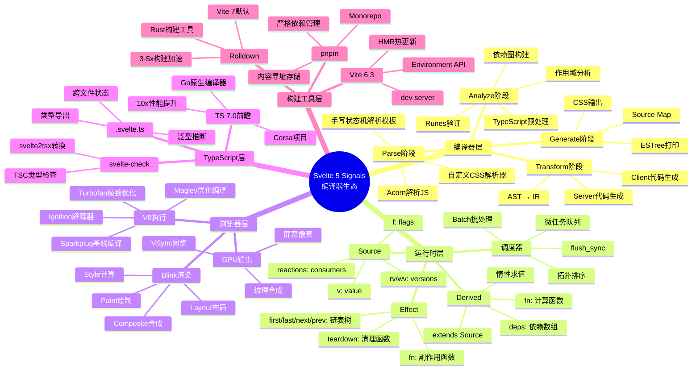
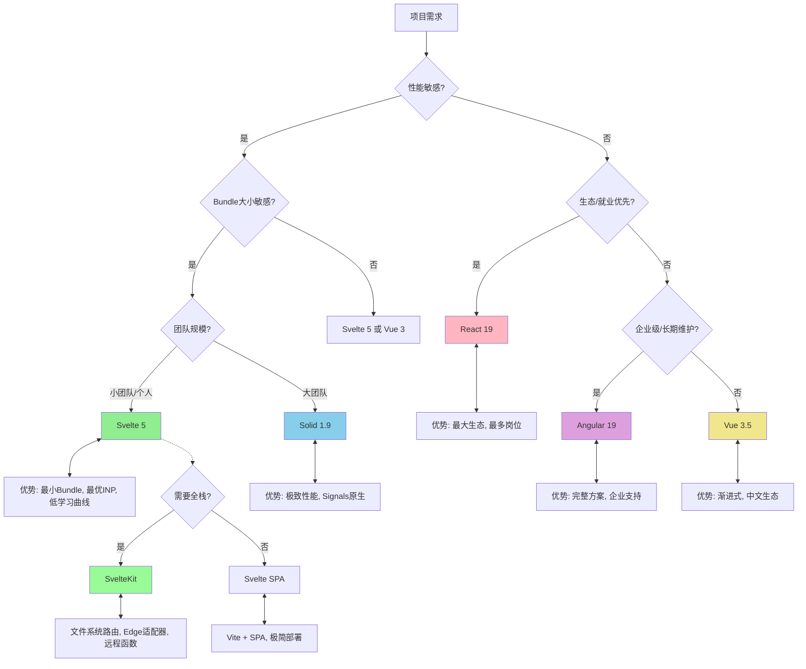
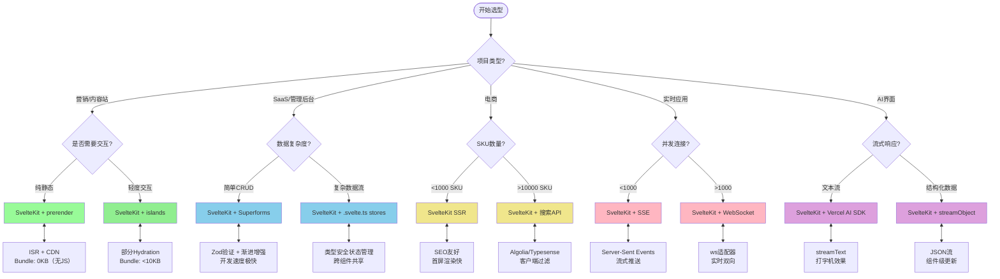
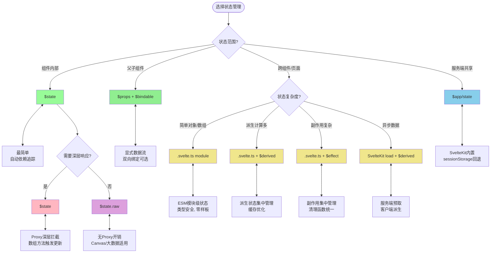
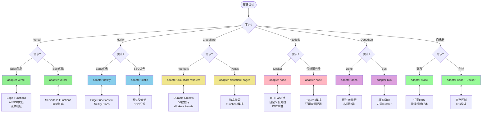
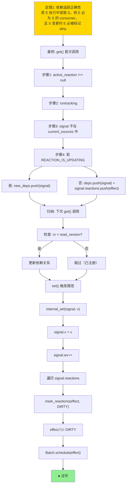
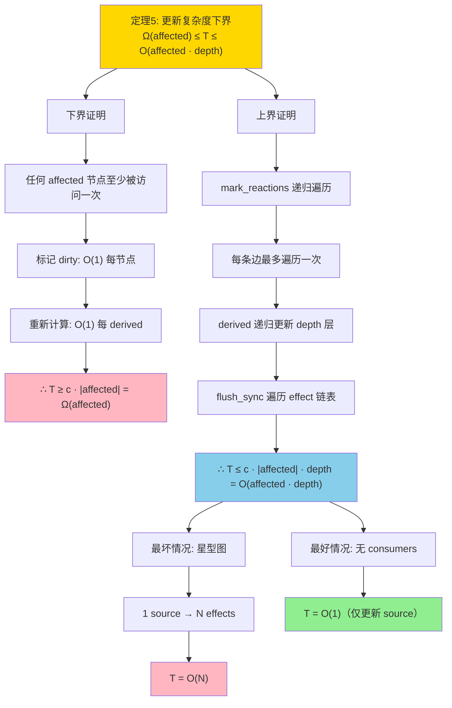
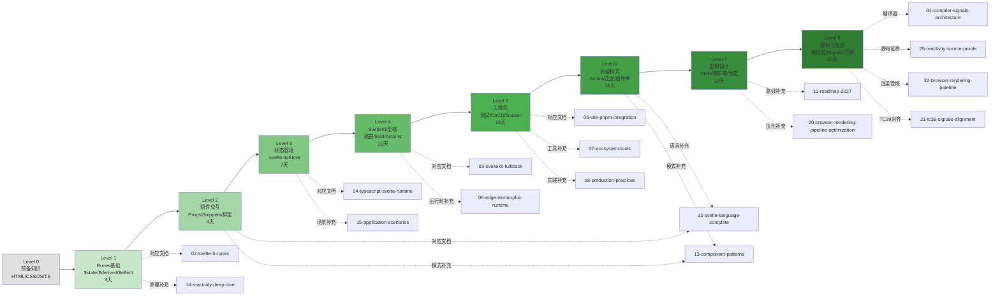
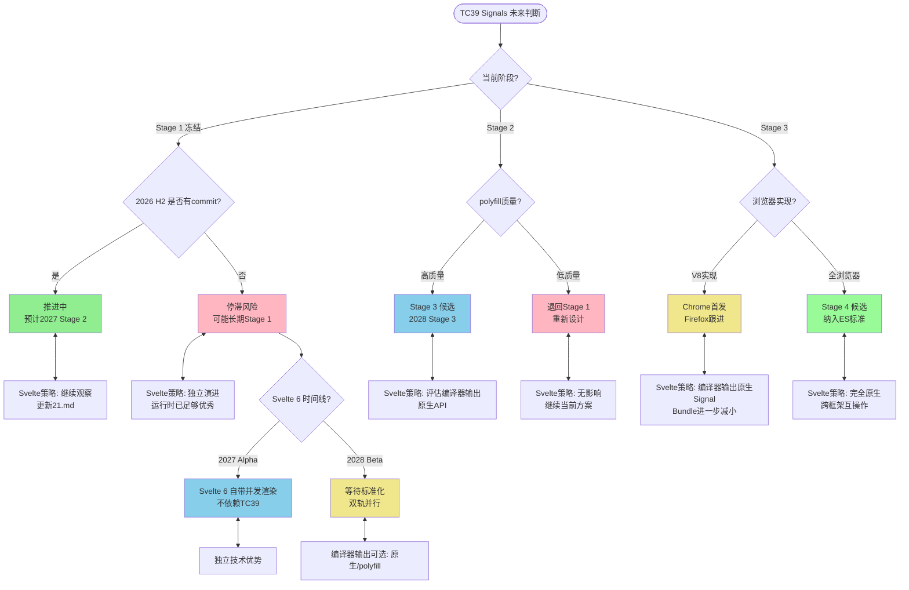

# 多维度思维表征

> **目的**: 将 `./website/svelte-signals-stack` 的线性文本内容转化为多种认知表征形式，支持不同学习风格和决策场景
> **技术**: 全部使用 Mermaid 语法，可直接渲染
> **覆盖**: 概念体系、框架选型、学习路径、形式证明、场景决策

---

## 目录

- [多维度思维表征](#多维度思维表征)
  - [目录](#目录)
  - [一、思维导图 —— Svelte 5 Signals 知识体系](#一思维导图--svelte-5-signals-知识体系)
  - [二、多维矩阵对比 —— 前端框架响应式范式](#二多维矩阵对比--前端框架响应式范式)
    - [2.1 三维度对比矩阵](#21-三维度对比矩阵)
    - [2.2 技术选型决策矩阵](#22-技术选型决策矩阵)
  - [三、决策树图 —— Svelte 5 技术选型](#三决策树图--svelte-5-技术选型)
    - [3.1 项目类型决策树](#31-项目类型决策树)
    - [3.2 状态管理决策树](#32-状态管理决策树)
  - [四、场景决策树图 —— 生产实践](#四场景决策树图--生产实践)
    - [4.1 性能优化场景决策](#41-性能优化场景决策)
    - [4.2 部署策略决策树](#42-部署策略决策树)
  - [五、形式模型判断推理树图](#五形式模型判断推理树图)
    - [5.1 依赖追踪正确性推理树](#51-依赖追踪正确性推理树)
    - [5.2 复杂度分析推理树](#52-复杂度分析推理树)
  - [六、学习路径推理树图](#六学习路径推理树图)
    - [6.1 从入门到源码的渐进路径](#61-从入门到源码的渐进路径)
  - [七、TC39 Signals 标准化推理树](#七tc39-signals-标准化推理树)
    - [7.1 标准化进程判断树](#71-标准化进程判断树)

## 一、思维导图 —— Svelte 5 Signals 知识体系



---

## 二、多维矩阵对比 —— 前端框架响应式范式

### 2.1 三维度对比矩阵

| 维度 | Svelte 5 | React 19 | Vue 3.5 | Solid 1.9 | Angular 19 |
|:---:|:---:|:---:|:---:|:---:|:---:|
| **渲染范式** | Compiler-Based | VDOM + Compiler | VDOM + Proxy | Fine-Grained Signals | Zone.js → Signals |
| **运行时大小** | ~2KB | ~45KB | ~35KB | ~7KB | ~135KB |
| **更新复杂度** | O(affected) | O(tree + diff) | O(affected + overhead) | O(affected) | O(tree) |
| **学习曲线** | 低 | 高 | 中 | 中高 | 高 |
| **就业市场** | 增长 | 主导 | 成熟 | 小众 | 企业 |
| **TypeScript** | 原生 | 原生 | 原生 | 良好 | 深度 |
| **SSR支持** | SvelteKit | Next.js | Nuxt | SolidStart | Angular Universal |
| **并发渲染** | 无（Svelte 6?） | Fiber | 无 | 无 | 变更检测 |
| **生态系统** | 增长中 | 最丰富 | 丰富 | 小但活跃 | 企业级 |
| **INP性能** | 优秀 | 良好（Compiler ON）| 良好 | 优秀 | 一般 |

### 2.2 技术选型决策矩阵



---

## 三、决策树图 —— Svelte 5 技术选型

### 3.1 项目类型决策树



### 3.2 状态管理决策树



---

## 四、场景决策树图 —— 生产实践

### 4.1 性能优化场景决策

```mermaid
graph TD
    START([性能问题]) --> Q1{指标异常?}

    Q1 -->|INP > 200ms| A1{瓶颈位置?}
    Q1 -->|LCP > 2.5s| A2{首屏内容?}
    Q1 -->|CLS > 0.1| A3{布局偏移源?}
    Q1 -->|内存泄漏| A4{泄漏模式?}

    A1 -->|事件处理慢| B1[$effect优化]<-->B1d["untrack()跳过追踪<br/>拆分大effect<br/>防抖/节流"]
    A1 -->|DOM更新慢| B2[{#each}优化]<-->B2d["key属性<br/>虚拟列表<br/>content-visibility"]
    A1 -->|Derived重算多| B3[$derived优化]<-->B3d["缓存策略<br/>减少派生链深度<br/>$state.raw替代"]

    A2 -->|图片| C1[图片优化]<-->C1d["avif/webp<br/>srcset响应式<br/>懒加载"]
    A2 -->|字体| C2[字体优化]<-->C2d["font-display: swap<br/>子集化<br/>预加载"]
    A2 -->|JS执行阻塞| C3[代码分割]<-->C3d["动态导入<br/>SSR优先<br/>边缘渲染"]

    A3 -->|图片无尺寸| D1[固定尺寸]<-->D1d["width/height属性<br/>aspect-ratio"]
    A3 -->|动态内容插入| D2[预留空间]<-->D2d["min-height占位<br/>骨架屏"]
    A3 -->|Web字体加载| D3[字体策略]<-->D3d["系统字体回退<br/>size-adjust"]

    A4 -->|组件未卸载| E1[生命周期检查]<-->E1d["$effect清理函数<br/>onDestroy验证"]
    A4 -->|事件未移除| E2[event优化]<-->E2d["$.event委托<br/>AbortController"]
    A4 -->|Store未取消订阅| E3[订阅管理]<-->E3d["$derived替代手动订阅<br/>.svelte.ts模块"]

    style B1 fill:#FFB6C1
    style B2 fill:#FFB6C1
    style B3 fill:#FFB6C1
    style C1 fill:#87CEEB
    style C2 fill:#87CEEB
    style C3 fill:#87CEEB
    style D1 fill:#F0E68C
    style D2 fill:#F0E68C
    style D3 fill:#F0E68C
    style E1 fill:#98FB98
    style E2 fill:#98FB98
    style E3 fill:#98FB98
```

### 4.2 部署策略决策树



---

## 五、形式模型判断推理树图

### 5.1 依赖追踪正确性推理树



### 5.2 复杂度分析推理树



---

## 六、学习路径推理树图

### 6.1 从入门到源码的渐进路径



---

## 七、TC39 Signals 标准化推理树

### 7.1 标准化进程判断树



---

> **使用说明**: 以上所有 Mermaid 图表可在支持 Mermaid 的 Markdown 渲染器（如 GitHub、GitLab、VS Code、VitePress）中直接查看。如需导出为图片，可使用 Mermaid CLI 或在线编辑器。
