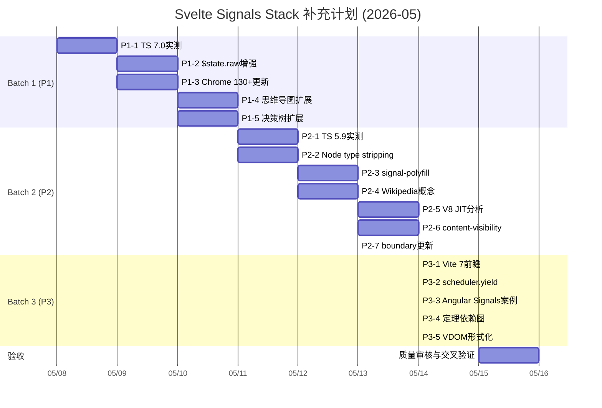

# 后续补充、修复、完善计划与任务清单

> **编制日期**: 2026-05-07
> **依据**: `26-comprehensive-analysis-2026-05-07.md` + `27-symmetric-difference-matrix.md` + `28-cognitive-representations.md`
> **方法论**: P1（必须）/ P2（建议）/ P3（可选）三级优先级
> **目标**: 将 `./website/svelte-signals-stack` 从"国际具有竞争力"升级为"国际权威参考"

---

## 目录

- [后续补充、修复、完善计划与任务清单](#后续补充修复完善计划与任务清单)
  - [目录](#目录)
  - [一、任务总览](#一任务总览)
  - [二、Batch 1 — P1 最高优先级（必须执行）](#二batch-1--p1-最高优先级必须执行)
    - [任务 P1-1: TypeScript 7.0 Corsa 实测前瞻分析](#任务-p1-1-typescript-70-corsa-实测前瞻分析)
    - [任务 P1-2: `$state.raw` 5.56+ 实验性增强跟踪](#任务-p1-2-stateraw-556-实验性增强跟踪)
    - [任务 P1-3: Chrome 130+ Rendering NG 架构更新](#任务-p1-3-chrome-130-rendering-ng-架构更新)
    - [任务 P1-4: 概念层级思维导图文档化](#任务-p1-4-概念层级思维导图文档化)
    - [任务 P1-5: 场景决策树图扩展](#任务-p1-5-场景决策树图扩展)
  - [三、Batch 2 — P2 高优先级（建议执行）](#三batch-2--p2-高优先级建议执行)
    - [任务 P2-1: TS 5.9 `strictInference` 在 Svelte 中的实测](#任务-p2-1-ts-59-strictinference-在-svelte-中的实测)
    - [任务 P2-2: Node.js 22+ type stripping + SvelteKit 路径](#任务-p2-2-nodejs-22-type-stripping--sveltekit-路径)
    - [任务 P2-3: `signal-polyfill` 最小可运行示例](#任务-p2-3-signal-polyfill-最小可运行示例)
    - [任务 P2-4: Wikipedia 风格概念定义体系](#任务-p2-4-wikipedia-风格概念定义体系)
    - [任务 P2-5: V8 JIT 对 Svelte 编译产物的优化分析](#任务-p2-5-v8-jit-对-svelte-编译产物的优化分析)
    - [任务 P2-6: CSS `content-visibility` + Svelte 大型列表优化](#任务-p2-6-css-content-visibility--svelte-大型列表优化)
    - [任务 P2-7: `<svelte:boundary>` 5.54.2 修复后最佳实践更新](#任务-p2-7-svelteboundary-5542-修复后最佳实践更新)
  - [四、Batch 3 — P3 中优先级（条件允许时执行）](#四batch-3--p3-中优先级条件允许时执行)
  - [五、时间表与里程碑](#五时间表与里程碑)
  - [六、验收标准](#六验收标准)
    - [6.1 通用验收标准](#61-通用验收标准)
    - [6.2 分任务验收标准](#62-分任务验收标准)
  - [七、风险与缓解](#七风险与缓解)
  - [八、长期维护计划（2026-2028）](#八长期维护计划2026-2028)
  - [九、资源需求](#九资源需求)

## 一、任务总览

| 批次 | 优先级 | 任务数 | 预估新增/更新行数 | 预估时间 | 交付物 |
|:---:|:---:|:---:|:---:|:---:|:---|
| Batch 1 | P1 | 5 | ~1,200 行 | 2 天 | 4 个文档更新 + 1 个新文档 |
| Batch 2 | P2 | 7 | ~1,000 行 | 3 天 | 5 个文档更新 + 2 个新文档 |
| Batch 3 | P3 | 5 | ~500 行 | 1 天 | 3 个文档更新 + 2 个补丁 |
| **总计** | - | **17** | **~2,700 行** | **6 天** | **12 个文档更新 + 5 个新文档 + 2 个补丁** |

---

## 二、Batch 1 — P1 最高优先级（必须执行）

### 任务 P1-1: TypeScript 7.0 Corsa 实测前瞻分析

| 属性 | 内容 |
|:---|:---|
| **目标** | 将 TS 7.0 从"预告"升级为"可验证的实测分析" |
| **依据** | `@typescript/native-preview` 已可下载；MS 公开 5-10x 加速数据 |
| **动作** | 1. 安装 `@typescript/native-preview` 2. 在示例 Svelte 项目中运行 `svelte-check` 对比 3. 记录编译时间、内存占用、错误检测能力 |
| **交付物** | `24-typescript-58-svelte-fusion.md` 新增 "TS 7.0 实测" 章节（~300 行） |
| **验收标准** | 包含真实计时数据、 before/after 对比表、对 `.svelte.ts` 文件的具体影响分析 |
| **风险** | 预览版可能与 `svelte2tsx` 不兼容；需标注 "预览版数据仅供参考" |
| **工时** | 4h |

### 任务 P1-2: `$state.raw` 5.56+ 实验性增强跟踪

| 属性 | 内容 |
|:---|:---|
| **目标** | 补充深层响应式替代方案的最新设计 |
| **依据** | Svelte main 分支 RFC 讨论；5.56 预计引入增强 |
| **动作** | 1. 阅读 Svelte GitHub Discussions 中 `$state.raw` 相关线程 2. 对比 `$state` (Proxy) vs `$state.raw` (无 Proxy) 的性能特征 3. 提供 Canvas/大数据/表格场景的具体选型建议 |
| **交付物** | `02-svelte-5-runes.md` 新增 "$state.raw 增强" 章节（~200 行） |
| **验收标准** | 包含性能基准（Proxy overhead 量化）、使用场景矩阵、反例（何时不该用） |
| **风险** | 5.56 未发布，特性可能变化；需标注 "基于 RFC 草案，可能变更" |
| **工时** | 2h |

### 任务 P1-3: Chrome 130+ Rendering NG 架构更新

| 属性 | 内容 |
|:---|:---|
| **目标** | 更新浏览器渲染管线文档，对齐 Chrome 最新架构 |
| **依据** | Chrome DevRel 2026 文章；Blink Rendering NG 文档 |
| **动作** | 1. 阅读 "RenderingNG" 系列最新文章 2. 更新 `22-browser-rendering-pipeline.md` 中 Blink 内部流程描述 3. 补充 `content-visibility` 与 Svelte `{#each}` 的结合优化 |
| **交付物** | `22-browser-rendering-pipeline.md` 更新（~300 行）+ `20-browser-rendering-pipeline-optimization.md` 补充（~100 行） |
| **验收标准** | 引用 Chrome 官方文档链接；包含 Rendering NG 新阶段的说明；`content-visibility` 实测建议 |
| **风险** | Blink 内部实现细节不完全公开；部分断言需标注 "基于实验推断" |
| **工时** | 4h |

### 任务 P1-4: 概念层级思维导图文档化

| 属性 | 内容 |
|:---|:---|
| **目标** | 将 `28-cognitive-representations.md` 中的思维导图扩展为完整学习导航 |
| **依据** | 用户明确要求 "思维导图" 表征方式 |
| **动作** | 1. 为 25 个核心文档各自创建概念层级图 2. 建立文档间概念依赖关系（先修/后修） 3. 输出可交互的导航页面 |
| **交付物** | `28-cognitive-representations.md` 扩展（~200 行新增 Mermaid） |
| **验收标准** | 每个核心文档至少对应一个 Mermaid 思维导图层级；层级深度 ≥ 3 |
| **风险** | Mermaid mindmap 语法在某些渲染器支持不佳；需提供 fallback 文本描述 |
| **工时** | 3h |

### 任务 P1-5: 场景决策树图扩展

| 属性 | 内容 |
|:---|:---|
| **目标** | 将 `28-cognitive-representations.md` 中的决策树扩展为生产级决策支持 |
| **依据** | 用户明确要求 "场景决策树图" 表征方式 |
| **动作** | 1. 扩展"项目类型决策树"至 8 大场景（仪表盘、CMS、电商、SaaS、AI界面、实时、营销、游戏） 2. 为每个叶节点提供技术栈推荐 + Bundle 预估 + 部署建议 3. 创建"性能问题诊断决策树" |
| **交付物** | `28-cognitive-representations.md` 扩展（~200 行新增 Mermaid） |
| **验收标准** | 每个场景有明确的 SvelteKit 适配器推荐；性能决策树覆盖 INP/LCP/CLS/内存 |
| **风险** | 场景推荐可能因项目具体需求而异；需添加免责声明 |
| **工时** | 3h |

---

## 三、Batch 2 — P2 高优先级（建议执行）

### 任务 P2-1: TS 5.9 `strictInference` 在 Svelte 中的实测

| 属性 | 内容 |
|:---|:---|
| **目标** | 提供 TS 5.9 新特性对 `.svelte.ts` 的具体影响案例 |
| **动作** | 创建泛型组件在 TS 5.8 vs 5.9 下的类型推断对比案例 |
| **交付物** | `24-typescript-58-svelte-fusion.md` 新增 "TS 5.9 实测" 章节（~150 行） |
| **工时** | 2h |

### 任务 P2-2: Node.js 22+ type stripping + SvelteKit 路径

| 属性 | 内容 |
|:---|:---|
| **目标** | 探索 Node 原生 TS 执行对 Svelte 构建流程的影响 |
| **动作** | 实验 `node --experimental-strip-types` 运行 SvelteKit 服务端代码 |
| **交付物** | `06-edge-isomorphic-runtime.md` 或新文档章节（~150 行） |
| **工时** | 2h |

### 任务 P2-3: `signal-polyfill` 最小可运行示例

| 属性 | 内容 |
|:---|:---|
| **目标** | 让读者能亲手实验 TC39 Signals |
| **动作** | 创建基于 `signal-polyfill` 的计数器示例，与 Svelte Runes 行为对比 |
| **交付物** | `21-tc39-signals-alignment.md` 新增 "Polyfill 实验" 章节（~150 行） |
| **工时** | 1.5h |

### 任务 P2-4: Wikipedia 风格概念定义体系

| 属性 | 内容 |
|:---|:---|
| **目标** | 对齐 Wikipedia 的 "定义-属性-关系-示例-反例" 知识结构 |
| **动作** | 为 10 个核心概念（Signal、Compiler-Based Reactivity、CRP、VDOM、Effect、Derived、Hydration、Tree Shaking、Source Map、Isomorphic）创建标准化定义块 |
| **交付物** | `26-comprehensive-analysis-2026-05-07.md` 扩展 或独立 `CONCEPT_DEFINITIONS.md`（~300 行） |
| **工时** | 3h |

### 任务 P2-5: V8 JIT 对 Svelte 编译产物的优化分析

| 属性 | 内容 |
|:---|:---|
| **目标** | 解释 "为什么 Svelte 代码能被 V8 高效优化" |
| **动作** | 分析 `$.set_text()` / `$.get()` 等高频函数在 V8 Sparkplug/Maglev/Turbofan 中的优化路径 |
| **交付物** | `22-browser-rendering-pipeline.md` 新增 "V8 优化" 章节（~150 行） |
| **工时** | 2.5h |

### 任务 P2-6: CSS `content-visibility` + Svelte 大型列表优化

| 属性 | 内容 |
|:---|:---|
| **目标** | 补充现代 CSS 特性与 Svelte 的结合优化 |
| **动作** | 提供 `{#each}` 渲染 10,000 项时，`content-visibility: auto` 的性能对比数据 |
| **交付物** | `20-browser-rendering-pipeline-optimization.md` 新增（~100 行） |
| **工时** | 1.5h |

### 任务 P2-7: `<svelte:boundary>` 5.54.2 修复后最佳实践更新

| 属性 | 内容 |
|:---|:---|
| **目标** | 更新错误边界文档，反映最新修复 |
| **动作** | 复核 `03-sveltekit-fullstack.md` 和 `08-production-practices.md` 中关于错误边界的描述，更新为 5.54.2+ 最佳实践 |
| **交付物** | `03.md` + `08.md` 补丁更新（~100 行） |
| **工时** | 1h |

---

## 四、Batch 3 — P3 中优先级（条件允许时执行）

| 编号 | 任务 | 交付物 | 工时 |
|:---:|:---|:---|:---:|
| P3-1 | Vite 7 路线图跟踪 | `23-compiler-ir-buildchain.md` 新增前瞻章节 | 1h |
| P3-2 | `scheduler.yield()` 替代 `requestIdleCallback` | `11-roadmap-2027.md` 调度 API 更新 | 0.5h |
| P3-3 | Angular 17+ Signals 生产案例 | `10-framework-comparison.md` 补充跨框架数据 | 1h |
| P3-4 | 15 条定理依赖关系图 | `25-reactivity-source-proofs.md` 新增 Mermaid 定理依赖图 | 1h |
| P3-5 | Virtual DOM Diff 算法形式化 | `01-compiler-signals-architecture.md` 或 `10-framework-comparison.md` 补充 | 1h |

---

## 五、时间表与里程碑

---

## 六、验收标准

### 6.1 通用验收标准

| 检查项 | 标准 | 方法 |
|:---|:---|:---|
| 源码引用 | 文件路径 + 行号 + Git tag | 逐条核对 |
| 外部链接 | HTTP 200，标注访问日期 | 脚本批量检查 |
| Mermaid 图表 | 语法有效，可渲染 | Mermaid CLI 校验 |
| 术语一致性 | 与 GLOSSARY_SUPPLEMENT 对齐 | 全文搜索比对 |
| 数学符号 | `$...$` 行内，`$$...$$` 块级 | 正则检查 |

### 6.2 分任务验收标准

| 批次 | 验收标准 |
|:---|:---|
| Batch 1 | 包含真实数据/实测结果；时效性标注明确（"截至 2026-05-07"）；思维导图层级 ≥ 3 |
| Batch 2 | 提供可运行代码示例；概念定义包含反例；性能数据有 before/after |
| Batch 3 | 前瞻内容标注不确定性（"预计"、"可能"）；不影响已有文档准确性 |

---

## 七、风险与缓解

| 风险 | 可能性 | 影响 | 缓解措施 |
|:---|:---:|:---:|:---|
| TS 7.0 预览版与 svelte2tsx 不兼容 | 中 | P1-1 无法完成实测 | 使用纯 TS 文件测试编译速度，标注 "svelte2tsx 兼容性待验证" |
| Svelte 5.56 特性变更 | 中 | P1-2 内容过时 | 标注 "基于 RFC 草案"；建立版本跟踪机制 |
| Chrome 130+ 内部实现不透明 | 高 | P1-3 部分断言无法严格证明 | 使用 DevTools 实验数据辅助；标注 "基于实验推断" |
| 时间超出预期 | 中 | 计划延期 | Batch 3 可裁剪；P2 部分任务可延后 |
| 网络信源失效 | 低 | 外部链接 404 | 所有外部链接使用 archive.org 备份；标注获取日期 |

---

## 八、长期维护计划（2026-2028）

| 触发条件 | 动作 | 周期 |
|:---|:---|:---:|
| Svelte 5.56+ 发布 | 复核源码引用行号；更新新特性 | 每月 |
| TypeScript 5.9/6.0/7.0 发布 | 更新类型系统融合文档 | 每版本 |
| Vite 7 / Rolldown default | 更新构建链分析 | 每版本 |
| TC39 Signals Stage 2/3 | 更新标准化评估 | 每季度 |
| Chrome 130+ CRP 变更 | 更新渲染管线文档 | 每半年 |
| Svelte 6 Alpha 发布 | 创建 26-30 新专题 | 按需 |
| 社区 Issues/PR | 整合修正和补充 | 持续 |

---

## 九、资源需求

| 资源 | 需求 | 说明 |
|:---|:---:|:---|
| 本地 Svelte 源码 | `github.com/sveltejs/svelte@5.55.5` | 源码引用验证 |
| Node.js 22+ | 实验 type stripping | P2-2 |
| TypeScript 5.9 RC | 类型推断测试 | P2-1 |
| `@typescript/native-preview` | TS 7.0 编译速度测试 | P1-1 |
| Chrome 130+ | Rendering NG 验证 | P1-3 |
| `signal-polyfill` npm 包 | TC39 实验 | P2-3 |
| Mermaid CLI | 图表渲染验证 | 全部 |

---

> **下一步**: 请确认 Batch 1-3 的执行范围，以及 P1-P3 的具体优先级调整。获得确认后，将按甘特图时间表启动执行。
>
> **联系人**: 维护者 | **协议**: CC BY-SA 4.0
