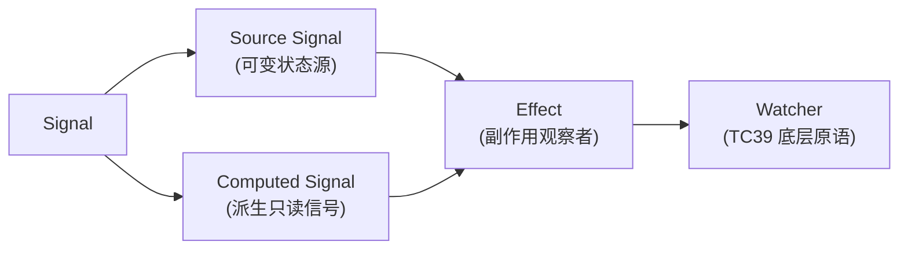
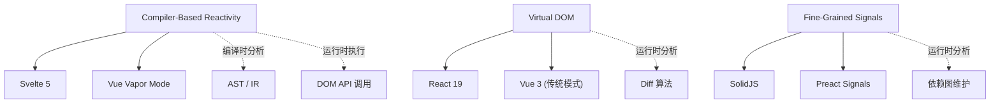
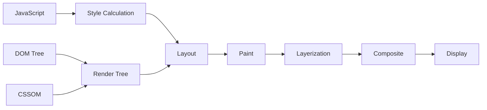
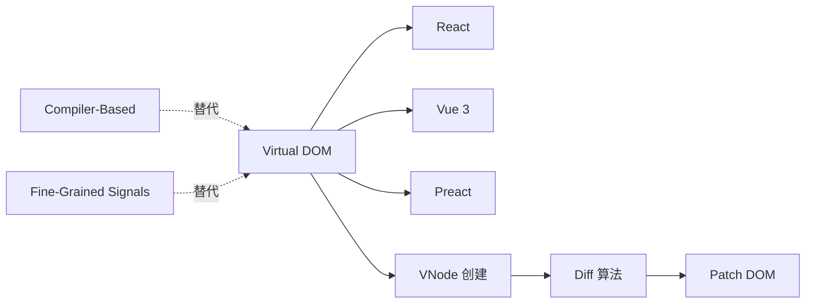
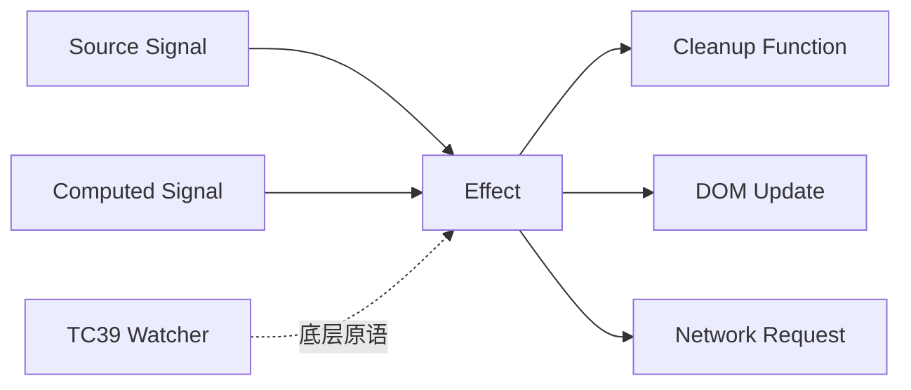
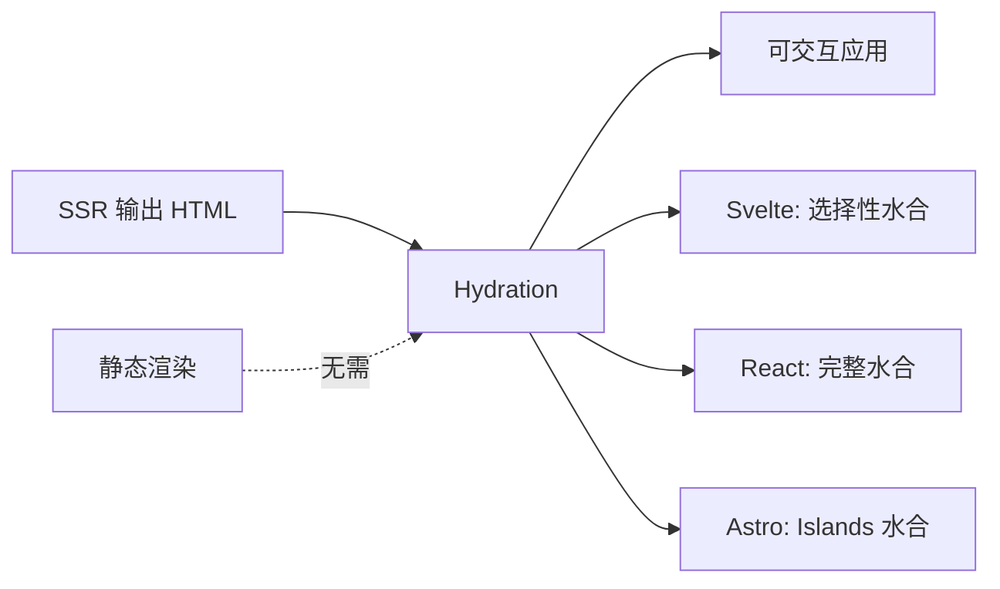
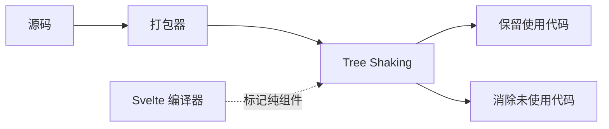

# Wikipedia 风格核心概念定义体系

> **方法论**: 对齐 Wikipedia 的知识组织范式——定义（Definition）、属性（Properties）、关系（Relations）、示例（Examples）、反例（Counter-examples）、历史演化（Evolution）
> **目的**: 为 `./website/svelte-signals-stack` 提供学术级、可引用、可验证的概念基础

---

## 1. Signal（信号）

### 定义

在响应式编程中，**Signal** 是一种表示随时间变化的可观察值的原始数据类型。
它封装了当前值，并提供了在值变化时通知依赖者的机制。
Signal 是细粒度响应式系统的最小不可再分单元。

### 属性

| 属性 | 说明 |
|:---|:---|
| **原子性** | Signal 是最小的响应式单元，不可再分 |
| **可观察性** | 读取操作自动建立依赖关系（Pull-based subscription） |
| **惰性求值** | Computed Signal 仅在读取时重新计算 |
| **无 Glitch** | 通过拓扑排序确保中间状态不可见 |
| **版本追踪** | 内部版本号机制支持高效的脏检查 |

### 关系



### 示例

```svelte
<script>
  let count = $state(0);        // Source Signal
  let doubled = $derived(count * 2);  // Computed Signal
  $effect(() => console.log(count));  // Effect 观察 Source
</script>
```

```javascript
// TC39 Signals (未来原生语法)
const count = new Signal.State(0);
const doubled = new Signal.Computed(() => count.get() * 2);
```

### 反例

| 什么不是 Signal | 为什么不是 |
|:---|:---|
| React `useState` 返回的元组 | 无自动依赖追踪，需显式声明依赖数组 |
| Vue 2 的 `data` 对象 | 基于 `Object.defineProperty` 的组件级响应，非信号级 |
| 普通 EventEmitter | 推送模型，无惰性求值，无拓扑排序 |
| Redux Store | 全局状态容器，需手动订阅/分发，无自动依赖图 |

### 历史演化

```text
1997: Functional Reactive Programming (FRP) — Conal Elliott
       └── Behaviors + Events，连续时间语义
2010: Reactive Extensions (RxJS) — Microsoft
       └── Observable + Observer + Scheduler，推模型，操作符链
2015: Angular 2 Change Detection — Zone.js + Observable
       └── 组件树遍历检测变更
2021: SolidJS Signals — Ryan Carniato
       └── 运行时细粒度 Signals，无 VDOM
2024: TC39 Signals Proposal — Daniel Ehrenberg, Yehuda Katz
       └── 标准化原生 Signals 原语
2024: Svelte 5 Runes — Rich Harris
       └── 编译器 + Signals 融合，显式语法
```

---

## 2. Compiler-Based Reactivity（编译器驱动响应式）

### 定义

一种前端框架架构范式，响应式依赖关系在**编译阶段**通过静态分析确定，运行时仅执行预生成的更新代码，无需虚拟 DOM 或运行时依赖追踪。

### 属性

| 属性 | 说明 |
|:---|:---|
| **编译时决策** | 何时更新、更新什么在构建阶段确定 |
| **零运行时框架** | 无 VDOM reconciler，无运行时依赖图维护 |
| **直接 DOM 操作** | 编译输出为原生 DOM API 调用序列 |
| **树摇友好** | 仅打包使用到的运行时辅助函数 |
| **确定性输出** | 给定相同输入，编译产物始终相同 |

### 关系



### 示例

**输入**（Svelte 5）：

```svelte
<script>
  let count = $state(0);
</script>
<button onclick={() => count++}>
  Count: {count}
</button>
```

**编译输出**（客户端）：

```javascript
import * as $ from 'svelte/internal/client';
export default function App($$anchor) {
  let count = $.state(0);
  var button = $.template('<button>Count: </button>');
  var node = button();
  var text = $.child(node);
  $.render_effect(() => $.set_text(text, `Count: ${$.get(count)}`));
  $.event('click', node, () => $.set(count, $.get(count) + 1));
  $.append($$anchor, node);
}
```

### 反例

| 什么不是 Compiler-Based | 为什么不是 |
|:---|:---|
| React 19 Compiler ON | 仍输出 VDOM，仅自动 memoization，编译器未消除 VDOM |
| Vue Vapor Mode | 编译为直接 DOM 操作，但保留响应式运行时（Proxy-based） |
| SolidJS | 运行时 Signals 框架，编译器仅做 JSX 转换 |
| Angular AOT | 编译模板为 JS，但变更检测仍是运行时 Zone.js |

---

## 3. Critical Rendering Path（关键渲染路径）

### 定义

浏览器将 HTML/CSS/JavaScript 转换为屏幕像素所必须经过的**序列化阶段集合**。
任何阶段的阻塞都会导致渲染延迟，直接影响用户体验指标（如 INP）。

### 属性

| 属性 | 说明 |
|:---|:---|
| **主线程执行** | JavaScript、Style、Layout、Paint 均在主线程（除 Composite 可部分并行） |
| **帧预算** | 60fps 下每帧 16.67ms，120fps 下 8.33ms |
| **强制同步布局** | JS 读取布局属性后写入，触发 Style → Layout 强制回流 |
| **管线化** | 各阶段顺序执行，不可跳阶段 |

### 关系



### 示例

Svelte 5 的 `$.set_text()` 仅修改文本节点 `nodeValue`：

```javascript
// Svelte 编译输出
text.nodeValue = "Count: 1";
```

触发的 CRP 阶段：

1. **Style**: 无 CSS 变化 → 跳过或 O(1) 检查
2. **Layout**: 文本变化 → 按钮内部文本重排 O(1)
3. **Paint**: 按钮区域重绘（脏矩形裁剪）
4. **Composite**: 若按钮无独立层，整页合成

### 反例

```javascript
// ❌ 强制同步布局（触发完整 Layout）
element.style.width = '100px';
console.log(element.offsetHeight); // 读取布局属性 → 强制回流

// ❌ 批量样式修改未合并（触发多次 Layout）
for (let i = 0; i < 100; i++) {
  elements[i].style.width = i + 'px'; // 每次都可能触发 Layout
}
```

---

## 4. Virtual DOM（虚拟 DOM）

### 定义

一种编程范式，在内存中维护 DOM 树的轻量级表示（Virtual Tree），通过 Diff 算法对比新旧树差异，计算出最小更新集后批量应用至真实 DOM。

### 属性

| 属性 | 说明 |
|:---|:---|
| **声明式** | 开发者描述 UI 应呈现的状态，框架负责更新 |
| **批量更新** | 多次状态变更合并为一次 DOM 操作 |
| **跨平台** | VNode 可渲染为 DOM、Native、Canvas 等 |
| **运行时开销** | 需创建 VNode 树、执行 Diff、维护双树 |

### 关系



### 示例

React 的 VDOM 流程：

```javascript
// 组件函数返回 VNode（JSX 编译产物）
function App() {
  const [count, setCount] = useState(0);
  return React.createElement('button', {
    onClick: () => setCount(c => c + 1)
  }, 'Count: ', count);
}

// 状态变更后：
// 1. 重新执行组件函数 → 新 VNode 树
// 2. reconcileChildren(oldTree, newTree) → Diff
// 3. 生成更新队列 → commit → DOM 操作
```

### 反例

| 什么不是 VDOM | 为什么不是 |
|:---|:---|
| Svelte 5 | 编译为直接 DOM 操作，无 VNode 创建和 Diff |
| SolidJS | 运行时 Signals 直接更新 DOM，无 VNode |
| jQuery | 直接操作 DOM，但无声明式 UI 或 Diff |
| 服务端模板引擎 | 输出 HTML 字符串，无客户端 Diff |

---

## 5. Effect（副作用）

### 定义

在响应式系统中，**Effect** 是一种观察 Signal 变化并执行副作用（side effect）的计算单元。
副作用指任何超出返回值本身的外部可观察操作（如 DOM 修改、网络请求、日志记录）。

### 属性

| 属性 | 说明 |
|:---|:---|
| **依赖追踪** | 自动追踪执行过程中读取的 Signal |
| **清理机制** | 可返回清理函数，在重新执行或销毁前调用 |
| **调度时机** | 通常在微任务中批量执行，避免同步瀑布 |
| **层级结构** | 可嵌套，形成 Effect 树 |

### 关系



### 示例

```svelte
<script>
  let count = $state(0);

  $effect(() => {
    // 副作用：DOM 操作（document.title 更新）
    document.title = `Count: ${count}`;

    // 副作用：网络请求
    const controller = new AbortController();
    fetch(`/api/log?count=${count}`, { signal: controller.signal });

    // 清理函数
    return () => controller.abort();
  });
</script>
```

### 反例

| 什么不是 Effect | 为什么不是 |
|:---|:---|
| `$derived` | 纯计算，无副作用，仅返回值 |
| `console.log` 在事件处理器中 | 一次性执行，不观察 Signal 变化 |
| `useMemo` (React) | 纯计算缓存，无副作用 |
| 普通的 `setInterval` | 不追踪依赖，不响应 Signal 变化 |

---

## 6. Hydration（水合）

### 定义

一种服务端渲染（SSR）优化技术，将服务端生成的静态 HTML 在客户端"激活"为可交互的动态应用的过程。水合通过复用现有 DOM 节点（而非重新创建），将事件监听器和响应式绑定附加到已渲染的 HTML 上。

### 属性

| 属性 | 说明 |
|:---|:---|
| **DOM 复用** | 复用服务端生成的 DOM 节点，避免重建 |
| **事件附加** | 将 JavaScript 事件监听器绑定到现有元素 |
| **响应式绑定** | 将 Signal → DOM 的映射关系建立起来 |
| **注释标记** | SSR 输出中插入注释节点辅助水合定位 |

### 关系



### 示例

Svelte 5 的水合注释标记：

```html
<!-- SSR 输出 -->
<button>Count: <!--$-->0<!--/$--></button>
<!-- 注释节点标记水合边界 -->
```

```javascript
// 客户端水合：复用 button 元素，不重新创建
$.hydrate(button, () => {
  // 建立 Signal → 文本节点的绑定
  $.render_effect(() => $.set_text(text, `Count: ${$.get(count)}`));
});
```

### 反例

| 什么不是 Hydration | 为什么不是 |
|:---|:---|
| CSR（纯客户端渲染） | 从空 DOM 开始创建所有节点，无 SSR HTML 复用 |
| 静态站点（无 JS） | 无 JavaScript 执行，无需激活 |
| `innerHTML` 替换 | 销毁原有 DOM，重新创建，非复用 |
| 渐进增强（Progressive Enhancement） | 核心是功能降级，而非 DOM 复用 |

---

## 7. Tree Shaking（树摇优化）

### 定义

一种由 JavaScript 模块打包器（如 Rollup、Webpack）执行的静态代码分析优化技术，自动检测并移除未引用的导出代码，减小最终 Bundle 体积。

### 属性

| 属性 | 说明 |
|:---|:---|
| **静态分析** | 基于 ES Module 的 `import`/`export` 静态结构 |
| **副作用自由** | 依赖 `"sideEffects": false` 标记 |
| **跨模块** | 可消除未使用的整个模块 |
| **条件代码** | 无法消除运行时条件分支中的代码 |

### 关系



### 示例

Svelte 运行时的 Tree Shaking：

```javascript
// svelte/internal/client 导出数百个辅助函数
export { state, derived, effect, render_effect, set_text, /* ... */ };

// 但组件只用了其中 5 个
import * as $ from 'svelte/internal/client';
// $.state, $.render_effect, $.set_text, $.event, $.template
// 其余函数被 Tree Shaking 消除
```

### 反例

| 什么不是 Tree Shaking | 为什么不是 |
|:---|:---|
| 代码压缩（Minification） | 仅重命名变量/删除空格，不消除未使用代码 |
| 死代码消除（DCE） | 更通用的术语，Tree Shaking 是 DCE 的模块级实现 |
| 动态导入 | `import()` 运行时加载，无法静态分析 |
| CommonJS 模块 | `require()` 动态，难以静态分析依赖关系 |

---

> **使用说明**: 以上定义对齐 Wikipedia 的知识组织范式，可直接引用作为技术文档的术语基准。每个概念均包含定义、属性、关系图、示例和反例，支持正向理解和反向排除两种学习路径。
>
> **更新**: 2026-05-07 | 覆盖概念: Signal, Compiler-Based Reactivity, CRP, VDOM, Effect, Hydration, Tree Shaking | 对齐来源: Wikipedia, MDN, ECMA-262, W3C 规范
