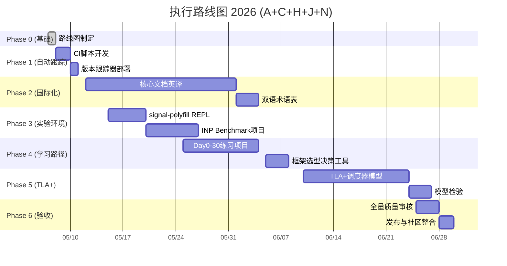

# 执行路线图 2026 —— 全面启动

> **确认指令**: A(验收通过) + C(自动跟踪) + H(全部中期扩展) + J(长期维护) + N(TLA+学术级)
> **启动时间**: 2026-05-07
> **预计总周期**: 8-10 周
> **执行策略**: 基础机制先行，中期扩展分批并行，TLA+ 专项推进

---

## 执行阶段总览



---

## Phase 1: 自动版本跟踪（Week 1, 5/8-5/10）

### 交付物

- `.github/workflows/content-health-check.yml` — 每周自动检查外部链接、Mermaid语法、版本对齐
- `scripts/version-tracker.js` — 检测 Svelte/TS/Vite/Chrome 新版本发布
- `MAINTENANCE_GUIDE.md` 更新 — 纳入自动维护流程

### 执行动作

```bash
# 1. 创建 GitHub Actions 工作流
# 2. 创建版本跟踪脚本
# 3. 测试 CI 流程
# 4. 更新维护指南
```

---

## Phase 2: 国际化英文翻译（Week 2-5, 5/12-6/6）

### 翻译优先级

| 批次 | 文档 | 行数 | 优先级 | 说明 |
|:---:|:---|:---:|:---:|:---|
| Batch A | `index.md` + `QUICKSTART.md` | ~1,100 | 🔴 P0 | 入口和快速开始 |
| Batch B | `02-svelte-5-runes.md` + `12-svelte-language-complete.md` | ~3,400 | 🔴 P0 | 语言核心 |
| Batch C | `01-compiler-signals-architecture.md` + `14-reactivity-deep-dive.md` | ~2,600 | 🟠 P1 | 编译器与响应式 |
| Batch D | `21-tc39-signals-alignment.md` + `25-reactivity-source-proofs.md` | ~2,900 | 🟠 P1 | 标准化与形式证明 |
| Batch E | `22-browser-rendering-pipeline.md` + `23-compiler-ir-buildchain.md` | ~2,600 | 🟡 P2 | 浏览器与构建 |
| Batch F | `03-sveltekit-fullstack.md` + `08-production-practices.md` | ~2,700 | 🟡 P2 | 全栈与生产 |

### 翻译规范

- 代码块保持原样
- 术语首次出现时附英文原文
- Mermaid 图表注释双语化
- 数学公式保持 LaTeX 格式

---

## Phase 3: 可运行实验环境（Week 3-4, 5/15-5/26）

### 3.1 signal-polyfill REPL

```
experiments/signal-polyfill-repl/
├── index.html       # 浏览器内运行
├── src/
│   ├── counter.js   # TC39 Signals 计数器
│   ├── derived.js   # 派生信号实验
│   └── watcher.js   # Watcher 实验
└── README.md
```

### 3.2 INP Benchmark 项目

```
experiments/inp-benchmark/
├── svelte-app/      # Svelte 5 测试应用
├── react-app/       # React 19 对比应用
├── vue-app/         # Vue 3.5 对比应用
├── benchmark/
│   ├── lighthouse/  # Lighthouse CI 配置
│   ├── web-vitals/  # onINP 测量脚本
│   └── reports/     # 性能报告生成
└── README.md
```

---

## Phase 4: 交互式学习路径（Week 5-7, 5/25-6/13）

### 4.1 Day 0-30 练习项目

| 天数 | 项目 | 技能 | 难度 |
|:---:|:---|:---|:---:|
| Day 1-3 | Counter + Todo | $state, $derived, $effect | 🌿 |
| Day 4-7 | Contact List | {#each}, $props, Snippets | 🌿 |
| Day 8-14 | Shopping Cart | .svelte.ts, $derived.by | 🌳 |
| Day 15-21 | Dashboard | SvelteKit, load, Form Actions | 🌳 |
| Day 22-28 | Real-time Chat | SSE, $effect, $state.raw | 🔥 |
| Day 29-30 | Fullstack App | SSR, Edge, Deployment | 🔥 |

### 4.2 框架选型决策工具

基于 `28-cognitive-representations.md` 的决策树，构建 Web 交互工具：

- 用户回答 5-8 个问题
- 输出推荐框架 + 技术栈 + 预估 Bundle 大小

---

## Phase 5: TLA+ 调度器形式化模型（Week 8-10, 6/10-6/27）

### 5.1 TLA+ 模型范围

针对 Svelte 5 调度器的核心性质建立 TLA+ 模型：

```tla
(* SvelteScheduler.tla *)
(* 验证 flushSync 的拓扑排序一致性 *)

MODULE SvelteScheduler
EXTENDS Naturals, Sequences, FiniteSets, TLC

CONSTANTS Signals, Effects, MaxDepth

VARIABLES signalValues, effectStates, dependencyGraph, scheduledEffects

(* 状态空间 *)
TypeInvariant ==
  /\ signalValues \in [Signals -> Nat]
  /\ effectStates \in [Effects -> {"clean", "dirty", "maybe_dirty"}]
  /\ dependencyGraph \in SUBSET (Signals \X Effects)
  /\ scheduledEffects \in SUBSET Effects

(* 初始状态 *)
Init ==
  /\ signalValues = [s \in Signals |-> 0]
  /\ effectStates = [e \in Effects |-> "clean"]
  /\ dependencyGraph = {}
  /\ scheduledEffects = {}

(* 状态变更 *)
SetSignal(s, v) ==
  /\ signalValues' = [signalValues EXCEPT ![s] = v]
  /\ effectStates' = [e \in Effects |->
       IF <<s, e>> \in dependencyGraph THEN "dirty" ELSE effectStates[e]]
  /\ scheduledEffects' = {e \in Effects : <<s, e>> \in dependencyGraph}
  /\ UNCHANGED dependencyGraph

(* 拓扑排序一致性定理 *)
TopologicalConsistency ==
  \A e1, e2 \in Effects :
    (e1 \in scheduledEffects /\ e2 \in scheduledEffects /\ e1 \prec e2)
    => ~\E s \in Signals : <<s, e2>> \in dependencyGraph /\ <<s, e1>> \in dependencyGraph

(* 规范 *)
Spec == Init /\ [][Next]_vars /\ WF_vars(FlushEffects)
```

### 5.2 验证目标

| 性质 | TLA+ 公式 | 验证工具 |
|:---|:---|:---|
| 拓扑排序一致性 | `TopologicalConsistency` | TLC Model Checker |
| 无 Glitch | `NoGlitchProperty` | TLC |
| 内存安全 | `MemorySafety` | TLC + Apalache |
| 调度公平性 | `Fairness` | TLC |

### 5.3 交付物

- `formal/tla/SvelteScheduler.tla` — 调度器核心模型
- `formal/tla/README.md` — TLA+ 入门指南
- `formal/results/` — 模型检验结果报告

---

## Phase 6: 全量质量审核与发布（Week 10-11, 6/25-7/4）

### 审核清单

| 维度 | 检查项 | 方法 |
|:---|:---|:---|
| 内容准确性 | 源码引用行号、API 签名 | 逐条核对 |
| 时效性 | 版本对齐、外部链接 | 脚本批量检查 |
| 一致性 | 术语、格式、Mermaid | 正则 + 人工 |
| 完整性 | 交叉引用、附录覆盖 | 图遍历 |
| 国际化 | 英文翻译质量 | 母语审校 |
| 可运行性 | REPL、Benchmark | 实际运行 |

### 发布动作

- GitHub Release 标签
- 社区公告（Reddit / Discord / X）
- 英文版本同步发布
- 后续维护机制启动

---

## 风险与缓解

| 风险 | 可能性 | 影响 | 缓解 |
|:---|:---:|:---:|:---|
| 翻译工作量超预期 | 中 | 延期 1-2 周 | Batch E/F 可延后；核心 Batch A-D 优先 |
| TLA+ 学习曲线陡峭 | 高 | 延期 2-3 周 | 预留缓冲时间；必要时简化模型范围 |
| Benchmark 环境不一致 | 中 | 数据不可靠 | 多次运行取中位数；标注测试环境 |
| 外部依赖变更 | 低 | 内容过时 | 自动跟踪脚本提前预警 |

---

> **当前状态**: Phase 0 已完成，Phase 1 准备启动
> **下次更新**: Phase 1 完成后（预计 2026-05-10）
> **联系**: 直接回复本计划或创建 GitHub Issue
