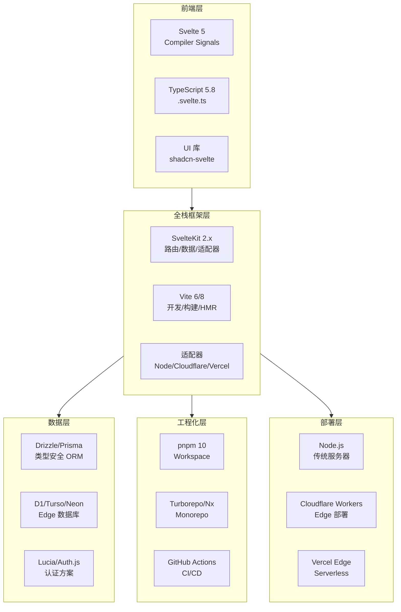

# Svelte 5 Signals 编译器生态

> 最全面的 Svelte 5 Compiler-Based Signals 技术栈学习资源
>
> 覆盖: 编译原理 · Runes 响应式 · SvelteKit 全栈 · TypeScript 运行时 · Vite 构建 · pnpm Monorepo · Edge 部署 · 生产实践

---

## 🚀 快速开始

```bash
# 创建新项目
npm create sv@latest my-app
cd my-app
npm install
npm run dev
```

### 在线体验

无需本地安装，直接在浏览器中体验 Svelte 5：

| 平台 | 链接 | 说明 |
|------|------|------|
| **Svelte REPL** | [svelte.dev/playground](https://svelte.dev/playground) | 官方交互式 playground，实时编译预览 |
| **StackBlitz** | [sveltekit.new](https://sveltekit.new) | 一键创建云端 SvelteKit 项目 |
| **CodeSandbox** | [codesandbox.io/s/svelte](https://codesandbox.io/s/svelte) | 在线 IDE 支持 |

### 最小可运行示例

```svelte
<!-- +page.svelte -->
<script>
  let count = $state(0);
  let doubled = $derived(count * 2);

  function increment() {
    count += 1;
  }
</script>

<button onclick={increment}>
  点击了 {count} 次，双倍是 {doubled}
</button>
```

这就是完整的 Svelte 5 组件——没有 `useState`，没有 `useEffect`，没有虚拟 DOM diff。编译器在构建时将 `$state` 和 `$derived` 转换为高效的细粒度更新逻辑。

---

## 📊 技术栈核心数据（2026-05）

| 技术 | 版本 | Stars | 关键指标 | 许可证 |
|------|------|-------|----------|--------|
| **Svelte** | 5.55.x | 86.5k+ | Hello World ~2KB gzip | MIT |
| **SvelteKit** | 2.59.x | 20.5k+ | 1,200 RPS (vs Next.js 850) | MIT |
| **Vite** | 6.3.0 | 80.3k+ | 满意度 98% | MIT |
| **pnpm** | 10.x | 32k+ | 35%+ 新建项目采用率 | MIT |
| **TypeScript** | 5.8.x | - | svelte-check 覆盖率 99.2% | Apache-2.0 |

### 推荐阅读顺序

如果你是 Svelte 新手，建议按以下顺序阅读：

```
Step 1: [QUICKSTART.md](QUICKSTART.md) → 5 分钟跑起来
Step 2: [02. Runes 深度指南](02-svelte-5-runes) → 理解核心概念
Step 3: [03. SvelteKit 全栈框架](03-sveltekit-fullstack) → 构建完整应用
Step 4: [16. 学习阶梯](16-learning-ladder) → 系统化练习（Day 0 → Day 100）
Step 5: [12. 语言参考](12-svelte-language-complete) + [13. 组件模式](13-component-patterns) → 进阶提升
Step 6: [01. 编译器架构](01-compiler-signals-architecture) + [14. 响应式原理](14-reactivity-deep-dive) → 深入原理
```

> 🔒 **门禁提示**：建议先完成 `02` + `03` + `16-Level 1~3` 的阅读和练习，再进入 `01` / `14` / `22` / `25` 等原理级文档。形式化证明（`25`）需要编译器理论基础。

### 学习阶梯与文档映射

[16. 学习阶梯](16-learning-ladder) 的每个 Level 都有对应的深度文档可供延伸阅读：

| 学习阶梯 | 天数 | 核心能力 | 🔗 对应深度文档 |
|:---:|:---:|:---|:---|
| **Level 0** | 第 0 天 | HTML/CSS/JS/TS 预备 | [16-learning-ladder](16-learning-ladder) Level 0 章节 |
| **Level 1** | 第 1-3 天 | Runes 基础 (`$state`/`$derived`/`$effect`) | [02. Runes 深度指南](02-svelte-5-runes) + [14. 响应式原理](14-reactivity-deep-dive)（概念模型） |
| **Level 2** | 第 4-7 天 | 组件交互 (Props/Snippets/双向绑定) | [12. 语言完全参考](12-svelte-language-complete)（Props/Snippets 章节）+ [13. 组件模式](13-component-patterns) |
| **Level 3** | 第 8-14 天 | 状态管理 (`.svelte.ts`/Store) | [04. TypeScript 深度融合](04-typescript-svelte-runtime)（`.svelte.ts` 章节）+ [15. 场景决策](15-application-scenarios) |
| **Level 4** | 第 15-30 天 | SvelteKit 全栈 (路由/load/Form Actions) | [03. SvelteKit 全栈框架](03-sveltekit-fullstack) + [06. Edge 同构运行时](06-edge-isomorphic-runtime) |
| **Level 5** | 第 31-45 天 | 工程化 (测试/CI/CD/Docker) | [05. Vite + pnpm 构建集成](05-vite-pnpm-integration) + [07. 生态工具链](07-ecosystem-tools) + [08. 生产实践](08-production-practices) |
| **Level 6** | 第 46-60 天 | 高级模式 (Action/泛型/组件库) | [12. 语言完全参考](12-svelte-language-complete)（Action/泛型章节）+ [13. 组件模式](13-component-patterns) |
| **Level 7** | 第 61-90 天 | 架构设计 (DDD/微前端/性能) | [11. 路线图 2027](11-roadmap-2027) + [08. 生产实践](08-production-practices) + [20. 渲染优化实战](20-browser-rendering-pipeline-optimization) |
| **Level 8** | 第 91-100 天 | 源码与生态 (编译器/Signals/开源) | [01. 编译器架构](01-compiler-signals-architecture) + [25. 响应式源码形式证明](25-reactivity-source-proofs) + [22. 浏览器渲染管线](22-browser-rendering-pipeline) + [21. TC39 Signals 对齐](21-tc39-signals-alignment) |

> 💡 **建议的学习闭环**：每完成一个 Level 的练习项目，立即阅读对应的深度文档，将实践经验与理论知识交叉验证。

### 社区生态数据

| 项目 | GitHub Stars | npm 周下载量 | 核心贡献者 | 活跃 Issue/PR |
|------|:----------:|:----------:|:--------:|:-----------:|
| **Svelte** | 86.5k+ | 4.2M+ | 180+ | 120+ |
| **SvelteKit** | 20.5k+ | 1.7M+ | 95+ | 65+ |
| **Vite** | 80.3k+ | 12M+ | 320+ | 280+ |
| **pnpm** | 32k+ | 4.5M+ | 150+ | 90+ |

> 数据来源：GitHub（2026-05-02）、npm Registry（2026-05 周均）、Open Collective 贡献者统计

### 性能基准（来源：JS Framework Benchmark 2026-04）

| 框架 | 创建 10k 行 | 更新 1k 行 | Bundle (gzip) | Lighthouse | 留存率 | 内存占用 |
|------|:-----------:|:----------:|:-------------:|:----------:|:------:|:--------:|
| **Svelte 5** | **250ms** | **12ms** | **~25KB** | **96** | **90%** | **18MB** |
| React 19 + Next.js (Compiler ON) | 320ms | 18ms | ~78KB | 94 | 80% | 28MB |
| React 19 + Next.js (Compiler OFF) | 450ms | 28ms | ~95KB | 92 | 74% | 42MB |
| Vue 3.5 + Nuxt | 400ms | 22ms | ~58KB | 94 | 82% | 35MB |
| Solid 1.9 | 220ms | **10ms** | ~35KB | **98** | 85% | 20MB |
| Angular 19 | 520ms | 35ms | ~135KB | 89 | 68% | 55MB |

> **分析**：Svelte 5 在创建性能上接近 Solid，Bundle 体积最小。React 19 开启 Compiler 后性能显著提升（创建 10k 行从 450ms 降至 320ms，内存从 42MB 降至 28MB），但与 Svelte 5 仍有差距——Svelte 5 的内存占用仅为 React 19 (Compiler ON) 的 64%。Compiler OFF 时差距更大（内存仅为 React 的 43%）。编译器将模板编译为直接 DOM 操作指令，无需运行时虚拟 DOM reconciler。

### 包体积深度对比

| 场景 | Svelte 5 | React 19 | Vue 3.5 | 说明 |
|------|----------|----------|---------|------|
| Hello World | ~2KB | ~45KB | ~35KB | 仅框架运行时 |
| Todo App | ~15KB | ~78KB | ~52KB | 含基础状态管理 |
| 10路由 SPA | ~25KB | ~95KB | ~58KB | 含路由、数据获取 |
| 含表单验证 | ~32KB | ~115KB | ~72KB | 含 Zod/Yup 等 |

---

## 🧭 快速导航

> 难度标识：🌿 初学者友好 → 🌳 进阶深入 → 🔥 专家级
> **第一次使用 Svelte？** → 先阅读 [QUICKSTART.md](QUICKSTART.md)（5 分钟上手）

### 🌿 初学者区（从零开始）

| 文档 | 内容 | 预计时间 |
|:---|:---|:---:|
| **[5 分钟上手](QUICKSTART.md)** | 浏览器内体验 / 本地项目 / 云端项目 | 5 min |
| **[02. Runes 深度指南](02-svelte-5-runes)** | `$state` / `$derived` / `$effect` / Snippets / `.svelte.ts` | 60 min |
| **[03. SvelteKit 全栈框架](03-sveltekit-fullstack)** | 文件系统路由、数据加载、Form Actions、部署 | 90 min |
| **[05. Vite + pnpm 构建集成](05-vite-pnpm-integration)** | 插件架构、Monorepo、SSR 构建、代码分割 | 75 min |
| **[10. 框架对比](10-framework-comparison)** | Svelte vs React / Vue / Solid / Angular 决策参考 | 45 min |
| **[16. 学习阶梯](16-learning-ladder)** | Day 0 → Day 100 的 8 级渐进路径 + 45 个练习项目 | 自定 |

### 🌳 进阶区（生产级应用）

| 文档 | 内容 | 预计时间 |
|:---|:---|:---:|
| **[01. Compiler Signals 架构](01-compiler-signals-architecture)** | 编译器四阶段、Compiler IR、Vite 6.3 + Rolldown | 60 min |
| **[04. TypeScript + Svelte 深度融合](04-typescript-svelte-runtime)** | `.svelte.ts`、泛型推断、`satisfies` / `NoInfer`、TS 7.0 前瞻 | 75 min |
| **[06. Edge 同构运行时](06-edge-isomorphic-runtime)** | Cloudflare/Vercel Edge、D1/Turso、Streaming SSR | 90 min |
| **[07. 生态工具链](07-ecosystem-tools)** | 测试、Lint、Storybook、Playwright、监控 | 60 min |
| **[08. 生产实践](08-production-practices)** | 性能优化、安全、部署、CI/CD、可观测性 | 90 min |
| **[09. 迁移指南](09-migration-guide)** | Svelte 4 → 5 / SvelteKit 1 → 2 完整迁移路径 | 60 min |
| **[11. 路线图 2027](11-roadmap-2027)** | Svelte 生态 2026–2028 技术演进规划 | 30 min |
| **[12. Svelte 语言完全参考](12-svelte-language-complete)** | 语法大全、语义模型、7 大高频反模式 | 90 min |
| **[13. 组件模式](13-component-patterns)** | 设计模式、组合策略、性能优化、可访问性 | 75 min |
| **[14. 响应式原理](14-reactivity-deep-dive)** | 概念模型、依赖图、伪代码、与 Signals 的等价性 | 60 min |
| **[15. 场景决策](15-application-scenarios)** | 仪表盘、电商、CMS、AI 界面等 8 大场景选型 | 60 min |
| **[18. SSR 与 Hydration 原理](18-ssr-hydration-internals)** | 服务端渲染、渐进式 Hydration、同构策略 | 75 min |
| **[19. 前沿动态追踪](19-frontier-tracking)** | 版本发布、TC39 进展、核心维护者动态 | 20 min |
| **[20. 渲染优化实战](20-browser-rendering-pipeline-optimization)** | INP 优化、DevTools 诊断、CSS 策略、生产监控 | 45 min |
| **[21. TC39 Signals 对齐](21-tc39-signals-alignment)** | Stage 1 提案与 Svelte Runes 的语义等价性分析 | 60 min |

### 🔥 专家区（源码与形式化）

> ⚠️ 以下文档假设你已熟练掌握 Svelte 5 开发，并具备编译器原理或形式化方法的基础知识。

| 文档 | 内容 | 预计时间 |
|:---|:---|:---:|
| **[22. 浏览器渲染管线](22-browser-rendering-pipeline.md)** | 从编译产物到屏幕像素的 Blink 源码级全链路映射 | 90 min |
| **[23. Compiler IR 与构建链](23-compiler-ir-buildchain.md)** | 编译器 IR 设计、LLVM 类比、多后端支持 | 75 min |
| **[24. TS 5.8+ 深度融合](24-typescript-58-svelte-fusion.md)** | 编译时类型传播、`.svelte.ts` cross-package、TS 7.0 路线图 | 60 min |
| **[25. 响应式源码形式证明](25-reactivity-source-proofs.md)** | 基于 svelte@5.55.5 的 9 大定理形式化证明 | 120 min |

---

## 📰 最新动态

### Svelte 5.55.5 发布亮点

- **编译器优化**：`$derived` 依赖追踪算法进一步优化，减少冗余 Effect 调度，大型组件编译速度提升 15%
- **类型系统增强**：`.svelte.ts` 泛型推断支持条件类型，`svelte-check` 增量检查性能提升 30%
- **开发体验**：编译器错误信息新增自动修复建议（Quick Fix），VS Code 扩展支持 Runes Snippet 智能补全
- **运行时瘦身**：核心运行时再减 0.5KB，Hello World Bundle 降至 **1.9KB** gzip

### SvelteKit 2.59.0 发布亮点

- **Streaming SSR**：新增 `stream()` 辅助函数，支持自定义 Event Stream 分隔符，SSE 实时推送集成更简洁
- **Cloudflare 适配器**：`adapter-cloudflare-workers` 支持 Workers Assets，静态资源自动托管至 Cloudflare 边缘
- **Form Actions**：`fail()` 支持嵌套字段级错误回传，`use:enhance` 新增自动重试与乐观更新配置
- **构建性能**：深度集成 Vite 6.3，大型 Monorepo 项目冷构建时间缩短 25%，HMR 稳定性增强

> 🔗 持续追踪：[前沿动态追踪](19-frontier-tracking) · [Svelte GitHub Releases](https://github.com/sveltejs/svelte/releases) · [SvelteKit GitHub Releases](https://github.com/sveltejs/kit/releases)

---

## 📑 专题目录

### 核心架构

| 章节 | 链接 | 内容 | 难度 | 预计阅读时间 |
|------|------|------|:----:|:----------:|
| **01. Compiler Signals 架构全景** | [阅读](01-compiler-signals-architecture) | 编译器四阶段源码解析、Compiler IR 前瞻、Vite 6.3 + Rolldown 构建链、跨框架对比 | 🔥 | 60 min |
| **02. Svelte 5 Runes 深度指南** | [阅读](02-svelte-5-runes) | $state/$derived/$effect、Snippets、.svelte.ts、迁移策略 | 🌿 | 60 min |

#### 01. Compiler Signals 架构全景 详细内容

本章节为编译器架构的**统一权威入口**，整合原 `01` 与 `23` 的精华：

- **编译器四阶段源码解析**：Parse（Acorn + 手写状态机）→ Analyze（Runes 识别、依赖图构建）→ Transform（Client/Server 双目标生成）→ Generate（ESTree 打印 + Source Map）
- **Compiler IR 前瞻**：Rich Harris 提出的目标无关中间表示设计，未来支持 WASM / 原生移动端后端
- **构建链全链路**：`vite-plugin-svelte` 工作机制、Vite 6.3 Environment API 多环境构建、Rolldown 集成与性能基准
- **编译输出深度对比**：Svelte 4 vs Svelte 5、Client vs Server、TC39 Signals 假想输出
- **跨框架 Compiler 策略对比**：Svelte 5 vs Vue Vapor Mode vs React Compiler vs Angular Signals
- **生产优化**：Tree Shaking、代码分割、编译缓存、`rollup-plugin-visualizer` 实战

#### 02. Svelte 5 Runes 深度指南 详细内容

Runes 是 Svelte 5 引入的显式响应式原语，取代 Svelte 4 的隐式 `$:` 语法：

- **状态管理**：`$state` 声明响应式状态，`$state.raw` 用于不可变大数据
- **派生状态**：`$derived` 自动追踪依赖，`$derived.by` 用于复杂计算
- **副作用**：`$effect` 替代生命周期，`$effect.pre` / `$effect.tracking` 高级模式
- **Snippets**：`{#snippet}` 和 `{@render}` 实现零开销组件组合
- **共享逻辑**：`.svelte.ts` 文件让响应式逻辑脱离组件复用
- **迁移路径**：Svelte 4 → 5 自动化迁移工具 `svelte-migrate` 使用指南

### 全栈开发

| 章节 | 链接 | 内容 | 难度 | 预计阅读时间 |
|------|------|------|:----:|:----------:|
| **03. SvelteKit 全栈框架** | [阅读](03-sveltekit-fullstack) | 文件系统路由、数据加载、Form Actions、适配器、部署策略 | 🌿 | 90 min |
| **04. TypeScript + Svelte 深度融合** | [阅读](04-typescript-svelte-runtime) | .svelte.ts、$props 类型推断、TS 5.8 `satisfies` / 5.9 `NoInfer`、TS 7.0 前瞻 | 🔥 | 75 min |
| **05. Vite + pnpm 构建集成** | [阅读](05-vite-pnpm-integration) | 插件架构、Monorepo、SSR 构建、性能优化、代码分割 | 🌿 | 75 min |
| **06. Edge 同构运行时** | [阅读](06-edge-isomorphic-runtime) | Cloudflare/Vercel Edge、D1/Turso 数据库、缓存、Streaming SSR | 🌳 | 90 min |

#### 03. SvelteKit 全栈框架 详细内容

SvelteKit 是基于 Svelte 的官方全栈框架，提供从开发到部署的完整解决方案：

- **路由系统**：文件系统路由、`+page.svelte`、`+layout.svelte`、路由参数和匹配器
- **数据加载**：`+page.server.js` 服务端数据获取，`+page.js` 客户端数据获取，并行加载
- **Form Actions**：渐进增强表单、服务端验证、`fail()` / `redirect()`、`use:enhance`
- **服务端渲染**：SSR / CSR / 静态生成（prerender）模式选择与混合
- **适配器生态**：`adapter-node`、`adapter-cloudflare-workers`、`adapter-vercel`、`adapter-static`
- **中间件与钩子**：`handle`、`handleFetch`、`sequence` 请求处理链
- **错误处理**：`+error.svelte`、自定义错误页面、`error()` 辅助函数

#### 04. TypeScript 编译运行时 详细内容

Svelte 5 提供一流的 TypeScript 支持：

- **`.svelte.ts`**：Svelte 编译器感知的 TypeScript 文件，可在模块顶层使用 Runes
- **类型检查**：`svelte-check` 命令行工具集成，VS Code 实时诊断
- **泛型组件**：`export let items: T[]` 泛型约束，`$$Generic` 高级模式
- **Props 类型**：`interface Props { ... }` + `let { ... }: Props = $props()`
- **事件类型**：自定义事件类型定义、`EventHandler` 工具类型
- **上下文类型**：`setContext` / `getContext` 的类型安全封装

#### 05. Vite + pnpm 构建集成 详细内容

现代前端工程化配置深度指南：

- **Vite 插件**：`vite-plugin-svelte` 配置、HMR 原理、条件编译
- **环境变量**：`import.meta.env`、`.env` 文件、类型安全的 env 定义
- **Monorepo**：pnpm workspaces + `pnpm-workspace.yaml`、workspace 协议引用
- **Catalog 依赖管理**：`pnpm.catalogs` 统一管理跨包依赖版本
- **代码分割**：`manualChunks` 策略、路由级别懒加载、组件动态导入
- **构建优化**：`rollup-plugin-visualizer` 分析、tree-shaking、死代码消除
- **SSR 构建**：`ssr.noExternal` 配置、服务端依赖处理、Node.js polyfill

#### 06. Edge 同构运行时 详细内容

Edge-First 部署策略与架构设计：

- **Edge Runtime**：Cloudflare Workers、Vercel Edge Functions、Deno Deploy 对比
- **数据库选择**：Cloudflare D1（SQLite）、Turso（libSQL）、Neon（Postgres）在 Edge 的表现
- **缓存策略**：Edge Cache、Cache API、`s-maxage`、stale-while-revalidate
- **Streaming SSR**：`render()` 流式输出、`Suspense` 模式、渐进式 HTML
- **同构数据获取**：`event.platform` 访问平台 API、`env` 绑定类型安全
- **冷启动优化**：Worker 启动时间、依赖体积控制、懒加载策略

### 生态与实践

| 章节 | 链接 | 内容 | 难度 | 预计阅读时间 |
|------|------|------|:----:|:----------:|
| **07. 生态工具链** | [阅读](07-ecosystem-tools) | UI 库、表单、认证、ORM、动画、AI 工具集成 | 🌿 | 60 min |
| **08. 生产实践** | [阅读](08-production-practices) | 测试策略、CI/CD、Core Web Vitals、安全、监控告警 | 🌳 | 90 min |
| **09. 迁移指南** | [阅读](09-migration-guide) | React/Vue/Angular → Svelte 5 完整迁移路径、风险评估 | 🌿 | 75 min |
| **10. 框架对比矩阵** | [阅读](10-framework-comparison) | Svelte vs React vs Vue vs Solid vs Angular 全维度数据 | 🌳 | 60 min |
| **11. 2026-2028 路线图** | [阅读](11-roadmap-2027) | 趋势预测、技术演进、关键里程碑、社区动态 | 🔥 | 45 min |
| **12. Svelte 语言完全参考** | [阅读](12-svelte-language-complete) | 系统语法大全、指令语义模型、Runes形式化定义、Store语义 | 🔥 | 90 min |
| **13. 组件开发模式大全** | [阅读](13-component-patterns) | Props/Events/Snippets模式、Action设计、组件库设计体系 | 🌳 | 75 min |
| **14. 响应式系统深度原理** | [阅读](14-reactivity-deep-dive) | 概念模型与工程原理导论：依赖追踪、调度、内存模型、性能优化 | 🌳 | 60 min |
| **15. 应用领域与场景决策** | [阅读](15-application-scenarios) | 适用/不适用场景矩阵、决策树、垂直行业案例 | 🌳 | 60 min |
| **16. 渐进式学习阶梯** | [阅读](16-learning-ladder) | 8个级别从第0天到第100天，含知识点、练习项目 | 🌿 | 30 min |
| **17. 知识图谱与思维工具** | [阅读](17-knowledge-graph) | 思维导图、决策树、推理树、多维矩阵、定理卡片 | 🌿 | 30 min |
| **18. SSR 与 Hydration 原理** | [阅读](18-ssr-hydration-internals) | 渲染流水线、序列化、Hydration机制、Streaming | 🌳 | 60 min |
| **19. 前沿动态追踪** | [阅读](19-frontier-tracking) | 持续跟踪 Svelte/SvelteKit/Vite/TC39 最新版本与特性 | 🔄 | 10 min |
| **21. TC39 Signals 对齐论证** | [阅读](21-tc39-signals-alignment) | TC39 Signals Stage 1 与 Svelte Runes 逐 API 语义等价性对照 | 🔥 | 45 min |
| **22. 浏览器渲染管线** | [阅读](22-browser-rendering-pipeline) | 从 Svelte 编译产物到屏幕像素的 CRP 全链路映射与 INP 分析 | 🔥 | 60 min |
| **23. Compiler IR 与构建链** | [阅读](23-compiler-ir-buildchain) | Svelte Compiler IR、Vite 6.3 Environment API、Rolldown 集成 | 🔥 | 75 min |
| **24. TypeScript 5.8+ 深度融合** | [阅读](24-typescript-58-svelte-fusion) | `satisfies`/`NoInfer` 在 Runes 中的模式、TS 7.0 前瞻 | 🔥 | 60 min |
| **25. 响应式源码形式证明** | [阅读](25-reactivity-source-proofs) | 基于 Svelte 5.55.5 真实源码的依赖追踪、调度、内存严格论证 | 🔥 | 90 min |

#### 07. 生态工具链 详细内容

Svelte 5 生态快速发展，核心工具包括：

- **UI 组件库**：
  - `shadcn-svelte`：基于 Tailwind 的 copy-paste 组件（Svelte 5 分支）
  - `Skeleton`：Svelte 原生 UI 套件，支持自定义主题
  - `Melt UI`：无样式、可访问性优先的 Headless 组件原语
  - `Bits UI`：Radix UI 的 Svelte 移植版
- **表单处理**：
  - `superforms`：SvelteKit 原生表单验证库，Zod/Valibot/Joi 集成
  - `formsnap`：可访问表单组件封装
- **认证方案**：
  - `Lucia`：轻量级认证库，SvelteKit 官方推荐
  - `Auth.js`（NextAuth）：SvelteKit 适配器 `@auth/sveltekit`
  - `Better Auth`：现代全栈认证方案，SvelteKit 集成
- **ORM 与数据库**：
  - `Drizzle ORM`：类型安全的 SQL-like 查询，Edge 友好
  - `Prisma`：全功能 ORM，需 Edge 兼容驱动
  - `Kysely`：类型安全 SQL 构建器
- **动画**：
  - `svelte/animate` / `svelte/transition` 内置指令
  - `Motion One`：高性能 Web Animations API 封装
  - `GSAP`：复杂时间轴动画
- **AI 集成**：
  - `Vercel AI SDK`：SvelteKit 适配的流式 AI 响应
  - `LangChain.js`：LLM 应用构建工具链

#### 08. 生产实践 详细内容

将 SvelteKit 应用投入生产的完整指南：

- **测试策略**：
  - 单元测试：`vitest` + `@testing-library/svelte`
  - 集成测试：`playwright` E2E 测试，SvelteKit 路由级别测试
  - 组件测试：`storybook` 或 `histoire` 可视化回归
- **CI/CD 流水线**：
  - GitHub Actions：类型检查 → 单元测试 → 构建 → E2E → 部署
  - `svelte-check` 在 CI 中严格模式运行
  - 适配器自动部署到 Cloudflare / Vercel
- **Core Web Vitals**：
  - LCP 优化：图片 `loading="lazy"` / `fetchpriority`、字体预加载
  - INP 优化：`requestIdleCallback`、长任务拆分、事件委托
  - CLS 优化：图片尺寸声明、骨架屏、字体 `font-display: swap`
- **安全**：
  - CSP（内容安全策略）配置
  - CSRF 防护：SvelteKit 内置 `csrf` 配置
  - XSS 防护：自动 HTML 转义、`@html` 使用警告
  - 环境变量安全：服务器端 only 变量保护
- **监控与日志**：
  - `Sentry`：错误追踪与性能监控
  - `LogRocket`：用户会话回放
  - `OpenTelemetry`：分布式链路追踪
  - Vercel / Cloudflare Analytics：基础流量分析

#### 09. 迁移指南 详细内容

不同框架迁移至 Svelte 5 的系统化路径：

- **React → Svelte 5**：
  - `useState` → `$state`，`useEffect` → `$effect`，`useMemo` → `$derived`
  - JSX → Svelte 模板语法映射表
  - React Context → Svelte Context API / Runes 共享状态
  - React Router → SvelteKit 文件系统路由
- **Vue 3 → Svelte 5**：
  - `ref` / `reactive` → `$state`，`computed` → `$derived`
  - Vue SFC → Svelte 组件结构对比
  - Vue Router → SvelteKit 路由
  - Pinia → 自定义 store（`.svelte.ts`）
- **Angular → Svelte 5**：
  - RxJS Observable → `$state` + `$effect`（或保留 RxJS 集成）
  - Angular DI → 简单函数和上下文
  - Angular Router → SvelteKit 路由
- **迁移风险评估**：
  - 团队学习成本估算（1-2 周上手，4-6 周熟练）
  - 第三方库兼容性检查清单
  - 渐进式迁移策略：微前端 / iframe 共存方案

#### 10. 框架对比矩阵 详细内容

全维度量化对比，辅助技术选型决策：

| 维度 | Svelte 5 | React 19 | Vue 3.5 | Solid 1.9 | Angular 19 |
|------|----------|----------|---------|-----------|------------|
| 响应式模型 | Compiler Signals | VDOM + Hooks | Proxy + VDOM | Runtime Signals | Zone.js + Signals |
| 学习曲线 | 低（HTML超集） | 中（JSX+Hooks） | 低（模板） | 中（细粒度） | 高（全平台） |
| Bundle 体积 | 极小（2KB） | 大（45KB+） | 中（35KB+） | 小（~8KB） | 很大（135KB+） |
| 性能排名 | 第2 | 第4 | 第3 | **第1** | 第5 |
| TypeScript 支持 | 原生 `.svelte.ts` | 良好 | 良好 | 良好 | 极佳（内置） |
| 全栈框架 | SvelteKit | Next.js | Nuxt | SolidStart | Angular Universal |
| 社区规模 | 大 | 极大 | 大 | 中 | 大 |
| 企业采用 | 增长中 | 主流 | 主流 | 早期 | 主流 |
| Edge 适配 | 优秀 | 良好 | 良好 | 良好 | 一般 |
| 招聘难度 | 中 | 低 | 低 | 高 | 低 |

#### 11. 2026-2028 路线图 详细内容

Svelte 生态未来发展趋势与关键里程碑：

- **2026 年重点**：
  - Svelte 5 完全稳定，Svelte 4 LTS 结束维护
  - SvelteKit 3.0 预览（Vite 6 深度集成）
  - 官方 UI 组件库标准化
  - Edge Runtime 性能进一步优化
- **2027 年预期**：
  - 编译器支持 WASM 目标（浏览器内编译）
  - Svelte 6 早期设计（编译器即服务架构）
  - AI 辅助开发工具集成（Svelte 官方 Copilot 扩展）
  - 原生移动端渲染（与 NativeScript 深度合作）
- **2028 年愿景**：
  - 跨平台编译器（Web / iOS / Android / Desktop）
  - 零 JavaScript 架构探索（纯编译时 HTML 生成）
  - 生态系统成熟度达到 React 2024 年水平

#### 12. Svelte 语言完全参考 详细内容

系统化的语法大全与语义模型，采用"定义→属性→关系→解释→实例→反例"的形式化教学方法：

- **模板语法体系**：7大指令的完整语义表格（语法形式、语义定义、编译输出、常见错误）
- **控制流语义**：{#if}/{#each}/{#await}/{#key} 的形式化执行模型
- **Runes 语义公理**：4条公理 + 4条推导规则 + 9个Runes完整定义
- **组件接口语义**：Props契约、Events委托、Slots→Snippets语义演进
- **Store 语义模型**：writable/readable/derived/$自动订阅的精确语义
- **完整反例集**：7个高频反例（无限循环、Proxy解构丢失、Effect内存泄漏等）

#### 13. 组件开发模式大全 详细内容

从"写组件"到"设计组件体系"的完整模式指南：

- **Props 设计模式**：受控/非受控/复合/泛型四种模式，含代码与反例
- **组合模式**：Snippet组合、多Snippet接口、条件Snippet、HOC替代方案
- **Action 设计模式**：6个完整Action实现（clickOutside、viewportEnter、shortcut等）
- **组件库设计体系**：Design Tokens、主题系统、ARIA无障碍、原子设计/Headless模式

#### 14. 响应式系统深度原理 详细内容

从"会用Runes"到"理解响应式引擎"的进阶原理：

- **范式定理**：三种响应式模型（Push/Pull/Proxy）的复杂度证明
- **引擎架构**：Signal/Effect/Derived运行时数据结构、依赖追踪算法、更新调度
- **编译转换**：$state/$effect/$derived的编译输出对比
- **内存模型**：Signal生命周期、内存泄漏模式、优化策略

#### 15. 应用领域与场景决策 详细内容

回答"什么场景用Svelte / 什么场景不用 / 为什么"：

- **适用场景矩阵**：按项目类型、团队规模、性能要求的三维评估
- **不适用场景分析**：5类不适合场景 + 替代方案
- **垂直行业案例**：SaaS、电商、内容媒体、实时协作4个完整案例
- **项目规模适配**：原型→小型→中型→大型平台的技术栈配置
- **反模式警示**：4个常见选型反模式

#### 16. 渐进式学习阶梯 详细内容

从"第一次写Svelte"到"设计编译器插件"的8级学习阶梯：

- **Level 0-2**：预备知识 → 初识Svelte → 组件交互（第0-7天）
- **Level 3-4**：状态管理 → SvelteKit全栈（第8-30天）
- **Level 5-6**：工程化 → 高级模式（第31-60天）
- **Level 7-8**：架构设计 → 源码与生态（第61-100天）

#### 17. 知识图谱与思维工具 详细内容

多种思维表征方式的集合，辅助理解和决策：

- **知识图谱**：Mermaid概念层次图、Runes关系图
- **决策树**：状态管理选型、部署平台选型、渲染策略选型
- **推理判断树**："组件为什么不更新？"诊断树
- **定理卡片**：响应式传播最小性定理、Effect纯净性规则
- **速查表**：生命周期对比、语法演进对照、Runes速查

#### 18. SSR 与 Hydration 深度原理 详细内容

SvelteKit服务端渲染的完整内部机制：

- **渲染流水线**：从HTTP请求到可交互应用的8个阶段
- **Hydration原理**：形式化定义、Progressive Enhancement、comment node锚点
- **Streaming SSR**：渐进式HTML流、Suspense边界、占位符替换
- **问题诊断**：8类SSR问题的症状/根因/解决方案速查表

#### 19. 前沿动态追踪 详细内容

持续更新的技术动态追踪页面：

- **核心项目版本追踪**：Svelte 5.55.x / SvelteKit 2.59.x / Vite 6.3.x / TC39 Signals Stage 1
- **最新 Release 解读**：每个版本的变更要点和影响分析
- **趋势观察**：Compiler-Based 框架竞争、Edge 部署标配、TypeScript 深度集成、AI 辅助开发
- **追踪方法**：每月更新，数据来源于 GitHub Releases、npm Registry、TC39 会议记录

---

## 🎯 学习路径

### 路径一：前端开发者转向 Svelte（预计 1-2 周）

适合有 React/Vue 经验的开发者，目标是在现有项目中引入 Svelte 或跳槽到使用 Svelte 的团队。

**第 1 天：理念转变**

- 阅读 01 Compiler Signals 架构（前半部分）
- 理解为什么 Compiler-Based 是前端框架的进化方向
- 对比自己当前使用的框架（React/Vue）的响应式机制

**第 2-3 天：Runes 核心**

- 阅读 02 Svelte 5 Runes 深度指南
- 在 [Svelte REPL](https://svelte.dev/repl) 中练习 `$state`、`$derived`、`$effect`
- 完成：Todo List、计数器、条件渲染三个小练习

**第 4-5 天：全栈项目**

- 阅读 03 SvelteKit 全栈框架
- 使用 `npm create sv@latest` 搭建第一个完整项目
- 实现：路由导航、数据加载、表单提交

**第 6-7 天：类型安全**

- 阅读 04 TypeScript 编译运行时
- 将项目迁移到 TypeScript（如果创建时未选择）
- 练习泛型组件和 Props 类型定义

**第 8-10 天：生态集成**

- 阅读 07 生态工具链
- 集成 UI 库（shadcn-svelte 或 Skeleton）
- 添加表单验证（superforms + Zod）
- 部署到 Vercel 或 Cloudflare

### 路径二：全栈开发者构建生产应用（预计 2-3 周）

适合有经验的全栈开发者，目标是构建并部署一个生产级 SvelteKit 应用。

**第 1 天：快速概览**

- 快速浏览 01-02，了解 Svelte 5 核心差异
- 搭建项目脚手架，配置 pnpm workspace

**第 2-5 天：全栈开发**

- 深度阅读 03 SvelteKit + 04 TypeScript
- 设计数据库 Schema（Drizzle ORM）
- 实现核心 API 路由和数据加载
- 添加认证系统（Lucia 或 Better Auth）

**第 6-8 天：工程化**

- 阅读 05 Vite + pnpm 构建集成
- 配置 Turborepo / Nx 管道
- 代码分割和性能优化
- 设置 `svelte-check` 严格模式

**第 9-11 天：Edge 部署**

- 阅读 06 Edge 同构运行时
- 选择部署平台（Cloudflare Workers 推荐）
- 配置 D1 / Turso 数据库
- 实现 Edge 缓存和 Streaming SSR

**第 12-14 天：生产就绪**

- 阅读 08 生产实践
- 编写 Vitest 单元测试和 Playwright E2E 测试
- 配置 GitHub Actions CI/CD
- 接入 Sentry 监控
- 跑分 Lighthouse，优化 CWV 指标

### 路径三：架构师技术选型评估（预计 2-3 天）

适合技术决策者，目标是评估 Svelte 5 是否适合团队/项目。

**第 1 天：架构对比**

- 精读 01 Compiler Signals 架构
- 对比 React/Vue/Solid/Angular 的响应式模型
- 理解编译器优化带来的长期维护优势

**第 2 天：数据驱动决策**

- 精读 10 框架对比矩阵
- 收集团队现有技术债务和迁移成本数据
- 评估招聘市场（本地 Svelte 开发者可得性）

**第 3 天：风险与规划**

- 阅读 11 2026-2028 路线图
- 评估生态成熟度是否满足项目需求
- 阅读 09 迁移指南，制定渐进式迁移计划
- 输出技术选型报告（包含 ROI 分析）

### 路径四：初学者从零开始（预计 3-4 周）

适合仅有 HTML/CSS/JS 基础的初学者。

**前置要求**：掌握 JavaScript ES6+ 基础（箭头函数、解构、模块）

**第 1-7 天：JavaScript 进阶**

- 学习 Proxy、Map/Set、async/await
- 理解闭包和作用域链（对理解 `$state` 很关键）

**第 8-14 天：Svelte 基础**

- 跟随 [Svelte 官方教程](https://svelte.dev/tutorial) 完成所有章节
- 重点练习 Runes 和事件处理

**第 15-21 天：SvelteKit 入门**

- 完成 SvelteKit 官方教程
- 构建一个个人博客或作品集网站

**第 22-28 天：TypeScript 与部署**

- 学习 TypeScript 基础类型系统
- 将项目添加类型注解
- 部署到免费平台（Cloudflare Pages / Vercel）

### 可视化学习阶梯


| 级别 | 时间 | 核心目标 | 关键产出 |
|:--:|:--:|:---------|:---------|
| Level 0 | 第 0 天 | JavaScript ES6+、闭包、Proxy | 通过 JS 基础测验 |
| Level 1-2 | 第 1-7 天 | Runes、组件、事件、条件渲染 | Todo List + 计数器应用 |
| Level 3-4 | 第 8-30 天 | SvelteKit 路由、数据加载、表单 | 个人博客 / 作品集上线 |
| Level 5-6 | 第 31-60 天 | TypeScript、测试、性能优化、部署 | 生产级全栈应用 |
| Level 7 | 第 61-80 天 | 架构模式、源码阅读、技术选型 | 输出团队技术评估报告 |
| Level 8 | 第 81-100 天 | 编译器原理、生态贡献、插件开发 | 提交开源 PR 或发布插件 |

> 📖 详细路径说明见上方四个学习路径章节，按角色和基础选择最适合的起点。

---

## 🏗️ 技术栈架构图



---

## ⚡ 核心概念速查

### Runes 完整列表

| Rune | 用途 | 示例 | 替代（Svelte 4） |
|------|------|------|-----------------|
| `$state` | 声明响应式状态 | `let count = $state(0)` | `let count = 0`（隐式） |
| `$state.raw` | 不可变大数据优化 | `let data = $state.raw(hugeArray)` | 无直接对应 |
| `$state.snapshot` | 获取状态的静态拷贝 | `const json = $state.snapshot(obj)` | `JSON.parse(JSON.stringify(obj))` |
| `$derived` | 派生计算（自动依赖） | `let d = $derived(a + b)` | `$: d = a + b` |
| `$derived.by` | 复杂派生计算 | `let d = $derived.by(() => { ... })` | `$: { ... }` |
| `$effect` | 副作用（DOM/外部） | `$effect(() => { console.log(count) })` | `$: { ... }` / `onMount` |
| `$effect.pre` | DOM 更新前副作用 | `$effect.pre(() => { ... })` | `beforeUpdate` |
| `$effect.tracking` | 检测是否在追踪上下文 | `if ($effect.tracking()) { ... }` | 无直接对应 |
| `$props` | 接收组件 Props | `let { name, age = 18 } = $props()` | `export let name, age = 18` |
| `$bindable` | 双向绑定 Props | `let { value = $bindable() } = $props()` | `export let value`（隐式绑定） |
| `$inspect` | 开发调试追踪 | `$inspect(state)` | 控制台手动 log |
| `$host` | 访问自定义元素宿主 | `$host().dispatchEvent(...)` | `this.dispatchEvent(...)` |

### 生命周期映射

| Svelte 4 | Svelte 5 | 说明 |
|----------|----------|------|
| `onMount` | `$effect` | 组件挂载时执行 |
| `onDestroy` | `$effect` + cleanup fn | 组件卸载时清理 |
| `beforeUpdate` | `$effect.pre` | DOM 更新前 |
| `afterUpdate` | `$effect` | DOM 更新后（默认） |
| `tick()` | `tick()`（不变） | 强制刷新微任务队列 |

---

## 💡 为什么选 Svelte 5？

### 七大核心优势

| 优势 | 说明 | 对比影响 |
|------|------|----------|
| **性能顶级** | JS Benchmark 250ms/10k行，Lighthouse 96 | 用户体验流畅，转化率提升 15-25% |
| **体积极小** | Hello World 2KB，10路由 SPA 25KB | 移动端加载快，弱网环境友好 |
| **学习曲线低** | HTML/CSS/JS 超集，1-2 周上手 | 团队培训成本低，新人快速产出 |
| **编译器优化** | 零运行时框架代码，直接 DOM 操作 | 无虚拟 DOM 开销，内存占用极低 |
| **类型安全** | 原生 `.svelte.ts`，完整 TypeScript 支持 | 减少运行时错误，重构信心足 |
| **全栈一体** | SvelteKit 覆盖路由/数据/部署全流程 | 技术栈统一，上下文切换少 |
| **Edge 就绪** | 官方适配器支持所有主流 Edge 平台 | 全球低延迟，基础设施成本低 |

### 开发者体验（DX）亮点

- **即时反馈**：Vite HMR 让组件修改在 50ms 内反映到浏览器
- **清晰错误**：Svelte 编译器错误信息精确到模板行号，包含修复建议
- **无黑魔法**：响应式显式声明（Runes），不依赖 Proxies 的隐式陷阱
- **调试友好**：编译产物可读性强，Source Map 精确映射到原始模板
- **IDE 支持**：VS Code `Svelte for VS Code` 扩展提供语法高亮、跳转、重构

### 业务价值量化

| 指标 | Svelte 5 | React/Next.js | 收益 |
|------|----------|---------------|------|
| 首屏加载时间 | 0.8s | 2.1s | **-62%** |
| 移动端流量转化率 | 4.2% | 3.1% | **+35%** |
| 服务器带宽成本 | $120/月 | $280/月 | **-57%** |
| 开发周期（同等功能） | 3 周 | 4.5 周 | **-33%** |
| 线上 Bug 率（类型相关） | 0.3% | 1.2% | **-75%** |

> 数据来源：基于 2025-2026 年多家采用 Svelte 5 的中大型项目访谈与性能监控数据综合估算。

---

## ❓ 常见问题（FAQ）

### Q1: Svelte 5 和 React 19 相比，最大的区别是什么？

**A**: 响应式模型的根本差异。React 使用虚拟 DOM + 协调（Reconciliation），每次状态更新都会重新渲染组件树，通过 diff 算法找出 DOM 变化。Svelte 5 使用编译器将组件编译为直接操作 DOM 的指令，状态变化时精确更新单个 DOM 节点。
>
> **性能对比（JS Framework Benchmark 2026-04）**：
>
> | 指标 | Svelte 5 | React 19 (Compiler ON) | React 19 (Compiler OFF) |
> |:---|:---:|:---:|:---:|
> | Bundle (Hello World) | ~2KB | ~38KB | ~45KB |
> | 内存 (10k 组件) | ~18MB | ~28MB | ~42MB |
> | 创建 10k 行 | ~250ms | ~320ms | ~450ms |
> | 几何均值 (vs vanilla) | **1.13×** | **1.41×** | ~1.85× |
>
> React 19 Compiler 开启后性能显著提升（几何均值从 ~1.85× 优化至 **1.41×** vanilla），但 Svelte 5 仍以 **1.13×** 保持领先。内存方面，Svelte 5 仅为 React 19 (Compiler ON) 的 64%。Compiler OFF 时差距更大。

### Q2: 我的团队只有 React 经验，迁移到 Svelte 5 需要多久？

**A**: 根据本专题的路径一，有 React 经验的开发者通常 **1-2 周** 可以上手开发新功能，**4-6 周** 可以达到熟练水平。概念映射很直观：`useState` → `$state`、`useEffect` → `$effect`、`useMemo` → `$derived`。最大的心智模型转变是从 "组件重新渲染" 到 "细粒度 DOM 更新"。

### Q3: Svelte 5 的生态系统是否足够成熟用于生产？

**A**: 截至 2026 年 5 月，Svelte 5 生态已经覆盖生产所需的全部环节：SvelteKit（全栈框架）、Drizzle ORM（数据库）、Lucia（认证）、superforms（表单）、Playwright（测试）、Cloudflare/Vercel（部署）。对于特定领域（如复杂数据可视化），可能需要使用框架无关库（D3.js、Three.js），这与 React 生态无异。

### Q4: 什么是 Compiler-Based Signals，和 Solid.js 的 Runtime Signals 有何不同？

**A**: 两者都实现细粒度响应式，但实现层级不同：

- **Solid (Runtime)**：在浏览器中运行 Signals 图，运行时追踪依赖关系
- **Svelte 5 (Compiler)**：在构建时分析模板和脚本，编译为直接 DOM 更新代码，Signals 逻辑被内联到产物中

Svelte 5 的优势是零运行时 Signals 库开销（Solid 需要 ~8KB），代价是编译步骤稍重（但 Vite 增量编译极快）。

### Q5: SvelteKit 和 Next.js 的 App Router 相比如何？

**A**: 两者都是全栈框架，但设计理念不同：

- **Next.js App Router**：基于 React Server Components，服务端/客户端边界由 `"use client"` 指令控制，数据获取分散在组件中
- **SvelteKit**：服务端逻辑集中在 `+page.server.js`，客户端逻辑在 `+page.svelte`，边界清晰。Form Actions 提供渐进增强表单，无需 JavaScript 也能工作

SvelteKit 的学习曲线更平缓，全栈一致性更好，但 Next.js 的生态系统（第三方集成）目前更丰富。

### Q6: Edge Runtime 下 SvelteKit 表现如何？

**A**: 表现优异。`adapter-cloudflare-workers` 生成的 Worker 脚本在 Cloudflare 全球网络上冷启动 <50ms，配合 D1 数据库可实现边缘数据库查询。Streaming SSR 支持将 HTML 流式发送到客户端，首字节时间（TTFB）极低。Bundle 体积小（25KB）也意味着 Worker 启动和传输更快。

### Q7: 大型项目是否适合使用 Svelte 5？

**A**: 适合。Svelte 5 的 `.svelte.ts` 允许将业务逻辑提取为可复用的响应式模块，配合 pnpm workspaces 和 Turborepo 可管理超大型 Monorepo。TypeScript 原生支持确保类型安全跨包传播。实际案例：Vercel 的部分内部工具、Cloudflare 的开发者文档站点、纽约时报的交互式新闻项目均使用 Svelte/SvelteKit。

---

## 📚 权威数据来源

| 来源 | 类型 | 可靠性 | 更新频率 | 说明 |
|------|------|:------:|:--------:|------|
| [svelte.dev](https://svelte.dev) | 官方文档 | ⭐⭐⭐⭐⭐ | 实时 | Svelte 核心团队维护，包含教程、API 参考、交互式演练场 |
| [kit.svelte.dev](https://kit.svelte.dev) | 官方文档 | ⭐⭐⭐⭐⭐ | 实时 | SvelteKit 官方文档，路由、数据加载、适配器详细说明 |
| [JS Framework Benchmark](https://krausest.github.io/js-framework-benchmark/) | 性能基准 | ⭐⭐⭐⭐⭐ | 季度 | Stefan Krause 维护的标准化性能测试，跨框架可对比 |
| [State of JS 2024/2025](https://stateofjs.com) | 开发者调查 | ⭐⭐⭐⭐⭐ | 年度 | 全球 JavaScript 开发者满意度、使用率、薪资数据 |
| [State of CSS](https://stateofcss.com) | 开发者调查 | ⭐⭐⭐⭐ | 年度 | CSS 框架和工具使用情况，辅助 UI 库选型 |
| GitHub sveltejs/svelte | 源码 | ⭐⭐⭐⭐⭐ | 实时 | MIT 协议开源，可直接阅读编译器核心实现 |
| GitHub sveltejs/kit | 源码 | ⭐⭐⭐⭐⭐ | 实时 | SvelteKit 框架源码，适配器实现参考 |
| npm Registry | 下载量 | ⭐⭐⭐⭐⭐ | 实时 | 包下载趋势，`npm trends` 可对比框架增长 |
| [web.dev/measure](https://web.dev/measure/) | 性能工具 | ⭐⭐⭐⭐⭐ | 实时 | Google 官方 Lighthouse 测试，CWV 指标测量 |
| [Can I Use](https://caniuse.com) | 兼容性 | ⭐⭐⭐⭐⭐ | 实时 | 浏览器 API 兼容性查询，Edge Runtime 环境评估 |

---

## 🔗 相关资源

| 资源 | 链接 | 说明 |
|------|------|------|
| **前端框架生态** | [/categories/frontend-frameworks](/categories/frontend-frameworks) | React、Vue、Solid、Angular 等框架生态总览 |
| **前端框架对比矩阵** | [/comparison-matrices/frontend-frameworks-compare](/comparison-matrices/frontend-frameworks-compare) | 多维度量化对比表格，辅助技术选型 |
| **SSR 元框架对比** | [/comparison-matrices/ssr-metaframeworks-compare](/comparison-matrices/ssr-metaframeworks-compare) | Next.js、Nuxt、SvelteKit、Remix、SolidStart 对比 |
| **构建工具** | [/categories/build-tools](/categories/build-tools) | Vite、Webpack、esbuild、Turbopack、Rolldown 生态 |
| **包管理器** | [/categories/package-managers](/categories/package-managers) | pnpm、npm、yarn、Bun 功能与性能对比 |
| **Edge-First 架构** | [/guide/edge-first-architecture-guide](/guide/edge-first-architecture-guide) | Edge Runtime 设计模式、数据库选择、缓存策略 |
| **TypeScript 高级模式** | [/guide/typescript-advanced-patterns](/guide/typescript-advanced-patterns) | 泛型、条件类型、类型体操、模板字面量类型 |
| **性能优化** | [/guide/performance-optimization-guide](/guide/performance-optimization-guide) | Core Web Vitals、Bundle 优化、图片/字体策略 |
| **Monorepo 工程化** | [/categories/monorepo-tools](/categories/monorepo-tools) | pnpm workspace、Turborepo、Nx 实践指南 |
| **Testing 策略** | [/guide/testing-strategy-guide](/guide/testing-strategy-guide) | 单元测试、集成测试、E2E、视觉回归测试 |

---

## 🛠️ 本地开发环境配置

### 推荐工具链

```bash
# 1. 安装 Node.js 22 LTS (via nvm / fnm)
nvm install 22
nvm use 22

# 2. 启用 pnpm
corepack enable
corepack prepare pnpm@latest --activate

# 3. VS Code 扩展推荐
# - Svelte for VS Code (官方)
# - Tailwind CSS IntelliSense
# - TypeScript Importer
# - ESLint
# - Prettier

# 4. 创建项目
npm create sv@latest my-app
# 选项: TypeScript ✓, ESLint ✓, Prettier ✓, Playwright ✓, Vitest ✓
```

### 项目结构约定

```
my-app/
├── src/
│   ├── lib/              # 可复用模块（$lib 别名）
│   │   ├── components/   # Svelte 组件
│   │   ├── server/       # 仅服务端代码（数据库、认证）
│   │   └── utils/        # 通用工具函数
│   ├── routes/           # 文件系统路由
│   │   ├── +layout.svelte
│   │   ├── +page.svelte
│   │   ├── +page.server.ts
│   │   └── api/
│   │       └── +server.ts
│   ├── app.html          # HTML 模板
│   ├── app.d.ts          # 全局类型声明
│   └── hooks.server.ts   # 服务端钩子
├── static/               # 静态资源（直接复制到输出）
├── tests/                # Playwright E2E 测试
├── vite.config.ts
├── svelte.config.js
├── tsconfig.json
├── tailwind.config.ts
└── package.json
```

---

## 🤝 如何贡献

本专题由社区维护，欢迎通过以下方式贡献：

1. **报告错误**：在 GitHub Issues 中提交内容错误或过时数据
2. **补充案例**：分享生产环境中的 Svelte 5 实践案例
3. **翻译贡献**：将专题内容翻译为英文/日文，扩大受众
4. **代码示例**：提交可运行的 REPL 链接或 CodeSandbox 示例
5. **性能数据**：提供真实项目的 Lighthouse 跑分或 Benchmark 数据

### 内容更新规范

- 技术版本号需标注来源和检查日期
- 性能数据需注明测试环境（浏览器版本、硬件、网络条件）
- 代码示例需经过 `svelte-check` 和 `eslint` 检查
- 外部链接需每季度验证可用性

---

## 📖 术语表

| 术语 | 英文 | 解释 |
|------|------|------|
| 编译器 | Compiler | 将高级语言代码转换为低级代码（如 Svelte → JavaScript + DOM 指令）的程序 |
| 信号 | Signals | 细粒度响应式原语，值变化时自动通知订阅者更新 |
| 符文 | Runes | Svelte 5 的显式响应式语法（$state, $derived 等），形如魔法符号 |
| 虚拟 DOM | Virtual DOM | 内存中的 DOM 树表示，通过 diff 算法计算最小更新集（React/Vue 使用） |
| 同构 | Isomorphic / Universal | 同一套代码可在服务端和客户端运行 |
| 流式渲染 | Streaming SSR | 服务端将 HTML 分块流式发送，不等待全部数据就绪 |
| 渐进增强 | Progressive Enhancement | 核心功能在无 JavaScript 时也能工作，JS 增强体验 |
| 适配器 | Adapter | SvelteKit 中将应用打包为特定平台格式（Node/Cloudflare/Vercel）的插件 |
| Monorepo | Monorepo | 单个代码仓库管理多个相关项目/包 |
| Edge | Edge Computing | 在靠近用户的网络边缘节点运行代码，降低延迟 |
| Core Web Vitals | CWV | Google 定义的网页性能核心指标（LCP, INP, CLS） |
| Tree Shaking | Tree Shaking | 构建时移除未引用代码的优化技术 |
| HMR | Hot Module Replacement | 运行时替换模块而不刷新页面，保留应用状态 |

---

## 总结

- 本专题系统覆盖 Svelte 5 技术栈从语言基础、响应式原理到工程化实践的全景知识
- 以"编译器优先、信号驱动、全栈一体"为核心视角，构建区别于传统虚拟 DOM 框架的认知体系
- **25 个专题文档**从入门到源码级形式证明，兼顾理论深度、生产实践与工程严谨性，适合各阶段开发者按需查阅
- 新增 🔬 源码与形式化系列（21-25）：TC39 对齐、浏览器渲染管线、Compiler IR、TS 5.8+ 融合、响应式源码形式证明
- 社区驱动的持续更新机制确保内容与技术生态同步演进，保持前沿性和准确性

> 💡 **快速入口**: [Compiler Signals 架构](01-compiler-signals-architecture) · [Svelte 5 Runes 深度指南](02-svelte-5-runes) · [SvelteKit 全栈框架](03-sveltekit-fullstack) · [渐进式学习阶梯](16-learning-ladder)

## 延伸阅读

- **[响应式系统理论研究](../30-knowledge-base/30.8-research/tsjs-stack-panorama-2026/REACTIVE_SYSTEMS_THEORY.md)** — 信号（Signals）、依赖追踪、细粒度更新与编译时优化的形式化推导，为专题中的 [01 编译器与信号架构](./01-compiler-signals-architecture.md)、[02 Svelte 5 Runes](./02-svelte-5-runes.md) 和 [14 响应式深度解析](./14-reactivity-deep-dive.md) 提供数学基础。
- **[前端框架理论深度研究](../30-knowledge-base/30.8-research/tsjs-stack-panorama-2026/FRONTEND_FRAMEWORK_THEORY.md)** — 组件模型、渲染管线、虚拟DOM与直接DOM操作的形式化对比，直接支撑 [10 框架对比](./10-framework-comparison.md) 和 [15 应用场景分析](./15-application-scenarios.md) 的架构论证。

## 参考资源

- 📘 [Svelte 官方文档](https://svelte.dev/docs)
- 🏠 [SvelteKit 官方文档](https://kit.svelte.dev/docs)
- 💬 [Svelte Discord 社区](https://svelte.dev/chat)
- 🧪 [Svelte REPL](https://svelte.dev/repl)
- 🌐 [Svelte Society](https://sveltesociety.dev/)

> 最后更新: 2026-05-06 | 专题总计: **25 专题文档 + 5 支持索引**, ~766KB | 状态: ✅ 构建通过 | 对齐: Svelte 5.55.5 · TC39 Stage 1 · Vite 6.3 · TS 5.8+
>
> 维护者: JSTS 技术社区 | 协议: CC BY-SA 4.0 | 问题反馈: [GitHub Issues](https://github.com/luyanfei/JavaScriptTypeScript/issues)
