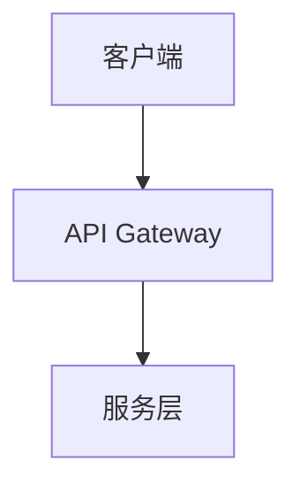

# 文档模板

> 标准化文档模板确保技术文档的一致性、可维护性与可追溯性。所有模板均遵循「一页原则」：核心信息在一屏内可见，详细内容通过链接展开。

## 模板目录

| 模板 | 用途 | 适用场景 |
|------|------|----------|
| [ARCHITECTURE.md 统一模板](./ARCHITECTURE_TEMPLATE) | 架构决策文档 | 模块/系统级别架构描述 |
| [THEORY.md 统一模板](./THEORY_TEMPLATE) | 理论分析文档 | 算法、设计模式、原理分析 |
| [ADR 模板](#adr-决策记录模板) | 架构决策记录 | 关键技术决策的上下文与权衡 |
| [API 文档模板](#api-文档模板) | 接口规范文档 | 库/服务的公开 API 定义 |
| [技术方案模板](#技术方案模板) | 方案设计文档 | 功能实现前的技术方案 |
| [Incident Report 模板](#incident-report-模板) | 事故复盘文档 | 线上问题根因分析与改进 |

## 模板设计原则

### 1. 一致性

所有模板共享以下结构元素：

- **标准 Frontmatter**：`title`、`description`、`editLink`
- **版本信息**：文档版本号、最后更新日期
- **责任人**：作者、审阅者
- **状态标签**：草稿 / 审阅中 / 已批准 / 已废弃

### 2. 可搜索性

- 使用 Markdown 表格组织对比信息
- 关键术语使用代码块包裹
- 每个模板提供「快速导航」锚点列表

### 3. 可追溯性

- 重要决策链接到 ADR 编号
- 架构变更记录变更历史表格
- 引用外部资源提供永久链接

## ADR 决策记录模板

```markdown
---
title: "ADR-XXX: [决策标题]"
description: "[一句话描述决策内容]"
date: YYYY-MM-DD
status: proposed | accepted | deprecated | superseded by ADR-YYY
author: "作者名"
reviewer: "审阅者名"
---

# ADR-XXX: [决策标题]

## 上下文

[描述需要做出决策的背景、约束条件和业务需求]

## 决策

[明确陈述所做的决策]

## 备选方案

| 方案 | 优点 | 缺点 | 决策 |
|------|------|------|------|
| 方案 A | ... | ... | 未采纳，原因：... |
| 方案 B | ... | ... | 已采纳 |

## 影响

- [ ] 代码变更
- [ ] 架构变更
- [ ] 文档更新
- [ ] 团队培训
- [ ] 外部依赖

## 相关链接

- [相关 Issue](链接)
- [相关 ADR](链接)
```

## API 文档模板

```markdown
---
title: "[ModuleName] API 文档"
description: "[模块功能概述]"
---

# [ModuleName] API 文档

## 概述

[模块设计目标、核心职责]

## 安装

```bash
npm install [package-name]
```

## 核心 API

### `functionName(params)`

[功能描述]

**参数**

| 参数 | 类型 | 必填 | 默认值 | 说明 |
|------|------|------|--------|------|
| `param1` | `string` | ✅ | — | ... |
| `param2` | `number` | ❌ | `0` | ... |

**返回值**

| 类型 | 说明 |
|------|------|
| `Promise<Result>` | ... |

**示例**

```typescript
import { functionName } from '[package-name]'

const result = await functionName({ param1: 'value' })
```

**异常**

| 错误类型 | 触发条件 | 处理建议 |
|----------|----------|----------|
| `ValidationError` | 参数校验失败 | 检查参数格式 |

## 类型定义

```typescript
interface Options {
  param1: string
  param2?: number
}
```

## 变更日志

| 版本 | 日期 | 变更内容 |
|------|------|----------|
| 1.0.0 | YYYY-MM-DD | 初始版本 |

```

## 技术方案模板

```markdown
---
title: "[功能名] 技术方案"
description: "[一句话概括方案]"
date: YYYY-MM-DD
status: draft | review | approved
author: "作者"
---

# [功能名] 技术方案

## 背景与目标

[业务背景、用户痛点、预期目标]

## 需求范围

### 功能性需求

- [ ] FR-1: ...
- [ ] FR-2: ...

### 非功能性需求

| 维度 | 目标 | 优先级 |
|------|------|--------|
| 性能 | P95 < 200ms | P0 |
| 可用性 | 99.9% | P0 |

## 技术方案

### 方案选型

| 方案 | 说明 | 优点 | 缺点 |
|------|------|------|------|
| A | ... | ... | ... |
| B | ... | ... | ... |

### 推荐方案

[详细描述推荐方案的技术实现]

### 架构图



## 风险与应对

| 风险 | 可能性 | 影响 | 应对措施 |
|------|--------|------|----------|
| ... | 中 | 高 | ... |

## 里程碑

| 阶段 | 日期 | 交付物 |
|------|------|--------|
| 设计完成 | ... | 本文档 |
| 开发完成 | ... | PR |
| 上线 | ... | 生产环境 |

```

## Incident Report 模板

```markdown
---
title: "Incident Report: [事件标题]"
description: "[事件影响概述]"
date: YYYY-MM-DD
severity: P0 | P1 | P2 | P3
status: ongoing | resolved | postmortem
---

# Incident Report: [事件标题]

## 摘要

| 项目 | 内容 |
|------|------|
| 发生时间 | YYYY-MM-DD HH:MM (UTC+8) |
| 发现时间 | YYYY-MM-DD HH:MM (UTC+8) |
| 恢复时间 | YYYY-MM-DD HH:MM (UTC+8) |
| 持续时间 | X 分钟 |
| 影响范围 | [服务/用户群] |
| 严重级别 | P0/P1/P2/P3 |

## 事件时间线

| 时间 | 事件 | 操作人 |
|------|------|--------|
| HH:MM | [发生了什么] | [谁] |
| HH:MM | [采取了什么措施] | [谁] |

## 根因分析

[使用 5 Whys 方法逐层分析]

## 改进措施

| 措施 | 负责人 | 截止日期 | 状态 |
|------|--------|----------|------|
| ... | ... | ... | 待办 |

## 经验教训

[经验总结，避免类似问题]
```

## 模板使用规范

1. **复制后重命名**：不要在原模板上直接编辑，复制后根据实际内容命名
2. **删除示例内容**：模板中的 `[方括号内容]` 均为占位符，正式文档中必须替换
3. **保持简洁**：删除不适用的章节，不要留空标题
4. **版本控制**：重大变更更新文档版本号，保留变更历史
5. **交叉引用**：相关文档之间建立链接，形成知识网络

## 参考资源

- [Architecture Decision Records](https://adr.github.io/)
- [Markdown API Documentation Best Practices](https://github.com/PharkMillups/killer-readmes)
- [Google Technical Writing Guide](https://developers.google.com/tech-writing)
