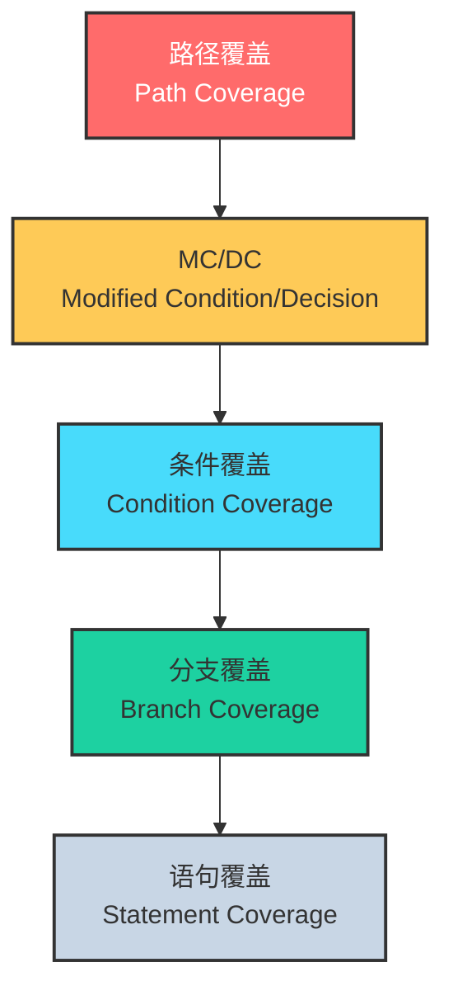
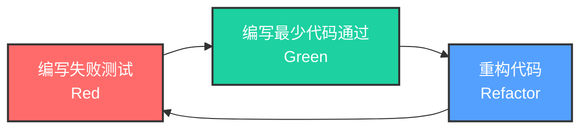
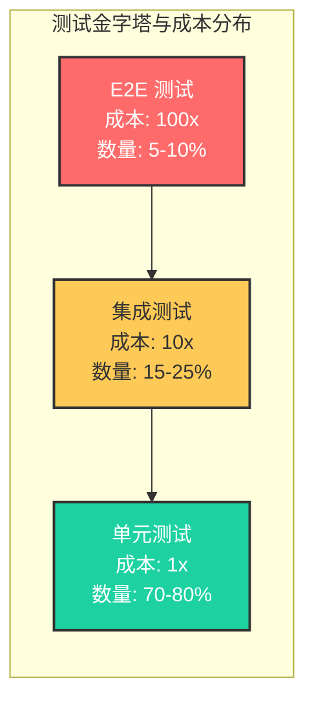

# 测试基础理论：从验证到确认

## 引言

软件测试是软件工程学科中最古老且最富争议的领域之一。自1960年代软件危机催生结构化程序设计以来，测试便从一种「调试后的补救活动」逐步演变为贯穿软件生命周期的系统性工程方法。Edsger W. Dijkstra 在《Notes on Structured Programming》中留下的名言——「程序测试只能证明缺陷存在，而不能证明缺陷不存在」——至今仍如警钟般悬于每一位测试工程师的头顶。这句话揭示了一个深刻的认识论问题：测试的本质不是「证实」（confirmation），而是「证伪」（falsification）。

在现代 JavaScript/TypeScript 生态中，测试的实践形态已极为丰富：从毫秒级完成的单元测试，到跨浏览器运行的端到端测试，再到基于属性的模糊测试。然而，工具的繁荣并未消解理论层面的根本问题——我们究竟在测试什么？测试能给我们带来何种确信？以及，如何在有限资源下做出最优的测试投资决策？

本文采用「理论严格表述」与「工程实践映射」的双轨结构，首先从形式化语义与认知科学角度剖析测试的理论根基，随后将这些理论映射到 JS/TS 生态的具体工具链与组织策略中，为构建高质量的测试体系奠定坚实的方法论基础。

## 理论严格表述

### 验证与确认的形式化分野

在软件工程的学术话语体系中，Verification（验证）与 Validation（确认）构成了一对核心概念，其区分最早可追溯至 Barry Boehm 的经典定义：

- **Verification**：「我们是否正确地构建了产品？」（Are we building the product right?）——关注软件实现与其规格说明之间的一致性，属于形式化方法、静态分析、类型检查与单元测试的范畴。
- **Validation**：「我们是否构建了正确的产品？」（Are we building the right product?）——关注软件产品是否满足用户的真实需求与业务目标，属于用户验收测试、A/B 测试、可用性测试与领域驱动设计的范畴。

从逻辑语义学的视角看，Verification 是一种「模型检测」（model checking）活动：给定形式化规约 $S$ 与实现 $I$，验证即判定 $I \models S$（实现满足规约）。而 Validation 则是一种「满足性判定」（satisfaction judgment），涉及利益相关者（stakeholders）的主观认知与外部世界的复杂语境，本质上不可完全形式化。

在类型论框架下，Verification 与类型系统高度重叠。一个通过 TypeScript 类型检查的程序，在编译期即完成了大量的 Verification 工作——类型系统作为轻量级的形式化规约，在「编译期」而非「运行期」排除了一大批不一致性。然而，类型系统对 Validation 几乎无能为力：类型正确的程序仍然可能计算错误的业务逻辑，例如将金额单位从「分」误作「元」，或对用户权限做出错误判断。

### 测试的完备性不可达性

Dijkstra 的论断——「Program testing can be used to show the presence of bugs, but never to show their absence」——并非修辞性的夸张，而是基于计算理论的严格结论。对于任何具有非平凡控制流（即包含条件分支或循环）的程序，其输入空间 $D$ 通常是无限的或天文数字般庞大。设程序 $P$ 的输入域为 $D$，测试集 $T \subset D$，则：

$$\forall x \in T: P(x) = \text{expected} \nRightarrow \forall x \in D: P(x) = \text{expected}$$

这一结论与 Popper 的证伪主义科学哲学同构：我们只能经由反例推翻全称命题，而无法经由有限例证证实全称命题。因此，测试工程的核心问题不是「如何穷尽测试」，而是「如何在有限资源下最大化测试的信息价值」。

Halting Problem 的不可判定性进一步加深了这一困境：不存在通用算法能判定任意程序是否会在所有输入上终止，更遑论判定其正确性。这意味着静态分析与动态测试均面临理论上的天花板，迫使工程实践必须引入「近似」、「抽象」与「概率性保证」等策略。

### 测试覆盖率的理论模型

覆盖率（code coverage）是度量测试集 $T$ 对程序 $P$ 的「触及程度」的指标族。从形式化角度，不同覆盖率准则定义了不同的「测试充分性条件」：

**1. 语句覆盖（Statement Coverage）**

要求测试集 $T$ 使得程序中每一条可执行语句至少被执行一次。形式化地，设程序的控制流图（CFG）节点集合为 $N$，语句覆盖要求：

$$\forall n \in N, \exists t \in T: \text{exec}(P, t) \text{ visits } n$$

语句覆盖是最弱的覆盖准则，其缺陷显而易见：一条缺少 `else` 分支的 `if` 语句可以 100% 语句覆盖，却完全未验证假分支的行为。例如：

```typescript
function calculateDiscount(price: number, isVIP: boolean): number {
  if (isVIP) {
    return price * 0.8;
  }
  return price; // 缺少 else 分支的显式处理
}
```

仅测试 `isVIP = true` 即可达到 100% 语句覆盖，但 `isVIP = false` 的情况可能隐藏着严重错误。

**2. 分支覆盖 / 判定覆盖（Branch / Decision Coverage）**

要求每个判定（decision）的真假分支均被至少执行一次。设程序 CFG 的边集合为 $E$，分支覆盖要求：

$$\forall e \in E, \exists t \in T: \text{exec}(P, t) \text{ traverses } e$$

分支覆盖消除了语句覆盖的部分盲区，但仍不足以暴露复杂判定中的错误。例如判定 `(a && b)`，分支覆盖仅要求整体为真/假各一次，却不要求 `a` 和 `b` 的所有独立组合。

**3. 条件覆盖（Condition Coverage）**

要求每个原子条件（atomic condition）取真、假各至少一次。对于判定 `(a || b && c)`，条件覆盖要求 `a`、`b`、`c` 分别取过真假值。然而，条件覆盖不保证判定的所有结果组合都被覆盖。

**4. 修正条件/判定覆盖（MC/DC, Modified Condition/Decision Coverage）**

MC/DC 是航空电子软件标准 DO-178B/C 所要求的最高级别覆盖准则，其核心要求是：对于每个原子条件 $C_i$，存在两个测试用例，它们对 $C_i$ 的赋值相反，而对其余条件的赋值相同，且这两个用例导致判定的整体结果不同。MC/DC 的形式化定义确保了每个原子条件独立地影响判定结果，从而在保证测试可行性的同时，提供了接近路径覆盖的缺陷检测能力。

**5. 路径覆盖（Path Coverage）**

要求程序中所有可能的执行路径均被至少执行一次。设 CFG 的环路复杂度为 $V(G)$，路径覆盖要求遍历所有路径。对于包含循环的程序，路径数可能是无限的，因此路径覆盖在实际中不可行，通常退化为「循环边界内的有限路径覆盖」。

下表总结了各覆盖准则的强度关系：

| 覆盖准则 | 强度 | 可行性 | 主要应用场景 |
|---------|------|--------|-------------|
| 语句覆盖 | 最弱 | 极易 | 快速冒烟测试 |
| 分支覆盖 | 较弱 | 容易 | 一般业务代码 |
| 条件覆盖 | 中等 | 中等 | 复杂布尔逻辑 |
| MC/DC | 强 | 较难 | 航空、汽车、医疗 |
| 路径覆盖 | 最强 | 通常不可行 | 关键安全模块（受限） |

### 测试 Oracle 问题

测试 Oracle 问题是软件测试理论中最深刻的问题之一。给定输入 $x$ 和程序输出 $y = P(x)$，如何判定 $y$ 是否正确？理想的 Oracle 是一个能自动判定输出正确性的判定程序，但在一般情况下，Oracle 的构造与程序正确性证明同等困难。

在工程实践中，常见的 Oracle 策略包括：

1. **规范 Oracle**：依据需求文档或形式化规约手工构造预期输出。
2. **衍生 Oracle**：利用程序属性（如交换律、幂等性、逆运算）自动生成预期。例如，对加密函数 $E$ 和解密函数 $D$，可验证 $D(E(x)) = x$。
3. **差分 Oracle**：比较多个独立实现（如新旧版本、不同算法）的输出一致性。
4. **统计 Oracle**：在机器学习系统中，使用 AUC、F1 分数等统计指标作为近似 Oracle。
5. **人工 Oracle**：依赖测试人员或领域专家的人工判断。

Oracle 问题的存在意味着：即使我们拥有完美的测试输入生成能力，仍然可能因「不知道正确答案」而无法判定测试是否通过。

### 测试与类型系统的互补性

类型系统与动态测试在程序正确性保障中扮演互补角色。Phil Wadler 的著名命题——「Well-typed programs cannot go wrong」——强调了类型系统的保证能力，但这里的 "go wrong" 特指类型错误（如将整数当作函数调用），而非业务逻辑错误。

类型系统擅长 Verification：
- 在编译期排除空指针解引用（`strictNullChecks`）
- 保证 API 契约的语法层面一致性（接口形状匹配）
- 通过泛型与条件类型表达高阶抽象约束

动态测试擅长 Validation 与 Verification 的补集：
- 验证业务逻辑的计算正确性
- 检测并发与状态相关的时序错误
- 发现类型系统无法表达的系统级集成缺陷

在 TypeScript 生态中，二者的协同尤为明显。TypeScript 的类型系统消除了大量 JavaScript 运行时的「类型错误」，使得测试可以更加聚焦于行为正确性而非防御性类型检查。换言之，TypeScript 将测试的「注意力预算」从低层次的类型安全转移到高层次的业务逻辑验证上。

### 测试金字塔的成本模型

Mike Cohn 提出的测试金字塔（Test Pyramid）不仅是一种组织策略，更是一种成本-收益的经济学模型。设单元测试、集成测试、E2E 测试的单位成本分别为 $C_u$、$C_i$、$C_e$，单位缺陷发现能力分别为 $E_u$、$E_i$、$E_e$，则最优测试组合应满足：

$$\text{Maximize } \sum_k N_k \cdot E_k \quad \text{subject to} \quad \sum_k N_k \cdot C_k \leq B$$

其中 $B$ 为总预算。实践经验表明，典型成本比约为 $C_u : C_i : C_e = 1 : 10 : 100$，而执行时间比可能达到 $1 : 100 : 10000$。因此，金字塔结构（大量单元测试 + 适量集成测试 + 少量 E2E 测试）是预算约束下的帕累托最优解。

然而，测试金字塔并非普适真理。在微服务架构中，由于服务间契约复杂，集成测试的比例可能显著上升，形成「测试钻石」甚至「测试沙漏」结构。在数据密集型应用中，E2E 测试的 ROI 可能更高，因为数据管道的错误往往只能在端到端场景中被发现。

## 工程实践映射

### JavaScript 测试生态全景

JavaScript/TypeScript 的测试生态经历了从「百花齐放」到「双雄并立」的演化。当前主流测试框架包括：

**Jest**：由 Meta（Facebook）开发，基于 Jasmine 演进而来，是目前 npm 下载量最高的测试框架。Jest 的核心理念是「零配置」（zero-config philosophy），内置了断言库（expect）、Mock 系统、覆盖率报告和快照测试。Jest 采用基于 VM 的隔离机制，每个测试文件在独立的 Node.js VM 上下文中运行，天然防止全局状态污染。

**Vitest**：由 Vite 团队开发，专为 Vite 生态优化的下一代测试框架。Vitest 与 Jest 的 API 高度兼容（`describe`、`it`、`expect` 的用法几乎一致），但底层基于 Vite 的 Dev Server 构建，支持原生 ESM、TypeScript（无需预编译）和极快的热重载（HMR）。Vitest 的默认配置与现代前端工具链无缝衔接，成为 Vite 项目的首选测试框架。

**Mocha**：最古老的 Node.js 测试框架之一（2011年发布），采用「 batteries not included 」设计哲学，仅提供测试运行器核心，断言、Mock、覆盖率等功能需通过外部库（Chai、Sinon、nyc）组合。Mocha 的灵活性使其在定制需求高的场景中仍有不可替代的地位。

**Jasmine**：行为驱动开发（BDD）的先驱框架，其 `describe`/`it` 语法深刻影响了后续所有 JS 测试框架的设计。Jasmine 内置断言和 Spy 机制，无需额外依赖，在 Angular 项目中长期作为默认测试框架。

**AVA**：以并发执行为核心卖点的测试框架，每个测试文件在独立进程中并行运行，充分利用多核 CPU。AVA 的断言库支持 Observable 和 Promise 的原生测试，适合 IO 密集型应用的测试场景。

**Node.js Test Runner（node:test）**：自 Node.js 18 起内置的官方测试运行器，基于 TAP（Test Anything Protocol）输出格式。虽然功能尚不如 Jest/Vitest 完善，但「零依赖」特性使其在工具库和 CLI 项目中越来越受欢迎。

### 测试金字塔在 JS 项目中的实践

在现代前端/全栈项目中，测试金字塔的具体形态通常为：

- **单元测试（70-80%）**：测试纯函数、工具类、自定义 Hooks、Redux/Vuex 的 reducer/store。
- **集成测试（15-25%）**：测试 React/Vue 组件树（配合 React Testing Library 或 Vue Test Utils）、API 路由（配合 Supertest）、数据库访问层。
- **E2E 测试（5-10%）**：测试关键用户旅程（critical user journeys），如登录-下单-支付流程、核心表单提交流程。

以典型的 Next.js 全栈应用为例，测试分布可能如下：

```typescript
// 单元测试示例：纯业务逻辑函数
// utils/pricing.test.ts
import { calculateTotal } from './pricing';

describe('calculateTotal', () => {
  it('应正确计算含税总价', () => {
    const items = [{ price: 100, quantity: 2 }, { price: 50, quantity: 1 }];
    expect(calculateTotal(items, 0.1)).toBe(275); // (200 + 50) * 1.1
  });

  it('空购物车应返回 0', () => {
    expect(calculateTotal([], 0.1)).toBe(0);
  });
});
```

在 CI 流水线中，这三层测试应分层执行：单元测试在每次 commit 时运行（< 30 秒），集成测试在 PR 合并前运行（< 5 分钟），E2E 测试在每日构建或预发布阶段运行（< 30 分钟）。这种分层策略确保了反馈速度与覆盖深度的平衡。

### 测试驱动开发（TDD）的红绿重构循环

TDD 由 Kent Beck 在极限编程（Extreme Programming）中系统化提出，其核心是「测试优先」的短周期循环：

1. **红（Red）**：编写一个失败的测试。该测试应聚焦于一个微小行为增量，且失败理由明确（通常是「功能未实现」而非「测试本身有误」）。
2. **绿（Green）**：编写「刚好足够」的生产代码使测试通过。此时允许「丑陋但正确」的实现，目标是最快获得反馈。
3. **重构（Refactor）**：在不改变外部行为的前提下，改善代码的内部结构。消除重复、优化命名、降低耦合。

TDD 的理论价值不仅在于缺陷预防，更在于它作为一种「设计方法」的功能。TDD 强制开发者从「调用者视角」思考接口设计，天然产生高内聚、低耦合的模块。在 TypeScript 中，TDD 与类型设计可以协同：先写测试定义期望的行为契约，再定义类型接口，最后实现具体逻辑。

```typescript
// TDD 示例：开发一个带重试逻辑的 HTTP 客户端
// http-client.test.ts
import { describe, it, expect, vi } from 'vitest';
import { HttpClient } from './http-client';

describe('HttpClient', () => {
  it('应在请求失败时自动重试最多3次', async () => {
    const fetchMock = vi.fn()
      .mockRejectedValueOnce(new Error('Network error'))
      .mockRejectedValueOnce(new Error('Network error'))
      .mockResolvedValueOnce({ ok: true, json: async () => ({ data: 'ok' }) });

    const client = new HttpClient({ retries: 3, fetch: fetchMock });
    const result = await client.get('/api/data');

    expect(fetchMock).toHaveBeenCalledTimes(3);
    expect(result).toEqual({ data: 'ok' });
  });
});
```

### 行为驱动开发（BDD）的 Given-When-Then

BDD 由 Dan North 提出，旨在弥合技术人员与非技术人员之间的沟通鸿沟。BDD 使用自然语言风格的 Given-When-Then 结构描述行为：

- **Given**：系统所处的初始上下文或前置条件。
- **When**：用户或系统触发的动作。
- **Then**：期望观察到的可验证结果。

在 JavaScript 生态中，Jest/Cucumber.js 等工具支持 BDD 风格的测试组织：

```typescript
// BDD 风格测试示例
// features/checkout.feature (配合 Cucumber.js)
// Feature: 购物车结算
//   Scenario: 会员用户享受折扣
//     Given 用户已登录且为 VIP 会员
//     And 购物车中有总价 1000 元的商品
//     When 用户提交订单
//     Then 应付金额应为 800 元

// 对应的 step definitions
import { Given, When, Then } from '@cucumber/cucumber';
import { expect } from 'vitest';

Given('用户已登录且为 VIP 会员', async function () {
  this.user = await createVIPUser();
  this.authToken = await login(this.user);
});

Given('购物车中有总价 {int} 元的商品', async function (total: number) {
  this.cart = await addItemsToCart(this.user, total);
});

When('用户提交订单', async function () {
  this.order = await submitOrder(this.cart, this.authToken);
});

Then('应付金额应为 {int} 元', function (expected: number) {
  expect(this.order.total).toBe(expected);
});
```

BDD 的真正价值不在测试自动化本身，而在于它作为一种「活的文档」（living documentation）和「领域知识对齐工具」的功能。通过将业务规则编码为可执行的规格说明，BDD 确保了技术实现与业务意图的持续一致性。

### 测试文件组织策略

JavaScript 项目中的测试文件组织主要有三种模式：

**1. `__tests__` 目录模式**

将测试文件集中存放在与源码目录平行的 `__tests__` 目录中，或源码目录内部的 `__tests__` 子目录中。这是 Jest 的默认识别模式。

```
src/
  utils/
    formatDate.ts
    __tests__/
      formatDate.test.ts
  components/
    Button.tsx
    __tests__/
      Button.test.tsx
```

**2. `*.test.ts` 并列模式**

测试文件与源码文件位于同一目录，通过 `.test.ts` 后缀区分。这是许多现代项目的首选，因为：
- 导入路径简短（`./helper` 而非 `../../src/utils/helper`）
- 源码与测试的对应关系一目了然
- 重构时移动目录可同时移动测试

```
src/
  utils/
    formatDate.ts
    formatDate.test.ts
  components/
    Button.tsx
    Button.test.tsx
```

**3. `*.spec.ts` 模式**

`.spec.ts` 后缀与 `.test.ts` 功能等效，差异主要在语义偏好：
- `.test.ts` 强调「测试」活动本身
- `.spec.ts` 强调「规格说明」（specification），与 BDD 理念更契合

在 Vitest 配置中，可以通过 `test.include` 自定义匹配模式：

```typescript
// vitest.config.ts
import { defineConfig } from 'vitest/config';

export default defineConfig({
  test: {
    include: ['src/**/*.test.ts', 'src/**/*.spec.ts'],
    exclude: ['node_modules', 'dist', '.idea', '.git', '.cache'],
  },
});
```

对于大型单体仓库（monorepo），建议采用统一的测试文件命名约定，并在每个包的 `package.json` 中定义 `test` 脚本，通过根目录的 `pnpm test --filter ...` 或 `turbo run test` 实现测试的并行执行与缓存。

## Mermaid 图表

### 测试覆盖率层次关系图



### TDD 红绿重构循环



### 测试金字塔成本模型



## 理论要点总结

1. **验证（Verification）与确认（Validation）构成测试的双重维度**：Verification 回答「我们是否正确地构建产品」，可通过形式化方法和自动化测试逼近；Validation 回答「我们是否构建正确的产品」，本质涉及利益相关者的主观判断。

2. **测试完备性在理论上不可达**：基于 Dijkstra 的论断和计算理论的基本结果，有限测试集无法证明程序无缺陷。测试的工程目标是在预算约束下最大化信息价值，而非追求不可能的完美覆盖。

3. **覆盖率准则是测试充分性的近似度量**：从语句覆盖到路径覆盖，准则强度递增但可行性和成本递减。MC/DC 在工业安全关键系统中提供了强度与可行性的最佳平衡。

4. **类型系统与动态测试形成互补保障**：TypeScript 的类型系统在编译期承担了大量 Verification 工作，使测试资源得以聚焦于业务逻辑的行为验证。二者协同构建了深度防御体系。

5. **测试金字塔是成本约束下的经济学最优解**：单元测试、集成测试、E2E 测试的单位成本差异可达两个数量级。金字塔结构（大量底层测试 + 少量顶层测试）是在有限资源下最大化缺陷发现率的帕累托最优策略。

## 参考资源

1. Dijkstra, E. W. (1972). *Notes on Structured Programming*. In *Structured Programming* (Dahl, Dijkstra, Hoare). Academic Press. 该著作不仅奠定了结构化程序设计的理论基础，更包含了测试完备性不可达性的经典论断。

2. Myers, G. J., Sandler, C., & Badgett, T. (2011). *The Art of Software Testing* (3rd ed.). Wiley. 软件测试领域的经典教材，系统阐述了测试原则、用例设计方法和测试管理策略。

3. Beck, K. (2002). *Test-Driven Development: By Example*. Addison-Wesley. TDD 方法论的奠基之作，通过完整的代码示例展示了红绿重构循环的运作机制。

4. Meszaros, G. (2007). *xUnit Test Patterns: Refactoring Test Code*. Addison-Wesley. 测试模式领域的权威参考，详细分类了测试异味（test smells）与重构模式，提供了超过 70 种具体的测试模式。

5. Cohn, M. (2009). *Succeeding with Agile: Software Development Using Scrum*. Addison-Wesley. 首次系统阐述了测试金字塔概念，并将其置于敏捷开发的语境中讨论。
