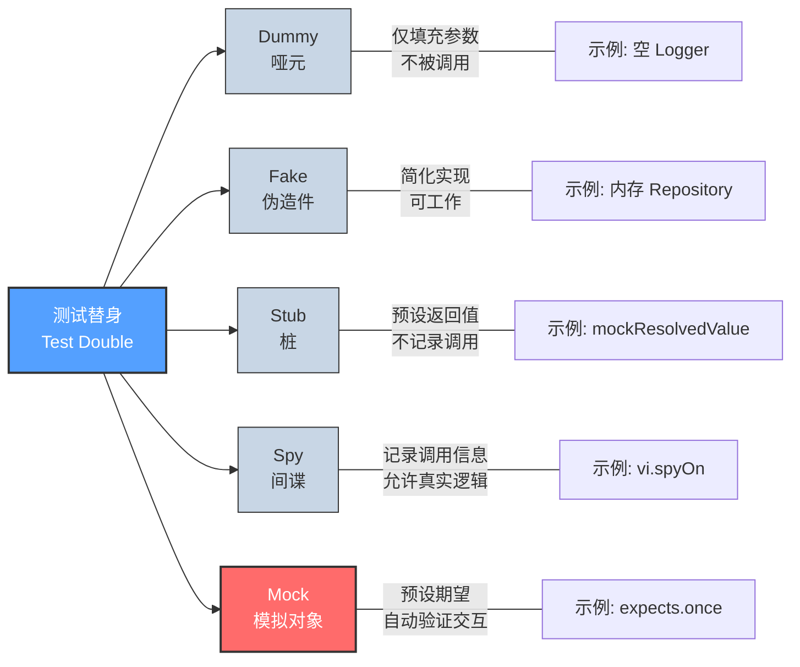
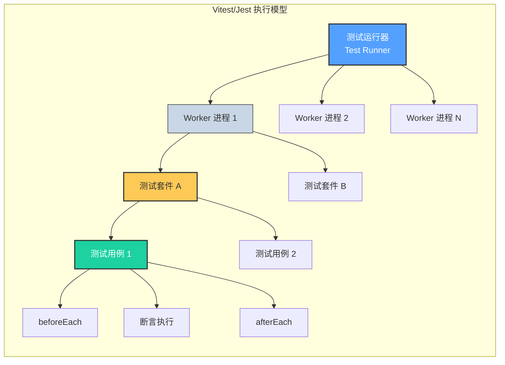

# 单元测试深度：隔离与确定性

## 引言

单元测试（Unit Testing）是软件测试体系的基石，也是开发者在日常工作中接触最频繁的测试层级。一个设计良好的单元测试套件能够在数秒内提供关于代码健康度的精确反馈，使开发者敢于重构、勇于交付。然而，「写单元测试」与「写好单元测试」之间存在巨大的鸿沟——许多团队的单元测试沦为「为了覆盖率而写的脆弱代码」，不仅未能提升质量，反而成为维护负担。

单元测试的核心挑战在于「隔离」（isolation）。被测单元（unit under test）必须与其依赖项——数据库、网络服务、文件系统、时钟、随机数生成器——彻底解耦，否则测试将丧失两大根本属性：**确定性**（determinism，相同输入始终产生相同结果）和**速度**（speed，毫秒级执行）。失去了确定性的测试是不可靠的；失去了速度的测试则不会被频繁运行，从而丧失了作为「安全网」的价值。

本文从 FIRST 原则的理论根基出发，深入剖析测试替身的分类学与适用场景，随后全面映射到 Jest/Vitest 的工程实践：配置策略、Mock 系统、异步测试、快照测试、参数化测试与覆盖率阈值。目标是为 JavaScript/TypeScript 开发者提供一套可立即落地的单元测试方法论。

## 理论严格表述

### FIRST 原则的形式化解读

Gerard Meszaros 在《xUnit Test Patterns》中提出的 FIRST 原则——Fast, Isolated, Repeatable, Self-validating, Timely——构成了评估单元测试质量的五维框架。

**Fast（快速）**：单元测试的执行时间应控制在毫秒级别。从排队论的角度，若开发者每次保存文件后需等待超过 10 秒才能获得反馈，其「测试-编码」循环的心流状态将被打破。设测试套件大小为 $N$，执行时间为 $T(N)$，则线性增长 $T(N) = O(N)$ 是可接受的，但超线性增长（如因全局设置导致的 $O(N^2)$）将迅速使大型套件失效。

**Isolated（隔离）**：每个测试应独立于其他测试，且独立于外部环境。形式化地，对于测试 $t_1, t_2$，其执行顺序不应影响结果：

$$\forall t_1, t_2: \text{result}(t_1 \circ t_2) = \text{result}(t_2 \circ t_1) = \text{result}(t_1) \land \text{result}(t_2)$$

隔离的破坏源通常包括：共享的可变状态（全局变量、单例模式）、外部系统（数据库、文件系统）、以及非确定性因素（时间、随机数、并发）。

**Repeatable（可重复）**：在任何环境、任何时间运行，结果应保持一致。可重复性依赖于确定性的输入-输出映射：给定相同的预置条件（pre-state），测试应始终到达相同的后置条件（post-state）。不可重复的测试（flaky tests）是 CI/CD 流水线的头号杀手，会侵蚀团队对测试体系的信任。

**Self-validating（自我验证）**：测试应通过布尔输出（通过/失败）明确告知结果，而不应依赖人工检查日志或输出文件。自我验证要求每个测试包含明确的断言（assertion），且断言失败时应提供足够的问题定位信息。

**Timely（及时）**：测试应在生产代码之前或同时编写（TDD），最晚不应延迟到缺陷发现之后。延迟编写的测试往往面临「代码不可测试」的困境——如果代码在设计时未考虑可测试性，后续补写测试的成本将指数级增长。

### 测试替身的分类学

Martin Fowler 在《Mocks Aren't Stubs》中澄清了测试替身（test doubles）家族的概念混淆。在 Meszaros 的严格分类中，测试替身包括五种类型：

**Dummy（哑元）**：仅用于填充参数列表，本身不会被使用。例如，一个需要 `Logger` 参数但测试不关心日志的构造函数：

```typescript
const dummyLogger = {} as Logger;
const service = new UserService(dummyLogger);
```

**Fake（伪造件）**：具有真实实现但采用简化策略的替代品。例如，使用内存中的 `Map` 替代真实的数据库连接：

```typescript
class FakeUserRepository implements UserRepository {
  private users = new Map<string, User>();

  async findById(id: string): Promise<User | null> {
    return this.users.get(id) ?? null;
  }

  async save(user: User): Promise<void> {
    this.users.set(user.id, user);
  }
}
```

Fake 的关键特征是「可工作但简化」——它实现了相同的接口，但牺牲了持久性、并发安全或性能等特性。

**Stub（桩）**：为特定测试场景预设响应的固定返回值对象。Stub 不记录调用信息，仅提供预配置的答案：

```typescript
const stubRepository = {
  findById: vi.fn().mockResolvedValue({ id: '1', name: 'Alice' }),
} as unknown as UserRepository;
```

**Spy（间谍）**：包裹真实对象并记录其被调用方式（调用次数、参数、返回值）的替身。Spy 允许被测代码执行真实逻辑，同时提供观察能力：

```typescript
const spyConsole = vi.spyOn(console, 'error').mockImplementation(() => {});
// 执行被测代码...
expect(spyConsole).toHaveBeenCalledWith('Invalid user ID');
spyConsole.mockRestore();
```

**Mock（模拟对象）**：预编程了期望接收的调用序列，并在实际调用与期望不符时自动失败的替身。Mock 不仅替代依赖，还充当「断言」的角色：

```typescript
const mockEmailService = vi.fn();
mockEmailService.expects('sendWelcomeEmail').withArgs('alice@example.com').once();
```

Fowler 的核心洞见在于：Mock 与 Stub 的根本差异不在技术实现，而在「测试风格」。使用 Stub 的测试属于「状态验证」（state verification）——断言被测对象执行后的最终状态；使用 Mock 的测试属于「行为验证」（behavior verification）——断言被测对象与其协作者（collaborators）的交互方式。

### 依赖注入与可测试性

依赖注入（Dependency Injection, DI）是提升可测试性的首要设计原则。其核心思想是：对象不应自行创建其依赖，而应由外部注入。从类型论的角度，DI 将隐式的「对象构造」依赖转化为显式的「函数参数」依赖，使测试者能够方便地替换为测试替身。

不可测试代码的典型反模式包括：

1. **硬编码依赖**：在函数内部直接 `new DatabaseConnection()` 或 `import { api } from './api'`。
2. **全局状态依赖**：直接访问 `process.env`、`Date.now()` 或全局单例。
3. **静态方法滥用**：静态方法难以被替换，尤其在 JavaScript 中无法对模块级别的函数进行无缝 Mock。

可测试设计的核心是将副作用（side effects）集中到边界层，使核心业务逻辑保持纯函数（pure function）形态。纯函数天然具备可测试性：给定输入，确定输出，无副作用。

```typescript
// 不可测试：硬编码依赖 + 全局状态
function processOrder(order: Order): Receipt {
  const db = new DatabaseConnection(process.env.DB_URL!); // 硬编码 + 环境依赖
  db.save(order);
  const total = order.items.reduce((s, i) => s + i.price, 0);
  return { orderId: order.id, total, timestamp: Date.now() }; // 非确定性
}

// 可测试：依赖注入 + 纯函数分离
function calculateTotal(items: OrderItem[]): number {
  return items.reduce((sum, item) => sum + item.price * item.quantity, 0);
}

interface OrderRepository {
  save(order: Order): Promise<void>;
}

async function processOrder(
  order: Order,
  repository: OrderRepository,
  timestamp: number
): Promise<Receipt> {
  await repository.save(order);
  const total = calculateTotal(order.items);
  return { orderId: order.id, total, timestamp };
}
```

### 等价类划分与边界值分析

等价类划分（Equivalence Partitioning）与边界值分析（Boundary Value Analysis）是黑盒测试用例设计的经典技术，在单元测试中同样适用。

**等价类划分**将输入域 $D$ 划分为若干互不相交的子集 $D_1, D_2, ..., D_n$，使得同一子集中的任意输入引发「等价」的程序行为。测试设计时只需从每个等价类中选取一个代表值，即可在最小化用例数量的同时最大化覆盖广度。

例如，对一个接受年龄参数并返回票价等级的函数：

- $D_1 = [0, 5)$：免费（婴幼儿）
- $D_2 = [5, 18)$：儿童票
- $D_3 = [18, 60)$：成人票
- $D_4 = [60, \infty)$：老年票

从每个等价类选取一个代表值（如 2, 10, 30, 65）即可覆盖全部逻辑分支。

**边界值分析**是对等价类划分的补充：经验表明，缺陷在边界处出现的概率显著高于内部。因此，每个等价类的边界值（最小值、最大值、略小于最小值、略大于最大值）应作为测试重点。对于上述票价函数，边界值包括：`-1, 0, 4, 5, 17, 18, 59, 60`。

## 工程实践映射

### Jest/Vitest 的详细配置

Jest 与 Vitest 的配置文件（`jest.config.ts` / `vitest.config.ts`）提供了对测试运行行为的精细控制。以下是生产环境中常见的关键配置项：

**setupFiles 与 setupFilesAfterEnv**

`setupFiles` 在测试框架初始化之前执行，适用于全局 polyfill 或环境变量的设置；`setupFilesAfterEnv`（Jest）/ `setupFiles` 中的特定顺序（Vitest）在测试框架初始化之后、测试运行之前执行，适用于扩展断言库或配置全局 Mock：

```typescript
// jest.config.ts
import type { Config } from 'jest';

const config: Config = {
  preset: 'ts-jest',
  testEnvironment: 'node',
  setupFiles: ['<rootDir>/test/setup-env.ts'],        // 框架初始化前
  setupFilesAfterEnv: ['<rootDir>/test/setup-tests.ts'], // 框架初始化后
  moduleNameMapper: {
    '^@/(.*)$': '<rootDir>/src/$1',                  // 路径别名映射
    '^~/(.*)$': '<rootDir>/$1',
  },
  globals: {
    'ts-jest': {
      tsconfig: '<rootDir>/tsconfig.test.json',      // 测试专用 TS 配置
      diagnostics: { warnOnly: true },                // 类型错误不阻断测试
    },
  },
  clearMocks: true,                                   // 每次测试前清空 Mock
  restoreMocks: true,                                 // 每次测试后恢复 spy
};

export default config;
```

```typescript
// vitest.config.ts
import { defineConfig } from 'vitest/config';
import path from 'path';

export default defineConfig({
  test: {
    globals: true,                                    // 全局 describe/it/expect
    environment: 'jsdom',                             // 浏览器环境模拟
    setupFiles: ['./test/setup.ts'],
    include: ['src/**/*.test.ts'],
    coverage: {
      provider: 'v8',                                 // 使用 V8 内置覆盖率
      reporter: ['text', 'json', 'html'],
      thresholds: {
        statements: 80,
        branches: 75,
        functions: 80,
        lines: 80,
      },
    },
  },
  resolve: {
    alias: {
      '@': path.resolve(__dirname, './src'),
    },
  },
});
```

**moduleNameMapper 的深层原理**

`moduleNameMapper` 解决的是模块解析（module resolution）层面的问题。在 TypeScript 项目中，源码使用路径别名（`@/utils/helper`），但 Node.js 运行时无法直接识别这些别名。Jest 的 `moduleNameMapper` 通过正则替换将别名映射为相对路径；Vitest 则通过 Vite 的 `resolve.alias` 机制实现相同功能。这一映射必须在测试配置中显式声明，否则将触发 `Cannot find module '@/...'` 错误。

### Mock 策略全景

**自动 Mock（jest.mock / vi.mock）**

自动 Mock 拦截模块导入，将整个模块替换为 Mock 版本：

```typescript
import { vi } from 'vitest';
import { processPayment } from './payment';

// Vitest 自动 Mock
vi.mock('./stripe-api', () => ({
  charge: vi.fn().mockResolvedValue({ id: 'ch_123', status: 'succeeded' }),
  refund: vi.fn().mockResolvedValue({ id: 're_456' }),
}));

test('应成功处理支付', async () => {
  const result = await processPayment({ amount: 1000, currency: 'USD' });
  expect(result.success).toBe(true);
});
```

自动 Mock 的优势在于无需修改被测代码即可隔离依赖；劣势在于它隐藏了模块的实际接口，可能导致 Mock 与真实实现脱节（interface drift）。

**MSW（Mock Service Worker）**

MSW 在浏览器和 Node.js 环境中拦截 HTTP 请求，是 API 层 Mock 的首选方案。与直接 Mock `fetch` 或 `axios` 不同，MSW 在更低的网络层拦截请求，使得被测代码可以使用真实的 HTTP 客户端：

```typescript
// test/setup.ts
import { setupServer } from 'msw/node';
import { http, HttpResponse } from 'msw';

const handlers = [
  http.get('https://api.example.com/users/:id', ({ params }) => {
    return HttpResponse.json({ id: params.id, name: 'Mocked User' });
  }),
];

export const server = setupServer(...handlers);

// vitest.setup.ts
import { server } from './setup';
import { beforeAll, afterAll, afterEach } from 'vitest';

beforeAll(() => server.listen({ onUnhandledRequest: 'error' }));
afterEach(() => server.resetHandlers());
afterAll(() => server.close());
```

MSW 的核心理念是「将 Mock 视为基础设施」：通过集中式的 handler 定义，测试代码可以保持简洁，同时 Mock 定义可以被多个测试复用。

**Sinon**

Sinon 是一个专注于测试替身的独立库，提供 Spy、Stub 和 Mock 功能。在 Mocha/Chai 生态中，Sinon 是不可或缺的组合部件：

```typescript
import sinon from 'sinon';
import { expect } from 'chai';

const clock = sinon.useFakeTimers({ now: new Date('2026-01-01').getTime() });
const stub = sinon.stub(api, 'fetchData').resolves({ data: [] });
const spy = sinon.spy(console, 'log');

// 测试代码...

expect(stub.calledOnceWithExactly('/users')).to.be.true;
clock.restore();
```

### 异步代码测试

JavaScript 的异步特性使得单元测试必须处理 Promise、async/await、回调和定时器。Jest/Vitest 提供了完备的异步测试工具：

**Promise 与 async/await**

```typescript
describe('异步数据处理', () => {
  it('应正确解析异步数据', async () => {
    const result = await fetchUser('123');
    expect(result.name).toBe('Alice');
  });

  it('应在请求失败时抛出错误', async () => {
    vi.mocked(api.get).mockRejectedValue(new Error('Network failure'));
    await expect(fetchUser('999')).rejects.toThrow('Network failure');
  });

  it('应在超时后放弃请求', async () => {
    vi.useFakeTimers();
    const promise = fetchWithTimeout('/slow', 5000);
    vi.advanceTimersByTime(5000);
    await expect(promise).rejects.toThrow('Timeout');
    vi.useRealTimers();
  });
});
```

**定时器 Mock**

`vi.useFakeTimers()`（或 Jest 的 `jest.useFakeTimers()`）将 `setTimeout`、`setInterval`、`Date.now` 等置于测试控制之下。这消除了测试中真实等待的需求，将分钟级的等待压缩为毫秒级的快进：

```typescript
it('应在防抖延迟后执行搜索', () => {
  vi.useFakeTimers();
  const onSearch = vi.fn();
  const debouncedSearch = debounce(onSearch, 300);

  debouncedSearch('query');
  expect(onSearch).not.toHaveBeenCalled();

  vi.advanceTimersByTime(300);
  expect(onSearch).toHaveBeenCalledWith('query');
  vi.useRealTimers();
});
```

### 快照测试的最佳实践与陷阱

快照测试（snapshot testing）通过序列化测试输出并与预存基准文件对比，实现 UI 结构和数据结构的回归检测：

```typescript
it('应渲染用户信息卡片', () => {
  const { container } = render(<UserCard user={mockUser} />);
  expect(container.firstChild).toMatchSnapshot();
});
```

**最佳实践**：

1. **仅对稳定输出使用快照**：纯函数返回值、序列化的 API 响应、渲染的 DOM 结构。
2. **避免对动态内容使用快照**：时间戳、随机 ID、绝对路径等会导致快照频繁失效。
3. **将快照视为代码审查对象**：快照文件的 diff 应像代码 diff 一样被严格审查，而非盲目更新。
4. **使用内联快照**：对于小型输出，使用 `toMatchInlineSnapshot` 将预期值直接嵌入测试文件，提升可读性。

**常见陷阱**：

- **快照疲劳**：团队对大量快照失败习以为常，养成了 `-u`（update）不假思索的习惯，使快照测试沦为形式。
- **隐藏断言**：快照测试的「魔法」隐藏了真实的断言意图。相比 `expect(result).toMatchSnapshot()`，明确的 `expect(result.status).toBe('active')` 更具文档价值。
- **跨平台差异**：文件路径分隔符（`/` vs `\\`）、换行符（`\n` vs `\r\n`）可能导致快照在不同操作系统上不一致。

### 参数化测试

当多个测试用例遵循相同的执行结构但输入数据不同时，参数化测试（parameterized tests）可显著减少重复代码：

```typescript
// Vitest 的 test.each
import { describe, test, expect } from 'vitest';

describe('折扣计算', () => {
  test.each([
    { items: [{ price: 100, qty: 1 }], expected: 100, desc: '无折扣' },
    { items: [{ price: 100, qty: 5 }], expected: 450, desc: '5件9折' },
    { items: [{ price: 100, qty: 10 }], expected: 800, desc: '10件8折' },
    { items: [{ price: 100, qty: 20 }], expected: 1500, desc: '20件75折' },
  ])('$desc: 总价应为 $expected', ({ items, expected }) => {
    expect(calculateDiscountedTotal(items)).toBe(expected);
  });
});

// Jest 的 it.each 使用模板字符串语法
it.each`
  input    | expected | description
  ${'abc'} | ${3}     | ${'常规字符串'}
  ${''}    | ${0}     | ${'空字符串'}
  ${null}  | ${0}     | ${'null值'}
`('$description: length of "$input" should be $expected', ({ input, expected }) => {
  expect(getStringLength(input)).toBe(expected);
});
```

参数化测试不仅减少了代码重复，更重要的是将测试数据与测试逻辑分离，使边界条件和等价类的划分清晰可见。

### 测试覆盖率配置与阈值

覆盖率报告是度量测试充分性的重要工具，但不应成为唯一目标。Jest 使用 Istanbul 或 V8 覆盖率引擎，Vitest 默认使用 V8 引擎：

```typescript
// vitest.config.ts - 覆盖率阈值配置
export default defineConfig({
  test: {
    coverage: {
      provider: 'v8',
      include: ['src/**/*.ts'],
      exclude: [
        'src/**/*.d.ts',
        'src/**/*.test.ts',
        'src/types/**',
        'src/index.ts',      // 纯导出文件
      ],
      thresholds: {
        statements: 80,
        branches: 75,
        functions: 80,
        lines: 80,
      },
      // 强制阈值检查，不达标则 CI 失败
      reportsDirectory: './coverage',
      reporter: ['text-summary', 'lcov', 'html'],
    },
  },
});
```

**覆盖率策略建议**：

1. **分层阈值**：核心业务逻辑（如支付、权限）要求 90%+ 分支覆盖；工具函数要求 80%+；UI 组件可适当放宽。
2. **增量覆盖**：在大型遗留代码库中，对新代码实施「增量覆盖率」策略（如「新增代码必须 80%+ 覆盖」），避免为旧代码补写测试的巨坑。
3. **避免 100% 执念**：盲目追求 100% 覆盖率会诱导开发者编写「无意义测试」（如测试 getter/setter），反而降低测试质量。
4. **结合变异测试**：覆盖率只能说明「代码被执行过」，不能说明「代码被验证过」。变异测试（Mutation Testing）是覆盖率的必要补充。

## Mermaid 图表

### 测试替身分类与关系



### Mock 策略决策树

```mermaid
flowchart TD
    A[需要隔离外部依赖?] -->|是| B[依赖类型?]
    A -->|否| C[使用真实依赖]

    B -->|模块/函数| D[vi.mock<br/>jest.mock]
    B -->|HTTP API| E[MSW]
    B -->|数据库| F[Fake Repository<br/>SQLite 内存]
    B -->|定时器/随机数| G[vi.useFakeTimers<br/>mockRandom]

    D --> H[验证交互?<br/>Mock vs Stub]
    H -->|是| I[行为验证<br/>expect(mock).toHaveBeenCalled]
    H -->|否| J[状态验证<br/>expect(result).toBe]

    style A fill:#feca57,stroke:#333,stroke-width:2px
    style C fill:#1dd1a1,stroke:#333,stroke-width:2px,color:#fff
    style D fill:#54a0ff,stroke:#333,stroke-width:2px,color:#fff
    style E fill:#54a0ff,stroke:#333,stroke-width:2px,color:#fff
    style F fill:#54a0ff,stroke:#333,stroke-width:2px,color:#fff
    style G fill:#54a0ff,stroke:#333,stroke-width:2px,color:#fff
```

### 单元测试执行层次结构



## 理论要点总结

1. **FIRST 原则定义了单元测试的五维质量标准**：快速（Fast）保障反馈循环，隔离（Isolated）保障确定性，可重复（Repeatable）保障可信度，自我验证（Self-validating）保障自动化，及时（Timely）保障设计导向。

2. **测试替身家族各有明确的语义边界**：Dummy 填充参数，Fake 提供简化实现，Stub 预设返回值，Spy 记录调用，Mock 验证交互。混淆这些概念会导致测试风格混乱和维护困难。

3. **依赖注入是提升可测试性的首要设计原则**：通过将依赖从内部创建转为外部注入，测试者得以用替身替换真实依赖，从而实现隔离与确定性。

4. **等价类划分与边界值分析是测试用例设计的系统方法**：将无限输入域划分为有限等价类，并在边界处集中测试火力，是在有限资源下最大化缺陷发现率的有效策略。

5. **覆盖率是必要但不充分的测试质量指标**：高覆盖率不等于高信心。覆盖率的真正价值在于识别「从未被执行的代码」——这些代码几乎必然隐藏着未发现的缺陷。

## 参考资源

1. Fowler, M. (2007). [Mocks Aren't Stubs](https://martinfowler.com/articles/mocksArentStubs.html). 这篇博文澄清了 Mock 与 Stub 的根本差异，提出了「状态验证」与「行为验证」的经典二分法，是理解测试替身语义必读文献。

2. Meszaros, G. (2007). *xUnit Test Patterns: Refactoring Test Code*. Addison-Wesley. 本书系统提出了 FIRST 原则、测试异味分类和超过 70 种测试模式，被誉为单元测试领域的「设计模式圣经」。

3. Jest. (2025). [Jest Documentation](https://jestjs.io/docs/getting-started). Meta 维护的官方文档，涵盖了配置、Mock、快照、覆盖率等全部功能的详细说明。

4. Vitest. (2025). [Vitest Documentation](https://vitest.dev/guide/). Vite 团队维护的下一代测试框架文档，特别详述了与 Vite 生态的深度集成和原生 ESM 支持。

5. Freeman, S., & Pryce, N. (2009). *Growing Object-Oriented Software, Guided by Tests*. Addison-Wesley. 展示了如何在真实项目中运用 Mock 和依赖注入构建可测试的面向对象系统，特别强调了「从外部向内部」的 TDD 风格。
