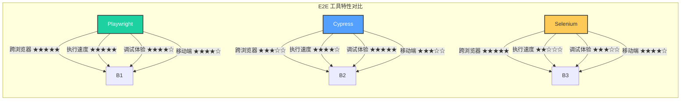
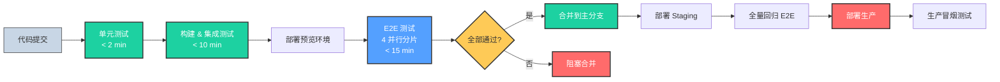
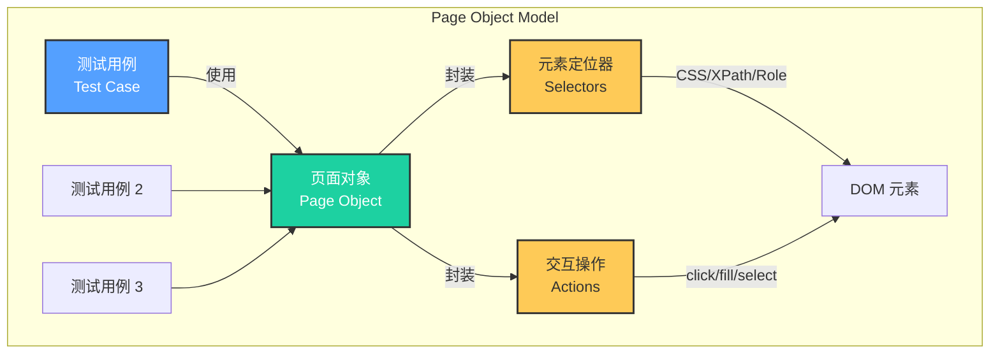

# E2E测试：从用户视角验证系统

## 引言

如果单元测试回答「每个零件是否正常工作」，集成测试回答「零件组装后是否协调」，那么端到端测试（End-to-End Testing, E2E）回答的则是「整辆车是否能安全地将乘客送达目的地」。E2E 测试从真实用户的视角出发，验证完整业务场景在真实（或高保真模拟）环境中的正确性——从用户在浏览器中输入 URL 开始，经过前端渲染、API 调用、数据库查询、第三方服务交互，直到最终响应呈现在用户眼前。

E2E 测试是测试金字塔的顶端，也是成本最高、反馈最慢的测试层级。一次 E2E 测试的执行时间可能相当于数千次单元测试的总和。然而，E2E 测试的不可替代性在于：它是唯一能够验证「系统作为整体满足用户期望」的测试层级。前端的状态管理错误、API 网关的配置失误、数据库索引的缺失、CDN 缓存策略的问题——这些在单元测试和集成测试中难以发现的缺陷，往往在 E2E 测试中无所遁形。

本文首先建立 E2E 测试的理论框架——黑盒测试的形式化定义、脆弱性（flakiness）的成因模型、Page Object Model 的设计模式——随后全面映射到 JavaScript/TypeScript 生态的工程实践：主流工具的深度对比、多浏览器测试策略、CI/CD 集成、视觉回归测试与环境管理。

## 理论严格表述

### E2E 测试的形式化定义

E2E 测试属于黑盒测试（black-box testing）范畴：测试者不了解（或不依赖）被测系统的内部实现，仅通过系统暴露的外部接口（UI、API、CLI）施加输入并验证输出。形式化地，设系统 $S$ 的输入空间为 $I$（用户操作序列），输出空间为 $O$（可观察的系统响应），则 E2E 测试是一组验证：

$$\forall (i, o_{expected}) \in T_{e2e}: S(i) = o_{expected}$$

与单元测试和集成测试相比，E2E 测试的输入空间 $I$ 极为庞大——它包含所有可能的用户操作序列（点击、输入、导航、滚动、拖拽、快捷键），且与系统的持久状态（数据库、缓存、本地存储）深度耦合。

E2E 测试的测试 oracle 问题尤为突出。在单元测试中，我们可以通过计算得出预期输出；在 E2E 测试中，「预期输出」往往涉及复杂的 UI 状态（元素存在性、文本内容、视觉样式、动画时序），其判定需要领域专家的人工判断或像素级对比算法。

### E2E 测试的脆弱性理论（Flakiness）

脆弱测试（flaky test）是指在不修改代码的情况下，相同测试用例时而通过、时而失败的现象。Google 的研究表明，超过 1.5% 的测试在大型代码库中具有脆弱性，而 E2E 测试的脆弱率远高于单元测试。脆弱性的主要成因包括：

**1. 时序依赖（Timing Dependencies）**

现代 Web 应用大量使用异步加载（AJAX、懒加载、骨架屏）、动画过渡和防抖/节流逻辑。E2E 测试如果依赖固定等待时间（`sleep(1000)`），将在不同机器负载和网络条件下表现不稳定。形式化地，设系统响应时间为随机变量 $R \sim D(\mu, \sigma^2)$，固定等待时间 $t$ 的通过概率为 $P(R < t)$，当 $\sigma^2$ 较大时，此概率将显著偏离 1。

**2. 共享状态污染（Shared State Pollution）**

E2E 测试通常共享同一个测试环境（数据库、浏览器 localStorage、服务端会话）。如果测试 $t_1$ 修改了全局状态而测试 $t_2$ 假设了不同的初始状态，执行顺序将影响结果。设全局状态为 $G$，测试执行顺序为 $\pi$，则脆弱性条件是：

$$\exists \pi_1, \pi_2: S_{\pi_1}(i) \neq S_{\pi_2}(i)$$

**3. 外部依赖不稳定（External Dependency Instability）**

第三方服务（支付网关、地图 API、验证码服务）的可用性和响应时间不可控。E2E 测试如果直接依赖这些外部服务，其稳定性将受制于服务提供商的 SLA。

**4. 非确定性渲染（Non-deterministic Rendering）**

React 的并发特性（Concurrent Features）、Vue 的异步更新队列、以及浏览器自身的渲染优化（如合成层、重排重绘调度）可能导致 DOM 的时序不可完全预测。例如，列表项的渲染顺序可能受数据加载的竞态条件影响。

**5. 环境敏感性（Environment Sensitivity）**

屏幕分辨率、系统字体、时区设置、浏览器插件、操作系统版本等因素均可能影响 E2E 测试的结果。视觉回归测试对此尤为敏感。

### Page Object Model 设计模式

Page Object Model（POM）是 Selenium 社区提出的经典设计模式，旨在将页面结构与测试逻辑分离。每个页面对象封装了该页面的元素定位器（selectors）和交互方法，测试脚本仅通过页面对象的 API 与系统交互。

POM 的核心价值在于「单一职责原则」的应用：当 UI 发生变化（如按钮从 `id="submit"` 改为 `data-testid="submit-btn"`），只需修改页面对象中的定位器，而无需修改数十个测试用例。

形式化地，设页面集合为 $P = \{p_1, p_2, ..., p_n\}$，每个页面 $p_i$ 具有元素集合 $E_i$ 和交互操作集合 $A_i$。页面对象是一个二元组 $(locator: E_i \to Selector, action: A_i \to TestCommand)$。测试脚本 $T$ 仅通过 $p_i.locator$ 和 $p_i.action$ 访问系统，不直接依赖底层选择器。

### 视觉回归测试的理论

视觉回归测试（Visual Regression Testing）检测 UI 的意外视觉变化。其理论基础是「像素对比」与「结构对比」两种方法：

**像素对比（Pixel Comparison）**：将当前渲染的截图与基准截图（baseline）进行像素级差异检测。常用的差异度量包括均方误差（MSE）和结构相似性指数（SSIM）。像素对比对微小的渲染差异极度敏感（如抗锯齿、字体渲染、GPU 驱动差异），容易产生误报。

**结构对比（Structural Comparison）**：基于 DOM 树或可访问性树（accessibility tree）进行结构比对，忽略纯视觉差异。这种方法更稳定，但无法检测 CSS 引起的布局错误。

现代视觉回归工具（如 Chromatic、Percy、Applitools）通常采用「智能对比」策略：在像素对比的基础上引入机器学习模型，区分「有意义的变更」（如按钮位置偏移）和「无意义的噪音」（如子像素渲染差异）。

### E2E 测试与 CI/CD 的集成模型

E2E 测试在 CI/CD 流水线中的定位需要精心设计。设部署流水线的阶段为 $S_1 \to S_2 \to ... \to S_n$，则 E2E 测试通常位于「预生产验证」（pre-production validation）阶段：

1. **Commit 阶段**：单元测试 + 静态分析（< 2 分钟）
2. **Build 阶段**：构建产物 + 集成测试（< 10 分钟）
3. **Staging 阶段**：E2E 测试 + 性能测试（< 30 分钟）
4. **Production 阶段**：金丝雀发布 + 生产监控

E2E 测试的 CI 集成面临两个核心挑战：

- **并行化**：串行执行的 E2E 套件在规模增长后将拖慢整个流水线。通过测试分片（sharding）和并行 worker 可以将执行时间控制在可接受范围。
- **环境一致性**：CI 环境中的浏览器版本、操作系统、屏幕分辨率必须与本地开发环境保持一致，否则将出现「本地通过、CI 失败」的困境。

## 工程实践映射

### Playwright vs Cypress vs Selenium vs Puppeteer

JavaScript 生态的 E2E 测试工具经历了从 Selenium 的垄断到多强竞争的格局。以下是四大主流工具的深度对比：

| 维度 | Playwright | Cypress | Selenium | Puppeteer |
|------|-----------|---------|----------|-----------|
| **开发方** | Microsoft | Cypress.io | Selenium Project | Google |
| **浏览器支持** | Chromium, Firefox, WebKit | Chromium, Firefox, WebKit (实验性) | 几乎所有浏览器 | Chromium only |
| **架构** | 基于 DevTools Protocol + 自定义代理 | 在浏览器内部运行 | WebDriver 协议 | DevTools Protocol |
| **执行环境** | Node.js 进程外控制 | 浏览器内部（iframe 限制） | 独立进程 | Node.js 进程外控制 |
| **多标签/多窗口** | 原生支持 | 有限支持 | 支持 | 支持 |
| **并行执行** | 内置 Test Runner + sharding | 需商业版 Cypress Cloud 或自行分片 | Selenium Grid | 自行实现 |
| **API 风格** | 命令式 + 异步 | 命令式 + 链式 | 面向对象 | 命令式 + 异步 |
| **调试体验** | Trace Viewer, Inspector | 实时重载, Time Travel | 基础 | DevTools |
| **跨域/iframe** | 原生支持 | 受限（同源策略） | 支持 | 支持 |
| **移动端模拟** | 设备模拟 + 触摸事件 | 视口模拟 | Appium 扩展 | 设备模拟 |
| **适用场景** | 现代 Web 应用, 跨浏览器 | 前端团队, 快速反馈 | 遗留系统, 多浏览器 | Chrome 扩展, 爬虫 |

**Playwright** 是当前技术最先进的 E2E 框架。其关键创新包括：

- **自动等待（Auto-waiting）**：所有操作（`click`、`fill`、`selectOption`）在执行前自动等待元素达到可操作状态（attached, visible, stable, enabled），彻底消除了时序相关的脆弱性。
- **Web-First Assertions**：`expect(locator).toHaveText('Submit')` 会自动轮询直到条件满足或超时，替代了脆弱的固定等待。
- **Trace Viewer**：测试失败时生成包含截图、DOM 快照、网络日志、控制台输出的 trace 文件，可在本地交互式回放。
- **Codegen**：通过录制用户操作自动生成测试代码。

```typescript
// Playwright 示例：完整的用户购买流程
import { test, expect } from '@playwright/test';

test.describe('用户购买流程', () => {
  test.beforeEach(async ({ page }) => {
    await page.goto('https://shop.example.com');
    await page.getByRole('button', { name: /登录/i }).click();
    await page.getByLabel(/邮箱/i).fill('user@example.com');
    await page.getByLabel(/密码/i).fill('password123');
    await page.getByRole('button', { name: /提交/i }).click();
    await expect(page.getByText(/欢迎回来/i)).toBeVisible();
  });

  test('应能完成完整的购买流程', async ({ page }) => {
    // 浏览商品
    await page.getByRole('link', { name: /商品列表/i }).click();
    await page.getByTestId('product-1').getByRole('button', { name: /加入购物车/i }).click();

    // 验证购物车更新
    await expect(page.getByTestId('cart-count')).toHaveText('1');

    // 进入结算
    await page.getByRole('link', { name: /购物车/i }).click();
    await page.getByRole('button', { name: /去结算/i }).click();

    // 填写地址
    await page.getByLabel(/收件人/i).fill('张三');
    await page.getByLabel(/手机号/i).fill('13800138000');
    await page.getByLabel(/详细地址/i).fill('北京市海淀区中关村');

    // 提交订单（Mock 支付）
    await page.getByRole('button', { name: /提交订单/i }).click();

    // 验证成功页面
    await expect(page.getByRole('heading', { name: /订单提交成功/i })).toBeVisible();
    await expect(page.getByTestId('order-status')).toHaveText('待支付');

    // 截图验证
    await expect(page).toHaveScreenshot('order-success.png', {
      maxDiffPixels: 100,
    });
  });

  test('库存不足时应阻止购买', async ({ page }) => {
    // 通过 API 将商品库存设为 0
    await page.request.post('/api/admin/set-stock', {
      data: { productId: 'product-1', quantity: 0 },
    });

    await page.reload();
    await page.getByRole('link', { name: /商品列表/i }).click();

    const button = page.getByTestId('product-1').getByRole('button', { name: /加入购物车/i });
    await expect(button).toBeDisabled();
    await expect(page.getByTestId('product-1').getByText(/缺货/i)).toBeVisible();
  });
});
```

**Cypress** 以其卓越的开发者体验著称。实时重载（live reload）、时间旅行调试（Time Travel Debugging）和自动截图/录屏功能使其成为前端开发者的首选快速反馈工具。然而，Cypress 的「在浏览器内部运行」架构带来了同源策略限制和 iframe 处理困难，在复杂的企业级应用中可能成为瓶颈。

```typescript
// Cypress 示例
describe('用户购买流程', () => {
  beforeEach(() => {
    cy.visit('/');
    cy.login('user@example.com', 'password123'); // 自定义命令
  });

  it('应能完成购买', () => {
    cy.get('[data-testid="product-1"]').find('button').contains('加入购物车').click();
    cy.get('[data-testid="cart-count"]').should('contain', '1');
    cy.get('a').contains('购物车').click();
    cy.get('button').contains('去结算').click();
    cy.get('input[name="name"]').type('张三');
    cy.get('button').contains('提交订单').click();
    cy.get('h1').should('contain', '订单提交成功');
  });
});
```

### Playwright 的多浏览器测试

Playwright 的三大浏览器引擎（Chromium、Firefox、WebKit）共享同一套测试代码，这是其相比 Selenium 的重大优势：

```typescript
// playwright.config.ts
import { defineConfig, devices } from '@playwright/test';

export default defineConfig({
  projects: [
    {
      name: 'chromium',
      use: { ...devices['Desktop Chrome'] },
    },
    {
      name: 'firefox',
      use: { ...devices['Desktop Firefox'] },
    },
    {
      name: 'webkit',
      use: { ...devices['Desktop Safari'] },
    },
    {
      name: 'Mobile Chrome',
      use: { ...devices['Pixel 5'] },
    },
    {
      name: 'Mobile Safari',
      use: { ...devices['iPhone 12'] },
    },
  ],
  // 测试分片：将测试套件分散到多个 CI worker
  shard: {
    total: 4,  // 总共 4 个分片
    current: parseInt(process.env.CI_NODE_INDEX || '1'),
  },
});
```

多浏览器测试的成本不可忽视：同一测试在三种浏览器中运行，执行时间将变为三倍。在实践中，建议对「关键用户旅程」（critical user journeys）运行全浏览器测试，对次要功能仅运行 Chromium 测试。

### E2E 测试的 CI 配置

以下是 GitHub Actions 中 Playwright E2E 测试的完整配置：

```yaml
# .github/workflows/e2e.yml
name: E2E Tests

on:
  push:
    branches: [main]
  pull_request:
    branches: [main]

jobs:
  e2e:
    timeout-minutes: 60
    runs-on: ubuntu-latest
    strategy:
      fail-fast: false
      matrix:
        shardIndex: [1, 2, 3, 4]
        shardTotal: [4]

    steps:
      - uses: actions/checkout@v4

      - name: Setup Node.js
        uses: actions/setup-node@v4
        with:
          node-version: '20'
          cache: 'npm'

      - name: Install dependencies
        run: npm ci

      - name: Install Playwright browsers
        run: npx playwright install --with-deps

      - name: Start test services
        run: docker-compose -f docker-compose.e2e.yml up -d

      - name: Run database migrations
        run: npm run db:migrate:test

      - name: Seed test data
        run: npm run db:seed:e2e

      - name: Run Playwright tests
        run: npx playwright test --shard=${{ matrix.shardIndex }}/${{ matrix.shardTotal }}
        env:
          BASE_URL: http://localhost:3000
          API_URL: http://localhost:4000

      - name: Upload test results
        if: always()
        uses: actions/upload-artifact@v4
        with:
          name: playwright-report-${{ matrix.shardIndex }}
          path: playwright-report/
          retention-days: 30

      - name: Upload test traces
        if: failure()
        uses: actions/upload-artifact@v4
        with:
          name: playwright-traces-${{ matrix.shardIndex }}
          path: test-results/
```

**关键设计决策**：

1. **矩阵分片（Matrix Sharding）**：将测试套件拆分为 4 个并行 job，每个 job 运行约 1/4 的测试，将总执行时间从 40 分钟压缩到 10 分钟。
2. **失败时保留 trace**：`if: failure()` 确保只有失败的测试才会上传 trace 文件，避免浪费存储空间。
3. **独立测试环境**：通过 Docker Compose 启动完整的服务栈，确保每个 CI 运行都在隔离环境中执行。
4. **测试数据种子**：在测试运行前通过 `db:seed:e2e` 注入确定性测试数据，避免测试因数据缺失而失败。

### 视觉回归测试

视觉回归测试通过截图对比检测 UI 的意外变化。以下是三大主流方案：

**Chromatic（Storybook 官方出品）**

Chromatic 与 Storybook 深度集成，自动捕获每个 story 的截图并进行云端对比：

```typescript
// .storybook/main.ts
const config = {
  stories: ['../src/**/*.stories.@(js|jsx|ts|tsx)'],
  addons: ['@chromatic-com/storybook'],
};

// CI 中执行
// npx chromatic --project-token=$CHROMATIC_TOKEN
```

**Percy（BrowserStack）**

Percy 提供了与 Playwright/Cypress 的集成 SDK：

```typescript
// Playwright + Percy
import { test } from '@playwright/test';
import percySnapshot from '@percy/playwright';

test('首页视觉回归', async ({ page }) => {
  await page.goto('/');
  await percySnapshot(page, 'Homepage');
});
```

**Playwright 内置截图对比**

Playwright 内置了轻量级的截图对比功能，无需第三方服务：

```typescript
test('按钮状态截图', async ({ page }) => {
  await page.goto('/components');
  const button = page.getByRole('button', { name: /提交/i });

  await expect(button).toHaveScreenshot('button-default.png');

  await button.hover();
  await expect(button).toHaveScreenshot('button-hover.png');

  await button.click();
  await expect(button).toHaveScreenshot('button-active.png');
});
```

截图对比的阈值配置至关重要：

```typescript
// playwright.config.ts
export default defineConfig({
  expect: {
    toHaveScreenshot: {
      maxDiffPixels: 50,      // 允许最多 50 像素差异
      threshold: 0.2,         // 差异像素的比例阈值
      animations: 'disabled', // 禁用 CSS 动画和过渡
    },
    toMatchSnapshot: {
      threshold: 0.2,
    },
  },
});
```

### E2E 测试数据管理

E2E 测试的数据管理策略直接影响测试的稳定性和可维护性：

**Fixtures（固定数据集）**

预定义的测试数据集，在测试运行前注入系统：

```typescript
// tests/fixtures/users.ts
export const standardUser = {
  id: 'user-001',
  email: 'standard@example.com',
  password: 'Test@1234',
  role: 'user',
  profile: {
    name: '标准用户',
    avatar: '/avatars/default.png',
  },
};

export const adminUser = {
  id: 'user-999',
  email: 'admin@example.com',
  password: 'Admin@5678',
  role: 'admin',
  profile: {
    name: '管理员',
    avatar: '/avatars/admin.png',
  },
};
```

**Fixtures Factory（动态数据工厂）**

使用工厂模式动态生成测试数据，避免硬编码导致的数据冲突：

```typescript
// tests/fixtures/factories.ts
import { faker } from '@faker-js/faker';

export function createUserFactory(overrides?: Partial<User>) {
  return {
    id: faker.string.uuid(),
    email: faker.internet.email(),
    password: faker.internet.password(),
    role: 'user' as const,
    profile: {
      name: faker.person.fullName(),
      avatar: faker.image.avatar(),
    },
    ...overrides,
  };
}

// 测试中使用
test('新用户应能注册', async ({ page, request }) => {
  const newUser = createUserFactory();

  await page.goto('/register');
  await page.getByLabel(/邮箱/i).fill(newUser.email);
  await page.getByLabel(/密码/i).fill(newUser.password);
  await page.getByRole('button', { name: /注册/i }).click();

  await expect(page.getByText(/注册成功/i)).toBeVisible();

  // 验证数据库
  const response = await request.get(`/api/users?email=${newUser.email}`);
  expect(response.ok()).toBeTruthy();
});
```

### 测试环境管理

E2E 测试需要在不同环境中运行，每种环境有其特定的用途和约束：

**本地开发环境（Local）**

- 用途：编写和调试测试
- 特征：热重载、Trace Viewer、 headed 模式（可见浏览器窗口）
- 命令：`npx playwright test --ui` 或 `npx cypress open`

**预览环境（Preview / Vercel Preview）**

- 用途：验证 PR 的 E2E 测试
- 特征：基于真实部署的构建产物，与生产环境配置一致
- 集成：GitHub Actions 在 Vercel 部署完成后触发 E2E 测试

**Staging 环境**

- 用途：发布前的全量回归测试
- 特征：完整的服务栈、生产级数据库（脱敏数据）、真实的第三方服务沙箱
- 频率：每次发布前或每日定时运行

**生产环境（Production）**

- 用途：合成监控（synthetic monitoring）
- 特征：仅运行只读的「冒烟测试」，避免污染生产数据
- 工具：Playwright 配合 cron 定时任务，或 Checkly、Pingdom 等专业服务

```typescript
// 环境配置示例
// playwright.config.ts
import { defineConfig } from '@playwright/test';

const environments = {
  local: { baseURL: 'http://localhost:3000', apiURL: 'http://localhost:4000' },
  preview: { baseURL: process.env.PREVIEW_URL, apiURL: process.env.PREVIEW_API_URL },
  staging: { baseURL: 'https://staging.example.com', apiURL: 'https://api-staging.example.com' },
  production: { baseURL: 'https://example.com', apiURL: 'https://api.example.com' },
};

const env = (process.env.TEST_ENV as keyof typeof environments) || 'local';

export default defineConfig({
  use: {
    baseURL: environments[env].baseURL,
    extraHTTPHeaders: {
      'x-test-env': env,
    },
  },
});
```

## Mermaid 图表

### E2E 测试工具对比雷达



### E2E 测试 CI/CD 集成流水线



### Page Object Model 结构



## 理论要点总结

1. **E2E 测试是唯一从用户视角验证系统整体正确性的测试层级**：它检测跨越前端、后端、数据库和第三方服务的端到端业务流程，填补了单元测试和集成测试无法覆盖的系统性盲区。

2. **脆弱性是 E2E 测试的头号敌人**：时序依赖、共享状态污染、外部依赖不稳定和非确定性渲染是脆弱性的四大根源。自动等待、状态隔离和 Mock 外部依赖是应对脆弱性的核心策略。

3. **Page Object Model 将 UI 结构变化与测试逻辑解耦**：通过封装元素定位器和交互操作，POM 使得 UI 重构时只需更新页面对象，而不必修改大量测试用例，显著降低了维护成本。

4. **视觉回归测试填补了功能测试无法覆盖的 UI 质量盲区**：像素对比检测意外布局变化，但需配置合理的差异阈值以过滤渲染噪音。结构对比则更稳定但无法检测纯视觉错误。

5. **E2E 测试的 CI/CD 集成需要在速度与覆盖之间取得平衡**：通过测试分片、并行执行和分层环境策略（本地→预览→Staging→生产），可以将 E2E 测试的反馈时间控制在可接受范围，同时保持足够的覆盖深度。

## 参考资源

1. Fowler, M. (2018). [E2E Test](https://martinfowler.com/bliki/E2ETest.html). Martin Fowler 对端到端测试的定义、适用场景与局限性的精炼总结，特别强调了 E2E 测试作为「用户旅程验证」的定位。

2. Playwright. (2025). [Playwright Documentation](https://playwright.dev/docs/intro). Microsoft 维护的官方文档，详尽介绍了自动等待机制、trace viewer、codegen 和多浏览器测试等核心特性。

3. Cypress. (2025). [Cypress Documentation](https://docs.cypress.io/). Cypress 官方文档，展示了实时重载、时间旅行调试和自定义命令等开发者体验特性。

4. Martin, K. (2022). [Page Object Model](https://www.selenium.dev/documentation/test_practices/encouraged/page_object_models/). Selenium 项目官方推荐的最佳实践文档，阐述了 POM 的设计原则、实现模式和反模式。

5. Google Testing Blog. (2016). [Where do our flaky tests come from?](https://testing.googleblog.com/2016/05/flaky-tests-at-google-and-how-we.html). Google 工程团队对脆弱性成因的实证研究，基于大规模代码库的数据分析揭示了时序依赖和共享状态是脆弱性的主要来源。
