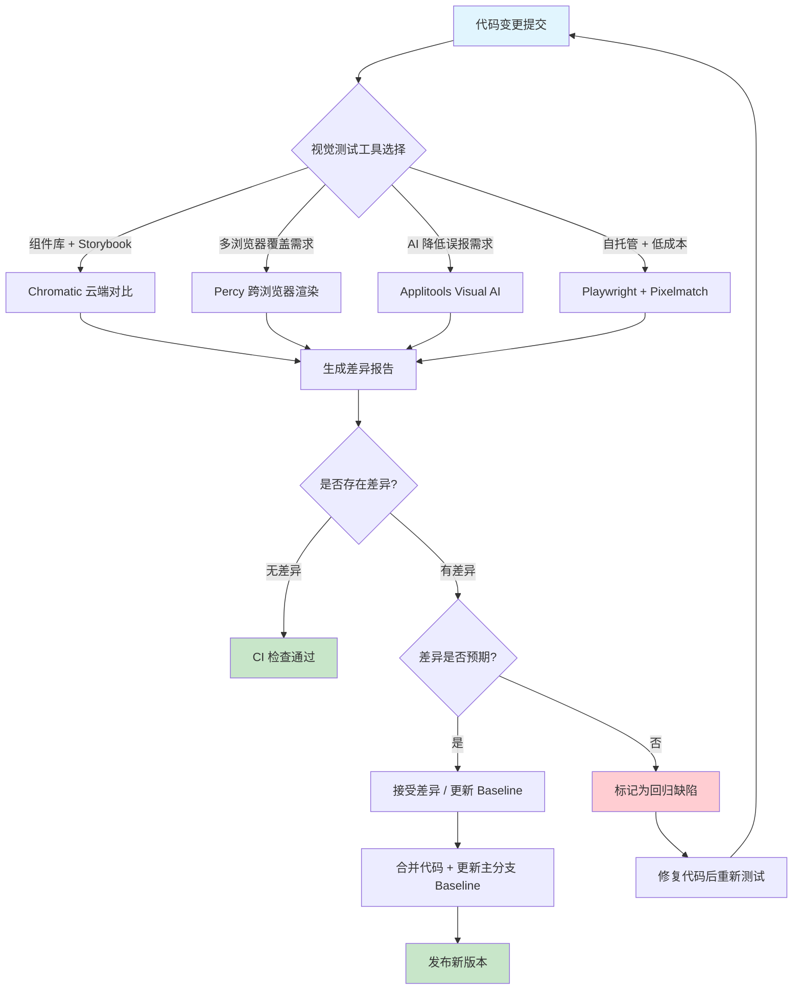
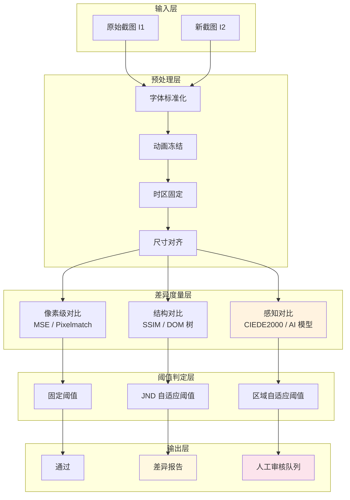
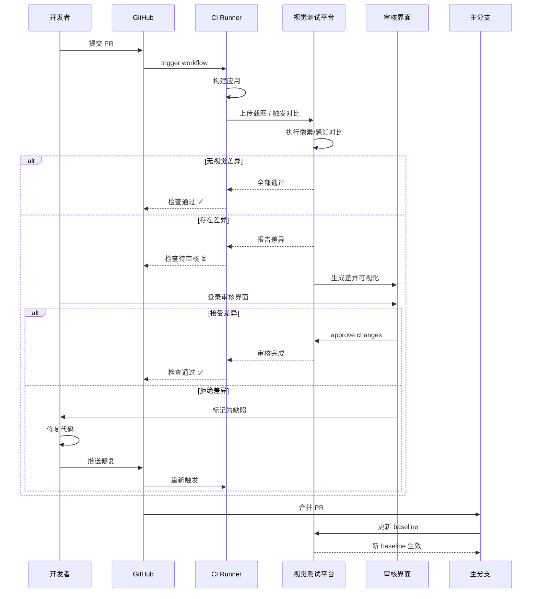

# 视觉回归测试：像素级验证

## 引言

在软件测试的谱系中，视觉回归测试（Visual Regression Testing）占据着一个独特而微妙的位置。与单元测试关注函数返回值、与集成测试关注模块交互不同，视觉回归测试关注的是「用户实际看到的内容」——那些由 CSS 属性、DOM 结构、字体渲染和浏览器合成层共同编织出的像素矩阵。一个按钮的背景色从 `#3b82f6` 偏移到 `#3b81f6`，可能在所有功能测试中畅通无阻，却足以让品牌设计规范遭受破坏；一个布局在 `1366px` 视口下的微妙错位，可能在端到端测试的 DOM 断言中完全隐身，却真实地影响着用户的阅读体验。

视觉回归测试的理论根基横跨计算机图形学、认知心理学和软件工程三个领域。从计算机图形学的视角，它涉及图像差异检测算法、 perceptual hashing 和像素级对比；从认知心理学的视角，它必须回答「多大差异才值得报告」——这一问题直接关联到人眼视觉系统的 Just Noticeable Difference（JND）阈值；从软件工程的视角，视觉测试面临 screenshot 稳定性、baseline 管理和 CI 集成的经典工程挑战。

本文采用「理论严格表述」与「工程实践映射」的双轨结构，首先从形式化语义与感知科学角度建立视觉回归测试的理论框架，随后深入剖析 Chromatic、Percy、Applitools 与 Playwright 等工具的工作流与配置策略，为构建可靠的视觉回归测试体系提供完整的方法论支撑。

## 理论严格表述

### 视觉回归测试的形式化定义

视觉回归测试的核心任务可被形式化地描述为：给定程序 $P$ 在版本 $v_i$ 下的视觉输出图像 $I_i = \text{Render}(P, v_i, e)$，其中 $e$ 表示渲染环境（浏览器、操作系统、GPU、字体配置等），判定版本 $v_{i+1}$ 的输出图像 $I_{i+1}$ 是否与 $I_i$ 在「语义上」保持一致。

形式化地，设差异度量函数为 $D: \mathcal{I} \times \mathcal{I} \to \mathbb{R}_{\geq 0}$，阈值函数为 $\tau: \mathcal{I} \times \mathcal{I} \to \mathbb{R}_{\geq 0}$，则视觉回归测试的判定规则为：

$$\text{Regression}(I_i, I_{i+1}) = \begin{cases} \text{true} & \text{if } D(I_i, I_{i+1}) > \tau(I_i, I_{i+1}) \\ \text{false} & \text{otherwise} \end{cases}$$

这一定义揭示了两个关键问题：第一，差异度量 $D$ 的选择决定了测试对何种变化敏感；第二，阈值 $\tau$ 的设定决定了测试的误报率（false positive）与漏报率（false negative）之间的权衡。

根据差异度量 $D$ 的层次，视觉回归测试可分为三个范式：

**1. 像素级对比（Pixel-level Comparison）**

像素级对比是最直接的差异度量方式，对每个对应像素的颜色值进行比较。设图像尺寸为 $W \times H$，像素 $I(x, y)$ 的颜色向量为 $(R, G, B, A)$，则像素级差异通常采用均方误差（MSE）或像素差异计数：

$$D_{\text{pixel&#125;&#125;(I_i, I_{i+1}) = \frac{1}{W \cdot H} \sum_{x=0}^{W-1} \sum_{y=0}^{H-1} \| I_i(x,y) - I_{i+1}(x,y) \|^2$$

像素级对比的优点是精确、可解释、计算高效；缺点是过于敏感——字体渲染的抗锯齿差异、GPU 驱动更新导致的次像素渲染变化、甚至相同的渐变色在不同浏览器中的实现差异，都可能触发大量误报。

**2. 结构对比（Structure-level Comparison）**

结构对比将图像视为由区域、边缘和纹理构成的结构体，关注布局层次和元素位置而非单个像素。常见的结构度量包括 SSIM（Structural Similarity Index Measure）和基于 DOM 的结构对比。SSIM 从亮度、对比度和结构三个维度评估图像相似性：

$$\text{SSIM}(x, y) = \frac{(2\mu_x\mu_y + c_1)(2\sigma_{xy} + c_2)}{(\mu_x^2 + \mu_y^2 + c_1)(\sigma_x^2 + \sigma_y^2 + c_2)}$$

其中 $\mu$ 为局部均值，$\sigma$ 为局部标准差，$\sigma_{xy}$ 为协方差，$c_1, c_2$ 为稳定性常数。SSIM 的值域为 $[-1, 1]$，值越接近 1 表示结构相似度越高。

**3. 感知差异模型（Perceptual Difference Model）**

感知差异模型是最先进的视觉对比范式，它基于人眼视觉系统（Human Visual System, HVS）的生理特性建模差异。著名的感知差异度量包括：

- **CIEDE2000**：基于 CIELAB 颜色空间的色差公式，考虑了亮度、色度和色相的差异
- **S-CIELAB**：空间扩展的 CIELAB，考虑了人眼的空间频率响应特性
- **iCID（integrated Cadmium Indium Diselenide）模型**：模拟视网膜神经节细胞的响应
- **FLOSIM/FLIP**：面向计算机图形学的感知图像差异度量

感知差异模型的核心洞察是：人眼对某些差异（如高频纹理的细微变化）极不敏感，而对另一些差异（如大面积色块的不一致）高度敏感。将差异度量与人类感知对齐，可以显著降低误报率。

### 人眼视觉系统的 JND 阈值

Just Noticeable Difference（JND，恰可察觉差异）是心理物理学中的核心概念，由 Ernst Weber 和 Gustav Fechner 在 19 世纪系统建立。JND 描述的是人眼能够区分两个刺激的最小差异量。在视觉回归测试的语境下，JND 为阈值函数 $\tau$ 的设定提供了生理学依据。

Weber 定律指出，JND 与刺激的基准强度成正比：

$$\Delta I / I = k$$

其中 $\Delta I$ 为恰可察觉的增量，$I$ 为基准刺激强度，$k$ 为 Weber 分数（对于亮度感知，$k \approx 0.02$）。这意味着在明亮背景上需要更大的绝对亮度变化才能被察觉，而在暗背景上微小的亮度变化即可被感知。

在数字图像的语境中，JND 受以下因素影响：

**空间频率响应**：人眼对中等空间频率（约 3–6 cycles/degree）最敏感，对极低频（大面积均匀色块）和高频（精细纹理）的敏感度下降。这一特性由 Contrast Sensitivity Function（CSF）描述：

$$\text{CSF}(f) = a \cdot f \cdot e^{-b \cdot f} \cdot \sqrt{1 + c \cdot e^{d \cdot f&#125;&#125;$$

其中 $f$ 为空间频率（cycles/degree），$a, b, c, d$ 为模型参数。CSF 的峰值位置解释了为何大面积色块的色差最容易被察觉，而字体渲染的微小抗锯齿差异往往被忽略。

**掩蔽效应**：当一个视觉刺激被另一个相邻刺激「掩蔽」时，其 JND 增大。亮度掩蔽和纹理掩蔽是最常见的两种形式。在网页渲染中，这意味着复杂背景上的元素差异比在纯色背景上更难被察觉。

**色彩通道差异**：人眼对亮度的敏感度远高于对色度的敏感度（亮度通道的神经节细胞约占 90%）。YCbCr 和 CIELAB 颜色空间正是基于这一生理学事实设计的，视觉差异算法通常在这些空间而非 RGB 空间中计算距离。

现代视觉回归工具（如 Applitools Eyes）内置的 AI 驱动对比引擎，本质上是通过机器学习模型拟合人眼的 JND 特性，自动调整差异报告的阈值。

### 截图稳定性问题

视觉回归测试的工程可靠性严重受制于 screenshot 的稳定性。即使程序代码完全一致，渲染输出仍可能因环境差异而产生「噪声」。主要的不稳定来源包括：

**1. 字体渲染差异**

字体渲染是一个复杂的过程，涉及 hinting、anti-aliasing、subpixel rendering 和 ClearType/GDI/DirectWrite/CoreText 等不同渲染后端。同一字体在同一字号下，macOS 的 CoreText 与 Windows 的 DirectWrite 会产生截然不同的字形轮廓和笔画权重。即使在同一操作系统内，GPU 驱动更新、字体缓存状态、以及字体 hinting 表的差异都可能导致像素级不一致。

工程上的缓解策略包括：

- 在 Docker 容器或 CI 专用环境中执行视觉测试，锁定操作系统和浏览器版本
- 使用 `font-display: swap` 确保字体加载完成后再截图
- 使用系统字体栈中的固定字体，或注入 Web Font 后等待加载完成
- 对文字区域采用「结构对比」而非「像素对比」

**2. 动画与时序问题**

现代网页充斥着 CSS transitions、animations 和 JavaScript 驱动的运动效果。如果在动画中途截图，得到的图像将具有高度的不确定性。形式化地，设动画函数为 $A(t)$，截图时刻为 $t_{\text{shot&#125;&#125;$，则 $A(t_{\text{shot&#125;&#125;)$ 的值取决于调度器的实际执行时机。

缓解策略：

- 在截图前强制等待所有动画完成：`await page.waitForTimeout(1000)` 或更精确地监听 `animationend` 事件
- 使用 Playwright 的 `page.evaluate(() => document.body.style.animationDuration = '0s')` 禁用动画
- 对使用 `requestAnimationFrame` 的动画，在截图前冻结时间

**3. 时区与本地化**

日期时间、数字格式和货币符号的本地化渲染依赖于运行环境的时区和语言设置。一个显示「2026年1月15日」的组件，在不同 `Intl.DateTimeFormat` 默认配置下可能呈现为「01/15/2026」或「15/01/2026」。

缓解策略：

- 在测试环境中固定时区和语言：`process.env.TZ = 'UTC'` 或 Playwright 的 `locale: 'en-US'` 配置
- 对日期组件使用确定性输入（如 `new Date('2026-05-01T00:00:00Z')`）

**4. 随机性与非确定性**

广告位、推荐算法、A/B 测试标记、以及基于随机数的 UI 元素（如骨架屏 shimmer 效果的随机延迟）都会引入非确定性。视觉回归测试要求被测界面在相同输入下产生确定性的视觉输出。

缓解策略：

- Mock `Math.random()` 和所有时间相关 API
- 固定种子值用于任何随机化逻辑
- 将不稳定区域标记为「忽略区域」（ignore region）

### 视觉测试的完备性局限

视觉回归测试面临根本性的完备性局限，这些局限源于视觉感知的主观性和测试自动化的形式化约束：

**1. Oracle 问题**

与功能测试的 Oracle 问题类似，视觉测试需要判定「什么是对的」。然而，视觉正确性缺乏形式化规约——设计稿（Figma、Sketch）与最终实现之间往往存在允许范围内的差异。谁有权判定一个 2px 的间距偏移是「可接受的」还是「回归缺陷」？

**2. 组合爆炸**

响应式设计要求组件在多个断点、多种主题（亮色/暗色/高对比度）、多种浏览器和多种内容状态下均保持视觉一致性。若一个组件有 4 个断点、2 种主题、3 种浏览器，则完整覆盖需要 $4 \times 2 \times 3 = 24$ 张截图。对于包含 50 个独立组件的系统，全组合覆盖需要 1200 张截图，存储、计算和审核成本极高。

**3. 语义等价性**

某些视觉变化在像素层面截然不同，但在语义层面完全等价。例如，将 `box-shadow: 0 2px 4px rgba(0,0,0,0.1)` 替换为等价的 `filter: drop-shadow(0 2px 4px rgba(0,0,0,0.1))`，像素输出可能差异显著，但视觉体验完全一致。这与变异测试中的「等价变异体」问题同构。

**4. 动态内容**

地图、图表、视频帧和 WebGL 渲染内容的截图往往包含固有噪声。对于这类内容，像素级对比几乎不可用，必须退回到「结构对比」或「元素存在性检测」。

## 工程实践映射

### Chromatic：Storybook 官方视觉回归平台

Chromatic 由 Storybook 团队维护，是专为组件驱动开发设计的视觉回归测试平台。它与 Storybook 的深度集成使其成为 React/Vue/Angular 组件库视觉测试的首选方案。

**核心工作流**

Chromatic 的工作流围绕「组件故事」展开。开发者首先在 Storybook 中为每个组件编写 stories（组件的各种状态展示），随后 Chromatic CLI 自动捕获每个 story 的截图，上传到 Chromatic 云端进行像素级对比。

```bash
# 安装 Chromatic CLI
npm install --save-dev chromatic

# 在 package.json 中添加脚本
# "chromatic": "chromatic --project-token=<YOUR_TOKEN>"

# 执行视觉回归测试
npx chromatic --project-token=<YOUR_TOKEN>
```

Chromatic 的对比引擎基于像素级差异检测，但提供了多项智能功能降低误报：

1. **Anti-aliasing 忽略**：自动忽略子像素渲染导致的边缘差异
2. **Diff highlighting**：以高亮方式精确标记差异区域
3. **UI Review 工作流**：团队成员可以在 Chromatic Web 界面上审核差异，选择「接受」（Accept）或「拒绝」（Reject）
4. **Branch baselines**：每个分支拥有独立的 baseline，合并后自动更新主分支 baseline

**CI 集成配置**

```yaml
# .github/workflows/chromatic.yml
name: Chromatic Visual Regression

on: push

jobs:
  chromatic:
    runs-on: ubuntu-latest
    steps:
      - uses: actions/checkout@v4
        with:
          fetch-depth: 0  # 需要完整历史用于分支 baseline

      - uses: actions/setup-node@v4
        with:
          node-version: '20'
          cache: 'npm'

      - run: npm ci

      - name: Run Chromatic
        uses: chromaui/action@v11
        with:
          projectToken: $&#123;&#123; secrets.CHROMATIC_PROJECT_TOKEN &#125;&#125;
          onlyChanged: true  # 仅测试变更的故事
          exitOnceUploaded: true
```

`onlyChanged: true` 是 Chromatic 的关键优化——通过 Git 差异分析，仅对受代码变更影响的 stories 执行截图和对比，将大型组件库的视觉测试时间从数十分钟缩短到数分钟。

**交互测试与视觉测试的结合**

Chromatic 支持 Storybook 的交互测试（通过 `@storybook/addon-interactions`），允许在截图前模拟用户交互：

```typescript
// Button.stories.ts
import type { Meta, StoryObj } from '@storybook/vue3';
import { within, userEvent } from '@storybook/test';
import Button from './Button.vue';

const meta: Meta<typeof Button> = {
  component: Button,
};

export default meta;
type Story = StoryObj<typeof Button>;

export const Hover: Story = {
  play: async ({ canvasElement }) => {
    const canvas = within(canvasElement);
    await userEvent.hover(canvas.getByRole('button'));
  },
};
```

在 `Hover` story 中，Chromatic 会先执行 `play` 函数（模拟鼠标悬停），然后对悬停状态下的按钮截图。这种「交互 + 视觉」的组合测试，能够捕获状态依赖的样式回归（如 hover 背景色、focus ring 等）。

### Percy：视觉回归即服务平台

Percy（由 BrowserStack 提供）是另一款主流的视觉回归测试平台，其设计哲学强调「开发者体验」和「跨浏览器覆盖」。

**核心特性**

Percy 支持多种前端框架和测试工具，包括：

- 直接与 Selenium、Cypress、Playwright、Puppeteer 集成
- 支持快照任何 DOM 状态（不仅限于页面顶部视口）
- 提供「responsive diff」功能，一次性对比多视口截图

```typescript
// Playwright + Percy 集成示例
import { test } from '@playwright/test';
import percySnapshot from '@percy/playwright';

test('dashboard visual regression', async ({ page }) => {
  await page.goto('https://app.example.com/dashboard');
  await page.waitForSelector('[data-testid="dashboard-loaded"]');

  // Percy 会自动捕获全页截图
  await percySnapshot(page, 'Dashboard Page', {
    widths: [375, 768, 1280, 1920],  // 多视口
    percyCSS: '.ad-banner { display: none !important; }',  // 注入隐藏样式
  });
});
```

**Responsive 视觉测试**

Percy 的 `widths` 参数是其响应式测试的核心。不同于在本地多次调用 `page.setViewportSize()`，Percy 在云端并行渲染多个视口下的页面，显著提升效率。差异审核界面允许按视口维度过滤，开发者可以快速定位特定断点下的回归。

**Percy 的忽略区域**

对于已知不稳定的区域（如动态广告、时间戳），Percy 支持通过 `data-percy-ignore` 属性或 CSS 选择器标记忽略：

```html
<!-- HTML 中直接标记 -->
<div class="timestamp" data-percy-ignore>
  Generated at &#123;&#123; new Date().toISOString() &#125;&#125;
</div>
```

```typescript
// 或通过配置动态标记
await percySnapshot(page, 'Page with ads', {
  ignoreRegions: [
    { x: 100, y: 200, width: 300, height: 250 },  // 坐标区域
    { selector: '.dynamic-ad-banner' },             // 选择器区域
  ],
});
```

注意上述示例中的 `&#123;&#123;` 放在代码块内是安全的，不会被 Vue 的 Mustache 解析器处理。

### Applitools Eyes：AI 驱动的视觉测试

Applitools Eyes 代表了视觉回归测试的最高技术水平，其核心差异在于引入了 AI 驱动的感知差异检测，而非简单的像素对比。

**Ultrafast Grid 与 Visual AI**

Applitools 的 Ultrafast Grid 是一项云渲染服务，允许开发者上传 DOM 快照（而非完整的截图），由云端在多种浏览器、视口和设备上并行渲染。这种方式不仅大幅减少了本地执行时间，更确保了跨环境的一致性。

```typescript
// Playwright + Applitools Eyes 集成
import { test } from '@playwright/test';
import { Eyes, Target, BatchInfo, Configuration } from '@applitools/eyes-playwright';

let eyes: Eyes;

const configuration = new Configuration();
configuration.setBatch(new BatchInfo('ECommerce Visual Tests'));

test.beforeEach(async () => {
  eyes = new Eyes();
  eyes.setConfiguration(configuration);
});

test('checkout flow visual test', async ({ page }) => {
  await eyes.open(page, 'ECommerce App', 'Checkout Flow');

  await page.goto('/cart');
  await eyes.check('Cart Page', Target.window().fully());

  await page.click('[data-testid="checkout-button"]');
  await eyes.check('Shipping Form', Target.window().fully());

  await page.fill('[name="address"]', '123 Main St');
  await page.click('[data-testid="continue-payment"]');
  await eyes.check('Payment Page', Target.window().fully());

  await eyes.close();
});
```

**匹配级别（Match Levels）**

Applitools 提供四种匹配级别，对应不同的敏感度需求：

1. **None**：忽略所有视觉差异（仅验证页面可访问性）
2. **Layout**：验证元素布局结构，忽略内容和颜色变化
3. **Content**：验证内容和布局，忽略颜色变化
4. **Strict**：像素级对比，忽略 anti-aliasing 差异
5. **Exact**：严格的像素级对比，不允许任何差异

```typescript
// 对特定区域设置匹配级别
await eyes.check('Product Card', Target.region('.product-card')
  .matchLevel('Layout')  // 仅验证布局结构
);
```

**AI 驱动的区域分类**

Applitools 的 AI 引擎会自动将页面划分为不同类型的区域并应用相应的匹配策略：

- **文本区域**：忽略字体渲染差异，关注文本内容变化
- **图像区域**：对图像使用感知哈希比对
- **图标区域**：对 SVG 和小图标使用形状比对
- **动态区域**：自动检测并忽略时间戳、动画等动态内容

这种基于内容的自适应对比策略，使得 Applitools 在大型企业级应用中展现出远低于传统像素对比工具的误报率。

### Playwright 原生截图 + Pixelmatch 对比

对于不愿意引入第三方 SaaS 平台的团队，Playwright 的原生 screenshot API 配合开源的 `pixelmatch` 库，可以构建自托管的视觉回归测试方案。

**基础截图对比**

```typescript
// tests/visual/homepage.spec.ts
import { test, expect } from '@playwright/test';
import pixelmatch from 'pixelmatch';
import { PNG } from 'pngjs';
import fs from 'fs';
import path from 'path';

const BASELINE_DIR = path.join(__dirname, '../baselines');
const ACTUAL_DIR = path.join(__dirname, '../actual');
const DIFF_DIR = path.join(__dirname, '../diff');

test('homepage visual regression', async ({ page }) => {
  await page.goto('/');
  await page.waitForLoadState('networkidle');

  const screenshot = await page.screenshot({
    fullPage: true,
    animations: 'disabled',  // 禁用 CSS 动画
    mask: [page.locator('.timestamp')],  // 遮罩不稳定区域
  });

  const baselinePath = path.join(BASELINE_DIR, 'homepage.png');
  const actualPath = path.join(ACTUAL_DIR, 'homepage.png');
  const diffPath = path.join(DIFF_DIR, 'homepage.png');

  fs.mkdirSync(ACTUAL_DIR, { recursive: true });
  fs.writeFileSync(actualPath, screenshot);

  if (!fs.existsSync(baselinePath)) {
    fs.mkdirSync(BASELINE_DIR, { recursive: true });
    fs.copyFileSync(actualPath, baselinePath);
    test.info().annotations.push({ type: 'baseline', description: 'Created new baseline' });
    return;
  }

  const baseline = PNG.sync.read(fs.readFileSync(baselinePath));
  const actual = PNG.sync.read(screenshot);

  if (baseline.width !== actual.width || baseline.height !== actual.height) {
    throw new Error(`Dimension mismatch: baseline ${baseline.width}x${baseline.height} vs actual ${actual.width}x${actual.height}`);
  }

  const diff = new PNG({ width: baseline.width, height: baseline.height });
  const numDiffPixels = pixelmatch(
    baseline.data, actual.data, diff.data,
    baseline.width, baseline.height,
    {
      threshold: 0.1,  // 感知阈值 (0-1)
      includeAA: false,  // 忽略 anti-aliasing 差异
      diffColor: [255, 0, 0],  // 差异标记颜色
    }
  );

  if (numDiffPixels > 0) {
    fs.mkdirSync(DIFF_DIR, { recursive: true });
    fs.writeFileSync(diffPath, PNG.sync.write(diff));
    throw new Error(`Visual regression detected: ${numDiffPixels} pixels differ. Diff saved to ${diffPath}`);
  }
});
```

**多视口响应式测试**

```typescript
// tests/visual/responsive.spec.ts
import { test } from '@playwright/test';

const VIEWPORTS = [
  { name: 'mobile', width: 375, height: 667 },
  { name: 'tablet', width: 768, height: 1024 },
  { name: 'desktop', width: 1280, height: 720 },
  { name: 'wide', width: 1920, height: 1080 },
];

for (const viewport of VIEWPORTS) {
  test(`product page at ${viewport.name}`, async ({ page }) => {
    await page.setViewportSize({ width: viewport.width, height: viewport.height });
    await page.goto('/product/123');
    await page.waitForSelector('[data-testid="product-loaded"]');

    await expect(page).toHaveScreenshot(`product-${viewport.name}.png`, {
      fullPage: true,
      animations: 'disabled',
      maxDiffPixels: 100,  // 允许最多 100 像素差异
    });
  });
}
```

Playwright 的 `toHaveScreenshot` 是内置的视觉回归断言，自动管理 baseline 的创建、对比和更新。`maxDiffPixels` 和 `threshold` 参数提供了灵活的容错配置。

**环境一致性配置**

自托管方案的关键挑战是确保截图环境的一致性。推荐在 Docker 中运行 Playwright 视觉测试：

```dockerfile
# Dockerfile.visual-tests
FROM mcr.microsoft.com/playwright:v1.43.0-jammy

ENV TZ=UTC
ENV LANG=en_US.UTF-8

WORKDIR /app
COPY package*.json ./
RUN npm ci

COPY . .
CMD ["npx", "playwright", "test", "--grep", "@visual"]
```

```yaml
# docker-compose.visual.yml
version: '3.8'
services:
  visual-tests:
    build:
      context: .
      dockerfile: Dockerfile.visual-tests
    environment:
      - CI=true
      - UPDATE_SNAPSHOTS=${UPDATE_SNAPSHOTS:-false}
    volumes:
      - ./test-results:/app/test-results
```

### Storybook 交互测试与视觉测试结合

Storybook 的测试生态提供了独特的「组件级视觉回归」能力。通过结合 `@storybook/test-runner` 和 Chromatic，可以实现组件在多种交互状态下的视觉覆盖。

```typescript
// Modal.stories.ts
import type { Meta, StoryObj } from '@storybook/vue3';
import { within, userEvent, expect } from '@storybook/test';
import Modal from './Modal.vue';

const meta: Meta<typeof Modal> = {
  component: Modal,
  argTypes: {
    size: { control: 'select', options: ['sm', 'md', 'lg', 'xl'] },
  },
};

export default meta;
type Story = StoryObj<typeof meta>;

// 基础视觉状态
export const Default: Story = {
  args: {
    open: true,
    title: 'Confirm Action',
    size: 'md',
  },
};

// 交互后视觉状态
export const AfterCloseAttempt: Story = {
  args: {
    ...Default.args,
  },
  play: async ({ canvasElement, args }) => {
    const canvas = within(canvasElement);
    const overlay = canvas.getByTestId('modal-overlay');

    // 点击遮罩层尝试关闭
    await userEvent.click(overlay);

    // 验证关闭确认提示出现
    const confirmDialog = await canvas.findByText('Are you sure you want to close?');
    await expect(confirmDialog).toBeVisible();
  },
};

// 键盘导航视觉状态
export const KeyboardFocused: Story = {
  args: {
    ...Default.args,
  },
  play: async ({ canvasElement }) => {
    const canvas = within(canvasElement);
    const button = canvas.getByRole('button', { name: 'Submit' });

    // Tab 到提交按钮
    await userEvent.tab();
    await userEvent.tab();
    await userEvent.tab();

    // 此时按钮应有 focus ring
    await expect(button).toHaveFocus();
  },
};
```

当 Chromatic 捕获上述 stories 时，`AfterCloseAttempt` 和 `KeyboardFocused` 将分别展示交互后的视觉状态。这种细粒度的组件级视觉覆盖，远比全页截图更易维护、更精准定位回归来源。

### 视觉回归的 CI 集成策略

视觉回归测试的 CI 集成需要精心设计的工作流，核心挑战在于 baseline 的管理和差异审核的人机协作。

**Baseline 更新工作流**

Baseline 是视觉回归测试的「预期输出」。当有意图地修改视觉样式（如品牌色更新、设计系统改版）时，需要更新 baseline。推荐的工作流：

```yaml
# .github/workflows/visual-regression.yml
name: Visual Regression

on:
  pull_request:
    branches: [main]
  push:
    branches: [main]

jobs:
  visual-test:
    runs-on: ubuntu-latest
    steps:
      - uses: actions/checkout@v4

      - uses: actions/setup-node@v4
        with:
          node-version: '20'
          cache: 'npm'

      - run: npm ci

      # 基础方案：Playwright + 自托管 baselines
      - name: Run visual tests
        run: npx playwright test tests/visual/
        env:
          CI: true

      # 失败时上传实际截图和差异图作为 artifact
      - name: Upload visual test artifacts
        if: failure()
        uses: actions/upload-artifact@v4
        with:
          name: visual-test-results
          path: |
            test-results/
            tests/actual/
            tests/diff/

  # 独立的 baseline 更新工作流（仅通过 workflow_dispatch 触发）
  update-baselines:
    runs-on: ubuntu-latest
    if: github.event_name == 'workflow_dispatch'
    steps:
      - uses: actions/checkout@v4
        with:
          token: $&#123;&#123; secrets.GITHUB_TOKEN &#125;&#125;

      - uses: actions/setup-node@v4
      - run: npm ci

      - name: Update baselines
        run: npx playwright test tests/visual/ --update-snapshots

      - name: Commit updated baselines
        run: |
          git config user.name "github-actions[bot]"
          git config user.email "github-actions[bot]@users.noreply.github.com"
          git add tests/baselines/
          git commit -m "chore(test): update visual baselines [skip ci]"
          git push
```

**Approve-diff 工作流**

对于使用 Chromatic 或 Percy 的团队，差异审核通过 Web 界面完成：

1. 开发者提交 PR 后，视觉测试自动运行
2. 如果检测到视觉差异，CI 检查标记为「待审核」
3. 设计师或资深前端工程师在 Chromatic/Percy Web 界面上逐一审核差异
4. 审核者选择「接受」或「拒绝」每个差异
5. 所有差异被接受后，CI 检查通过，PR 可合并

```yaml
# Chromatic 的 approve-diff 集成示例
- name: Run Chromatic
  uses: chromaui/action@v11
  with:
    projectToken: $&#123;&#123; secrets.CHROMATIC_PROJECT_TOKEN &#125;&#125;
    exitZeroOnChanges: true  # 有差异时不退出失败，等待人工审核
    autoAcceptChanges: "main"  # main 分支的变更自动接受为新的 baseline
```

**响应式视觉测试的工程策略**

响应式视觉测试需要在多个视口下验证页面渲染。推荐的策略矩阵：

| 策略 | 适用场景 | 工具支持 | 维护成本 |
|------|---------|---------|---------|
| 全视口矩阵 | 设计系统组件库 | Chromatic、Percy | 中等 |
| 关键断点覆盖 | 业务页面 | Playwright `toHaveScreenshot` | 低 |
| 视口范围扫描 | 复杂布局页面 | Applitools Ultrafast Grid | 低（云服务） |
| 手动设备测试 | 原生应用内嵌 WebView | BrowserStack、Sauce Labs | 高 |

对于组件库，建议覆盖所有设计系统定义的断点；对于业务页面，优先覆盖移动端（375px）、平板（768px）和桌面端（1440px）三个关键视口。

```typescript
// playwright.config.ts 中的视口配置
export default defineConfig({
  projects: [
    {
      name: 'chromium-mobile',
      use: {
        ...devices['iPhone 13'],
      },
    },
    {
      name: 'chromium-tablet',
      use: {
        viewport: { width: 768, height: 1024 },
      },
    },
    {
      name: 'chromium-desktop',
      use: {
        viewport: { width: 1440, height: 900 },
      },
    },
  ],
});
```

## Mermaid 图表

### 视觉回归测试决策流程



### 感知差异模型层次架构



### 视觉回归 CI 工作流时序



## 理论要点总结

视觉回归测试作为软件测试体系中的特殊维度，其理论与实践呈现出鲜明的跨学科特征：

1. **形式化定义揭示核心矛盾**：视觉回归测试的本质是判定两张渲染图像在「语义上」是否等价，但差异度量 $D$ 和阈值 $\tau$ 的选择决定了测试的敏感度谱系——从严格的像素级对比到感知对齐的 AI 模型，各有其适用域。

2. **JND 阈值是误报率的生理学根基**：人眼对亮度差异的 Weber 分数约为 2%，对色度差异的敏感度远低于亮度，对高频纹理的差异极不敏感。忽略这些生理学约束的像素级对比，将产生大量违背人类感知的误报。

3. **截图稳定性是工程可靠性的瓶颈**：字体渲染、动画时序、时区设置和随机性是 screenshot 噪声的四大来源。锁定渲染环境（Docker、固定浏览器版本）、冻结动画、固定时区和 Mock 随机源，是确保视觉测试稳定性的必要措施。

4. **完备性局限要求策略性妥协**：视觉测试的组合爆炸（断点 × 主题 × 浏览器 × 状态）、Oracle 问题（何为「正确」的视觉）和语义等价性（不同像素、相同体验）决定了 100% 视觉覆盖既不经济也不必要。实践中应优先覆盖高频路径和关键组件。

5. **工具选择取决于团队约束**：Chromatic 适合 Storybook 组件库，Percy 适合多浏览器覆盖，Applitools 适合大型企业级应用的低误报需求，Playwright + Pixelmatch 适合预算敏感且愿意自托管的团队。

6. **CI 集成的核心在于 Baseline 管理**：视觉回归测试不是「全有或全无」的判定，而是需要人机协作的审核工作流。`exitZeroOnChanges`、分支独立 baseline 和自动接受主分支变更，是构建可持续 CI 集成的关键机制。

## 参考资源

1. **Chromatic Documentation**. "Visual testing for Storybook." Chromatic, 2024. <https://www.chromatic.com/docs/>

2. **Percy Documentation**. "Visual testing as a service." BrowserStack, 2024. <https://www.browserstack.com/docs/percy>

3. **Applitools Documentation**. "AI-powered visual testing platform." Applitools, 2024. <https://applitools.com/docs/>

4. **Microsoft Playwright**. "Screenshots." Playwright Documentation, 2024. <https://playwright.dev/docs/screenshots>

5. **Storybook Test Runner**. "Test your stories." Storybook, 2024. <https://storybook.js.org/docs/writing-tests/test-runner>

6. **Ponomarenko, N. et al. (2015)**. "Image database TID2013: Peculiarities, results and perspectives." *Signal Processing: Image Communication*, 30, 57-77. —— 大规模感知图像质量数据库，为 JND 研究提供实证数据。

7. **Sharma, G., Wu, W., & Dalal, E. N. (2005)**. "The CIEDE2000 color-difference formula: Implementation notes, supplementary test data, and mathematical observations." *Color Research & Application*, 30(1), 21-30. —— CIEDE2000 色差公式的权威技术文献。

8. **Zhang, R., Isola, P., Efros, A. A., Shechtman, E., & Wang, O. (2018)**. "The unreasonable effectiveness of deep features as a perceptual metric." *CVPR 2018*. —— 深度学习感知相似度度量（LPIPS）的奠基论文。

9. **Maples, D. et al. (2021)**. "Visual Regression Testing: A Systematic Mapping Study." *IEEE International Conference on Software Testing, Verification and Validation Workshops (ICSTW)*. —— 视觉回归测试的系统性综述。

10. **Pixelmatch**. "The smallest, simplest and fastest JavaScript pixel-level image comparison library." GitHub, 2024. <https://github.com/mapbox/pixelmatch>
