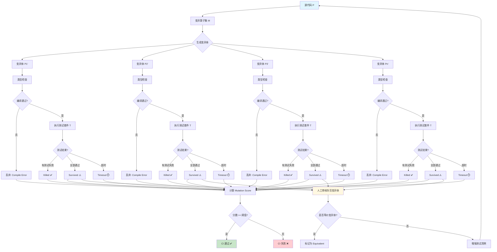

# 变异测试：评估测试质量

## 引言

代码覆盖率达到 100% 是否意味着测试套件足够优秀？这一问题的答案，对于任何严肃对待软件质量的工程师而言，都是响亮的「否」。覆盖率度量的是「测试执行了哪些代码」，而非「测试验证了哪些行为」。一段被 100% 覆盖的代码，如果其对应的测试用例没有任何有意义的断言——仅仅是调用了被测函数并忽略返回值——那么这段代码在测试中「被执行」了，却未被「验证」。变异测试（Mutation Testing）正是为了戳破这种虚假的安全感而诞生的元测试技术。

变异测试的核心思想既优雅又残酷：如果测试套件真的在验证程序的行为，那么当程序被注入微小的人工缺陷时，至少有一个测试应当失败。如果测试在「缺陷版本」下仍然全部通过，说明测试未能检测到这个缺陷——换言之，测试对该缺陷所影响的行为缺乏有效的断言。通过系统地注入缺陷并观察测试的反应，变异测试提供了一种比覆盖率更深刻的测试质量度量。

本文从变异测试的形式化理论出发，深入剖析变异算子、充分性分数与等价变异体等核心概念，随后全面映射到 JavaScript/TypeScript 生态中 Stryker JS 的工程实践——从配置优化到 CI 集成，从报告解读到与 TypeScript 类型系统的有趣交互。

## 理论严格表述

### 变异测试的形式化定义

变异测试（Mutation Testing）是一种评估测试套件缺陷发现能力的元测试技术。其形式化框架可定义如下：

设被测程序为 $P$，测试套件为 $T = \{t_1, t_2, \ldots, t_n\}$，变异算子（mutation operator）为函数 $mut: \mathcal{P} \to \mathcal{P}$，其中 $\mathcal{P}$ 为程序空间。应用变异算子于程序 $P$ 产生变异体（mutant）$P' = mut(P)$。

变异测试的执行过程为：对测试套件 $T$ 中的每个测试用例 $t_i$，分别在原程序 $P$ 和变异体 $P'$ 上执行。设 $\text{exec}(t, P) \in \{\text{pass}, \text{fail}\}$ 表示测试 $t$ 在程序 $P$ 上的执行结果，则：

- 若 $\exists t \in T: \text{exec}(t, P) = \text{pass} \land \text{exec}(t, P') = \text{fail}$，则称测试套件 $T$ **杀死**（killed）了变异体 $P'$
- 若 $\forall t \in T: \text{exec}(t, P') = \text{pass}$，则称变异体 $P'$ **存活**（survived）
- 若 $\exists t \in T: \text{exec}(t, P') = \text{timeout}$，则称变异体 $P'$ 被**超时**（timeout）——通常意味着变异引入了无限循环或严重性能退化

变异充分性分数（Mutation Score）定义为：

$$\text{Mutation Score} = \frac{|\{P' \text{ killed}\}|}{|\{P' \text{ total}\}| - |\{P' \text{ equivalent}\}|}$$

其中分母排除了**等价变异体**（equivalent mutants）——那些语义上与原程序等价、无法被任何测试杀死的变异体。等价变异体问题是变异测试理论中最棘手的难题之一，我们将在后续深入讨论。

### 变异算子的分类体系

变异算子是变异测试的核心机制，其设计原则源自「 competent programmer hypothesis」和「 coupling effect」。前者假设程序员编写的程序接近正确，因此缺陷是微小的；后者假设能检测简单缺陷的测试套件，也能检测复杂缺陷。基于这些假设，变异算子通常对程序施加「一阶」微小变更。

**1. 算术运算符变异（Arithmetic Operator Mutation）**

算术运算符变异替换二元算术运算符，模拟计算逻辑中的常见笔误：

| 原运算符 | 变异为 |
|---------|--------|
| `+` | `-`, `*`, `/` |
| `-` | `+`, `*`, `/` |
| `*` | `+`, `-`, `/` |
| `/` | `+`, `-`, `*` |
| `%` | `*` |

示例：

```typescript
// 原程序
function calculateTotal(price: number, quantity: number): number {
  return price * quantity + 10;
}

// 变异体 1: * → +
function calculateTotal(price: number, quantity: number): number {
  return price + quantity + 10;  // killed by assert(total === 110)
}

// 变异体 2: + → -
function calculateTotal(price: number, quantity: number): number {
  return price * quantity - 10;  // killed by assert(total === 110)
}
```

若测试仅调用 `calculateTotal(10, 10)` 而不断言返回值，两个变异体均会存活。

**2. 关系运算符变异（Relational Operator Mutation）**

关系运算符变异替换比较运算符，模拟边界条件判断错误：

| 原运算符 | 变异为 |
|---------|--------|
| `>` | `>=`, `<`, `===` |
| `<` | `<=`, `>`, `===` |
| `>=` | `>`, `<=`, `===` |
| `<=` | `<`, `>=`, `===` |
| `===` | `!==` |
| `!==` | `===` |

关系运算符变异对边界值测试特别敏感。若测试未覆盖边界值，关系运算符的变异往往存活。

```typescript
// 原程序：验证年龄必须大于等于 18
function isAdult(age: number): boolean {
  return age >= 18;
}

// 变异体: >= → >
function isAdult(age: number): boolean {
  return age > 18;
}

// 若测试未覆盖 age = 18，此变异体存活
// 边界测试 expect(isAdult(18)).toBe(true) 可杀死该变异体
```

**3. 逻辑运算符变异（Logical Operator Mutation）**

逻辑运算符变异替换布尔运算符，模拟复合条件判断错误：

| 原运算符 | 变异为 |
|---------|--------|
| `&&` | `\|\|` |
| `\|\|` | `&&` |

对于短路求值语言（如 JavaScript），逻辑运算符变异可能改变程序的执行路径。

```typescript
// 原程序
function canAccess(user: User, resource: Resource): boolean {
  return user.isAdmin && resource.isPublic;
}

// 变异体: && → ||
function canAccess(user: User, resource: Resource): boolean {
  return user.isAdmin || resource.isPublic;
}

// 测试用例 (isAdmin=false, isPublic=true) 在变异体下返回 true
// 若测试未覆盖此组合，变异体存活
```

**4. 一元运算符变异（Unary Operator Mutation）**

| 原运算符 | 变异为 |
|---------|--------|
| `+` | `-` |
| `-` | `+` |
| `!` | （移除） |
| `++` | `--` |
| `--` | `++` |

**5. 语句删除变异（Statement Deletion Mutation）**

删除单条语句，模拟遗漏执行某操作的缺陷：

```typescript
// 原程序
function processOrder(order: Order): void {
  validateOrder(order);
  calculateTax(order);
  saveToDatabase(order);
  sendConfirmationEmail(order);
}

// 变异体 1: 删除 validateOrder(order)
// 变异体 2: 删除 calculateTax(order)
// 变异体 3: 删除 sendConfirmationEmail(order)
```

语句删除变异测试测试套件是否验证了每个语句的副作用。若测试未验证确认邮件是否发送，对应的变异体存活。

**6. 数组/对象字面量变异（Array/Object Literal Mutation）**

修改数组和对象字面量的内容：

- 空数组 `[]` → 非空数组 `[""]`
- 空对象 `{}` → 非空对象 `{ "": "" }`
- 删除数组元素
- 交换对象属性值

**7. 条件边界变异（Conditional Boundary Mutation）**

对条件表达式中的边界值进行偏移：

| 原表达式 | 变异为 |
|---------|--------|
| `<` | `<=` |
| `<=` | `<` |
| `>` | `>=` |
| `>=` | `>` |

这与关系运算符变异重叠，但更聚焦于边界条件。

### 等价变异体问题

等价变异体（Equivalent Mutant）是变异测试理论中最根本的难题。若变异体 $P'$ 与原程序 $P$ 在所有输入下具有完全相同的语义行为，则称 $P'$ 为等价变异体。等价变异体无法被任何测试套件杀死，若计入分母将导致变异充分性分数被人为压低。

形式化地，$P'$ 是等价变异体当且仅当：

$$\forall x \in D: P(x) = P'(x)$$

其中 $D$ 为输入域。判定等价变异体的问题是**不可判定的**——它与程序等价性问题同构，而程序等价性在一般情况下是不可判定的（可归约到停机问题）。

常见的等价变异体类型包括：

**1. 交换律等价**

```typescript
// 原程序
const sum = a + b;

// 变异体
const sum = b + a;  // 对于数字加法，语义等价
```

**2. 恒等式等价**

```typescript
// 原程序
const result = arr.filter(x => x > 0);

// 变异体: > → >=
const result = arr.filter(x => x >= 0);
// 若 arr 中所有元素均为整数且无 0，则等价
```

**3. 冗余代码等价**

```typescript
// 原程序
function getConfig(): Config {
  const defaultTimeout = 5000;
  return { timeout: defaultTimeout };
}

// 变异体: 删除 defaultTimeout 声明
function getConfig(): Config {
  return { timeout: 5000 };
}
```

**4. 类型系统保证的等价**

在 TypeScript 等强类型语言中，某些变异在类型系统的约束下不可能产生可观测的差异。例如，对一个已确定为 `boolean` 类型的变量应用 `!` 移除变异，若变量仅用于条件判断且类型已收窄，变异可能等价。

处理等价变异体的工程策略包括：

- **人工审核**：开发者手动审查存活变异体，标记等价变异体
- **动态等价检测**：通过符号执行或约束求解尝试证明等价性
- **更高阶变异**：将一阶变异组合为更高阶变异，减少等价变异体比例
- **选择性变异**：仅使用低等价率的变异算子子集

### 选择性变异的统计基础

选择性变异（Selective Mutation）是应对变异测试计算成本过高的核心策略。完整的变异集对一个中等规模程序可能产生数万甚至数十万个变异体，执行全部变异测试在时间上不可行。Offutt 等人在 1993–1996 年间通过一系列实验研究，建立了选择性变异的统计基础。

Offutt et al. (1996) 的实验结论表明：

1. **足量子集假设**：仅需使用少量精心选择的变异算子（通常 5–8 个），即可达到与完整变异集几乎相同的缺陷检测能力。这一结论被称为「sufficient mutation operator set」。

2. **N-selective 变异**：随机选取 $N$ 个变异体而非生成全部变异体。研究表明，当 $N$ 达到某个阈值（通常为总变异体的 10%–20%）后，变异充分性分数趋于稳定。

3. **算子优先级**：不同变异算子的缺陷检测能力存在显著差异。算术运算符和关系运算符变异通常提供最高的「信息密度」，而数组字面量变异的检测能力相对较弱。

形式化地，设完整变异算子集为 $M = \{m_1, m_2, \ldots, m_k\}$，选择性变异选择一个子集 $M' \subset M$，使得：

$$\frac{|\{P' \text{ killed by tests under } M'\}|}{|\{P' \text{ total under } M'\}|} \approx \frac{|\{P' \text{ killed by tests under } M\}|}{|\{P' \text{ total under } M\}|}$$

Stryker JS 等现代工具通过「变异级别」（mutation level）机制实现选择性变异，允许用户选择预设的算子子集（如 `default`、`strict`、`full`）。

### 变异测试与代码覆盖率的互补性

代码覆盖率与变异充分性分数是测试质量的两个互补维度：

| 维度 | 度量内容 | 盲区 | 优化目标 |
|------|---------|------|---------|
| **语句覆盖** | 测试是否执行了某行代码 | 执行了但未验证 | 最大化覆盖 |
| **分支覆盖** | 测试是否覆盖了某分支 | 覆盖了但未验证边界 | 最大化覆盖 |
| **变异充分性** | 测试是否能检测微小缺陷 | 等价变异体、计算成本 | 提高缺陷检测能力 |

覆盖率回答「测试是否到达了这里」，变异测试回答「测试是否在意这里」。两者的组合使用才能全面评估测试套件的质量。

一个经典案例：

```typescript
function divide(a: number, b: number): number {
  if (b === 0) {
    throw new Error('Division by zero');
  }
  return a / b;
}

// 测试
test('divide', () => {
  divide(10, 2);  // 覆盖率: 100%（语句 + 分支）
});
```

此测试达到 100% 分支覆盖，但：

- 没有任何断言验证返回值
- 算术变异 `/` → `*` 产生 `a * b = 20`，测试仍通过——变异存活
- 关系变异 `===` → `!==` 导致 `b !== 0` 永真，除零保护失效——若测试未覆盖 `b=0`，变异存活

## 工程实践映射

### Stryker JS 的变异测试配置

Stryker JS 是 JavaScript/TypeScript 生态中最成熟的变异测试框架。其配置通过 `stryker.conf.js`（或 `stryker.config.mjs`）文件管理。

**基础配置**

```javascript
// stryker.config.mjs
export default {
  // 变异测试框架与测试运行器
  testRunner: 'vitest',           // 或 'jest', 'mocha', 'command'
  reporters: ['html', 'clear-text', 'progress'],

  // 文件匹配模式
  mutate: [
    'src/**/*.ts',
    '!src/**/*.spec.ts',
    '!src/**/*.test.ts',
    '!src/**/index.ts',
    '!src/**/*.d.ts',
  ],

  // 忽略的文件
  ignorePatterns: ['node_modules', 'dist', 'coverage'],

  // 变异算子配置（选择性变异）
  mutator: {
    plugins: [],  // 额外 Babel 插件
  },

  // 覆盖率分析优化
  coverageAnalysis: 'perTest',  // 'perTest' | 'all' | 'off'

  // 并发配置
  concurrency: 4,  // 并行执行变异的 worker 数

  // 阈值配置
  thresholds: {
    high: 80,   // >= 80% 为绿色
    low: 60,    // 60-80% 为黄色
    break: 50,  // < 50% 导致 CI 失败
  },

  // 超时配置（防止无限循环变异体）
  timeoutMS: 5000,
  timeoutFactor: 1.5,

  // HTML 报告输出
  htmlReporter: {
    fileName: 'reports/mutation/mutation.html',
  },

  // 日志级别
  logLevel: 'info',
};
```

**package.json 集成**

```json
{
  "scripts": {
    "test": "vitest",
    "test:mutation": "stryker run",
    "test:mutation:dry": "stryker run --dryRun"  // 不执行实际变异，仅验证配置
  },
  "devDependencies": {
    "@stryker-mutator/core": "^8.0.0",
    "@stryker-mutator/vitest-runner": "^8.0.0",
    "@stryker-mutator/typescript-checker": "^8.0.0"
  }
}
```

**TypeScript Checker 集成**

Stryker 的 TypeScript Checker 插件会在生成变异体后执行类型检查，过滤掉产生类型错误的变异体（这些变异体在真实场景中不可能存在）：

```javascript
// stryker.config.mjs
import { createRequire } from 'module';
const require = createRequire(import.meta.url);

export default {
  testRunner: 'vitest',
  checkers: ['typescript'],  // 启用 TypeScript 类型检查

  typescriptChecker: {
    configFile: 'tsconfig.json',
  },

  // ... 其他配置
};
```

启用 TypeScript Checker 有两个重要效果：

1. 过滤掉产生编译错误的变异体（如将 `number` 变量替换为 `string` 导致类型不匹配）
2. 减少无效变异体的数量，降低计算开销和人工审核负担

### 变异测试报告解读

执行 `stryker run` 后，Stryker 生成包含以下信息的详细报告：

```text
Mutation testing  [==================================================] 100% (elapsed: <1m)

All mutants have been tested, and your mutation score has been determined!

# Your awesome mutation testing results report! #

All files
  src/calculator.ts
  src/utils/validator.ts
  src/services/orderService.ts

# 汇总统计
Killed:        145 (72.5%)
Survived:       35 (17.5%)
Timeout:        12 (6.0%)
No coverage:     6 (3.0%)
Ignored:         2 (1.0%)
Runtime errors:  0 (0.0%)
Compile errors:  0 (0.0%)

Mutation score: 83.5%
Mutation score based on covered code: 86.0%
```

**关键指标解读**

- **Killed（已杀死）**：测试套件检测到了变异并失败。这是期望的结果，比例越高越好。
- **Survived（存活）**：测试套件未检测到变异。需要重点关注——这些变异体揭示了测试的盲区。
- **Timeout（超时）**：变异体导致测试超时（通常意味着引入了无限循环）。Stryker 将超时视为「杀死」，因为异常行为被检测到了。
- **No coverage（无覆盖）**：原程序代码未被任何测试覆盖，因此对应的变异体无法被杀死。
- **Ignored（忽略）**：通过 `// Stryker disable` 注释显式忽略的代码区域。
- **Mutation Score（变异充分性分数）**：核心质量指标，计算公式为 `(Killed + Timeout) / (Total - Ignored - Compile errors)`。
- **Mutation Score based on covered code（基于已覆盖代码的变异分数）**：仅统计已有测试覆盖的代码区域，排除了 `No coverage` 的影响。这一指标更能反映「已有测试的质量」，而非「整体测试覆盖度」。

**存活变异体的处理工作流**

```typescript
// 示例：存活变异体分析与修复

// 原程序
function calculateDiscount(price: number, isVIP: boolean): number {
  if (isVIP) {
    return price * 0.8;  // 变异体: 0.8 → 0.799999... 或 * → /
  }
  return price;
}

// 原测试（导致变异存活）
test('calculateDiscount', () => {
  const result = calculateDiscount(100, true);
  expect(typeof result).toBe('number');  // 过于宽泛的断言！
});

// 改进后的测试（杀死变异体）
test('calculateDiscount for VIP', () => {
  expect(calculateDiscount(100, true)).toBe(80);
});

test('calculateDiscount for regular', () => {
  expect(calculateDiscount(100, false)).toBe(100);
});
```

**HTML 报告的交互式审核**

Stryker 生成的 HTML 报告提供了源码级别的可视化标注：

```html
<!-- mutation-report.html 中的渲染效果（示意） -->
<div class="stryker-source">
  <span class="killed">return price * 0.8;</span>  <!-- 绿色：已杀死 -->
  <span class="survived">return price;</span>       <!-- 红色：存活 -->
</div>
```

开发者可以逐行审查存活变异体，判断是否需要增强测试（补充断言或测试用例），或者标记为等价变异体（通过 `// Stryker disable` 注释）。

### 变异测试在 CI 中的集成

将变异测试集成到 CI 中需要平衡质量反馈与执行时间。完整的变异测试对中型项目可能需要 10–30 分钟，这在 PR 级别的快速反馈循环中往往不可接受。

**策略 1：增量变异测试（Stryker Dashboard + Incremental Mode）**

Stryker 支持增量模式（`--incremental`），仅对 Git diff 中变更的文件执行变异测试：

```yaml
# .github/workflows/mutation.yml
name: Mutation Testing

on:
  pull_request:
    branches: [main]

jobs:
  mutation:
    runs-on: ubuntu-latest
    steps:
      - uses: actions/checkout@v4
        with:
          fetch-depth: 0  # 需要完整历史用于增量分析

      - uses: actions/setup-node@v4
        with:
          node-version: '20'
          cache: 'npm'

      - run: npm ci

      # 下载主分支的 mutation report 作为 baseline
      - name: Download baseline mutation report
        run: |
          curl -L \
            -o reports/mutation-report.json \
            https://dashboard.stryker-mutator.io/api/reports/github.com/org/repo/main
        continue-on-error: true

      # 增量变异测试（仅测试变更文件）
      - name: Run incremental mutation testing
        run: npx stryker run --incremental
        env:
          STRYKER_DASHBOARD_API_KEY: ${{ secrets.STRYKER_DASHBOARD_API_KEY }}

      # 上传报告到 Stryker Dashboard
      - name: Upload mutation report
        run: npx stryker publish
        env:
          STRYKER_DASHBOARD_API_KEY: ${{ secrets.STRYKER_DASHBOARD_API_KEY }}

      # 检查变异分数是否低于阈值
      - name: Check mutation score
        run: |
          SCORE=$(cat reports/mutation/mutation.json | jq '.mutationScore')
          if (( $(echo "$SCORE < 60" | bc -l) )); then
            echo "Mutation score $SCORE is below threshold 60"
            exit 1
          fi
```

**策略 2：定时全量变异测试 + PR 增量检查**

```yaml
# .github/workflows/mutation-full.yml
name: Full Mutation Testing

on:
  schedule:
    - cron: '0 2 * * 1'  # 每周一凌晨 2 点
  workflow_dispatch:

jobs:
  full-mutation:
    runs-on: ubuntu-latest
    steps:
      - uses: actions/checkout@v4
      - uses: actions/setup-node@v4
      - run: npm ci

      - name: Run full mutation testing
        run: npx stryker run
        timeout-minutes: 60

      - name: Upload full report
        uses: actions/upload-artifact@v4
        with:
          name: mutation-report
          path: reports/mutation/
```

**策略 3：差异驱动的变异门控**

```yaml
# 仅在修改核心逻辑文件时触发变异测试
on:
  pull_request:
    paths:
      - 'src/**/*.ts'
      - '!src/**/*.spec.ts'
      - '!src/**/*.test.ts'
```

### 变异测试的性能优化

变异测试的计算成本源于需要为每个变异体重新执行测试套件。对于一个产生 1000 个变异体、测试套件执行时间为 10 秒的项目，串行执行的完整变异测试需要约 $1000 \times 10 = 10000$ 秒（约 2.8 小时）。以下策略可将这一时间降低到可接受范围：

**1. 增量变异（Incremental Mutation）**

如前所述，增量模式仅对变更的文件生成和执行变异体。对于典型的 PR（修改 3–5 个文件），变异体数量从数千降至数十，执行时间从小时级降至分钟级。

```bash
# 启用增量模式
npx stryker run --incremental

# 强制重新生成 baseline（通常每周一次）
npx stryker run --force
```

**2. 并行执行**

Stryker 自动利用多核 CPU 并行执行变异体。`concurrency` 配置控制并行 worker 数量：

```javascript
export default {
  concurrency: require('os').cpus().length - 1,  // 保留一核给系统
  // 或在 CI 中根据 runner 规格配置
  concurrency: process.env.CI ? 4 : 2,
};
```

**3. 覆盖率分析优化**

`coverageAnalysis: 'perTest'` 是 Stryker 最重要的性能优化。在此模式下，Stryker 首先分析每个测试用例覆盖了哪些代码，然后对于每个变异体，仅执行覆盖该变异位置的那些测试——而非完整测试套件。

形式化地，设测试套件 $T$，变异体 $P'$ 的位置为 $loc(P')$，测试 $t$ 的代码覆盖集合为 $cov(t)$。则：

$$T_{\text{relevant}} = \{ t \in T \mid loc(P') \in cov(t) \}$$

若测试套件设计良好（测试粒度细、覆盖集中），$|T_{\text{relevant}}| \ll |T|$，性能提升可达 10–100 倍。

**4. 变异级别选择**

Stryker 允许通过 `mutator` 配置选择变异算子子集：

```javascript
export default {
  mutator: {
    // 预设级别
    // 'default': 核心算子（推荐）
    // 'full': 全部算子
    // 'strict': 最严格的子集
  },

  // 或通过禁用特定算子自定义
  disableTypeChecks: false,

  // 高级：精确控制启用的变异器
  plugins: [],
};
```

对于 CI 场景，推荐使用 `default` 级别以获得时间成本与缺陷检测能力的最佳平衡；对于关键安全模块的专项审计，可切换至 `full` 级别。

### 变异测试与 TypeScript 类型的交互

TypeScript 的静态类型系统与变异测试之间存在一系列有趣的交互效应。类型系统既是变异测试的「盟友」（过滤无效变异），也是其「约束」（某些变异在类型层面即被排除）。

**类型系统过滤无效变异体**

当 Stryker 启用 TypeScript Checker 时，以下变异体会被自动排除：

```typescript
// 原程序
function greet(name: string): string {
  return `Hello, ${name}`;
}

// 变异体 1: 模板字符串 → 普通字符串
function greet(name: string): string {
  return "Hello, ${name}";  // 仍通过类型检查，保留
}

// 变异体 2: 字符串拼接 → 数字加法（假设存在）
function calculate(x: number, y: number): number {
  return x + y;
}
// 若变异为 x.concat(y)，TypeScript 报错（number 无 concat 方法），变异体被过滤
```

**类型收窄与变异存活**

TypeScript 的类型收窄（type narrowing）可能意外增强或削弱变异测试的有效性：

```typescript
function processValue(value: string | number): string {
  if (typeof value === 'string') {
    return value.toUpperCase();  // 变异: toUpperCase → toLowerCase
  }
  return value.toFixed(2);  // 变异: toFixed → toPrecision
}

// 测试
test('processValue', () => {
  expect(processValue('hello')).toBe('HELLO');
  expect(processValue(3.14159)).toBe('3.14');
});
```

在此例中，TypeScript 的类型收窄确保了两个分支的独立性。`toUpperCase` 变异仅在字符串分支中生效，`toFixed` 变异仅在数字分支中生效。测试若覆盖两个分支，两个变异体均会被杀死。

**类型系统「杀死」变异体的边界**

某些情况下，类型系统的约束使得某些变异算子实际上无法应用：

```typescript
// 原程序
interface User {
  readonly id: string;
  name: string;
  age: number;
}

function isAdult(user: User): boolean {
  return user.age >= 18;  // 关系变异 >= → >
}
```

- `readonly` 属性阻止了赋值变异
- `number` 类型阻止了字符串操作变异
- 接口结构阻止了属性名变异（除非通过索引访问）

这种类型约束减少了总变异体数量，但也意味着 TypeScript 项目在「类型安全」层面的某些保障，是变异测试无法进一步验证的——类型系统已经静态保证了这些约束。

**discriminated union 与穷尽性检查**

TypeScript 的 discriminated union 配合穷尽性检查（exhaustiveness checking），在变异测试中展现出独特的行为：

```typescript
type Action =
  | { type: 'INCREMENT'; payload: number }
  | { type: 'DECREMENT'; payload: number }
  | { type: 'RESET' };

function reducer(state: number, action: Action): number {
  switch (action.type) {
    case 'INCREMENT':
      return state + action.payload;
    case 'DECREMENT':
      return state - action.payload;
    case 'RESET':
      return 0;
    default:
      const _exhaustive: never = action;
      return _exhaustive;
  }
}
```

若对 `switch` 语句进行「case 删除」变异（删除 `case 'RESET':` 分支），TypeScript 编译器会报错：「不能将类型 `Action` 分配给类型 `never`」。启用 TypeScript Checker 的 Stryker 将自动过滤此变异体。

## Mermaid 图表

### 变异测试执行流程



### 覆盖率 vs 变异充分性的信息维度对比

```mermaid
graph LR
    subgraph "代码覆盖率维度"
        A1[语句覆盖<br/>Statement Coverage]
        A2[分支覆盖<br/>Branch Coverage]
        A3[函数覆盖<br/>Function Coverage]
        A4[行覆盖<br/>Line Coverage]
    end

    subgraph "变异测试维度"
        B1[算术变异<br/>+ → -]
        B2[关系变异<br/>> → >=]
        B3[逻辑变异<br/>&& → ||]
        B4[语句删除<br/>删除 return]
        B5[边界变异<br/>> 0 → > 1]
    end

    subgraph "信息盲区"
        C1[执行了但未验证<br/>无断言]
        C2[覆盖了但未验证边界<br/>缺少边界值]
        C3[验证了但未验证组合<br/>缺少交互测试]
    end

    subgraph "综合质量评估"
        D[高置信度测试套件]
    end

    A1 & A2 & A3 & A4 --> C1
    B1 & B2 & B3 & B4 & B5 --> C2

    C1 --> E{盲区重叠?}
    C2 --> E

    E -->|是| F[仍存在质量风险]
    E -->|否| D

    style C1 fill:#ffcdd2
    style C2 fill:#ffcdd2
    style D fill:#c8e6c9
    style F fill:#ffccbc
```

### 选择性变异的统计收敛

```mermaid
xychart-beta
    title "Mutation Score Convergence with N-Selective Sampling"
    x-axis "Sample Percentage (%)" [5, 10, 15, 20, 30, 50, 80, 100]
    y-axis "Mutation Score (%)" 0 --> 100
    line "Project A (High Coverage)" [72, 78, 81, 83, 84, 85, 85, 85]
    line "Project B (Medium Coverage)" [58, 65, 70, 74, 77, 79, 80, 80]
    line "Project C (Low Coverage)" [42, 50, 56, 60, 64, 67, 68, 68]

    annotation "收敛阈值" 20
```

## 理论要点总结

变异测试作为测试质量的「元度量」，为评估测试套件的有效性提供了比覆盖率更深刻的视角：

1. **形式化定义揭示本质**：变异测试通过系统注入微小人工缺陷，验证测试套件是否能检测这些缺陷。变异充分性分数是比覆盖率更强的测试质量指标，因为它同时度量了「到达」和「验证」两个维度。

2. **变异算子分类模拟真实缺陷**：算术、关系、逻辑、语句删除等变异算子分别模拟不同类型的程序员笔误。选择性变异的统计研究表明，少量核心算子即可达到与完整算子集相近的缺陷检测能力。

3. **等价变异体是不可判定难题**：等价变异体的判定与程序等价性问题同构，在一般情况下不可判定。工程上通过人工审核、动态等价检测和选择性变异来管理等价变异体的影响。

4. **与覆盖率互补而非替代**：覆盖率回答「测试是否到达了这里」，变异测试回答「测试是否在意这里」。两者的组合才能全面评估测试质量。100% 覆盖率 + 低变异分数 = 虚假的安全感。

5. **Stryker JS 提供完整的工程实践**：从 `stryker.conf.js` 配置到 `perTest` 覆盖率分析优化，从增量变异到 CI 集成，Stryker 将变异测试的理论框架转化为可落地的工程工具。TypeScript Checker 的集成进一步过滤了类型层面不可能存在的变异体。

6. **性能优化是工程落地的关键**：完整变异测试的计算成本极高，必须通过增量变异、并行执行、perTest 覆盖率分析和选择性算子子集等策略，将执行时间从小时级压缩到分钟级，才能融入日常开发工作流。

## 参考资源

1. **Offutt, A. J., Rothermel, G., Zapf, C., Li, N., & Harrold, M. J. (1996)**. "An Experimental Evaluation of Selective Mutation." *Proceedings of the 15th International Conference on Software Engineering (ICSE)*, 100–107. —— 选择性变异的奠基实验研究，证明了少量算子子集即可达到接近完整的缺陷检测能力。

2. **Stryker Mutator Documentation**. "Mutation testing for JavaScript and friends." Stryker, 2024. <https://stryker-mutator.io/docs/>

3. **Madeyski, L. (2010)**. *Test-Driven Development: An Empirical Evaluation of Agile Practice*. Springer. —— 对 TDD 实践效果的实证研究，包含测试质量度量的综合分析。

4. **Jia, Y., & Harman, M. (2011)**. "An Analysis and Survey of the Development of Mutation Testing." *IEEE Transactions on Software Engineering*, 37(5), 649–678. —— 变异测试领域最全面的综述论文，涵盖理论基础、算子分类和优化策略。

5. **DeMillo, R. A., Lipton, R. J., & Sayward, F. G. (1978)**. "Hints on Test Data Selection: Help for the Practicing Programmer." *IEEE Computer*, 11(4), 34–41. —— 变异测试的早期奠基论文，提出了 competent programmer hypothesis 和 coupling effect。

6. **Stryker Dashboard**. "Cloud-based mutation testing reports." <https://dashboard.stryker-mutator.io/> —— Stryker 官方云端报告服务，支持增量变异测试和历史趋势分析。

7. **Agarwal, R., & Agarwal, P. (2014)**. "Mutation Testing: A Review." *International Journal of Computer Applications*, 91(7). —— 变异测试算子和优化技术的系统性综述。

8. **Wong, W. E. (1993)**. "On Mutation and Data Flow." PhD Dissertation, Purdue University. —— 变异测试与数据流测试关系的经典博士论文。
