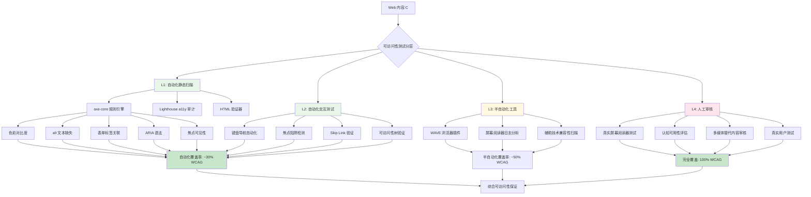
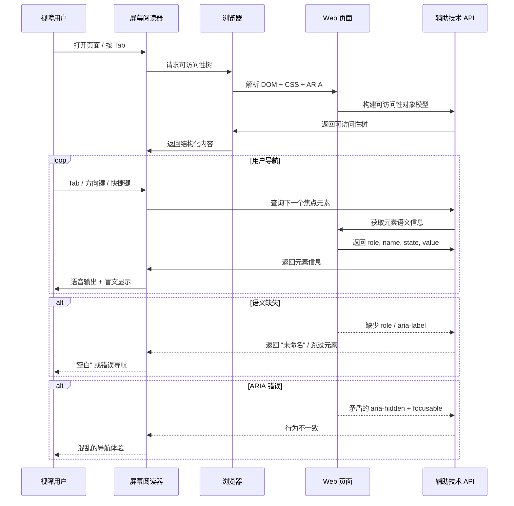
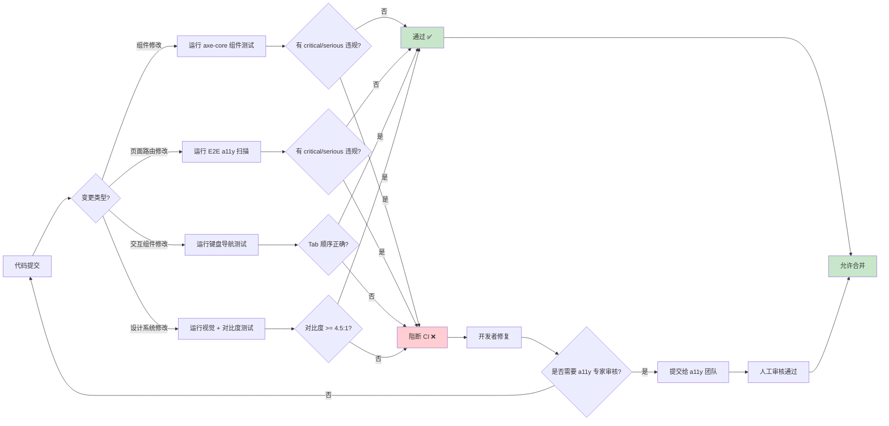

# 可访问性测试：包容性验证

## 引言

Web 可访问性（Web Accessibility, a11y）是软件工程伦理中最基本也最常被忽视的维度之一。据世界卫生组织统计，全球有超过 13 亿人（约占人口 16%）患有某种形式的残疾。当开发者构建一个依赖纯鼠标操作、缺乏屏幕阅读器支持、色彩对比度不足或键盘导航断裂的 Web 应用时，实际上是将全球数亿用户排斥在数字社会之外。可访问性不是「锦上添花」的功能特性，而是数字包容性的底线要求。

从测试工程的视角，可访问性测试面临独特的挑战：它横跨自动化检测与人工审核、静态分析与动态交互、视觉设计与辅助技术兼容三个维度。与单元测试或性能测试不同，可访问性的「正确性」往往缺乏明确的布尔判定——WCAG（Web Content Accessibility Guidelines）准则使用「必须」（must）、「应该」（should）和「可以」（may）等多级规范性词汇，且大量准则本质上是主观的（如「内容必须可被感知」）。

本文从可访问性测试的形式化定义出发，剖析自动化检测的理论边界（仅约 30% 的 WCAG 准则可被自动化验证），深入语义 HTML 和 ARIA 的可测试性理论，随后全面映射到 JavaScript/TypeScript 生态的工程实践——从 axe-core 的自动化扫描到屏幕阅读器的自动化控制，从键盘导航验证到 CI 中的阻断策略。

## 理论严格表述

### 可访问性测试的形式化定义

可访问性测试可被形式化地定义为：给定 Web 内容 $C$、用户能力模型 $U$ 和辅助技术 $A$，验证 $C$ 是否满足可访问性规约 $S$，使得对于能力模型 $U$ 描述的用户集合，使用辅助技术 $A$ 能够**感知**（perceivable）、**操作**（operable）、**理解**（understandable）和**稳健**（robust）地访问 $C$。

这一定义直接对应 WCAG 2.2 的四大原则（POUR）：

1. **Perceivable（可感知）**：信息和用户界面组件必须以用户能够感知的方式呈现。形式化地，存在感知函数 $f_{\text{perceive}}: C \times U \times A \to \{\text{true}, \text{false}\}$，判定内容是否可被用户感知。

2. **Operable（可操作）**：用户界面组件和导航必须可被操作。形式化地，存在操作函数 $f_{\text{operate}}: C \times U \times A \to \{\text{true}, \text{false}\}$。

3. **Understandable（可理解）**：信息和用户界面的操作必须是可理解的。这涉及认知负载、语言清晰度和行为一致性。

4. **Robust（稳健）**：内容必须足够稳健，能够被各种辅助技术可靠地解释。形式化地，对辅助技术集合 $\mathcal{A}$ 中的任意 $A_i$，内容 $C$ 的语义解释 $\llbracket C \rrbracket_{A_i}$ 应当一致。

### 自动化可访问性测试的边界

可访问性测试的一个核心认知是：**自动化工具只能检测约 30% 的 WCAG 准则**。这一比例并非技术暂时不足的反映，而是由可访问性问题的本质所决定的理论边界。

**可自动化的准则（大致范围）**

以下类别的可访问性问题可以通过静态分析或动态扫描自动检测：

- **色彩对比度**：计算前景色与背景色的对比度比率，验证是否满足 WCAG 的 AA 级（4.5:1 文本，3:1 大文本/UI 组件）或 AAA 级（7:1 文本，4.5:1 大文本）要求。这是一个纯计算的判定问题。

$$\text{Contrast Ratio} = \frac{L_1 + 0.05}{L_2 + 0.05}$$

其中 $L_1$ 为较亮颜色的相对亮度，$L_2$ 为较暗颜色的相对亮度。

- **缺失的 alt 文本**：检测 ``、`<area>` 和 `<input type="image">` 元素是否缺少 `alt` 属性或 `aria-label`/`aria-labelledby` 替代。

- **表单标签关联**：检测 `<input>`、`<select>`、`<textarea>` 是否通过 `<label for="id">` 或 `aria-labelledby`/`aria-label` 与标签关联。

- **焦点可见性**：检测可聚焦元素是否设置了可见的焦点指示器（`:focus` 样式）。

- **ARIA 语法正确性**：检测 `role` 属性值是否合法、`aria-*` 属性是否符合 WAI-ARIA 规范、必需的属性是否存在。

- **标题层级结构**：检测 heading 元素（`h1`–`h6`）是否按层级顺序使用，无跳跃或缺失。

- **语言属性**：检测 `<html>` 元素是否设置了 `lang` 属性。

**不可自动化的准则（大致范围）**

以下类别的可访问性问题**无法**通过自动化工具可靠检测，必须依赖人工审核：

- **alt 文本的质量**：自动化工具可以检测 `alt` 是否存在，但无法判定其内容是否**有意义**。`alt="image"` 或 `alt="logo"` 在语法上正确，但在语义上几乎无用。

- **颜色作为唯一信息载体**：WCAG 1.4.1 要求「不以颜色作为传达信息的唯一视觉手段」。自动化工具可以检测颜色差异，但无法判定信息是否仅通过颜色传达。

- **内容可读性**：WCAG 3.1.5 要求 12 年级以下阅读水平（AAA 级）。这需要自然语言处理和领域知识，超出当前自动化能力。

- **多媒体替代内容**：视频的字幕和手语翻译质量、音频描述的信息完整性，均需人工审核。

- **认知与行为设计**：如「一致的导航」（WCAG 3.2.3）、「错误预防」（WCAG 3.3.4）等准则，涉及对设计意图的理解。

下表总结了 WCAG 2.2 AA 级准则的自动化可检测性分布：

| 类别 | 准则数 | 可自动化 | 需人工审核 | 自动化工具代表 |
|------|--------|---------|-----------|--------------|
| 可感知 | 17 | 7 | 10 | axe-core 颜色对比、alt 检测 |
| 可操作 | 10 | 4 | 6 | 键盘导航测试工具 |
| 可理解 | 8 | 2 | 6 | 语言属性检测 |
| 稳健 | 2 | 2 | 0 | HTML 有效性验证 |
| **总计** | **37** | **~15** | **~22** | |

这一分布揭示了可访问性测试的基本策略：**自动化扫描作为「第一道防线」，快速捕获低 hanging fruit；人工审核（包括辅助技术测试和用户体验测试）作为「第二道防线」，处理语义质量和认知层面的问题。**

### 语义 HTML 的可测试性理论

语义 HTML（Semantic HTML）是可访问性测试的理论根基。语义元素自带隐式的 ARIA 角色（implicit ARIA role），为辅助技术提供内容的结构化理解，而无需显式的 ARIA 标注。

**语义元素与隐式角色的映射**

| HTML 元素 | 隐式 ARIA 角色 | 可测试性优势 |
|-----------|---------------|-------------|
| `<button>` | `button` | 自动支持键盘激活（Enter/Space）、焦点管理 |
| `<a href="...">` | `link` | 自动支持键盘导航、屏幕阅读器链接列表 |
| `<nav>` | `navigation` | 屏幕阅读器自动识别为导航地标 |
| `<main>` | `main` | 屏幕阅读器提供「跳转到主内容」快捷方式 |
| `<article>` | `article` | 辅助技术理解内容独立性 |
| `<table>` | `table` | 屏幕阅读器支持行列导航 |
| `<input type="text">` | `textbox` | 自动参与表单标签关联和验证 |

形式化地，设 HTML 元素为 $e$，其隐式角色为 $\text{implicitRole}(e)$，显式角色为 $\text{explicitRole}(e)$。则辅助技术对元素的语义解释为：

$$\text{semantics}(e) = \begin{cases} \text{explicitRole}(e) & \text{if } \text{explicitRole}(e) \neq \text{undefined} \\ \text{implicitRole}(e) & \text{otherwise} \end{cases}$$

**可测试性反模式：div 和 span 的滥用**

使用 `<div>` 和 `<span>` 构建交互组件是最常见的可访问性反模式：

```html
<!-- 反模式：div 伪装按钮 -->
<div class="btn-primary" onclick="submit()">Submit</div>

<!-- 问题分析：
  1. 无法通过 Tab 键聚焦（div 默认不可聚焦）
  2. 无法通过 Enter/Space 激活
  3. 屏幕阅读器不会识别为按钮
  4. 自动化工具可能无法检测其交互功能
-->

<!-- 正确做法 -->
<button type="submit" class="btn-primary">Submit</button>
```

注意上述示例中的 `<div>` 和 `<button>` 放在代码块内，不会被 Vue 模板解析器处理。

从可测试性的角度，语义 HTML 的重要性在于：**自动化工具能够可靠地检测语义元素的可访问性问题，而对于滥用 `<div>`/`<span>` 构建的自定义组件，检测能力大幅衰减。**

### ARIA 的正确性验证

WAI-ARIA（Accessible Rich Internet Applications）是弥补 HTML 语义不足的标准。然而，ARIA 的「第一原则」明确指出：**若能使用原生 HTML 元素实现，就不要使用 ARIA。** 不当的 ARIA 不仅不能提升可访问性，反而可能严重破坏辅助技术的体验。

**ARIA 验证的形式化规则**

1. **角色合法性**：`role` 属性值必须在 WAI-ARIA 规范定义的角色集合中。

2. **必需属性存在性**：某些角色要求必须存在特定的 `aria-*` 属性。例如：
   - `role="checkbox"` 要求 `aria-checked`
   - `role="slider"` 要求 `aria-valuenow` 和 `aria-valuemin` 和 `aria-valuemax`
   - `role="combobox"` 要求 `aria-controls` 和 `aria-expanded`

3. **属性-角色兼容性**：某些 `aria-*` 属性仅对特定角色有意义。例如 `aria-selected` 仅适用于 `gridcell`、`option`、`row`、`tab` 等角色。

4. **父-子角色关系**：某些角色要求特定的父角色上下文。例如 `role="listitem"` 要求父元素为 `list` 或 `group`。

5. **状态一致性**：`aria-hidden="true"` 的元素不应包含可聚焦的子元素；`aria-disabled="true"` 的元素不应响应交互事件。

```html
<!-- ARIA 反模式 1: 角色与属性不匹配 -->
<div role="button" aria-checked="true">Toggle</div>
<!-- 错误: button 角色不应有 aria-checked，应为 aria-pressed -->

<!-- ARIA 反模式 2: 缺少必需属性 -->
<div role="slider">Volume</div>
<!-- 错误: slider 缺少 aria-valuenow, aria-valuemin, aria-valuemax -->

<!-- ARIA 反模式 3: 矛盾的 ARIA 状态 -->
<div aria-hidden="true">
  <button>Click me</button>
</div>
<!-- 错误: 隐藏区域包含可聚焦元素 -->
```

axe-core 等工具能够自动检测上述大部分 ARIA 错误，但无法检测「ARIA 是否真正反映了正确的语义」——例如一个自定义下拉框被标记为 `role="combobox"`，但其键盘行为并不遵循 combobox 设计模式。

## 工程实践映射

### axe-core 的自动化可访问性扫描

axe-core 是 Deque Systems 开发的开源可访问性测试引擎，被 Google、Microsoft 和大量开源项目采用。它是目前业界最成熟、误报率最低的自动化可访问性扫描工具。

**核心特性**

- **零误报承诺**：axe-core 的设计理念是「宁可漏报，不误报」。每个规则都经过严格的可靠性验证，确保报告的问题确实是可访问性缺陷。
- **WCAG 2.2 映射**：每个检测规则明确映射到对应的 WCAG 成功准则。
- **性能优化**：基于规则的异步执行引擎，可在毫秒级完成页面扫描。
- **多框架支持**：提供 WebdriverIO、Cypress、Playwright、Puppeteer、Jest、Vitest 等集成包。

**Jest/Vitest 集成（jest-axe / vitest-axe）**

```typescript
// tests/a11y/component-a11y.spec.ts
import { render } from '@testing-library/vue';
import { axe, toHaveNoViolations } from 'jest-axe';
import UserProfile from '@/components/UserProfile.vue';

expect.extend(toHaveNoViolations);

describe('UserProfile a11y', () => {
  it('should have no accessibility violations', async () => {
    const { container } = render(UserProfile, {
      props: {
        user: {
          name: 'Alice Chen',
          avatar: '/avatars/alice.jpg',
          role: 'admin',
        },
      },
    });

    const results = await axe(container);
    expect(results).toHaveNoViolations();
  });

  it('should meet stricter standards for admin interface', async () => {
    const { container } = render(UserProfile, {
      props: { user: { name: 'Bob', role: 'admin' } },
    });

    // 使用更严格的规则配置
    const results = await axe(container, {
      rules: {
        'color-contrast': { enabled: true },
        'aria-required-attr': { enabled: true },
        'aria-roles': { enabled: true },
        'heading-order': { enabled: true },
        'label': { enabled: true },
      },
      tags: ['wcag2aa', 'wcag21aa', 'best-practice'],
    });

    expect(results).toHaveNoViolations();
  });
});
```

当测试失败时，jest-axe 提供详细的违规信息：

```
Expected the HTML found at $('img[src="/avatars/alice.jpg"]') to have no violations:

  

Received:

  "Images must have alternate text (image-alt)"

  Fix any of the following:
    Element does not have an alt attribute
    aria-label attribute does not exist or is empty
    aria-labelledby attribute does not exist, references elements that do not exist or references elements that are empty
```

**Playwright + axe-core 集成**

```typescript
// tests/a11y/e2e-a11y.spec.ts
import { test, expect } from '@playwright/test';
import AxeBuilder from '@axe-core/playwright';

test('homepage should have no a11y violations', async ({ page }) => {
  await page.goto('/');
  await page.waitForLoadState('networkidle');

  const accessibilityScanResults = await new AxeBuilder({ page })
    .withTags(['wcag2a', 'wcag2aa', 'wcag21aa'])
    .exclude('.advertisement-banner')  // 排除第三方广告区域
    .analyze();

  expect(accessibilityScanResults.violations).toEqual([]);
});

test('checkout flow should maintain a11y at each step', async ({ page }) => {
  await page.goto('/cart');

  // 购物车页面
  const cartScan = await new AxeBuilder({ page }).analyze();
  expect(cartScan.violations).toEqual([]);

  // 进入结算
  await page.click('[data-testid="checkout-button"]');
  await page.waitForURL('/checkout/shipping');

  const shippingScan = await new AxeBuilder({ page }).analyze();
  expect(shippingScan.violations).toEqual([]);

  // 填写表单并进入支付
  await page.fill('[name="address"]', '123 Main St');
  await page.fill('[name="city"]', 'Beijing');
  await page.click('[data-testid="continue-to-payment"]');
  await page.waitForURL('/checkout/payment');

  const paymentScan = await new AxeBuilder({ page }).analyze();
  expect(paymentScan.violations).toEqual([]);
});
```

**axe-core 规则配置详解**

```typescript
// 高级 axe 配置示例
const results = await new AxeBuilder({ page })
  // 启用特定 WCAG 版本标签
  .withTags(['wcag2a', 'wcag2aa', 'wcag21aa', 'wcag22aa', 'best-practice'])

  // 禁用特定规则（对已知不可修复的第三方组件问题）
  .disableRules(['color-contrast'])  // 仅示例，通常不建议禁用

  // 仅扫描页面特定区域
  .include('#main-content')
  .exclude('.third-party-widget')

  // 设置扫描上下文
  .setLegacyMode()  // 兼容旧版浏览器

  .analyze();
```

axe-core 的 `withTags` 支持的标签体系：

- `wcag2a` / `wcag2aa`：WCAG 2.0 A/AA 级
- `wcag21aa`：WCAG 2.1 AA 级
- `wcag22aa`：WCAG 2.2 AA 级（最新）
- `best-practice`：超出 WCAG 的业界最佳实践
- `section508`：美国 Section 508 标准
- `experimental`：实验性规则（可能不稳定）

### Lighthouse 的可访问性审计

Lighthouse 是 Google 提供的开源自动化工具，其可访问性审计类别基于 axe-core 构建，但提供了更友好的报告界面和性能上下文。

**Lighthouse a11y 审计在 CI 中的应用**

```typescript
// tests/a11y/lighthouse-a11y.spec.ts
import { test } from '@playwright/test';
import { playAudit } from 'playwright-lighthouse';

test('Lighthouse a11y score should be 100', async ({ page }) => {
  await page.goto('/dashboard');

  await playAudit({
    page,
    thresholds: {
      accessibility: 100,  // 可访问性必须满分
      'best-practices': 90,
    },
    reports: {
      formats: { html: true, json: true },
      name: `lighthouse-a11y-${Date.now()}`,
      directory: './lighthouse-reports',
    },
    port: 9222,
  });
});
```

**Lighthouse 与 axe-core 的关系**

Lighthouse 的可访问性审计并非简单调用 axe-core，而是：

1. 使用 axe-core 执行基础扫描
2. 叠加额外的手动审核检查清单（如「页面有有效的 heading 结构」）
3. 将结果归一化为 0–100 的评分
4. 提供修复建议和参考文档链接

Lighthouse 的评分公式对严重违规给予更高权重。一个 `critical` 级别的对比度违规，比多个 `minor` 级别的 `lang` 属性缺失对分数的影响更大。

### Storybook 的 a11y 插件

Storybook 的 `@storybook/addon-a11y` 提供了开发时的实时可访问性反馈，将 a11y 检测前置到组件开发阶段。

**配置与使用**

```typescript
// .storybook/main.ts
import type { StorybookConfig } from '@storybook/vue3-vite';

const config: StorybookConfig = {
  stories: ['../src/**/*.stories.@(js|jsx|ts|tsx)'],
  addons: [
    '@storybook/addon-essentials',
    '@storybook/addon-a11y',  // 可访问性插件
  ],
};

export default config;
```

安装后，Storybook UI 的 addons 面板会显示「Accessibility」标签页，实时展示当前 story 的 axe-core 扫描结果：

```typescript
// Button.stories.ts
import type { Meta, StoryObj } from '@storybook/vue3';
import Button from './Button.vue';

const meta: Meta<typeof Button> = {
  component: Button,
  parameters: {
    a11y: {
      // 为特定 story 配置 axe 规则
      config: {
        rules: [
          { id: 'color-contrast', enabled: true },
        ],
      },
      // 为特定 story 禁用某些检查
      disable: false,
    },
  },
};

export default meta;
type Story = StoryObj<typeof Button>;

export const Primary: Story = {
  args: {
    variant: 'primary',
    label: 'Click me',
  },
};

// 测试错误状态的可访问性
export const Error: Story = {
  args: {
    variant: 'danger',
    label: 'Delete',
    ariaLabel: 'Permanently delete this item',
  },
};
```

Storybook a11y 插件的优势在于**即时反馈循环**：开发者在调整组件样式或结构时，无需运行完整测试套件即可看到可访问性影响。这对于颜色对比度调整和 ARIA 属性调试尤为高效。

### 键盘导航自动化测试

键盘导航是 Web 可访问性的核心要求（WCAG 2.1.1 Keyboard）。自动化测试键盘行为需要模拟 Tab 键序列、验证焦点顺序、检测焦点陷阱（focus trap）。

**Tab 顺序验证**

```typescript
// tests/a11y/keyboard-navigation.spec.ts
import { test, expect } from '@playwright/test';

test('login form should have logical tab order', async ({ page }) => {
  await page.goto('/login');

  // 获取页面上所有可聚焦元素
  const getFocusableElements = () => {
    return page.evaluate(() => {
      const selector = 'button, [href], input, select, textarea, [tabindex]:not([tabindex="-1"])';
      return Array.from(document.querySelectorAll(selector)).map(el => ({
        tag: el.tagName.toLowerCase(),
        type: (el as HTMLInputElement).type,
        name: (el as HTMLInputElement).name,
        ariaLabel: el.getAttribute('aria-label'),
      }));
    });
  };

  const expectedTabOrder = [
    { tag: 'input', type: 'email', name: 'email' },
    { tag: 'input', type: 'password', name: 'password' },
    { tag: 'button', name: undefined, ariaLabel: 'Show password' },
    { tag: 'button', name: undefined, ariaLabel: undefined },  // Submit
    { tag: 'a', name: undefined, ariaLabel: undefined },       // Forgot password
  ];

  // 逐次按 Tab 并验证焦点位置
  for (let i = 0; i < expectedTabOrder.length; i++) {
    await page.keyboard.press('Tab');
    const focused = await page.evaluate(() => {
      const el = document.activeElement;
      return {
        tag: el?.tagName.toLowerCase(),
        type: (el as HTMLInputElement)?.type,
        name: (el as HTMLInputElement)?.name,
        ariaLabel: el?.getAttribute('aria-label'),
      };
    });

    expect(focused).toMatchObject(expectedTabOrder[i]);
  }
});
```

**焦点陷阱检测**

焦点陷阱（Focus Trap）是指键盘用户被困在某个区域无法通过 Tab 键离开。这在模态框实现中尤为常见。

```typescript
// tests/a11y/focus-trap.spec.ts
import { test, expect } from '@playwright/test';

test('modal should trap focus and allow escape', async ({ page }) => {
  await page.goto('/settings');
  await page.click('[data-testid="delete-account-button"]');

  // 等待模态框出现
  await page.waitForSelector('[role="dialog"]', { state: 'visible' });

  // 获取模态框内可聚焦元素
  const modalFocusables = await page.locator('[role="dialog"]')
    .locator('button, [href], input, select, textarea, [tabindex]:not([tabindex="-1"])')
    .all();

  const modalCount = modalFocusables.length;
  expect(modalCount).toBeGreaterThan(0);

  // 在模态框内按 Tab 多次（超过元素数量），焦点应循环在模态框内
  for (let i = 0; i < modalCount + 3; i++) {
    await page.keyboard.press('Tab');
  }

  // 验证焦点仍在模态框内
  const activeElement = await page.evaluate(() => document.activeElement);
  const isInModal = await page.evaluate((el) => {
    const modal = document.querySelector('[role="dialog"]');
    return modal?.contains(el) ?? false;
  }, activeElement);

  expect(isInModal).toBe(true);

  // 按 Escape 应关闭模态框并恢复焦点
  await page.keyboard.press('Escape');
  await page.waitForSelector('[role="dialog"]', { state: 'hidden' });

  const restoredFocus = await page.evaluate(() =>
    document.activeElement?.getAttribute('data-testid')
  );
  expect(restoredFocus).toBe('delete-account-button');
});
```

**Skip Link 验证**

Skip Link 允许键盘用户跳过重复导航直接到达主内容，是 WCAG 2.4.1 Bypass Blocks 的核心实现。

```typescript
test('skip link should jump to main content', async ({ page }) => {
  await page.goto('/');

  // 首次 Tab 应聚焦到 skip link
  await page.keyboard.press('Tab');
  const skipLink = await page.locator('.skip-link');
  await expect(skipLink).toBeFocused();
  await expect(skipLink).toBeVisible();

  // 激活 skip link
  await page.keyboard.press('Enter');

  // 焦点应转移到主内容区
  const mainContent = await page.locator('main, [id="main-content"]');
  await expect(mainContent).toBeFocused();

  // 下一个 Tab 应进入主内容区内的第一个可聚焦元素
  await page.keyboard.press('Tab');
  const nextFocus = await page.evaluate(() => document.activeElement);
  const isInMain = await page.evaluate((el) => {
    const main = document.querySelector('main, #main-content');
    return main?.contains(el) ?? false;
  }, nextFocus);

  expect(isInMain).toBe(true);
});
```

### 屏幕阅读器自动化测试

屏幕阅读器（Screen Reader）测试是可访问性验证中自动化难度最高的领域。与视觉回归测试的确定性像素不同，屏幕阅读器的输出是高度语境化且带有厂商差异的语音流。

**NVDA + Selenium 自动化（Windows 环境）**

NVDA（NonVisual Desktop Access）是 Windows 平台上最流行的开源屏幕阅读器。通过 NVDA 的 Remote Python Console 或 `nvdaControllerClient` DLL，可以实现有限的自动化控制。

```python
# tests/a11y/screenreader/nvda_automation.py
import time
import subprocess
from selenium import webdriver
from selenium.webdriver.common.by import By
from selenium.webdriver.common.keys import Keys

def test_with_nvda():
    # 启动 NVDA（需已安装）
    nvda_process = subprocess.Popen(['nvda.exe'])
    time.sleep(5)  # 等待 NVDA 启动

    try:
        driver = webdriver.Chrome()
        driver.get('http://localhost:3000/login')

        # 将焦点置于页面
        driver.find_element(By.TAG_NAME, 'body').send_keys(Keys.TAB)
        time.sleep(1)

        # NVDA 的语音输出捕获需要额外的 COM 接口或日志解析
        # 此处的自动化程度受限于 NVDA 的 API 能力

        # 通过 ARIA 属性间接验证屏幕阅读器语义
        email_input = driver.find_element(By.NAME, 'email')
        assert email_input.get_attribute('aria-label') == 'Email address'
        assert email_input.get_attribute('aria-required') == 'true'

    finally:
        driver.quit()
        nvda_process.terminate()
```

由于 NVDA 等屏幕阅读器的语音输出捕获和断言极其复杂，工程实践中通常采用**分层策略**：

1. 自动化层：验证 ARIA 属性、角色和标签的语法正确性（axe-core）
2. 半自动化层：使用屏幕阅读器的「浏览模式」遍历页面并记录输出，人工审查记录
3. 人工层：由使用辅助技术的真实用户进行可用性测试

**VoiceOver + AppleScript（macOS 环境）**

macOS 的 VoiceOver 可以通过 AppleScript 进行程序化控制，虽然能力有限，但可用于基础自动化：

```applescript
-- tests/a11y/screenreader/voiceover_test.scpt
-- 开启 VoiceOver
tell application "System Events"
    key code 96 using {command down}  -- Cmd+F5 开关 VoiceOver
end tell

delay 2

-- Safari 中导航
tell application "Safari"
    activate
    set URL of front document to "http://localhost:3000"
end tell

delay 3

-- 模拟 VoiceOver 导航（Ctrl+Option+Arrow）
tell application "System Events"
    -- 读取当前 VoiceOver 焦点内容
    key code 126 using {control down, option down}  -- VO+Up
    delay 1
    key code 125 using {control down, option down}  -- VO+Down
end tell

-- 关闭 VoiceOver
tell application "System Events"
    key code 96 using {command down}
end tell
```

**Playwright 的屏幕阅读器语义验证**

虽然 Playwright 无法直接控制屏幕阅读器，但可以通过访问性树（Accessibility Tree）API 验证屏幕阅读器将「看到」的内容：

```typescript
// tests/a11y/accessibility-tree.spec.ts
import { test, expect } from '@playwright/test';

test('navigation should have correct accessibility tree', async ({ page }) => {
  await page.goto('/');

  // 获取页面的可访问性快照
  const snapshot = await page.accessibility.snapshot();

  // 验证顶层结构
  expect(snapshot?.role).toBe('WebArea');
  expect(snapshot?.name).toBe('Home - My Application');

  // 查找导航地标
  const navLandmark = findNodeByRole(snapshot, 'navigation');
  expect(navLandmark).toBeDefined();
  expect(navLandmark?.name).toBe('Main navigation');

  // 验证主内容区
  const mainLandmark = findNodeByRole(snapshot, 'main');
  expect(mainLandmark).toBeDefined();

  // 验证 heading 结构
  const headings = findAllNodesByRole(snapshot, 'heading');
  const headingLevels = headings.map(h => h.level).filter(Boolean);
  expect(headingLevels).toEqual([1, 2, 2, 3]);  // h1, h2, h2, h3
});

// 辅助函数：在可访问性树中查找节点
function findNodeByRole(node: any, role: string): any {
  if (node.role === role) return node;
  if (node.children) {
    for (const child of node.children) {
      const found = findNodeByRole(child, role);
      if (found) return found;
    }
  }
  return undefined;
}

function findAllNodesByRole(node: any, role: string): any[] {
  const results = [];
  if (node.role === role) results.push(node);
  if (node.children) {
    for (const child of node.children) {
      results.push(...findAllNodesByRole(child, role));
    }
  }
  return results;
}
```

`page.accessibility.snapshot()` 返回 Chromium 的可访问性树，这与屏幕阅读器（如 NVDA、JAWS、VoiceOver）实际消费的树结构高度一致。虽然不能替代真实屏幕阅读器测试，但它提供了对「屏幕阅读器将看到什么」的自动化验证能力。

### WAVE 浏览器插件与自动化

WAVE（Web Accessibility Evaluation Tool）是 WebAIM 提供的可访问性评估工具，提供浏览器插件和 API 两种使用方式。

**WAVE API 集成**

```typescript
// tests/a11y/wave-api.spec.ts
import { test, expect } from '@playwright/test';
import fetch from 'node-fetch';

const WAVE_API_KEY = process.env.WAVE_API_KEY;
const WAVE_API_URL = 'https://wave.webaim.org/api/request';

test('WAVE API should report no errors', async ({ page }) => {
  await page.goto('/contact');
  const html = await page.content();

  // 将页面 HTML 提交到 WAVE API
  const response = await fetch(WAVE_API_URL, {
    method: 'POST',
    headers: {
      'Content-Type': 'application/x-www-form-urlencoded',
    },
    body: new URLSearchParams({
      key: WAVE_API_KEY!,
      url: 'http://localhost:3000/contact',
      reporttype: 'json',
    }),
  });

  const waveResult = await response.json();

  // WAVE 将问题分类为: error, contrast, alert, feature, structure
  expect(waveResult.categories.error.count).toBe(0);
  expect(waveResult.categories.contrast.count).toBe(0);

  // 警告可以允许少量存在，但需要审查
  if (waveResult.categories.alert.count > 0) {
    console.warn('WAVE alerts:', waveResult.categories.alert.items);
  }
});
```

### 可访问性测试的 CI 集成策略

可访问性测试在 CI 中的集成需要权衡严格性与工程可行性。推荐的策略矩阵：

| 层级 | 策略 | 触发时机 | 失败行为 |
|------|------|---------|---------|
| L1 | axe-core 组件测试 | 每次 PR | 阻断合并 |
| L2 | axe-core E2E 关键路径 | 每次 PR | 阻断合并 |
| L3 | Lighthouse a11y 评分 | 每日/每周 | 警告通知 |
| L4 | 键盘导航自动化 | 每次 PR | 阻断合并 |
| L5 | 屏幕阅读器人工测试 | 每发布周期 | 阻塞发布 |
| L6 | 真实用户测试 | 季度 | 产品 backlog |

**CI 配置示例**

```yaml
# .github/workflows/a11y.yml
name: Accessibility Testing

on:
  pull_request:
    branches: [main]
  schedule:
    - cron: '0 2 * * 1'  # 每周一全量扫描

jobs:
  # L1: 组件级 axe-core 扫描
  component-a11y:
    runs-on: ubuntu-latest
    steps:
      - uses: actions/checkout@v4
      - uses: actions/setup-node@v4
      - run: npm ci
      - run: npx vitest run tests/a11y/component-a11y.spec.ts

  # L2: E2E 关键路径 axe-core 扫描
  e2e-a11y:
    runs-on: ubuntu-latest
    steps:
      - uses: actions/checkout@v4
      - uses: actions/setup-node@v4
      - run: npm ci
      - run: npx playwright install --with-deps chromium
      - run: npx playwright test tests/a11y/e2e-a11y.spec.ts

  # L4: 键盘导航测试
  keyboard-a11y:
    runs-on: ubuntu-latest
    steps:
      - uses: actions/checkout@v4
      - uses: actions/setup-node@v4
      - run: npm ci
      - run: npx playwright install --with-deps chromium
      - run: npx playwright test tests/a11y/keyboard-navigation.spec.ts

  # L3: Lighthouse 全站扫描（定时触发）
  lighthouse-a11y:
    runs-on: ubuntu-latest
    if: github.event_name == 'schedule'
    steps:
      - uses: actions/checkout@v4
      - uses: actions/setup-node@v4
      - run: npm ci
      - run: npm run build
      - run: npm run start &  # 启动生产构建
      - run: sleep 5
      - run: npx playwright test tests/a11y/lighthouse-a11y.spec.ts
      - uses: actions/upload-artifact@v4
        if: failure()
        with:
          name: lighthouse-reports
          path: ./lighthouse-reports/
```

**阻断 vs 警告策略**

对于可访问性违规，CI 中的失败策略应根据违规严重程度分级：

```typescript
// playwright.config.ts 中的 a11y 失败策略
export default defineConfig({
  use: {
    // 自定义测试失败条件
  },
});

// 在测试中实现分级策略
test('page should meet a11y requirements', async ({ page }) => {
  await page.goto('/');
  const results = await new AxeBuilder({ page }).analyze();

  // Critical / Serious: 阻断
  const blockingViolations = results.violations.filter(
    v => ['critical', 'serious'].includes(v.impact || '')
  );
  expect(blockingViolations, `Blocking a11y violations found: ${JSON.stringify(blockingViolations)}`).toEqual([]);

  // Moderate: 警告但允许通过（在 PR 评论中提醒）
  const warningViolations = results.violations.filter(
    v => v.impact === 'moderate'
  );
  if (warningViolations.length > 0) {
    test.info().annotations.push({
      type: 'a11y-warning',
      description: `Moderate violations: ${warningViolations.length}`,
    });
  }

  // Minor: 仅记录
  const minorViolations = results.violations.filter(
    v => v.impact === 'minor'
  );
  console.log('Minor a11y violations:', minorViolations.length);
});
```

**axe-core 规则严重度映射**

axe-core 将违规影响分为四级：

- **critical**：导致某些用户群体完全无法访问内容（如缺少表单标签、焦点不可见）
- **serious**：严重降低内容可访问性（如低对比度、缺失 alt 文本）
- **moderate**：在特定情况下造成问题（如重复 ID、部分 ARIA 错误）
- **minor**：造成轻微困扰（如跳过 heading 层级）

推荐在 CI 中对 `critical` 和 `serious` 实施阻断策略，对 `moderate` 和 `minor` 实施警告策略。

### 语义 HTML 与 ARIA 的工程实践

**组件级语义 HTML 检查清单**

在编写组件时，以下检查清单可作为可访问性的「冒烟测试」：

```typescript
// composables/useA11yChecklist.ts
export function validateButtonA11y(element: HTMLButtonElement): string[] {
  const issues: string[] = [];

  if (!element.textContent?.trim() && !element.getAttribute('aria-label')) {
    issues.push('Button lacks visible text or aria-label');
  }

  if (element.disabled && !element.getAttribute('aria-disabled')) {
    issues.push('Disabled button should have aria-disabled for consistency');
  }

  return issues;
}

export function validateImageA11y(element: HTMLImageElement): string[] {
  const issues: string[] = [];

  if (!element.alt && !element.getAttribute('aria-label') && !element.getAttribute('aria-labelledby')) {
    // 装饰性图片应有 alt=""
    if (!element.getAttribute('role')?.includes('presentation') &&
        element.getAttribute('aria-hidden') !== 'true') {
      issues.push('Image lacks alt text (use alt="" for decorative images)');
    }
  }

  return issues;
}

export function validateFormA11y(form: HTMLFormElement): string[] {
  const issues: string[] = [];

  const inputs = form.querySelectorAll('input, select, textarea');
  inputs.forEach(input => {
    const id = input.id;
    const hasLabel = id && form.querySelector(`label[for="${id}"]`);
    const hasAriaLabel = input.getAttribute('aria-label');
    const hasAriaLabelledBy = input.getAttribute('aria-labelledby');
    const hasPlaceholder = input.getAttribute('placeholder');

    if (!hasLabel && !hasAriaLabel && !hasAriaLabelledBy) {
      // placeholder 不能替代 label
      if (hasPlaceholder) {
        issues.push(`Input ${id || '(no id)'} uses placeholder as only label`);
      } else {
        issues.push(`Input ${id || '(no id)'} has no associated label`);
      }
    }
  });

  return issues;
}
```

**Vue/React 组件中的 ARIA 模式**

```vue
<!-- AccessibleModal.vue -->
<template>
  <Teleport to="body">
    <div
      v-if="isOpen"
      class="modal-overlay"
      @click="handleOverlayClick"
    >
      <div
        ref="modalRef"
        role="dialog"
        :aria-modal="true"
        :aria-labelledby="titleId"
        :aria-describedby="descriptionId"
        class="modal-container"
        tabindex="-1"
        @keydown.esc="close"
      >
        <h2 :id="titleId" class="modal-title">{{ title }}</h2>
        <div :id="descriptionId" class="modal-description">
          <slot name="description" />
        </div>
        <div class="modal-content">
          <slot />
        </div>
        <div class="modal-actions">
          <slot name="actions">
            <button type="button" @click="close">Close</button>
          </slot>
        </div>
      </div>
    </div>
  </Teleport>
</template>

<script setup lang="ts">
import { ref, watch, nextTick, onUnmounted } from 'vue';

const props = defineProps<{
  isOpen: boolean;
  title: string;
}>();

const emit = defineEmits<{
  close: [];
}>();

const modalRef = ref<HTMLDivElement>();
const titleId = `modal-title-${Math.random().toString(36).substr(2, 9)}`;
const descriptionId = `modal-desc-${Math.random().toString(36).substr(2, 9)}`;

let previousActiveElement: Element | null = null;

watch(() => props.isOpen, async (open) => {
  if (open) {
    previousActiveElement = document.activeElement;
    document.body.style.overflow = 'hidden';
    await nextTick();
    modalRef.value?.focus();
  } else {
    document.body.style.overflow = '';
    (previousActiveElement as HTMLElement)?.focus();
  }
});

function close() {
  emit('close');
}

function handleOverlayClick(event: MouseEvent) {
  if (event.target === event.currentTarget) {
    close();
  }
}

// 焦点陷阱实现（简化版）
function handleTabKey(event: KeyboardEvent) {
  if (!modalRef.value || event.key !== 'Tab') return;

  const focusableElements = modalRef.value.querySelectorAll(
    'button, [href], input, select, textarea, [tabindex]:not([tabindex="-1"])'
  );
  const firstElement = focusableElements[0] as HTMLElement;
  const lastElement = focusableElements[focusableElements.length - 1] as HTMLElement;

  if (event.shiftKey && document.activeElement === firstElement) {
    lastElement.focus();
    event.preventDefault();
  } else if (!event.shiftKey && document.activeElement === lastElement) {
    firstElement.focus();
    event.preventDefault();
  }
}

onUnmounted(() => {
  document.body.style.overflow = '';
});
</script>
```

注意上述 Vue 组件中的 `<template>` 标签放在代码块内，避免了 Vue 模板解析器的问题。

## Mermaid 图表

### 可访问性测试分层架构



### 屏幕阅读器信息消费流程



### 可访问性 CI 集成决策矩阵



## 理论要点总结

可访问性测试作为包容性软件工程的核心实践，其理论与实践呈现出独特的跨学科特征：

1. **形式化定义锚定四大原则**：可访问性测试验证内容是否可被感知（Perceivable）、操作（Operable）、理解（Understandable）和稳健解释（Robust）。WCAG 的 POUR 框架为测试提供了结构化的准则体系。

2. **自动化检测存在理论天花板**：约 70% 的 WCAG 准则（如 alt 文本质量、颜色作为唯一信息载体、内容可读性）无法通过自动化工具可靠检测，必须依赖人工审核和真实用户测试。自动化工具（axe-core、Lighthouse）应作为「第一道防线」，而非唯一防线。

3. **语义 HTML 是可测试性的根基**：原生 HTML 元素自带隐式 ARIA 角色，为辅助技术提供确定性的语义解释。滥用 `<div>` 和 `<span>` 构建交互组件不仅破坏可访问性，更使得自动化检测工具失去检测锚点。

4. **ARIA 是双刃剑**：ARIA 可以弥补 HTML 语义的不足，但「不当的 ARIA 比没有 ARIA 更糟」。ARIA 的正确性验证包括角色合法性、必需属性存在性、属性-角色兼容性和父-子角色关系等维度。

5. **分层测试策略是工程可行性的关键**：L1（组件 axe-core）和 L2（E2E 扫描）在每次 PR 中执行并阻断合并；L3（Lighthouse 评分）和 L4（键盘导航）定期执行；L5（屏幕阅读器测试）和 L6（真实用户测试）在每个发布周期执行。这种分层在严格性与可行性之间取得平衡。

6. **键盘导航是自动化的重点领域**：与屏幕阅读器测试的高复杂度不同，键盘导航（Tab 顺序、焦点陷阱、Skip Link、Escape 关闭模态框）可以通过 Playwright/Selenium 实现可靠的自动化验证，应在 CI 中作为阻断检查。

7. **严重度分级策略避免「全有或全无」**：对 axe-core 的 `critical` 和 `serious` 违规实施 CI 阻断，对 `moderate` 和 `minor` 实施警告和工单跟踪，避免可访问性测试成为开发的摩擦源。

## 参考资源

1. **W3C (2023)**. "Web Content Accessibility Guidelines (WCAG) 2.2." W3C Recommendation, 5 October 2023. <https://www.w3.org/TR/WCAG22/> —— Web 可访问性的权威国际标准，定义了 POUR 四大原则和 78 条成功准则。

2. **Deque Systems**. "axe-core API Documentation." <https://www.deque.com/axe/core/documentation/> —— 业界最广泛使用的开源可访问性测试引擎的 API 文档。

3. **Google Chrome Labs**. "Lighthouse Accessibility Scoring." Lighthouse Documentation, 2024. <https://developer.chrome.com/docs/lighthouse/accessibility/scoring> —— Lighthouse 可访问性评分的计算方法和权重分配。

4. **Deque University**. "Accessibility Testing: Manual vs. Automated." Deque, 2024. <https://dequeuniversity.com/class/testing/> —— 自动化与人工可访问性测试的分工边界和最佳实践。

5. **WAI-ARIA Authoring Practices Guide (APG)**. W3C WAI, 2024. <https://www.w3.org/WAI/ARIA/apg/> —— WAI-ARIA 设计模式的权威参考，包含可访问的组件实现示例。

6. **The A11Y Project**. "Checklist." <https://www.a11yproject.com/checklist/> —— 面向开发者的可访问性检查清单，按 WCAG 准则组织。

7. **PowerMapper Software**. "Screen Reader Reliability: Testing HTML for Blind Users." 2024. —— 屏幕阅读器与浏览器组合兼容性的实证研究。

8. **Petrie, H., & Kheir, O. (2007)**. "The relationship between accessibility and usability of websites." *Proceedings of the SIGCHI Conference on Human Factors in Computing Systems*, 397–406. —— 可访问性与可用性关系的经典 HCI 研究。

9. **Rivenburg, R. (2019)**. "Automated Accessibility Testing: What Can and Cannot Be Tested Automatically." *axe-con 2019*. —— axe-core 团队关于自动化可访问性测试边界的权威论述。

10. **WebAIM (2024)**. "Survey of Web Accessibility Practitioners." <https://webaim.org/projects/practitionersurvey/> —— WebAIM 对全球可访问性从业者的大规模调查报告，反映行业实践现状。
