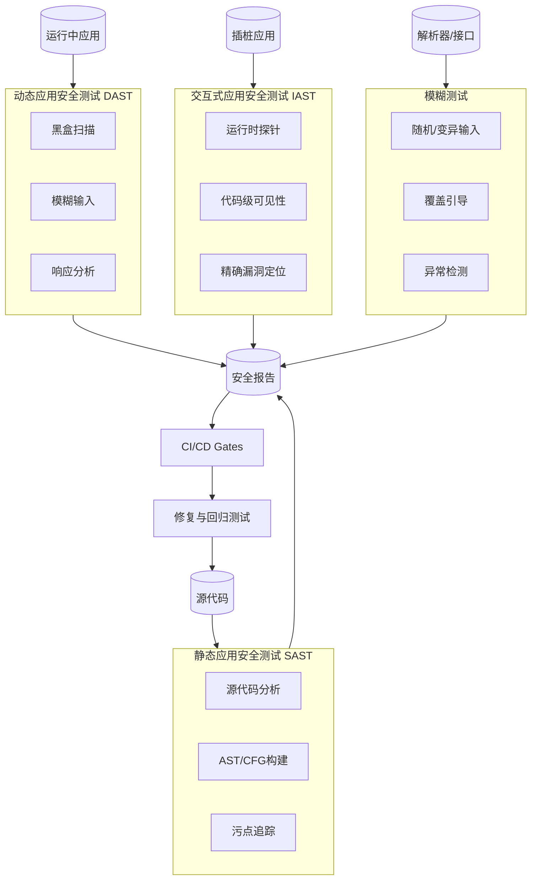
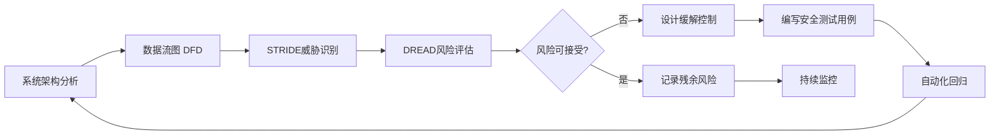
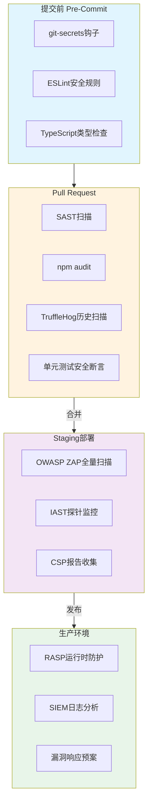

# 安全测试：攻防验证

## 引言

在软件系统的可靠性工程中，安全测试（Security Testing）是唯一一种以「对抗性思维」为核心的验证活动。与功能测试关注「系统是否正确执行了预期行为」不同，安全测试关注的是「系统在面对恶意输入、异常环境和攻击者时，是否能够维持其机密性（Confidentiality）、完整性（Integrity）与可用性（Availability）」。这三者共同构成了信息安全的 CIA 三元组，而安全测试正是验证这一三元组在动态运行环境中是否成立的系统性方法。

JavaScript/TypeScript 生态因其独特的运行环境——浏览器端的开放沙箱、Node.js 服务端的高权限 I/O、npm 生态的深度依赖树——而面临多维度的安全威胁。一个现代前端应用可能通过供应链攻击（Supply Chain Attack）引入恶意依赖，一个 Express API 可能因缺少参数化查询而暴露于 SQL 注入，一个 Next.js 应用可能因不严格的 CSP 策略而遭受 XSS 攻击。这些威胁的多样性与隐蔽性，使得安全测试必须从「偶尔执行的专项活动」转变为「嵌入 CI/CD 流水线的持续性工程实践」。

本文采用「理论严格表述」与「工程实践映射」的双轨结构，首先从安全测试的分类学、威胁建模与攻防方法论建立理论框架，随后将这些框架映射到 JS/TS 生态的工具链与流水线集成中，为构建纵深防御的测试体系提供方法论指引。

## 理论严格表述

### 安全测试的四维分类模型

安全测试的分类体系可从「分析时机」与「执行方式」两个维度展开，形成静态分析（SAST）、动态分析（DAST）、交互式分析（IAST）与模糊测试（Fuzzing）四大范式。

**1. 静态应用安全测试（SAST, Static Application Security Testing）**

SAST 是一种在不执行程序的情况下，通过分析源代码、字节码或二进制代码来发现安全漏洞的技术。其理论基础是程序分析的抽象解释（Abstract Interpretation）与符号执行（Symbolic Execution）。SAST 工具通过构建程序的抽象语法树（AST）或控制流图（CFG），追踪不可信数据（tainted data）从输入源（source）到危险汇点（sink）的传播路径，从而检测注入类漏洞。

形式化地，设程序中存在一组敏感操作集合 `S = {s₁, s₂, ..., sₙ}`（如 `eval`、`innerHTML`、`fs.readFile`），以及一组外部输入集合 `I = {i₁, i₂, ..., iₘ}`。SAST 的目标是判定是否存在路径 `p`，使得存在 `i ∈ I` 与 `s ∈ S`，在路径 `p` 上 `i` 未经充分净化（sanitization）即到达 `s`。这一判定问题在一般情况下是不可判定的（可归约到 Halting Problem），因此 SAST 工具必须在「完备性」（不遗漏真漏洞）与「 soundness」（不误报假漏洞）之间做出权衡。商业级 SAST 工具通常选择偏向 soundness 的近似策略，宁可产生误报也不愿漏报高危漏洞。

**2. 动态应用安全测试（DAST, Dynamic Application Security Testing）**

DAST 在程序运行状态下对其进行黑盒测试，通过构造恶意输入并观察系统响应来发现漏洞。DAST 不依赖源代码，而是将应用视为一个输入-输出系统，利用模糊化（fuzzing）与漏洞签名匹配技术进行探测。其理论基础是差分测试（Differential Testing）与异常检测：若系统对正常输入与恶意变体的响应存在显著差异（如错误信息泄露、非预期状态码、响应延迟异常），则可能存在安全漏洞。

DAST 的核心优势在于能够发现运行时才暴露的漏洞，如身份验证绕过、会话管理缺陷、业务逻辑漏洞以及配置错误。但其局限同样明显：DAST 无法覆盖未暴露的接口与死代码，且对需要复杂多步状态转换的漏洞（如权限提升链）检测能力有限。

**3. 交互式应用安全测试（IAST, Interactive Application Security Testing）**

IAST 是 SAST 与 DAST 的融合范式，通过在运行时向应用代码中注入探针（agent/probe），在真实执行路径上监控数据流与控制流。IAST 兼具 SAST 的代码级可见性与 DAST 的运行时上下文，能够在漏洞被触发的瞬间进行精确报告，显著降低误报率。

从认知科学的角度，IAST 相当于在程序执行过程中部署了「感知器官」，将原本黑盒的运行时行为转化为白盒的可观测数据。IAST 的检测精度高度依赖于测试用例的覆盖率——如果某个危险代码路径从未被测试或用户流量触及，IAST 探针也无法报告该路径上的漏洞。

**4. 模糊测试（Fuzzing）**

模糊测试是一种自动生成畸形或随机输入并监控系统异常行为的测试技术。现代模糊测试已从纯粹的随机输入演进为覆盖引导（Coverage-Guided）的智能模糊测试，以 AFL、libFuzzer 为代表。其核心理论是遗传算法与反馈驱动的搜索：模糊器保存触发新代码覆盖的输入作为「种子」，通过变异操作（位翻转、算术变换、字典替换）生成后代，不断向未探索的状态空间推进。

在 JS/TS 生态中，模糊测试面临独特的挑战：JavaScript 的动态类型与高度灵活的语法使得输入空间几乎无限，而 DOM API 与浏览器安全沙箱的交互进一步增加了状态复杂性。然而，针对解析器（如 JSON parser、HTML sanitizer）与正则表达式的模糊测试已证明能够发现大量高危漏洞（如 ReDoS——正则表达式拒绝服务）。

### OWASP Testing Guide 的方法论框架

OWASP（Open Web Application Security Project）Testing Guide 是 Web 应用安全测试领域最具影响力的方法论框架，其最新版本（v4.2 及 2021 年以来的更新）将安全测试活动划分为 12 个核心类别：

1. **信息收集（Information Gathering）**：识别技术栈、暴露端点、第三方组件版本
2. **配置与部署管理测试（Configuration and Deployment Management Testing）**：检查默认凭据、不安全的 HTTP 头、云存储配置错误
3. **身份管理测试（Identity Management Testing）**：验证账户枚举、弱密码策略、多因素认证绕过
4. **认证测试（Authentication Testing）**：暴力破解保护、会话固定、密码重置逻辑缺陷
5. **授权测试（Authorization Testing）**：水平与垂直权限提升、不安全的直接对象引用（IDOR）
6. **会话管理测试（Session Management Testing）**：Cookie 安全属性、JWT 签名验证、会话超时
7. **输入验证测试（Input Validation Testing）**：SQL 注入、XSS、XXE、命令注入、路径遍历
8. **错误处理测试（Error Handling）**：堆栈跟踪泄露、敏感信息暴露
9. **密码学测试（Cryptography Testing）**：弱算法、硬编码密钥、随机数可预测性
10. **业务逻辑测试（Business Logic Testing）**：工作流程绕过、竞争条件、价格篡改
11. **客户端测试（Client-side Testing）**：DOM XSS、CSP 绕过、本地存储安全
12. **API 测试（API Testing）**：GraphQL/SOAP/REST 特定漏洞、速率限制缺失

这 12 个类别构成了一个从外围到核心、从通用到业务的完整测试矩阵。方法论强调「基于风险的方法」（Risk-Based Approach）：测试资源应根据威胁模型的评估结果进行优先级分配，而非均匀撒网。

### 威胁建模驱动的安全测试

威胁建模（Threat Modeling）是一种在系统设计阶段识别、评估和缓解安全威胁的结构化方法。当威胁建模与测试活动深度耦合时，安全测试从「通用的漏洞扫描」进化为「针对性的攻防验证」。

**STRIDE 分类模型**

STRIDE 由微软提出，将威胁分为六类：

- **S**poofing（伪装）：冒充其他用户或系统实体
- **T**ampering（篡改）：非法修改数据或代码
- **R**epudiation（抵赖）：否认已执行的操作
- **I**nformation Disclosure（信息泄露）：暴露敏感数据
- **D**enial of Service（拒绝服务）：使系统不可用
- **E**levation of Privilege（权限提升）：获得未授权的高权限

在测试设计中，每个 STRIDE 类别对应一组具体的测试用例。例如，针对 Tampering 威胁，测试应验证：HTTP 请求在传输过程中被中间人篡改时，签名验证或 TLS 机制能否检测到篡改；针对 Information Disclosure，测试应验证错误页面不会泄露数据库结构或内部路径。

**DREAD 风险评估模型**

DREAD 用于量化威胁的严重程度，从五个维度评分（1-10）：

- **D**amage Potential（破坏潜力）：漏洞被利用后造成的损害程度
- **R**eproducibility（可复现性）：攻击复现的难易程度
- **E**xploitability（可利用性）：利用漏洞所需的技术门槛
- **A**ffected Users（影响用户）：受影响的用户数量
- **D**iscoverability（可发现性）：攻击者发现漏洞的难易程度

DREAD 评分总和（或平均值）为测试优先级提供了量化依据：高 DREAD 评分的威胁应在测试计划中获得最高优先级，并配备自动化回归测试以防止回归。

### 零信任架构的测试验证

零信任（Zero Trust）安全模型摒弃了「内网即可信」的传统假设，要求「永不信任，始终验证」（Never Trust, Always Verify）。在零信任架构下，安全测试的验证点发生了根本性转移：

1. **身份验证的连续性**：测试应验证每个请求——无论来自内部微服务还是外部用户——均经过身份验证与授权检查，不存在「隐式信任」的快捷路径。
2. **最小权限原则**：测试应验证每个服务账户、API 密钥、OAuth 令牌仅拥有完成其功能所必需的最小权限集合，且权限提升需要显式的多因素授权。
3. **微分段（Micro-segmentation）**：测试应验证网络策略是否正确隔离了不同安全域的服务，横向移动（Lateral Movement）在未经授权时被阻止。
4. **持续监控与响应**：测试应验证安全事件能否被实时检测并触发自动化响应（如令牌撤销、会话终止、IP 封禁）。

## 工程实践映射

### 依赖漏洞扫描：Snyk、npm audit 与 yarn audit

现代 JS/TS 项目的依赖树深度可达数百甚至数千个包，供应链攻击已成为最普遍的安全威胁之一。依赖漏洞扫描是 CI 流水线的第一道安全闸门。

**npm audit 与 yarn audit**

npm 内置的 `npm audit` 命令通过查询 npm Registry 的安全数据库，检测项目依赖中已知的 CVE（Common Vulnerabilities and Exposures）。执行后返回漏洞列表及其严重级别（critical/high/moderate/low）：

```bash
# 执行依赖漏洞扫描
npm audit

# 自动修复可升级的依赖
npm audit fix

# 以 JSON 格式输出，便于 CI 解析
npm audit --json
```

`yarn audit` 提供类似功能，但输出格式略有差异。在 CI 环境中，通常设置阈值策略——若发现 `critical` 或 `high` 级别漏洞，流水线立即失败：

```bash
# 在 CI 脚本中设置失败阈值
npm audit --audit-level=high
```

然而，`npm audit` 存在显著局限：其漏洞数据库更新存在延迟，且无法检测零日漏洞（0-day）；对于前端依赖中的漏洞，部分 CVE 在浏览器沙箱环境下实际不可利用，导致较高的噪声比。

**Snyk 的深度扫描与修复**

Snyk 是目前 JS/TS 生态中功能最完善的依赖安全平台，其 CLI 工具提供了超越原生 `npm audit` 的能力：

```bash
# 安装 Snyk CLI
npm install -g snyk

# 认证（需要 API Token）
snyk auth

# 测试项目依赖漏洞
snyk test

# 监控项目（持续跟踪新漏洞）
snyk monitor

# 测试 Docker 镜像漏洞
snyk container test node:20-alpine

# 测试基础设施即代码（IaC）配置
snyk iac test terraform/
```

Snyk 的核心优势在于其漏洞数据库不仅覆盖 npm，还包含 Docker 镜像、Kubernetes 配置与 Terraform 脚本。此外，Snyk 能够生成自动化的 Pull Request，将存在漏洞的依赖升级到安全版本。在 GitHub Actions 中的集成如下：

```yaml
# .github/workflows/security.yml
name: Security Scan
on: [push, pull_request]
jobs:
  snyk:
    runs-on: ubuntu-latest
    steps:
      - uses: actions/checkout@v4
      - uses: actions/setup-node@v4
        with:
          node-version: '20'
      - run: npm ci
      - name: Run Snyk to check for vulnerabilities
        uses: snyk/actions/node@master
        env:
          SNYK_TOKEN: ${{ secrets.SNYK_TOKEN }}
        with:
          args: --severity-threshold=high
```

注意：在上述 YAML 中，`secrets.SNYK_TOKEN` 使用了 GitHub Actions 的 secrets 引用语法。由于该代码块被包裹在 YAML 代码块中，VitePress 的 Vue 模板解析器不会将其视为 Mustache 插值，因此无需额外转义。

### OWASP ZAP 的 Web 应用动态扫描

OWASP ZAP（Zed Attack Proxy）是世界上最流行的开源 Web 应用安全扫描器，由 OWASP 官方维护。ZAP 同时提供主动扫描（Active Scanning，向目标发送恶意请求）与被动扫描（Passive Scanning，仅分析代理流量）两种模式。

在 CI/CD 环境中，ZAP 可通过其官方 Docker 镜像以无头模式运行，对部署在预览环境（preview/staging）上的应用进行自动化 DAST：

```bash
# 使用 ZAP 官方 Docker 镜像进行基线扫描
docker run -t ghcr.io/zaproxy/zaproxy:stable zap-baseline.py \
  -t https://staging.example.com \
  -g gen.conf \
  -r zap-report.html

# 全量主动扫描（耗时更长，覆盖更深）
docker run -t ghcr.io/zaproxy/zaproxy:stable zap-full-scan.py \
  -t https://staging.example.com \
  -J zap-report.json
```

ZAP 的扫描结果以 HTML、JSON 或 XML 格式输出，包含漏洞的严重性评级、CVE 引用与修复建议。在 GitHub Actions 中集成 ZAP 时，通常将其配置为在部署到 staging 环境后触发：

```yaml
  zap-scan:
    runs-on: ubuntu-latest
    needs: deploy-staging
    steps:
      - name: ZAP Baseline Scan
        uses: zaproxy/action-baseline@v0.12.0
        with:
          target: 'https://staging.example.com'
          rules_file_name: '.zap/rules.tsv'
          cmd_options: '-a'
```

对于现代单页应用（SPA），ZAP 的爬虫（spider）可能无法有效探索前端路由。此时应结合 ZAP 的 Ajax Spider（基于 Selenium）或提供包含所有路由的 URL 种子列表（seed file），确保动态路由也被纳入扫描范围。

### SQL 注入与参数化查询的自动化验证

SQL 注入（SQL Injection）是 OWASP Top 10 中历史最悠久、危害最严重的漏洞类别之一。在 JS/TS 服务端应用中，防御 SQL 注入的根本性手段是「永不拼接 SQL 字符串，始终使用参数化查询」。

使用 Jest 编写自动化测试来验证数据访问层是否正确实现了参数化查询：

```typescript
// db/security.test.ts
import { query } from './db';

describe('SQL Injection Defense', () => {
  it('should reject string concatenation in query builder', () => {
    const userInput = "' OR '1'='1";
    // 验证 query 函数内部使用参数化占位符，而非模板字符串拼接
    const spy = jest.spyOn(console, 'error').mockImplementation();

    // 使用参数化查询时，恶意输入被当作纯文本处理
    const result = query('SELECT * FROM users WHERE name = ?', [userInput]);
    expect(result).toBeDefined();
    // 确保没有抛出语法错误或返回非预期结果
    spy.mockRestore();
  });

  it('should sanitize input before LIKE patterns', () => {
    const maliciousLike = '%'; // 可能引发全表扫描的通配符
    const safePattern = maliciousLike.replace(/[%_]/g, '\\$&');

    const result = query(
      'SELECT * FROM products WHERE name LIKE ?',
      [`%${safePattern}%`]
    );
    expect(result).toBeDefined();
  });
});
```

对于使用 ORM（如 Prisma、TypeORM、Sequelize）的项目，安全测试应验证：

1. 所有数据库操作均通过 ORM API 完成，不存在原生查询（raw query）的例外路径；
2. 若必须使用原生查询，所有动态部分均通过参数化绑定传入；
3. ORM 的 `where` 条件构建器不接受用户直接传入的对象（防止 NoSQL 注入变体）。

### CSP 头与内容安全策略测试

内容安全策略（CSP, Content Security Policy）是防御 XSS 和数据注入攻击的关键浏览器机制。CSP 通过 HTTP 响应头声明浏览器可加载资源的来源白名单，从而阻止恶意脚本的执行。

CSP 的核心指令包括：

- `default-src`：默认资源加载策略
- `script-src`：JavaScript 加载来源控制
- `style-src`：CSS 加载来源控制
- `img-src`：图片资源来源控制
- `connect-src`：`fetch`、`XHR`、`WebSocket` 的连接目标控制
- `frame-ancestors`：防止点击劫持（Clickjacking）
- `upgrade-insecure-requests`：强制 HTTP 升级到 HTTPS

使用 Jest 配合 Supertest 对 Express 应用的 CSP 头进行自动化验证：

```typescript
// security/headers.test.ts
import request from 'supertest';
import { app } from '../app';

describe('Security Headers', () => {
  it('should set strict CSP headers', async () => {
    const response = await request(app).get('/');

    const csp = response.headers['content-security-policy'];
    expect(csp).toBeDefined();

    // 验证禁止内联脚本（'unsafe-inline' 不应出现）
    expect(csp).not.toContain("'unsafe-inline'");

    // 验证 script-src 限制为同源与特定 CDN
    expect(csp).toMatch(/script-src[^;]*self/);

    // 验证对象来源限制（防止 Flash/PDF 嵌入攻击）
    expect(csp).toMatch(/object-src[^;]*'none'/);
  });

  it('should prevent clickjacking with frame-ancestors', async () => {
    const response = await request(app).get('/');
    const csp = response.headers['content-security-policy'];
    expect(csp).toMatch(/frame-ancestors[^;]*'none'/);
  });

  it('should enforce HTTPS with Strict-Transport-Security', async () => {
    const response = await request(app).get('/');
    expect(response.headers['strict-transport-security']).toMatch(
      /max-age=\d+/
    );
  });
});
```

在生产环境中，建议采用「报告模式」（`Content-Security-Policy-Report-Only`）先行收集违规报告，确认策略不会阻断合法资源后，再切换为强制执行模式。`report-uri` 或 `report-to` 指令可将违规报告发送至收集端点，用于持续监控 CSP 的有效性。

### CSRF 与 XSS 自动化测试

**跨站请求伪造（CSRF, Cross-Site Request Forgery）**

CSRF 攻击利用用户已认证的会话，诱导其在不知情的情况下执行非预期操作。防御 CSRF 的核心机制包括：

1. **CSRF Token**：服务端生成不可预测的令牌，嵌入表单或请求头中，验证请求来源的合法性
2. **SameSite Cookie**：设置 `SameSite=Strict` 或 `SameSite=Lax`，阻止第三方站点携带 Cookie
3. **自定义请求头**：要求 AJAX 请求携带特定请求头（如 `X-Requested-With`），跨域预检请求（Preflight）机制会阻止攻击者伪造

自动化测试应验证：所有修改状态的操作（POST、PUT、DELETE、PATCH）均受上述至少一种机制保护。

```typescript
// security/csrf.test.ts
import request from 'supertest';
import { app } from '../app';

describe('CSRF Protection', () => {
  it('should reject state-changing requests without CSRF token', async () => {
    const response = await request(app)
      .post('/api/user/profile')
      .send({ name: 'attacker' });

    expect(response.status).toBe(403);
  });

  it('should accept requests with valid CSRF token', async () => {
    const agent = request.agent(app);

    // 首次请求获取 CSRF token
    const getRes = await agent.get('/api/csrf-token');
    const token = getRes.body.csrfToken;

    const response = await agent
      .post('/api/user/profile')
      .set('X-CSRF-Token', token)
      .send({ name: 'legitimate' });

    expect(response.status).toBe(200);
  });
});
```

**跨站脚本攻击（XSS, Cross-Site Scripting）**

XSS 分为反射型（Reflected）、存储型（Stored）与基于 DOM 的（DOM-based）三种。在 JS/TS 生态中，React/Vue/Angular 等框架通过自动转义（auto-escaping）机制大幅降低了 XSS 风险，但以下场景仍需警惕：

1. **危险地设置 HTML**：React 的 `dangerouslySetInnerHTML`、Vue 的 `v-html`、Angular 的 `[innerHTML]`
2. **URL 注入**：将用户输入直接拼接到 `javascript:` 或 `data:` URL 中
3. **DOM API 的误用**：`document.write`、`element.innerHTML`、`eval`、`setTimeout(string)`

自动化测试应覆盖这些危险 API 的使用模式：

```typescript
// security/xss.test.ts
import { render, screen } from '@testing-library/react';
import UserProfile from './UserProfile';

describe('XSS Prevention', () => {
  it('should escape user input in rendered HTML', () => {
    const maliciousInput = '';
    render(<UserProfile bio={maliciousInput} />);

    const bioElement = screen.getByTestId('user-bio');
    // 验证恶意脚本未作为 HTML 执行，而是被转义为纯文本
    expect(bioElement.innerHTML).toContain('&lt;');
    expect(bioElement.innerHTML).not.toContain(' {
    const maliciousUrl = 'javascript:alert(1)';
    render(<UserProfile website={maliciousUrl} />);

    const link = screen.getByTestId('user-website');
    // 验证危险协议被移除或替换
    expect(link.getAttribute('href')).not.toMatch(/^javascript:/i);
  });
});
```

### Secrets 检测：git-secrets、TruffleHog 与 Trivy

代码仓库中硬编码的 secrets（API 密钥、数据库密码、私钥、访问令牌）是引发重大安全事件的最常见原因之一。Secrets 检测工具通过模式匹配与熵分析（entropy analysis）扫描代码历史与当前状态，识别潜在的凭证泄露。

**git-secrets**

git-secrets 由 AWS 开发，通过 Git 钩子（hooks）在提交前扫描代码中的 AWS 凭证与通用 secrets 模式：

```bash
# 安装 git-secrets
brew install git-secrets  # macOS
# 或从源码编译安装

git secrets --install
git secrets --register-aws  # 添加 AWS 特定模式

# 手动扫描整个仓库历史
git secrets --scan-history
```

**TruffleHog**

TruffleHog 是目前功能最强大的 secrets 检测工具之一，其 v3 版本支持 750+ 种凭证类型的检测，并具有验证功能（通过向服务提供商发送无害请求确认凭证是否有效）：

```bash
# 安装 TruffleHog
brew install trufflesecurity/trufflehog/trufflehog

# 扫描本地仓库
trufflehog filesystem .

# 扫描 Git 历史
trufflehog git file://.

# 以 JSON 格式输出，便于 CI 集成
trufflehog filesystem . --json

# 扫描 GitHub 组织（需要 Token）
trufflehog github --org=my-org --token=$GITHUB_TOKEN
```

在 GitHub Actions 中的集成：

```yaml
  secrets-scan:
    runs-on: ubuntu-latest
    steps:
      - uses: actions/checkout@v4
        with:
          fetch-depth: 0  # 需要完整历史以检测历史泄露
      - name: TruffleHog Secrets Scan
        uses: trufflesecurity/trufflehog@main
        with:
          path: ./
          base: main
          head: HEAD
          extra_args: --debug --only-verified
```

**Trivy**

Trivy 是 Aqua Security 开发的全能型安全扫描器，覆盖容器镜像、文件系统、Git 仓库与 Kubernetes 集群。其 secrets 扫描模块能够检测 100+ 种凭证类型，且扫描速度极快：

```bash
# 安装 Trivy
brew install trivy

# 扫描文件系统（包含 secrets、漏洞与配置错误）
trivy fs --scanners vuln,secret,misconfig .

# 仅扫描 secrets
trivy fs --scanners secret .
```

### 渗透测试工具在 CI 中的集成策略

将渗透测试（Penetration Testing）集成到 CI 流水线中，需要解决「测试环境隔离」、「扫描深度与速度的平衡」以及「误报处理」三个核心挑战。

**环境隔离策略**

动态安全扫描必须在隔离的 staging 环境上进行，绝不能针对生产环境发起主动扫描。推荐的流水线架构如下：

1. **Feature Branch**：仅运行 SAST 与 secrets 扫描（快速反馈，< 2 分钟）
2. **Pull Request**：增加依赖漏洞扫描（Snyk/npm audit）与单元测试级别的安全断言
3. **Staging Deployment**：触发全量 DAST（ZAP 全量扫描）与 IAST（若使用探针）
4. **Production Deployment**：进行被动的 RASP（Runtime Application Self-Protection）监控与漏洞管理

**扫描深度与速度的平衡**

ZAP 的基线扫描（baseline scan）通常在 5-10 分钟内完成，适合 PR 级别的快速反馈；全量扫描（full scan）可能需要 30-60 分钟，适合夜间或 staging 部署后执行。通过配置扫描策略文件（policy file），可以定制不同阶段的扫描规则集：

```xml
<!-- zap-policy.xml -->
<configuration>
  <scanner>
    <level id="40012" name="Cross Site Scripting (Reflected)">HIGH</level>
    <level id="40014" name="Cross Site Scripting (Persistent)">HIGH</level>
    <level id="40018" name="SQL Injection">HIGH</level>
    <level id="40020" name="Remote OS Command Injection">HIGH</level>
    <level id="90022" name="Application Error Disclosure">MEDIUM</level>
  </scanner>
</configuration>
```

**误报管理与基线建立**

安全扫描工具不可避免地产生误报。有效的策略是建立「安全基线」（security baseline）：将已确认非问题的发现标记为忽略，后续扫描仅报告新增问题。ZAP 的基线扫描支持 `.zap/rules.tsv` 文件配置忽略规则：

```tsv
# .zap/rules.tsv
# format: pluginId    alertName    ruleType    reason
10010   Cookie No HttpOnly Flag   IGNORE   Intentionally disabled for subdomains
10011   Cookie Without Secure Flag   IGNORE   Staging environment uses HTTP for internal routing
```

## Mermaid 图表

### 安全测试四维分类与适用场景



### 威胁建模驱动的测试流程



### CI 安全流水线架构



## 理论要点总结

1. **安全测试的四维范式**：SAST 提供代码级的早期检测，DAST 验证运行时的实际暴露面，IAST 融合两者优势实现精确追踪，Fuzzing 探索输入空间的边界异常。四种范式互补而非替代，成熟的安全测试体系应依据威胁模型合理组合。

2. **OWASP 方法论的系统化应用**：OWASP Testing Guide 的 12 个测试类别构成了从外围信息收集到核心业务逻辑的完整覆盖矩阵。基于风险的测试资源分配原则要求优先覆盖高 DREAD 评分的威胁，而非均匀投入。

3. **威胁建模的测试转化**：STRIDE 威胁分类将抽象的安全担忧转化为可测试的用例集合，DREAD 风险评估为测试优先级提供量化依据。威胁建模不应是一次性活动，而应在架构变更时持续更新，驱动测试用例的演进。

4. **纵深防御的自动化**：从 pre-commit 的 secrets 检测，到 PR 阶段的依赖审计与 SAST，再到 staging 的 DAST 与生产环境的 RASP，安全测试必须嵌入软件交付的每个阶段。「左移」（Shift Left）的本质不是将所有测试提前，而是在每个阶段部署最合适的检测机制，形成纵深防御的连续体。

5. **零信任的测试验证**：零信任架构要求测试验证每个请求的独立认证与授权、每个服务的最小权限、以及微分段策略的有效性。传统「内网可信」假设下的测试用例在零信任环境中需要彻底重构。

## 参考资源

1. **OWASP**. (2021). *OWASP Testing Guide v4.2*. Open Web Application Security Project. <https://owasp.org/www-project-web-security-testing-guide/>

2. **OWASP**. (2024). *OWASP ZAP Documentation*. <https://www.zaproxy.org/docs/>

3. **Snyk**. (2024). *Snyk CLI Documentation and Vulnerability Database*. <https://docs.snyk.io/snyk-cli>

4. **NIST**. (2008). *SP 800-115: Technical Guide to Information Security Testing and Assessment*. National Institute of Standards and Technology. <https://csrc.nist.gov/publications/detail/sp/800-115/final>

5. **Shostack, A.** (2014). *Threat Modeling: Designing for Security*. Wiley. ISBN: 978-1-118-80999-0.

6. **Microsoft**. (2024). *STRIDE Threat Classification and DREAD Risk Assessment Model*. Microsoft Security Development Lifecycle Documentation. <https://learn.microsoft.com/en-us/azure/security/develop/threat-modeling-tool-threats>
