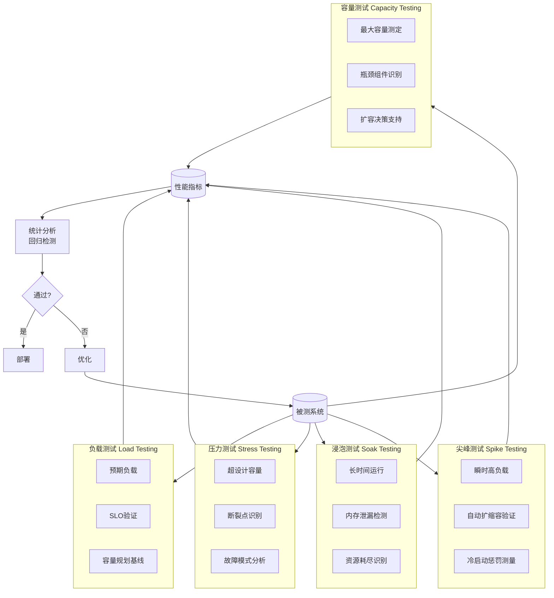
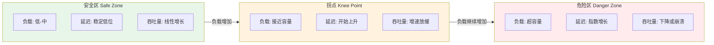
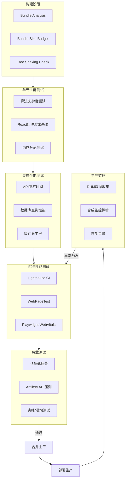

# 性能测试：负载与压力

## 引言

性能是用户体验的沉默杀手。研究表明，页面加载时间从 1 秒增加到 3 秒时，跳出率（bounce rate）上升 32%；从 1 秒增加到 5 秒时，跳出率激增 90%。在 JavaScript/TypeScript 生态中，性能问题的根源往往深藏于复杂的依赖树、过度的客户端计算、低效的 DOM 操作以及未优化的网络请求策略中。更为隐蔽的是，性能退化通常是渐进式的——每一次「快速修复」引入的额外依赖、每一个新增的 analytics 脚本、每一轮未经审查的重新渲染，都在悄然侵蚀用户体验，直至某一天用户用「离开」做出最终裁决。

性能测试（Performance Testing）正是对抗这种渐进退化的系统性方法。它不仅回答「系统有多快」，更回答「系统在何种负载下开始变慢」、「变慢的模式是可预测的还是突变的」、「以及如何防止性能退化进入生产环境」。与功能测试的二元判定（通过/失败）不同，性能测试天然具有概率性、环境依赖性与时间敏感性——同一组测试在开发者本地笔记本上与在 CI 容器中的结果可能截然不同，上午低峰期的响应时间与晚间高峰期的响应时间可能相差一个数量级。

本文首先建立性能测试的理论分类体系，引入排队论中的 Little 定律与吞吐量-延迟权衡模型，随后全面映射到 JS/TS 生态的现代工具链——Lighthouse CI、k6、Artillery.io、WebPageTest 与性能预算的自动化治理——为构建数据驱动的性能工程体系提供方法论与工具指引。

## 理论严格表述

### 性能测试的五维分类模型

性能测试并非单一活动，而是根据测试目标、负载模式与评估维度的不同，划分为五个核心类别：

**1. 负载测试（Load Testing）**

负载测试旨在验证系统在预期正常负载下的行为表现。其核心问题是：「当系统承受设计容量内的并发用户或请求时，响应时间、吞吐量与资源利用率是否满足服务水平目标（SLO）？」负载测试的负载曲线通常是渐进式的、可预测的，模拟的是日常业务高峰或季节性流量波动。

形式化地，设系统的设计目标为支持并发用户数 `C_target`，平均响应时间上限为 `R_max`，吞吐量下限为 `T_min`。负载测试构造一系列负载级别 `L = {l₁, l₂, ..., lₙ}`，其中 `lₙ ≤ C_target`，验证对于所有 `lᵢ ∈ L`，系统在负载 `lᵢ` 下的响应时间 `R(lᵢ) ≤ R_max` 且吞吐量 `T(lᵢ) ≥ T_min`。

**2. 压力测试（Stress Testing）**

压力测试将负载推至系统设计容量之上，直至系统出现故障或性能急剧退化，其目标是识别系统的「断裂点」（breaking point）与故障模式。压力测试回答的核心问题是：「系统在何种极端负载下会失败？以及，失败的方式是优雅的（graceful degradation）还是灾难性的（catastrophic failure）？」

压力测试的负载曲线通常是超线性的或突增的，最终稳定在一个超出设计容量的水平。关键观察指标包括：

- **断裂点**：吞吐量停止增长或开始下降时的负载水平
- **恢复能力**：负载恢复正常后，系统性能是否回到基线水平（是否存在性能后遗症）
- **错误模式**：在过载时，系统是否返回明确的错误响应（如 503 Service Unavailable），还是进入不可预测的状态（如内存泄漏导致的 OOM）

**3. 浸泡测试（Soak Testing / Endurance Testing）**

浸泡测试在持续较长时间（通常数小时至数天）内以中等负载运行系统，旨在发现渐进式退化问题，如内存泄漏、连接池耗尽、日志文件膨胀、临时文件堆积以及数据库碎片。浸泡测试的核心假设是：某些性能问题不会在短期测试中暴露，而需要累积效应才能显现。

浸泡测试的关键指标包括内存使用趋势（是否单调递增）、句柄/文件描述符计数、数据库连接池利用率以及磁盘 I/O 模式。在 Node.js 应用中，浸泡测试尤其重要，因为 JavaScript 的自动垃圾回收机制可能掩盖对象引用泄漏（unintentional object retention），而 Event Loop 的延迟累积可能导致响应时间随时间推移而缓慢增长。

**4. 尖峰测试（Spike Testing）**

尖峰测试模拟负载的瞬时剧烈波动——例如秒杀活动的开始时刻、社交媒体热点事件的突发流量、或分布式系统的级联故障恢复。尖峰测试的负载曲线呈现陡峭的上升沿与下降沿，验证系统的弹性（elasticity）与自动扩缩容（auto-scaling）机制的有效性。

尖峰测试的核心观察指标包括：

- **预热时间（warm-up time）**：从负载突增到系统吞吐量达到稳定状态所需的时间
- **冷启动惩罚（cold start penalty）**：Serverless 或容器化环境中，新实例启动期间的请求延迟
- **请求丢弃率（drop rate）**：在扩容完成前，有多少请求被丢弃或超时

**5. 容量测试（Capacity Testing）**

容量测试是一种前瞻性的规划活动，旨在确定系统在当前架构下能够支持的最大业务容量，并识别成为瓶颈的资源组件。容量测试通常与负载测试结合进行，但其终点不是验证设计目标，而是绘制完整的「负载-性能」曲线直至系统饱和。

容量测试的输出是容量规划模型：「若用户数增长 50%，需要增加多少台应用服务器？若数据量增长 3 倍，数据库分片策略是否需要调整？」这些决策依赖于容量测试中收集的细粒度资源利用率数据。

### Little 定律在性能测试中的应用

Little 定律（Little's Law）是排队论中最基础且最强大的定理，由 John D.C. Little 于 1961 年严格证明。定律陈述为：

$$L = \lambda \cdot W$$

其中：

- `L`：系统中平均存在的请求数（平均并发数）
- `λ`（lambda）：请求的平均到达率（每秒请求数，RPS）
- `W`：请求在系统中的平均停留时间（响应时间）

Little 定律的深刻之处在于其普适性：它不要求到达过程服从泊松分布，不要求服务时间服从指数分布，不要求系统处于特定的排队模型（M/M/1、M/G/1 等）。只要系统处于「稳态」（steady state）——即请求不会无限累积——Little 定律即成立。

在性能测试中，Little 定律提供了三个变量之间的约束关系，使得已知任意两个即可推导第三个。例如：

- 若目标 SLO 要求响应时间 `W ≤ 200ms`，且预期到达率 `λ = 1000 RPS`，则系统必须能够同时处理 `L = 1000 × 0.2 = 200` 个并发请求。
- 若压力测试观察到在负载 `λ = 500 RPS` 时，平均并发数 `L` 从 50 激增至 500，则根据 Little 定律，平均响应时间 `W = 500 / 500 = 1 秒`——系统已接近饱和。

Little 定律还揭示了负载生成器配置的关键原则：若要模拟 `N` 个并发用户，每个用户发送请求后「思考时间」（think time，即用户阅读页面、填写表单的时间）为 `Z`，则系统的有效到达率不是任意设定的，而是由并发数、响应时间与思考时间共同决定。在封闭系统模型（Closed System Model）中：

$$N = \lambda \cdot (W + Z)$$

这一定律指导性能测试工程师正确配置负载生成器：盲目设定「1000 并发用户」而不考虑思考时间，可能导致实际到达率远超真实用户行为模式，从而得出不切实际的性能结论。

### 吞吐量-延迟权衡曲线

吞吐量（Throughput）与延迟（Latency）是性能测试中最核心的两个指标，而它们之间存在根本性的权衡关系（Throughput-Latency Trade-off）。

在低负载区域，系统资源充裕，请求几乎无需排队即可得到处理。此时延迟主要由服务时间（service time）决定，保持相对稳定，而吞吐量随负载线性增长。当负载继续增加，系统资源（CPU、内存、I/O、网络带宽）逐渐饱和，请求开始在队列中等待。根据排队论，当利用率 `ρ` 接近 1 时，平均队列长度（从而响应时间）趋向无穷：

$$W = \frac{1}{\mu - \lambda}$$

其中 `μ`（mu）为服务率（ capacity），`λ` 为到达率。当 `λ → μ` 时，`W → ∞`。

这一数学关系在实践中表现为「拐点」（knee of the curve）：在拐点之前，吞吐量随负载增加而近乎线性增长，延迟保持低位；在拐点之后，吞吐量增长停滞甚至下降（因系统开销增加），延迟则急剧上升。性能测试的核心任务之一就是精确测定系统的拐点位置，并确保生产负载始终运行在拐点左侧的安全区域（通常为 70%-80% 拐点负载）。

在分布式系统中，吞吐量-延迟曲线更为复杂。微服务架构中的级联排队效应（cascading queueing）使得单个服务的轻微延迟放大为整个调用链的显著延迟。Google 的「Latency Curve」研究揭示了另一个关键现象：在分布式系统中，长尾延迟（tail latency，如 P99、P99.9）的增长速度远快于平均延迟，因为尾部请求往往命中了最慢的路径——最繁忙的节点、最热的缓存分区、或最拥堵的网络链路。

### 性能回归检测的统计学方法

性能测试的一个核心挑战是区分「真实的性能退化」与「测试噪声」。由于 CI 环境的共享资源特性、网络波动、后台进程干扰，同一commit的多次性能测试运行结果可能存在显著方差。因此，性能回归检测必须建立在统计学方法之上，而非简单的大于/小于比较。

**1. 基线比较与置信区间**

设定一个性能基线（baseline），通常是最近一个稳定 release 或主干分支的测量结果。对于新提交的测量值 `x_new`，计算其与基线 `x_base` 的差异百分比：

$$\Delta = \frac{x_{new} - x_{base}}{x_{base}} \times 100\%$$

若 `Δ` 超出预设阈值（如响应时间 +10%，吞吐量 -5%），则标记为潜在回归。但阈值法对噪声敏感，改进方案是使用置信区间：若 `x_new` 的 95% 置信区间与 `x_base` 的置信区间无重叠，则认为差异具有统计显著性。

**2. 移动平均与趋势检测**

对于持续监控场景，使用移动平均（Moving Average）或指数加权移动平均（EWMA）平滑短期波动，提取长期趋势。当趋势线斜率发生显著变化（通过 CUSUM 算法或线性回归的斜率检验检测），触发回归告警。

**3. Mann-Whitney U 检验**

Mann-Whitney U 检验（又称 Wilcoxon 秩和检验）是一种非参数检验方法，用于判断两个独立样本是否来自同一分布。与 t 检验不同，它不假设数据服从正态分布，对异常值（outliers）更加稳健。在性能测试中，可将基线的多次测量作为样本 A，新提交的多次测量作为样本 B，若检验结果 `p < 0.05`，则拒绝「无差异」的原假设，认定存在统计显著的回归。

**4. 变异系数（Coefficient of Variation, CV）**

$$CV = \frac{\sigma}{\mu}$$

变异系数衡量数据的相对离散程度。高 CV（如 `CV > 0.1`）表明测试环境不稳定或系统本身存在高度可变性，此时简单的均值比较不可靠，应优先降低环境噪声或增加样本量。

## 工程实践映射

### Lighthouse CI 的自动化性能测试

Lighthouse 是 Google 开发的开源自动化工具，用于提升网页质量。Lighthouse CI（LHCI）将其集成到 CI 流水线中，实现对性能、可访问性、最佳实践、SEO 与 PWA 的持续监控。

LHCI 的核心工作流包括：

1. **收集（Collect）**：在本地或 CI 环境中运行 Lighthouse，多次测量取中位数以降低噪声
2. **断言（Assert）**：将测量结果与预设阈值或历史基线比较
3. **上传（Upload）**：将报告上传至 LHCI Server，实现趋势可视化与团队共享

在 JS/TS 项目中配置 LHCI：

```bash
npm install -g @lhci/cli
```

```json
// lighthouserc.json
{
  "ci": {
    "collect": {
      "url": [
        "http://localhost:3000/",
        "http://localhost:3000/dashboard"
      ],
      "numberOfRuns": 5,
      "startServerCommand": "npm run start",
      "startServerReadyPattern": "Ready on",
      "settings": {
        "preset": "desktop"
      }
    },
    "assert": {
      "preset": "lighthouse:recommended",
      "assertions": {
        "categories:performance": ["warn", {"minScore": 0.9}],
        "categories:accessibility": ["error", {"minScore": 0.95}],
        "first-contentful-paint": ["warn", {"maxNumericValue": 1800}],
        "largest-contentful-paint": ["error", {"maxNumericValue": 2500}],
        "total-blocking-time": ["error", {"maxNumericValue": 200}],
        "cumulative-layout-shift": ["error", {"maxNumericValue": 0.1}]
      }
    },
    "upload": {
      "target": "temporary-public-storage"
    }
  }
}
```

在 GitHub Actions 中集成 LHCI：

```yaml
# .github/workflows/lighthouse.yml
name: Lighthouse CI
on: [push]
jobs:
  lhci:
    runs-on: ubuntu-latest
    steps:
      - uses: actions/checkout@v4
      - uses: actions/setup-node@v4
        with:
          node-version: '20'
      - run: npm ci
      - run: npm run build
      - name: Run Lighthouse CI
        run: |
          npm install -g @lhci/cli
          lhci autorun
        env:
          LHCI_GITHUB_APP_TOKEN: ${{ secrets.LHCI_GITHUB_APP_TOKEN }}
```

LHCI 的断言系统支持两种模式：**绝对阈值**（如 `maxNumericValue: 2500`）与**相对基线**（如 `maxDiff: 0.05`）。绝对阈值适合早期项目设定明确的 SLO；相对基线适合成熟项目，防止渐进式退化。对于大型项目，建议将 LHCI Server 部署为内部服务，存储历史数据并生成性能趋势图。

### WebPageTest 的 API 驱动测试

WebPageTest（WPT）是业界最权威的网页性能测试平台之一，提供真实的浏览器测试环境、全球测试节点、多网络条件模拟（3G、4G、 cable、FIDO）以及详尽的瀑布图与诊断数据。

WebPageTest 提供 REST API，可用于自动化测试：

```typescript
// tests/webpagetest.spec.ts
import { wpt } from './wpt-client';

describe('WebPageTest Synthetic Monitoring', () => {
  it('should meet performance budget on 4G connection', async () => {
    const result = await wpt.runTest('https://example.com', {
      location: 'Dulles:Chrome',
      connectivity: '4G',
      runs: 3,
      firstViewOnly: true,
      video: true
    });

    const median = result.data.median.firstView;

    expect(median.loadTime).toBeLessThan(3000);
    expect(median.SpeedIndex).toBeLessThan(2000);
    expect(median.bytesIn).toBeLessThan(1000 * 1024); // 1MB budget
    expect(median.requests).toBeLessThan(50);
  });
});
```

WebPageTest 的核心价值在于其「合成测试」（Synthetic Testing）能力：它在受控的实验室环境中运行，消除了真实用户环境的变量，使得不同版本之间的比较具有统计可比性。然而，合成测试的结果往往优于真实用户体验（因真实用户可能使用老旧设备、弱网环境、或被浏览器扩展干扰），因此必须与 RUM（Real User Monitoring）数据结合分析。

### k6 的负载测试脚本

k6 是由 Grafana Labs 维护的现代负载测试工具，其核心优势在于测试脚本使用 JavaScript（实际上是基于 Go 的 JavaScript 运行时，支持 ES2015/ES6）编写，使得前端开发者无需学习新的领域特定语言即可编写复杂的负载场景。

k6 的基本测试脚本结构：

```javascript
// load-test.js
import http from 'k6/http';
import { check, sleep } from 'k6';

export const options = {
  stages: [
    { duration: '2m', target: 100 },   // 渐进加载到 100 VU
    { duration: '5m', target: 100 },   // 稳定负载 5 分钟
    { duration: '2m', target: 200 },   // 压力测试到 200 VU
    { duration: '5m', target: 200 },   // 维持压力
    { duration: '2m', target: 0 },     // 逐步降级
  ],
  thresholds: {
    http_req_duration: ['p(95)<500'],   // 95% 请求响应时间 < 500ms
    http_req_failed: ['rate<0.01'],     // 错误率 < 1%
    http_reqs: ['rate>1000'],           // 吞吐量 > 1000 RPS
  },
};

export default function () {
  const res = http.get('https://api.example.com/products');

  check(res, {
    'status is 200': (r) => r.status === 200,
    'response time < 500ms': (r) => r.timings.duration < 500,
    'body contains products': (r) => r.json('data.products').length > 0,
  });

  sleep(1);
}
```

k6 的 `stages` 机制允许精确控制负载曲线，完美支持负载测试、压力测试与尖峰测试的场景编排。`thresholds` 机制则在测试结束时自动判定通过/失败，可直接作为 CI gate。

对于需要认证或复杂前置步骤的 API 测试，k6 支持 `setup` 与 `teardown` 生命周期函数：

```javascript
// authenticated-load-test.js
import http from 'k6/http';
import { check } from 'k6';

export const options = {
  vus: 50,
  duration: '10m',
};

export function setup() {
  // 全局执行一次：获取认证令牌
  const loginRes = http.post('https://api.example.com/auth/login', {
    username: 'testuser',
    password: 'testpass',
  });

  check(loginRes, {
    'login successful': (r) => r.status === 200,
  });

  return { token: loginRes.json('accessToken') };
}

export default function (data) {
  const res = http.get('https://api.example.com/orders', {
    headers: {
      Authorization: `Bearer ${data.token}`,
    },
  });

  check(res, {
    'orders fetched': (r) => r.status === 200,
  });
}
```

k6 的扩展生态也非常丰富：`k6-browser` 支持浏览器级指标采集（Web Vitals），`xk6-sql` 支持数据库负载测试，`xk6-kafka` 支持消息队列压测。对于大型测试，k6 Cloud 或 k6-operator（Kubernetes 上的分布式 k6）可将负载分布到数百个节点，模拟百万级并发。

### Artillery.io 的 API 负载测试

Artillery 是另一个流行的 Node.js 负载测试工具，其配置驱动的 YAML/JSON 格式使得非开发者（如 QA 工程师、SRE）也能快速编写测试场景。Artillery 特别适合 API 网关、微服务与 WebSocket 的负载测试。

```yaml
# artillery-config.yml
config:
  target: 'https://api.example.com'
  phases:
    - duration: 60
      arrivalRate: 10        # 每秒 10 个新虚拟用户
      name: Warm up
    - duration: 120
      arrivalRate: 10
      rampTo: 100            # 2 分钟内渐增至每秒 100 个
      name: Ramp up
    - duration: 300
      arrivalRate: 100
      name: Sustained load
  plugins:
    expect: {}
  defaults:
    headers:
      Content-Type: 'application/json'

scenarios:
  - name: 'Search and checkout flow'
    flow:
      - get:
          url: '/products?q=laptop'
          capture:
            - json: '$.data[0].id'
              as: 'productId'
      - think: 2             # 模拟用户思考时间 2 秒
      - post:
          url: '/cart/items'
          json:
            productId: '{{ productId }}'
            quantity: 1
      - think: 3
      - post:
          url: '/checkout'
          json:
            paymentMethod: 'card'
          expect:
            - statusCode: 200
            - contentType: json
```

注意：在上述 YAML 中，`'{{ productId }}'` 是 Artillery 的变量插值语法。由于该内容处于 YAML 代码块中，VitePress 的 Vue 模板解析器不会将其视为 Mustache 插值，因此无需额外转义。

Artillery 的 `phases` 机制与 k6 的 `stages` 类似，但其 `arrivalRate` 模式（开放系统模型）与 k6 的 `VUs` 模式（封闭系统模型）有本质区别。在 `arrivalRate` 模式下，虚拟用户按固定到达率生成，不受系统响应时间影响，更适合模拟真实的外部请求流量；在 `VUs` 模式下，固定数量的用户循环发送请求，响应时间增加会自动降低到达率，更适合模拟固定规模的内部用户群。

### Chrome DevTools Performance 的自动化

Lighthouse 提供了高层性能指标，而 Chrome DevTools Performance 面板提供了底层执行的细粒度视图——函数级耗时、布局与重排事件、主线程阻塞、GPU 合成层等。通过 Puppeteer 或 Playwright，可以将 DevTools Performance 的采集自动化。

使用 Playwright 采集 Web Vitals 与性能追踪：

```typescript
// tests/performance.spec.ts
import { test, expect } from '@playwright/test';

test('performance metrics meet budget', async ({ page }) => {
  // 启用性能追踪
  await page.context().tracing.start({ screenshots: true, snapshots: true });

  const client = await page.context().newCDPSession(page);
  await client.send('Performance.enable');

  // 导航到目标页面
  await page.goto('https://example.com/dashboard');

  // 等待 LCP 元素渲染
  await page.waitForSelector('[data-testid="lcp-element"]');

  // 采集 Web Vitals
  const metrics = await client.send('Performance.getMetrics');
  const lcpEntry = await page.evaluate(() => {
    return new Promise((resolve) => {
      new PerformanceObserver((list) => {
        const entries = list.getEntries();
        resolve(entries[entries.length - 1]);
      }).observe({ entryTypes: ['largest-contentful-paint'] });
    });
  });

  expect(lcpEntry.startTime).toBeLessThan(2500);

  // 采集 Long Tasks（阻塞主线程 > 50ms 的任务）
  const longTasks = await page.evaluate(() => {
    return new Promise((resolve) => {
      const tasks = [];
      new PerformanceObserver((list) => {
        tasks.push(...list.getEntries());
        resolve(tasks);
      }).observe({ entryTypes: ['longtask'] });
      setTimeout(() => resolve(tasks), 5000);
    });
  });

  expect(longTasks.length).toBeLessThan(3);

  await page.context().tracing.stop({
    path: 'trace.zip'
  });
});
```

采集到的 `trace.zip` 文件可直接拖入 Chrome DevTools Performance 面板进行可视化分析，定位具体的性能瓶颈函数。在 CI 中，可将追踪文件作为 artifact 上传，供开发者在测试失败后下载分析。

### 性能预算的 CI Enforcement

性能预算（Performance Budget）是将性能指标转化为不可逾越的工程约束的管理机制。其核心理念是：性能不是「优化完成后的事后考量」，而是「功能开发前的前置约束」——正如财务预算约束支出一样，性能预算约束资源消耗。

性能预算可分为多种类型：

- **数量型预算**：总请求数 `< 50`、总传输大小 `< 200KB`、第三方脚本数 `< 3`
- **时间型预算**：FCP `< 1.8s`、LCP `< 2.5s`、TBT `< 200ms`
- **规则型预算**：Lighthouse 性能分数 `≥ 90`、可访问性分数 `≥ 95`

在 CI 中强制执行性能预算，通常采用以下技术栈组合：

**1. Bundlesize**

```json
// package.json
{
  "bundlesize": [
    {
      "path": "./dist/main.*.js",
      "maxSize": "120 kB",
      "compression": "gzip"
    },
    {
      "path": "./dist/vendor.*.js",
      "maxSize": "250 kB",
      "compression": "gzip"
    }
  ]
}
```

```bash
npx bundlesize
```

**2. webpack-bundle-analyzer 的自动化**

在 CI 中生成打包分析报告，并与基线比较：

```bash
# 生成当前构建的 stats
webpack --profile --json > stats.json

# 与基线比较（使用 webpack-bundle-differ 等工具）
npx webpack-bundle-differ --baseline stats.baseline.json --current stats.json --budget .bundle-budget.json
```

**3. Lighthouse CI 的断言 gate**

如前文所示，LHCI 的 `assert` 配置将性能分数直接转化为 CI 的通过/失败判定。若断言失败，PR 被阻止合并，从工程机制上防止性能退化进入主干。

**4. 自定义性能预算脚本**

对于特定业务指标，可编写自定义预算检查脚本：

```typescript
// scripts/perf-budget.ts
import fs from 'fs';
import path from 'path';

const BUDGETS = {
  'main.js': { gzip: 120 * 1024 },
  'vendor.js': { gzip: 250 * 1024 },
  'total': { gzip: 500 * 1024 },
};

function getGzipSize(filePath: string): number {
  // 使用 zlib 计算 gzip 大小
  const { execSync } = require('child_process');
  return parseInt(
    execSync(`gzip -c "${filePath}" | wc -c`, { encoding: 'utf-8' }).trim(),
    10
  );
}

const distDir = './dist';
const files = fs.readdirSync(distDir);
let totalGzip = 0;
let passed = true;

for (const file of files) {
  if (!file.endsWith('.js')) continue;
  const size = getGzipSize(path.join(distDir, file));
  totalGzip += size;

  const budget = BUDGETS[file];
  if (budget && size > budget.gzip) {
    console.error(`❌ Budget exceeded: ${file} (${size} > ${budget.gzip})`);
    passed = false;
  }
}

if (totalGzip > BUDGETS.total.gzip) {
  console.error(`❌ Total budget exceeded: ${totalGzip} > ${BUDGETS.total.gzip}`);
  passed = false;
}

process.exit(passed ? 0 : 1);
```

### RUM 数据与合成测试的对比分析

性能测试的数据来源可分为两大阵营：合成测试（Synthetic Testing）与真实用户监控（RUM, Real User Monitoring）。理解两者的差异与互补关系，是建立全面性能监控体系的前提。

| 维度 | 合成测试（Lighthouse/WPT） | 真实用户监控（RUM） |
|------|--------------------------|-------------------|
| **环境控制** | 完全可控（设备、网络、浏览器、缓存状态） | 完全不可控（用户设备、网络、缓存千变万化） |
| **可复现性** | 高，同一测试在相同条件下结果一致 | 低，受用户环境噪声影响 |
| **覆盖范围** | 仅测试选定的页面与场景 | 覆盖所有真实用户访问的页面与路径 |
| **长尾延迟** | 难以模拟极端长尾场景 | 天然捕获 P99、P99.9 长尾延迟 |
| **业务关联** | 与业务指标无直接关联 | 可直接关联跳出率、转化率等业务指标 |
| **成本** | 可控，按测试频率计费 | 随用户量增长，数据存储与分析成本增加 |
| **最佳用途** | CI 回归检测、版本间比较、诊断瓶颈 | 用户体验基线、业务影响评估、异常检测 |

在工程实践中，合成测试与 RUM 应形成「双轨验证」体系：

- **开发阶段**：使用 Lighthouse CI 与本地合成测试防止明显的性能退化
- **预发布阶段**：使用 WebPageTest 在真实网络条件下进行深度诊断
- **生产阶段**：使用 RUM 工具（如 Google Analytics 4、Sentry Performance、New Relic、Datadog RUM）收集真实用户体验数据
- **告警联动**：当 RUM 检测到某页面 LCP 突增时，触发 WebPageTest 合成测试进行复现诊断，快速定位是代码变更、CDN 故障还是第三方脚本导致的退化

## Mermaid 图表

### 性能测试五维分类与适用场景



### 吞吐量-延迟权衡曲线

```mermaid
xychart-beta
    title "吞吐量-延迟权衡曲线（Latency Curve）"
    x-axis "负载 (并发用户/RPS)"
    y-axis "响应时间 (ms)" 0 --> 5000
    line "理想曲线" [100,120,140,160,180,200,220,250,300,400,600,1000,2000,5000]
    line "实际曲线" [100,115,130,145,160,180,210,260,350,500,800,1500,3000,5000]
    annotation "拐点" {"x": 7, "y": 260}
    annotation "安全区" {"x": 4, "y": 180}
    annotation "危险区" {"x": 10, "y": 800}
```

注意：上述 Mermaid xychart-beta 语法在部分 VitePress 环境中可能需要特定插件支持。若渲染失败，可替换为以下基于 flowchart 的等效表示：



### 性能测试 CI 集成架构



## 理论要点总结

1. **性能测试的五维分类**：负载测试验证预期容量，压力测试探索断裂点，浸泡测试暴露渐进退化，尖峰测试验证弹性，容量测试支撑规划决策。五者构成从日常验证到极端场景的全面覆盖。

2. **Little 定律的工程指导**：`L = λ · W` 揭示了并发数、到达率与响应时间之间的刚性约束。负载生成器的配置必须基于这一定律，而非随意设定并发数。在封闭系统模型中，思考时间 `Z` 是不可或缺的变量。

3. **吞吐量-延迟拐点的战略意义**：系统的有效容量不是「能处理多少请求」，而是「在延迟仍满足 SLO 的前提下能处理多少请求」。拐点的右侧是危险的「延迟悬崖」，生产负载必须维持在拐点左侧的安全区（通常为 70%-80% 拐点负载）。

4. **统计学回归检测**：性能比较不能依赖单次测量或简单阈值，而应使用置信区间、Mann-Whitney U 检验或移动平均趋势检测。高变异系数（CV）是测试环境不稳定的信号，应优先解决环境噪声问题。

5. **合成测试与 RUM 的互补**：合成测试提供可控、可复现的实验室数据，适合 CI 回归检测；RUM 提供真实用户视角的长尾延迟与业务关联数据。两者的结合构成了完整的性能观测体系。

## 参考资源

1. **Google**. (2024). *Lighthouse CI Documentation*. <https://github.com/GoogleChrome/lighthouse-ci/blob/main/docs/getting-started.md>

2. **Grafana Labs**. (2024). *k6 Documentation: Load Testing for Engineering Teams*. <https://k6.io/docs/>

3. **Artillery.io**. (2024). *Artillery Documentation: Load & Smoke Testing*. <https://www.artillery.io/docs>

4. **Google Chrome Team**. (2023). *The Science of Web Performance*. Google Web Performance Research. <https://web.dev/performance-science/>

5. **Jain, R.** (1991). *The Art of Computer Systems Performance Analysis: Techniques for Experimental Design, Measurement, Simulation, and Modeling*. Wiley. ISBN: 978-0-471-50336-1.

6. **Little, J. D. C.** (1961). "A Proof for the Queuing Formula: L = λW". *Operations Research*, 9(3), 383-387.
