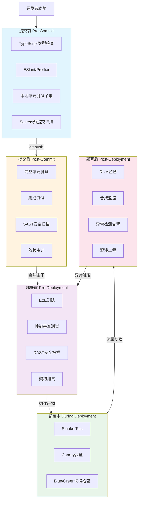
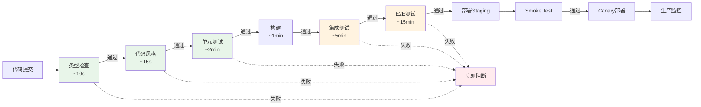
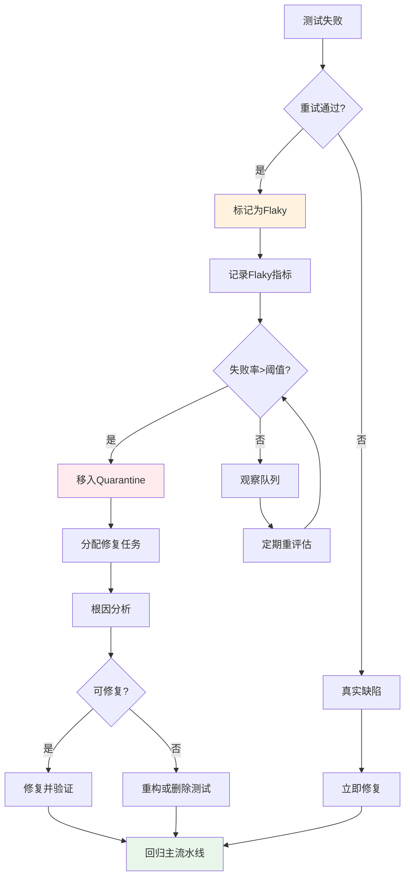

# CI/CD中的测试策略：Gates与流水线

## 引言

持续集成与持续交付（CI/CD）是现代软件工程的基础设施，而测试是这一基础设施中最关键的「质量闸门」。一个没有测试的 CI/CD 流水线只是一个自动化部署脚本——它能让代码更快地上线，却无法阻止缺陷更快地抵达用户。反之，一个设计精良的测试流水线能够在代码变更的每个阶段施加适当的验证压力：在开发者提交前捕获拼写错误与类型不匹配，在合并前阻止逻辑缺陷与集成冲突，在部署前验证端到端场景，在生产环境中监控真实行为的异常。

然而，将测试嵌入 CI/CD 并非简单的「把本地命令搬到服务器上」。CI 环境与本地开发环境存在根本性差异：资源受限且共享的容器、无头浏览器的渲染差异、并发执行带来的状态竞争、以及缺乏开发者直觉的自动判定机制。这些差异使得测试在 CI 中表现出与本地截然不同的行为模式——尤其是脆弱测试（flaky tests）在 CI 中的爆发频率远高于本地。

JavaScript/TypeScript 生态因其快速迭代、深度依赖与多运行时环境（Node.js、Deno、Bun、浏览器）的特性，对 CI/CD 测试策略提出了独特挑战。一个典型的现代前端项目可能在数分钟内通过数百个单元测试，却在 E2E 测试中因时序问题随机失败；一个微服务后端的集成测试可能在本地通过，却在 CI 中因数据库迁移顺序错误而崩溃。本文从理论层面建立 CI 测试的层次模型与决策框架，随后深入映射到 JS/TS 生态的具体工程实践——GitHub Actions 的高级编排、测试分片、影响分析、flaky test 治理、覆盖率 gates 与 Canary 渐进式验证。

## 理论严格表述

### 持续集成中的五层测试层次模型

CI/CD 中的测试活动不是单一事件，而是分布在软件交付时间轴上的连续验证层次。从代码离开开发者机器到最终抵达生产用户，测试以五个层次递进展开：

**1. 提交前测试（Pre-Commit / Local Verification）**

提交前测试在开发者的本地环境中执行，是「最左移」的验证层次。其核心目标是「即时反馈」——在代码尚未进入共享仓库前，以秒级或分钟级的速度捕获最明显、最频繁的缺陷类别。提交前测试的典型内容包括：

- 静态类型检查（`tsc --noEmit`）
- 代码风格检查（ESLint、Prettier）
- 快速单元测试（与当前变更相关的测试子集）
- 提交信息格式验证（commitlint）
- secrets 预提交扫描（git-secrets、Husky 钩子）

提交前测试的设计原则是「速度优先」：若提交前测试超过 2-3 分钟，开发者将倾向于跳过或绕过它，从而丧失其预防价值。Git 钩子（pre-commit、pre-push）是提交前测试的制度化实现，但应注意钩子不应替代 CI 中的完整测试——本地环境的不一致性意味着钩子通过不等于 CI 通过。

**2. 提交后测试（Post-Commit / CI Build）**

提交后测试在代码推送到远程仓库后触发，是 CI 流水线的第一层正式 gate。其覆盖范围比提交前测试更广，通常包括完整的单元测试套件、静态安全扫描、依赖审计与构建验证。提交后测试的核心目标是「快速隔离」——在变更进入共享主干前，识别并阻止个体开发者引入的局部缺陷。

提交后测试的编排策略直接影响团队的合并频率。若提交后测试耗时过长（如超过 15 分钟），开发者将积累多个本地 commit 才推送一次，增大了每次合并的变更复杂度与冲突概率。因此，提交后测试必须在「覆盖范围」与「执行速度」之间取得平衡，通常通过并行化、缓存与测试分片来优化。

**3. 部署前测试（Pre-Deployment / Staging Validation）**

部署前测试在代码合并到主干并构建为可部署产物后、在生产部署之前执行。这一层次的测试关注系统在类生产环境（staging / pre-production）中的行为，包括：

- 端到端测试（E2E）在 staging URL 上的执行
- 集成测试覆盖第三方服务沙箱
- 契约测试验证服务间 API 兼容性
- 性能基准测试与负载测试
- 安全扫描（DAST）在 staging 环境上的运行

部署前测试是「最后的全面检查」，但其执行成本较高（通常需要 10-30 分钟），因此不应阻塞所有开发者的日常提交，而应作为发布流程（release pipeline）的一部分。

**4. 部署中测试（During Deployment / Progressive Delivery）**

部署中测试在代码实际部署到生产环境的过程中执行，是「渐进式交付」（Progressive Delivery）的核心机制。与前几层测试的「全部通过才部署」不同，部署中测试采用「边部署边验证」的策略：

- **Smoke Test**：部署后立即验证核心路径是否可用（如 health check、首页加载、关键 API 响应）
- **Canary 验证**：将新版本部署到一小部分实例或用户，对比新旧版本的错误率、延迟与业务指标
- **Blue/Green 切换验证**：在流量完全切换到新版本前，执行最后的端到端验证

部署中测试的理论基础是「生产环境即唯一真实的测试环境」—— staging 无论多么相似，都无法完全复制生产的数据规模、网络拓扑与用户行为模式。

**5. 部署后测试（Post-Deployment / Production Monitoring）**

部署后测试不是传统意义上的「测试」，而是持续监控与可观测性（Observability）驱动的验证。其目标是在生产环境中检测前几层测试未能捕获的问题——那些只在真实流量、真实数据与真实时间条件下才暴露的缺陷。部署后测试包括：

- **合成监控（Synthetic Monitoring）**：定期从全球节点执行关键用户旅程
- **真实用户监控（RUM）**：采集并分析真实用户的性能与错误数据
- **异常检测（Anomaly Detection）**：基于统计学方法或机器学习识别指标的异常波动
- **混沌工程（Chaos Engineering）**：在生产环境中主动注入故障，验证系统的韧性

### 测试金字塔在 CI 中的映射

Mike Cohn 提出的测试金字塔（Test Pyramid）是测试策略的经典框架，其核心理念是：底层单元测试数量最多、执行最快、成本最低；顶层 E2E 测试数量最少、执行最慢、成本最高。在 CI/CD 环境中，这一金字塔转化为分层的质量 gates：

| 层次 | 测试类型 | 数量级 | 执行时间 | CI Gate 作用 |
|------|---------|--------|---------|-------------|
| 顶层 | E2E / UI 测试 | 数十至数百 | 5-30 分钟 | 部署前 gate，验证完整用户旅程 |
| 中层 | 集成 / API / 契约测试 | 数百至数千 | 2-10 分钟 | 提交后 gate，验证服务间交互 |
| 底层 | 单元测试 | 数千至数万 | 30 秒-5 分钟 | 提交后 gate，验证逻辑正确性 |
| 基座 | 静态分析 / 类型检查 | 无限（自动推导） | 10-60 秒 | 提交前/提交后 gate，排除语法与类型错误 |

在 CI 中映射测试金字塔时，两个关键原则决定了流水线的效率与有效性：

**Fail Fast（快速失败）**：将最快、最便宜的测试放在流水线的最前端。若一个类型错误就能导致构建失败，就不应等到 30 分钟的 E2E 测试后才报告。典型的流水线顺序为：`类型检查 → 代码风格 → 单元测试 → 集成测试 → 构建 → E2E 测试 → 部署`。每一层通过后，下一层才启动；任何一层的失败立即终止流水线，将失败信息尽快反馈给开发者。

**并行化与扇出（Fan-Out）**：同一层次的独立测试应并行执行。例如，单元测试可按测试文件分片到多个 runner 上同时执行；多浏览器 E2E 测试可在 Chrome、Firefox、Safari 的 job 矩阵中并行运行。GitHub Actions 的 `matrix` 策略、GitLab CI 的 `parallel` 关键字以及 CircleCI 的 `parallelism` 均支持这种扇出模式。

### Fail Fast 理论的深度解析

Fail Fast 不仅是一种流水线编排策略，更是一种系统设计哲学。其核心命题是：「系统应尽可能快地暴露失败，而非掩盖或延迟失败」。在测试语境下，Fail Fast 包含三层含义：

**1. 时间维度的 Fail Fast**

越早发现缺陷，修复成本越低。Barry Boehm 的缺陷成本曲线表明：在需求阶段修复缺陷的成本为 1 个单位，设计阶段为 3-6 个单位，编码阶段为 10 个单位，系统测试阶段为 15-40 个单位，而在生产环境中修复则可能达到 30-100 个单位。CI 中的 Fail Fast 正是通过将高成本缺陷的发现时间从「系统测试」或「生产」前移到「编码」或「提交」阶段，指数级降低修复成本。

**2. 信息维度的 Fail Fast**

当测试失败时，应提供尽可能精确、可操作的诊断信息。一个仅报告「Test failed」的 CI 系统迫使开发者花费大量时间复现与定位问题，丧失了自动化的价值。Fail Fast 要求测试框架、断言库与 CI 报告系统协同工作，输出：失败的测试名称与位置、预期值与实际值的差异、相关的日志与截图、以及失败的历史频率（是否为 flaky）。

**3. 决策维度的 Fail Fast**

当 CI 测试失败时，团队应建立明确的决策规则：谁负责修复？修复的截止时间？在修复期间是否允许合并其他变更？缺乏决策规则的 Fail Fast 将导致「红色流水线常态化」——开发者对失败视而不见，CI 失去其 gate 功能。

### Flaky Test 的检测与隔离策略

Flaky Test（脆弱测试、不稳定测试）是指对同一代码库多次执行时，结果非确定性地通过或失败的测试。Flaky test 是 CI 测试的头号敌人：它侵蚀开发者对测试 suite 的信任，导致「重试文化」（rerun until green），掩盖真实的缺陷，并浪费大量的 CI 计算资源。

Flaky test 的根源可分为以下几类：

- **异步时序问题**：未正确等待异步操作完成（如 missing `await`、固定的 `setTimeout`、DOM 更新与断言之间的竞争）
- **共享状态污染**：测试之间通过全局变量、数据库、文件系统或内存缓存相互影响
- **外部依赖不稳定**：测试依赖的第三方服务、网络请求或时间函数返回非确定性结果
- **随机性与并发**：使用随机数据生成但未固定种子；并发执行时资源竞争
- **环境差异**：CI 与本地环境的时区、语言、屏幕分辨率、文件系统差异

**检测策略**

1. **重跑统计法**：对同一 commit 的测试 suite 执行多次（如 10 次），统计每个测试的失败频率。若某测试在 10 次中失败 2 次以上，即标记为 flaky。
2. **趋势分析法**：追踪测试的历史失败记录，计算「失败率 = 失败次数 / 总执行次数」。失败率超过阈值（如 5%）的测试进入 flaky 候选池。
3. **机器学习分类**：利用测试的元数据（执行时间、是否涉及 I/O、是否使用随机数、历史修改频率）训练分类模型，预测测试的脆弱性风险。

**隔离与修复策略**

1. **Quarantine（隔离）**：将确认的 flaky test 从主 CI 流水线中移出，放入独立的「quarantine」job 中执行。主流水线保持绿色，quarantine job 允许失败但不阻塞合并。quarantine 中的测试被分配修复任务，修复后回归主流水线。
2. **重试机制**：在 CI 中对失败的测试自动重试一次，若重试通过则标记为 flaky 并告警，但不阻塞流水线。这是一种「缓解」而非「解决」策略，应配合 quarantine 使用。
3. **根因修复**：对于时序问题，使用 `waitFor` 模式替代固定等待；对于共享状态，使用 `beforeEach` 清理与事务回滚；对于外部依赖，使用 mock 或测试容器（Testcontainers）。

## 工程实践映射

### GitHub Actions 的测试工作流编排

GitHub Actions 是目前最广泛使用的 CI/CD 平台之一，其 YAML 工作流提供了丰富的测试编排能力：并行矩阵、依赖缓存、artifact 传递与条件执行。

**并行矩阵策略**

通过 `strategy.matrix` 将同一 job 在多个环境配置下并行执行：

```yaml
# .github/workflows/test.yml
name: Test Suite
on: [push, pull_request]

jobs:
  unit-test:
    runs-on: ubuntu-latest
    strategy:
      fail-fast: false  # 一个矩阵项失败不取消其他项
      matrix:
        node-version: [18.x, 20.x, 22.x]
        shard: [1, 2, 3, 4]  # 测试分片
    steps:
      - uses: actions/checkout@v4
      - uses: actions/setup-node@v4
        with:
          node-version: $&#123;&#123; matrix.node-version &#125;&#125;
      - uses: actions/cache@v4
        with:
          path: |
            ~/.npm
            node_modules
          key: $&#123;&#123; runner.os &#125;&#125;-node-$&#123;&#123; matrix.node-version &#125;&#125;-$&#123;&#123; hashFiles('**/package-lock.json') &#125;&#125;
      - run: npm ci
      - run: npm run test:unit -- --shard=$&#123;&#123; matrix.shard &#125;&#125;/4
      - uses: actions/upload-artifact@v4
        with:
          name: coverage-unit-node$&#123;&#123; matrix.node-version &#125;&#125;-shard$&#123;&#123; matrix.shard &#125;&#125;
          path: coverage/
```

注意：在上述 YAML 中，`$&#123;&#123; matrix.node-version &#125;&#125;` 与 `$&#123;&#123; matrix.shard &#125;&#125;` 是 GitHub Actions 的上下文表达式语法。由于这些内容处于 YAML 代码块中，VitePress 的 Vue 模板解析器不会将其视为 Mustache 插值。

**依赖缓存优化**

CI 执行时间的很大一部分消耗在依赖安装（`npm ci`）。通过 `actions/cache` 或 `actions/setup-node` 内置的缓存功能，可将 `node_modules` 缓存到 Actions Cache 中：

```yaml
      - uses: actions/setup-node@v4
        with:
          node-version: '20'
          cache: 'npm'  # 自动缓存 ~/.npm
```

对于 monorepo 项目，推荐使用 `turbo` 或 `nx` 的远程缓存（remote cache），在 CI runner 之间共享构建与测试的中间产物。

**Artifact 传递与测试报告**

测试产物（coverage 报告、测试日志、失败截图、视频）通过 artifact 在 job 之间传递或在流水线结束后供开发者下载：

```yaml
      - run: npm run test:e2e
      - uses: actions/upload-artifact@v4
        if: failure()  # 仅在失败时上传调试产物
        with:
          name: e2e-failure-artifacts
          path: |
            test-results/
            playwright-report/
            coverage/
```

### 测试分片（Sharding）策略

当单元测试 suite 增长到数千个用例时，即使并行化也可能超出单个 CI runner 的时间预算。测试分片将测试 suite 拆分为多个子集，分配到不同 runner 上并行执行，显著缩短 wall-clock 时间。

**Jest 的内置分片**

Jest 提供 `--shard` 参数实现测试分片：

```bash
# 将测试拆分为 4 份，执行第 1 份
jest --shard=1/4

# 在 CI 中结合矩阵策略，4 个 runner 各执行一份
```

Jest 的分片基于测试文件路径的哈希值，确保分片结果稳定（同一测试文件始终分配到同一分片）。但这也意味着分片负载可能不均衡——若某分片恰好包含大量慢速测试，该分片将成为瓶颈。

**基于执行历史的智能分片**

更高级的策略是利用历史执行时间数据，将测试按执行时间排序后采用「轮转分配」（round-robin）或「最长处理时间优先」（LPT）算法分片，以实现负载均衡。Playwright 的 `shard` 机制内置了基于预期执行时间的均衡策略：

```bash
# Playwright 分片
npx playwright test --shard=1/4 --workers=4
```

**动态分片**

对于超大型测试 suite（如数万测试用例），可使用动态分片策略：一个协调器（coordinator）job 将测试文件列表分发给多个 worker job，worker 完成一个测试后立即领取下一个，避免静态分片的负载不均衡问题。Bazel 与 Pants 构建系统内置了这种动态分片能力。

### 测试影响分析（Test Impact Analysis）

测试影响分析（TIA, Test Impact Analysis）是一种只运行受代码变更影响的测试子集的技术，旨在将 CI 测试时间从「运行全部测试」降低到「运行相关测试」。TIA 的核心理念是：修改 `utils/date.ts` 不应该触发 `components/Chart.test.tsx` 的执行，除非存在确定的依赖路径。

**Jest 的 ChangedFiles 与 Git Integration**

Jest 内置了 `--changedSince` 与 `--changedFilesWithAncestor` 参数，支持基于 Git 差异的测试选择：

```bash
# 仅运行自 origin/main 以来变更影响的测试
jest --changedSince=origin/main

# 在 PR 中运行受变更影响的测试
jest --changedFilesWithAncestor
```

Jest 的默认策略是「运行与变更文件位于同一目录的测试文件」，这对于紧耦合的代码库效果有限。

**Nx 与 Turborepo 的 affected 命令**

对于 monorepo，Nx 提供了强大的 affected 分析能力：

```bash
# 检测自上次提交以来哪些项目受影响
nx affected:lint
nx affected:test
nx affected:e2e

# 基于依赖图精确计算影响范围
nx affected:graph
```

Nx 通过静态分析 `import` 语句与项目配置文件，构建完整的依赖图（dependency graph），从而精确判断代码变更的传播范围。若 `libs/shared-utils` 被修改，Nx 会自动识别所有依赖它的应用与库，并仅运行这些项目的测试。

**覆盖率引导的影响分析**

更精确的策略是利用历史覆盖率数据：记录每个测试覆盖了哪些源代码行，当某行代码被修改时，只运行覆盖了该行的测试。这种策略需要持续维护「代码行 → 测试」的映射数据库，但能最大程度减少不必要的测试执行。

### Flaky Test 检测与重试策略

**Jest 的 flaky 检测**

Jest 本身不提供内置的 flaky test 检测，但可通过 `jest-flake-detector` 或自定义脚本实现：

```bash
# 重复运行测试 suite 多次以检测 flakiness
for i in {1..10}; do
  jest --json --outputFile=result-$i.json
done

# 分析结果文件，找出非确定性失败的测试
node scripts/analyze-flakiness.js
```

**Playwright 的内置重试**

Playwright 提供了内置的测试重试机制：

```typescript
// playwright.config.ts
import { defineConfig } from '@playwright/test';

export default defineConfig({
  retries: process.env.CI ? 2 : 0,  // CI 中失败时重试 2 次
  reporter: [
    ['html'],
    ['junit', { outputFile: 'test-results/junit.xml' }],
    ['list'],
  ],
});
```

重试机制的配置需要谨慎：过高的重试次数（如 > 3 次）会显著增加 CI 时间，且掩盖需要修复的根因。推荐的策略是：

- CI 中设置 `retries: 1` 或 `retries: 2`
- 对重试通过的测试生成告警（如标注为「flaky」），要求开发者在 sprint 内修复
- 对同一测试连续 flaky 超过阈值（如 3 次）的，自动将其移入 quarantine

**CircleCI 的 Rerun Failed Tests**

CircleCI 提供了原生的「仅重试失败测试」功能：

```yaml
# .circleci/config.yml
- run:
    name: Run tests with auto-retry
    command: |
      mkdir -p test-results
      circleci tests run \
        --command='jest --ci --reporters=default --reporters=jest-junit' \
        --split-by=timings \
        --timings-type=classname \
        --retry-count=2
```

### 测试覆盖率 Gates

覆盖率 gate 是阻止低质量代码进入主干的重要机制。但覆盖率本身是一个「必要不充分」的指标——高覆盖率不等于高质量，低覆盖率却几乎必然意味着测试不足。

**Codecov 的 PR 覆盖率检查**

Codecov 是最流行的覆盖率报告平台之一，可与 GitHub PR 深度集成：

```yaml
# .github/workflows/coverage.yml
name: Coverage
on: [pull_request]
jobs:
  coverage:
    runs-on: ubuntu-latest
    steps:
      - uses: actions/checkout@v4
      - uses: actions/setup-node@v4
        with:
          node-version: '20'
      - run: npm ci
      - run: npm run test:coverage
      - uses: codecov/codecov-action@v4
        with:
          token: $&#123;&#123; secrets.CODECOV_TOKEN &#125;&#125;
          files: ./coverage/lcov.info
          flags: unittests
          name: codecov-umbrella
```

```yaml
# codecov.yml
coverage:
  status:
    project:
      default:
        target: 80%        # 项目整体覆盖率目标
        threshold: 2%      # 允许下降 2%
    patch:
      default:
        target: 70%        # PR 新增代码的覆盖率目标
        threshold: 0%
  comment:
    layout: "reach,diff,flags,tree"
    behavior: default
```

**覆盖率目标的理性设定**

盲目追求 100% 覆盖率可能导致开发者编写无意义的断言（如测试 getter/setter），或避开难以测试的代码路径（通过提取到未测试的模块中）。理性的覆盖率策略应：

- 设定分层的覆盖率目标：核心业务逻辑 `≥ 90%`，工具函数 `≥ 70%`，UI 组件 `≥ 60%`（复杂交互可用 E2E 覆盖）
- 关注「增量覆盖率」而非仅关注「总体覆盖率」：确保每个 PR 的新增代码都有充分测试
- 结合「变异测试」（Mutation Testing）验证覆盖率的有效性：高覆盖率 + 高变异分数 = 真正有效的测试

### 测试报告可视化

测试报告的可视化直接影响开发者诊断失败的效率。原始的文本日志在数百个测试失败时几乎无法阅读，而结构化的 HTML 报告、趋势图与交互式界面能大幅缩短 MTTR（Mean Time To Repair）。

**Allure Framework**

Allure 是目前最美观、功能最丰富的测试报告框架之一，支持 Jest、Playwright、Cypress、Mocha、Vitest 等主流测试框架。

```bash
npm install -D allure-playwright
```

```typescript
// playwright.config.ts
import { defineConfig } from '@playwright/test';

export default defineConfig({
  reporter: [
    ['list'],
    ['allure-playwright', {
      detail: true,
      outputFolder: 'allure-results',
      suiteTitle: true,
    }],
  ],
});
```

在 CI 中生成并部署 Allure 报告：

```yaml
      - run: npx playwright test
      - run: npx allure generate allure-results --clean -o allure-report
      - name: Deploy Allure Report to GitHub Pages
        uses: peaceiris/actions-gh-pages@v4
        if: always()
        with:
          github_token: $&#123;&#123; secrets.GITHUB_TOKEN &#125;&#125;
          publish_dir: ./allure-report
```

Allure 的核心特性包括：

- **测试历史与趋势**：同一测试在不同构建中的历史结果，识别 flaky 模式
- **步骤细分**：将每个测试细分为 Arrange/Act/Assert 步骤，精确定位失败步骤
- **附件支持**：自动附加截图、视频、网络日志、控制台日志到失败测试
- **分类与标签**：按 severity、feature、story 组织测试，支持多层次筛选

**JUnit XML 与 CI 原生集成**

JUnit XML 是 CI 平台通用的测试结果格式。将测试框架配置为输出 JUnit XML，可使 GitHub Actions、GitLab CI、CircleCI、Azure DevOps 等原生展示测试结果、失败计数与趋势图：

```typescript
// jest.config.ts
export default {
  reporters: [
    'default',
    ['jest-junit', {
      outputDirectory: './test-results',
      outputName: 'junit.xml',
      classNameTemplate: '{classname}',
      titleTemplate: '{title}',
    }],
  ],
};
```

```yaml
# GitHub Actions 中展示测试结果
- uses: dorny/test-reporter@v1
  if: success() || failure()
  with:
    name: Jest Tests
    path: test-results/junit.xml
    reporter: jest-junit
```

**Playwright HTML 报告**

Playwright 内置的 HTML 报告提供了测试的逐行追踪（trace viewer），可回放测试执行的每一步 DOM 状态、网络请求与控制台输出：

```bash
npx playwright show-report playwright-report
```

在 CI 中，将 HTML 报告作为 artifact 上传，开发者可在本地通过 `npx playwright show-report` 查看，无需复现失败。

### Canary 部署中的渐进式验证

Canary 部署（金丝雀部署）是一种将新版本逐步推送给生产用户子集的发布策略，其名称源自「煤矿中的金丝雀」——早期矿工携带金丝雀检测有毒气体，金丝雀的死亡是危险预警。在软件部署中，Canary 实例或用户群的异常指标是回滚（rollback）的信号。

**Canary 验证的核心指标**

1. **错误率（Error Rate）**：HTTP 5xx 比例、JavaScript 运行时错误率、Promise rejection 率
2. **延迟分位数（Latency Percentiles）**：P50、P95、P99 响应时间是否劣化
3. **吞吐量（Throughput）**：RPS/QPS 是否保持稳定
4. **业务指标（Business Metrics）**：转化率、购物车完成率、用户留存是否下降
5. **资源利用率（Resource Saturation）**：CPU、内存、事件循环延迟（Event Loop Lag）是否异常

**基于 GitHub Actions + Argo Rollouts 的 Canary 流水线**

在 Kubernetes 环境中，Argo Rollouts 提供了声明式的 Canary 部署能力：

```yaml
# rollout.yaml
apiVersion: argoproj.io/v1alpha1
kind: Rollout
metadata:
  name: frontend-app
spec:
  replicas: 10
  strategy:
    canary:
      steps:
        - setWeight: 10        # 10% 流量到新版本
        - pause: {duration: 10m}  # 观察 10 分钟
        - setWeight: 50        # 50% 流量
        - pause: {duration: 10m}
        - setWeight: 100       # 100% 流量
      analysis:
        templates:
          - templateName: success-rate
        args:
          - name: service-name
            value: frontend-app
```

```yaml
# analysis-template.yaml
apiVersion: argoproj.io/v1alpha1
kind: AnalysisTemplate
metadata:
  name: success-rate
spec:
  metrics:
    - name: success-rate
      interval: 1m
      count: 10
      successCondition: result[0] >= 0.99
      provider:
        prometheus:
          address: http://prometheus:9090
          query: |
            sum(rate(http_requests_total{service="&#123;&#123; args.service-name &#125;&#125;",status=~"2.."}[1m]))
            /
            sum(rate(http_requests_total{service="&#123;&#123; args.service-name &#125;&#125;"}[1m]))
```

注意：在上述 YAML 中，`&#123;&#123; args.service-name &#125;&#125;` 是 Argo Rollouts 的模板变量语法。由于内容处于 YAML 代码块中，VitePress 的 Vue 模板解析器不会将其视为 Mustache 插值。

**自动化回滚策略**

Canary 部署的真正价值在于「自动化回滚」。若 Canary 指标在观察期内超出阈值，部署系统应自动将流量切回旧版本，无需人工干预。回滚的判定条件应保守设定——宁可误报回滚，也不让缺陷扩散到全部用户。

在 JS/TS 服务端应用中，特别需要监控的指标包括：

- **Event Loop Lag**：Node.js 事件循环的延迟，若 Canary 版本引入同步阻塞代码，Event Loop Lag 将显著上升
- **Memory Growth Rate**： soaking  Canary 实例的内存增长，检测内存泄漏
- **GC Pressure**：垃圾回收频率与耗时，高 GC 压力往往意味着对象分配模式劣化

## Mermaid 图表

### CI/CD 五层测试层次模型



### 测试金字塔在 CI 中的映射与 Fail Fast 流水线



### Flaky Test 治理流程



## 理论要点总结

1. **五层测试层次模型**：从提交前的秒级验证到部署后的持续监控，测试活动在软件交付时间轴上形成连续的质量防线。每一层有其独特的目标、成本与反馈时效，缺乏任何一层都会导致质量漏洞。

2. **测试金字塔的 CI 映射**：底层快速测试（类型检查、单元测试）作为提交后 gate，中层集成测试验证服务边界，顶层 E2E 测试验证完整用户旅程。Fail Fast 原则要求将廉价快速的测试置于流水线前端，昂贵慢速的测试置于后端。

3. **Fail Fast 的三维内涵**：时间维度（越早发现成本越低）、信息维度（失败诊断必须精确可操作）、决策维度（失败后的修复责任与流程必须明确）。仅有快速失败而无有效响应，将导致红色流水线常态化。

4. **Flaky Test 的系统性治理**：通过重跑统计法检测、Quarantine 机制隔离、以及根因修复消除，建立 flaky test 的完整治理闭环。容忍 flaky test 的文化将侵蚀整个测试 suite 的可信度，最终使 CI 失去 gate 功能。

5. **渐进式交付的测试验证**：Canary 部署将测试验证从 staging 延伸到生产，通过真实流量的小规模验证降低发布风险。自动化回滚机制是 Canary 策略的安全网，其判定条件应保守设定，优先保护用户而非保护发布节奏。

## 参考资源

1. **Fowler, M.** (2006). *Continuous Integration*. MartinFowler.com. <https://martinfowler.com/articles/continuousIntegration.html>

2. **GitHub**. (2024). *GitHub Actions Documentation: Workflow Syntax for GitHub Actions*. <https://docs.github.com/en/actions/using-workflows/workflow-syntax-for-github-actions>

3. **CircleCI**. (2024). *CircleCI Testing Documentation: Test Splitting and Optimization*. <https://circleci.com/docs/test-splitting-tutorial/>

4. **Allure Framework**. (2024). *Allure Report Documentation*. <https://docs.qameta.io/allure/>

5. **Boehm, B. W., & Basili, V. R.** (2001). "Software Defect Reduction Top 10 List". *Computer*, 34(1), 135-137. IEEE.

6. **Humble, J., & Farley, D.** (2010). *Continuous Delivery: Reliable Software Releases through Build, Test, and Deployment Automation*. Addison-Wesley. ISBN: 978-0-321-60191-9.
