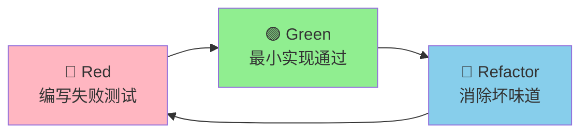
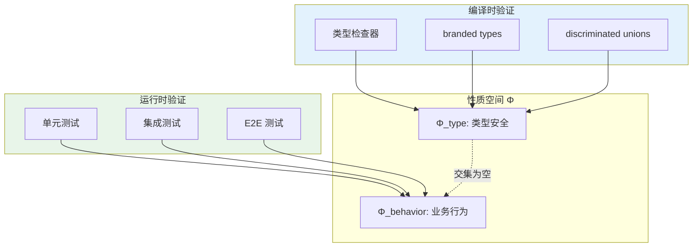
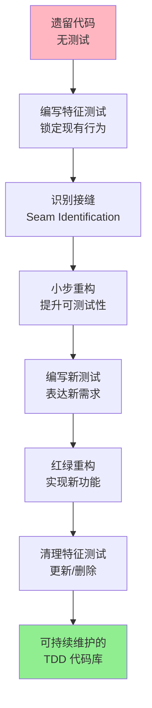
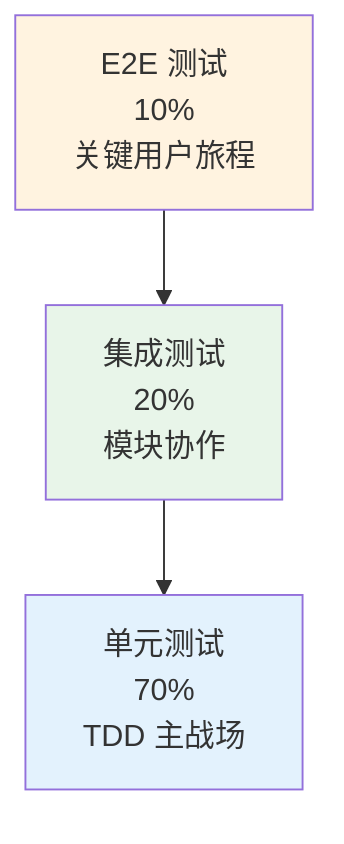

# 测试驱动开发：红绿重构的哲学

测试驱动开发（Test-Driven Development, TDD）自 Kent Beck 在 21 世纪初将其系统化推广以来，已成为软件工程领域最具争议也最具影响力的实践之一。支持者将其视为设计质量的保障与需求理解的透镜；反对者则认为其增加了开发成本、拖慢了交付节奏。本文试图超越意识形态之争，从形式化定义、认知科学基础与工程实践三个层面，系统剖析 TDD 的运作机制、适用边界与实施策略，并特别关注其在 TypeScript 与前端 UI 开发中的具体落地方式。

## 引言

TDD 的核心循环看似简单：编写一个失败的测试 → 编写最少代码使其通过 → 重构以消除冗余。然而，在这「红-绿-重构」三色循环背后，隐藏着关于软件设计、人类认知与验证理论的深刻洞见。在前端工程日益复杂、TypeScript 类型系统日益强大的 2026 年，TDD 不仅没有过时，反而与静态类型、组件驱动设计形成了新的协同关系。

## 理论严格表述

### TDD 的形式化定义

TDD 可被形式化定义为一个三元组 \(\mathcal{T} = (P, \Delta, R)\)：

- \(P\)：当前程序实现，从输入域 \(I\) 到输出域 \(O\) 的偏函数；
- \(\Delta\)：需求增量，即下一个需要被满足的行为规格；
- \(R\)：重构操作集合，保持行为语义不变的程序变换。

TDD 循环的执行序列为：

$$
\forall \delta_i \in \Delta, \quad P_i \xrightarrow{write(\tau_i)} P_i' \xrightarrow{implement(min)} P_{i+1} \xrightarrow{refactor(r \in R)} P_{i+1}^{clean}
$$

其中：

- \(write(\tau_i)\) 表示编写针对增量 \(\delta_i\) 的测试 \(\tau_i\)，此时 \(P_i'\) 下 \(\tau_i\) 失败（红）；
- \(implement(min)\) 表示编写最小实现使 \(\tau_i\) 通过（绿）；
- \(refactor\) 表示在不改变通过测试集合的前提下优化内部结构。

此序列的两个关键不变量为：

1. **测试优先不变量**：任何生产代码的存在必须以至少一个失败测试为前提；
2. **行为保持不变量**：重构操作 \(r\) 必须满足 \( \forall \tau \in TestSuite, \tau(P) = \tau(r(P)) \)。

### TDD 与证明的关系：测试作为可执行规格说明

在形式化方法中，程序正确性通常通过**逻辑证明**或**模型检验**来建立。TDD 不追求数学意义上的完全正确性，而是将测试视为**可执行的规格说明（Executable Specification）**。

对于规范 \(Spec\) 与实现 \(Impl\)，理想情况下我们希望证明：

$$
Impl \models Spec
$$

在 TDD 中，测试集合 \(T = \{\tau_1, \tau_2, \dots, \tau_n\}\) 构成了 \(Spec\) 的有限近似。若 \(Impl\) 通过全部测试，则我们获得**归纳信心**：

$$
\forall \tau \in T, \tau(Impl) = Pass \implies Impl \models Spec \text{ (inductive confidence)}
$$

此信心随测试覆盖的输入空间比例增长，但永不为绝对的数学真理。Dijkstra 的著名论断——「测试只能证明缺陷存在，不能证明缺陷不存在」——在形式化层面依然成立。然而，对于工程实践而言，TDD 提供的**可回归验证（Regressable Verification）**已具备极高的经济价值。

### TDD 的三定律（Kent Beck）

Kent Beck 在《Test-Driven Development: By Example》中提出了 TDD 的三条定律，可视为上述形式化定义的工程化精炼：

1. **第一定律**：在编写一个失败的单元测试之前，不可编写任何生产代码；
2. **第二定律**：只编写刚好足以失败的单元测试，编译失败也算失败；
3. **第三定律**：只编写刚好足以使当前失败测试通过的生产代码。

这三条定律强制实施了**最小步长原则**。从控制论视角看，TDD 将开发过程从一个开环系统（先实现后验证）转变为闭环反馈系统：每个增量都通过测试的通过/失败信号获得即时反馈，从而抑制了需求漂移与过度工程。

### TDD 的认知负荷分析

TDD 的争议很大程度上源于其对开发者**认知负荷（Cognitive Load）**的独特影响。根据 Sweller 的认知负荷理论，工作记忆容量极为有限（Miller 的 7±2 组块法则，现代研究更倾向于 3-4 个组块）。

#### 工作记忆负荷的增加

TDD 要求开发者同时维持三个心智模型：

1. **需求模型**：用户期望的行为是什么；
2. **测试模型**：如何用代码表达这一期望；
3. **实现模型**：如何以最小成本满足测试。

对于初学者，这种多模型并发显著增加了**外在认知负荷**，导致 TDD 在初期显得「慢且笨拙」。研究表明，新手使用 TDD 的开发时间可能比传统方式增加 15%-35%（Fucci et al., 2016）。

#### 长期记忆收益：图式构建

然而，从长期学习视角看，TDD 促进了**关联认知负荷（Germane Load）**：

- 测试作为**外部记忆（External Memory）**，降低了代码理解时的工作记忆压力；
- 红-绿循环的即时反馈加速了「输入-输出-期望」图式的内化；
- 重构阶段强制进行的模式识别（识别坏味道→应用重构手法）构建了可复用的设计图式。

对于经验丰富的开发者，TDD 的测试套件构成了**认知支架（Cognitive Scaffolding）**，使其在处理复杂系统时能够将工作记忆集中在当前增量，而非整个系统的状态。

### TDD 与类型系统的互补性

TypeScript 的静态类型系统与 TDD 在验证维度上形成互补。类型系统提供**编译时证明**，覆盖所有可能的执行路径中类型一致的部分；TDD 提供**运行时验证**，覆盖特定输入下的行为正确性。

形式化地，设程序的全部性质集合为 \(\Phi = \Phi_{type} \cup \Phi_{behavior}\)：

- \(\Phi_{type}\)：类型安全相关的性质（无 undefined 调用、属性存在性等）；
- \(\Phi_{behavior}\)：业务逻辑相关的性质（给定输入产生期望输出、边界条件处理等）。

TypeScript 的类型检查器自动验证 \(\Phi_{type}\)，而 TDD 的测试验证 \(\Phi_{behavior}\) 的有限子集。二者交集为空，并集覆盖软件正确性的主要维度。

**互补实践**：

- 使用**branded types** 与 **discriminated unions** 在类型层面编码不变量，减少需要测试的边界条件；
- 使用 TDD 验证类型系统无法表达的业务规则（如「折扣券不可叠加使用」）；
- 在重构时，类型系统作为**安全网**捕获签名变更，测试套件作为**行为网**捕获语义回归。

## 工程实践映射

### TDD 在 TS 项目中的完整实践：红-绿-重构循环示例

以下通过一个完整的 TypeScript 示例展示 TDD 循环。

#### 需求

实现一个 `PricingService`，支持以下规则：

- 基础价格 = 单价 × 数量；
- 数量 ≥ 10 时享受 5% 折扣；
- 数量 ≥ 100 时享受 10% 折扣；
- 折扣不可叠加，取最高适用折扣。

#### 第一步：红——编写失败的测试

```typescript
// pricing.service.test.ts
import { describe, it, expect } from 'vitest'
import { PricingService } from './pricing.service'

describe('PricingService', () => {
  it('should calculate base price without discount', () => {
    const service = new PricingService()
    expect(service.calculate({ unitPrice: 100, quantity: 1 })).toBe(100)
  })
})
```

此时运行测试会失败（红），因为 `PricingService` 尚未实现。

#### 第二步：绿——编写最小实现

```typescript
// pricing.service.ts
interface PricingInput {
  unitPrice: number
  quantity: number
}

export class PricingService {
  calculate(input: PricingInput): number {
    return input.unitPrice * input.quantity
  }
}
```

测试通过（绿）。注意实现刻意保持最小，甚至未处理折扣逻辑。

#### 第三步：红——添加下一个失败测试

```typescript
it('should apply 5% discount for quantity >= 10', () => {
  const service = new PricingService()
  expect(service.calculate({ unitPrice: 100, quantity: 10 })).toBe(950)
})
```

测试失败（红），因为当前实现未处理折扣。

#### 第四步：绿——扩展实现

```typescript
export class PricingService {
  calculate(input: PricingInput): number {
    const base = input.unitPrice * input.quantity
    if (input.quantity >= 10) {
      return base * 0.95
    }
    return base
  }
}
```

#### 第五步：红——添加 10% 折扣测试

```typescript
it('should apply 10% discount for quantity >= 100', () => {
  const service = new PricingService()
  expect(service.calculate({ unitPrice: 100, quantity: 100 })).toBe(9000)
})
```

#### 第六步：绿——扩展实现

```typescript
export class PricingService {
  calculate(input: PricingInput): number {
    const base = input.unitPrice * input.quantity
    if (input.quantity >= 100) {
      return base * 0.9
    }
    if (input.quantity >= 10) {
      return base * 0.95
    }
    return base
  }
}
```

#### 第七步：重构——消除魔法数字，提升表达力

```typescript
export class PricingService {
  private readonly thresholds = [
    { minQty: 100, rate: 0.9 },
    { minQty: 10, rate: 0.95 },
  ] as const

  calculate(input: PricingInput): number {
    const base = input.unitPrice * input.quantity
    const discount = this.thresholds.find((t) => input.quantity >= t.minQty)
    return discount ? base * discount.rate : base
  }
}
```

重构后运行全部测试，确认通过（绿）。此循环展示了 TDD 如何通过小步快跑将需求转化为结构良好的代码。

### TDD 与 BDD 的结合：Given-When-Then + 单元测试

行为驱动开发（BDD）是 TDD 的语义延伸，强调用领域语言描述行为。在 TypeScript 项目中，可将 BDD 的 `Given-When-Then` 结构映射为测试的 `Arrange-Act-Assert`：

```typescript
describe('购物车结算', () => {
  it('Given 购物车中有 2 件商品，When 用户应用有效优惠券，Then 总价应减去优惠金额', () => {
    // Given
    const cart = new ShoppingCart()
    cart.addItem({ id: '1', price: 100 })
    cart.addItem({ id: '2', price: 200 })
    const coupon = new FixedAmountCoupon(50)

    // When
    const total = cart.checkout({ coupon })

    // Then
    expect(total).toBe(250)
  })
})
```

**工程建议**：

- 使用 `describe` 嵌套表达业务语境（`Feature → Scenario → Case`）；
- 测试文件名与生产代码保持镜像结构（`checkout.service.ts` ↔ `checkout.service.test.ts`）；
- 在 CI 中配置测试报告生成工具（如 `vitest --reporter=junit`），使非技术干系人可阅读 BDD 风格的测试输出。

### TDD 在 UI 开发中的应用

前端 UI 组件的 TDD 长期被认为「成本过高」，原因在于 DOM 测试的脆弱性与视觉回归的难以断言。然而，通过**组件契约测试**与**Storybook Driven Development**，TDD 可在 UI 层得到有效应用。

#### React 组件 TDD 示例

假设需实现一个 `Counter` 组件，支持显示数值、递增、递减，且有最小/最大边界。

**测试优先（使用 React Testing Library）**：

```typescript
// Counter.test.tsx
import { render, screen, fireEvent } from '@testing-library/react'
import { describe, it, expect } from 'vitest'
import { Counter } from './Counter'

describe('Counter', () => {
  it('renders initial value', () => {
    render(<Counter initial={5} />)
    expect(screen.getByText('5')).toBeInTheDocument()
  })

  it('increments on + click', () => {
    render(<Counter initial={5} />)
    fireEvent.click(screen.getByRole('button', { name: /increment/i }))
    expect(screen.getByText('6')).toBeInTheDocument()
  })

  it('does not exceed max value', () => {
    render(<Counter initial={10} max={10} />)
    fireEvent.click(screen.getByRole('button', { name: /increment/i }))
    expect(screen.getByText('10')).toBeInTheDocument()
  })
})
```

**最小实现**：

```tsx
import { useState } from 'react'

interface CounterProps {
  initial?: number
  min?: number
  max?: number
}

export function Counter({ initial = 0, min = -Infinity, max = Infinity }: CounterProps) {
  const [count, setCount] = useState(initial)

  const increment = () => setCount((c) => Math.min(c + 1, max))
  const decrement = () => setCount((c) => Math.max(c - 1, min))

  return (
    <div>
      <button onClick={decrement}>Decrement</button>
      <span>{count}</span>
      <button onClick={increment}>Increment</button>
    </div>
  )
}
```

**重构与完善**：提取 `useCounter` Hook 将逻辑与视图分离，便于复用与独立测试。

```typescript
// useCounter.ts
export function useCounter(initial = 0, min = -Infinity, max = Infinity) {
  const [count, setCount] = useState(initial)
  const increment = () => setCount((c) => Math.min(c + 1, max))
  const decrement = () => setCount((c) => Math.max(c - 1, min))
  return { count, increment, decrement }
}
```

#### Storybook Driven Development

Storybook 可作为 TDD 的「视觉测试」补充。在实现组件前，先编写 Story 定义组件的可见状态空间：

```typescript
// Counter.stories.tsx
import type { Meta, StoryObj } from '@storybook/react'
import { Counter } from './Counter'

const meta: Meta<typeof Counter> = {
  component: Counter,
}
export default meta

type Story = StoryObj<typeof Counter>

export const Default: Story = { args: { initial: 0 } }
export const AtMax: Story = { args: { initial: 10, max: 10 } }
export const AtMin: Story = { args: { initial: -5, min: -5 } }
```

Storybook 的交互测试（Interaction Tests）允许在 Story 内编写 play 函数，实现视觉-行为双重 TDD：

```typescript
export const ClickIncrements: Story = {
  args: { initial: 0 },
  play: async ({ canvasElement }) => {
    const canvas = within(canvasElement)
    await userEvent.click(canvas.getByRole('button', { name: /increment/i }))
    await expect(canvas.getByText('1')).toBeInTheDocument()
  },
}
```

### TDD 的反模式

#### 1. Mock 过度（Over-Mocking）

当测试中的 Mock 对象数量超过被测系统的实际依赖时，测试退化为「验证 Mock 行为」而非「验证系统行为」。反模式症状包括：

- 测试通过但生产环境崩溃（Mock 与实际实现语义偏离）；
- 重构生产代码导致大量测试失败（Mock 期望过于具体）。

**矫正策略**：遵循「不要 Mock 你不拥有的类型」原则；优先使用 Fake / In-Memory 实现替代 Mock；在集成测试中减少 Mock 层级。

#### 2. 测试脆弱（Fragile Tests）

脆弱测试对无关变更过度敏感，常见原因：

- 断言完整 HTML 结构而非语义角色；
- 依赖具体 CSS 类名或 DOM 层级；
- 测试私有方法而非公共契约。

**矫正策略**：使用 React Testing Library 的「查询优先」原则（优先 `getByRole`、`getByLabelText`）；测试行为而非结构；通过重构将私有逻辑提取为可独立测试的纯函数。

#### 3. 忽视集成测试

TDD 的单元测试聚焦最小验证单元，但无法捕获单元间协作失败。TDD 并非「只写单元测试」。完整的测试金字塔要求：

- **单元测试**（70%）：验证孤立逻辑；
- **集成测试**（20%）：验证模块间协作；
- **E2E 测试**（10%）：验证关键用户旅程。

#### 4. 测试成为变更阻力

当测试对重构形成阻力而非支持时，通常意味着测试与实现耦合过紧。TDD 的测试应成为重构的安全网，而非枷锁。若「修改一行代码导致 50 个测试失败」，则表明测试需要与实现一并重构。

### TDD vs 传统开发效率对比研究

关于 TDD 对开发效率的影响，学术界已有较为一致的结论：

- **开发时间**：TDD 在初期通常增加 15%-35% 的编码时间（Fucci et al., 2016, IEEE TSE）。然而，此成本在维护期得到补偿：TDD 代码的缺陷密度通常降低 40%-90%（Nagappan et al., Microsoft Research, 2008）。
- **设计质量**：TDD 代码倾向于更高的内聚性与更低的耦合度。George & Williams (2004) 的实验表明，TDD 组在代码复杂度（Cyclomatic Complexity）与可重用性指标上显著优于对照组。
- **认知负荷**：对于熟练开发者，TDD 的测试套件降低了理解代码所需的认知负荷；对于新手，TDD 的额外步骤增加了外在负荷，但加速了图式构建（Erdogmus et al., 2005）。

**工程启示**：TDD 的 ROI（投资回报率）在项目生命周期超过 3-6 个月时转为正收益。对于一次性的脚本或原型，传统方式可能更经济；对于需要长期维护的业务系统，TDD 是理性选择。

### TDD 在遗留代码中的应用

Michael Feathers 在《Working Effectively with Legacy Code》中将遗留代码定义为「没有测试的代码」。对遗留代码应用 TDD 的关键挑战在于：系统缺乏可测试性（紧耦合、全局状态、庞大类），无法直接为新增需求编写测试。

#### 特征测试（Characterization Test）

在修改遗留代码前，首先编写**特征测试**：捕获当前系统的实际行为（无论正确与否）。特征测试是 TDD 在遗留系统中的变体：

```typescript
// 在修改前，先记录现有行为
it('characterization: current behavior for edge case', () => {
  const result = legacyModule.process(null)
  // 首次运行时记录实际输出，后续作为回归防护
  expect(result).toBe(/* recorded value */)
})
```

#### 接缝识别（Seam Identification）

Feathers 提出的「接缝」是程序中可替换行为而不改变调用代码的位置。通过识别接缝，可在不重构整个系统的情况下注入测试替身：

- **预处理接缝**：通过修改源代码引入依赖注入点；
- **链接接缝**：利用模块系统替换依赖实现；
- **运行时接缝**：利用语言特性（如 monkey-patching，不推荐长期维护）。

#### 重构 → 新测试 → 新功能

遗留代码的 TDD 循环变为：

1. **编写特征测试**，锁定当前行为；
2. **小步重构**（提取函数、引入参数对象），在特征测试保护下改善可测试性；
3. **编写新测试**，表达新需求；
4. **实现新功能**，遵循标准 TDD 循环；
5. **清理特征测试**，若其捕获的是 Bug 行为且已修复，则更新或删除。

```typescript
// 重构前：全局依赖，难以测试
function calculateTotal(items: Item[]) {
  const db = getGlobalDatabase()
  const rate = db.getCurrentTaxRate()
  return items.reduce((sum, i) => sum + i.price * rate, 0)
}

// 重构后：通过参数注入依赖，可测试
interface TaxRateProvider {
  getCurrentTaxRate(): number
}

function calculateTotal(items: Item[], provider: TaxRateProvider): number {
  const rate = provider.getCurrentTaxRate()
  return items.reduce((sum, i) => sum + i.price * rate, 0)
}

// 测试
it('calculates total with tax', () => {
  const fakeProvider: TaxRateProvider = {
    getCurrentTaxRate: () => 0.1,
  }
  expect(calculateTotal([{ price: 100 }], fakeProvider)).toBe(110)
})
```

## Mermaid 图表

### TDD 红-绿-重构循环



### TDD 与类型系统的互补验证空间



### 遗留代码 TDD 迁移流程



### 测试金字塔与 TDD 定位



## 理论要点总结

1. **TDD 是闭环反馈系统**：通过红-绿-重构循环，将软件开发从开环的「先实现后验证」转变为闭环的「需求-测试-实现-优化」，抑制漂移与过度工程。

2. **测试是可执行的规格说明**：TDD 的测试集合构成了需求的形式化近似，虽不能替代数学证明，但提供了可回归的工程信心与活文档价值。

3. **认知负荷是 TDD 的双刃剑**：初期增加工作记忆负担，长期通过外部记忆与图式构建提升认知效率。团队应预期 2-4 周的学习曲线拐点。

4. **类型系统与 TDD 互补**：TypeScript 验证编译时不变量，TDD 验证运行时行为。二者交集为空，并集覆盖主要正确性维度。

5. **遗留代码的 TDD 始于特征测试**：在缺乏测试的系统中，先记录现有行为，再通过接缝识别与小步重构逐步建立可测试性，最终导入标准 TDD 循环。

## 参考资源

1. Beck, Kent. *Test-Driven Development: By Example*. Addison-Wesley Professional, 2002. TDD 的奠基之作，系统阐述了三定律、红绿重构循环与 xUnit 测试框架的设计哲学。

2. Feathers, Michael. *Working Effectively with Legacy Code*. Prentice Hall, 2004. 遗留代码治理的权威指南，提出了接缝理论、特征测试与依赖破除技术，是 TDD 在棕色地带应用的手册。

3. Martin, Robert C. *Clean Code: A Handbook of Agile Software Craftsmanship*. Prentice Hall, 2008. 书中「单元测试」章节阐述了 FIRST 原则（Fast, Independent, Repeatable, Self-validating, Timely），为 TDD 的测试质量提供了评判标准。

4. Kent Beck. "Test Driven Development." *Kent Beck's Blog / Various Writings*, <https://tdd.xpy.dev>. Beck 关于 TDD 的持续思考，包括 TDD 的适用范围、常见误解以及与设计模式的关系。

5. Fucci, Davide, et al. "An External Replication on the Effects of Test-driven Development Using a Multi-site Blind Analysis Approach." *2016 IEEE/ACM 10th International Symposium on Empirical Software Engineering and Measurement (ESEM)*, 2016. 大规模实验研究，量化了 TDD 对开发时间、代码质量与团队生产力的影响，为 TDD 的 ROI 提供了实证依据。
