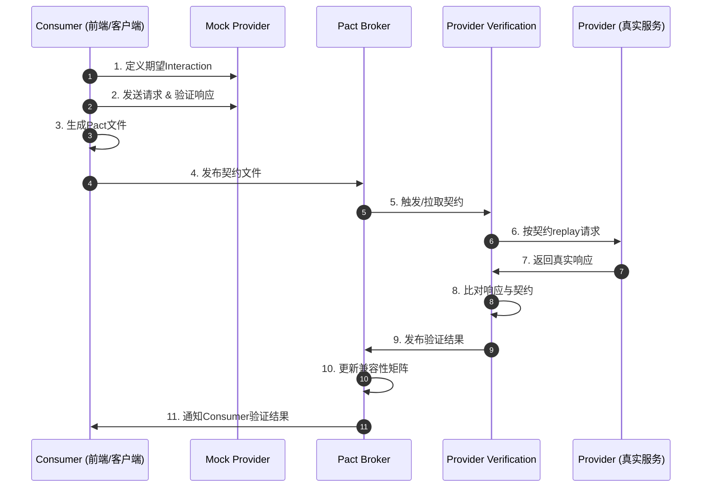
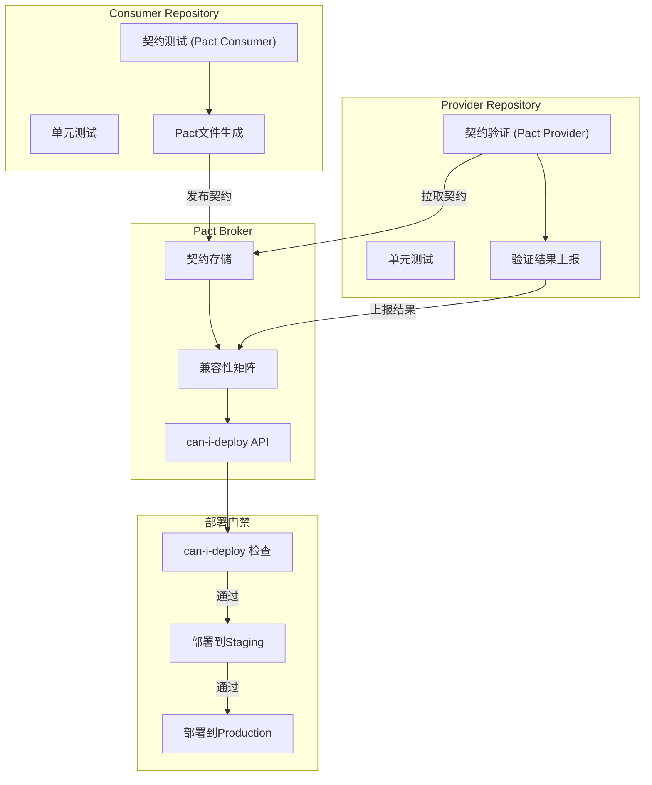

# 契约测试：跨服务边界的验证

在微服务架构中，服务之间的通信边界构成了系统最脆弱的耦合点。当数十甚至数百个服务通过HTTP API、消息队列或gRPC进行交互时，任何一个服务接口的变更都可能引发级联故障。传统的集成测试虽然能够验证端到端的业务逻辑，但其执行成本高、反馈周期长，难以在快速迭代中提供及时的保护。契约测试（Contract Testing）作为一种专注于接口语义验证的测试范式，通过在服务边界处建立形式化的契约规范，为微服务架构提供了轻量级、高确定性的兼容性保障机制。

## 引言

微服务架构的核心假设之一是服务可以独立部署、独立演进。然而，这种独立性在服务间存在调用关系时面临严峻挑战：上游服务的Provider修改了响应字段的类型，下游Consumer可能在部署到生产环境后才发现解析失败；Consumer发送了Provider不再支持的查询参数，导致请求被静默拒绝或返回异常状态码。这些问题的根源在于服务边界的语义约定缺乏显式的、可自动验证的规范。

契约测试通过将服务间隐式的"约定"提升为显式的"契约"，使得Consumer与Provider能够在不实际启动对方的情况下验证兼容性。它不测试业务逻辑的正确性，而是测试"如果我发送这样的请求，你是否承诺返回那样的响应"。这种关注点的精确收窄，使契约测试在运行速度和稳定性上远超传统集成测试，同时提供了集成测试无法比拟的兼容性矩阵洞察。

本文从形式化定义出发，系统阐述Consumer-Driven与Provider-Driven两种契约模型的理论基础，深入分析Pact的匹配规则语义，并完整映射到Pact JS的工程实现、Pact Broker的契约生命周期管理以及CI/CD流水线中的契约门禁策略。

## 理论严格表述

### 契约测试的形式化定义

**定义 13.1（服务契约）**：设服务Consumer的请求空间为 \(R\)，Provider的响应空间为 \(S\)。一个服务契约 \(C\) 是笛卡尔积 \(R \times S\) 的一个子集，即 \(C \subseteq R \times S\)。对于任意请求 \(r \in R\) 和响应 \(s \in S\)，当且仅当 \((r, s) \in C\) 时，称该请求-响应对满足契约 \(C\)。

契约测试的核心任务不是验证 \(C\) 是否表达了正确的业务语义——那是功能测试的职责——而是验证Consumer与Provider对 \(C\) 的理解是否一致。形式化地说，设Consumer侧的期望集合为 \(C_{consumer}\)，Provider侧的实现集合为 \(C_{provider}\)，契约测试验证的是：

$$C_{consumer} \subseteq C_{provider}$$

在Consumer-Driven Contract（CDC）模型中，Consumer通过编写契约测试来定义其期望的 \(C_{consumer}\)，Provider随后验证其 \(C_{provider}\) 是否包含该期望。在Provider-Driven Contract（PDC）模型中，Provider发布其支持的 \(C_{provider}\)，Consumer验证其请求是否落在该集合内。

**定义 13.2（契约兼容性）**：设有两个契约版本 \(C_v\) 和 \(C_{v'}\)。若 \(C_v \subseteq C_{v'}\)，则称 \(v'\) 向后兼容（Backward Compatible）于 \(v\)。若 \(C_{v'} \subseteq C_v\)，则称 \(v'\) 向前兼容（Forward Compatible）于 \(v\)。

在实际系统中，Provider的变更通常需要保证向后兼容：新版本的Provider必须继续满足旧版本Consumer的期望。反之，Consumer的变更通常需要保证向前兼容：Consumer应当能够处理比其期望更丰富的响应（例如忽略未知字段）。

### Consumer-Driven vs Provider-Driven 契约模型

Consumer-Driven Contract模型的核心思想是"由消费者定义契约"。其形式化流程如下：

1. Consumer基于其业务需求定义期望的请求-响应对 \((r, s)\)；
2. Consumer在隔离环境中（不依赖真实Provider）运行契约测试，生成契约文件（通常为JSON格式）；
3. 契约文件被发布到共享的契约仓库（如Pact Broker）；
4. Provider获取契约文件， replay Consumer的请求并验证响应是否匹配期望；
5. 验证结果反馈给Consumer和Provider双方。

CDC模型的优势在于契约反映了真实的消费者需求，避免了Provider过度设计或维护无人使用的接口字段。其形式化保证为：若Provider通过了所有Consumer的契约验证，则对于任意Consumer \(i\)，有 \(C_{consumer_i} \subseteq C_{provider}\)。

Provider-Driven Contract模型则适用于Provider具有强控制权或Consumer数量庞大且异构的场景。Provider通过OpenAPI/Swagger、GraphQL Schema或Protocol Buffers等IDL（Interface Definition Language）定义 \(C_{provider}\)，Consumer验证其请求生成器和响应解析器是否符合该规范。PDC的形式化保证为：Consumer满足 \(C_{consumer} \subseteq C_{provider}\)。

在实践中，两种模型并非互斥。许多组织采用混合策略：内部微服务间使用CDC确保精确匹配，对外部API使用PDC（基于OpenAPI规范）进行合规性验证。

### Pact匹配规则的理论语义

Pact作为业界最成熟的契约测试框架，定义了一套丰富的匹配规则，用于在契约中表达灵活但精确的期望。

**类型匹配（Type Matching）**：设字段 \(f\) 的期望值为 \(v\)，其类型为 \(T(v)\)。Pact的类型匹配规则声明Provider响应中对应字段 \(f'\) 的类型必须满足 \(T(f') = T(v)\)，但值不必相等。形式化表示为：

$$\forall f \in \text{Fields}(s_{expected}), \quad T(f_{actual}) = T(f_{expected})$$

这允许Provider在保持类型一致的前提下返回不同的具体值，例如不同的UUID、时间戳或数据库主键。

**正则匹配（Regex Matching）**：设正则表达式为 \(re\)，则匹配规则要求：

$$\forall f \in \text{Fields}(s_{expected}), \quad f_{actual} \in L(re)$$

其中 \(L(re)\) 表示正则表达式 \(re\) 描述的形式语言。这在验证日期格式、邮箱地址、电话号码等结构化字符串时尤为有用。

**数组长度匹配（Array Length Matching）**：设期望数组 \(A_{expected}\) 的长度为 \(n\)。Pact支持声明实际数组 \(A_{actual}\) 的长度约束，如 \( |A_{actual}| = n \)（精确匹配）、\( |A_{actual}| \geq n \)（最小长度）或 \( |A_{actual}| \leq n \)（最大长度）。

**组合匹配语义**：Pact的匹配规则可以组合使用。例如，一个字段可以同时声明为类型匹配（`string`）和正则匹配（`^\d{4}-\d{2}-\d{2}$`），此时 Provider 响应必须同时满足两种约束：

$$T(f_{actual}) = \text{string} \land f_{actual} \in L(\text{^\\d\{4\}-\\d\{2\}-\\d\{2\}$})$$

### 契约测试与集成测试的区别

契约测试与集成测试在目标、范围和执行特性上存在本质差异：

| 维度 | 契约测试 | 集成测试 |
|------|----------|----------|
| **验证目标** | 接口语义的一致性：请求/响应结构、字段类型、状态码 | 业务逻辑的正确性：端到端业务流程、数据一致性 |
| **耦合程度** | 松耦合：Consumer与Provider独立运行 | 紧耦合：需要同时启动多个服务及其依赖 |
| **执行速度** | 快（毫秒级）：无需启动真实服务 | 慢（秒至分钟级）：需启动完整环境 |
| **失败定位** | 精确：直接指出契约违反的字段/规则 | 模糊：可能是网络、数据库、配置或代码问题 |
| **环境依赖** | 无：可在本地完全离线运行 | 高：需要数据库、消息队列、缓存等基础设施 |
| **覆盖范围** | 服务边界：单个请求-响应对 | 业务流程：多个服务的协作序列 |

形式化地说，集成测试验证的是系统的可达性（Reachability）和行为的正确性（Correctness）：给定初始状态 \(s_0\) 和输入序列 \(I\)，系统的最终状态 \(s_f\) 是否满足业务规约 \(\Phi(s_f)\)。而契约测试验证的是接口的相容性（Compatibility）：对于任意满足Consumer期望的请求 \(r\)，Provider的响应 \(s\) 是否满足契约约束 \(C(r, s)\)。

### 契约测试在微服务架构中的位置

在微服务测试金字塔中，契约测试占据了一个独特的中间位置：

- **单元测试**（底层）：验证单个函数/类在隔离环境下的正确性，完全不涉及服务边界。
- **契约测试**（中下层）：验证服务边界的接口语义，不涉及业务逻辑流转。
- **集成测试**（中层）：验证多个服务协作完成特定业务场景的能力。
- **端到端测试**（顶层）：验证完整用户旅程在近似生产环境中的正确性。

契约测试的独特价值在于它提供了"部署信心"（Deployment Confidence）。在微服务架构中，即使每个服务的单元测试都通过，也不能保证它们部署到一起后能够正常通信。契约测试填补了这一空白：它在部署前验证"这些服务能否互相理解对方的消息"。

## 工程实践映射

### Pact JS 的实现体系

Pact生态在JavaScript/TypeScript环境中提供了多层次的实现支持。核心包 `@pact-foundation/pact` 提供了Consumer端的契约生成能力，`@pact-foundation/pact-node`（现已被整合进主包）提供了Provider端的契约验证能力，而 `@pact-foundation/pact-cli` 则提供了与Pact Broker交互的命令行工具。

对于Node.js服务端应用和浏览器前端应用，Pact提供了差异化的适配方案：

- **Node.js环境**：直接使用 `@pact-foundation/pact`，内置HTTP Mock Provider，无需额外配置。
- **浏览器/前端环境**：使用 `@pact-foundation/pact-web`，通过Service Worker或XHR拦截机制模拟Provider响应。
- **TypeScript支持**：所有Pact包均提供原生类型定义，契约定义可获得完整的类型推断和编译时检查。

### Consumer端契约编写

Consumer端契约测试的核心任务是：在与真实Provider完全隔离的环境中，描述"我期望Provider如何响应我的请求"，并生成可共享的契约文件（Pact文件）。

Pact JS 提供了 `pactWith` 辅助函数，将Jest或Mocha的测试封装在一个自动管理的Mock Provider上下文中：

```typescript
import { pactWith } from 'jest-pact';
import { Matchers } from '@pact-foundation/pact';

pactWith(
  { consumer: 'OrderFrontend', provider: 'OrderAPI' },
  (provider) => {
    describe('GET /orders/:id', () => {
      beforeEach(() =>
        provider.addInteraction({
          state: 'an order with ID 123 exists',
          uponReceiving: 'a request for order 123',
          withRequest: {
            method: 'GET',
            path: '/orders/123',
            headers: { Accept: 'application/json' },
          },
          willRespondWith: {
            status: 200,
            headers: { 'Content-Type': 'application/json' },
            body: {
              id: Matchers.like(123),
              status: Matchers.term({
                generate: 'shipped',
                matcher: '^(pending|shipped|delivered|canceled)$',
              }),
              createdAt: Matchers.datetime({
                generate: '2024-01-15T10:30:00Z',
                format: 'yyyy-MM-dd\'T\'HH:mm:ss\'Z\'',
              }),
              items: Matchers.eachLike({
                productId: Matchers.uuid(),
                quantity: Matchers.integer(2),
              }),
            },
          },
        })
      );

      it('returns the expected order', async () => {
        const order = await fetchOrder('123');
        expect(order.status).toMatch(/^(pending|shipped|delivered|canceled)$/);
        expect(order.items).toHaveLength(1);
      });
    });
  }
);
```

在上述示例中，Matchers 的使用体现了Pact匹配规则的工程映射：

- `Matchers.like(123)`：类型匹配，Provider返回的 `id` 字段可以是任意整数；
- `Matchers.term()`：正则匹配，确保 `status` 字段的值落在预定义的枚举集合中；
- `Matchers.datetime()`：结构化匹配，验证日期字符串符合ISO 8601格式；
- `Matchers.eachLike()`：数组匹配，验证 `items` 是包含特定结构元素的数组，且至少有一个元素；
- `Matchers.uuid()`：专用匹配器，验证字符串符合UUID格式。

`Interaction Builder` 模式将每个交互定义为一个四元组：`(state, request, response, description)`。其中 `state` 对应Provider的状态管理（Provider State），是契约测试能够验证有状态接口的关键机制。

### Provider端契约验证

Provider端的任务是从Pact Broker（或本地文件系统）获取所有Consumer提交的契约文件，replay其中记录的请求，并验证实际响应是否与契约期望匹配。

在Pact JS中，Provider验证通过 `@pact-foundation/pact` 的 `Verifier` 类实现：

```typescript
import { Verifier } from '@pact-foundation/pact';

const verifier = new Verifier({
  provider: 'OrderAPI',
  providerBaseUrl: 'http://localhost:3000',
  pactBrokerUrl: 'https://pact-broker.company.com',
  pactBrokerToken: process.env.PACT_BROKER_TOKEN,
  providerAppVersion: process.env.GIT_SHA,
  publishVerificationResult: true,
  providerBranch: process.env.GIT_BRANCH,

  stateHandlers: {
    'an order with ID 123 exists': async () => {
      await db.orders.insert({
        id: '123',
        status: 'shipped',
        createdAt: '2024-01-15T10:30:00Z',
        items: [{ productId: 'a1b2c3', quantity: 2 }],
      });
    },
    'no order exists': async () => {
      await db.orders.clear();
    },
  },
});

await verifier.verify();
```

Provider验证的关键配置项包括：

- `providerBaseUrl`：Provider服务的运行地址，验证前需确保Provider已启动；
- `pactBrokerUrl` / `pactBrokerToken`：Pact Broker的访问凭证，用于拉取契约和上报验证结果；
- `providerAppVersion` / `providerBranch`：Provider的版本标识，支持契约与代码版本的追溯关联；
- `publishVerificationResult`：是否将验证结果发布到Pact Broker，开启后Broker可基于结果进行部署决策；
- `stateHandlers`：Provider状态处理器，将契约中的 `providerState` 映射为实际的数据准备逻辑。

Provider State 是契约测试处理有状态交互的核心机制。由于Consumer在编写契约时无法控制Provider的数据库状态，它通过声明式地描述"在给定状态下，我期望得到某响应"，将状态准备的责任转移给Provider。这种分离保持了Consumer测试的纯粹性，同时给予Provider足够的灵活性来设置测试数据。

### Pact Broker 的契约管理

Pact Broker 是契约测试生态的"单一事实来源"（Single Source of Truth）。它不仅是契约文件的存储仓库，更是契约生命周期管理、版本控制、兼容性分析和部署决策的核心平台。

**版本控制与契约演化**：Pact Broker将契约文件与Consumer的版本（通常是Git Commit SHA或语义化版本）关联存储。当Consumer提交新的契约版本时，Broker保留历史版本，允许团队追溯接口演化的完整时间线。这种版本化存储使得"谁、在何时、引入了什么接口变更"成为可审计的事实。

**兼容性矩阵（Compatibility Matrix）**：Broker维护一个Consumer-Provider验证结果的矩阵，记录了哪些Consumer版本与哪些Provider版本通过了契约验证。该矩阵是部署决策的核心依据：

```
                    Provider
              v1.0.0   v1.1.0   v1.2.0
Consumer
  v2.0.0        ✓        ✓        ✗
  v2.1.0        ✓        ✓        ✓
  v2.2.0        ✗        ✓        ✓
```

在此矩阵中，Consumer v2.0.0 与 Provider v1.2.0 的交叉处为 ✗，表明该组合存在契约违反，不应被允许共同部署。

**can-i-deploy**：Pact Broker提供的 `can-i-deploy` 是契约测试在CI/CD中最具价值的集成点。该工具查询兼容性矩阵，判断当前版本的Consumer或Provider是否可以安全部署到目标环境：

```bash
# Consumer部署前检查：我的新版本是否与生产环境的Provider兼容？
pact-broker can-i-deploy \
  --pacticipant OrderFrontend \
  --version $GIT_SHA \
  --to-environment production \
  --broker-base-url https://pact-broker.company.com \
  --broker-token $PACT_BROKER_TOKEN

# Provider部署前检查：我的新版本是否与所有已部署的Consumer兼容？
pact-broker can-i-deploy \
  --pacticipant OrderAPI \
  --version $GIT_SHA \
  --to-environment production \
  --broker-base-url https://pact-broker.company.com \
  --broker-token $PACT_BROKER_TOKEN
```

`can-i-deploy` 的判定逻辑基于Broker中记录的验证结果。若所有必要的契约验证均已通过，命令返回成功；若有任何未验证或失败的契约，命令返回非零状态码，阻止部署流水线继续执行。

**Webhook 集成**：Pact Broker支持配置Webhook，在关键事件发生时触发外部系统的回调。典型配置包括：

- Consumer发布新契约后，自动触发Provider的契约验证流水线；
- Provider验证完成后，自动通知Consumer团队验证结果；
- 契约验证失败时，自动在Issue Tracker（如Jira、GitHub Issues）中创建缺陷单。

### CI/CD 中的契约测试集成

将契约测试嵌入CI/CD流水线需要解决三个核心问题：何时生成契约、何时验证契约、以及如何将验证结果转化为部署决策。

**Consumer流水线的契约生成阶段**：

```yaml
# .github/workflows/contract-consumer.yml
name: Consumer Contract Tests
on: [push, pull_request]
jobs:
  contract-test:
    runs-on: ubuntu-latest
    steps:
      - uses: actions/checkout@v4
      - uses: actions/setup-node@v4
        with: { node-version: '20' }
      - run: npm ci
      - run: npm run test:contract
      - name: Publish Pact to Broker
        if: github.ref == 'refs/heads/main'
        run: |
          pact-broker publish ./pacts \
            --consumer-app-version ${{ github.sha }} \
            --branch ${{ github.ref_name }} \
            --broker-base-url ${{ secrets.PACT_BROKER_URL }} \
            --broker-token ${{ secrets.PACT_BROKER_TOKEN }}
```

Consumer在每次提交时运行契约测试，生成Pact文件。当提交发生在主分支时，将契约文件发布到Broker。发布时携带的版本信息（Git SHA和分支名）使Broker能够建立契约与代码版本的精确关联。

**Provider流水线的契约验证阶段**：

```yaml
# .github/workflows/contract-provider.yml
name: Provider Contract Verification
on: [push, pull_request]
jobs:
  verify-contracts:
    runs-on: ubuntu-latest
    services:
      postgres:
        image: postgres:16
        env:
          POSTGRES_PASSWORD: test
        options: >-
          --health-cmd pg_isready
          --health-interval 10s
          --health-timeout 5s
          --health-retries 5
    steps:
      - uses: actions/checkout@v4
      - uses: actions/setup-node@v4
        with: { node-version: '20' }
      - run: npm ci
      - run: npm run db:migrate
      - run: npm run start:test &
      - run: sleep 5
      - run: npm run test:contract:verify
        env:
          PACT_BROKER_BASE_URL: ${{ secrets.PACT_BROKER_URL }}
          PACT_BROKER_TOKEN: ${{ secrets.PACT_BROKER_TOKEN }}
          GIT_SHA: ${{ github.sha }}
          GIT_BRANCH: ${{ github.ref_name }}
```

Provider流水线启动真实的服务实例（通常连接测试数据库），然后运行契约验证。验证结果自动发布到Broker，更新兼容性矩阵。

**预部署门禁（Pre-deployment Gate）**：

```yaml
# 部署阶段的契约门禁
  deploy:
    needs: [verify-contracts, integration-tests]
    runs-on: ubuntu-latest
    steps:
      - uses: actions/checkout@v4
      - name: Can I Deploy?
        run: |
          pact-broker can-i-deploy \
            --pacticipant OrderAPI \
            --version ${{ github.sha }} \
            --to-environment staging \
            --broker-base-url ${{ secrets.PACT_BROKER_URL }} \
            --broker-token ${{ secrets.PACT_BROKER_TOKEN }}
      - name: Deploy to Staging
        run: ./scripts/deploy-staging.sh
```

`can-i-deploy` 作为部署前的硬性门禁，只有在契约兼容性得到确认后才允许部署。这种机制将"部署后发现问题"转变为"部署前拦截风险"，显著降低了生产环境接口不兼容导致故障的概率。

### Breaking Change 检测与兼容性矩阵

Breaking Change（破坏性变更）是指导致现有Consumer无法满足契约的Provider接口修改。Pact生态通过以下机制实现Breaking Change的自动检测：

**消费者优先验证（Consumer-Driven Verification）**：由于契约由Consumer定义，任何导致现有契约验证失败的Provider变更都是潜在的Breaking Change。Provider在CI中验证所有Consumer契约时，若任何验证失败，构建即告失败，阻止变更合入主干。

**WIP契约与Pending状态**：当Consumer需要引入新的接口需求（例如新增字段）时，可以将契约标记为WIP（Work In Progress）。WIP契约的验证失败不会阻塞Provider的部署，但会提示Provider团队未来的接口需求。一旦Provider实现了该需求并通过验证，WIP标记被移除，契约正式生效。

**分支策略与契约隔离**：Pact Broker支持按分支隔离契约。功能分支上的契约变更不会影响主分支的兼容性矩阵，允许团队在安全沙盒中迭代接口设计。当功能分支合并到主分支时，契约才正式进入部署决策流程。

**可视化与报告**：Pact Broker的Web界面提供了网络图（Network Diagram）和兼容性矩阵的可视化展示。网络图显示了服务间的依赖关系及其契约状态（绿色：兼容；红色：不兼容；黄色：未验证），帮助团队快速识别架构中的风险链路。

## Mermaid 图表

### 图13-1：Consumer-Driven Contract 测试流程



该序列图展示了CDC模型的完整闭环：Consumer在隔离环境中与Mock Provider交互生成契约，Provider随后验证契约并将结果反馈给Broker。Broker作为中枢协调者，维护兼容性矩阵并支持部署决策。

### 图13-2：CI/CD 中的契约测试集成架构



该架构图展示了契约测试如何嵌入现代CI/CD流水线。Consumer生成契约、Provider验证契约、Broker管理兼容性关系，而 `can-i-deploy` 作为统一的部署门禁，确保只有经过契约验证的构件才能进入生产环境。

## 理论要点总结

1. **契约的形式化本质**：服务契约是请求-响应对的数学子集 \(C \subseteq R \times S\)。契约测试验证的是Consumer期望与Provider实现的集合包含关系，而非业务逻辑的正确性。

2. **CDC与PDC的互补性**：Consumer-Driven Contract由需求方定义契约，避免Provider过度设计；Provider-Driven Contract由供给方发布规范，适用于对外API场景。混合策略能够兼顾精确性与通用性。

3. **匹配规则的语义层次**：Pact的类型匹配、正则匹配、数组匹配等规则构成了从精确值验证到抽象模式验证的连续谱系，允许契约在"严格"与"灵活"之间取得平衡。

4. **契约测试的定位**：契约测试不是集成测试的替代品，而是其补充。它在测试金字塔的中下层提供快速、稳定、精确的服务边界验证，为上层集成测试和端到端测试过滤掉大量的接口不兼容问题。

5. **Pact Broker的核心价值**：Broker不仅存储契约文件，更通过版本控制、兼容性矩阵、`can-i-deploy`和Webhook机制，将契约测试从开发工具提升为部署决策的基础设施。

6. **Breaking Change的防控**：通过Consumer优先验证、WIP契约、分支隔离和部署门禁的多层机制，契约测试实现了Breaking Change的左移检测——在代码合入前、部署前拦截破坏性接口变更。

## 参考资源

- Pact Foundation. *Pact Documentation*. <https://docs.pact.io> —— Pact框架的官方文档，涵盖Consumer/Provider DSL、匹配规则、Broker API和CI/CD集成指南。
- Pact Foundation. *Pact Broker Documentation*. <https://docs.pact.io/pact_broker> —— Pact Broker的完整配置参考，包括Webhook设置、`can-i-deploy` CLI、环境管理和可视化界面。
- Martin Fowler. *Consumer-Driven Contracts: A Service Evolution Pattern*. <https://martinfowler.com/articles/consumerDrivenContracts.html> —— Fowler对Consumer-Driven Contract模式的经典阐述，分析了该模式在服务演化中的角色和与TDD的关系。
- Chris Richardson. *Microservices Patterns: With examples in Java*. Manning Publications, 2018 —— Richardson在"Testing microservices: Part 2"章节中系统讨论了契约测试在微服务测试策略中的位置，并对比了CDC与Schema-based测试的优劣。
- Ian Robinson. *Contract Tests: A Service Evolution Pattern*. In *Proceedings of the Conference on Pattern Languages of Programs*, 2006 —— 契约测试模式的原始论文，从软件演化的角度论证了显式契约在分布式系统中的必要性。
