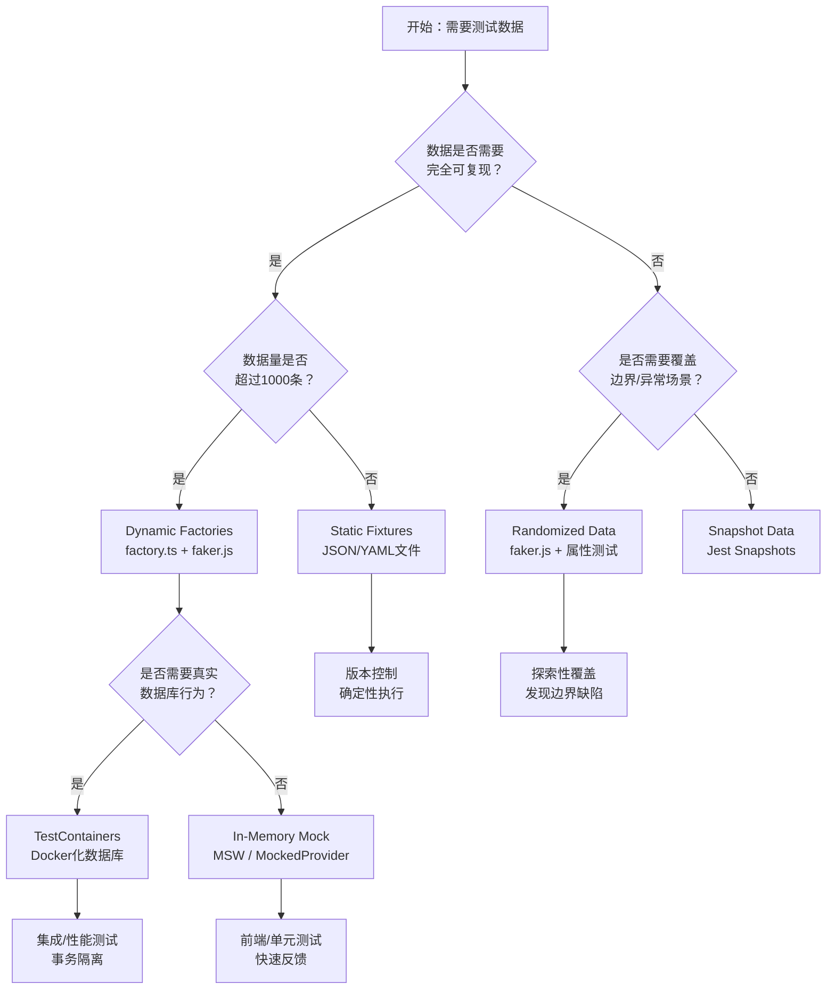
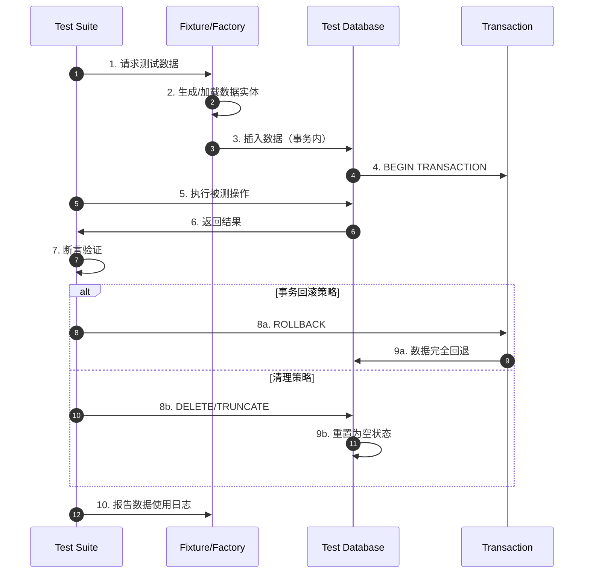

# 测试数据管理：fixtures与factories

测试数据是软件测试中最容易被低估却又最关键的要素之一。无论测试框架多么先进、覆盖率多么高，如果输入数据不能真实反映生产环境的分布特征、边界条件和异常模式，测试结果的可信度都将大打折扣。在JavaScript/TypeScript生态中，从简单的JSON fixtures到基于工厂模式的动态数据生成，从内存中的Mock对象到Docker化的真实数据库实例，测试数据管理已经发展成为一个具有独立理论体系和工程实践的专门领域。

## 引言

测试数据管理的复杂性源于一个根本张力：测试既需要确定性（相同的输入应当产生相同的输出），又需要代表性（数据应当覆盖真实场景的多样性）。静态的JSON文件提供了完美的确定性，但难以表达实体间的关联关系和动态约束；随机的数据生成能够覆盖更广阔的输入空间，却可能引入不可复现的" flaky test"。

在微服务和前后端分离的架构中，测试数据管理进一步分化出多个维度：前端组件测试需要隔离的Mock数据，API集成测试需要结构化的HTTP响应，数据库层测试需要关系完整的行记录，端到端测试需要贯穿多系统的业务实体。如何在这些场景之间建立一致的数据语义，同时保持各层测试的独立性，是测试数据管理要解决的核心问题。

本文从测试数据的形式化分类出发，建立Static Fixtures、Dynamic Factories、Randomized Data和Snapshot Data的理论框架，阐述测试数据隔离的数学基础，并系统映射到JavaScript/TypeScript生态中的工程实现——从faker.js的随机生成到factory.ts的类型安全工厂，从Prisma Seed的确定性填充到TestContainers的数据库容器化，从MSW的HTTP Mock到Apollo Client的GraphQL Mock，以及大数据量性能测试和GDPR合规脱敏的工程策略。

## 理论严格表述

### 测试数据的形式化分类

设被测系统的输入空间为 \( \mathcal{I} \)，状态空间为 \( \mathcal{S} \)。测试数据 \( d \) 可以定义为影响被测系统行为的所有外部输入和内部状态的集合 \( d \subseteq \mathcal{I} \times \mathcal{S} \)。根据数据的生成方式和管理特征，我们将测试数据划分为四个互有交叉的类别。

**定义 14.1（Static Fixtures）**：静态固件是预先定义、持久存储的测试数据集。形式上，Static Fixture \( F_{static} \) 是一个有限集合：

$$F_{static} = \{ (i_1, s_1), (i_2, s_2), \ldots, (i_n, s_n) \}$$

其中每个元素在测试执行前即已确定，不随运行环境或随机种子变化。Static Fixtures的典型表现形式是JSON、YAML或SQL文件，例如 `users.json` 包含三条预定义的用户记录。其优势在于完全确定、版本可控、易于审计；其局限在于规模固定、难以表达动态约束（如外键关联的自动生成）和组合爆炸（多实体关联时fixture数量呈指数增长）。

**定义 14.2（Dynamic Factories）**：动态工厂是基于生成规则在运行时构造测试数据的机制。形式上，Factory \( \mathcal{F} \) 是一个从参数空间 \( \Theta \) 到数据空间 \( \mathcal{D} \) 的映射：

$$\mathcal{F}: \Theta \rightarrow \mathcal{D}, \quad \mathcal{F}(\theta) = d$$

给定参数 \( \theta \)（如 `{ role: 'admin', active: true }`），工厂函数 \( \mathcal{F} \) 生成对应的数据实体 \( d \)。Dynamic Factories支持默认值、序列生成、关联创建和覆写（override），能够用少量工厂定义表达大量测试场景。Factory Bot（Ruby生态）是该模式的经典实现，其在JavaScript中的映射包括factory.ts、rosie等库。

**定义 14.3（Randomized Data）**：随机化数据是通过伪随机数生成器（PRNG）从概率分布中采样的测试数据。形式上，Randomized Data Generator \( \mathcal{G} \) 定义为一个概率空间 \((\Omega, \mathcal{A}, P)\)，其中 \( \Omega \subseteq \mathcal{D} \)，生成过程等价于从 \( P \) 中采样：

$$d \sim P(\mathcal{D})$$

通过控制随机种子（seed），Randomized Data可以在"伪确定性"和"高覆盖性"之间取得平衡：固定种子时，序列可完全复现；更换种子时，可探索不同的输入子空间。faker.js是该模式在JS生态中的代表实现，它通过区域化（locale）和模块化（module）提供了丰富的结构化随机数据。

**定义 14.4（Snapshot Data）**：快照数据是系统运行过程中捕获的输入-输出对，用于回归测试。形式上，Snapshot \( S \) 是一个元组 \( (i, o, t) \)，其中 \( i \in \mathcal{I} \) 为输入，\( o \) 为被测系统在时间 \( t \) 产生的输出。快照测试通过比较当前输出 \( o' \) 与存储的快照 \( o \) 来检测非预期变更：

$$\text{Snapshot Pass} \iff o' = o$$

Jest的 `toMatchSnapshot()` 和 `toMatchInlineSnapshot()` 是该模式的主流实现。Snapshot Data本质上是一种"以录制代替手写"的fixture策略，适用于输出结构复杂且手写成本高的场景（如AST转换器、编译器输出、大型JSON API响应）。

### 测试数据的隔离理论

测试数据隔离是确保测试可复现性和独立性的基石。形式化地，设测试套件 \( T = \{ t_1, t_2, \ldots, t_n \} \)，每个测试 \( t_i \) 的执行可以建模为状态转换函数：

$$t_i: S \rightarrow S', \quad S' = t_i(S)$$

**定义 14.5（测试隔离）**：测试套件 \( T \) 满足隔离性，当且仅当对于任意排列 \( \sigma \in \text{Sym}(n) \)，执行序列产生的结果集合相同：

$$\forall \sigma, \quad \{ t_{\sigma(1)} \circ t_{\sigma(2)} \circ \cdots \circ t_{\sigma(n)}(S_0) \} = \text{const}$$

隔离性要求每个测试 \( t_i \) 的执行不依赖于其他测试产生的状态副作用。在实践中，这意味着每个测试应当拥有独立的数据集，或者所有测试共享的数据集在执行间被完全重置。

测试数据隔离的工程策略包括：

- **事务回滚（Transaction Rollback）**：每个测试在数据库事务中运行，测试结束后回滚事务。形式化地，\( t_i \) 的执行被包裹在 \( \text{BEGIN} \ldots \text{ROLLBACK} \) 中，确保 \( S' = S \)。这是最高效的隔离策略，但不适用于测试事务逻辑本身或涉及非事务性资源（如消息队列）的场景。
- **数据库清理（Database Truncation）**：每个测试结束后删除所有数据表中的记录。形式化地，执行清理函数 \( \text{Clean}(S) \rightarrow S_0 \)。该策略最彻底，但执行成本较高，适用于集成测试和端到端测试。
- **fixture 作用域（Fixture Scoping）**：将fixture绑定到特定的测试作用域（function、class、module、session），在作用域结束时自动清理。pytest的fixture scoping和Vitest的 `beforeAll`/`afterAll` 钩子是该策略的体现。
- **唯一性命名空间（Unique Namespace）**：为每个测试分配唯一的数据命名空间（如带有UUID前缀的数据库schema、隔离的Redis数据库编号），从根本上避免数据冲突。

### 确定性测试 vs 随机化测试的权衡

确定性测试（Deterministic Testing）要求对于相同的输入和初始状态，测试总是产生相同的结果。形式化地：

$$\forall S, i, \quad t(S, i) \rightarrow \text{Pass} \lor t(S, i) \rightarrow \text{Fail} \quad \text{(consistent)}$$

随机化测试则有意引入可控的随机性，以探索更大的输入空间：

$$d \sim P(\mathcal{D}), \quad t(S, d) \rightarrow \{\text{Pass}, \text{Fail}\}$$

两种策略各有其理论适用范围：

**确定性测试的适用域**：

- 回归测试：验证已知功能在代码变更后仍然正确；
- 边界值分析：验证系统在明确定义的边界条件（如数组空、单元素、满容量）下的行为；
- 并发安全测试：需要精确控制执行交错（interleaving），随机性会破坏重现能力。

**随机化测试的适用域**：

- 模糊测试（Fuzzing）：通过随机输入发现未知缺陷；
- 属性测试（Property-Based Testing）：验证不变量（invariant）对于大量随机输入成立；
- 负载测试：模拟真实用户行为的随机分布。

在实践中，混合策略往往最为有效：使用fixtures和factories提供确定性的基础数据集，覆盖核心业务场景和边界条件；在专门的属性测试或模糊测试套件中引入随机化数据，探索边缘情况。关键在于为随机化测试建立"可复现的失败"机制——当随机测试失败时，必须能够记录并回放导致失败的精确输入序列。

### 测试数据与生产数据的去标识化

当测试数据来源于生产环境的脱敏副本时，必须解决隐私合规问题。欧盟GDPR、美国HIPAA和中国《个人信息保护法》均对非生产环境使用个人数据施加了严格限制。

**定义 14.6（Pseudonymization）**：假名化是指以这样的方式处理个人数据：在没有额外信息的情况下，该数据不再能够归属于特定数据主体。形式上，设原始数据集为 \( D_{orig} \)，标识符字段为 \( id \)。假名化函数 \( \phi \) 将 \( id \) 映射为伪标识符 \( pid \)：

$$\phi: id \rightarrow pid, \quad \text{where} \quad \phi^{-1}(pid) = id \quad \text{requires secret key } k$$

去标识化策略的技术层次包括：

1. **掩码（Masking）**：将敏感字段替换为固定模式，如将手机号 `13800138000` 替换为 `138****8000`；
2. **随机替换（Random Substitution）**：从 faker.js 生成的同分布数据中随机选取替换值；
3. **加密假名化（Encrypted Pseudonymization）**：使用确定性加密（如AES-SIV）保留数据关联性，但移除可识别性；
4. **差分隐私（Differential Privacy）**：在聚合统计数据中添加校准噪声，确保个体记录的隐私损失有上界。

在工程实践中，测试数据去标识化应遵循"最小够用"原则：只复制测试必需的表和字段，在数据流出生产环境前完成脱敏，并对脱敏流程本身进行审计日志记录。

## 工程实践映射

### Factory Bot 模式在 JS 中的实现

Factory Bot模式通过定义可复用的"蓝图"（blueprint）来生成测试实体，支持默认值、关联创建、序列生成和trait组合。在TypeScript生态中，`factory.ts` 和 `rosie` 是该模式的两个主要实现。

**factory.ts 的类型安全工厂**：

```typescript
import * as Factory from 'factory.ts';
import { faker } from '@faker-js/faker/locale/zh_CN';

interface User {
  id: string;
  email: string;
  name: string;
  role: 'admin' | 'editor' | 'viewer';
  createdAt: Date;
  profile?: Profile;
}

interface Profile {
  avatar: string;
  bio: string;
}

// 定义基础工厂
const profileFactory = Factory.Sync.makeFactory<Profile>({
  avatar: Factory.each(() => faker.image.avatar()),
  bio: Factory.each(() => faker.lorem.paragraph()),
});

const userFactory = Factory.Sync.makeFactory<User>({
  id: Factory.each(() => faker.string.uuid()),
  email: Factory.each(() => faker.internet.email()),
  name: Factory.each(() => faker.person.fullName()),
  role: 'viewer',
  createdAt: Factory.each(() => faker.date.past()),
  profile: Factory.each(() => profileFactory.build()),
});

// 生成单个实体
const user = userFactory.build();

// 覆写特定字段
const admin = userFactory.build({ role: 'admin' });

// 批量生成
const users = userFactory.buildList(10);

// 使用trait组合
const userWithAvatar = userFactory.build({
  profile: profileFactory.build({ avatar: 'https://example.com/avatar.png' }),
});
```

`factory.ts` 的核心优势在于原生TypeScript类型支持：`makeFactory<User>` 确保工厂定义与接口完全对齐，编译器会在字段缺失或类型不匹配时即时报错。`Factory.each` 提供了每次生成时的惰性求值（lazy evaluation），确保同一工厂的多次调用产生不同的随机值。

**faker.js 的区域化与模块化**：

`@faker-js/faker` 是faker.js的社区维护分支，提供了模块化的数据生成器和多区域支持：

```typescript
import { faker } from '@faker-js/faker';

// 切换区域以生成本地化数据
const zhFaker = faker.withLocale('zh_CN');
const usFaker = faker.withLocale('en_US');

// 模块化调用
faker.finance.iban();      // 国际银行账号
faker.location.nearbyGPSCoordinate(); // GPS坐标
faker.git.commitSha();     // Git commit SHA
faker.database.mongodbObjectId(); // MongoDB ObjectId
faker.helpers.multiple(() => faker.person.firstName(), { count: 5 });
```

faker.js的模块化设计允许测试只引入所需的数据生成器，减少bundle体积。其seed机制支持可复现的随机序列：

```typescript
faker.seed(12345);
const name1 = faker.person.fullName(); // 总是产生相同结果
faker.seed(12345);
const name2 = faker.person.fullName(); // name1 === name2
```

这一特性使得基于faker的测试在失败时能够通过相同的seed精确复现问题输入。

### Seeding 数据库

数据库seed是集成测试和端到端测试的基础准备步骤。其目标是在测试执行前将数据库填充到已知的初始状态，为测试提供一致的起点。

**Prisma Seed**：

Prisma ORM通过 `prisma/seed.ts`（或 `.js`）和 `package.json` 中的 `prisma.seed` 字段提供原生支持：

```typescript
// prisma/seed.ts
import { PrismaClient } from '@prisma/client';
import { faker } from '@faker-js/faker';

const prisma = new PrismaClient();

async function main() {
  // 清理旧数据（确定性顺序避免外键冲突）
  await prisma.comment.deleteMany();
  await prisma.post.deleteMany();
  await prisma.user.deleteMany();

  // 创建基础用户
  const alice = await prisma.user.create({
    data: {
      email: 'alice@example.com',
      name: 'Alice Chen',
      posts: {
        create: Array.from({ length: 5 }).map(() => ({
          title: faker.lorem.sentence(),
          content: faker.lorem.paragraphs(3),
          published: faker.datatype.boolean(),
        })),
      },
    },
  });

  const bob = await prisma.user.create({
    data: {
      email: 'bob@example.com',
      name: 'Bob Wang',
      posts: {
        create: [
          { title: 'Draft Post', content: '...', published: false },
          { title: 'Published Post', content: '...', published: true },
        ],
      },
    },
  });

  console.log(`Seeded ${await prisma.user.count()} users`);
}

main()
  .catch((e) => { console.error(e); process.exit(1); })
  .finally(async () => { await prisma.$disconnect(); });
```

通过 `package.json` 配置：

```json
{
  "prisma": {
    "seed": "tsx prisma/seed.ts"
  }
}
```

执行 `npx prisma db seed` 即可运行seed脚本。Prisma Seed通常与测试setup钩子结合，在每个测试文件或测试套件运行前执行。

**Drizzle Seed**：

Drizzle ORM通过 `drizzle-seed` 包提供声明式的seed支持：

```typescript
import { seed } from 'drizzle-seed';
import { db } from './db';
import * as schema from './schema';

await seed(db, schema).refine((f) => ({
  users: {
    count: 100,
    columns: {
      email: f.email(),
      name: f.fullName(),
      role: f.valuesFromArray({ values: ['admin', 'editor', 'viewer'] }),
      createdAt: f.date({ minDate: '2020-01-01', maxDate: '2024-12-31' }),
    },
  },
  posts: {
    count: 500,
    columns: {
      title: f.loremIpsum({ sentencesCount: 1 }),
      content: f.loremIpsum({ sentencesCount: 10 }),
      published: f.boolean(),
    },
  },
}));
```

Drizzle Seed的优势在于完全声明式：开发者只需描述"需要多少条、什么分布的数据"，框架自动处理外键关联和批量插入优化。

### 测试数据库的 Docker 化（TestContainers）

TestContainers 是一个支持多种语言的库，能够在测试期间自动拉取、启动和管理Docker容器。对于需要真实数据库（PostgreSQL、MySQL、MongoDB、Redis等）的测试，TestContainers 提供了比内存数据库（如SQLite）或Mock对象更高的保真度。

```typescript
import { PostgreSqlContainer } from '@testcontainers/postgresql';
import { Client } from 'pg';
import { execSync } from 'child_process';

describe('Order Repository Integration Tests', () => {
  let container: PostgreSqlContainer;
  let client: Client;

  beforeAll(async () => {
    container = await new PostgreSqlContainer('postgres:16-alpine')
      .withDatabase('test_db')
      .withUsername('test')
      .withPassword('test')
      .start();

    const connectionString = container.getConnectionUri();
    client = new Client({ connectionString });
    await client.connect();

    // 运行迁移
    process.env.DATABASE_URL = connectionString;
    execSync('npx prisma migrate deploy', { stdio: 'inherit' });

    // 运行seed
    execSync('npx prisma db seed', { stdio: 'inherit' });
  }, 60000);

  afterAll(async () => {
    await client.end();
    await container.stop();
  });

  it('should find orders by user id', async () => {
    const result = await client.query(
      'SELECT * FROM orders WHERE user_id = $1',
      ['user-123']
    );
    expect(result.rows).toHaveLength(3);
  });
});
```

TestContainers 的核心价值在于：

- **环境一致性**：测试在本地、CI服务器和同事的机器上运行完全相同的PostgreSQL版本和配置；
- **并行安全**：每个测试进程启动独立的容器实例，从根本上避免端口冲突和数据污染；
- **资源自动回收**：通过 `afterAll` 中的 `container.stop()` 确保容器在测试结束后被销毁，避免资源泄漏。

在CI环境中，TestContainers 依赖Docker-in-Docker（DinD）或Docker socket挂载。GitHub Actions、GitLab CI和CircleCI均提供了对TestContainers的原生支持。

### Mock 数据生成（Mock Service Worker）

Mock Service Worker（MSW）通过拦截HTTP请求（在浏览器中使用Service Worker，在Node.js中使用 `xmlhttprequest`/`fetch` 的polyfill拦截）来提供Mock响应。MSW的handler不仅是测试工具，更是API契约的前端表达。

```typescript
// mocks/handlers.ts
import { http, HttpResponse, graphql } from 'msw';

export const handlers = [
  // REST API Mock
  http.get('/api/users/:id', ({ params }) => {
    return HttpResponse.json({
      id: params.id,
      name: 'Alice Chen',
      email: 'alice@example.com',
      role: 'admin',
      createdAt: '2024-01-15T08:30:00Z',
    });
  }),

  http.post('/api/orders', async ({ request }) => {
    const body = await request.json();
    return HttpResponse.json(
      {
        id: 'order-' + Math.random().toString(36).slice(2),
        items: body.items,
        total: body.items.reduce((sum, item) => sum + item.price * item.qty, 0),
        status: 'pending',
      },
      { status: 201 }
    );
  }),

  // GraphQL Mock
  graphql.query('GetUser', ({ variables }) => {
    return HttpResponse.json({
      data: {
        user: {
          id: variables.id,
          name: 'Alice Chen',
          posts: [
            { id: 'p1', title: 'Hello World' },
            { id: 'p2', title: 'Testing Patterns' },
          ],
        },
      },
    });
  }),
];
```

在测试setup中启用MSW：

```typescript
// vitest.setup.ts
import { setupServer } from 'msw/node';
import { handlers } from './mocks/handlers';

const server = setupServer(...handlers);

beforeAll(() => server.listen({ onUnhandledRequest: 'warn' }));
afterEach(() => server.resetHandlers());
afterAll(() => server.close());
```

MSW的 `setupServer` 在Node.js环境中建立请求拦截层。`resetHandlers` 在每个测试后恢复handler到初始状态，确保测试间互不干扰。对于需要动态响应的测试，可以在单个测试中临时覆盖handler：

```typescript
it('handles network error', async () => {
  server.use(
    http.get('/api/users/:id', () => {
      return new HttpResponse(null, { status: 500 });
    })
  );

  await expect(fetchUser('123')).rejects.toThrow('Network error');
});
```

### GraphQL Mock 数据

GraphQL的强类型Schema为Mock数据生成提供了结构化基础。Apollo Client的 `MockedProvider` 和MSW的GraphQL handler是两种主要的GraphQL Mock策略。

**Apollo Client MockedProvider**：

```typescript
import { MockedProvider } from '@apollo/client/testing';
import { render, screen } from '@testing-library/react';
import { GET_USER, UserProfile } from './UserProfile';

const mocks = [
  {
    request: {
      query: GET_USER,
      variables: { id: 'user-1' },
    },
    result: {
      data: {
        user: {
          id: 'user-1',
          name: 'Alice Chen',
          email: 'alice@example.com',
          posts: {
            edges: [
              { node: { id: 'p1', title: 'First Post' } },
              { node: { id: 'p2', title: 'Second Post' } },
            ],
            pageInfo: { hasNextPage: false, endCursor: 'cursor-2' },
          },
        },
      },
    },
  },
  {
    request: {
      query: GET_USER,
      variables: { id: 'user-error' },
    },
    error: new Error('Failed to fetch user'),
  },
];

it('renders user profile', async () => {
  render(
    <MockedProvider mocks={mocks} addTypename={false}>
      <UserProfile userId="user-1" />
    </MockedProvider>
  );

  expect(await screen.findByText('Alice Chen')).toBeInTheDocument();
});
```

`MockedProvider` 拦截Apollo Client的链路层，根据请求匹配预定义的响应。`addTypename={false}` 用于简化Mock数据，避免手动添加 `__typename` 字段。

**MSW GraphQL handler**：

对于不依赖Apollo Client或需要服务端渲染（SSR）测试的场景，MSW的GraphQL handler提供了更通用的方案：

```typescript
import { graphql } from 'msw';

const api = graphql.link('https://api.example.com/graphql');

export const handlers = [
  api.query('GetUser', ({ variables }) => {
    if (variables.id === 'user-error') {
      return HttpResponse.json({
        errors: [{ message: 'User not found', extensions: { code: 'NOT_FOUND' } }],
      });
    }
    return HttpResponse.json({
      data: {
        user: {
          id: variables.id,
          name: faker.person.fullName(),
          email: faker.internet.email(),
        },
      },
    });
  }),

  api.mutation('CreatePost', async ({ request }) => {
    const { input } = await request.json();
    return HttpResponse.json({
      data: {
        createPost: {
          id: faker.string.uuid(),
          title: input.title,
          slug: input.title.toLowerCase().replace(/\s+/g, '-'),
          createdAt: new Date().toISOString(),
        },
      },
    });
  }),
];
```

MSW的GraphQL handler不依赖特定客户端库，可以在React、Vue、Angular以及Node.js服务端测试中统一使用，实现前后端Mock策略的一致性。

### 大数据量的性能测试数据生成

性能测试需要的数据量通常远超功能测试——从数千条到数亿条不等。生成如此规模的数据需要专门的工程策略：

**批量插入优化**：

```typescript
// 使用PostgreSQL的COPY协议进行高速批量导入
import { from as copyFrom } from 'pg-copy-streams';
import { Readable } from 'stream';

async function bulkInsertUsers(count: number) {
  const stream = client.query(
    copyFrom('COPY users (id, email, name, created_at) FROM STDIN WITH CSV')
  );

  const source = new Readable({
    read() {
      for (let i = 0; i < count; i++) {
        const line = `${faker.string.uuid()},${faker.internet.email()},${faker.person.fullName()},${faker.date.past().toISOString()}\n`;
        this.push(line);
      }
      this.push(null);
    },
  });

  await new Promise((resolve, reject) => {
    source.pipe(stream).on('finish', resolve).on('error', reject);
  });
}
```

**多进程并行生成**：

```typescript
// 使用Node.js worker_threads并行生成数据
import { Worker, isMainThread, parentPort, workerData } from 'worker_threads';
import { createWriteStream } from 'fs';

if (isMainThread) {
  const workers = [];
  const totalRecords = 10_000_000;
  const workerCount = 8;
  const perWorker = Math.ceil(totalRecords / workerCount);

  for (let i = 0; i < workerCount; i++) {
    workers.push(
      new Worker(__filename, {
        workerData: { start: i * perWorker, count: perWorker, fileId: i },
      })
    );
  }

  await Promise.all(workers.map((w) => new Promise((r) => w.on('exit', r))));
} else {
  const { start, count, fileId } = workerData;
  const stream = createWriteStream(`users-${fileId}.csv`);

  for (let i = 0; i < count; i++) {
    const record = `${start + i},${faker.internet.email()},${faker.person.fullName()}\n`;
    stream.write(record);
  }

  stream.end();
  parentPort?.postMessage('done');
}
```

**引用完整性处理**：对于需要外键关联的大规模数据集，建议采用分层生成策略：先生成基础维度表（如用户、商品），再按比例生成事实表（如订单、评论），通过预先生成的ID池确保引用完整性。

### GDPR 合规的测试数据脱敏

在非生产环境使用生产数据时，必须实施系统化的脱敏流程。以下是一个基于TypeScript的脱敏流水线示例：

```typescript
import { faker } from '@faker-js/faker';
import { createHash } from 'crypto';

interface AnonymizationRule {
  column: string;
  strategy: 'mask' | 'hash' | 'fake' | 'nullify' | 'shuffle';
  options?: Record<string, unknown>;
}

const rules: AnonymizationRule[] = [
  { column: 'email', strategy: 'hash', options: { salt: process.env.HASH_SALT } },
  { column: 'phone', strategy: 'mask', options: { visible: 4 } },
  { column: 'name', strategy: 'fake', options: { generator: 'fullName' } },
  { column: 'ssn', strategy: 'nullify' },
  { column: 'address', strategy: 'fake', options: { generator: 'streetAddress' } },
];

function anonymize(value: string, rule: AnonymizationRule): string | null {
  switch (rule.strategy) {
    case 'mask':
      const visible = (rule.options?.visible as number) ?? 2;
      return value.slice(0, visible) + '*'.repeat(Math.max(0, value.length - visible));
    case 'hash':
      const salt = (rule.options?.salt as string) ?? '';
      return createHash('sha256').update(value + salt).digest('hex').slice(0, 16);
    case 'fake':
      const gen = rule.options?.generator as string;
      return faker.person[gen]?.() ?? faker.lorem.word();
    case 'nullify':
      return null;
    case 'shuffle':
      return value.split('').sort(() => Math.random() - 0.5).join('');
    default:
      return value;
  }
}

// 流式处理大型数据集
async function anonymizeTable(table: string, rules: AnonymizationRule[]) {
  const columns = await db.query(`SELECT * FROM ${table} LIMIT 0`).then(r => r.fields.map(f => f.name));
  const batchSize = 1000;
  let offset = 0;

  while (true) {
    const rows = await db.query(`SELECT * FROM ${table} ORDER BY id LIMIT ${batchSize} OFFSET ${offset}`);
    if (rows.length === 0) break;

    for (const row of rows) {
      const updates: string[] = [];
      for (const rule of rules) {
        if (columns.includes(rule.column)) {
          const newValue = anonymize(row[rule.column], rule);
          updates.push(`${rule.column} = ${newValue === null ? 'NULL' : `'${newValue}'`}`);
        }
      }
      if (updates.length > 0) {
        await db.query(`UPDATE ${table} SET ${updates.join(', ')} WHERE id = ${row.id}`);
      }
    }
    offset += batchSize;
  }
}
```

脱敏策略的选择应遵循以下原则：

- **不可逆性**：对于直接标识符（如身份证号、社保号），应采用哈希或置空策略，确保无法逆向还原；
- **统计保持**：对于分析型测试环境，脱敏后的数据应保持原始分布特征（如年龄分布、地域分布），可采用保持分布的替换策略；
- **关联保持**：外键关系和跨表关联应在脱敏后保持一致，避免破坏数据完整性；
- **审计追踪**：记录脱敏操作的执行者、时间戳和应用的规则集，满足合规审计要求。

## Mermaid 图表

### 图14-1：测试数据管理策略的决策矩阵



该决策树帮助团队根据测试场景的特征（确定性需求、数据规模、边界覆盖需求、数据库保真度需求）选择最合适的测试数据管理策略。值得注意的是，这些策略并非互斥，成熟的测试套件通常在不同层级组合使用多种策略。

### 图14-2：测试数据生命周期与隔离机制



该序列图展示了测试数据从生成到销毁的完整生命周期。事务回滚策略提供了最高效的隔离，但不适用于需要验证持久化副作用的场景；清理策略更通用但开销更大。在实践中，单元测试和集成测试通常优先使用事务回滚，而端到端测试由于涉及多个系统往往采用清理策略。

## 理论要点总结

1. **测试数据的四维分类**：Static Fixtures提供确定性和版本控制；Dynamic Factories提供可组合性和关联生成；Randomized Data提供覆盖性和边缘发现；Snapshot Data提供回归保护和手写成本降低。四者互补而非互斥。

2. **隔离性的数学基础**：测试隔离要求执行结果与测试顺序无关。事务回滚、数据库清理、fixture作用域和唯一命名空间是实现隔离的四种主要工程策略，各有其适用域和成本特征。

3. **确定性与随机性的辩证关系**：确定性测试保障回归可靠性，随机化测试发现未知缺陷。最佳实践是"确定性为主、随机性为辅"，并为随机测试建立seed回放机制确保失败可复现。

4. **工厂模式的形式化表达**：Factory \( \mathcal{F}: \Theta \rightarrow \mathcal{D} \) 将参数空间映射到数据空间，通过默认值、序列生成、关联创建和trait组合，用有限定义表达无限实例。

5. **容器化测试数据库的价值**：TestContainers通过Docker容器为每个测试进程提供独立的真实数据库实例，从根本上解决了并行测试的数据冲突问题，同时保持了与生产环境的一致性。

6. **隐私合规的技术实现**：Pseudonymization、掩码、哈希和差分隐私构成了测试数据脱敏的技术层次。脱敏流程应在数据离开生产环境前完成，并遵循最小够用、统计保持、关联保持和审计追踪四项原则。

## 参考资源

- Faker.js Community. *@faker-js/faker Documentation*. <https://fakerjs.dev> —— faker.js官方文档，涵盖模块化API、区域化配置、seed控制和自定义生成器开发。
- thoughtbot. *Factory Bot Documentation*. <https://github.com/thoughtbot/factory_bot> —— Factory Bot（Ruby）的官方文档，是工厂模式在测试数据生成中的经典实现，其设计理念深刻影响了JS生态的factory.ts等库。
- TestContainers. *TestContainers for Node.js Documentation*. <https://node.testcontainers.org> —— TestContainers Node.js版本的官方文档，包括各种数据库模块、Docker Compose支持和CI配置指南。
- Mock Service Worker. *MSW Documentation*. <https://mswjs.io> —— MSW官方文档，涵盖REST和GraphQL handler、浏览器与Node.js运行时适配、生命周期管理和高级拦截模式。
- Kent C. Dodds. *"Stop Mocking, Start Testing"*. EpicReact.dev, 2021 —— Dodds关于测试数据策略的经典论述，主张使用MSW替代ad-hoc的Mock函数，以更接近真实用户交互的方式组织测试数据。
- Mozilla MDN Web Docs. *"Test Your Skills: Data Management"*. <https://developer.mozilla.org> —— MDN关于Web应用测试数据最佳实践的指南，涵盖前端组件测试中的数据隔离和Mock策略。
