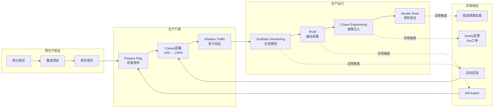
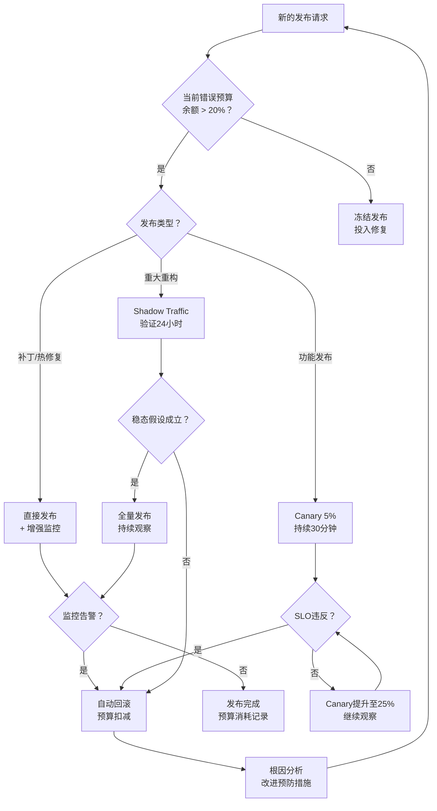

# 生产环境测试：混沌与可观测性

传统的软件测试范式隐含着一个根本假设：测试应当在生产环境之外进行，通过模拟和近似来推断系统在生产环境中的行为。然而，随着分布式系统规模的扩大和故障模式的复杂化，这一假设的可靠性日益受到挑战。无论测试环境多么精致，它都无法完全复制生产环境的流量特征、网络拓扑、硬件故障模式和用户行为的全部多样性。生产环境测试（Testing in Production）不是对传统测试的否定，而是对其必要补充——它将验证的边界从"近似环境"推向"真实环境"，在可控风险下获取关于系统真实行为的最后一块拼图。

## 引言

生产环境测试的核心理念可以追溯到一个朴素的认知论命题：对于足够复杂的系统，仿真与真实之间存在不可消除的鸿沟。形式化地，设测试环境为 \( E_{test} \)，生产环境为 \( E_{prod} \)，被测系统为 \( S \)。由于 \( E_{test} \neq E_{prod} \)，测试套件 \( T \) 在测试环境中的通过并不能逻辑蕴涵其在生产环境中的正确性：

$$T(E_{test}, S) = \text{Pass} \nRightarrow T(E_{prod}, S) = \text{Pass}$$

这一不可蕴涵性在微服务架构中尤为显著：网络延迟的分布、服务实例的负载差异、依赖服务的瞬时故障、第三方API的行为漂移——这些因素在测试环境中要么被忽略，要么被过度简化。生产环境测试通过在真实流量、真实基础设施和真实故障模式下进行受控验证，直接弥补这一逻辑缺口。

当然，"在生产环境中测试"绝不意味着鲁莽地破坏用户服务。现代生产环境测试建立在三个工程支柱之上：一是**隔离机制**（如Feature Flag、Shadow Traffic），将测试影响限制在可控范围内；二是**可观测性**（Observability），提供对系统内部状态的实时洞察；三是**自动回滚**（Auto-Rollback），在检测到异常时立即恢复。本文将系统阐述生产环境测试的理论分类、故障注入的形式化模型，并深入映射到Feature Flag、Canary部署、混沌工程、Synthetic Monitoring和RUM的完整工程实践。

## 理论严格表述

### 生产环境测试的形式化分类

生产环境测试按照其隔离机制、风险暴露面和验证目标，可以划分为四个主要类别。

**定义 15.1（Canary Deployment）**：金丝雀部署是一种渐进式发布策略，将新版本的服务实例逐步引入生产流量，同时保持旧版本实例运行。形式上，设服务总流量为 \( \Lambda \)，Canary实例承载的流量比例为 \( \alpha \in [0, 1] \)。Canary部署验证的是：在流量分配 \( \alpha \) 下，新版本 \( S_{new} \) 的关键性能指标（KPI）满足可靠性约束 \( \mathcal{R} \)：

$$\forall \alpha \in (0, \alpha_{max}], \quad \text{KPI}(\alpha \cdot \Lambda \rightarrow S_{new}) \models \mathcal{R}$$

Canary部署的验证是递增的：初始 \( \alpha \) 可能仅为 1% 或 5%，在监控指标确认无异常后逐步提升至 100%。若在任何阶段 \( \mathcal{R} \) 被违反，流量立即回切至旧版本 \( S_{old} \)。

**定义 15.2（A/B Testing）**：A/B测试是一种受控实验方法，将用户流量随机分配到两个或多个变体（Variant），通过统计假设检验评估各变体对业务指标的影响。形式上，设用户集合为 \( U \)，分流函数 \( f: U \rightarrow \{A, B\} \) 将用户映射到变体。A/B测试的核心是检验零假设 \( H_0: \mu_A = \mu_B \)，其中 \( \mu \) 为某业务指标（如转化率、留存率）的期望值。若p值低于显著性水平 \( \alpha \)（通常为0.05），则拒绝 \( H_0 \)，认为变体间存在显著差异。

与Canary部署关注系统可靠性不同，A/B测试关注业务效果。两者可以组合使用：Canary验证"新版本是否不会崩溃"，A/B测试验证"新版本是否提升了业务指标"。

**定义 15.3（Shadow Traffic）**：影子流量（也称为Dark Launch或Traffic Mirroring）是将生产请求复制并异步发送到新版本服务，但不对用户返回新版本的响应。形式上，设用户请求为 \( r \)，影子请求为 \( r' = \text{copy}(r) \)。用户感知的响应始终来自旧版本：

$$\text{Response}_{user} = S_{old}(r)$$

同时，系统内部收集新版本的响应和行为指标：

$$\text{Metrics}_{shadow} = \text{observe}(S_{new}(r'))$$

Shadow Traffic的优势在于零用户影响——即使 \( S_{new} \) 崩溃或返回错误，用户请求也不受干扰。其局限在于只能验证"无状态"响应的正确性（因为无法影响用户），且需要处理副作用的隔离（如避免影子请求重复写入数据库）。

**定义 15.4（Chaos Engineering）**：混沌工程是通过在生产环境中主动注入故障来验证系统韧性的学科。形式上，设系统的正常状态空间为 \( \mathcal{N} \)，故障空间为 \( \mathcal{F} \)。混沌实验 \( \chi \) 是一个从 \( \mathcal{N} \) 到 \( \mathcal{N} \cup \mathcal{F} \) 的转移：

$$\chi: \mathcal{N} \rightarrow \mathcal{N} \cup \mathcal{F}$$

混沌工程的"稳态假设"（Steady State Hypothesis）认为：系统在正常条件下可观测到的稳定行为模式，在引入故障后应当继续保持（可能在降级模式下）。形式化地，设稳态指标为 \( M \)，则混沌实验验证：

$$\forall f \in \mathcal{F}_{selected}, \quad \text{observe}(\chi(S, f)) \models \mathcal{R}_{degraded}$$

其中 \( \mathcal{R}_{degraded} \) 是降级模式下的可靠性约束，通常比正常约束更宽松（如允许更高的延迟、更低的可用率），但仍保证核心功能的可用性。

### 可观测性驱动的测试（OAT）

可观测性驱动的自动化测试（Observability-driven Automated Testing, OAT）是一种新兴范式，它将生产环境的可观测性数据（日志、指标、追踪）直接作为测试断言的数据源。

**定义 15.5（可观测性三元组）**：可观测性由三个相互关联的数据维度构成，通常称为"三大支柱"（Three Pillars）：

- **指标（Metrics）**：时间序列上的聚合数值，如请求速率、错误率、延迟分布（p50/p95/p99）；
- **日志（Logs）**：离散的事件记录，包含时间戳、上下文和结构化Payload；
- **追踪（Traces）**：请求在分布式系统中的完整路径，由跨度（Span）构成的有向无环图。

OAT的核心思想是：传统的测试断言验证"给定输入X，输出应当为Y"，而OAT断言验证"在给定流量负载下，系统的可观测性指标应当满足约束Z"。形式化地：

$$\text{OAT Assert}: \quad \forall t \in [t_0, t_1], \quad M(S, t) \in \mathcal{R}_{metrics}$$

例如，一个OAT断言可能声明："在发布新版本后的30分钟内，HTTP 5xx错误率不得超过0.1%，p99延迟不得超过500ms"。

OAT与传统测试的关键差异在于其数据源和触发机制：

- **数据源**：OAT直接从生产环境的监控系统（如Prometheus、Datadog、Honeycomb）查询数据，而非在测试框架中构造输入和捕获输出；
- **触发机制**：OAT通常由部署事件（如新版本发布、配置变更）自动触发，而非由代码提交触发；
- **断言范围**：OAT断言覆盖系统的宏观行为（如"订单服务在故障注入期间的降级率"），而非单个函数的微观输出。

### 故障注入的理论模型

混沌工程的实践建立在形式化的故障模型之上。分布式系统中常见的故障类型可以按照其严重程度和可检测性进行分类。

**Fail-stop 故障**：进程在任意时刻停止执行，且不再发送任何消息。形式化地，进程 \( p \) 在时间 \( t \) 发生Fail-stop故障，意味着：

$$\forall t' > t, \quad \text{output}(p, t') = \emptyset$$

Fail-stop是最"诚实"的故障模式——其他进程可以明确检测到 \( p \) 的失效（如通过心跳超时）。服务实例崩溃、容器被强制终止都属于Fail-stop故障。

**Crash-recovery 故障**：进程在故障后停止执行，但在某个后续时间点重新启动。形式化地：

$$\exists t_{crash}, t_{recover}, \quad \text{output}(p, [t_{crash}, t_{recover})) = \emptyset \land \text{output}(p, t_{recover}) \neq \emptyset$$

Crash-recovery模型需要处理重启后的状态恢复问题：进程是恢复到持久化存储的最后状态，还是从头开始？其内存状态是否丢失？这些问题直接影响系统的韧性设计。

**Byzantine 故障**：进程继续执行并发送消息，但这些消息的内容可能是任意的、错误的或恶意的。形式化地：

$$\forall t, \quad \text{output}(p, t) \neq \emptyset \land \text{content}(\text{output}(p, t)) \notin \text{Valid Messages}$$

Byzantine故障是最难处理的故障模式，因为它不触发传统的超时检测机制。在Web应用中，Byzantine故障可能表现为：依赖服务返回格式正确但语义荒谬的响应（如用户余额突然变为负数）、第三方API返回过期的缓存数据、CDN节点返回被篡改的静态资源。

**网络分区（Network Partition）**：网络链路故障导致节点集合被划分为两个或多个互不连通的子集。形式化地，设节点集合为 \( V \)，边集合为 \( E \)。网络分区将图 \( G = (V, E) \) 划分为 \( G_1 = (V_1, E_1), G_2 = (V_2, E_2), \ldots \)，其中对于任意 \( u \in V_i, v \in V_j (i \neq j) \)，不存在路径 \( u \leadsto v \)。

网络分区与脑裂（Split-brain）现象密切相关：当分区两侧的服务实例都认为自己是"多数派"并继续接受写请求时，数据一致性将被破坏。混沌工程中的网络故障注入（如使用Linux tc命令模拟丢包、延迟和分区）是验证系统在分区环境下行为的有效手段。

### SRE 的错误预算与测试策略

Google的Site Reliability Engineering（SRE）方法论提出了"错误预算"（Error Budget）概念，为生产环境测试提供了量化决策框架。

**定义 15.6（服务水平目标与错误预算）**：设服务水平目标（SLO）为可用性百分比，如99.9%（"三个九"）。错误预算是 SLO 允许的反方向量：

$$\text{Error Budget} = 1 - \text{SLO} = 0.1\%$$

在一个30天的观测窗口中，若系统总请求数为 \( N \)，则允许的失败请求数为 \( 0.001 \times N \)。错误预算是一个消耗性资源：每次发布、每次实验、每次故障都会消耗一部分预算。

错误预算对测试策略的直接指导意义在于：

1. **预算充足时**：团队可以积极进行生产环境测试（如混沌实验、激进的Canary发布），因为即使发生故障，仍有预算空间吸收影响；
2. **预算紧张时**：团队应当冻结非必要的发布，推迟高风险的混沌实验，优先投入工程资源修复已知缺陷和加强预生产测试；
3. **预算耗尽时**：所有发布活动应当暂停，直到下一个观测窗口开启或团队通过紧急修复恢复预算余额。

这种"预算驱动"的决策模式将可靠性工程从感性判断（"这个变更感觉安全吗？"）转变为理性计算（"我们的预算允许这次发布吗？"），为生产环境测试的节奏和强度提供了客观依据。

## 工程实践映射

### Feature Flag 驱动的生产测试

Feature Flag（功能开关）是生产环境测试的基础设施。它允许团队将新功能代码部署到生产环境，但默认不对用户可见，通过动态配置逐步开放流量。

**LaunchDarkly**：

LaunchDarkly是企业级Feature Flag平台，支持精细的分流规则、A/B测试集成和实时配置变更：

```typescript
import { init as ldInit } from 'launchdarkly-node-server-sdk';

const client = ldInit(process.env.LD_SDK_KEY);
await client.waitForInitialization();

// 基础布尔开关
const showNewCheckout = await client.variation(
  'new-checkout-flow',
  { key: userId, email },
  false // 默认值
);

if (showNewCheckout) {
  return renderNewCheckout(cart);
} else {
  return renderLegacyCheckout(cart);
}
```

LaunchDarkly的高级功能包括：

- **基于属性的分流**：按用户地域、订阅等级、设备类型等属性定向开放功能；
- **渐进式发布**：自动将流量比例从0%提升到100%，支持自定义步长和每步的停留时间；
- **自动化实验**：内置A/B测试框架，自动计算关键指标的统计显著性；
- **紧急关闭（Kill Switch）**：一键回滚功能，在发现严重问题时瞬间将所有流量切回旧版本。

**Unleash（开源替代方案）**：

Unleash提供了可自托管的开源Feature Flag方案，适合对数据主权有要求的组织：

```typescript
import { startUnleash, getFeatureToggleDefinition } from 'unleash-client';

const unleash = await startUnleash({
  url: 'https://unleash.company.com/api/',
  customHeaders: { Authorization: process.env.UNLEASH_API_TOKEN },
  appName: 'order-service',
  environment: process.env.NODE_ENV,
});

// 使用variants支持多变量A/B测试
const variant = unleash.getVariant('checkout-redesign', {
  userId,
  sessionId,
});

if (variant.name === 'control') {
  return renderControl();
} else if (variant.name === 'variant-a') {
  return renderVariantA();
} else if (variant.name === 'variant-b') {
  return renderVariantB();
}
```

Unleash的strategy模型允许自定义分流策略（如基于cookie、IP地址、用户ID哈希等），并通过插件体系扩展功能。

**Flagsmith**：

Flagsmith是另一款开源Feature Flag平台，其核心差异化在于将Flag管理与远程配置（Remote Config）深度融合：

```typescript
import flagsmith from 'flagsmith';

await flagsmith.init({
  environmentID: 'your-env-id',
  identity: userId,
  traits: { subscription_tier: 'premium', region: 'ap-southeast-1' },
});

const checkoutConfig = flagsmith.getValue('checkout_config');
// checkoutConfig 可以是任意JSON对象，不仅是布尔值
```

Flagsmith的远程配置能力使团队能够在不部署代码的情况下调整功能参数（如搜索结果的每页条数、推荐算法的权重系数），为生产环境的动态调优提供了强大工具。

### Canary 部署与自动回滚

Canary部署的工程实现需要解决三个问题：流量分割、指标监控和自动决策。

**Argo Rollouts**：

Argo Rollouts是Kubernetes生态中Canary部署的事实标准工具，它通过自定义资源定义（CRD）扩展了Deployment的发布能力：

```yaml
apiVersion: argoproj.io/v1alpha1
kind: Rollout
metadata:
  name: order-service
spec:
  replicas: 10
  strategy:
    canary:
      canaryService: order-service-canary
      stableService: order-service-stable
      trafficRouting:
        nginx:
          stableIngress: order-service-ingress
          annotationPrefix: nginx.ingress.kubernetes.io
      steps:
        - setWeight: 10
        - pause: { duration: 10m }
        - analysis:
            templates:
              - templateName: success-rate
            args:
              - name: service-name
                value: order-service-canary
        - setWeight: 25
        - pause: { duration: 10m }
        - setWeight: 50
        - pause: { duration: 10m }
        - setWeight: 100
      analysis:
        successfulRunHistoryLimit: 3
        templates:
          - templateName: success-rate
---
apiVersion: argoproj.io/v1alpha1
kind: AnalysisTemplate
metadata:
  name: success-rate
spec:
  metrics:
    - name: success-rate
      interval: 1m
      count: 5
      successCondition: result[0] >= 0.99
      provider:
        prometheus:
          address: http://prometheus:9090
          query: |
            sum(rate(http_requests_total{service="{{args.service-name}}",status!~"5.."}[1m]))
            /
            sum(rate(http_requests_total{service="{{args.service-name}}"}[1m]))
```

上述配置定义了一个四阶段Canary发布：10% → 25% → 50% → 100%。在每个阶段，Argo Rollouts执行Prometheus查询验证HTTP成功率是否高于99%。若任何阶段的分析失败，Rollouts自动将流量回切至稳定版本，并标记发布失败。

**Spinnaker**：

Spinnaker是Netflix开源的多云持续交付平台，其Pipeline模型支持复杂的部署策略编排：

```json
{
  "stages": [
    {
      "type": "deploy",
      "name": "Deploy Canary",
      "clusters": [
        {
          "account": "k8s-prod",
          "application": "order-service",
          "strategy": "redblack",
          "traffic": 5
        }
      ]
    },
    {
      "type": "canary",
      "name": "Canary Analysis",
      "canaryConfig": {
        "lifetimeMinutes": 30,
        "canaryHealthCheckHandler": {
          "minimumCanaryResultScore": 75
        },
        "canarySuccessCriteria": {
          "canaryResultScore": 95
        }
      },
      "baseline": {
        "application": "order-service",
        "cluster": "order-service-stable"
      },
      "canary": {
        "application": "order-service",
        "cluster": "order-service-canary"
      }
    },
    {
      "type": "deploy",
      "name": "Deploy to Production",
      "clusters": [
        {
          "account": "k8s-prod",
          "application": "order-service",
          "strategy": "redblack",
          "traffic": 100
        }
      ],
      "restrictExecutionDuringTimeWindow": true,
      "restrictedExecutionWindow": {
        "days": [1, 2, 3, 4, 5],
        "whitelist": [{ "startHour": 9, "endHour": 17 }]
      }
    }
  ]
}
```

Spinnaker的Canary阶段通过比较基线（Baseline）和Canary实例的关键指标（延迟、错误率、CPU使用率等）生成综合得分。得分低于阈值时自动触发回滚，高于阈值时继续推进到全量部署阶段。

### 混沌工程工具

混沌工程工具按照其故障注入的层级和范围，可以分为基础设施层、平台层和应用层三类。

**Chaos Monkey**：

Chaos Monkey是Netflix开源的初代混沌工程工具，其核心思想极其简洁：在随机时间随机终止生产环境中的服务实例。虽然功能单一，但它开创了"在生产环境中主动制造故障以验证韧性"的先河。

```bash
# Chaos Monkey的基本配置（通过Simian Army框架）
chaos.monkey.enabled=true
chaos.monkey.probability=1.0
chaos.monkey.scheduler.interval=3600000
```

**Litmus**：

Litmus是CNCF孵化的云原生混沌工程平台，提供了丰富的Kubernetes原生故障实验：

```yaml
apiVersion: litmuschaos.io/v1alpha1
kind: ChaosEngine
metadata:
  name: pod-network-latency
spec:
  appinfo:
    appns: 'production'
    applabel: 'app=order-service'
    appkind: 'deployment'
  # 稳态假设：实验前订单服务的p95延迟应低于200ms
  experiments:
    - name: pod-network-latency
      spec:
        components:
          env:
            - name: TARGET_CONTAINER
              value: 'order-service'
            - name: NETWORK_INTERFACE
              value: 'eth0'
            - name: LIB_IMAGE
              value: 'litmuschaos/go-runner:latest'
            - name: TC_IMAGE
              value: 'gaiadocker/iproute2'
            - name: NETWORK_LATENCY
              value: '2000'
            - name: TOTAL_CHAOS_DURATION
              value: '60'
```

上述Litmus实验向 `order-service` 的Pod注入2000ms的网络延迟，持续60秒。实验期间，监控系统持续验证稳态假设（如p95延迟是否在可接受范围内）。若稳态被破坏，实验标记为失败，提示系统在网络延迟恶化时缺乏足够的韧性。

**Gremlin**：

Gremlin是企业级混沌工程平台（SaaS），提供了图形化的实验设计和执行界面，支持从CPU/内存/磁盘攻击到高级状态机故障的全谱系注入：

```typescript
import { Gremlin } from 'gremlin-sdk';

const gremlin = new Gremlin({ apiKey: process.env.GREMLIN_API_KEY });

// 定义CPU攻击实验
await gremlin.attacks.create({
  target: {
    type: 'Random',
    hosts: ['order-service-*'],
    percent: 25,
  },
  command: {
    type: 'cpu',
    args: ['-l', '80', '-d', '300'], // CPU负载80%，持续300秒
  },
});

// 定义依赖服务故障实验（Blackhole）
await gremlin.attacks.create({
  target: {
    type: 'Exact',
    hosts: ['order-service-prod-01'],
  },
  command: {
    type: 'blackhole',
    args: ['-p', 'tcp', '-h', 'payment-service', '-d', '180'],
  },
});
```

Gremlin的Blackhole攻击模拟了到 `payment-service` 的完全网络中断，验证 `order-service` 在支付服务不可达时的降级行为（如显示友好错误信息、启用本地缓存、触发补偿事务）。

### 生产环境的烟雾测试

烟雾测试（Smoke Tests）在生产环境部署后立即执行，验证系统的核心功能是否可用。与集成测试中的烟雾测试不同，生产烟雾测试针对的是真实环境、真实数据和真实依赖。

```typescript
// scripts/smoke-test.ts
import { expect } from 'vitest';

const BASE_URL = process.env.SMOKE_TEST_BASE_URL || 'https://api.example.com';

async function smokeTest() {
  console.log('Running production smoke tests...');

  // 测试1：健康检查端点
  const health = await fetch(`${BASE_URL}/health`);
  expect(health.status).toBe(200);
  const healthBody = await health.json();
  expect(healthBody.status).toBe('ok');
  expect(healthBody.dependencies.database).toBe('connected');

  // 测试2：核心业务流程 - 创建订单
  const orderRes = await fetch(`${BASE_URL}/orders`, {
    method: 'POST',
    headers: { 'Content-Type': 'application/json', Authorization: `Bearer ${process.env.SMOKE_TEST_TOKEN}` },
    body: JSON.stringify({
      items: [{ productId: 'smoke-test-product', quantity: 1 }],
      shippingAddress: { city: 'Test City', country: 'CN' },
    }),
  });
  expect(orderRes.status).toBe(201);
  const order = await orderRes.json();
  expect(order.id).toBeDefined();
  expect(order.status).toBe('pending');

  // 测试3：查询订单详情
  const getRes = await fetch(`${BASE_URL}/orders/${order.id}`, {
    headers: { Authorization: `Bearer ${process.env.SMOKE_TEST_TOKEN}` },
  });
  expect(getRes.status).toBe(200);

  // 测试4：关键读端点响应时间
  const start = Date.now();
  await fetch(`${BASE_URL}/products/featured`);
  const latency = Date.now() - start;
  expect(latency).toBeLessThan(1000);

  // 测试5：错误处理 - 请求不存在的资源
  const notFound = await fetch(`${BASE_URL}/orders/non-existent-id`);
  expect(notFound.status).toBe(404);

  console.log('All smoke tests passed ✅');
}

smokeTest().catch((err) => {
  console.error('Smoke test failed ❌', err);
  process.exit(1);
});
```

生产烟雾测试的设计原则：

- **只读优先**：优先测试读操作和创建后立即删除的写操作，避免污染生产数据；
- **专用测试数据**：使用独立的测试账号和隔离的测试实体（如带有 `smoke-test-` 前缀的记录），便于识别和清理；
- **快速失败**：烟雾测试应在5分钟内完成，任何失败立即触发告警和回滚；
- **非侵入性**：烟雾测试的流量不应显著影响生产系统的性能指标。

### Synthetic Monitoring

Synthetic Monitoring（综合监控）是通过模拟用户行为来持续验证系统可用性的技术。与真实用户监控（RUM）不同，Synthetic Monitoring使用预定义的脚本在固定间隔执行，提供可预测的基线指标。

**Pingdom**：

Pingdom提供基础的HTTP/HTTPS可用性检测和页面加载性能监控：

```typescript
// 通过Pingdom API配置检测
const checkConfig = {
  name: 'Order API Health',
  host: 'api.example.com',
  type: 'http',
  encryption: true,
  port: 443,
  url: '/health',
  resolution: 1, // 检查间隔：1分钟
  probes: [
    'Asia Pacific - Singapore',
    'Europe - Stockholm',
    'North America - Dallas',
  ],
  stringtoexpect: '"status":"ok"',
  integrationids: [12345], // 关联PagerDuty/Slack告警
};
```

**Datadog Synthetics**：

Datadog Synthetics提供了更高级的浏览器测试和多步骤API测试能力：

```typescript
// Datadog Synthetics 多步骤API测试
const apiTest = {
  config: {
    steps: [
      {
        name: 'Login',
        request: {
          method: 'POST',
          url: 'https://api.example.com/auth/login',
          body: JSON.stringify({ email: 'synthetic@example.com', password: '{{SYNTHETIC_PASSWORD}}' }),
        },
        assertions: [
          { operator: 'is', type: 'statusCode', target: 200 },
          { operator: 'validatesJSONPath', type: 'body', target: { jsonPath: '$.token', operator: 'isNotEmpty' } },
        ],
        extractValues: [
          { name: 'authToken', type: 'json_path', parser: { type: 'json_path', value: '$.token' } },
        ],
      },
      {
        name: 'Create Order',
        request: {
          method: 'POST',
          url: 'https://api.example.com/orders',
          headers: { Authorization: 'Bearer {{authToken}}' },
          body: JSON.stringify({ items: [{ productId: 'synthetic-001', quantity: 1 }] }),
        },
        assertions: [
          { operator: 'is', type: 'statusCode', target: 201 },
          { operator: 'validatesJSONPath', type: 'body', target: { jsonPath: '$.status', operator: 'is', target: 'pending' } },
        ],
      },
    ],
  },
  options: {
    tick_every: 300, // 每5分钟执行一次
    retry: { count: 2, interval: 30000 },
    monitor_options: { notify_audit: false, escalation_message: 'Order API is down' },
  },
};
```

Datadog的浏览器测试使用基于Playwright的无头浏览器执行用户旅程脚本，可以检测JavaScript错误、资源加载失败和布局偏移（CLS）等前端问题。

### 真实用户监控（RUM）作为测试数据源

真实用户监控（Real User Monitoring）捕获的是实际终端用户的交互数据，包括页面加载时间、JavaScript错误、API调用性能和用户行为路径。当RUM与测试策略结合时，它提供了其他测试手段无法复制的洞察：真实网络条件、真实设备性能和真实用户行为模式。

**将RUM转化为测试数据**：

```typescript
// 前端RUM数据收集（以Sentry为例）
import * as Sentry from '@sentry/react';
import { BrowserTracing } from '@sentry/tracing';

Sentry.init({
  dsn: process.env.SENTRY_DSN,
  integrations: [new BrowserTracing()],
  tracesSampleRate: 0.1,
  beforeSend(event) {
    //  enrich with feature flag context
    event.tags = {
      ...event.tags,
      checkoutVariant: window.__FEATURE_FLAGS__?.checkoutVariant,
    };
    return event;
  },
});

// RUM数据驱动的测试用例生成（后端分析脚本）
interface RUMEvent {
  url: string;
  duration: number;
  statusCode: number;
  errors: Array<{ type: string; message: string }>;
  userAgent: string;
  featureFlags: Record<string, string>;
}

function generateTestCasesFromRUM(events: RUMEvent[]) {
  // 识别高频错误模式
  const errorPatterns = events
    .flatMap((e) => e.errors)
    .reduce((acc, err) => {
      const key = `${err.type}:${err.message}`;
      acc[key] = (acc[key] || 0) + 1;
      return acc;
    }, {} as Record<string, number>);

  // 识别性能异常路径（p99延迟>2s的URL）
  const slowEndpoints = events
    .filter((e) => e.duration > 2000)
    .map((e) => ({ url: e.url, duration: e.duration, flags: e.featureFlags }));

  // 生成回归测试用例
  return slowEndpoints.map((ep) => ({
    name: `Performance regression: ${ep.url}`,
    request: { url: ep.url },
    assertions: [
      { type: 'latency', operator: 'lessThan', target: ep.duration * 0.8 },
    ],
    context: ep.flags,
  }));
}
```

RUM数据作为测试数据源的工程价值：

- **真实分布**：RUM揭示了用户设备、浏览器和网络条件的真实分布，可以用于指导测试矩阵的优先级排序；
- **异常发现**：生产环境中偶发的错误和性能退化可以通过RUM捕获，转化为稳定的回归测试用例；
- **Feature Flag影响分析**：通过关联RUM数据与Feature Flag状态，可以量化评估新功能对性能和错误率的实际影响，补充A/B测试的统计结论。

### 错误追踪与自动缺陷创建

生产环境的错误追踪系统将运行时异常转化为可管理的工作项，是"测试-修复"闭环的关键环节。

**Sentry + Jira 集成**：

Sentry作为错误聚合和归因平台，可以与Jira等Issue Tracker集成，实现从错误发现到工单创建的自动化：

```typescript
// Sentry项目配置中的Issue Grouping规则
const groupingConfig = {
  // 基于异常类型和堆栈顶帧进行分组
  fingerprint: ['{{ default }}'],
  // 自定义标签用于路由到正确团队
  tags: {
    team: 'platform',
    service: 'order-service',
    environment: 'production',
  },
};

// Sentry告警规则（通过Sentry Dashboard配置）
// 条件： production环境、过去1小时内新出现的错误、影响用户>10
// 动作： 创建Jira工单（P1-Priority）、发送Slack告警到#alerts-production
```

```typescript
// 在服务端代码中增强错误上下文
import * as Sentry from '@sentry/node';

async function processPayment(orderId: string, paymentMethod: string) {
  const transaction = Sentry.startTransaction({
    op: 'payment',
    name: 'Process Payment',
  });

  Sentry.configureScope((scope) => {
    scope.setTag('payment_method', paymentMethod);
    scope.setContext('order', { orderId, amount: 199.99, currency: 'CNY' });
    scope.setUser({ id: 'user-123', email: 'user@example.com' });
  });

  try {
    const result = await paymentGateway.charge({ orderId, paymentMethod });
    transaction.setStatus('ok');
    return result;
  } catch (error) {
    Sentry.captureException(error, {
      tags: { component: 'payment', retryable: error instanceof RetryableError },
    });
    transaction.setStatus('error');
    throw error;
  } finally {
    transaction.finish();
  }
}
```

Sentry的Issue Grouping算法通过指纹（fingerprint）将相似的异常聚合为同一Issue，避免同一缺陷产生大量重复工单。当新的异常首次出现或已有异常的频率超过阈值时，Webhook触发Jira API创建缺陷单，自动填充环境信息、堆栈追踪和受影响的用户数。

**自动化缺陷分类与优先级**：

```typescript
// 基于Sentry数据的自动优先级计算
function calculatePriority(issue: SentryIssue): 'P0' | 'P1' | 'P2' | 'P3' {
  const { count, usersAffected, firstSeen,culprit, level } = issue;
  const hoursSinceFirstSeen = (Date.now() - new Date(firstSeen).getTime()) / 3600000;

  if (level === 'fatal' && usersAffected > 100) return 'P0';
  if (level === 'error' && usersAffected > 50 && hoursSinceFirstSeen < 1) return 'P1';
  if (culprit.includes('payment') || culprit.includes('auth')) return 'P1';
  if (count > 1000 && hoursSinceFirstSeen < 24) return 'P2';
  return 'P3';
}
```

这种自动优先级计算确保团队能够将有限的修复带宽集中在影响最大的生产问题上，实现测试资源的最优配置。

## Mermaid 图表

### 图15-1：生产环境测试策略的完整谱系



该图展示了从预生产到生产运行的完整测试策略谱系。Feature Flag和Canary部署构成了从"零风险"到"全流量"的渐进过渡；Shadow Traffic提供了无影响的并行验证；Synthetic Monitoring和RUM提供了持续的外部视角；Chaos Engineering主动挑战系统假设；而自动回滚、Kill Switch和错误预算构成了异常响应的闭环。

### 图15-2：SRE错误预算驱动的发布决策流程



该决策流程图将SRE的错误预算概念转化为可操作的发布治理机制。错误预算不仅是一个度量指标，更是一个资源分配框架：预算充足时鼓励积极的验证实验（如更大胆的Canary、更频繁的混沌工程），预算紧张时保守冻结，预算耗尽时全面停止变更。

## 理论要点总结

1. **生产测试的认知论基础**：由于测试环境无法完全复制生产环境，测试通过不能逻辑蕴涵生产正确。生产环境测试通过在真实条件下进行受控验证，直接弥补这一逻辑缺口。

2. **四类生产测试的隔离-风险光谱**：Canary部署渐进暴露真实流量，风险可控但影响真实用户；A/B测试随机分流验证业务假设，不直接关注系统稳定性；Shadow Traffic完全隔离用户影响，但无法验证有状态交互；混沌工程主动注入故障，直接验证韧性假设。

3. **可观测性驱动的范式转换**：OAT将测试断言从"输入-输出"关系转变为"指标-约束"关系，利用生产环境的三大支柱（Metrics/Logs/Traces）作为测试数据源，实现了对复杂分布式系统的宏观验证。

4. **故障模型的层次结构**：从Fail-stop到Crash-recovery再到Byzantine，故障的复杂性和检测难度递增。有效的韧性设计需要针对所有层次建立防御策略，而非仅处理最简单的崩溃场景。

5. **错误预算的资源属性**：错误预算是可消耗、可恢复的资源，为发布决策提供了量化依据。预算驱动机制将可靠性工程从主观判断转变为客观计算，实现了发布节奏与系统稳定性的动态平衡。

6. **闭环自动化**：从Feature Flag的精细控制到Canary的自动回滚，从混沌实验的稳态验证到Sentry-Jira的自动工单创建，现代生产环境测试的核心特征是高度自动化。人工干预被保留在策略制定和根因分析层面，执行层面的所有决策都由系统根据实时数据自动做出。

## 参考资源

- Michael T. Nygard. *Release It! Design and Deploy Production-Ready Software*. 2nd Edition, Pragmatic Bookshelf, 2018 —— Nygard在"Stability Patterns"和"Capacity"章节中系统阐述了生产环境故障的模式与反模式，是生产测试策略设计的经典参考。
- Betsy Beyer, Chris Jones, Jennifer Petoff, Niall Richard Murphy. *Site Reliability Engineering: How Google Runs Production Systems*. O'Reilly Media, 2016 —— Google SRE Book是SRE方法论的开山之作，其"Error Budgets"和"Eliminating Toil"章节为生产环境测试的资源管理和自动化提供了理论框架。
- Casey Rosenthal, Nora Jones. *Chaos Engineering: System Resiliency in Practice*. O'Reilly Media, 2020 —— 混沌工程领域的权威著作，详细阐述了稳态假设、实验设计、安全回滚和组织采纳的完整方法论。
- LaunchDarkly. *LaunchDarkly Documentation*. https://docs.launchdarkly.com —— LaunchDarkly官方文档，涵盖Feature Flag的管理、渐进式发布、A/B测试集成和SDK使用指南。
- Adrian Colyer. *"The Morning Paper" Reviews on Chaos Engineering*. https://blog.acolyer.org —— Colyer对混沌工程学术论文的系列解读，从分布式系统理论的角度分析了故障注入和韧性验证的形式化基础。
- Cindy Sridharan. *Distributed Systems Observability*. O'Reilly Media, 2018 —— Sridharan在可观测性三大支柱的理论框架下，探讨了Metrics、Logging和Tracing如何协同支持生产环境的调试和验证。
