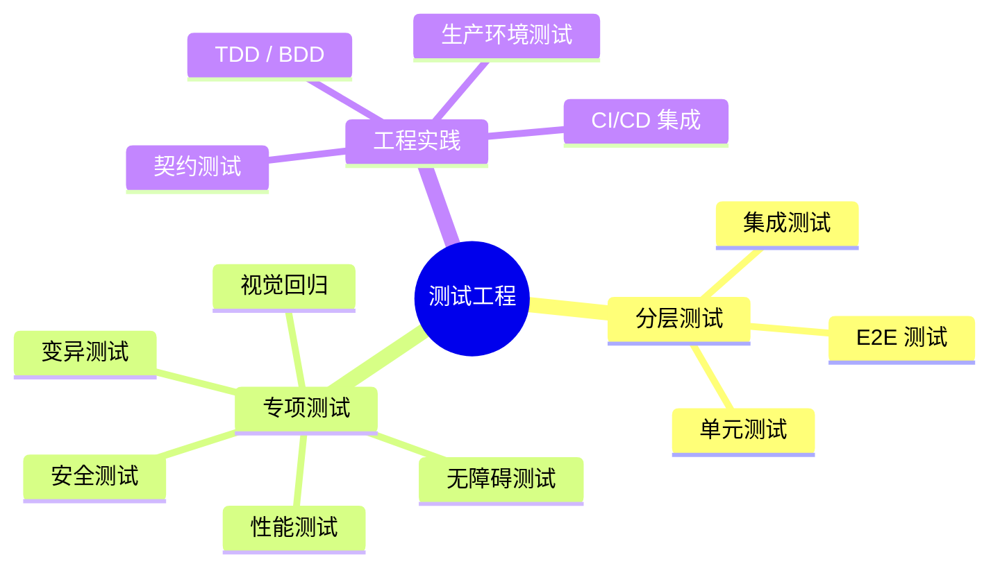

# 🧪 测试工程深度专题

深度专题：从单元测试到混沌工程，构建全生命周期的质量保障体系。

---

## 专题地图

---

## 章节导航

| # | 章节 | 核心内容 |
|---|------|----------|
| 01 | [测试基础理论](01-testing-fundamentals) | 测试金字塔、分层策略、职责划分 |
| 02 | [单元测试深度](02-unit-testing-deep-dive) | Jest / Vitest / Mocha 深度对比与设计模式 |
| 03 | [集成测试](03-integration-testing) | 数据库 / API / 消息队列集成测试 |
| 04 | [E2E 测试](04-e2e-testing) | Playwright / Cypress / Selenium 实战 |
| 05 | [测试模式](05-testing-patterns) | 测试替身、参数化、快照、反模式 |
| 06 | [视觉回归测试](06-visual-regression-testing) | Chromatic / Storybook 视觉一致性 |
| 07 | [变异测试](07-mutation-testing) | Stryker 测试有效性度量 |
| 08 | [无障碍测试](08-accessibility-testing) | axe-core / Pa11y a11y 合规 |
| 09 | [安全测试](09-security-testing) | OWASP ZAP / Burp Suite 漏洞检测 |
| 10 | [性能测试](10-performance-testing) | k6 / Artillery / JMeter 负载与压力 |
| 11 | [CI/CD 测试策略](11-ci-cd-testing) | GitHub Actions / Jenkins 流水线集成 |
| 12 | [测试驱动开发](12-test-driven-development) | TDD 红绿重构方法论 |
| 13 | [契约测试](13-contract-testing) | Pact / Spring Cloud Contract 服务间契约 |
| 14 | [测试数据管理](14-test-data-management) | FactoryBot / TestContainers 数据构造与隔离 |
| 15 | [生产环境测试](15-testing-in-production) | Chaos Monkey / Feature Flag 混沌工程 |

---

## 学习目标

完成本专题后，你将能够：

- 根据项目阶段和架构选择合适的测试分层策略
- 使用 Vitest / Playwright 建立高效的自动化测试流水线
- 实施视觉回归、变异测试和安全测试等专项测试
- 在 CI/CD 中集成测试门禁与质量度量
- 运用混沌工程验证生产环境的韧性

---

## 相关示例

- [Vitest 单元测试实战](/examples/testing/vitest-unit-testing)
- [Playwright E2E 测试实战](/examples/testing/e2e-testing-playwright)

---

## 相关专题

| 专题 | 关联点 |
|------|--------|
| [移动端跨平台](../mobile-cross-platform/) | React Native / Expo 测试策略与 E2E 自动化 |
| [WebAssembly](../webassembly/) | Wasm 模块的单元测试与边界测试 |
| [React + Next.js App Router](../react-nextjs-app-router/) | 组件测试、RSC 测试、Playwright E2E |
| [TypeScript 类型精通](../typescript-type-mastery/) | 类型安全的测试替身与 Mock 类型 |
| [AI-Native Development](../ai-native-development/) | AI 辅助测试生成与 LLM-as-Judge |
