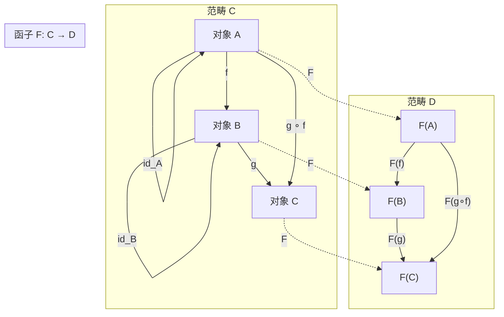
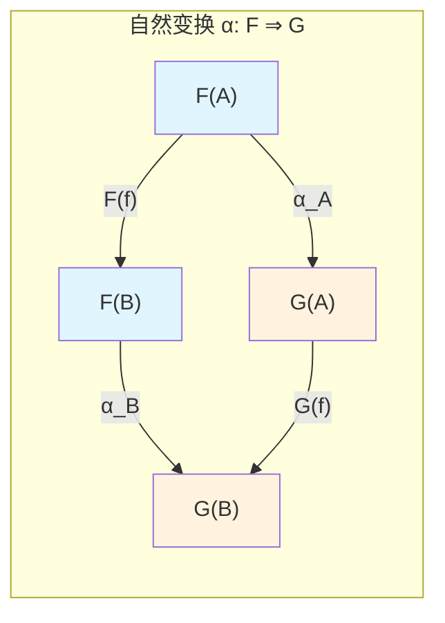
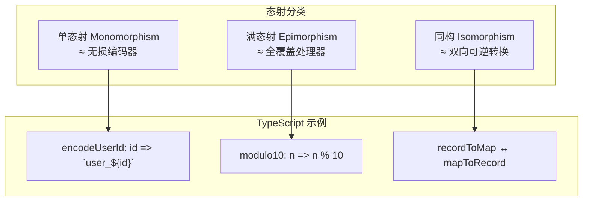
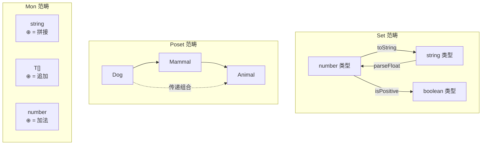

# 程序员视角的范畴论基础

> **理论深度**: 入门级（为后续章节建立共同语言）
> **目标读者**: 有 JS/TS 经验的开发者，无范畴论背景
> **核心目标**: 理解"为什么数学家要发明这些概念"，而非背诵定义

---

## 引言

想象你正在维护一个数据处理管道。你写了这样的代码：

```typescript
// 没有抽象的时代：每个容器都要手写转换逻辑
function doubleNumbers(arr: number[]): number[] {
  const result: number[] = [];
  for (const x of arr) {
    result.push(x * 2);
  }
  return result;
}

function stringifyNumbers(arr: number[]): string[] {
  const result: string[] = [];
  for (const x of arr) {
    result.push(x.toString());
  }
  return result;
}
```

你感到一种重复——不是代码的重复，是**模式的重复**。三个函数共享同一个结构："打开容器，对每个元素应用函数，把结果装回去"。

范畴论的本质就是**识别并命名这种模式**。数学家发现，这种模式在数学中无处不在（集合上的映射、向量空间上的线性变换、拓扑空间上的连续函数），于是他们发明了一个统一的语言来描述它。**范畴论不是从天上掉下来的抽象，而是从千万个具体例子中提炼出的共同结构。**

---

## 理论严格表述（简化版）

### 范畴的四要素

一个范畴 **C** 由以下四部分组成：

1. **对象**（Objects）：一组抽象实体，记作 `Ob(C)`。在编程中，对象对应"类型"——不是具体的值，而是类型的整体。
2. **态射**（Morphisms）：对于任意两个对象 A 和 B，存在一个态射集合 `Hom(A, B)`，表示从 A 到 B 的"箭头"。态射在编程中对应纯函数 `(a: A) => B`。
3. **组合**（Composition）：对于态射 `f: A → B` 和 `g: B → C`，存在复合态射 `g ∘ f: A → C`。编程中对应函数组合。
4. **恒等态射**（Identity）：对于每个对象 A，存在恒等态射 `id_A: A → A`，满足 `f ∘ id_A = f` 且 `id_B ∘ f = f`。编程中对应 `x => x`。

### 两条公理

范畴论要求组合满足两条基本定律：

**结合律**（Associativity）：
对于 `f: A → B`、`g: B → C`、`h: C → D`，有：

```
h ∘ (g ∘ f) = (h ∘ g) ∘ f
```

**单位律**（Identity Laws）：
对于任意 `f: A → B`：

```
f ∘ id_A = f = id_B ∘ f
```

这两条定律不是额外的约束——它们是你已经依赖的编程常识。当你写 `a.pipe(b).pipe(c)` 时，你已经在依赖结合律了。

### 态射的分类

| 类型 | 数学定义 | 编程直觉 |
|------|---------|---------|
| **单态射**（Monomorphism）| 左可消去：`f ∘ g = f ∘ h ⇒ g = h` | 无损编码器——不同输入一定产生不同输出 |
| **满态射**（Epimorphism）| 右可消去：`g ∘ f = h ∘ f ⇒ g = h` | 全覆盖处理器——输出空间被完全覆盖 |
| **同构**（Isomorphism）| 既是单态射又是满态射，且存在逆 | 双向可逆的类型转换 |

### 函子：结构保持映射

函子 `F: C → D` 是两个范畴之间的映射，满足：

1. **对象映射**：将 C 中的对象 A 映射到 D 中的对象 `F(A)`
2. **态射映射**：将 C 中的态射 `f: A → B` 映射到 D 中的态射 `F(f): F(A) → F(B)`
3. **保持恒等**：`F(id_A) = id_{F(A)}`
4. **保持组合**：`F(g ∘ f) = F(g) ∘ F(f)`

在编程中，函子就是"容器"的 `map` 操作——`Array.map`、`Promise.then`、`Option.map` 都是函子的实例。

### 自然变换：函子之间的"适配器"

给定两个函子 `F, G: C → D`，自然变换 `α: F ⇒ G` 为每个对象 A 提供一个态射 `α_A: F(A) → G(A)`，使得对于任意 `f: A → B`，下面的**自然性条件**成立：

```
α_B ∘ F(f) = G(f) ∘ α_A
```

用通俗的话说：自然变换保证"先转换容器再 map"与"先 map 再转换容器"结果相同。`Array.prototype.flat` 就是一个自然变换。

---

## 工程实践映射

### 从类型到范畴：TypeScript 中的具体实例

TypeScript 的类型系统（在理想化条件下）近似构成一个范畴：

```typescript
// ========== 对象 = 类型 ==========
type User = { id: number; name: string };
type Order = { userId: number; total: number };

// ========== 态射 = 纯函数 ==========
const getUserName: (u: User) => string = (u) => u.name;
const createEmptyOrder: (u: User) => Order = (u) => ({
  userId: u.id,
  total: 0
});

// ========== 组合 = 函数管道 ==========
const getOrderSummary: (u: User) => string = (u) => {
  const order = createEmptyOrder(u);
  return `User ${u.name} has order total: ${order.total}`;
};
// 这就是 compose(getOrderSummaryText, createEmptyOrder)

// ========== 恒等 = 恒等函数 ==========
const idUser: (u: User) => User = (u) => u;
const idString: (s: string) => string = (s) => s;
```

### Set 范畴：最接近程序员的直觉

**Set** 是最接近程序员直觉的范畴：

- 对象：集合（TypeScript 中对应"类型"）
- 态射：集合间的函数
- 组合：函数组合
- 恒等：恒等函数

```typescript
// Set 范畴中的态射示例

// 态射 1: number -> string
const numberToString: (n: number) => string = (n) => n.toString();

// 态射 2: string -> Option<number>
type Option<T> = { tag: 'some'; value: T } | { tag: 'none' };
const stringToNumber: (s: string) => Option<number> = (s) => {
  const n = parseFloat(s);
  return isNaN(n) ? { tag: 'none' } : { tag: 'some', value: n };
};
```

### Poset 范畴：子类型关系

TypeScript 的子类型系统就是一个 **Poset**（偏序集）范畴：

```typescript
interface Animal {
  name: string;
}

interface Dog extends Animal {
  bark(): void;
}

// Dog ≤ Animal：Dog 可以赋值给 Animal
const myDog: Dog = { name: 'Rex', bark: () => {} };
const myAnimal: Animal = myDog; // 这就是 "Dog -> Animal" 的态射
```

- 对象 = 类型
- 态射 = 子类型关系（隐式的类型转换）
- 组合 = 子类型的传递性
- 恒等 = 自反性（A ≤ A）

### Mon 范畴：幺半群的统一视角

字符串拼接、数组追加、数字加法共享同一个深层结构——**幺半群**（Monoid）：

```typescript
type Monoid<A> = {
  empty: A;
  concat: (a: A, b: A) => A;
};

const StringMonoid: Monoid<string> = {
  empty: "",
  concat: (a, b) => a + b
};

const ArrayMonoid = <T>(): Monoid<T[]> => ({
  empty: [],
  concat: (a, b) => [...a, ...b]
});

const SumMonoid: Monoid<number> = {
  empty: 0,
  concat: (a, b) => a + b
};

// 通用折叠函数：不需要知道具体是哪个幺半群
const fold = <A>(monoid: Monoid<A>, items: A[]): A =>
  items.reduce(monoid.concat, monoid.empty);

console.log(fold(StringMonoid, ["a", "b", "c"]));      // "abc"
console.log(fold(ArrayMonoid<number>(), [[1], [2], [3]])); // [1, 2, 3]
console.log(fold(SumMonoid, [1, 2, 3, 4]));              // 10
```

### 函子在 JS/TS 中的无处不在

你已经无数次写过 `arr.map(f)`。范畴论会问："`map` 有什么特别的性质，让它能统一出现在 Array、Promise、Option、Tree 中？"

```typescript
// ArrayFunctor
const ArrayFunctor = {
  map: <A, B>(arr: A[], f: (a: A) => B): B[] => arr.map(f)
};

// OptionFunctor
const OptionFunctor = {
  map: <A, B>(opt: Option<A>, f: (a: A) => B): Option<B> =>
    opt.tag === 'none' ? { tag: 'none' } : { tag: 'some', value: f(opt.value) }
};

// TreeFunctor
interface Tree<A> {
  tag: 'leaf' | 'node';
  value?: A;
  left?: Tree<A>;
  right?: Tree<A>;
}

const TreeFunctor = {
  map: <A, B>(tree: Tree<A>, f: (a: A) => B): Tree<B> => {
    if (tree.tag === 'leaf') {
      return { tag: 'leaf', value: tree.value === undefined ? undefined : f(tree.value) };
    }
    return {
      tag: 'node',
      left: tree.left ? TreeFunctor.map(tree.left, f) : undefined,
      right: tree.right ? TreeFunctor.map(tree.right, f) : undefined
    };
  }
};
```

**函子律**（Functor Laws）是"map 不破坏容器结构"的数学表达：

```typescript
// 律 1: 恒等律 —— map 一个什么都不做的函数，应该也什么都不做
const arr = [1, 2, 3];
const id = <A>(x: A): A => x;
console.log(JSON.stringify(arr.map(id)) === JSON.stringify(arr)); // true

// 律 2: 组合律 —— 连续 map 两个函数，等于 map 它们的组合
const f = (x: number) => x + 1;
const g = (x: number) => x * 2;

const way1 = arr.map(x => g(f(x)));    // map (g ∘ f)
const way2 = arr.map(f).map(g);        // map g ∘ map f

console.log(JSON.stringify(way1) === JSON.stringify(way2)); // true
```

### 自然变换的工程实例

你已经见过自然变换，只是没叫它这个名字。`Array.prototype.flat` 就是一个自然变换：

```typescript
// flatten: Array<Array<A>> -> Array<A> 是自然变换

// 自然性条件图示：
//  Array<Array<A>> --map(map(f))--> Array<Array<B>>
//       | flatten                           | flatten
//       v                                   v
//  Array<A> --------map(f)----------> Array<B>
//
// 要求：下路径 == 右路径

const flatten = <A>(arr: A[][]): A[] => arr.flat();

const f = (x: number) => x.toString();
const nested = [[1, 2], [3, 4]];

// 路径 1: 先 flatten，再 map
const path1 = flatten(nested).map(f);
// 路径 2: 先 map(map(f))，再 flatten
const path2 = flatten(nested.map(inner => inner.map(f)));

console.log(JSON.stringify(path1) === JSON.stringify(path2)); // true ✅
```

### 编程概念重构

范畴论视角下，许多熟悉的编程概念获得了新的理解：

| 编程概念 | 范畴论语义 |
|---------|-----------|
| 管道（Pipeline）| 态射组合的可视化语法糖 |
| 泛型（Generics）| 多态态射——对所有类型都"自然"的映射 |
| 类型系统 | 程序的"编译期范畴" |
| curry/uncurry | 同构映射：`C^(A×B) ≅ (C^B)^A` |

```typescript
// curry 建立了同构
type Curry<A, B, C> = (f: (a: A, b: B) => C) => (a: A) => (b: B) => C;
type Uncurry<A, B, C> = (f: (a: A) => (b: B) => C) => (a: A, b: B) => C;

// (A × B -> C) ≅ (A -> (B -> C))
// 即：C^(A×B) ≅ (C^B)^A
```

### 反变函子：箭头方向的反转

TypeScript 的函数参数位置是**反变**（Contravariant）的：

```typescript
interface Animal { name: string; }
interface Dog extends Animal { bark(): void; }

// Dog ≤ Animal（Dog 是 Animal 的子类型）

// 协变位置（返回值）：方向相同
type Producer<A> = () => A;
const dogProducer: Producer<Dog> = () => ({ name: 'Rex', bark: () => {} });
const animalProducer: Producer<Animal> = dogProducer; // ✅ Dog -> Animal

// 反变位置（参数）：方向反转
type Consumer<A> = (a: A) => void;
const animalConsumer: Consumer<Animal> = (a) => console.log(a.name);
const dogConsumer: Consumer<Dog> = animalConsumer; // ✅ Animal -> Dog（方向反转！）
```

**精确直觉**：如果一个函数能处理 Animal，它就能处理 Dog（Dog 是更具体的 Animal）。所以 "能处理 Animal" 的函数集合 **更大**——子类型方向反转了。

---

## Mermaid 图表

### 范畴论核心结构图



### 自然变换交换图



### 态射分类与编程对应



### 编程中的范畴实例



---

## 理论要点总结

### 核心洞察

1. **范畴论不是新发明，是对旧模式的命名**。数学家从千万个具体例子中提炼出共同结构，创造了统一语言。

2. **范畴的四要素**——对象、态射、组合、恒等——在编程中分别对应类型、纯函数、函数管道、恒等函数。

3. **两条公理**（结合律与单位律）不是额外的约束，是你已经依赖的编程常识。

4. **函子**是"容器的结构保持映射"。`Array.map`、`Promise.then`、`Option.map` 都是函子实例。函子律保证你可以自由重构代码而不改变语义。

5. **自然变换**是函子之间的"结构保持转换"。它保证"先转换容器再 map"与"先 map 再转换容器"结果相同。

6. **反变函子**解释了为什么 TypeScript 函数参数位置子类型方向反转：`Dog ≤ Animal` 但 `Consumer<Animal> ≤ Consumer<Dog>`。

### 精确直觉类比与对称差

| 概念 | 精确类比 | 哪里像 | 哪里不像 |
|------|---------|--------|---------|
| 范畴 | 城市的地图 | 节点=地点，边=路径 | 地图不关心地点的"内部" |
| 态射组合 | 管道连接 | 接口匹配才能连接 | 数学组合没有副作用 |
| 函子 | 建筑改造（保持结构） | 改造前后类型不变 | 真实改造可能改变结构 |
| 自然变换 | 不依赖坐标系的物理定律 | 形式在所有"坐标系"下相同 | 物理是连续的，范畴可以是离散的 |
| 单态射 | 无损编码器 | 不同输入一定不同输出 | 编码器可能有计算成本 |
| 同构 | 双向可逆的类型转换 | 信息完全保留 | 浮点精度可能破坏严格同构 |

### 常见陷阱

1. **不是所有代码都需要范畴论语言**。日常业务逻辑用自然语言描述更清晰。

2. **TS 类型系统不是严格的范畴**。`any` 破坏了所有结构；副作用函数不是真正的态射；递归类型需要特殊处理。

3. **范畴论不关心性能**。它说两个表达式"相等"，但不关心一个是 O(n) 另一个是 O(n²)。

4. **满态射+单态射 ≠ 同构**（在某些范畴中）。在 Set 范畴中成立，但在其他范畴中不一定。

5. **Set 上的 "map" 不都是函子**。`Set.map` 可能改变集合大小，违反函子律。

---

## 参考资源

### 权威文献

1. **Awodey, S. (2010).** *Category Theory* (2nd ed.). Oxford University Press. —— 现代范畴论的标准教材，从基础到高级主题均有覆盖，适合有一定数学基础的读者。

2. **Pierce, B. C. (1991).** *Basic Category Theory for Computer Scientists*. MIT Press. —— 专为计算机科学家编写的范畴论入门，重点强调与类型系统和程序语义的联系。

3. **Milewski, B. (2019).** *Category Theory for Programmers*. Blurb. —— 从程序员视角出发的范畴论教程，包含大量编程示例，是在线社区最受欢迎的学习资源之一。

4. **Mac Lane, S. (1998).** *Categories for the Working Mathematician* (2nd ed.). Springer. —— 范畴论的奠基性著作，由范畴论创始人之一撰写，适合深入研究的读者。

5. **Leinster, T. (2014).** *Basic Category Theory*. Cambridge University Press. —— 以清晰、简洁著称的入门教材，强调直觉理解而非形式证明。

### 延伸阅读路径

```
本文件（范畴论基础：对象、态射、函子、自然变换）
    ↓
笛卡尔闭范畴与 TypeScript（积、指数、求值 = 元组、函数、调用）
    ↓
函子与自然变换深化（协变/反变/双函子、函子组合）
    ↓
单子与代数效应（Promise、Array.flatMap、Reader/State）
    ↓
极限与余极限（reduce、Promise.all、类型交集/联合）
    ↓
伴随函子（自由构造、类型推断）
    ↓
Yoneda 引理（"行为决定对象"、API 设计哲学）
    ↓
Topos 理论（类型判断、子对象分类器）
```

### 在线资源

- [nLab](https://ncatlab.org/nlab/show/category+theory) —— 范畴论及其应用的综合 wiki
- [The Catsters](https://www.youtube.com/user/TheCatsters) —— 范畴论教学视频系列
- [Category Theory for Programmers (Online)](https://bartoszmilewski.com/2014/10/28/category-theory-for-programmers-the-preface/) —— Milewski 的免费在线版教程
