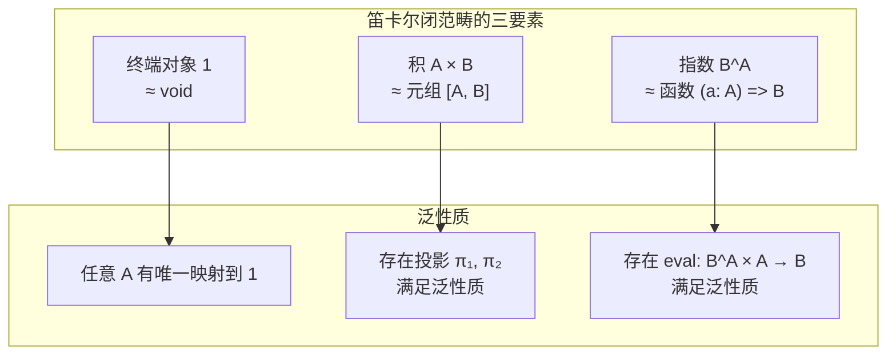
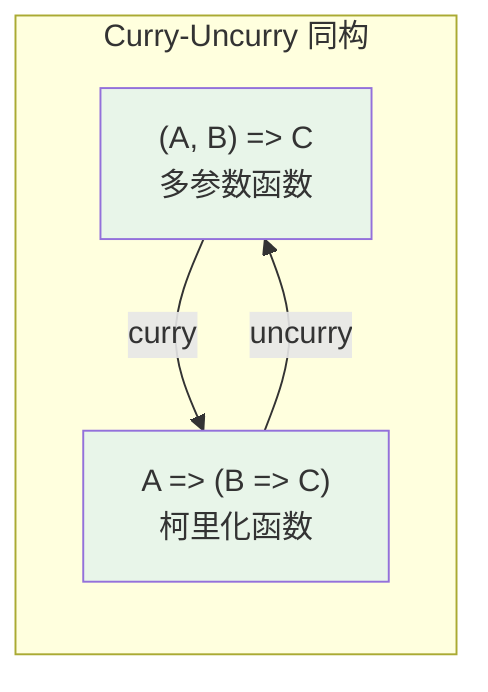
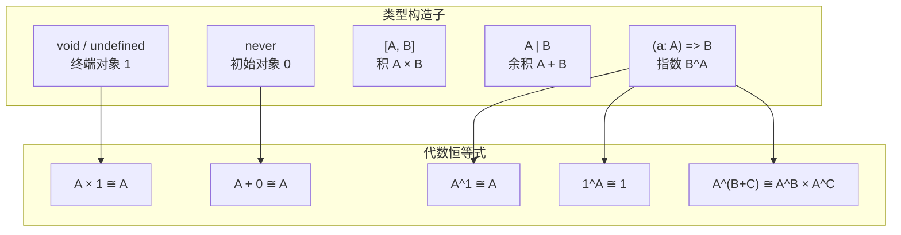
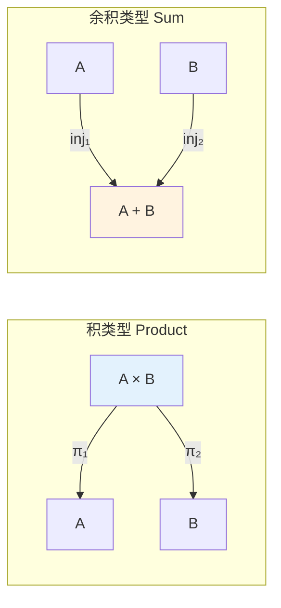

# 笛卡尔闭范畴与 TypeScript 类型系统

> **理论深度**: 中级（含形式化直觉，但降低证明门槛）
> **前置阅读**: [范畴论入门](cat-01-category-theory-primer.md)
> **核心问题**: 为什么函数类型 `(A) => B` 在数学里叫"指数" $B^A$？为什么元组叫"积"？这些名字不是随便起的。

---

## 引言

你在代码审查中看到一个函数：

```typescript
// 版本 A：接受两个参数的函数
function createUser(name: string, age: number): User {
  return { id: generateId(), name, age };
}

// 版本 B：接受一个参数，返回另一个函数
const createUserCurried = (name: string) => (age: number): User =>
  ({ id: generateId(), name, age });
```

版本 A 和版本 B "等价"吗？在直觉上，是的。你可以从 A 得到 B（curry），也可以从 B 得到 A（uncurry）。但"等价"是什么意思？

范畴论的回答是：**它们之间存在同构**。不是值意义上的相等，而是结构意义上的"可双向无损转换"。这个同构是 CCC（笛卡尔闭范畴，Cartesian Closed Category）的核心定理之一。

CCC 说的就是：任何支持"元组"（积）、"函数"（指数）和"单位类型"（终端对象）的类型系统，都可以进行这种 curry 变换。TypeScript 满足这些条件，所以 TS 类型系统（在理想化条件下）构成一个 CCC。

**但这为什么重要？**

因为 CCC 有一个惊人的性质：**每个 CCC 都对应一个具有积类型和函数类型的类型理论**。这意味着 TS 的类型系统不是随意的语法设计，而是有数学根基的。当你设计一个 API 时，你实际上是在一个数学结构内部工作。

---

## 理论严格表述（简化版）

### 笛卡尔闭范畴的定义

一个范畴 **C** 被称为**笛卡尔闭范畴**（Cartesian Closed Category，简称 CCC），如果它满足以下三个条件：

1. **具有终端对象**（Terminal Object）：存在一个对象 `1`，使得对于任意对象 `A`，存在唯一的态射 `!: A → 1`。

2. **具有积**（Products）：对于任意两个对象 `A` 和 `B`，存在一个对象 `A × B`（称为积），以及两个投影态射 `π₁: A × B → A` 和 `π₂: A × B → B`，满足泛性质：对于任意对象 `C` 和态射 `f: C → A`、`g: C → B`，存在唯一的态射 `⟨f, g⟩: C → A × B`，使得 `π₁ ∘ ⟨f, g⟩ = f` 且 `π₂ ∘ ⟨f, g⟩ = g`。

3. **具有指数对象**（Exponentials）：对于任意两个对象 `A` 和 `B`，存在一个对象 `B^A`（称为指数对象），以及一个求值态射 `eval: B^A × A → B`，满足泛性质：对于任意对象 `C` 和态射 `f: C × A → B`，存在唯一的态射 `curry(f): C → B^A`，使得 `eval ∘ (curry(f) × id_A) = f`。

### 积的泛性质（用交换图表示）

```
        C
       /|\
      / | \
   f /  |  \ g
    /   |   \
   v    |    v
   A <--|--> B
    \   |   /
   π₁\  |  /π₂
      \ | /
        v
      A × B
```

### 指数对象的泛性质

```
    C × A --------f--------> B
      ^                     ^
      |                     |
      | curry(f) × id_A     | eval
      |                     |
    B^A × A --------------> B
```

### 核心同构关系

在 CCC 中，以下同构关系成立：

| 同构 | 类型理论对应 | TypeScript 对应 |
|------|------------|----------------|
| `C^(A×B) ≅ (C^B)^A` | curry/uncurry | `(a: A, b: B) => C ≅ (a: A) => (b: B) => C` |
| `A × 1 ≅ A` | 积的单位元 | `[A, void] ≅ A` |
| `A^1 ≅ A` | 指数恒等 | `(x: void) => A ≅ A` |
| `1^A ≅ 1` | 常数函数 | `(x: A) => void ≅ void` |
| `A^(B+C) ≅ A^B × A^C` | 分配律 | `(x: B \| C) => A ≅ [(b: B) => A, (c: C) => A]` |

---

## 工程实践映射

### 终端对象：为什么 `void` 是"最平凡的类型"

在 TypeScript 中，任何函数都可以返回 `void`：

```typescript
function logAndForget<T>(x: T): void {
  console.log(x);
}

logAndForget(42);
logAndForget("hello");
```

数学家看了这段代码，说：`void` 是**终端对象**（Terminal Object）。

**精确直觉类比**：终端对象 ≈ 类型的"黑洞"。任何东西都可以丢进去，但一旦进去，信息就消失了。从任何类型 A 到终端对象，存在且只存在一个函数。

```typescript
// 从任意类型到 void 的唯一函数
const toVoid = <A>(_x: A): void => undefined;

// "唯一性"的编程含义：
// 如果你有两个函数 f: A -> void 和 g: A -> void
// 它们必然相等，因为 void 只有一个可能的返回值

// 对比：从 A 到 string 的函数有无穷多个
const f1 = <A>(x: A): string => JSON.stringify(x);
const f2 = <A>(_x: A): string => "hello";
```

### 初始对象 `never`：不可能输入的精确语义

与终端对象对偶的是**初始对象**（Initial Object）：从它出发，存在且只存在一个到任意类型的函数。

```typescript
// 从 never 到任意类型的唯一函数
const fromNever = <A>(n: never): A => n;

// 为什么这是唯一的？因为 never 没有任何值！
// 这个函数在运行时是"不可达代码"

// 实际应用：穷尽性检查
function exhaustiveCheck(x: never): never {
  throw new Error(`Unhandled case: ${x}`);
}

type Shape =
  | { kind: 'circle'; radius: number }
  | { kind: 'square'; side: number };

function area(s: Shape): number {
  switch (s.kind) {
    case 'circle': return Math.PI * s.radius ** 2;
    case 'square': return s.side ** 2;
    default:
      return exhaustiveCheck(s);
  }
}

// 如果你后续给 Shape 添加了 'triangle'，
// TypeScript 会在这里报错，因为 default 分支中的 s 不再是 never
```

### 积类型：元组和对象为什么叫"积"

你每天都在写解构赋值：

```typescript
const user = { name: 'Alice', age: 30 };
const { name, age } = user;
```

范畴论会说：你在做**投影**（Projection）。`user` 是一个**积**（Product），`name` 和 `age` 是两个投影态射 $\pi_1$ 和 $\pi_2$。

```typescript
// 投影的显式写法
const pi1 = <A, B>(pair: [A, B]): A => pair[0];
const pi2 = <A, B>(pair: [A, B]): B => pair[1];

const userTuple: [string, number] = ['Alice', 30];
console.log(pi1(userTuple)); // 'Alice'
console.log(pi2(userTuple)); // 30
```

**为什么叫"积"？**

因为积的"大小"（元素的个数）是因子大小的乘积。如果你有 3 种名字和 5 种年龄，那么 `User` 类型有 $3 \times 5 = 15$ 种可能的值。

```typescript
// 演示：积的大小 = 因子大小的乘积
type Name = 'Alice' | 'Bob' | 'Carol';      // 3 种可能
type Age = 20 | 25 | 30 | 35 | 40;           // 5 种可能
type User = { name: Name; age: Age };        // 3 × 5 = 15 种可能
```

**积的泛性质**：积类型是满足投影性质的最小结构。

```typescript
// 假设你有一个类型 C，和两个函数 f: C -> A、g: C -> B
// 那么一定存在一个唯一的函数 <f, g>: C -> A × B

const pair = <C, A, B>(
  f: (c: C) => A,
  g: (c: C) => B
): ((c: C) => [A, B]) =>
  (c) => [f(c), g(c)];

// 示例
interface Request {
  body: string;
  headers: Record<string, string>;
}

const getBody = (req: Request): string => req.body;
const getContentType = (req: Request): string => req.headers['content-type'] ?? '';

// 从 Request 到 [string, string] 的唯一配对函数
const extractPair = pair(getBody, getContentType);
```

### 指数对象：函数类型为什么叫 $B^A$

这是最让人困惑的命名。为什么函数类型 `(A) => B` 叫"指数" $B^A$？

**答案来自类型计数**（Type Counting）：

```typescript
// 假设 A 有 |A| 种可能的值，B 有 |B| 种可能的值

// 积类型 A × B 有 |A| × |B| 种值
// （每个 A 的值可以和每个 B 的值配对）

type Bool = true | false;  // |Bool| = 2
type Bit = 0 | 1;           // |Bit| = 2
type BoolAndBit = [Bool, Bit]; // 2 × 2 = 4 种值

// 函数类型 A -> B 有多少种可能的函数？
// 对于 A 的每个 |A| 个输入，你可以选择 B 的 |B| 个输出中的任意一个
// 所以总共有 |B|^(|A|) 种函数！

// 示例：Bool -> Bit 有多少种函数？
// 2^2 = 4 种！
type BoolToBit = (b: Bool) => Bit;

const f1: BoolToBit = (b) => 0;        // 常数 0
const f2: BoolToBit = (b) => 1;        // 常数 1
const f3: BoolToBit = (b) => b ? 1 : 0; // 恒等
const f4: BoolToBit = (b) => b ? 0 : 1; // 翻转

// 确实只有 4 种！
```

**精确直觉类比**：函数类型叫"指数"，不是因为它的语法像指数，而是因为**可能函数的数量是输出类型数量的"输入类型数量次方"**。

### Curry-Uncurry 同构：两个参数变成一个

CCC 告诉我们，curry 不仅仅是一个有用的工具函数——它揭示了一个**同构**：

```typescript
// 在 TS 中：
// (A, B) => C   ≅   A => (B => C)
// 在范畴论中：
// C^(A×B)       ≅   (C^B)^A

const curry = <A, B, C>(f: (a: A, b: B) => C): ((a: A) => (b: B) => C) =>
  (a) => (b) => f(a, b);

const uncurry = <A, B, C>(f: (a: A) => (b: B) => C): ((a: A, b: B) => C) =>
  (a, b) => f(a)(b);

// 验证：curry 和 uncurry 互为逆
const original = (a: number, b: string): boolean => a.toString() === b;
const curried = curry(original);
const uncurried = uncurry(curried);

console.log(original(42, "42") === uncurried(42, "42")); // true
```

这解释了为什么 TS 允许你这样做：

```typescript
const numbers = [1, 2, 3];
const curriedAdd = (a: number) => (b: number) => a + b;
const add5ToEach = numbers.map(curriedAdd(5)); // [6, 7, 8]
// 因为 map 期望 (x: number) => number，而 curriedAdd(5) 正好是这个类型
```

### 求值态射：函数调用的范畴论语义

在 CCC 中，有一个叫做**求值态射**（Evaluation Morphism）的核心构造：

```
eval: B^A × A → B
```

用 TypeScript 说：

```typescript
// eval 就是函数调用！
// B^A = (a: A) => B
// B^A × A = [(a: A) => B, A]（函数和参数的元组）
// eval = 把函数应用到参数上

const eval_ = <A, B>(pair: [(a: A) => B, A]): B => {
  const [f, a] = pair;
  return f(a);
};

// 这就是 f(a) 的范畴论语义
const addOne = (x: number) => x + 1;
console.log(eval_([addOne, 5])); // 6
```

### 和类型：$A \| B$ 与余积

**和类型**（Sum Type）是积类型的对偶。在 TypeScript 中，它对应联合类型 `A | B`。

```typescript
// 积类型：同时有 A 和 B（AND）
type Product = { a: number; b: string }; // 有 a AND 有 b

// 和类型：要么有 A，要么有 B（OR）
type Sum =
  | { tag: 'left'; value: number }
  | { tag: 'right'; value: string };

// 为什么叫"和"？因为值的个数相加
// 如果 A 有 3 种值，B 有 5 种值
// 那么 A | B（不相交并）有 3 + 5 = 8 种值
```

余积的核心构造是**注入**（Injection）和**case 分析**：

```typescript
// 注入：把 A 或 B 放入余积中
const inl = <A, B>(a: A): SumType<A, B> => ({ tag: 'left', value: a });
const inr = <A, B>(b: B): SumType<A, B> => ({ tag: 'right', value: b });

type SumType<A, B> = { tag: 'left'; value: A } | { tag: 'right'; value: B };

// case 分析：从余积中提取值（模式匹配）
const fold = <A, B, C>(
  sum: SumType<A, B>,
  onLeft: (a: A) => C,
  onRight: (b: B) => C
): C =>
  sum.tag === 'left' ? onLeft(sum.value) : onRight(sum.value);
```

### CCC 视角下的 TypeScript 类型构造子完整图谱

```typescript
// 在 CCC 视角下，TS 的核心类型构造子有清晰的数学对应

// 1. 终端对象（1）
type Terminal = void; // 或 undefined（严格模式下）

// 2. 初始对象（0）
type Initial = never;

// 3. 积类型（×）
type Product<A, B> = [A, B]; // 或 { a: A; b: B }

// 4. 和类型（+）
type Sum<A, B> = { tag: 'inl'; value: A } | { tag: 'inr'; value: B };

// 5. 指数类型（^）
type Exponential<A, B> = (a: A) => B;

// 代数恒等式（在理想化 TS 中成立）

// A × 1 ≅ A（积的单位元）
type TimesOne<A> = [A, void];
const fromTimesOne = <A>(p: [A, void]): A => p[0];
const toTimesOne = <A>(a: A): [A, void] => [a, undefined];

// A + 0 ≅ A（和的单位元）
type PlusZero<A> = Sum<A, never>;

// A^1 ≅ A（指数恒等）
type PowerOne<A> = (x: void) => A;
const fromPowerOne = <A>(f: PowerOne<A>): A => f(undefined);
const toPowerOne = <A>(a: A): PowerOne<A> => () => a;

// 1^A ≅ 1（常数函数）
type PowerAny<A> = (x: A) => void;
const powerAny = <A>(_x: A): void => undefined; // 唯一的函数
```

### 类型体操的 CCC 解释

TypeScript 的"类型体操"可以从 CCC 角度获得深刻理解：

```typescript
// 条件类型作为特征函数
type IsString<T> = T extends string ? true : false;
// CCC 解释：IsString 是从类型对象到布尔值对象的态射

// 映射类型作为积的变形
type Partial<T> = {
  [K in keyof T]?: T[K];
};
// CCC 解释：Partial 是从积类型到另一个积类型的态射

// 联合类型转交叉类型
type UnionToIntersection<U> =
  (U extends any ? (k: U) => void : never) extends
  ((k: infer I) => void) ? I : never;
// CCC 解释：从余积 A + B 构造积 A × B，利用指数对象和对角线的性质
```

### 积类型与余积类型的工程权衡

| 特性 | 积类型（AND） | 余积类型（OR） |
|------|-------------|--------------|
| 语义 | 所有字段同时存在 | 只有一个变体存在 |
| 访问方式 | 投影（直接访问字段） | case 分析（模式匹配） |
| 适合场景 | 表示"组合"关系 | 表示"选择"关系 |
| TS 表示 | 对象/元组 | 判别联合类型 |

```typescript
// 积类型：User 同时具有 id AND name AND email
type User = {
  id: number;
  name: string;
  email: string;
};

// 余积类型：Action 要么是 Increment 要么是 Decrement 要么是 SetValue
type Action =
  | { type: 'INCREMENT' }
  | { type: 'DECREMENT' }
  | { type: 'SET_VALUE'; payload: number };

// reducer 是余积的 case 分析（fold）
function reducer(state: number, action: Action): number {
  switch (action.type) {
    case 'INCREMENT': return state + 1;
    case 'DECREMENT': return state - 1;
    case 'SET_VALUE': return action.payload;
  }
}
```

### 反例与边界：TS 何时不是 CCC

```typescript
// any 同时是所有类型的子类型和超类型
// 这破坏了终端/初始对象的唯一性
const anything: any = 42;
const f = (x: any): any => x + "hello"; // 这到底是什么类型？

// 子类型多态的复杂性
interface Animal { name: string; }
interface Dog extends Animal { bark(): void; }

const f_animal = (a: Animal) => a.name;
// f 的类型是 (Animal) => string
// 但它也可以被当作 (Dog) => string 使用
// 这意味着"从 Dog 到 string 的函数"集合包含了
// "从 Animal 到 string 的函数"集合

// 递归类型对应范畴论中的不动点
type Tree<A> = { tag: 'leaf'; value: A } | { tag: 'node'; left: Tree<A>; right: Tree<A> };
// 严格来说，Tree<A> 是某个函子的初始代数
// 这超出了简单 CCC 的范畴
```

---

## Mermaid 图表

### CCC 核心结构图



### Curry-Uncurry 同构图



### TypeScript 类型构造子的 CCC 对应



### 积与余积的对偶关系



---

## 理论要点总结

### 核心洞察

1. **CCC 的三个条件**——终端对象、积、指数——分别对应 TypeScript 中的 `void`/`undefined`、元组/对象、函数类型。这三个条件共同构成了一个数学结构，使得 curry/uncurry 成为可能。

2. **积类型**（AND）的"大小"是因子大小的乘积。`[Bool, Bit]` 有 $2 \times 2 = 4$ 种值。积的泛性质保证了元组是"最紧凑"的组合方式。

3. **指数类型**（函数类型）叫"指数"，不是因为语法像指数，而是因为可能函数的数量是 $|B|^{|A|}$。`Bool → Bit` 有 $2^2 = 4$ 种不同的函数。

4. **Curry-Uncurry 同构** `C^(A×B) ≅ (C^B)^A` 是 CCC 的核心定理。它不是语法糖，而是类型系统的结构性特征。

5. **求值态射** `eval: B^A × A → B` 就是函数调用的范畴论语义。`f(a)` 在数学上就是 `eval([f, a])`。

6. **和类型/余积**（OR）是积的对偶。联合类型 `A | B` 有 $|A| + |B|$ 种值。Redux Action 是余积的完美应用。

### CCC 与编程语言设计的深层联系

**任何满足 CCC 条件的语言，都自动拥有某些"好"的性质**：

- **组合安全性**：复杂程序可以分解为简单函数的组合
- **类型推导完备性**：积和指数的类型系统具有良好的推导性质
- **高阶函数的一等公民地位**：指数对象使得函数可以作为值传递
- **代数数据类型的自然表达**：积和余积的组合可以表达任意 ADT

### 精确直觉类比：CCC 像乐高积木

| CCC 概念 | 乐高 | TypeScript |
|---------|------|-----------|
| 终端对象 | 基础板 | `void` |
| 积 | 组合两个积木 | 元组/对象 |
| 指数 | 连接件 | 函数类型 |
| 态射 | 积木之间的连接方式 | 函数实现 |
| 组合 | 把两个连接串起来 | 函数复合 |

**哪里像**：
- ✅ 像乐高一样，CCC 提供了有限的基本块，通过组合可以构造任意复杂结构
- ✅ 像乐高一样，组合方式本身也是"对象"（指数对象）

**哪里不像**：
- ❌ 不像乐高，CCC 中的"积木"是无限的（类型空间无限）
- ❌ 不像乐高，CCC 的组合是严格的数学结构——错误的组合会在编译时报错

### 常见陷阱

1. **过度抽象**。把简单的函数调用强行解释为 CCC 结构没有带来任何好处。CCC 的价值在于理解类型系统的"设计约束"，不在于重写每一行业务代码。

2. **`any` 的破坏力**。`any` 同时是所有类型的子类型和超类型，破坏了终端对象和初始对象的唯一性。

3. **递归类型需要不动点**。`Tree<A>` 等递归类型在 CCC 中没有直接对应，需要更高级的结构（如代数/余代数）。

4. **条件类型和映射类型超出 CCC**。`T extends U ? X : Y` 和 `{ [K in keyof T]: ... }` 需要更复杂的范畴论语义（F-omega 范畴、索引范畴）。

---

## 参考资源

### 权威文献

1. **Lambek, J., & Scott, P. J. (1986).** *Introduction to Higher-Order Categorical Logic*. Cambridge University Press. —— CCC 与类型理论之间联系的经典著作，首次系统证明了 CCC 与简单类型 lambda 演算的对应关系。

2. **Pierce, B. C. (2002).** *Types and Programming Languages*. MIT Press. —— 类型系统领域的标准教材，第 9 章详细讨论了 CCC 与类型系统的对应。

3. **Awodey, S. (2010).** *Category Theory* (2nd ed.). Oxford University Press. (Ch. 6) —— 现代范畴论教材中关于 CCC 的清晰阐述，包含完整的定义和示例。

4. **Crole, R. L. (1993).** *Categories for Types*. Cambridge University Press. —— 专注于类型理论与范畴论对应关系的专著，适合深入理解 CCC 在编程语言中的应用。

5. **Mitchell, J. C., & Plotkin, G. D. (1988).** "Abstract Types Have Existential Type." *ACM TOPLAS*, 10(3), 470-502. —— 利用 CCC 和 existential type 解释抽象数据类型的经典论文。

### 历史脉络

```
1930s: Church 提出 λ 演算
  ↓ 计算模型
1950s: Fortran 引入类型（但无理论支撑）
  ↓ 工程实践
1970s: ML 引入 Hindley-Milner 类型推断
  ↓ CCC 的指数对象
1980s: Haskell 引入类型类（ad-hoc 多态）
  ↓ CCC + 伴随函子
1990s: Java 引入泛型（参数多态）
  ↓ CCC 的积和指数
2000s: C# 引入 LINQ（Monad 的工业应用）
  ↓ Kleisli 范畴
2010s: TypeScript 引入条件类型、映射类型
  ↓ 超越 CCC，向 2-范畴发展
2020s: Rust 引入所有权类型
  ↓ 线性逻辑（资源敏感范畴）
```

### 未来方向

```
CCC → 2-CCC（高阶类型）
    → 依赖类型（Σ 类型、Π 类型）
    → 线性类型（资源管理）
    → 效应系统（代数效应）
    → 计量类型（复杂度分析）

每一步扩展都对应编程语言的新特性，
同时也对应范畴论的新结构。
```
