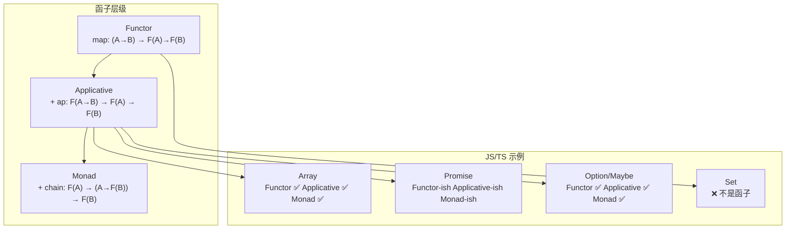
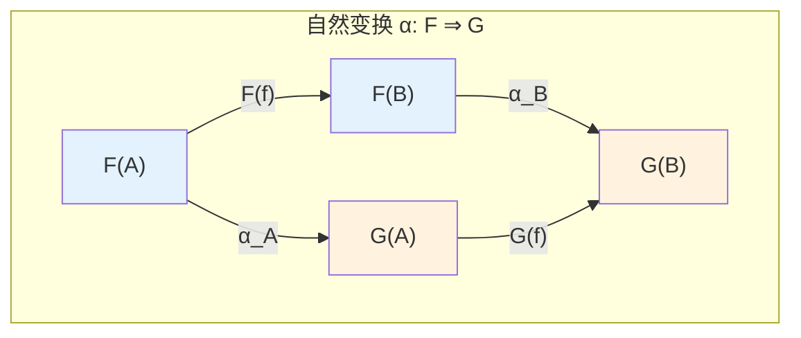
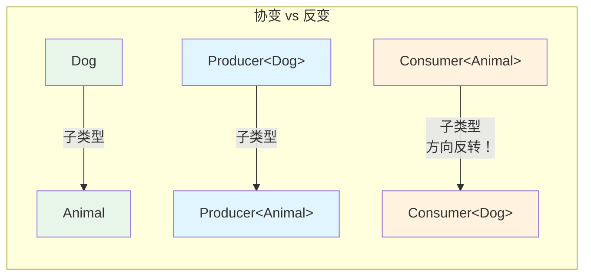
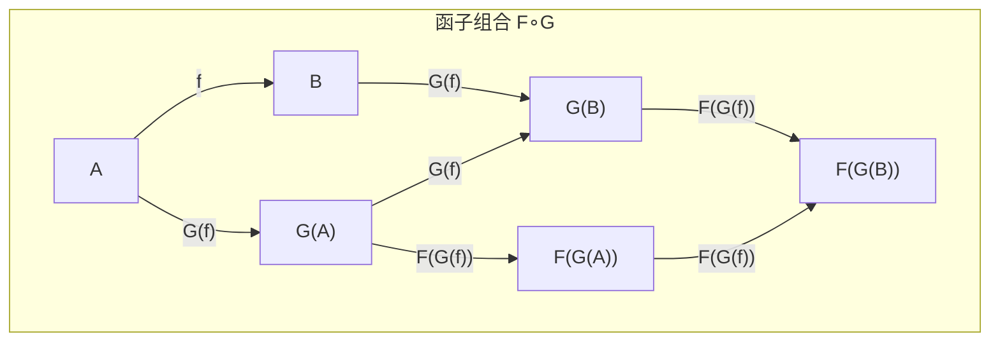

# 函子与自然变换在 JavaScript/TypeScript 中的体现

> **理论深度**: 中级
> **前置阅读**: [范畴论入门](cat-01-category-theory-primer.md)
> **核心问题**: "map" 这个词出现在 Array、Promise、Option、Tree、Observable 中，是巧合吗？

---

## 引言

你用过这些吗？

```typescript
// Array.map
[1, 2, 3].map(x => x * 2);

// Promise.then
Promise.resolve(5).then(x => x * 2);

// RxJS Observable.map
// observable.pipe(map(x => x * 2));

// fp-ts Option.map
// O.map(x => x * 2)(some(5));
```

它们都叫 "map"，做着类似的事。这是巧合吗？

不是。它们都是**函子**（Functor）的实例。函子不是某个库的发明，而是一个跨越所有库、所有语言、所有数学领域的**普遍模式**。

**思维脉络**：程序员先发明了各种数据结构（数组、Promise、树），然后发现每个结构都需要一个"对内部元素应用函数"的方法。于是他们一次次地实现 `map`。数学家看着这些实现，说："它们都在做同一件事。让我给这件事起个名字——函子。"

---

## 理论严格表述（简化版）

### 协变函子的形式化定义

给定范畴 **C** 和 **D**，一个**函子** `F: C → D` 由两部分组成：

1. **对象映射**：对于 C 中的每个对象 `A`，指定 D 中的对象 `F(A)`
2. **态射映射**：对于 C 中的每个态射 `f: A → B`，指定 D 中的态射 `F(f): F(A) → F(B)`

且必须满足以下两条**函子律**（Functor Laws）：

**恒等律**：`F(id_A) = id_{F(A)}`

**组合律**：`F(g ∘ f) = F(g) ∘ F(f)`

在编程中，`F` 是类型构造子（如 `Array<T>`、`Promise<T>`、`Option<T>`），`F(f)` 就是 `map(f)`。

### 反变函子

**反变函子**（Contravariant Functor）是箭头方向反转的函子。对于 `f: A → B`，反变函子给出 `F(f): F(B) → F(A)`。

### 双函子

**双函子**（Bifunctor）是从两个范畴的积范畴到另一个范畴的函子：`F: C × D → E`。在编程中，它对应同时是两个容器的函子，如 `Promise.all`、 `Either.bimap`。

### 自然变换的形式化定义

给定两个函子 `F, G: C → D`，**自然变换** `α: F ⇒ G` 为 C 中的每个对象 `A` 提供一个 D 中的态射 `α_A: F(A) → G(A)`，使得对于任意态射 `f: A → B`，下面的**自然性条件**成立：

```
α_B ∘ F(f) = G(f) ∘ α_A
```

用交换图表示：

```
    F(A) --F(f)--> F(B)
    | α_A            | α_B
    v                v
    G(A) --G(f)--> G(B)
```

### Applicative 函子

Applicative 函子在 Functor 基础上增加了 `ap`（apply）操作，允许提升多参数函数：

```
ap: F(A → B) → F(A) → F(B)
of: A → F(A)
```

### Monad

Monad 在 Applicative 基础上增加了 `chain`（或 `flatMap`、`bind`）操作：

```
chain: F(A) → (A → F(B)) → F(B)
```

它允许"后续计算依赖前面结果"的动态结构。

---

## 工程实践映射

### Array.map：函子的教科书案例

Array.map 如此普遍，以至于你可能从未思考过它为什么"应该"存在。

```typescript
// 没有 map 时
function doubleNumbers(arr: number[]): number[] {
  const result: number[] = [];
  for (let i = 0; i < arr.length; i++) {
    result[i] = arr[i] * 2;
  }
  return result;
}

function stringifyNumbers(arr: number[]): string[] {
  const result: string[] = [];
  for (let i = 0; i < arr.length; i++) {
    result[i] = arr[i].toString();
  }
  return result;
}

// 看到了吗？doubleNumbers 和 stringifyNumbers 的结构完全一样，
// 只有 arr[i] * 2 vs arr[i].toString() 不同。

// 有了 map 后
const double = (x: number) => x * 2;
const stringify = (x: number) => x.toString();

const doubled = [1, 2, 3].map(double);     // 复用 double 函数
const stringified = [1, 2, 3].map(stringify); // 复用 stringify 函数
```

**函子律的验证**：

```typescript
// 律 1: F(id) = id
const arr = [1, 2, 3];
const id = <A>(x: A): A => x;
console.log(JSON.stringify(arr.map(id)) === JSON.stringify(arr)); // true

// 律 2: F(g ∘ f) = F(g) ∘ F(f)
const f = (x: number) => x + 1;
const g = (x: number) => x * 2;

const left = arr.map(x => g(f(x)));   // map(g ∘ f)
const right = arr.map(f).map(g);       // map(g) ∘ map(f)

console.log(JSON.stringify(left) === JSON.stringify(right)); // true

// 律 2 的实际意义：重构自由
// 你可以把 [1,2,3].map(f).map(g) 重构成 [1,2,3].map(x => g(f(x)))
// 而不改变语义。这是 IDE 自动重构的数学基础。
```

### Promise.then：异步计算容器的函子

Promise 是一个"将来会有值"的容器。`.then` 就是它的 `map`。

```typescript
// 没有 then 的异步处理
function fetchAndDouble(): Promise<number> {
  return fetch('/api/number')
    .then(res => res.json())
    .then(data => {
      return data.value * 2; // 嵌在回调里，无法复用 double 函数
    });
}

// 有了 then（函子视角）
const double = (x: number) => x * 2;

function fetchAndDoubleElegant(): Promise<number> {
  return fetch('/api/number')
    .then(res => res.json())
    .then(data => data.value)
    .then(double); // 复用纯函数！
}

// then 让异步计算和同步函数解耦
// 你可以在不修改 double 的情况下，把它"提升"到 Promise 层面
```

**Promise.then 的函子律验证**：

```typescript
// 律 1: then(id) ≈ id（忽略 Promise 包装）
Promise.resolve(42).then(x => x).then(result => {
  console.log(result === 42); // true
});

// 律 2: then(g ∘ f) = then(g) ∘ then(f)
const f = (x: number) => x + 1;
const g = (x: number) => x.toString();

const p = Promise.resolve(5);

const left = p.then(x => g(f(x)));
const right = p.then(f).then(g);

Promise.all([left, right]).then(([a, b]) => {
  console.log(a === b); // true ✅
});

// 但注意：Promise.then 不是严格的函子，因为它还处理 rejection！
// then 的第二个参数（onRejected）引入了额外的行为。
// 从严格的范畴论角度，Promise.then 更像是一个"带有错误处理的增强函子"。
```

### Option/Maybe：空值处理的函子视角

```typescript
// 没有 Option 时：null 检查地狱
function getUserStreet(userId: string): string | null {
  const user = findUser(userId); // User | null
  if (!user) return null;

  const address = user.address; // Address | null
  if (!address) return null;

  const street = address.street; // string | null
  return street;
}

// 每一步都要检查 null，无法复用纯函数

// 有了 Option 函子
type Option<T> = { tag: 'some'; value: T } | { tag: 'none' };

const some = <T>(value: T): Option<T> => ({ tag: 'some', value });
const none = <T>(): Option<T> => ({ tag: 'none' });

const OptionFunctor = {
  map: <A, B>(opt: Option<A>, f: (a: A) => B): Option<B> =>
    opt.tag === 'none' ? none<B>() : some(f(opt.value))
};

// 现在可以链式调用
function getUserStreetElegant(userId: string): Option<string> {
  return OptionFunctor.map(
    OptionFunctor.map(
      OptionFunctor.map(findUser(userId), u => u.address),
      a => a.street
    ),
    s => s.toUpperCase()
  );
}
```

### Tree.map：递归结构的函子性

```typescript
interface Tree<A> {
  tag: 'leaf';
  value: A;
} | {
  tag: 'node';
  left: Tree<A>;
  right: Tree<A>;
};

// 没有 map 时：每个变换都要遍历整棵树
function doubleTree(tree: Tree<number>): Tree<number> {
  if (tree.tag === 'leaf') {
    return { tag: 'leaf', value: tree.value * 2 };
  }
  return {
    tag: 'node',
    left: doubleTree(tree.left),
    right: doubleTree(tree.right)
  };
}

// 有了 Tree.map
const TreeFunctor = {
  map: <A, B>(tree: Tree<A>, f: (a: A) => B): Tree<B> => {
    if (tree.tag === 'leaf') {
      return { tag: 'leaf', value: f(tree.value) };
    }
    return {
      tag: 'node',
      left: TreeFunctor.map(tree.left, f),
      right: TreeFunctor.map(tree.right, f)
    };
  }
};
```

### Array.map 与 Promise.then 的函子对比

**精确直觉类比：Array 是「透明玻璃盒」，Promise 是「时间胶囊」**。

- **Array（透明玻璃盒）**：你立刻能看到里面所有的元素。map 就是"对每个元素做同样的事"。
- **Promise（时间胶囊）**：你不知道里面有什么，也不知道什么时候能打开。then 就是"等打开后，对里面的东西做某事"。

**哪里像**：两者都满足函子律。

**哪里不像**：

1. **时序**：Array.map 是同步的；Promise.then 引入了时间维度。
2. **错误处理**：Array.map 不会"失败"；Promise.then 必须处理 rejection。
3. **结构可见性**：Array.map 前后数组长度不变；Promise.then 不改变"单个值"的结构。

```typescript
// 结构可见性对比
const arr = [1, 2, 3];
const mapped = arr.map(x => x * 2);
console.log(arr.length === mapped.length); // true，结构保持

const p = Promise.resolve(5);
const thened = p.then(x => x * 2);
// p 和 thened 都是 Promise，但内部状态可能不同
```

### 反变函子：箭头方向的反转

TypeScript 的类型系统有一个让初学者困惑的特性：函数参数是**反变**（Contravariant）的。

```typescript
interface Animal { name: string; }
interface Dog extends Animal { bark(): void; }

// Dog ≤ Animal（Dog 是 Animal 的子类型）

// 协变位置（返回值）：方向相同
type Producer<A> = () => A;
const dogProducer: Producer<Dog> = () => ({ name: 'Rex', bark: () => {} });
const animalProducer: Producer<Animal> = dogProducer; // ✅ Dog -> Animal

// 反变位置（参数）：方向反转
type Consumer<A> = (a: A) => void;
const animalConsumer: Consumer<Animal> = (a) => console.log(a.name);
const dogConsumer: Consumer<Dog> = animalConsumer; // ✅ Animal -> Dog（方向反转！）

// 为什么？
// animalConsumer 只用到 .name
// 任何 Dog 都有 .name，所以 animalConsumer 可以安全地消费 Dog
// 反过来不行：dogConsumer 可能用到 .bark，但 Animal 不一定有
```

**精确直觉类比**：反变函子 ≈ "前置条件处理器"。

- 如果一个函数能处理 Animal，它就能处理 Dog（Dog 是更具体的 Animal）
- 但如果一个函数要求处理 Dog，它不一定能处理 Animal（可能需要 bark）
- 所以 "能处理 Animal" 的函数集合 **更大**
- 子类型方向反转了：`Dog ≤ Animal` 但 `Consumer<Animal> ≤ Consumer<Dog>`

### Comparator：反变函子的实战

```typescript
// 比较器是反变函子的经典例子
type Comparator<A> = (a1: A, a2: A) => number;

// 如果 Animal 可以按 name 比较
const compareAnimals: Comparator<Animal> = (a, b) =>
  a.name.localeCompare(b.name);

// 那么它也可以比较 Dog（因为 Dog 有 name）
const compareDogs: Comparator<Dog> = compareAnimals; // ✅

// 更复杂的例子：验证器
type Validator<A> = (value: A) => string[]; // 返回错误列表

const validateAnimal: Validator<Animal> = (a) =>
  a.name.trim() === '' ? ['Name is required'] : [];

// 可以安全地用作 Dog 的验证器
const validateDog: Validator<Dog> = validateAnimal; // ✅
```

### 双函子：两个容器的组合映射

```typescript
// Promise.all 作为积双函子
// Promise.all: (Promise<A>, Promise<B>) -> Promise<[A, B]>

async function fetchPairNew(): Promise<[User, Order]> {
  return Promise.all([fetchUser(), fetchOrder()]);
}

// Promise.all 是"积双函子"：
// 它在两个参数位置上都是函子

// 验证双函子性：
const pu = Promise.resolve(1);
const pv = Promise.resolve("hello");

const f = (x: number) => x * 2;
const g = (s: string) => s.toUpperCase();

const left = Promise.all([pu, pv]).then(([a, b]) => [f(a), g(b)] as const);
const right = Promise.all([pu.then(f), pv.then(g)]);

Promise.all([left, right]).then(([a, b]) => {
  console.log(a[0] === b[0] && a[1] === b[1]); // true ✅
});
```

### Either.bimap：错误和成功同时映射

```typescript
// Either<E, A>：要么有错误 E，要么有成功值 A
type Either<E, A> = { tag: 'left'; value: E } | { tag: 'right'; value: A };

const left = <E, A>(e: E): Either<E, A> => ({ tag: 'left', value: e });
const right = <E, A>(a: A): Either<E, A> => ({ tag: 'right', value: a });

// bimap 同时在两个"通道"上映射
const bimap = <E1, E2, A1, A2>(
  ea: Either<E1, A1>,
  f: (e: E1) => E2,
  g: (a: A1) => A2
): Either<E2, A2> =>
  ea.tag === 'left' ? left(f(ea.value)) : right(g(ea.value));

// 实际应用：API 错误转换
interface HttpError { status: number; message: string; }
interface AppError { code: string; userMessage: string; }

const httpToAppError = (e: HttpError): AppError => ({
  code: `HTTP_${e.status}`,
  userMessage: e.status >= 500 ? 'Server error' : 'Client error'
});

const doubleIfSuccess = (x: number): number => x * 2;

const apiResult: Either<HttpError, number> = right(42);
const appResult = bimap(apiResult, httpToAppError, doubleIfSuccess);
// Either<AppError, number>
```

### 自然变换的严格证明

`Array.prototype.flat` 就是一个自然变换：

```typescript
// flatten: Array<Array<A>> -> Array<A> 是自然变换

// 自然性条件：flatten ∘ map(map(f)) = map(f) ∘ flatten

const flatten = <A>(arr: A[][]): A[] => arr.flat();

function testNaturality<A, B>(
  nested: A[][],
  f: (a: A) => B,
  name: string
): void {
  // 左路径：先 map 内层，再 flatten
  const left = flatten(nested.map(inner => inner.map(f)));

  // 右路径：先 flatten，再 map
  const right = flatten(nested).map(f);

  const passed = JSON.stringify(left) === JSON.stringify(right);
  console.log(`${name}: ${passed ? '✅ PASS' : '❌ FAIL'}`);
}

// 测试用例
testNaturality([[1, 2], [3, 4]], x => x * 2, 'double');
testNaturality([[1, 2], [3]], x => x.toString(), 'toString');
testNaturality<number, number>([[], [1], []], x => x + 1, 'with empties');
```

### head 不是自然变换：为什么安全提取容器首元素不可能

```typescript
// head: Array<A> -> Option<A>（安全地取第一个元素）
// 为什么 head 不是自然变换？

const head = <A>(arr: A[]): Option<A> =>
  arr.length === 0 ? { tag: 'none' } : { tag: 'some', value: arr[0] };

const g = (x: number) => [x, x]; // number -> number[]

const arr2 = [[1, 2], [3, 4]]; // number[][]

// head 的类型：number[][] -> Option<number[]>
// "先 map(map(g))，再 head"：
const left2 = head(arr2.map(inner => inner.map(g)));
// arr2.map(...) = [[[1,1], [2,2]], [[3,3], [4,4]]]
// head(...) = some([[1,1], [2,2]])

// "先 head，再 map(g)"：
const right2 = OptionFunctor.map(head(arr2), inner => inner.map(g));
// head(arr2) = some([1,2])（第一个内层数组）
// 不是 some([[1,1], [2,2]])！

// 根本问题：head 丢失了"容器结构"（数组的其余部分）
// 而 map 保持容器结构
// 所以先 map 再 head 和先 head 再 map 的结果不同
```

### Applicative 函子：多参数函数的提升

```typescript
interface Applicative<F> {
  map<A, B>(f: (a: A) => B): (fa: F<A>) => F<B>;
  ap<A, B>(ff: F<(a: A) => B>): (fa: F<A>) => F<B>;
  of<A>(a: A): F<A>;
}

// Array 的 Applicative 实现
const ArrayApplicative: Applicative<Array> = {
  map: <A, B>(f: (a: A) => B) => (arr: A[]) => arr.map(f),

  // ap: Array<(A -> B)> -> Array<A> -> Array<B>
  // 结果是对所有函数作用于所有元素的所有组合
  ap: <A, B>(ff: ((a: A) => B)[]) => (fa: A[]) =>
    ff.flatMap(f => fa.map(f)),

  of: <A>(a: A): A[] => [a]
};

// 正例：用 Applicative 计算笛卡尔积
const fs = [(x: number) => x * 2, (x: number) => x + 10];
const xs = [1, 2, 3];
const result = ArrayApplicative.ap(fs)(xs);
// [2, 4, 6, 11, 12, 13]
```

### Monad 与 Applicative 的认知差异

| 特性 | Applicative | Monad |
|------|-------------|-------|
| 函数依赖 | 所有 `F<A>` 独立计算 | 后续计算可依赖前面结果 |
| 表达能力 | 静态结构 | 动态结构 |
| 优化难度 | 易并行化 | 难并行化（依赖链） |
| 编程对应 | `Promise.all` | `then` 链 |

```typescript
// 场景：根据用户输入查询数据库，再根据结果调用不同 API
function getUserWorkflow(userId: string): Promise<string> {
  return fetchUser(userId).then(user => {
    // 下一步操作依赖上一步结果（user）
    if (user.vip) {
      return fetchVIPData(user.id);
    } else {
      return fetchBasicData(user.id);
    }
  }).then(data => data.summary);
}

// 这种"后续依赖前面结果"的能力是 Monad 独有的
// Applicative 无法表达：因为它要求所有步骤预先确定

// 错误：明明没有依赖关系，却用了 then 链
function fetchUserAndOrderBad(userId: string, orderId: string): Promise<[User, Order]> {
  return fetchUser(userId).then(user =>
    fetchOrder(orderId).then(order => [user, order])
  );
  // 问题：fetchOrder 不依赖 user，但 then 链暗示了顺序依赖
}

// 修正：用 Applicative（Promise.all）表达独立性
function fetchUserAndOrderGood(userId: string, orderId: string): Promise<[User, Order]> {
  return Promise.all([fetchUser(userId), fetchOrder(orderId)]);
}
```

### 函子的组合与嵌套

```typescript
// 函子可以组合：如果 F 和 G 都是函子，那么 F∘G 也是函子
// (F ∘ G)(A) = F(G(A))
// (F ∘ G)(f) = F(G(f))

// 示例：Array<Promise<A>> 的双重函子性

const PromiseFunctor = {
  map: <A, B>(pa: Promise<A>, f: (a: A) => B): Promise<B> => pa.then(f)
};

const ArrayFunctor = {
  map: <A, B>(arr: A[], f: (a: A) => B): B[] => arr.map(f)
};

// 组合函子：先 map 内层 Promise，再 map 外层 Array
const composedMap = <A, B>(
  arrOfPromises: Promise<A>[],
  f: (a: A) => B
): Promise<B>[] =>
  ArrayFunctor.map(arrOfPromises, pa => PromiseFunctor.map(pa, f));

// Promise.all + map 的另一种组合
const allThenMap = <A, B>(arr: Promise<A>[], f: (a: A) => B): Promise<B[]> =>
  Promise.all(arr).then(results => results.map(f));

// allThenMap 与 composedMap 结果不同：
// composedMap: Promise<B>[]（每个 Promise 单独变换）
// allThenMap: Promise<B[]>（等所有完成后再一起变换）
```

### 识别"伪函子"

TypeScript/JavaScript 的生态系统中有许多"声称"是函子但实际上违反函子律的结构：

```typescript
// 反例 1：Set 上的 "map"
// Set 天然地不满足函子律，因为 map 可能改变集合大小！
const set = new Set([1, 2, 3]);
// 如果我们有 set.map(x => x % 2)
// 结果会是 Set(0, 1) —— 大小从 3 变成 2
// set.map(f).map(g) 和 set.map(x => g(f(x))) 的结果可能完全不同

// 反例 2：DOM NodeList
// NodeList 是"活集合"（live collection）
// 如果 DOM 在 map 过程中变化，结果不可预测
const live = document.querySelectorAll('div');
// live collection 引入了外部状态依赖
// 函子律要求"纯函数变换"，但 live collection 违反了这一点

// 反例 3：带副作用的 map
class LoggingArray<T> {
  constructor(private items: T[]) {}

  map<U>(f: (t: T) => U): LoggingArray<U> {
    console.log(`Mapping ${this.items.length} items`);
    return new LoggingArray(this.items.map(f));
  }
}
// arr.map(f).map(g) 会打印两次，但 arr.map(x => g(f(x))) 只打印一次
```

**如何识别"伪函子"**：

1. 检查 `map(id) === id` 是否在引用相等意义下成立
2. 检查 `map(g ∘ f)` 和 `map(g) ∘ map(f)` 是否对所有纯函数 f, g 成立
3. 特别注意：有副作用、有外部状态依赖、有自动扁平化行为的结构，几乎都不是真正的函子

---

## Mermaid 图表

### 函子层级关系图



### 自然变换交换图



### 反变函子方向反转



### 函子组合



---

## 理论要点总结

### 核心洞察

1. **函子是跨越所有库、所有语言的普遍模式**。`Array.map`、`Promise.then`、`Option.map`、`Tree.map` 都在做同一件事：将普通函数 "提升" 到容器层面，同时保持结构。

2. **函子律不是额外的约束，是"map 不破坏容器结构"的数学表达**。恒等律保证 `map(id)` 什么都不做；组合律保证你可以自由重构代码。

3. **Applicative 在 Functor 基础上增加了组合多个容器的能力**。`Promise.all` 本质上是 Applicative 的"组合"操作。当步骤间没有数据依赖时，用 Applicative 表达并行性更准确。

4. **Monad 在 Applicative 基础上增加了"动态选择"能力**。当后续计算依赖前面结果时，才需要使用 Monad。能用 Applicative 就不用 Monad。

5. **自然变换的"自然"是精确数学条件，不是"显然"的意思**。它要求"先转换容器再 map"与"先 map 再转换容器"结果相同。`Array.flat` 是自然变换；`head`、`reverse`、`length` 不是。

6. **反变函子解释了 TypeScript 函数参数位置的子类型方向反转**。`Dog ≤ Animal` 但 `Consumer<Animal> ≤ Consumer<Dog>`。

### 工程决策：函子层级的选择指南

| 问题特征 | 选择 | 理由 |
|---------|------|------|
| 对容器内每个元素做独立变换 | Functor (map) | 最简抽象，足够表达 |
| 多个独立容器的结果组合 | Applicative (ap) | 表达并行性、无隐藏依赖 |
| 后续步骤依赖前面结果 | Monad (chain) | 唯一表达能力 |
| 需要遍历并累积状态 | Foldable (reduce) | 函子无法表达"累积" |
| 需要过滤元素 | Filterable | 不是函子操作（改变结构） |
| 需要副作用 | IO Monad / Effect | 纯函子排斥副作用 |

### 精确直觉类比

| 概念 | 精确类比 | 哪里像 | 哪里不像 |
|------|---------|--------|---------|
| Functor | 建筑改造（保持结构） | 改造前后类型不变 | 真实改造可能改变结构 |
| Applicative | 并行装修多栋大楼 | 各栋大楼独立施工 | 真实施工可能有资源竞争 |
| Monad | 根据当前楼层决定下一步 | 动态决策能力 | 真实决策可能有意外 |
| 自然变换 | 不依赖坐标系的物理定律 | 形式在所有"坐标系"下相同 | 物理是连续的，范畴可以是离散的 |

### 常见陷阱

1. **Promise.then 不是严格的 map**。它同时扮演了 map 和 bind 的角色，通过运行时检查自动切换行为。

2. **Set 不是函子**。`Set.map` 可能改变集合大小，违反结构保持。

3. **DOM NodeList 不是函子**。它是"活集合"，有外部状态依赖。

4. **Generator 不是纯函子**。它有执行语义和副作用。

5. **用 Monad 表达纯组合关系是过度设计**。明明没有依赖关系，却用 `then` 链，会误导读者并阻碍并行优化。

---

## 参考资源

### 权威文献

1. **Mac Lane, S. (1998).** *Categories for the Working Mathematician* (2nd ed.). Springer. —— 范畴论领域的圣经级著作，第 2 章详细讨论了函子、自然变换及其基本性质，是所有后续研究的理论基础。

2. **Milewski, B. (2019).** *Category Theory for Programmers*. Blurb. —— 从程序员视角系统讲解函子、Applicative 和 Monad 的层次关系，包含大量 Haskell 和 C++ 示例，是理解函子层级最实用的资源。

3. **Riehl, E. (2016).** *Category Theory in Context*. Dover Publications. —— 以现代视角重新组织的范畴论教材，对自然变换的"自然性"有特别深入的解释，适合理解自然变换的几何直觉。

4. **McBride, C., & Paterson, R. (2008).** "Applicative Programming with Effects." *Journal of Functional Programming*, 18(1), 1-13. —— 首次系统提出 Applicative 函子概念的经典论文，证明了"能用 Applicative 就不用 Monad"的原则。

5. **Wadler, P. (1995).** "Monads for Functional Programming." *Advanced Functional Programming*, 24-52. —— 将 Monad 从数学理论引入编程实践的开创性论文，解释了 do-notation 的设计原理。

### 延伸阅读路径

```
Functor（map = 单参数提升）
    ↓
Applicative（ap = 多参数组合）
    ↓
Monad（chain = 动态依赖）
    ↓
Monad Transformer（效应组合）
    ↓
代数效应（Algebraic Effects）
```

### 在线资源

- [TypeScript 官方文档 - 泛型](https://www.typescriptlang.org/docs/handbook/2/generics.html) —— 理解类型参数与函子的关系
- [fp-ts 文档](https://gcanti.github.io/fp-ts/) —— TypeScript 中 Functor/Applicative/Monad 的工业级实现
- [Fantasy Land 规范](https://github.com/fantasyland/fantasy-land) —— JavaScript 函数式编程代数结构的社区标准
