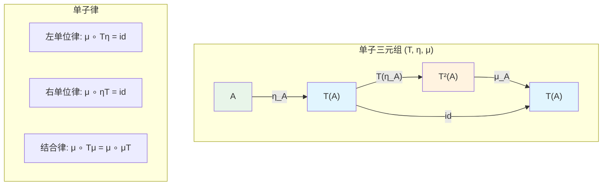
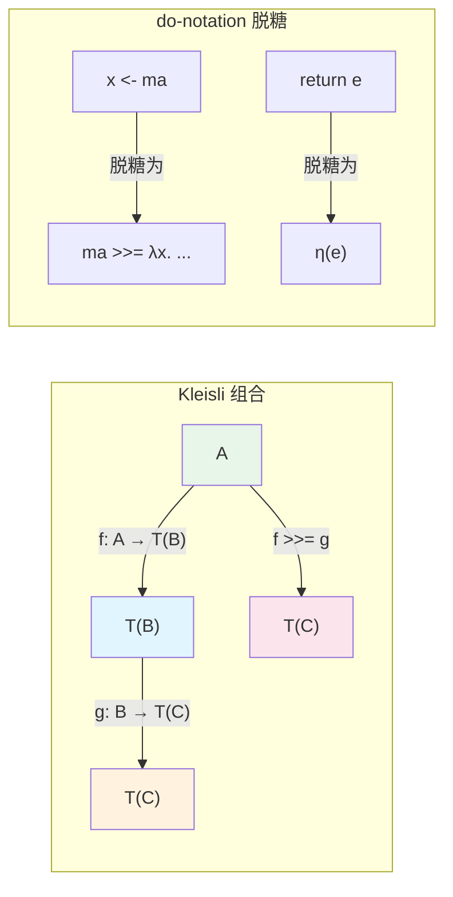
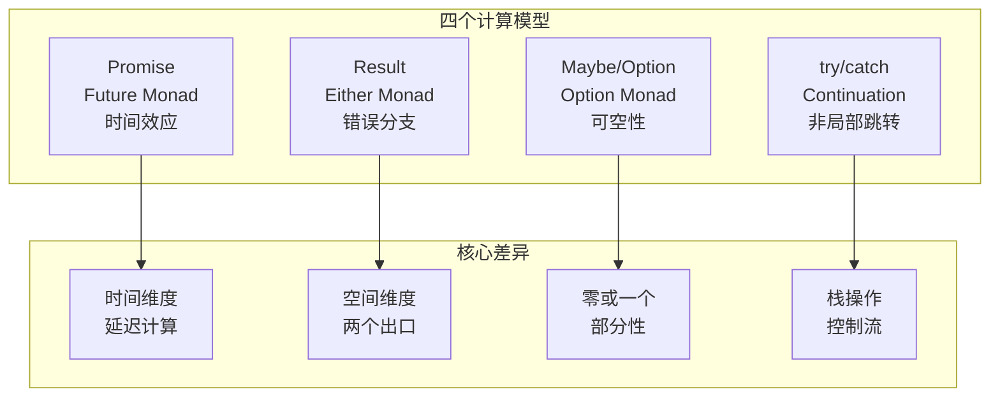
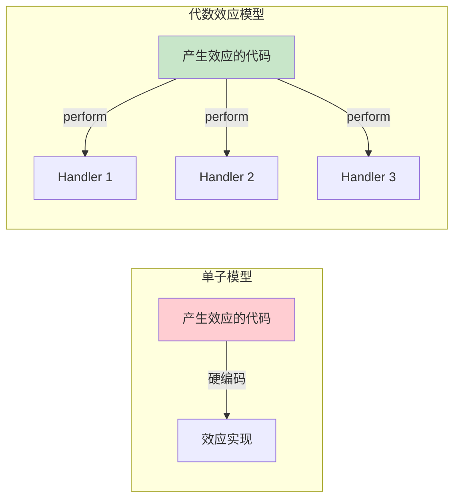

# 单子与代数效应：Promise/Async 与 Rust Result 的深度对比

> **理论深度**: 研究生级别
> **前置阅读**: [范畴论入门](cat-01-category-theory-primer.md), [函子与自然变换](cat-03-functors-natural-transformations.md)
> **目标读者**: 语言设计者、高级框架开发者、全栈架构师

---

## 引言

2013年，Node.js 已经流行了四年，但每个中级 JavaScript 开发者都曾在深夜被回调地狱折磨过。假设你要读取一个配置文件，解析其中的数据库连接字符串，然后查询用户列表，最后发送邮件通知——在纯回调风格下，代码会螺旋向下缩进：

```javascript
// 2013 年的真实噩梦
readConfig("config.json", function(err, config) {
  if (err) { handleError(err); return; }
  parseConnectionString(config.db, function(err, conn) {
    if (err) { handleError(err); return; }
    queryUsers(conn, function(err, users) {
      if (err) { handleError(err); return; }
      notifyUsers(users, function(err) {
        if (err) { handleError(err); return; }
        console.log("done");
      });
    });
  });
});
```

Promise 的出现（ES2015）让代码变得扁平：`.then().then().then().catch()`。async/await（ES2017）让它几乎看起来像同步代码。表面上看，这是语法糖的进化。但如果我们只停留在语法层面，就会错过一个关键洞察：**这些演进不是偶然的，它们对应着范畴论中单子（Monad）的逐步具现化**。Promise 是单子，`async/await` 是 Haskell 中 do-notation 的 JavaScript 方言，`await` 本质上是 Kleisli 组合的语法糖。

理解这一点为什么重要？因为当你在 2024 年面对以下问题时——"为什么 Rust 的 `?` 不能用于闭包？"、"为什么 React Hooks 不能放在 if 语句里？"、"为什么 Promise.all 不是单子 join？"——只有范畴论的视角能给出统一的、不依赖于具体语言实现细节的回答。

---

## 理论严格表述（简化版）

### 为什么需要计算效应的形式化理论？

**计算效应**（Computational Effects）是指任何让函数超越"输入→输出"纯数学模型的行为：异常、状态、非确定性、输入输出、异步、连续性。每种效应都打破了函数的直接可组合性。

考虑两个纯函数 `f: A → B` 和 `g: B → C`，它们的组合 `g ∘ f` 是直接的。但如果 `f` 可能抛出异常、可能异步执行、可能修改全局状态，那么 `g ∘ f` 就不再是简单的函数组合——你需要考虑异常传播、回调注册、状态同步。

### 单子的范畴论定义：三元组

一个**单子**（Monad）是范畴 **C** 上的三元组 `(T, η, μ)`，其中：

- **T: C → C** 是一个**自函子**（Endofunctor），将每个对象 `A` 映射到 `T(A)`，将每个态射 `f: A → B` 映射到 `T(f): T(A) → T(B)`。在编程中，`T` 是类型构造子，如 `Promise<T>`、`Result<T, E>`、`Array<T>`。

- **η: id_C ⇒ T** 是**单位自然变换**（Unit），将普通值提升为带有上下文的值。在编程中，`η_A: A → T(A)` 对应 `Promise.resolve`、`Ok`、`Some`。

- **μ: T² ⇒ T** 是**乘法自然变换**（Multiplication / Join），将嵌套的上下文展平为单层上下文。在编程中，`μ_A: T(T(A)) → T(A)` 对应 `.then(id)` 对 `Promise<Promise<T>>` 的展平、`flatten` 对 `Array<Array<T>>` 的展平。

### 单子律（Monad Laws）

单子必须满足以下三条定律：

**结合律**：`μ_A ∘ T(μ_A) = μ_A ∘ μ_{T(A)} : T³(A) → T(A)`

含义：对于嵌套三层的上下文（如 `Promise<Promise<Promise<T>>>`），先展平内层再展平外层，与先展平外层再展平内层，结果相同。

**左单位律**：`μ_A ∘ T(η_A) = id_{T(A)} : T(A) → T(A)`

含义：将一个已经带有上下层的值再用 `η` 包装一层，然后展平，等价于什么都不做。例如，`Promise.resolve(Promise.resolve(x)).then(id)` 等价于 `Promise.resolve(x)`。

**右单位律**：`μ_A ∘ η_{T(A)} = id_{T(A)} : T(A) → T(A)`

含义：将一个带有上下文的值直接包装进外层上下文再展平，等价于原值。例如，`Promise.resolve(px).then(id)` 等价于 `px`。

### Kleisli 范畴与 bind 操作

给定单子 `(T, η, μ)`，可以构造**Kleisli 范畴** `C_T`，其中：

- 对象与原始范畴 `C` 相同；
- 态射 `A →_T B` 定义为原始范畴中的 `A → T(B)`。

Kleisli 组合定义为：

```
(f >>= g)(a) = μ_B(T(g)(f(a)))
```

在编程中，Kleisli 组合就是 `bind` 或 `flatMap`：

```typescript
const bind = <A, B>(ma: Promise<A>, f: (a: A) => Promise<B>): Promise<B> =>
  ma.then(f);
```

### 代数效应：perform/handle 分离

在单子理论中，效应的产生和处理是**耦合**的。例如，`IO` Monad 将"打印到控制台"作为硬编码的效应操作。

**代数效应**（Algebraic Effects）的核心创新是**分离效应的产生和处理**：

- **`perform`**：在计算中声明"我需要某个效应"，但不指定如何实现。
- **`handle`**：在调用处定义"当这个效应发生时，做什么"。

```
// 概念示例（Eff 语言风格）
perform (log "starting");  // 产生效应
// ...
handle compute with
| log msg k -> print_endline msg; k ()  // 处理效应
| return v -> v
```

这里 `k` 是**延续**（Continuation），代表"效应发生后的剩余计算"。

---

## 工程实践映射

### Promise 作为单子三元组

```typescript
// 类型构造子 T(A) = Promise<A>

// η_A: A -> Promise<A> —— 单位，将普通值提升为已解析的 Promise
const unit = <A>(a: A): Promise<A> => Promise.resolve(a);

// μ_A: Promise<Promise<A>> -> Promise<A> —— 乘法，展平嵌套 Promise
const join = <A>(ppa: Promise<Promise<A>>): Promise<A> =>
  ppa.then(pa => pa);
// 等价于：ppa.then(id)

// bind (>>=): Promise<A> -> (A -> Promise<B>) -> Promise<B>
const bind = <A, B>(pa: Promise<A>, f: (a: A) => Promise<B>): Promise<B> =>
  pa.then(f);

// Kleisli 组合 (>=>): (A -> Promise<B>) -> (B -> Promise<C>) -> (A -> Promise<C>)
const kleisliCompose = <A, B, C>(
  f: (a: A) => Promise<B>,
  g: (b: B) => Promise<C>
): ((a: A) => Promise<C>) =>
  (a) => bind(f(a), g);
```

**单子律验证**：

```typescript
// 左单位律：μ ∘ Tη = id
const verifyLeftUnit = async <A>(pa: Promise<A>): Promise<boolean> => {
  const lhs = await pa.then(a => Promise.resolve(a)).then(x => x);
  const rhs = await pa;
  return lhs === rhs;  // Promise/A+ 保证这一点
};

// 右单位律：μ ∘ ηT = id
const verifyRightUnit = async <A>(pa: Promise<A>): Promise<boolean> => {
  const lhs = await Promise.resolve(pa).then(x => x);
  const rhs = await pa;
  return lhs === rhs;  // true（assimilation）
};

// 结合律：μ ∘ Tμ = μ ∘ μT
const verifyAssoc = async <A>(pppa: Promise<Promise<Promise<A>>>): Promise<boolean> => {
  const lhs = await pppa.then(ppa => ppa.then(x => x)).then(x => x);
  const rhs = await pppa.then(x => x).then(x => x);
  return JSON.stringify(await lhs) === JSON.stringify(await rhs);
};
```

### Promise.then 不是严格的 map

```typescript
// 反例：Promise.then 同时扮演了 map 和 bind 的角色
const pa = Promise.resolve(5);

// 情形 A：f 返回非 Promise，.then 表现为 map
const f = (x: number): number => x * 2;
const r1 = pa.then(f);  // Promise<number>

// 情形 B：g 返回 Promise，.then 表现为 bind（自动展平）
const g = (x: number): Promise<number> => Promise.resolve(x * 2);
const r2 = pa.then(g);  // Promise<number>（不是 Promise<Promise<number>>！）
```

从严格的范畴论语义看，`map`（函子操作）和 `bind`（单子操作）是两个不同的东西。`map` 接受 `A → B`，`bind` 接受 `A → T(B)`。Promise 的 `.then()` 通过运行时检查返回值是否是 Thenable 来自动切换行为，这在类型上是不诚实的。

**后果**：

```typescript
const h = (x: number): number | Promise<number> =>
  Math.random() > 0.5 ? x * 2 : Promise.resolve(x * 2);

const r3 = pa.then(h);
// r3 的类型是 Promise<number | Promise<number>>
// 但运行时行为是：如果 h 返回 Promise，then 会自动展平
// 类型系统和运行时语义不一致！
```

### async/await 作为 do-notation

JavaScript 的 `async/await` 是 Promise 单子的 do-notation。

```typescript
// async/await 写法（do-notation）
async function compute(): Promise<number> {
  const user = await fetchUser("123");      // user <- fetchUser "123"
  const orders = await fetchOrders(user.id); // orders <- fetchOrders(user.id)
  return orders.length;                      // return (length orders)
}

// 脱糖后的 Promise 链（Kleisli 组合）
function computeDesugared(): Promise<number> {
  return fetchUser("123").then(user =>
    fetchOrders(user.id).then(orders =>
      Promise.resolve(orders.length)
    )
  );
}
```

**脱糖规则的对照表**：

| async/await 语法 | 脱糖后的 Promise 操作 | 范畴论语义 |
|-----------------|---------------------|-----------|
| `await ma` | `ma.then(x => ...)` | Kleisli 组合中的值提取 |
| `return e`（在 async 函数中）| `Promise.resolve(e)` | 单位 `η` |
| 顺序语句 `s1; s2` | `s1.then(_ => s2)` | Kleisli 组合的串联 |
| `try { ... } catch (e) { ... }` | `.catch(...)` | 效应 Handler |

**隐式异常包装导致的类型欺骗**：

```typescript
async function parseConfig(input: string): Promise<Config> {
  const parsed = JSON.parse(input);  // 如果 input 非法，抛出 SyntaxError
  if (!parsed.apiUrl) {
    throw new Error("missing apiUrl");  // 等价于 return Promise.reject(...)
  }
  return parsed;
}

// 类型签名说返回 Promise<Config>
// 但实际上它也可能返回 Promise<never>（通过 reject）
// TypeScript 的类型系统不区分 resolve 和 reject 类型！
```

### Rust Result 作为 Either Monad

Rust 的 `Result<T, E>` 在范畴论中对应 **Either Monad**：

```
T(A) = A + E = Ok(A) | Err(E)
```

```rust
// 函子性：map 对 Ok 分支应用函数，对 Err 分支原样传递
impl<T, E> Result<T, E> {
    pub fn map<U, F: FnOnce(T) -> U>(self, f: F) -> Result<U, E> {
        match self {
            Ok(t) => Ok(f(t)),
            Err(e) => Err(e),
        }
    }
}
```

**`?` 操作符的 Kleisli 语义**：

```rust
fn read_config(path: &str) -> Result<Config, io::Error> {
    let content = fs::read_to_string(path)?;   // 如果失败，return Err(...)
    let config: Config = serde_json::from_str(&content)?;  // 如果失败，return Err(...)
    Ok(config)
}

// 等价于：
fn read_config_desugared(path: &str) -> Result<Config, io::Error> {
    fs::read_to_string(path).and_then(|content| {
        serde_json::from_str(&content).map_err(|e| io::Error::new(io::ErrorKind::InvalidData, e))
    })
}
```

`?` 将 `Result<T, E>` 解包为 `T`，如果失败则短路返回。这正是 Kleisli 组合中 bind 的行为。

**`?` 在闭包中的编译失败**：

```rust
// 编译错误：? 不能在返回非 Result 的闭包中使用
fn process_numbers(inputs: Vec<&str>) -> Result<Vec<u32>, String> {
    let numbers: Vec<u32> = inputs
        .iter()
        .map(|s| s.parse::<u32>()?)  // ❌ 错误！
        .collect();
    Ok(numbers)
}

// 修正：collect() 可以将 Iterator<Result<T, E>> 收集为 Result<Vec<T>, E>
fn process_numbers(inputs: Vec<&str>) -> Result<Vec<u32>, ParseIntError> {
    let numbers: Result<Vec<u32>, _> = inputs
        .iter()
        .map(|s| s.parse::<u32>())
        .collect();  // 遇到第一个 Err 就返回，否则收集为 Vec
    numbers
}
```

### 四个计算模型的精确差异

| 维度 | Promise（Future Monad） | Result（Either Monad） | Maybe（Option Monad） | try/catch（Continuation） |
|------|----------------------|---------------------|---------------------|------------------------|
| **类型构造子** | `T(A) = Future(A)` | `T(A) = A + E` | `T(A) = 1 + A` | `T(A) = (A → R) → R` |
| **效应本质** | 时间延迟 | 异常分支 | 部分性（可空）| 非局部控制流 |
| **上下文信息** | 异步状态 | 错误值 E | 无额外信息 | 调用栈的延续 |
| **组合方式** | 时间顺序 | 错误传播（短路）| 空值传播（短路）| 栈展开 |
| **可组合性** | 高（Monad + Applicative）| 高（Monad）| 高（Monad）| 低（非结构化）|

### 决策矩阵：什么时候选什么

| 条件 | 推荐 | 不推荐 | 理由 |
|------|------|--------|------|
| 值可能不存在，但无额外错误信息 | `Option<T>` | `Result<T, E>` | `Option` 语义精确，避免虚构错误 |
| 操作可能失败，有具体错误原因 | `Result<T, E>` | `Option<T>` | 错误信息丢失，调试困难 |
| 操作是异步的 | `Promise<T>` | `Result<T, E>`（同步）| 同步模型无法表达时间延迟 |
| 需要组合多个可能失败的操作 | `Result` + `?` / `Promise` + `await` | `try/catch`（大范围）| 结构化效应可组合，非结构化不可组合 |
| 需要同时执行多个独立异步操作 | `Promise.all` | 顺序 `await` | `Promise.all` 是 Applicative 的 `sequence` |
| 性能关键路径（零成本抽象）| Rust `Result` | JS `Promise` | Promise 有运行时调度开销 |

### Rust `?` 与 TS try/catch 的范畴论差异

```rust
// Rust：显式的、结构化的错误传播
fn read_config(path: &str) -> Result<Config, io::Error> {
    let text = fs::read_to_string(path)?;   // 类型签名强制处理
    let config = toml::from_str(&text)?;     // 类型签名强制处理
    Ok(config)
}
// 每个 ? 点都是一个显式的 Kleisli 组合
```

```typescript
// TypeScript：隐式的、非结构化的错误传播
function readConfig(path: string): Config {
    const text = fs.readFileSync(path);     // 可能抛出，但类型签名不显示
    const config = toml.parse(text);        // 可能抛出，但类型签名不显示
    return config;
}
// 错误通过非局部控制流（栈展开）传播
// 类型签名 Config 是不诚实的
```

**关键差异**：

- **Rust**：错误类型在函数签名中完全可见。组合两个诚实函数，得到的仍然是诚实的函数。这是 Kleisli 范畴的核心性质。
- **TypeScript**：`try/catch` 捕获的是语法块中任何位置抛出的任何异常，没有机制区分"预期的错误"和"意外的 Bug"。

### React Fiber 与代数效应的范畴论模型

React Hooks 可以看作是在没有语言级代数效应支持的情况下，用**调用约定**模拟的 Handler 语义：

```typescript
function Counter() {
  const [count, setCount] = useState(0);  // "perform State.get/set"

  useEffect(() => {
    document.title = `Count: ${count}`;   // "perform Effect.sideEffect"
  }, [count]);                            // Handler 的依赖数组

  return <button onClick={() => setCount(count + 1)}>{count}</button>;
}
```

React Fiber 架构在底层实现了代数效应的核心机制：

- **`perform(effect)`** ≈ 创建更新任务 `Update = { lane, payload, callback }`
- **`handle(effect, handler)`** ≈ Fiber 调度器从更新队列中取出任务，执行对应的 reducer
- **Continuation `k`** ≈ `Fiber.alternate`（当前 Fiber 的快照，用于恢复执行）

**为什么 Hooks 不能放在 if 语句里？**

React Hooks 依赖**调用顺序**来识别哪个 Hook 对应哪个状态槽位。第一次渲染时，React 记录 `useState` 的调用顺序：槽位 0、槽位 1……如果第二次渲染时 `showCount` 变为 `false`，第一个 `useState` 不执行，第二个 `useState` 被误认为槽位 0，导致状态错位。

从代数效应视角看，Hooks 是**通过调用栈位置模拟的 perform 操作**。如果调用顺序改变，Fiber 调度器无法匹配 perform 操作和对应的 handler 状态。在真正的代数效应语言（如 Eff、Koka）中，`perform` 是语法构造，编译器确保其使用规则；但在 JavaScript 中，React 只能用 ESLint 规则在静态分析层面模拟这种保证。

### Effect System 的范畴论语境

效应系统扩展了类型系统，使**计算效应成为类型信息的一部分**：

```
Γ ⊢ e : A ! Δ
```

这个判断读作：在类型环境 `Γ` 下，表达式 `e` 具有类型 `A`，并且可能产生效应集合 `Δ`。

**Koka 语言**（Leijen, 2014）是现代效应系统的代表：

```koka
// 函数签名显式标注效应
fun divide(x: int, y: int): exn int   // exn = 可能抛出异常
  if y == 0 then throw("Division by zero")
  else x / y

// 纯函数：无效应
fun add(x: int, y: int): total int
  x + y
```

**为什么精确效应跟踪重要？** 它解决了单子的一个核心问题：**组合性**。在 Haskell 中，如果你有两个 Monad——`State` 和 `Exception`——组合它们需要 Monad Transformer：`StateT s (Except e) a`。这很快变得复杂。代数效应和效应系统通过**行多态**（Row Polymorphism）让效应自然地组合。

---

## Mermaid 图表

### 单子三元组结构图



### Kleisli 范畴与 do-notation



### 计算模型对比



### 代数效应 vs 单子



---

## 理论要点总结

### 核心洞察

1. **Promise 和 Result 都是单子，但封装了正交维度**。Promise 封装**时间维度**（计算尚未发生），Result 封装**空间维度**（计算有两个出口）。Rust 的 `async fn` 返回 `Future<Output = Result<T, E>>`，这是两个单子的叠加。

2. **async/await 和 `?` 都是 do-notation 的方言**。它们降低了 Kleisli 组合的心智负担，但没有改变底层语义。理解脱糖规则，才能理解边界行为。

3. **隐式 vs 显式是设计权衡，不是优劣判断**。TypeScript 的隐式异常传播牺牲了安全性，换取了开发速度；Rust 的显式 Result 牺牲了开发速度，换取了可靠性。范畴论告诉你代价在哪里，但不替你做决定。

4. **React Hooks 是代数效应在宿主语言限制下的工程妥协**。它的限制（顺序调用、顶层调用）不是 React 团队的任性，而是在没有 `perform`/`handle` 语法的情况下，用调用约定模拟 Handler 语义的必然结果。

5. **效应系统代表了编程语言理论的前沿**。Koka 的行多态效应系统可能在未来十年影响主流语言的设计。TC39 的 Explicit Resource Management 提案（`using` 关键字）可以看作 JS 向结构化效应迈出的第一步。

### 范畴论视角的核心洞察

| 问题 | 传统视角 | 范畴论视角 |
|------|---------|-----------|
| 为什么回调地狱难维护？ | 缩进太深 | Kleisli 组合缺乏语法糖 |
| 为什么 async/await 好用？ | 语法糖 | do-notation 降低认知负荷 |
| 为什么 Hooks 不能放 if 里？ | React 的规则 | 调用顺序 = 效应标识 |
| 为什么 Rust `?` 不能用于闭包？ | 编译器限制 | Kleisli 组合需要 Kleisli 范畴上下文 |
| 为什么 Promise.all 不是 join？ | API 设计 | Applicative `sequence` ≠ Monad `join` |

### 精确直觉类比：单子不是"盒子"

许多教程将单子类比为"盒子"——这个类比在入门时有帮助，但它是**危险的误导**。

**精确类比：单子是"带有上下文的计算管道"**。

- **Promise 单子**：控制室里有一个"等待灯"。当上游产品到达时，灯变绿，传送带启动。
- **Result 单子**：控制室里有一个"质检台"。每个产品都必须通过质检才能继续。
- **Maybe 单子**：控制室里有一个"过滤器"。`null` 或 `undefined` 被直接丢入废料箱。

**哪里像**：准确传达了单子的核心语义——"计算不是孤立的，它携带了影响后续计算的环境信息"。

**哪里不像**：

- ❌ "管道"暗示了数据的线性流动，但某些单子（如 List Monad）更像"分叉路口"
- ❌ "环境控制室"暗示了有状态的机制，但 Identity Monad 没有任何额外机制
- ❌ 没有直接解释单子律为什么重要——它们是保证组合**结合性**和**单位元**的数学公理

### 常见陷阱

1. **Promise.resolve 的 assimilation 陷阱**。`Promise.resolve(promise)` 不会创建 `Promise<Promise<T>>`，而是直接返回 `promise` 本身。这使得 `η` 不是严格的单位元。

2. **async 函数隐式将所有 throw 包装为 reject**。类型签名 `Promise<Config>` 不携带错误类型信息，调用者可能忘记处理异常路径。

3. **Result 的误用——将错误当控制流**。"用户不存在"是正常结果，不是错误条件。将其包装为 `Err` 会导致调用者被迫处理"错误"。

4. **try/catch 捕获了不该捕获的异常**。没有机制区分"预期的错误"和"意外的 Bug"，导致 Bug 被静默吞掉。

5. **效应标注的过度工程**。Koka 中 `simpleGreeting` 的类型签名可能包含 `<console, exceptions, heap<div>, nontermination>`。对于应用层开发，这种精确性带来的认知负担可能超过收益。

---

## 参考资源

### 权威文献

1. **Moggi, E. (1991).** "Notions of Computation and Monads." *Information and Computation*, 93(1), 55-92. —— 单子理论的奠基性论文。Moggi 首次证明了不同的计算效应（异常、状态、异步）都可以用单子统一建模，开创了"计算即单子"的研究范式。

2. **Plotkin, G., & Pretnar, M. (2009).** "Handlers of Algebraic Effects." *ESOP 2009*, 80-94. —— 代数效应理论的开创性论文，提出了 `perform`/`handle` 分离的核心思想，解决了单子效应组合需要 Monad Transformer 的问题。

3. **Wadler, P. (1995).** "Monads for Functional Programming." *Advanced Functional Programming*, 24-52. —— 将 Monad 从数学理论引入编程实践的开创性论文，展示了 Haskell IO Monad 如何用纯函数模拟命令式 I/O，是理解 do-notation 设计的最佳资源。

4. **Klabnik, S., & Nichols, C. (2023).** *The Rust Programming Language* (2nd ed.). No Starch Press. —— Rust 官方教程，第 9 章详细讲解了 `Result<T, E>` 和 `?` 操作符的设计哲学与使用模式。

5. **Leijen, D. (2014).** "Koka: Programming with Row Polymorphic Effect Types." *MSFP 2014*. —— 现代效应系统语言 Koka 的设计论文，提出了行多态（Row Polymorphism）作为效应组合的机制，是效应系统研究的前沿成果。

6. **Harper, R. (2016).** *Practical Foundations for Programming Languages* (2nd ed.). Cambridge University Press. —— 编程语言理论的综合性教材，从类型理论、范畴论和证明论三个角度系统讲解了计算效应的形式化理论。

### 历史脉络

```
1968-1980: 结构化编程革命（Dijkstra, GOTO Considered Harmful）
    ↓
1988-1991: Moggi 的关键洞察——不同计算效应都可以用单子建模
    ↓
1995: Wadler 将 Monad 带入主流（Haskell IO Monad）
    ↓
2009: Plotkin & Pretnar 提出代数效应
    ↓
2015: Rust `?` 操作符将 Kleisli 组合内建为语言特性
    ↓
2017: React Fiber 用代数效应思想实现可中断渲染
    ↓
2017: JavaScript async/await（Promise Monad 的 do-notation）
    ↓
2020s: 效应系统研究活跃（Koka, Eff, Flix）
```

### 在线资源

- [Promise/A+ 规范](https://promisesaplus.com/) —— 理解 Promise.then 自动展平行为的规范依据
- [Rust Error Handling 指南](https://doc.rust-lang.org/book/ch09-00-error-handling.html) —— Rust 官方对 Result 和 `?` 的详细讲解
- [React Fiber Architecture](https://github.com/acdlite/react-fiber-architecture) —— React 核心团队对 Fiber 架构的技术文档
