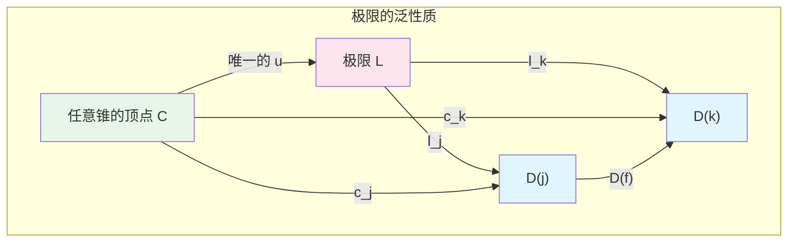
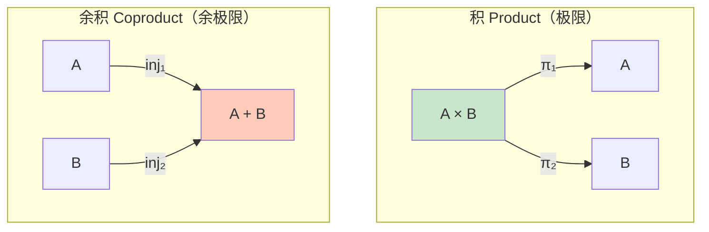
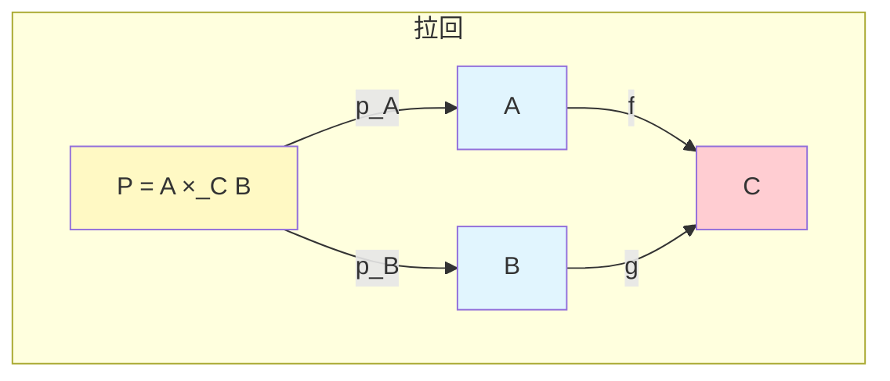
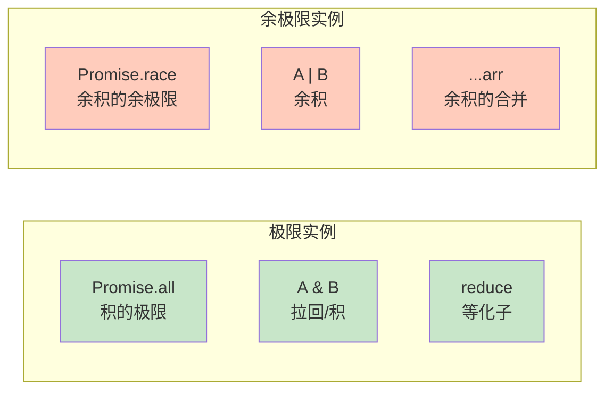

# 极限与余极限：reduce/merge/spread 的普遍性质

> **理论深度**: 中级
> **前置阅读**: [范畴论入门](cat-01-category-theory-primer.md), [笛卡尔闭范畴](cat-02-cartesian-closed-categories.md)
> **目标读者**: 算法设计者、函数式编程爱好者
> **核心问题**: Promise.all 和手动 await 有什么区别？为什么 reduce 的签名必须长那样？

---

## 引言

你在 TypeScript 中写过这样的类型吗？

```typescript
interface HasName { name: string; }
interface HasAge { age: number; }
type Person = HasName & HasAge; // 同时满足两个条件
```

或者这样的代码？

```typescript
const result = await Promise.all([fetchUser(), fetchOrder()]);
// 同时等待两个异步操作
```

或者这样的数据处理？

```typescript
const total = items.reduce((sum, item) => sum + item.price, 0);
// 把所有项"折叠"成一个值
```

这三个操作看起来完全不同，但它们共享一个深层结构：**它们都在从多个部分构造一个"最紧凑"的整体**。

- `HasName & HasAge` 是"同时具有 name 和 age 的最小类型"
- `Promise.all` 是"同时获取所有结果的最小等待单元"
- `reduce` 是"满足结合律的最小聚合方式"

范畴论给这个结构起名叫**极限**（Limit）。数学家发现，从集合的交集到拓扑空间的积到类型的交叉，各种数学领域都在做同一件事。于是他们抽象出了一个统一的语言。

---

## 理论严格表述（简化版）

### 图表（Diagram）与锥（Cone）

在一个范畴 **C** 中，一个**图表** `D: J → C` 是从一个小范畴 `J`（称为索引范畴）到 `C` 的函子。

给定图表 `D`，一个**锥**（Cone）由以下部分组成：

- 一个**顶点**（Apex）对象 `C`
- 对于 `J` 中的每个对象 `j`，一个态射 `c_j: C → D(j)`

使得对于 `J` 中的每个态射 `f: j → k`，下面的三角形交换：

```
        C
       / \
   c_j /   \ c_k
     /     \
    v   D(f) v
  D(j) ----> D(k)
```

### 极限的定义

图表 `D` 的**极限**（Limit）是一个特殊的锥 `(L, (l_j)_{j∈J})`，满足**泛性质**：对于任何其他锥 `(C, (c_j)_{j∈J})`，存在唯一的态射 `u: C → L`，使得对于所有 `j`，`l_j ∘ u = c_j`。

用通俗的话说：**极限是所有锥的"最紧凑"的顶点**——任何其他能"同时看到"图表中所有对象的视角，都可以唯一地通过极限来分解。

### 余极限的定义

**余极限**（Colimit）是极限的对偶概念。它是**余锥**（Cocone）的"最紧凑"的顶点，满足对偶的泛性质。

```
  D(j) ----> D(k)
    \     /
   i_j \   / i_k
        \ /
         v
         C
```

### 常见的极限与余极限

| 名称 | 类型 | 数学构造 | 编程对应 |
|------|------|---------|---------|
| **积**（Product）| 极限 | `A × B` | 元组 `[A, B]`、对象 `{a: A; b: B}` |
| **余积**（Coproduct）| 余极限 | `A + B` | 联合类型 `A \| B` |
| **等化子**（Equalizer）| 极限 | 使 `f ∘ e = g ∘ e` 的最大子对象 | `filter`、`reduce` |
| **余等化子**（Coequalizer）| 余极限 | 使 `q ∘ f = q ∘ g` 的最小商对象 | `filter`（对偶视角）|
| **拉回**（Pullback）| 极限 | 沿两个态射的"交集" | 类型交叉 `A & B`、数据库 JOIN |
| **推出**（Pushout）| 余极限 | 沿两个态射的"并集" | 类型联合、继承结构 |
| **终对象**（Terminal）| 极限 | 只有一个元素的范畴 | `void`、`undefined` |
| **始对象**（Initial）| 余极限 | 空范畴 | `never` |

---

## 工程实践映射

### Promise.all 为什么是"最一般的"等待方式

```typescript
// 没有 Promise.all 的视角
async function fetchUserAndOrder(): Promise<[User, Order]> {
  let user: User | undefined;
  let order: Order | undefined;

  const userPromise = fetchUser().then(u => { user = u; });
  const orderPromise = fetchOrder().then(o => { order = o; });

  await Promise.all([userPromise, orderPromise]);
  return [user!, order!];
}

// 有了 Promise.all（极限视角）
async function fetchPairNew(): Promise<[User, Order]> {
  return Promise.all([fetchUser(), fetchOrder()]);
}
```

**Promise.all 是"积的极限"**。它是"最一般的"同时等待所有 Promise 的方式。

**泛性质验证**：

```typescript
const p1 = Promise.resolve(1);
const p2 = Promise.resolve("hello");

// 方式 A：直接用 Promise.all
const wayA = Promise.all([p1, p2]); // Promise<[number, string]>

// 方式 B：手动等待
async function wayB(): Promise<[number, string]> {
  const a = await p1;
  const b = await p2;
  return [a, b];
}

// 方式 C：只等 p1，不管 p2
async function wayC(): Promise<number> {
  return p1;
}

// 泛性质说：从 wayA 到 wayB 有唯一的映射（就是 identity）
// 从 wayA 到 wayC 也有唯一的映射（投影 π1）
```

**实际编程价值：可组合性**

```typescript
async function fetchDashboardData() {
  const [user, settings] = await Promise.all([fetchUser(), fetchSettings()]);
  const [orders, notifications] = await Promise.all([
    fetchOrders(user.id),
    fetchNotifications(user.id)
  ]);
  // 所有 Promise.all 调用都是"积的极限"，可以安全地组合
  return { user, settings, orders, notifications };
}
```

### 类型交叉 `&` 是积的极限

```typescript
// 对象类型交叉 & 是积的极限在类型层面的体现

interface HasName { name: string; }
interface HasAge { age: number; }

// 交叉类型 = 积的极限
type Person = HasName & HasAge; // 自动合并

// 这是"拉回"（Pullback）的特例：
// HasName 和 HasAge 都是从"更大"的类型投射出来的
// 它们的交集是"能同时投射到两者上的最大类型"

// 验证泛性质：
function createPerson(name: string, age: number): Person {
  return { name, age }; // 这个返回值自动满足 HasName & HasAge
}

// 从 Person 到 HasName 有投影
function toHasName(p: Person): HasName {
  return { name: p.name }; // π1
}

// 从 Person 到 HasAge 有投影
function toHasAge(p: Person): HasAge {
  return { age: p.age }; // π2
}

// 泛性质：对于任何同时满足 HasName 和 HasAge 的类型 T，
// 存在唯一的映射 T -> Person
interface Employee {
  name: string;
  age: number;
  department: string;
}

const employeeToPerson = (e: Employee): Person => ({
  name: e.name,
  age: e.age
}); // 唯一的映射（去掉多余字段）
```

### Promise.race 的余极限直觉

```typescript
// 余极限是极限的对偶：
// 极限 = "同时满足所有约束的最紧凑对象"
// 余极限 = "合并所有来源的最紧凑对象"

// Promise.race 是"余积的余极限"
// 它接收多个 Promise，返回最先完成的那个

const fast = new Promise<number>(resolve => setTimeout(() => resolve(1), 10));
const slow = new Promise<string>(resolve => setTimeout(() => resolve("hello"), 100));

const raced = Promise.race([fast, slow]); // Promise<number | string>

// 从 fast 到 raced 有注入（injection）
// 从 slow 到 raced 也有注入
// raced 是"接收来自 fast 或 slow 的结果的最一般方式"
```

### 联合类型作为余积

```typescript
// 联合类型 A | B 是余极限

type StringOrNumber = string | number;

// 注入态射：
const inl = (s: string): StringOrNumber => s;
const inr = (n: number): StringOrNumber => n;

// 余极限的泛性质：
// 对于任何能从 string 或 number 构造的类型 C，
// 存在唯一的映射 StringOrNumber -> C

function processValue(v: StringOrNumber): string {
  if (typeof v === 'string') return v.toUpperCase();
  return v.toString();
}

// 这个函数等价于一个 pair：[f, g]: string + number -> string
// 其中 f = (s: string) => s.toUpperCase()
// g = (n: number) => n.toString()
```

**类型收窄是余极限在编译期的体现**：

```typescript
function handleInput(input: string | number | boolean): void {
  if (typeof input === 'string') {
    // input 在这里被收窄为 string
    console.log(input.length);
  } else if (typeof input === 'number') {
    // input 在这里被收窄为 number
    console.log(input.toFixed(2));
  } else {
    // input 在这里被收窄为 boolean
    console.log(input ? 'yes' : 'no');
  }
}
// 类型收窄是余极限在编译期的体现：
// 编译器知道你处于哪个"分支"，所以能提供精确的推导
```

### reduce 作为等化子

```typescript
// 等化子（Equalizer）是极限的一种：
// 给定两个并行函数 f, g: A -> B
// 等化子是满足 f ∘ e = g ∘ e 的"最大"子集 E ⊆ A

// reduce 与等化子的关系：
// reduce 把一个列表"折叠"成单一值
// 这个过程可以看作"等同化"所有元素

// 对于任何满足结合律的二元操作 ⊕ 和单位元 e，
// reduce(⊕, e) 是"最一般的"聚合方式

const sum = (a: number, b: number): number => a + b;
const sumIdentity = 0;

const numbers = [1, 2, 3, 4];
const total = numbers.reduce(sum, sumIdentity); // 10

// 为什么是"最一般的"？
// 因为任何其他"求和"方式都可以从 reduce 推导出来
```

**reduce 与结合律的关系**：

```typescript
// 如果操作不满足结合律，reduce 的结果取决于遍历顺序
const subtract = (a: number, b: number): number => a - b;

const leftFold = [1, 2, 3].reduce(subtract); // ((1 - 2) - 3) = -4
// 如果支持右 fold：
// rightFold([1, 2, 3], subtract) // (1 - (2 - 3)) = 2

// 这不满足结合律，所以 reduce 不是"最一般的"聚合——它依赖方向
```

### filter 作为余等化子

```typescript
// filter 可以看作余等化子（Coequalizer）：
// 它把不满足条件的元素"等同化"为"不存在"

const numbers = [1, 2, 3, 4, 5, 6];

// 条件：x % 2 === 0
const isEven = (x: number): boolean => x % 2 === 0;

// filter 创建了一个"划分"（Partition）：
// [1, 2, 3, 4, 5, 6] -> [2, 4, 6]
// 它把所有奇数"坍缩"到了同一个等价类（被移除的类）

// 余等化子的泛性质：
// 对于任何把奇数映射到同一个值的函数，
// 存在唯一的映射从 filter 结果到它

const onlyEven = numbers.filter(isEven); // [2, 4, 6]
```

### 拉回：共同约束的类型交集

```typescript
// 拉回（Pullback）是极限的特例：
// 给定 f: A -> C 和 g: B -> C
// 拉回 P 是"在 C 上对齐的 A 和 B 的交集"

interface APIUser {
  id: number;
  name: string;
  email: string;
}

interface DBUser {
  id: number;
  name: string;
  createdAt: Date;
}

// 拉回：共同的结构（由 id 对齐）
type CommonUser = { id: number; name: string; }; // APIUser & DBUser 的部分

// 更严格的拉回：
function pullBack<A, B, C>(
  f: (a: A) => C,
  g: (b: B) => C,
  a: A,
  b: B
): { a: A; b: B } | null {
  return f(a) === g(b) ? { a, b } : null;
}

// 实际应用：JOIN 操作
const apiUser: APIUser = { id: 1, name: 'Alice', email: 'a@example.com' };
const dbUser: DBUser = { id: 1, name: 'Alice', createdAt: new Date() };

const aligned = pullBack(
  (u: APIUser) => u.id,
  (u: DBUser) => u.id,
  apiUser,
  dbUser
);
// { apiUser, dbUser } —— 因为 id 相同
```

### 推出：共同扩展的类型联合

```typescript
// 推出（Pushout）是余极限的特例：
// 给定 f: C -> A 和 g: C -> B
// 推出 P 是"从 C 同时扩展出 A 和 B 的最紧凑方式"

interface BaseEvent {
  timestamp: number;
}

interface ClickEvent extends BaseEvent {
  x: number;
  y: number;
}

interface KeyEvent extends BaseEvent {
  key: string;
}

// 推出：ClickEvent | KeyEvent
// 这是"包含所有 ClickEvent 和所有 KeyEvent 的最紧凑类型"

type UIEvent = ClickEvent | KeyEvent;

// 推出的泛性质：
// 对于任何能从 ClickEvent 和 KeyEvent 构造的类型，
// 存在唯一的映射 UIEvent -> 那个类型

function handleEvent(e: UIEvent): void {
  console.log(e.timestamp); // 所有事件都有 timestamp（来自 BaseEvent）
  if ('x' in e) {
    console.log(`Click at (${e.x}, ${e.y})`);
  } else {
    console.log(`Key pressed: ${e.key}`);
  }
}
```

### 数组展开运算符的余极限语义

```typescript
// 展开运算符 ... 是余极限的操作

const arr1 = [1, 2];
const arr2 = [3, 4];
const merged = [...arr1, ...arr2]; // [1, 2, 3, 4]

// 这对应于余积的合并：
// arr1 中的每个元素被"注入"到 merged 中
// arr2 中的每个元素也被"注入"到 merged 中

// 对象合并也有余极限直觉：
const obj1 = { a: 1 };
const obj2 = { b: 2 };
const objMerged = { ...obj1, ...obj2 }; // { a: 1, b: 2 }

// 但要注意：如果属性冲突，后面的覆盖前面的
const conflict1 = { a: 1, b: 2 };
const conflict2 = { b: 3, c: 4 };
const conflictMerged = { ...conflict1, ...conflict2 }; // { a: 1, b: 3, c: 4 }
// 这不是严格的范畴论余积，因为"覆盖"行为引入了额外的语义
```

### 极限视角下的数据库 JOIN

数据库的 INNER JOIN 是极限概念在数据管理中的直接应用。

```typescript
// 两个表
interface Users { id: number; name: string; }
interface Orders { id: number; userId: number; amount: number; }

// INNER JOIN = 拉回（Pullback）
// 选择同时满足两个约束的记录：
// - 存在于 Users 表中
// - 存在于 Orders 表中且 userId 匹配
function innerJoin(
  users: Users[],
  orders: Orders[]
): Array<Users & Orders> {
  const result: Array<Users & Orders> = [];
  for (const user of users) {
    for (const order of orders) {
      if (user.id === order.userId) {
        result.push({ ...user, ...order });
      }
    }
  }
  return result;
}
```

**范畴论解释**：

```
Users ---id---> UserId <---userId--- Orders

拉回 = 满足 id = userId 的所有 (user, order) 对
     = INNER JOIN 的结果
```

**LEFT JOIN 不是拉回**——它是"偏拉回"，允许一侧为 null。这超出了标准极限的范畴，需要额外的结构（如可空类型范畴）。

### 极限与分布式系统：CAP 定理的极限视角

```
分布式系统的状态空间 = 所有节点状态的积范畴

一致性 = 等化子（所有节点的状态相等）
可用性 = 投影存在（每个节点都能响应）
分区容错性 = 图表的连通性

CAP 定理：在存在分区（图表不连通）的情况下，
无法同时满足一致性（等化子存在）和可用性（投影存在）
```

**工程启示**：

```typescript
// CP 系统（如 ZooKeeper）：牺牲可用性，保证一致性
// 等化子优先，投影可能不存在

// AP 系统（如 Cassandra）：牺牲一致性，保证可用性
// 投影始终存在，等化子可能不存在

// 极限视角告诉我们：不存在"完美"的分布式系统
// 就像不存在"万能"的极限——你必须选择要满足的约束
```

### 极限与软件架构

```
微服务架构 = 余积：

单体应用 = 一个大对象（所有功能耦合在一起）
微服务 = 将单体拆分为独立的"子对象"
         每个子对象是一个服务
         整体 = 所有服务的余积

余积的注入 = 每个服务的独立部署
余积的 case 分析 = API 网关的路由
```

```
API 网关 = 极限：

客户端请求 → API 网关 → 分发到不同服务

API 网关 = 多个服务接口的"极限"
          = 满足所有客户端约束的"最一般"接口
```

```
事件溯源 = 余极限：

事件溯源：不保存状态，只保存事件序列

当前状态 = 所有历史事件的余极限
          = 从初始状态出发，
            应用所有事件的"累积结果"
```

### 极限与代码重构

极限理论为代码重构提供了数学依据。**好的重构往往对应于极限的"重新计算"**。

```typescript
// 重构前：一个大型函数
function processUsers(users: User[]) {
  const active = users.filter(u => u.active);
  const sorted = active.sort((a, b) => b.score - a.score);
  const top10 = sorted.slice(0, 10);
  return top10.map(u => u.name);
}

// 重构后：分解为小函数
const filterActive = (users: User[]) => users.filter(u => u.active);
const sortByScore = (users: User[]) => users.sort((a, b) => b.score - a.score);
const takeTop10 = (users: User[]) => users.slice(0, 10);
const extractNames = (users: User[]) => users.map(u => u.name);

const processUsers = compose(
  extractNames,
  takeTop10,
  sortByScore,
  filterActive
);

// 范畴论视角：
// 每个小函数是一个"局部极限"
// 组合后的函数是"全局极限"
// 重构 = 将一个大极限分解为多个小极限的组合
```

---

## Mermaid 图表

### 极限的泛性质



### 积与余积的对偶



### 拉回 Pullback



### 编程中的极限实例



---

## 理论要点总结

### 核心洞察

1. **极限 = "同时满足所有约束的最紧凑对象"**。`Promise.all` 是"积的极限"——任何其他"同时等待"的方式都可以唯一地从它分解出来。

2. **余极限 = "合并所有来源的最紧凑对象"**。`Promise.race`、`A | B`、数组展开 `...` 都是余极限的实例。

3. **等化子**使 `f ∘ e = g ∘ e`。`reduce` 和 `filter` 都可以从等化子/余等化子的角度理解。`reduce` 要求操作满足结合律才能成为"最一般的"聚合。

4. **拉回**是沿两个态射的"交集"。数据库 INNER JOIN 就是拉回在数据管理中的直接应用。类型交叉 `A & B` 也是拉回。

5. **推出**是沿两个态射的"并集"。类型联合 `A | B`、事件继承结构都是推出的实例。

6. **极限不关心计算复杂度，只关心存在性和唯一性**。范畴论保证"什么是对的"，工程提供"什么是可行的"。

### 精确直觉类比：极限像筛子，余极限像漏斗

| 操作 | 比喻 | 范畴论 |
|------|------|--------|
| filter | 筛子 | 选择满足条件的子对象 |
| map | 模具 | 保持形状的转换 |
| reduce | 漏斗 | 将多个输入聚合成一个输出 |
| flatMap | 搅拌机 | 先 map 再 flatten（余积的结合） |
| Promise.all | 并联电路 | 所有路径同时通过 |
| Promise.race | 竞速赛道 | 最先到达者胜出 |

**哪里像**：
- ✅ 像筛子一样，filter 保留了"符合条件的"部分
- ✅ 像漏斗一样，reduce 将分散的输入汇聚成单一的输出
- ✅ 像并联电路一样，Promise.all 让所有操作同时执行

**哪里不像**：
- ❌ 不像筛子，filter 不改变元素本身——只是选择
- ❌ 不像漏斗，reduce 的输出类型可以与输入类型不同
- ❌ 不像电路，范畴论不区分"同时启动"和"同时完成"

### 常见陷阱

1. **极限假设"所有约束同等重要"**。但现实中，某些约束可能更关键。`SecureUser & PublicUser` 要求同时满足两者，但某些场景下你可能想"优先"某个约束。

2. **范畴论不关心计算复杂度**。极限保证"存在性"和"唯一性"，但不保证效率。`Object.assign({}, a, b)` 是余极限，但它创建了新对象（O(n)）。

3. **Promise.all 不是"最快"的方式**。如果你只需要前两个结果就可以开始处理，Promise.all 会让你等待所有 Promise。

4. **LEFT JOIN 不是严格的拉回**。它是"偏拉回"，允许一侧为 null，需要额外的结构（如可空类型范畴）。

5. **类型系统的极限不是无限的**。TypeScript 对递归类型有深度限制。范畴论允许无限构造，但工程实现必须有限。

6. **不是所有聚合都是 reduce**。reduce 要求二元操作满足结合律（对于并行化）。矩阵链乘法不满足结合律，所以不能用 reduce 并行化。

### 极限的工程局限性

```
范畴论提供"理想模型"，工程提供"近似实现"。

理想模型告诉我们"什么是对的"，
近似实现告诉我们"什么是可行的"。

好的工程师知道如何在两者之间找到平衡。
```

---

## 参考资源

### 权威文献

1. **Leinster, T. (2014).** *Basic Category Theory*. Cambridge University Press. —— 现代范畴论入门的标杆教材，第 5 章对极限和余极限有特别清晰的解释，强调泛性质的直觉理解而非形式证明。

2. **Spivak, D. I. (2014).** *Category Theory for the Sciences*. MIT Press. —— 将范畴论应用于科学建模的跨学科著作，展示了极限概念在数据库、知识图谱和系统科学中的广泛应用。

3. **Riehl, E. (2016).** *Category Theory in Context*. Dover Publications. (Ch. 3) —— 以现代视角系统讲解极限理论，包含丰富的例子和反例，是理解极限对偶性质的绝佳资源。

4. **Barr, M., & Wells, C. (1990).** *Category Theory for Computing Science*. Prentice Hall. —— 早期将范畴论与计算机科学系统结合的专著，对极限在数据类型和程序语义中的应用有深入讨论。

5. **Spivak, D. I. (2012).** "Functorial Data Migration." *Information and Computation*, 217, 31-51. —— 利用范畴论极限/余极限理论解决数据库模式迁移问题的开创性论文，展示了纯数学概念在工程中的直接应用。

### 延伸阅读路径

```
积与余积（Product / Coproduct）
    ↓
等化子与余等化子（Equalizer / Coequalizer）
    ↓
拉回与推出（Pullback / Pushout）
    ↓
一般极限与余极限（Limit / Colimit）
    ↓
连续函子（Continuous Functor）
    ↓
完备范畴与余完备范畴（Complete / Cocomplete Category）
```

### 极限在不同领域的对应

| 领域 | 极限 | 余极限 |
|------|------|--------|
| 集合论 | 交集 | 并集 |
| 拓扑学 | 子空间拓扑 | 商空间 |
| 代数 | 子群 | 商群 |
| 类型论 | 交叉类型 `A & B` | 联合类型 `A \| B` |
| 数据库 | INNER JOIN | UNION |
| 软件架构 | API 网关 | 微服务分解 |
| 分布式系统 | 一致性 | 可用性 |

### 在线资源

- [nLab - Limit](https://ncatlab.org/nlab/show/limit) —— 极限概念的综合性数学参考
- [Category Theory for Programmers - Limits](https://bartoszmilewski.com/2015/04/15/limits-and-colimits/) —— Milewski 对极限的直观讲解
- [SQL 查询优化原理](https://use-the-index-luke.com/) —— 理解数据库 JOIN 作为拉回的工程实现
