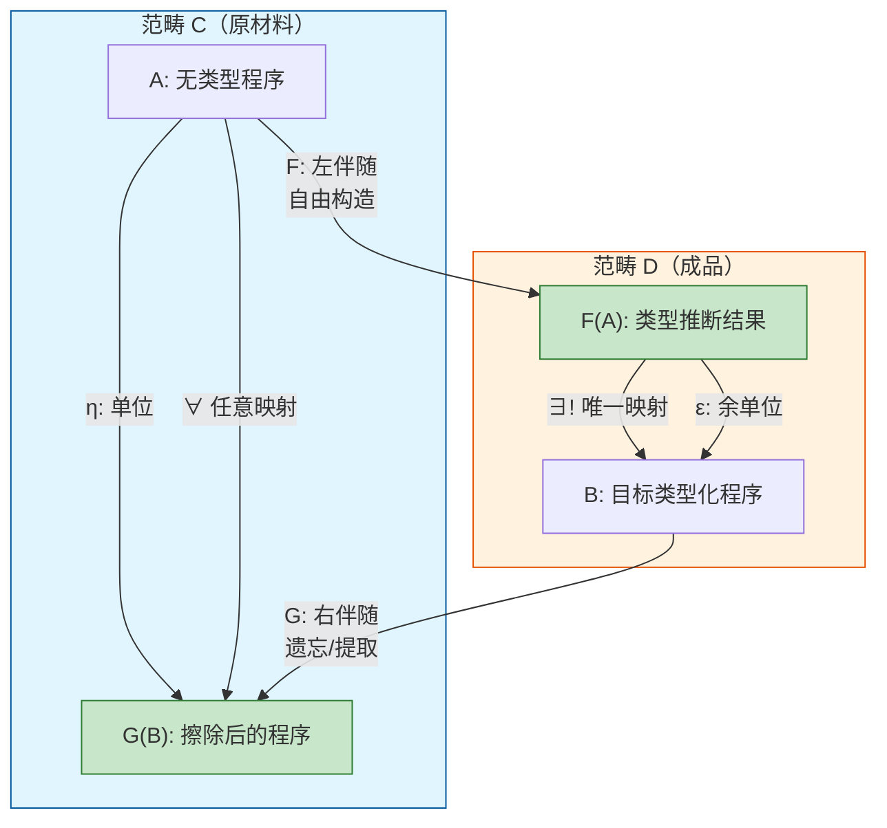
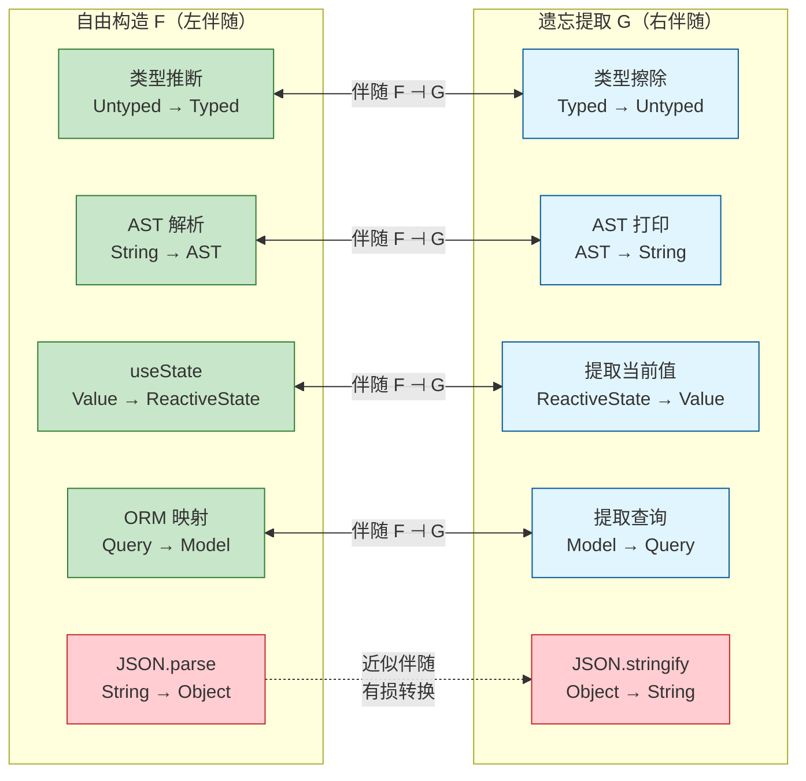

# 伴随与自由遗忘对：从类型推断到编译器设计的深层结构

> **理论深度**: 研究生级别
> **前置知识**: 范畴论基础（范畴、函子、自然变换）
> **目标读者**: 编译器开发者、类型系统研究者、框架设计者

---

## 引言

想象你正在编写 TypeScript 编译器的一个核心模块，面对三个看似毫不相关的问题：

**问题 A：类型推断**。给定无类型标注的函数 `const add = (x, y) => x + y`，编译器如何推断出 `x: number, y: number => number`？更准确地说，如何保证推断出的类型是"最一般"的——不会过度约束，也不会遗漏约束？

**问题 B：AST 降级**。你需要将 ES2020 的 `optional chaining`（`a?.b?.c`）降级为 ES5 代码。降级的结果不是唯一的：可以生成嵌套的 `if` 语句，也可以生成三元表达式。哪一种才是"最标准"的降级？

**问题 C：IDE 自动补全**。当用户输入 `arr.` 时，IDE 需要列出所有 Array 的方法。但某些方法（如 `push`）在只读数组上不可用。如何确保补全建议既"完整"（不错过合法方法）又"精确"（不提议非法方法）？

这三个问题的底层结构是同一个数学概念——**伴随函子**（Adjunction）。理解伴随，不仅能让你看穿这些问题的统一本质，还能告诉你：为什么类型推断有唯一最优解、为什么降级有标准形式、为什么补全有精确边界。

伴随函子是范畴论中最强大的概念之一。从 Daniel Kan 在 1958 年首次提出，到 Lambek 与 Scott 将其引入逻辑学，再到今天在编译器设计、类型推断和框架抽象中的隐性存在，伴随理论已经成为连接抽象数学与工程实践的关键桥梁。

---

## 理论严格表述

### 伴随的定义：Hom-集的自然同构

两个函子 $F: \mathbf{C} \to \mathbf{D}$（左函子）和 $G: \mathbf{D} \to \mathbf{C}$（右函子）构成**伴随**，记作 $F \dashv G$，如果对于所有 $A \in \mathbf{C}$ 和 $B \in \mathbf{D}$，存在集合间的**自然同构**：

$$
Hom_\mathbf{D}(F(A), B) \cong Hom_\mathbf{C}(A, G(B))
$$

这个公式读作：从 $F(A)$ 到 $B$ 的态射（在 $\mathbf{D}$ 中），与从 $A$ 到 $G(B)$ 的态射（在 $\mathbf{C}$ 中），之间存在一一对应。而且这种对应是"自然的"——不依赖于具体选择 $A$ 和 $B$。

**编程翻译**：假设 $\mathbf{C}$ 是"无类型程序"的范畴，$\mathbf{D}$ 是"类型化程序"的范畴。

- $F$ 是"类型推断"：从无类型程序构造类型化程序。
- $G$ 是"类型擦除"：从类型化程序提取无类型代码。

伴随关系 $F \dashv G$ 意味着：给定无类型程序 $p$ 和类型化程序 $q$，对 $p$ 做类型推断后再映射到 $q$，等价于先对 $q$ 做类型擦除，再将 $p$ 映射到擦除结果。

### 单位与余单位

伴随 $F \dashv G$ 诱导出两个自然变换：

**单位**（Unit）$\eta: id_\mathbf{C} \Rightarrow G \circ F$：

$$
\eta_A: A \to G(F(A))
$$

对于 $\mathbf{C}$ 中的任意对象 $A$，存在从 $A$ 到 $G(F(A))$ 的态射。在编程中，这是"将原材料放入模具，再用检测仪检查"——通常会得到比原始材料"更结构化"的版本。

**余单位**（Counit）$\varepsilon: F \circ G \Rightarrow id_\mathbf{D}$：

$$
\varepsilon_B: F(G(B)) \to B
$$

对于 $\mathbf{D}$ 中的任意对象 $B$，存在从 $F(G(B))$ 到 $B$ 的态射。在编程中，这是"先对成品做检测提取原材料，再用模具重新塑造"——通常会有信息损失，因为检测仪是保守的（只提取显式信息）。

### 自由-遗忘伴随：编程中最常见的伴随

这是伴随的经典数学例子，也是理解"自由构造"的最佳起点。

**遗忘函子** $U: \mathbf{Grp} \to \mathbf{Set}$：将一个群"遗忘"为其底层集合。群的乘法运算、单位元、逆元都被遗忘，只剩下元素集合。

**自由函子** $F: \mathbf{Set} \to \mathbf{Grp}$：从一个集合构造**自由群**。自由群的元素是该集合中元素的有限序列（字），群运算是字的连接，然后通过等价关系消除逆元对（如 $a a^{-1} = e$）。

**伴随关系** $F \dashv U$ 意味着：

$$
Hom_\mathbf{Grp}(F(S), G) \cong Hom_\mathbf{Set}(S, U(G))
$$

从自由群 $F(S)$ 到任意群 $G$ 的群同态，与从集合 $S$ 到 $G$ 的底层集合 $U(G)$ 的函数，之间存在一一对应。

**编程意义**：如果你想在一个群 $G$ 中"解释"集合 $S$ 的元素，你不需要预先定义群同态——你只需要定义一个从 $S$ 到 $G$ 底层集合的任意函数，自由群的普遍性质会自动将它扩展为群同态。

### 伴随与极限：保持结构的数学保证

**定理**：如果 $F \dashv G$，则 $F$ 保持余极限（Colimits）。即：

$$
F(\text{colim}\, D) \cong \text{colim}\,(F \circ D)
$$

**定理**：如果 $F \dashv G$，则 $G$ 保持极限（Limits）。即：

$$
G(\text{lim}\, D) \cong \text{lim}\,(G \circ D)
$$

这个定理的编程意义在于：它告诉我们哪些操作在转换后是"安全的"。如果你正在写一个**代码生成器**（左伴随 $F$），你可以放心地使用联合类型、枚举、`switch` 表达式——因为它们对应余极限，而左伴随保证保持余极限。如果你正在写一个**代码分析器**（右伴随 $G$），你可以放心地使用交集类型、接口组合、多重约束——因为它们对应极限，而右伴随保证保持极限。

---

## 工程实践映射

### 类型推断作为自由构造

这是编程中最重要的伴随实例。

**遗忘函子** $U: \mathbf{Typed} \to \mathbf{Untyped}$：将类型化程序擦除为无类型程序。类型标注、泛型参数、接口约束都被移除。

**自由函子** $F: \mathbf{Untyped} \to \mathbf{Typed}$：对无类型程序进行**最一般的类型推断**（Hindley-Milner 类型推断）。

```typescript
// 正例：类型推断作为自由构造
const untyped = `
    const f = x => x;
    const g = (x, y) => x + y;
`;

// 自由构造（类型推断）生成最一般类型
const inferred = `
    const f = <T>(x: T): T => x;           // 最一般：多态恒等函数
    const g = (x: number, y: number): number => x + y;
`;

// 遗忘（类型擦除）
const erased = `
    const f = x => x;
    const g = (x, y) => x + y;
`;

// 伴随性质：对 erased 重新推断，得到的结果不会比 inferred 更精确
// infer(erase(inferred)) ≤ inferred（在子类型序中）
```

**反例：不是所有构造都有左伴随**

```typescript
// 考虑：从类型化程序构造"优化的类型化程序"
function optimize(typed: TypedProgram): TypedProgram {
    // 常量折叠、死代码消除等
    return optimized;
}

// "优化"不是一个自由构造，因为：
// 1. 它不是"最一般"的——优化的目标是特殊化，不是一般化
// 2. 没有对应的"遗忘"操作能让伴随关系成立
// 3. 两个不同的无类型程序可能优化为同一个类型化程序
```

为什么会错？自由构造的核心特征是**普遍性质**（Universal Property）：对于任意目标对象，从自由构造出发的映射与从原材料出发的映射一一对应。优化操作不满足这个性质。

### IDE 自动补全的伴随语义

IDE 的自动补全可以形式化为伴随：

```typescript
// C: 部分程序（Partial Programs）的范畴
// D: 完整程序（Complete Programs）的范畴

// F: 自动补全 —— 从部分程序构造最自由的完整程序
function autocomplete(partial: string): string[] {
    const suggestions = typeChecker.getCompletionsAtPosition(partial);
    return suggestions;
}

// G: 部分化 —— 从完整程序提取部分程序（删除光标后的内容）
function partialize(complete: string, cursorPos: number): string {
    return complete.slice(0, cursorPos);
}
```

**伴随关系**：对于任意部分程序 $p$ 和完整程序 $q$：

$$
\text{autocomplete}(p) \ni q \iff p = \text{partialize}(q)
$$

**反例：过度自由的补全建议**

```typescript
// 反例：补全建议过于宽泛，包含语义上不合法的方法
interface ReadonlyArray<T> {
    readonly length: number;
    map<U>(fn: (x: T) => U): ReadonlyArray<U>;
    // push 不应该出现在 ReadonlyArray 的补全中！
}

const arr: readonly number[] = [1, 2, 3];
arr.  // 如果 IDE 只查 Array 的方法，会建议 push —— 运行时错误！
```

自动补全作为"自由构造"，如果不考虑类型的精确语义，会生成"语法合法但语义非法"的建议。真正的伴随要求 $F(A)$ 是"最一般但合法"的构造。

### React Hooks 与状态提升的伴随结构

React 的 `useState` 可以看作是从普通值到"响应式状态对象"的自由构造：

```typescript
// F: useState —— 自由构造
function useState<T>(initial: T): [T, (v: T | ((prev: T) => T)) => void] {
    return [currentValue, setValue];
}

// G: 提取当前值 —— 遗忘/保守提取
function extractValue<T>(state: [T, (v: T) => void]): T {
    return state[0];  // 只提取当前值，遗忘更新能力
}
```

**反例：过度提升导致的 props drilling**

```typescript
// 反例：将状态过度提升到不合适的层级
function App() {
    const [theme, setTheme] = useState('light');
    return (
        <div>
            <Header theme={theme} setTheme={setTheme} />
            <Main theme={theme} />
            <Footer theme={theme} />
            <DeepChild />  {/* DeepChild 不需要 theme！ */}
        </div>
    );
}
```

为什么会错？状态提升本质上是将局部状态 $F(A)$ 提升到更大的范畴上下文中。但如果提升过度，会导致"props drilling"——中间组件被迫传递它们不使用的数据。从伴随视角看，这是**余单位 $\varepsilon$ 的误用**。你应该只在真正需要 $F(A)$ 的完整结构（值 + 更新能力）的组件中使用它。

### JSON 序列化的伴随分析

```typescript
// F: JSON.parse —— 从字符串构造对象（自由构造）
function parseJSON(json: string): unknown {
    return JSON.parse(json);
}

// G: JSON.stringify —— 从对象提取字符串（遗忘/保守提取）
function stringifyJSON(obj: unknown): string {
    return JSON.stringify(obj);
}

// 反例：这不是严格的伴随！
const obj = { fn: () => 42 };
const str = stringifyJSON(obj);  // "{}" —— 函数被丢失！
const restored = parseJSON(str);  // {} —— 不等于原始对象！
```

`JSON.stringify` 是严重的"遗忘"操作——丢失函数、原型链、循环引用等，所以 `parse` 和 `stringify` 不构成严格的伴随对。这解释了为什么 JSON 序列化总是"有损"的。

---

## Mermaid 图表

### 伴随函子的核心结构



### 自由-遗忘伴随在编程中的实例谱系



### 左伴随保持余极限 vs 右伴随保持极限

```mermaid
graph LR
    subgraph "极限与余极限的保持"
        direction TB
        L["极限 Limit<br/>交集类型 / 接口组合<br/>对应：右伴随保持"]
        C["余极限 Colimit<br/>联合类型 / 枚举<br/>对应：左伴随保持"]
    end
    
    subgraph "编程实例"
        direction TB
        PL["右伴随 G<br/>类型擦除 / 代码分析<br/>保持 & 运算<br/>保持接口组合"]
        PR["左伴随 F<br/>类型推断 / 代码生成<br/>保持 &#124; 运算<br/>保持 switch/枚举"]
    end
    
    L --> PL
    C --> PR
    
    style L fill:#e1f5fe,stroke:#01579b
    style C fill:#fff3e0,stroke:#e65100
    style PL fill:#e1f5fe,stroke:#01579b
    style PR fill:#fff3e0,stroke:#e65100
```



---

## 理论要点总结

### 核心洞察

1. **"最一般"的精确定义**：在类型推断中，伴随理论告诉我们——类型推断是遗忘函子的**左伴随**，左伴随的普遍性质保证了"最一般"是数学上良好定义的，不是工程上的近似。

2. **构造与解析的对偶性**：编译器前端将源代码解析为 AST（构造），后端将 AST 生成为机器码（构造）。这些"构造"操作都有对应的"遗忘"或"提取"操作。伴随理论揭示了它们之间的精确对偶关系。

3. **极限/余极限的保持性**：左伴随保持余极限，右伴随保持极限。这个定理解释了为什么类型推断保持联合类型（余极限），而类型擦除保持交集类型（极限）——不是巧合，而是数学必然。

### 对称差分析：自由构造 vs 其他构造方式

| 维度 | 自由构造（左伴随） | 余自由构造（右伴随） | 直接手动实现 |
|------|------------------|-------------------|-------------|
| **方向** | 从简单到复杂 | 从简单到复杂 | 任意方向 |
| **构造原则** | "不添加不必要的约束" | "不丢失必要的信息" | 依赖开发者判断 |
| **编程实例** | 类型推断、AST 解析 | 终对象构造、乘积类型 | 优化、特殊化 |
| **保持结构** | 保持余极限 | 保持极限 | 无保证 |
| **开发速度** | 快：自动生成 | 快：自动提取 | 慢：手写逻辑 |
| **灵活性** | 低：遵循通用模式 | 低：保守提取 | 高：可优化 |
| **正确性保证** | 高：数学性质保证 | 高：数学性质保证 | 依赖水平 |

### 决策矩阵：什么时候用自由构造

| 条件 | 推荐自由构造 | 推荐手动实现 |
|------|-------------|-------------|
| 需要保证"最一般"语义 | ✅ 类型推断、AST 生成 | ❌ 手动容易过度约束 |
| 性能是首要考量 | ❌ 通用实现有 overhead | ✅ 手动优化热点路径 |
| 领域特定语义复杂 | ❌ 自由构造可能不够表达力 | ✅ DSL 专用实现 |
| 需要严格数学保证 | ✅ 伴随性质提供保证 | ❌ 需单独证明 |
| 快速原型开发 | ✅ 自动生成 boilerplate | ❌ 手写耗时 |

### 精确直觉类比：模具与脱模器

**伴随函子对像是一套工业模具系统**。

- **左伴随 $F$ 是"模具"**：你给它一块原材料，它按照最标准的形状塑造出一个产品。模具的设计原则是：**不添加任何不必要的约束**——产品刚好能被模具塑造出来，不多也不少。

- **右伴随 $G$ 是"脱模器/检测仪"**：你给它一个成品，它提取出其中的原材料信息。检测仪的设计原则是：**不猜测任何不存在的信息**——如果成品上没标注某些信息，检测仪不会凭空编造。

- **伴随关系 $F \dashv G$ 的物理意义**：你可以先用模具把原材料 $A$ 塑造成标准形状 $F(A)$，然后在成品范畴中把它加工成 $B$；或者你可以跳过模具，直接在原材料范畴中把 $A$ 加工成 $G(B)$。两种路径一一对应，没有信息损失也没有信息增益。

**适用边界**：

- ✅ 准确传达了"构造 vs 提取"的不对称性
- ✅ 准确传达了伴随的核心性质——两种路径的等价性
- ✅ 准确传达了"自由"的直觉
- ❌ 没有涵盖"单位"和"余单位"的数学细节
- ❌ 现实中的模具可能有物理损耗，但伴随是同构——信息完全保留

---

## 参考资源

### 权威著作

1. Pierce, B. C. (2002). *Types and Programming Languages*. MIT Press. (Ch. 30) —— 类型系统与范畴论的经典教材，详细论述了类型推断与伴随的等价关系。

2. Awodey, S. (2010). *Category Theory* (2nd ed.). Oxford University Press. (Ch. 9) —— 伴随函子的标准数学处理，包含自由-遗忘伴随的完整证明。

3. Riehl, E. (2016). *Category Theory in Context*. Dover. (Ch. 4) —— 以现代视角阐述伴随理论，强调极限保持定理及其应用。

4. Lambek, J., & Scott, P. J. (1986). *Introduction to Higher-Order Categorical Logic*. Cambridge University Press. —— 将伴随引入逻辑学的奠基之作，证明量词、模态算子都是伴随。

5. Kan, D. M. (1958). "Adjoint Functors." *Transactions of the American Mathematical Society*, 87(2), 294-329. —— 伴随函子的原始论文。

### 编程语言与编译器

6. Harper, R. (2016). *Practical Foundations for Programming Languages* (2nd ed.). Cambridge University Press. —— 从范畴论语义角度理解编程语言设计。

7. Wadler, P. (2003). "Call-by-Value is Dual to Call-by-Name." *ICFP 2003*. —— 伴随在计算中的对偶性，揭示了求值策略的深层数学结构。

8. Appel, A. W. (1998). *Modern Compiler Implementation in ML*. Cambridge University Press. —— SSA 形式与编译器 IR 转换的实践指南。

9. Cytron, R., et al. (1991). "Efficiently Computing Static Single Assignment Form and the Control Dependence Graph." *ACM TOPLAS*, 13(4), 451-490. —— SSA 形式的经典论文。

### 进阶阅读

10. Thielecke, H. (1997). "Continuation Semantics and Self-adjointness." *MFPS 1997*. —— 续体语义中的自伴随结构。

11. Benton, P. N. (1994). "A Mixed Linear and Non-Linear Logic: Proofs, Terms and Models." *CSL 1994*. —— 线性逻辑与伴随的连接。
