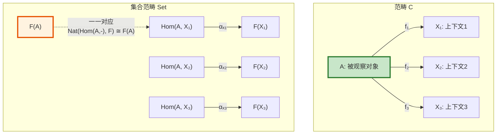
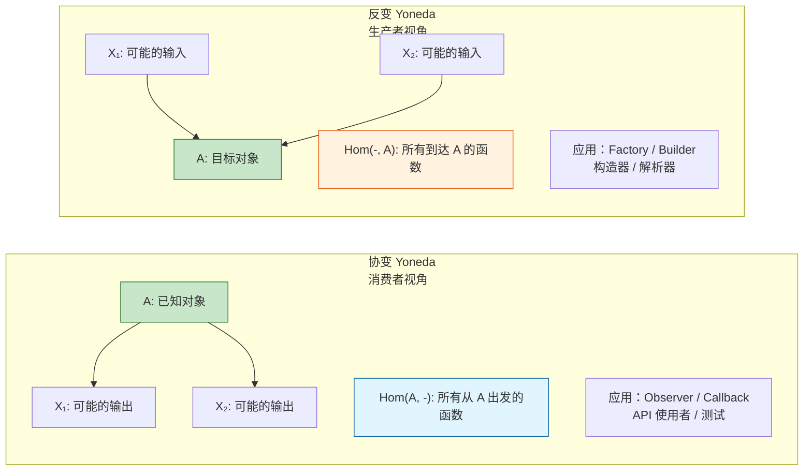
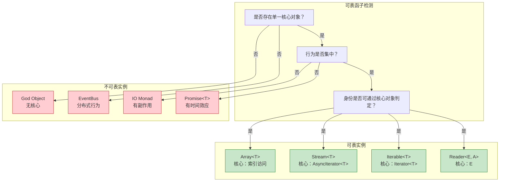
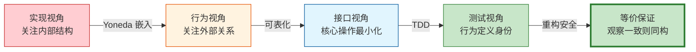

# Yoneda 引理与可表函子：通过行为理解对象的深层原理

> **理论深度**: 研究生级别
> **前置知识**: 范畴论基础（范畴、函子、自然变换、Hom-集）
> **目标读者**: API 设计者、架构师、测试工程师

---

## 引言

2022 年，一个团队重构了他们的用户认证系统。旧的实现用 session cookie，新的实现用 JWT。重构完成后，所有的单元测试都通过了——但集成测试在 staging 环境失败了三天后才被发现。

问题出在哪里？单元测试检查了 `AuthService` 的内部方法：`generateToken` 返回的字符串是否包含三个点（JWT 格式）、`verifyToken` 是否调用了正确的加密库。但这些测试没有检查真正重要的行为：**"当用户登录后，受保护的 API 是否允许访问？"**

重构改变了实现（从 session 到 JWT），但理论上行为应该不变。如果测试真正关注的是"行为"而非"实现细节"，重构就不应该破坏测试。

Yoneda 引理的核心洞察与此直接相关：**一个对象（如 `AuthService`）完全由它与其他对象（如受保护 API、用户输入、权限系统）的关系决定**。如果你只测试内部实现，你测试的是"成分"；如果你测试外部行为，你测试的是"关系"——而 Yoneda 引理告诉我们，**关系才是本质**。

这个引理由日本数学家 Nobuo Yoneda 在 1954 年发现，后经 Saunders Mac Lane 推广到任意范畴。它被称为"范畴论中最重要的定理"——不是因为它的证明复杂（事实上它出奇地简单），而是因为它揭示了一个深刻的真相：**对象的身份不由其内部结构决定，而由它与所有其他对象的关系决定**。

---

## 理论严格表述

### 协变 Yoneda 引理

设 $\mathbf{C}$ 是一个局部小范畴（locally small，即任意两个对象之间的态射构成集合），$F: \mathbf{C} \to \mathbf{Set}$ 是一个从 $\mathbf{C}$ 到集合范畴的函子，$A$ 是 $\mathbf{C}$ 中的一个对象。

**协变 Yoneda 引理**说：

$$
Nat(Hom(A, -), F) \cong F(A)
$$

这个公式读作：从可表函子 $Hom(A, -)$ 到函子 $F$ 的**自然变换**的集合，与集合 $F(A)$ 的元素之间存在一一对应（双射）。

让我们拆解每个符号：

- $Hom(A, -)$ 是**可表函子**（Representable Functor）。对于 $\mathbf{C}$ 中的任意对象 $X$，$Hom(A, X)$ 是从 $A$ 到 $X$ 的所有态射的集合。在编程中，这对应"所有以 $A$ 为输入的函数类型"。
- $Nat(-, -)$ 表示两个函子之间的**自然变换**的集合。自然变换是函子间的"结构保持映射"。
- $F(A)$ 是函子 $F$ 作用在对象 $A$ 上的结果——一个集合。
- $\cong$ 表示集合之间的**双射**（一一对应）。

**这个公式在说什么？**

它说：要理解 $F(A)$ 是什么，你不需要直接看 $A$ 的内部结构。你只需要观察所有"从 $Hom(A, -)$ 到 $F$ 的自然变换"。换句话说，**$F(A)$ 的元素与"在 $F$ 的视角下观察 $A$ 的行为方式"一一对应**。

### 反变 Yoneda 引理

如果 $G: \mathbf{C}^{op} \to \mathbf{Set}$ 是一个**反变函子**（即从 $\mathbf{C}$ 的对偶范畴到集合范畴的函子），那么：

$$
Nat(Hom(-, A), G) \cong G(A)
$$

**$Hom(-, A)$ 的含义**：对于 $\mathbf{C}$ 中的任意对象 $X$，$Hom(X, A)$ 是从 $X$ 到 $A$ 的所有态射的集合。在编程中，这对应"所有以 $A$ 为输出的函数类型"，或者说"所有可以生成 $A$ 的方式"。

**协变 vs 反变的编程对应**：

- 协变 Yoneda 对应"输出视角"：给定 $A$，观察所有"从 $A$ 出发能到达哪里"。对应编程中的**消费者**（Consumer）或**观察者**（Observer）。
- 反变 Yoneda 对应"输入视角"：给定 $A$，观察所有"能到达 $A$ 的方式"。对应编程中的**生产者**（Producer）或**构造器**（Constructor）。

### 证明的程序员版本

Yoneda 引理的证明出奇地简洁，核心在于恒等态射的"魔法"。

**从自然变换到元素：观察恒等态射**

给定自然变换 $\alpha: Hom(A, -) \Rightarrow F$，我们如何提取 $F(A)$ 中的一个元素？

答案是：**观察 $A$ 到自身的恒等态射** $id_A: A \to A$。

$$\alpha_A(id_A) \in F(A)$$

将自然变换 $\alpha$ 在对象 $A$ 处的分量应用于恒等态射 $id_A$，得到的结果就是 $F(A)$ 中的一个元素。

**从元素到自然变换：通过函子作用传播**

给定 $x \in F(A)$，我们如何构造自然变换 $\alpha: Hom(A, -) \Rightarrow F$？

对于每个对象 $B$ 和每个态射 $f: A \to B$，定义：

$$\alpha_B(f) = F(f)(x)$$

自然变换在 $B$ 处的分量作用于 $f$，等于先将 $x$ 通过函子 $F$ 的作用 $F(f)$ 映射到 $F(B)$。

```typescript
// Yoneda 引理的完整 TypeScript 表达

// 可表函子 Hom(A, -): 给定 A，将任意类型 X 映射为 (A -> X)
type Representable<A, X> = (a: A) => X;

// 一个函子 F 需要满足 map 操作
interface Functor<F> {
    map<A, B>(f: (a: A) => B): (fa: F<A>) => F<B>;
}

// Yoneda 引理：Nat(Hom(A, -), F) ≅ F(A)
// 方向 1: 自然变换 -> F(A)
function yonedaTo<F>(
    functor: Functor<F>,
    naturalTransform: <X>(f: Representable<any, X>) => F<X>
): F<any> {
    const id = <A>(a: A): A => a;
    return naturalTransform(id);
}

// 方向 2: F(A) -> 自然变换
function yonedaFrom<F, A>(
    functor: Functor<F>,
    element: F<A>
): <X>(f: Representable<A, X>) => F<X> {
    return <X>(f: Representable<A, X>): F<X> =>
        functor.map(f)(element);
}
```

### 可表函子：当行为可以被"集中"表示

函子 $F$ 是**可表的**（Representable），如果存在对象 $A$ 使得 $F \cong Hom(A, -)$。

```typescript
// Reader Monad 是最经典的可表函子
// Reader<E, A> = (e: E) => A = Hom(E, A)

type Reader<E, A> = (env: E) => A;

// Reader 的函子性
function readerMap<E, A, B>(f: (a: A) => B): (r: Reader<E, A>) => Reader<E, B> {
    return (r) => (env) => f(r(env));
}

// Reader 是可表的：代表对象就是环境类型 E
// Reader<E, A> ≅ Hom(E, A)

// 正例：依赖注入作为可表函子
interface Config {
    apiUrl: string;
    timeout: number;
}

type Configured<A> = Reader<Config, A>;

const fetchUsers: Configured<Promise<User[]>> =
    (config) => fetch(`${config.apiUrl}/users`, { timeout: config.timeout });

// 所有依赖 Config 的操作都可以统一为 Reader
// 这正是因为 Configured<A> ≅ Hom(Config, A)
```

**反例：Promise 函子不是可表的**

```typescript
// 如果 Promise 是可表的，应该存在某个对象 A 使得 Promise<X> ≅ Hom(A, X)

// 但 Promise 携带了时间语义（异步），这是 Hom(A, X) 无法表达的
// Hom(A, X) 是纯函数 A -> X，没有延迟、没有失败的可能

// 因此，不存在对象 A 使得 Promise<X> ≅ Hom(A, X)
// Promise 是单子，但不是可表函子
```

可表函子对应"纯输入-输出"关系，没有任何额外的计算效应。如果函子只封装了"纯数据转换"而没有副作用（如 `Array`、`Tree`、`Maybe`），它可能是可表的。如果函子封装了效应（如 `Promise`、`IO`、`State`），它通常不可表。

---

## 工程实践映射

### 测试作为 Yoneda 观察

```typescript
// 正例：Yoneda 视角的测试——只观察外部行为
interface Calculator {
    add(a: number, b: number): number;
    multiply(a: number, b: number): number;
}

// 好的测试：观察 Calculator 在所有可能的输入下的行为
function testCalculator(calc: Calculator): boolean {
    // 恒等观察（对应 id_A）
    if (calc.add(2, 3) !== 5) return false;

    // 组合观察（对应态射组合）
    const result = calc.multiply(calc.add(1, 2), 4);
    if (result !== 12) return false;

    // 边界观察
    if (calc.add(0, 0) !== 0) return false;

    return true;
}

// 任何通过所有测试的 Calculator 实现，在行为上与预期同构
// Yoneda 保证了：如果观察完全一致，对象在范畴中就相同
```

**反例：过度测试实现细节**

```typescript
// 反例：测试实现细节而非行为
class CalculatorImpl implements Calculator {
    private history: string[] = [];  // 内部状态

    add(a: number, b: number): number {
        this.history.push(`add(${a}, ${b})`);
        return a + b;
    }

    multiply(a: number, b: number): number {
        this.history.push(`multiply(${a}, ${b})`);
        return a * b;
    }
}

// 糟糕的测试：依赖内部状态
describe('CalculatorImpl', () => {
    it('should record history', () => {
        const calc = new CalculatorImpl();
        calc.add(2, 3);
        expect(calc['history']).toEqual(['add(2, 3)']);  // ❌ 依赖私有字段！
    });
});
```

为什么会错？这个测试观察的不是 `Calculator` 的外部行为，而是 `CalculatorImpl` 的内部实现细节。Yoneda 视角告诉我们：私有字段 `history` 不是 `Calculator` 的范畴论身份的一部分——它是实现层面的偶然属性。如果去掉 `history` 优化性能，测试崩溃但行为没变。

**如何修正**：只测试公开行为，不依赖内部状态。

### API 的"可表性"设计

```typescript
// 正例：可表的 API 设计——核心操作最小化
interface Stream<T> {
    // 核心操作（可表的"代表对象"）
    [Symbol.asyncIterator](): AsyncIterator<T>;
}

// 所有其他操作都可以通过核心操作派生
async function toArray<T>(stream: Stream<T>): Promise<T[]> {
    const result: T[] = [];
    for await (const item of stream) {
        result.push(item);
    }
    return result;
}

async function map<T, U>(stream: Stream<T>, f: (t: T) => U): Stream<U> {
    return {
        async *[Symbol.asyncIterator]() {
            for await (const item of stream) {
                yield f(item);
            }
        }
    };
}

// 因为 Stream 是可表的（由 AsyncIterator 代表），
// 任何消费 Stream 的代码只需要知道如何获取 AsyncIterator
// 这极大地降低了系统复杂度
```

**反例：不可表的 God Object**

```typescript
// 反例：God Object 是不可表的——它没有单一的核心操作
class GodObject {
    connectToDatabase(): void {}
    sendEmail(): void {}
    renderUI(): void {}
    calculateTaxes(): void {}
    logActivity(): void {}
    validateInput(): void {}
    // ... 更多方法
}

// 不可表意味着：无法找到一个"代表对象"来集中描述 GodObject 的行为
// 你必须同时了解所有方法才能使用它
```

Yoneda 视角的批评：God Object 的行为无法被 `Hom(A, -)` 捕捉，因为 $A$ 本身过于复杂。每个使用场景只需要 GodObject 的一个小子集，但却被迫依赖整个类。修正方法是拆分为多个可表的、职责单一的接口。

### Yoneda 嵌入与接口优先设计

**Yoneda 嵌入**是一个函子 $y: \mathbf{C} \to \mathbf{Set}^{\mathbf{C}^{op}}$，将每个对象 $A$ 映射到可表函子 $Hom(-, A)$。

**Yoneda 引理的核心推论**：$y$ 是**完全忠实的**（Fully Faithful）。这意味着：

$$
Hom_\mathbf{C}(A, B) \cong Hom_{\mathbf{Set}^{\mathbf{C}^{op}}}(y(A), y(B))
$$

在原始范畴 $\mathbf{C}$ 中从 $A$ 到 $B$ 的态射，与在函子范畴中从 $y(A)$ 到 $y(B)$ 的自然变换，之间存在一一对应。

**编程翻译**：

```typescript
// Yoneda 嵌入说：对象 A 可以被完全替代为 "所有以 A 为输出的函数"
// 这在编程中对应 "接口替代实现" 的原则

interface Service {
    process(input: string): number;
}

// Yoneda 视角：Service 不是"一个有 process 方法的类"
// Service 是"所有需要 Service 的代码片段的集合"

function client1(service: Service): string {
    return String(service.process("hello"));
}

function client2(service: Service): boolean {
    return service.process("world") > 0;
}

// Service 的"身份"由 client1、client2 和所有其他使用者的行为共同决定
// 任何实现了 process 的对象，只要在这些客户端中表现一致，就是"相同的 Service"
```

Yoneda 嵌入定理在编程中的终极意义：**接口是对象在范畴论中的真正身份，实现只是接口的一个具体代表**。

### Yoneda 引理在测试驱动开发中的应用

Yoneda 引理为测试驱动开发（TDD）提供了理论基础：

```typescript
// Yoneda TDD 原则：测试定义行为，行为定义身份

// 测试 = Yoneda 视角下的"观察"
// 如果两个实现通过所有相同的测试，它们在行为上等价
function testCalculator(calc: Calculator): boolean {
  // 恒等态射的测试（Yoneda 中的 id）
  if (calc.add(0, 5) !== 5) return false;
  if (calc.multiply(1, 7) !== 7) return false;

  // 组合测试（Yoneda 中的态射复合）
  const a = 2, b = 3, c = 4;
  if (calc.multiply(a, calc.add(b, c)) !==
      calc.add(calc.multiply(a, b), calc.multiply(a, c))) {
    return false;
  }

  return true;
}
```

**核心洞察**：

1. **充分的测试集**可以完全刻画一个实现的语义
2. **两个实现如果通过相同的测试集，它们在行为上等价**（即使内部实现完全不同）
3. **测试的完备性**对应于观察函子的"忠实性"——测试是否足够"精细"以区分不同的实现

**反例：测试不完备的情况**

```typescript
// 不完备的测试：只测试了正常路径
function incompleteTest(calc: Calculator): boolean {
  return calc.add(1, 2) === 3;
}

// 两个实现都通过测试，但行为不同！
const goodCalc: Calculator = {
  add: (a, b) => a + b,
  multiply: (a, b) => a * b
};

const badCalc: Calculator = {
  add: (a, b) => a + b,
  multiply: (a, b) => 0  // 错误的实现！
};

// 不完备的测试无法区分 goodCalc 和 badCalc
// 这对应于 Yoneda 中观察函子不够"精细"的情况
```

---

## Mermaid 图表

### Yoneda 引理的核心结构



### 协变 vs 反变 Yoneda 的编程对应



### 可表函子的工程检测谱系



### Yoneda 视角下的设计演进



---

## 理论要点总结

### 核心洞察

1. **"接口比实现更根本"是数学定理，不是工程偏好**。Yoneda 嵌入定理说：任何范畴都可以**忠实地**嵌入到它的函子范畴中。这意味着：**研究一个对象在所有可能的上下文中的行为，等价于研究对象本身**。

2. **测试的不变性有数学基础**。当你写测试时，你在做 Yoneda 的"观察"。好的测试观察的是"对象如何响应外部刺激"（即 Hom-集上的行为），而不是"对象内部有什么"。Yoneda 引理保证了：如果你观察到了所有外部行为，你就完全确定了这个对象。

3. **可表函子揭示了设计模式的最小核心**。很多设计模式（迭代器、访问者、策略）本质上是"可表函子"的实例——它们的核心思想是：**一种行为如果能被"集中"到一个代表性对象上描述，那么整个系统的复杂度就会降低**。

### 对称差分析：协变 vs 反变 Yoneda

| 场景 | 协变 Yoneda（消费者） | 反变 Yoneda（生产者） |
|------|---------------------|---------------------|
| **测试策略** | 黑盒测试：给定输入，观察输出 | 白盒构造：验证所有构造路径 |
| **API 设计** | 设计消费者接口（Observer、Callback） | 设计工厂接口（Builder、Factory） |
| **重构安全** | 检查所有使用点是否行为一致 | 检查所有构造点是否语义等价 |
| **类型推导** | 输出类型推导（返回值类型） | 输入类型推导（参数类型） |
| **并发模型** | Actor 模型的消息处理 | 消息构造与序列化 |

### Yoneda 视角 vs 实现视角的对称差

```
Yoneda 视角 \ 实现视角 = {
  "行为定义身份",
  "接口优先于实现",
  "测试完备性作为等价判定",
  "可替换性保证"
}

实现视角 \ Yoneda 视角 = {
  "性能优化空间",
  "具体数据结构选择",
  "内存布局控制",
  "算法复杂度权衡"
}

交集 = {
  "正确性",
  "功能等价"
}
```

**工程启示**：

1. **设计阶段**：用 Yoneda 视角定义接口（"它做什么"）
2. **实现阶段**：用实现视角优化性能（"它怎么做"）
3. **测试阶段**：用 Yoneda 视角验证等价性（"行为是否一致"）
4. **重构阶段**：保持 Yoneda 视角不变，改变实现视角

### 精确直觉类比：面试了解候选人

**Yoneda 引理像是"通过面试来了解一个人"**。

想象你要了解一个候选人（对象 $A$）。你有两种策略：

**策略 1（实现视角）**：检查候选人的简历（内部结构）。他毕业于某大学、有五年经验、掌握某些技术栈。但简历可能造假，或者他的实际工作能力与简历不匹配。

**策略 2（Yoneda 视角）**：观察候选人在所有可能的面试问题（从 $A$ 出发的态射 $Hom(A, X)$）下的表现。你问他算法题、系统设计题、行为面试题——每个问题都是一个"上下文" $X$。他在每个上下文中的表现构成了他的"行为画像"。

Yoneda 引理说：**如果两个候选人在所有可能的面试问题下的表现完全相同，那么他们就是同一个人**（在范畴论的意义下）。不是"大概相同"，不是"功能上等价"，而是**数学上的同构**。

**适用范围**：

- ✅ 准确传达了"外部行为决定本质"的核心思想
- ✅ 准确传达了"所有可能的上下文"的重要性
- ✅ 准确传达了"一一对应"的精确性

**局限性**：

- ❌ 面试问题的集合在实践中是无限的，但在数学中 $Hom(A, X)$ 是一个良定义的集合
- ❌ 候选人的表现可能有随机性，但范畴论中的态射是确定性的
- ❌ 这个类比没有涵盖"自然性"条件——映射在上下文变化时必须"一致地"变化

---

## 参考资源

### 权威著作

1. Riehl, E. (2016). *Category Theory in Context*. Dover. (Ch. 2) —— Yoneda 引理的标准现代处理，包含完整的证明和丰富的例子。

2. Milewski, B. (2019). *Category Theory for Programmers*. Blurb. —— 面向程序员的范畴论入门，Yoneda 引理的直觉解释尤为出色。

3. Mac Lane, S. (1998). *Categories for the Working Mathematician*. Springer. —— 范畴论的圣经级著作，首次将 Yoneda 引理推广到一般范畴。

4. Yoneda, N. (1954). "On the Homology Theory of Modules." *J. Fac. Sci. Univ. Tokyo. Sect. I.*, 7, 193-227. —— Yoneda 引理的原始论文，在同调代数中首次发现这一普遍现象。

5. Leinster, T. (2014). *Basic Category Theory*. Cambridge University Press. (Ch. 4) —— 简洁明了的 Yoneda 引理讲解，适合快速掌握核心思想。

6. Awodey, S. (2010). *Category Theory* (2nd ed.). Oxford University Press. (Ch. 8) —— 从逻辑学角度阐述可表函子的意义。

### 编程实践

1. Martin, R. C. (2008). *Clean Code: A Handbook of Agile Software Craftsmanship*. Prentice Hall. —— "接口优于实现"的工程实践指南，Yoneda 引理为其提供了数学基础。

2. Freeman, S., & Pryce, N. (2009). *Growing Object-Oriented Software, Guided by Tests*. Addison-Wesley. —— 测试驱动开发的经典教材，与 Yoneda "行为定义身份"的视角高度一致。

3. Gamma, E., et al. (1994). *Design Patterns: Elements of Reusable Object-Oriented Software*. Addison-Wesley. —— 迭代器、访问者、策略等模式的可表函子本质分析。

### 在线资源

1. Bartosz Milewski 的博客系列 "Category Theory for Programmers"（免费在线版）—— 包含 Yoneda 引理的 Haskell 实现和直觉图解。

2. The nLab: "Yoneda lemma" —— 范畴论研究者协作维护的 wiki，提供最形式化的定义和最新研究进展。
