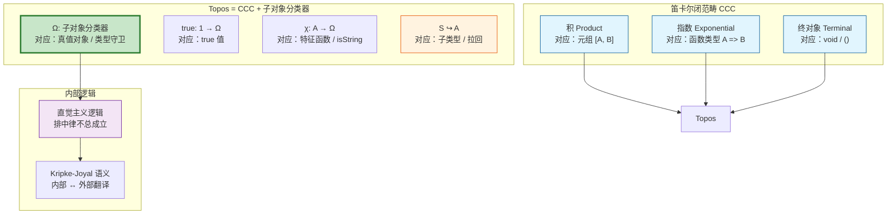
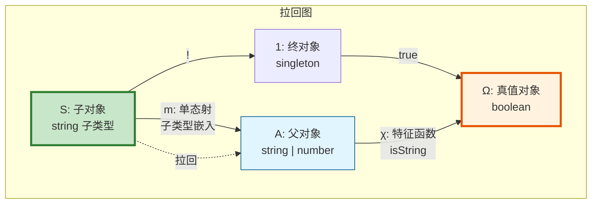
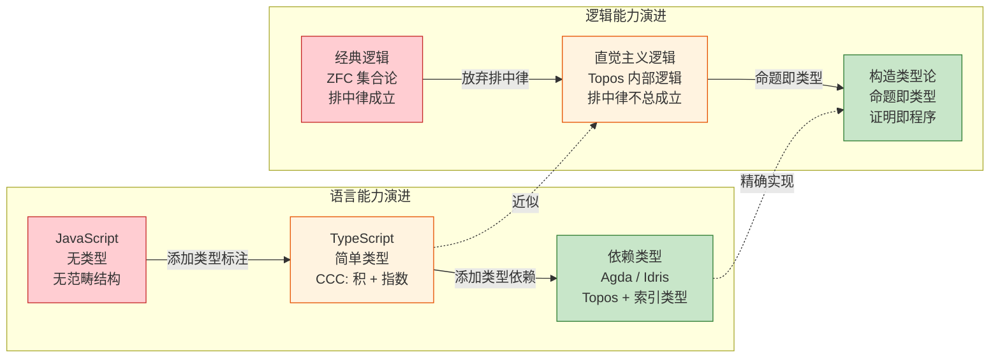
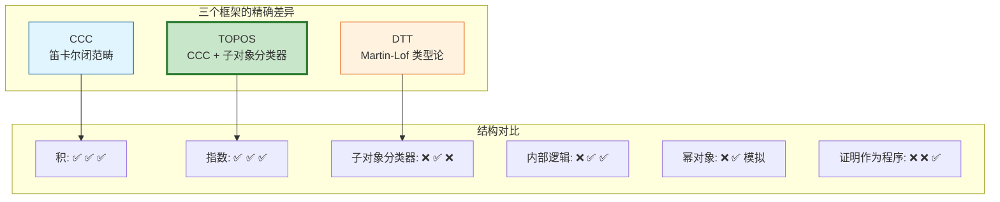

# Topos 理论与类型系统的内部逻辑

> **理论深度**: 高级研究生级别
> **前置知识**: 笛卡尔闭范畴（CCC）、范畴论基础
> **目标读者**: 类型理论研究者、形式化方法专家、语言设计者

---

## 引言

假设你写了这样一个 TypeScript 函数：

```typescript
function processValue(x: string | number): string {
  if (typeof x === "string") {
    return x.toUpperCase();
  } else {
    return x.toFixed(2);
  }
}
```

TypeScript 编译器知道在 `if` 分支内 `x` 是 `string`，在 `else` 分支内 `x` 是 `number`。这种"类型收窄"（Type Narrowing）看似自然，但它背后有一个深刻的数学事实：类型守卫 `typeof x === "string"` 对应 Topos 理论中的**特征函数**（Characteristic Function），而类型收窄对应**子对象分类器**（Subobject Classifier）的操作。

Topos 理论不仅解释了类型守卫，还解释了为什么 TypeScript 的类型系统不是经典逻辑、为什么 `unknown` 和 `never` 有特殊的范畴论语义、以及为什么某些"显然"的类型推导在 TS 中无法实现。

Topos（复数 Topoi）是范畴论中对"集合论"的推广。由 William Lawvere 在 1960 年代开创，它将集合论的核心结构（幂集、函数空间、子集判断）用范畴论语言重新表述。每个 Topos 都携带一个**内部逻辑**，这个逻辑是**直觉主义**的——排中律只在特殊的 Topos（布尔 Topos）中成立。这一事实对编程语言设计有深远影响：几乎所有现代类型系统（包括 TypeScript）都天然地是直觉主义的。

---

## 理论严格表述

### Topos 的定义：CCC + 子对象分类器

**Topos** 是一个范畴 $\mathbf{E}$，满足：

1. **有限极限存在**：$\mathbf{E}$ 有终对象（Terminal Object，对应单位类型 `void` 或 `()`）、积（Product，对应元组）、等化子（Equalizer，对应类型相等判断）。

2. **指数存在**：对于任意对象 $A, B$，存在对象 $B^A$，使得 $Hom(C \times A, B)$ 同构于 $Hom(C, B^A)$ 自然成立。这对应于"柯里化"（Currying）——将 `(C, A) -> B` 转换为 `C -> (A -> B)`。

3. **子对象分类器存在**：存在对象 $\Omega$ 和态射 $true: 1 \to \Omega$，使得对于任意单态射（monomorphism）$m: S \to A$，存在唯一的特征函数 $\chi: A \to \Omega$ 使得下图是**拉回**（Pullback）：

```
S -----> 1
|        |
m        | true
v        v
A --χ--> Omega
```

$S$ 是 $A$ 的一个子对象（通过单态射 $m$ 嵌入）。存在唯一的特征函数 $\chi$ 从 $A$ 到 $\Omega$，使得 $S$ 恰好是"被 $\chi$ 映射到 $true$ 的那些元素"。更准确地说，$S$ 是 $\chi$ 和 $true$ 的拉回——即满足 $\chi$ 复合 $m$ 等于 $true$ 复合终结态射的最大对象。

**为什么拉回是"最优"的？** 因为对于任何其他对象 $T$ 和态射 $f: T \to A$，如果 $\chi$ 复合 $f$ 等于 $true$ 复合终结态射，那么存在唯一的 $u: T \to S$ 使得 $m$ 复合 $u$ 等于 $f$。在 Set 中，这意味着：如果 $f$ 将 $T$ 的所有元素都映射到 $A$ 中满足 $\chi$ 为 $true$ 的元素，那么 $f$ 可以唯一地"分解"为经过 $S$ 的映射。

### 子对象分类器 Omega

在集合范畴 **Set** 中，Topos 的结构最直观：

- **$\Omega$** = {true, false}（布尔值集合）。
- **$true$**: $1 \to \Omega$ 是将单元素集合映射到 $true$ 的函数。
- **特征函数 $\chi_S$**: $A \to \Omega$ 对于子集 $S \subseteq A$ 定义为：$\chi_S(a) = true$ 当且仅当 $a \in S$。

```typescript
// Set 中的子对象分类器对应 TypeScript 的类型守卫
function characteristic<A>(subset: Set<A>, element: A): boolean {
  return subset.has(element);
}

// 正例：判断数字是否为偶数
const evens = new Set([0, 2, 4, 6, 8]);
const chi = (n: number): boolean => characteristic(evens, n);

console.log(chi(4)); // true
console.log(chi(5)); // false
```

**反例：经典逻辑的排中律在非布尔 Topos 中失效**

考虑**Sheaves on a topological space**（拓扑空间上的层）构成的 Topos。

设 $X$ 是实数线 $\mathbb{R}$，$S$ 是"正实数"层。对于点 $x = 0$：

- 在任何包含 0 的开区间内，都有正数和负数。
- 因此，在层的局部语义中，"0 是正数"既不为真也不为假——它是"在 0 的某个邻域内，可以为真也可以为假"。

在层 Topos 中，$\Omega$ 的元素不是简单的 true/false，而是**开集**——"命题 $P$ 在 $U$ 上为真"意味着 $U$ 是 $P$ 的"真值域"。

```typescript
// 反例：用 Promise 模拟非布尔真值
function isPositiveAsync(x: number): Promise<boolean> {
  return new Promise((resolve) => {
    setTimeout(() => {
      resolve(x > 0);
    }, Math.random() * 1000);
  });
}

// 在结果返回之前，"x 是正数"既不是真也不是假
// 这对应于层 Topos 中的"尚未确定"真值
```

### 内部逻辑与直觉主义

Topos 的内部逻辑是**直觉主义逻辑**（Intuitionistic Logic）。与经典逻辑的关键区别：

| 定律 | 经典逻辑 | 直觉主义逻辑 | TypeScript 对应 |
|------|---------|------------|----------------|
| 排中律 ($P \lor \neg P$) | 成立 | 不总成立 | `T \| null` 不一定是 `T` |
| 双重否定消除 ($\neg\neg P \to P$) | 成立 | 不总成立 | `!!x` 不等于 `x`（如果 x 是对象）|
| 反证法 ($\neg P \to \bot) \to P$ | 成立 | 不总成立 | 不能从"非假"推出"真" |
| 德摩根律 ($\neg(P \land Q) \to \neg P \lor \neg Q$) | 成立 | 不总成立 | 复杂条件类型的限制 |

**为什么直觉主义逻辑更适合类型系统？**

在构造性数学中，证明"$P$ 或 $Q$"意味着你必须提供 $P$ 的证明或 $Q$ 的证明。类型系统中的**和类型**（Union Types）`A | B` 正好对应这一点：一个值要么属于 `A`，要么属于 `B`，编译器可以在运行时（或静态分析时）判断属于哪一边。

但在经典逻辑中，"$P$ 或 $\neg P$"是一个公理——你不需要提供任何证据。如果类型系统采用经典逻辑，编译器可以说"这个值要么是 string 要么不是"，但无法告诉你具体是哪一种，这使得类型系统失去了实用价值。

### Kripke-Joyal 语义

Kripke-Joyal 语义将 Topos 的**内部逻辑**翻译为**外部集合论语义**。在编程中，这对应于：

- **内部逻辑**（类型判断）：`x: string` 在编译时成立。
- **外部语义**（运行时断言）：`typeof x === "string"` 在运行时验证。

```typescript
// 内部逻辑：TypeScript 类型判断
function greet(name: string): string {
  return `Hello, ${name}`;
}

// 外部语义：运行时断言（Kripke-Joyal 语义）
function greetRuntime(name: unknown): string {
  if (typeof name !== "string") {
    throw new TypeError("Expected string");
  }
  // 断言通过后，name 在行为上等价于 string 类型
  return `Hello, ${name}`;
}
```

---

## 工程实践映射

### TypeScript 类型守卫作为特征函数

TypeScript 的类型守卫是子对象分类器在编程语言中的直接对应：

```typescript
// 类型守卫：从联合类型到具体子类型的特征函数
function isString(x: unknown): x is string {
  return typeof x === "string";
}

// 范畴论语义：
// isString: unknown -> boolean
// 对应 chi_String: U -> Omega

// 更复杂的类型守卫
interface Cat {
  species: "cat";
  meow(): void;
}

interface Dog {
  species: "dog";
  bark(): void;
}

type Animal = Cat | Dog;

function isCat(animal: Animal): animal is Cat {
  return animal.species === "cat";
}

// 使用类型守卫进行"拉回"：从 Animal 中提取 Cat 子对象
function processAnimal(animal: Animal): void {
  if (isCat(animal)) {
    // 在这个分支中，animal 被"拉回"到 Cat 子类型
    animal.meow(); // TypeScript 知道这是安全的
  } else {
    // animal 被"拉回"到 Dog 子类型
    animal.bark();
  }
}
```

为什么这是正确的？类型守卫 `isCat` 对应特征函数 $\chi_{Cat}: Animal \to \Omega$。`if (isCat(animal))` 分支对应于拉回——在这个上下文中，`animal` 被限制在 `Cat` 子对象中。

### TypeScript 类型系统的直觉主义特征

```typescript
// 正例：TypeScript 的直觉主义行为

// 1. 排中律不成立：string | number 不等于"要么是 string，要么是 number"
// 因为 TS 在运行前无法确定具体是哪一种
function process(x: string | number): void {
  // x 既不是绝对 string，也不是绝对 number——它是其中之一，但我们不知道
}

// 2. 双重否定消除不成立
function doubleNegation(x: unknown): void {
  if (!(typeof x !== "string")) {
    // 这里 x 被收窄为 string
    x.toUpperCase();
  }
  // 但 !!x 不会把 unknown 变成 truthy 的已知类型
}

// 3. "存在性"需要构造证明
function findPositive(arr: number[]): number | undefined {
  for (const n of arr) {
    if (n > 0) return n;  // 构造性证明：找到了具体的正数
  }
  return undefined;  // 没有正数
}

// 对比经典逻辑的"非构造性证明"：
// "数组要么有正数，要么没有"——经典逻辑接受这种无构造的证明
// 但 TypeScript 要求你实际返回一个值或 undefined
```

**反例：在 TS 中强行实现排中律的陷阱**

```typescript
// 反例：假设排中律成立导致的类型错误
function unsafeNarrowing<T>(x: T | null): T {
  // 错误假设："x 要么是 T，要么是 null"
  // 如果 x 是 null，这段代码运行时崩溃
  if (x === null) {
    throw new Error("null value");
  }
  return x as T;  // 类型断言——欺骗编译器
}

// 更隐蔽的例子：
function processMaybeUser(user: User | undefined): string {
  // 假设："user 要么存在，要么不存在"——这确实是排中律
  // 但问题是我们不知道具体是哪种情况
  if (user) {
    return user.name;
  }
  // TypeScript 不会自动推断 "else 分支中 user 是 undefined"
  // 因为 user 可能是其他 falsy 值（虽然类型是 User | undefined）
  return "anonymous";
}
```

为什么会错？即使 `User | undefined` 在语义上是"存在或不存在"，TypeScript 的 `if (user)` 检查不是严格的类型守卫——它只是 falsy 值检查。如果 `User` 类型本身包含 falsy 值（如空字符串 `""` 作为有效的用户名），`if (user)` 会错误地将合法用户当作 undefined 处理。

**如何修正**：使用严格的类型守卫：

```typescript
function processMaybeUserSafe(user: User | undefined): string {
  if (user !== undefined) {
    return user.name;  // TypeScript 确定这里 user 是 User
  }
  return "anonymous";  // 这里 user 是 undefined
}
```

### 混淆内部逻辑与外部逻辑的 Bug

```typescript
// 反例：类型系统认为安全，但运行时出错
interface ApiResponse {
  data: User;
}

async function fetchUser(): Promise<User> {
  const res: ApiResponse = await fetch("/api/user").then(r => r.json());
  // TypeScript 相信 res.data 是 User——这是内部逻辑的判断
  return res.data;
}

// 但如果 API 返回 { error: "not found" } 而不是 { data: ... }？
// TypeScript 的内部逻辑无法验证运行时外部行为
```

为什么会错？TypeScript 的内部逻辑（类型判断）基于**信任**——它信任 `r.json()` 返回的类型与 `ApiResponse` 匹配。但外部逻辑（运行时）可能违反这个信任。Kripke-Joyal 语义告诉我们：内部逻辑的真值需要通过外部语义来验证，而这种验证不是自动的。

**如何修正**：在边界处进行外部验证：

```typescript
function isUser(obj: unknown): obj is User {
  return (
    typeof obj === "object" &&
    obj !== null &&
    "id" in obj &&
    typeof (obj as any).id === "string" &&
    "name" in obj &&
    typeof (obj as any).name === "string"
  );
}

async function fetchUserSafe(): Promise<User> {
  const res = await fetch("/api/user").then(r => r.json());
  if (!isUser(res)) {
    throw new Error("Invalid response format");
  }
  return res;
}
```

### TypeScript 为什么不构成 Topos

严格来说，TypeScript 的类型系统**不构成 Topos**，原因有三：

**第一，`any` 类型破坏了子对象分类器**。在 Topos 中，子对象分类器 $\Omega$ 必须能区分所有子对象。但 `any` 允许从任意类型到任意类型的隐式转换，使得"子对象"的概念失去了精确性。

```typescript
// any 破坏了子对象区分
let x: any = "hello";
let y: number = x;  // 合法，但语义上是错误的
```

**第二，递归类型可能导致无限展开**。Topos 要求有限极限存在，但递归类型（如 `type JSON = string | number | boolean | null | JSON[] | &#123; [key: string]: JSON &#125;`）在理论上可能导致无限结构。

**第三，子类型多态使得类型判断不是严格的布尔值**。在 Topos 中，特征函数返回 $\Omega$ 的一个元素。但在 TypeScript 中，类型兼容性是一个**偏序关系**（`A extends B` 不是严格的真/假，而是一个渐进的关系）。

### 近似 Topos 的 TypeScript 子集

在限制条件下（排除 `any`，限制递归深度，使用严格模式），TypeScript 的简单类型子集**近似构成**一个 Topos：

```typescript
// 近似 Topos 的子集：
// - 没有 any
// - 没有隐式转换
// - 使用严格的类型守卫

type StrictBool = true | false;
type StrictNat = 0 | 1 | 2 | 3;  // 有限类型

// 积类型（Product）
type Pair<A, B> = [A, B];

// 指数类型（Exponential = 函数类型）
type Fun<A, B> = (a: A) => B;

// 子对象分类器近似：类型守卫
function isInSubset<A>(element: A, subset: Set<A>): boolean {
  return subset.has(element);
}

// 在这个受限语言中，可以进行直觉主义推理
function intuitionisticLogicExample(x: StrictNat): string {
  // 不使用排中律——显式处理所有情况
  switch (x) {
    case 0: return "zero";
    case 1: return "one";
    case 2: return "two";
    case 3: return "three";
  }
}
```

---

## Mermaid 图表

### Topos 的核心结构：CCC + 子对象分类器



### 子对象分类器的拉回结构



### 类型系统演进的范畴论语义



### 内部逻辑与外部逻辑的映射

```mermaid
graph TB
    subgraph "内部逻辑（编译时）"
        I1["类型判断<br/>x: string"]
        I2["类型收窄<br/>if (isString(x))"]
        I3["子类型关系<br/>A extends B"]
        I4["泛型约束<br/>T extends Comparable"]
    end

    subgraph "外部语义（运行时）"
        E1["运行时断言<br/>typeof x === 'string'"]
        E2["数据验证<br/>isUser(response)"]
        E3["JSON Schema<br/>验证结构"]
        E4["单元测试<br">expect(result).toBe(...)"]
    end

    subgraph "Kripke-Joyal 翻译"
        K["内部真值 → 外部验证<br/>编译时信任 ↔ 运行时检验"]
    end

    I1 -->|"需要验证"| E1
    I2 -->|"需要验证"| E2
    I3 -->|"需要验证"| E3
    I4 -->|"需要验证"| E4

    E1 --> K
    E2 --> K
    E3 --> K
    E4 --> K

    style I1 fill:#e1f5fe,stroke:#01579b
    style I2 fill:#e1f5fe,stroke:#01579b
    style I3 fill:#e1f5fe,stroke:#01579b
    style I4 fill:#e1f5fe,stroke:#01579b
    style E1 fill:#fff3e0,stroke:#e65100
    style E2 fill:#fff3e0,stroke:#e65100
    style E3 fill:#fff3e0,stroke:#e65100
    style E4 fill:#fff3e0,stroke:#e65100
    style K fill:#c8e6c9,stroke:#2e7d32,stroke-width:3px
```

### Topos vs CCC vs 依赖类型论



---

## 理论要点总结

### 核心洞察

1. **TypeScript 的类型系统本质上是直觉主义的**。`if (x) &#123; ... &#125; else &#123; ... &#125;` 不是经典逻辑中的排中律应用——因为 `x` 的类型可能是 `T | undefined`，而 TypeScript 不会自动将 `else` 分支推断为"x 绝对不存在"。这种"保守"行为不是编译器的缺陷，而是直觉主义逻辑的必然结果。

2. **"真值"可以有更丰富的结构**。在经典逻辑中，真值只有 `true` 和 `false` 两个。但在 Topos 中，真值对象是子对象分类器 $\Omega$，它可以有无限多个真值。这解释了为什么某些语言（如 Koka、Eff）可以有更精细的效应跟踪——它们的"真值"比布尔值更丰富。

3. **类型判断和运行时断言是两个不同层面的逻辑**。类型判断是 Topos 的**内部逻辑**（在范畴内部进行推理），运行时断言是**外部逻辑**（用集合论在范畴外部验证）。混淆这两个层面会导致难以调试的 Bug。

### 对称差分析：Topos vs CCC vs 类型论

| 维度 | CCC（笛卡尔闭范畴） | Topos | Martin-Lof 类型论 |
|------|-------------------|-------|-----------------|
| **积** | 有 | 有 | 有（Sigma 类型）|
| **指数** | 有 | 有 | 有（Pi 类型 / 函数类型）|
| **子对象分类器** | 无 | 有 | 无直接对应（用 Universe 替代）|
| **内部逻辑** | 无 | 直觉主义 | 直觉主义（构造性）|
| **真值对象** | 无 | $\Omega$（子对象分类器）| 无（命题即类型）|
| **幂对象** | 无 | 有 $P(A) = \Omega^A$ | 用 Powerset 或高阶类型模拟 |
| **排中律** | 不适用 | 仅在布尔 Topos 成立 | 不成立（构造性）|
| **编程对应** | 纯函数式语言（无判断）| 带类型守卫的语言 | 依赖类型语言（Agda, Idris）|

### 决策矩阵

| 需求 | CCC | Topos | 依赖类型论 |
|------|-----|-------|-----------|
| 纯函数组合 | 足够 | 过度 | 过度 |
| 子类型判断/守卫 | 不足 | 精确 | 可用但复杂 |
| 形式化证明 | 不足 | 部分 | 精确 |
| 工业级编程 | 可用 | 可用 | 学习曲线陡峭 |
| 数学基础研究 | 不足 | 精确 | 精确 |

### 精确直觉类比：太空船上的基因测序仪

**Topos 是一个自给自足的数学宇宙，就像一艘配备完整实验室的太空船**。

- **笛卡尔闭范畴（CCC）** 是一艘有工作区（积，可以并排放置实验）、有工具间（指数，可以存放工具即函数）的太空船。你可以在船上做很多实验，但无法判断"这个样本是否属于某个类别"——你没有分类设备。

- **子对象分类器（$\Omega$）** 是船上的基因测序仪。给定任何样本（对象 $A$）和它的一个子集（子对象 $S$），你可以运行测序仪（特征函数 $\chi$），得到一个读数（$\Omega$ 中的值）。读数告诉你"这个样本是否在子集中"。

- **内部逻辑** 是船上的科学方法论。船员们用这套方法在船内做推理。值得注意的是，这套方法论**不假设排中律**——就像真正的科学家不会说"这个假说要么绝对真要么绝对假"，而是说"目前证据支持这个假说，但未来可能修正"。

**适用范围**：

- ✅ 准确传达了 Topos 的核心语义——它是一个自给自足的、可以进行逻辑推理的数学结构
- ✅ 子对象分类器提供了"判断归属"的能力，指数提供了"函数"的能力

**局限性**：

- ❌ "宇宙"暗示了广阔性，但 Topos 可以是有限的（如有限集合的范畴 FinSet）
- ❌ "基因测序"暗示了离散的判断，但某些 Topos 的 $\Omega$ 是连续的（如 Sheaf Topos 中的真值可能是"在某个开集上为真"）
- ❌ 没有涵盖 Topos 的幂对象（Power Object）——每个对象 $A$ 都有一个幂对象 $P(A) = \Omega^A$

### Topos 视角下的类型推断

类型推断算法（如 Hindley-Milner）可以从 Topos 理论获得新的理解。

**核心洞察**：类型推断 = 在类型范畴中寻找"最一般的"对象（极限）。

```typescript
// 类型推断的 Topos 视角
const f = (x) => x + 1;

// 推断过程：
// 1. `+` 要求两边是 number → x: number
// 2. `1` 是 number → 结果也是 number
// 3. 所以 f: (number) => number

// 在 Topos 中：
// f 是态射，其定义域和 codomain 由"最一般的约束"决定
// 这些约束来自 f 的"使用环境"（上下文）
```

**类型推断作为极限**：

```
所有可能的类型赋值 = 积范畴（每个变量的类型是一个维度）

约束条件 = 子对象（满足特定等式的类型赋值集合）

类型推断结果 = 极限 = 满足所有约束的"最一般"类型赋值
```

**反例**：TypeScript 的类型推断不总是最一般的——`const arr = []` 推断为 `any[]`（不够精确），需要显式标注才能获得更精确的类型。在理想化的 Topos 语义中，`arr` 的类型应该是"所有数组类型的极限"，但 TypeScript 选择了 `any[]`，这是一种"退化"的推断。

---

## 参考资源

### 权威著作

1. Goldblatt, R. (1984). *Topoi: The Categorial Analysis of Logic*. North-Holland. —— Topos 理论的经典入门教材，从逻辑学视角系统阐述 Topos 的核心概念，适合有逻辑学背景的读者。

2. Jacobs, B. (1999). *Categorical Logic and Type Theory*. Elsevier. —— 范畴逻辑与类型论的权威参考，详细论述了 Topos 与 Martin-Lof 类型论的精确关系。

3. Lambek, J., & Scott, P. J. (1986). *Introduction to Higher-Order Categorical Logic*. Cambridge University Press. —— 高阶范畴逻辑的奠基之作，涵盖 CCC、Topos 与类型论的完整理论框架。

4. Mac Lane, S., & Moerdijk, I. (1992). *Sheaves in Geometry and Logic*. Springer. —— 层 Topos 的标准教材，从几何与逻辑双重视角阐述 Sheaf Topos 的结构。

5. Lawvere, F. W. (1969). "Adjointness in Foundations." *Dialectica*, 23(3-4), 281-296. —— Lawvere 关于伴随在基础数学中作用的经典论文，奠定了 Topos 理论的哲学基础。

6. Tierney, M. (1972). "Sheaf Theory and the Continuum Hypothesis." *LNM*, 274, 13-42. —— Tierney 关于层理论与 Topos 的开创性工作。

### 类型论与构造数学

1. Martin-Lof, P. (1984). *Intuitionistic Type Theory*. Bibliopolis. —— 构造类型论的经典教材，"命题即类型"思想的系统阐述。

2. Troelstra, A. S., & van Dalen, D. (1988). *Constructivism in Mathematics*. North-Holland. —— 构造主义数学的权威参考，详细比较了直觉主义逻辑与经典逻辑的差异。

### 编程语言实现

1. Pierce, B. C. (2002). *Types and Programming Languages*. MIT Press. —— 类型系统的标准教材，从实现角度解释了类型守卫、子类型和类型推断。

2. Harper, R. (2016). *Practical Foundations for Programming Languages* (2nd ed.). Cambridge University Press. —— 从范畴论语义角度理解编程语言设计，涵盖直觉主义类型系统的完整语义。

3. Nordstrom, B., Petersson, K., & Smith, J. M. (1990). *Programming in Martin-Lof's Type Theory*. Oxford University Press. —— Martin-Lof 类型论的编程实践指南。
