# 计算范式作为范畴：从命令式到响应式的统一数学模型

> **核心命题**：命令式、函数式、面向对象、逻辑编程与响应式——这些看似迥异的编程范式，在范畴论语境下不过是**不同范畴中的态射组合**。范畴论提供的不是又一种编程风格，而是穿透语法表象、直抵结构本质的"X射线"。

---

## 引言

从 1957 年 Fortran 诞生到 2025 年 TypeScript 统治前端，编程语言的演化史表面上是语法糖的堆积，骨子里却是**计算模型的竞争与融合**。每一代开发者都被卷入"哪个范式最好"的宗教战争：OOP 信徒高喊着"万物皆对象"，函数式布道者宣称"纯函数拯救世界"，而命令式老兵则嘟囔着"最终都归结为 MOV 指令"。

范畴论以一种近乎冷酷的优雅平息了这场战争。它不问"哪个范式更好"，而是问：**这个计算在哪个范畴中表达最自然？** 当你把命令式代码看作 Kleisli(State) 范畴中的态射组合，把函数式管道看作笛卡尔闭范畴中的复合，把对象方法看作 F-余代数的结构映射，一切争论都转化为**结构选择问题**——而结构选择，是可以被工程需求精确制导的。

本文从范畴论视角解剖五大计算范式，为 JavaScript/TypeScript 生态中无处不在的多范式混合编程提供严格的数学导航图。

---

## 理论严格表述

### 1. 命令式与过程式：State Monad 的 Kleisli 范畴

命令式编程的核心隐喻是**"状态机"**：内存是一排排抽屉，程序是一系列改变抽屉内容的指令。在范畴论中，这一隐喻被严格表述为 **Kleisli 范畴**。

设 `State<S, A> = (s: S) => [A, S]` 为状态变换类型。对于单子 `M = State<S, _>`，其 Kleisli 范畴 `Kl(M)` 的对象是类型 `A, B, C...`，态射是 Kleisli 箭头 `f: A → M(B)`，即 `f: A → State<S, B>`。Kleisli 组合 `>=>` 定义为：

```
(f >=> g)(a)(s) = let [b, s'] = f(a)(s) in g(b)(s')
```

**严格语义**：赋值语句 `x = e` 不是"修改变量"，而是**构造一个新的状态变换态射** `assign(x, e): State<S, void>`。命令式程序的每条语句都是 Kleisli 箭头，整个程序是这些箭头的复合。全局变量的存在破坏了这一结构，因为它引入了**隐式上下文**——在范畴论中，这意味着态射的输入输出类型不完整。

调用栈可被建模为**余单子**（Comonad）结构。每个栈帧携带一个上下文（局部变量、返回地址），函数调用是从上下文中提取值的操作。尾递归优化对应余单子的 `cojoin` 操作：当下一操作不需要当前上下文信息时，直接复用现有上下文而非创建新栈帧。

### 2. 函数式编程：笛卡尔闭范畴与态射复合

函数式编程对应**笛卡尔闭范畴**（Cartesian Closed Category, CCC）。在 CCC 中：

- 每个对象 `A` 有到终对象 `1` 的箭头（可丢弃性）：值可以被忽略
- 每个对象 `A` 有对角箭头 `Δ: A → A × A`（可复制性）：值可以被复制
- **指数对象** `B^A` 存在，表示"从 A 到 B 的函数"——函数是一等公民

纯函数 `f: A → B` 是严格的态射：输出仅依赖于输入，不依赖隐式环境。引用透明性意味着函数调用可被其返回值**替换**（substitution）而不改变程序语义——这正是范畴论中**等式推理**（equational reasoning）的编程体现。

函数组合 `g ∘ f` 是 CCC 的核心操作。高阶函数如 `map`、`filter`、`reduce` 是**自然变换**：它们在所有类型上"自然"工作，`map: ∀A,B. (A → B) → ([A] → [B])` 满足函子律 `map(g ∘ f) = map(g) ∘ map(f)`。

惰性求值对应**终余代数**（Terminal Coalgebra）中的无限对象。流 `Stream<A>` 定义为 `{ head: A; tail: () => Stream<A> }`，其范畴语义是函子 `F(X) = A × X` 的终余代数。只有被访问的部分才会被计算——这正是"无限"在范畴论中的严格定义。

### 3. 面向对象编程：F-余代数范畴与遗忘函子

OOP 的核心结构——对象——在范畴论中是 **F-余代数**（F-Coalgebra）。给定一个函子 `F`，F-余代数是态射 `S → F(S)`，其中 `S` 是状态类型。一个对象的方法集合决定了 `F` 的形状：

```typescript
// 方法签名决定了 F 的形状
// increment: S → S
// getValue: S → number × S
```

`this` 关键字就是余代数中的状态 `S`，方法调用就是应用余代数结构然后更新状态。

继承链对应**遗忘函子**（Forgetful Functor）与**自由函子**（Free Functor）的伴随关系。子类到父类的投影 `Forget: DogCategory → AnimalCategory` "忘记"了额外细节（如 `breed` 字段）。自由函子 `Free: AnimalCategory → DogCategory` 则构造"最自由的"子类实例。这一伴随关系保证了：从子类"忘记"到父类再"自由构造"回子类，虽然不一定回到原对象，但存在规范的自然变换（单位元）。

子类型多态 `Dog ≤ Animal` 的范畴语义是：存在态射 `Dog → Animal`（向上转型），这是由遗忘函子诱导的。

### 4. 逻辑编程：归结作为极限与合一作为泛性质

逻辑编程（以 Prolog 为代表）在范畴论语义中占据独特位置：**它直接在证明的构造上操作**。

Horn 子句 `H :- B₁, B₂, ..., Bₙ` 可被看作**范畴中的锥**（Cone）。头部 `H` 是锥的顶点，体部 `B₁...Bₙ` 是锥的底面。每个 Horn 子句是一个从 body 到 head 的推导箭头，一组 Horn 子句构成**推导范畴**。

归结原理（Resolution）对应**极限**（Limit）构造。给定目标（Goal），系统尝试用 Horn 子句把它归约为更简单的子目标，直到所有子目标都被满足。这一过程是在证明树范畴中寻找极限：空目标对应**终对象**（成功），无限搜索对应**不存在极限**（失败或发散）。

合一（Unification）对应**泛性质**（Universal Property）。最一般合一（MGU）是使两个项相等的最一般替换 `σ`：对于任何其他使它们相等的替换 `τ`，存在唯一的替换 `δ` 使得 `τ = δ ∘ σ`。这意味着 MGU 是"最自由"的解决方案，施加最少的约束。

### 5. 响应式编程：时间索引范畴

响应式编程的核心直觉是**值随时间变化**。在范畴论中，这对应于**时间索引范畴**（Time-Indexed Category）。

设 `Time` 为时间点的偏序集（或实数线）。时间索引范畴 `C_Time` 的对象是时间点的值 `A(t)`，态射是时间上的转换。Signal `A` 定义为 `Time → A`，Event Stream 是离散时间点上的值序列 `Array<[Time, A]>`。

响应式算子具有严格的函子性：
- `map: (A → B) → (Signal<A> → Signal<B>)` 满足函子律
- `combineLatest` 是**积**（Product）在时间域上的体现
- `merge` 是**余积**（Coproduct）在时间域上的体现
- `scan` 是 `fold/reduce` 在连续时间上的推广

### 6. 多范式混合：Grothendieck 构造

JavaScript/TypeScript 是典型的多范式语言。范畴论提供的理解框架是 **Grothendieck 构造**：它不是把不同范式"混合在一起"，而是把它们视为一个更大范畴的**纤维化**（Fibration）。

给定索引范畴 `I`（如 `{ imperative, functional, oop, reactive }`）和一组纤维范畴 `C_i`，Grothendieck 构造产生全范畴 `∫C`，其中每个对象是 `(i, a)` 对（索引 i 和纤维中的对象 a）。当你在一个函数中混合 `async`（响应式）和 `try-catch`（错误）时，你实际上是在 Grothendieck 全范畴中组合态射。

---

## 工程实践映射

### 命令式的范畴纯化

任何命令式程序都可以重写为纯函数 + State Monad。这一"纯化"过程具有直接的工程价值：

```typescript
// 命令式（隐式状态）
let count = 0;
function increment(): number { return ++count; }

// 范畴纯化（显式状态）
type CounterState = number;
const incrementPure = (state: CounterState): [number, CounterState] =>
  [state + 1, state + 1];

// 现在可以安全组合和测试
const [result, newState] = incrementPure(5); // [6, 6]
```

纯化后的状态变换是显式的，不需要 mock 全局变量即可单元测试。Redux 的 reducer 模式就是这一原理的工程实现。

### 函数式管道的结合律重构

结合律保证管道可以被安全重构而不改变语义：

```typescript
// 原始版本
const process = (data: number[]) =>
  data.filter(x => x > 0).map(x => x * 2).map(x => x.toString());

// 重构：合并两次 map（性能优化）
const processOptimized = (data: number[]) =>
  data.filter(x => x > 0).map(x => (x * 2).toString());

// 范畴论保证：如果 filter 和 map 满足自然变换律，
// process 和 processOptimized 在语义上等价
```

Lodash/fp、Ramda 等库的核心价值不在于"函数式风格"，而在于**提供了满足结合律的组合原语**。

### OOP 的代数化重构

当继承层次出现"菱形问题"或语义漂移时，用 F-余代数视角重构：

```typescript
// 结构性子类型导致的语义危险
interface Bird { fly(): void; }
interface Penguin { fly(): void; swim(): void; }
// TS 允许 Penguin 赋值给 Bird，但企鹅不会飞

// 修正：用标记联合类型代替继承
 type Bird = 
  | { kind: 'flying'; fly(): void }
  | { kind: 'flightless'; walk(): void };
```

标记联合类型（Discriminated Union）在范畴论语义中是**余积**的显式表达，比继承更精确地反映了领域语义。

### 响应式流的函子组合

RxJS 的算子链本质是函子组合：

```typescript
import { map, filter, scan } from 'rxjs/operators';

// 这条管道在范畴论语义中是自然变换的组合
const stream$ = source$.pipe(
  filter(x => x > 0),  // 子对象选择
  map(x => x * 2),     // 函子映射
  scan((acc, x) => acc + x, 0)  // 时间域上的 catamorphism
);
```

理解这一点有助于避免"算子地狱"：当管道超过 5 个算子时，考虑是否可以将部分组合提取为独立的自然变换（自定义算子）。

---

## Mermaid 图表

### 图 1：五大计算范式的范畴结构对应

```mermaid
graph TB
    subgraph 计算范式统一视图
        A[程序计算] --> B[命令式]
        A --> C[函数式]
        A --> D[面向对象]
        A --> E[逻辑编程]
        A --> F[响应式]
    end

    subgraph 范畴论语义
        B --> B1[Kleisli State<br/>状态变换范畴]
        C --> C1[笛卡尔闭范畴 CCC<br/>函数 = 指数对象]
        D --> D1[F-余代数范畴<br/>对象 = 状态机]
        E --> E1[证明树范畴<br/>极限构造]
        F --> F1[时间索引范畴<br/>Time &#8594; Value]
    end

    subgraph 核心结构
        B1 --> B2[态射: S &#8594; &#123;A, S&#125;]
        C1 --> C2[态射: A &#8594; B<sup>A</sup>]
        D1 --> D2[态射: S &#8594; F&#40;S&#41;]
        E1 --> E2[态射: 推导箭头<br/>Cone &#8594; Limit]
        F1 --> F2[态射: Signal&#40;A&#41; &#8594; Signal&#40;B&#41;]
    end

    style A fill:#f9f,stroke:#333,stroke-width:2px
    style B1 fill:#bbf,stroke:#333
    style C1 fill:#bfb,stroke:#333
    style D1 fill:#fbf,stroke:#333
    style E1 fill:#ffb,stroke:#333
    style F1 fill:#bff,stroke:#333
```



### 图 2：JS/TS 多范式混合的 Grothendieck 构造

```mermaid
graph LR
    subgraph 索引范畴 I
        IDX1[imperative]
        IDX2[functional]
        IDX3[oop]
        IDX4[reactive]
        IDX5[error]
    end

    subgraph 纤维范畴 C_i
        F1[State Monad<br/>C_imperative]
        F2[笛卡尔闭范畴<br/>C_functional]
        F3[F-余代数<br/>C_oop]
        F4[时间索引范畴<br/>C_reactive]
        F5[Either Monad<br/>C_error]
    end

    IDX1 --> F1
    IDX2 --> F2
    IDX3 --> F3
    IDX4 --> F4
    IDX5 --> F5

    subgraph Grothendieck 全范畴 &#8747;C
        G1[(imperative, BankState)]
        G2[(functional, User[])]
        G3[(oop, Repository)]
        G4[(reactive, Stream)]
        G5[(error, Result)]
        G6[跨纤维态射<br/>effect lifting]
    end

    F1 -.-> G1
    F2 -.-> G2
    F3 -.-> G3
    F4 -.-> G4
    F5 -.-> G5

    G1 --> G6
    G6 --> G5
    G4 --> G6

    style G6 fill:#f9f,stroke:#333,stroke-width:2px
```

### 图 3：控制流结构的范畴对应关系

```mermaid
flowchart TB
    subgraph 结构化控制流
        SEQ[顺序执行<br/>s1; s2]
        COND[条件分支<br/>if/else]
        LOOP[循环<br/>while/for]
        EXC[异常处理<br/>try/catch]
        ASYNC[异步<br/>async/await]
    end

    subgraph 范畴论构造
        SEQ_M[态射复合<br/>g &#8728; f]
        COND_M[余积的 case 分析<br/>[f, g]: A + B &#8594; C]
        LOOP_M[不动点算子<br/>&#956;f. &#955;s. if p&#40;s&#41; then f&#40;body&#40;s&#41;&#41; else s]
        EXC_M[Either Monad<br/>join: M&#40;M&#40;A&#41;&#41; &#8594; M&#40;A&#41;]
        ASYNC_M[Promise Monad<br/>Kleisli 组合 >=>]
    end

    subgraph 代数定律
        SEQ_A[结合律<br/>&#40;h &#8728; g&#41; &#8728; f = h &#8728; &#40;g &#8728; f&#41;]
        COND_A[余积泛性质<br/>唯一分解]
        LOOP_A[初始代数<br/>catamorphism]
        EXC_A[单子律<br/>左/右单位律 + 结合律]
        ASYNC_A[Promise 律<br/>.then 满足 Kleisli 结构]
    end

    SEQ --> SEQ_M --> SEQ_A
    COND --> COND_M --> COND_A
    LOOP --> LOOP_M --> LOOP_A
    EXC --> EXC_M --> EXC_A
    ASYNC --> ASYNC_M --> ASYNC_A

    style SEQ_M fill:#bbf,stroke:#333
    style COND_M fill:#bfb,stroke:#333
    style LOOP_M fill:#fbf,stroke:#333
    style EXC_M fill:#ffb,stroke:#333
    style ASYNC_M fill:#bff,stroke:#333
```

---

## 理论要点总结

1. **范式差异是范畴选择，不是本质对立**。命令式在 Kleisli(State) 范畴中组合，函数式在 CCC 中组合，面向对象在 F-余代数范畴中组合——它们都是"组合计算"这一元操作的不同实例。

2. **全局状态是范畴结构的破坏者**。隐式全局变量打破了态射的"输入-输出完整性"，使得复合不再安全。State Monad 的价值不在于"函数式风格"，而在于**恢复了组合的结构完整性**。

3. **继承 = 遗忘函子**。子类型多态的数学本质是遗忘额外结构。当结构性子类型（如 TypeScript）允许语义不兼容的类型兼容时，问题不在于"类型系统太松"，而在于**遗忘函子没有正确反映领域语义**。

4. **惰性求值 = 终余代数**。无限数据结构的合法性不来自于"语言特性"，而来自于范畴论中"无限对象作为极限"的严格构造。

5. **多范式混合需要 Grothendieck 构造**。在一个函数中混用 `async`、状态修改和异常处理，不是"风格不统一"，而是在全范畴中组合跨纤维态射。问题是：你是否**显式地**标记了这些范式转换？

6. **性能与范畴等式不等价**。范畴论说 `map(f).map(g)` 和 `map(x => g(f(x)))` "相等"，但前者创建中间数组。数学等价不等于工程等价——范畴论描述的是语义，不是复杂度。

7. **范畴论模型的盲区包括：安全性、权限、用户体验、顺序敏感性**。Prolog 的子句顺序影响结果，但数学不应依赖于陈述顺序；两个 API 在范畴论语义上等价，但一个返回 200ms，一个返回 2s。范畴论是**必要但不充分**的分析工具。

---

## 参考资源

1. **Moggi, E. (1991)**. "Notions of Computation and Monads." *Information and Computation*, 93(1), 55-92. 单子作为计算效应的统一模型的奠基论文，将命令式状态、异常、非确定性等统一在 Monad 框架下。

2. **Jacobs, B. (1999)**. *Categorical Logic and Type Theory*. Elsevier. 从范畴论语义系统阐述类型论与逻辑编程的关系，特别是极限构造与归结原理的对应。

3. **Rutten, J. J. M. M. (2000)**. "Universal Coalgebra: A Theory of Systems." *Theoretical Computer Science*, 249(1), 3-80. 余代数作为系统统一理论的奠基工作，为面向对象的状态机语义提供了严格的数学基础。

4. **Elliott, C. (2009)**. "Push-Pull Functional Reactive Programming." *Haskell Symposium*. 将响应式编程建立在严格的时间索引范畴语义之上，区分了信号（Signal）与事件流（Event Stream）的数学本质。

5. **Lawvere, F. W., & Schanuel, S. H. (2009)**. *Conceptual Mathematics: A First Introduction to Categories* (2nd ed.). Cambridge University Press. 以最少的前置知识介绍范畴论核心概念，包括笛卡尔闭范畴、伴随函子与 Grothendieck 构造的直观解释。
