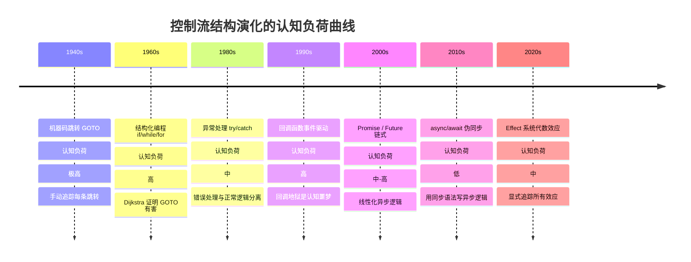

# 控制流的范畴构造：从 if/else 到 async/await 的数学本质

> **核心命题**：if/else 不是"语法糖"，而是**余积的 case 分析**；while 循环不是"重复执行"，而是**不动点算子**的应用；async/await 不是"异步语法"，而是**Promise Monad 的 do-notation**。控制流是范畴结构在代码中的精确投影，而非任意的语法选择。

---

## 引言

当你在写代码时，控制流语句看起来像是风格差异：有人偏爱 `if/else`，有人用三元运算符，有人用短路逻辑。但从范畴论角度，这些不只是风格差异——`if/else` 是**余积的 case 分析**，三元运算符是表达式级别的 case 分析，而短路逻辑 `&&`/`||` 组合**不是**严格的余积结构，可能产生意外的求值行为。

Dijkstra 在 1968 年宣称"GOTO 有害"，推动了结构化编程革命。范畴论为这一革命提供了数学证明：**任何程序流图都可以被转换为仅使用顺序组合（态射复合）、条件选择（余积）和循环（不动点算子）的形式**。这三个构造对应范畴论中的复合（`∘`）、余积（`+`）和初始代数（`μ`）——它们构成了完备的"结构化控制流范畴"。

本文将顺序执行、条件分支、循环、异常处理、异步控制流与生成器逐一映射到严格的范畴构造，展示 TypeScript/JavaScript 中每一条控制流语句背后的数学骨架。

---

## 理论严格表述

### 1. 顺序执行：态射组合

顺序执行是范畴论中最基本的结构：**态射复合**。给定 `f: A → B` 和 `g: B → C`，它们的复合 `g ∘ f: A → C` 也是一个态射。

```typescript
const f = (x: number): string => x.toString();
const g = (s: string): boolean => s.length > 0;
const h = (b: boolean): number => b ? 1 : 0;

// sequential = h ∘ g ∘ f
const sequential = (x: number): number => h(g(f(x)));
```

**结合律** `(h ∘ g) ∘ f = h ∘ (g ∘ f)` 保证：括号怎么放都一样。这一性质允许 IDE 安全地自动重构代码，而不改变语义。结合律是范畴论的公理之一，也是函数式管道可以被任意拆分重组的数学保证。

副作用破坏了纯粹的态射组合。当函数依赖隐式全局状态时，"输出"不仅取决于"输入"，还取决于隐式环境——这意味着它**不是**态射。修复方法是显式传递状态，这正是 State Monad 的直觉来源。

### 2. 条件分支：余积的 Case 分析

`if/else` 的范畴论语义是**余积的 case 分析**（Coproduct Case Analysis）。给定 `f: A → C`（true 分支）和 `g: B → C`（false 分支），`if/else` 构造了余积的分解 `[f, g]: A + B → C`。

```typescript
type Result = Success | Failure;
// handleResult = [processData, logError]: Success + Failure → string
```

**泛性质**：对于任何能从 `Success` 或 `Failure` 构造 `C` 的方式，存在唯一的映射经过 `caseAnalysis`。这意味着 `if/else` 不是任意的语法选择，而是满足 universal property 的唯一结构。

模式匹配是更一般的 case 分析。TypeScript 的类型收窄（Type Narrowing）对应从余积中选择子对象。`switch` 语句处理 discriminated union 时，穷尽性检查（Exhaustiveness Checking）对应**余积的完整性**要求——所有 injection 都必须被处理。如果忘记一个 case，TypeScript 报错，因为范畴论要求余积的注入态射覆盖所有可能。

三元运算符 `a ? b : c` 也是 case 分析，但它是表达式级别的。短路逻辑 `a && b || c` **试图**模拟 case 分析，但可能评估两个分支（当 `a` 为 truthy 且 `b` 为 falsy 时），因此**不是**严格的余积结构。

### 3. 循环：不动点与初始代数

`while (cond) { body }` 对应数学中的**不动点**（Fixed Point）。最小的满足以下等式的函数：

```
f(s) = if cond(s) then f(body(s)) else s
```

换句话说，`f` 是变换 `T(f) = λs. if cond(s) then f(body(s)) else s` 的不动点。用递归显式表达：

```typescript
const whileRecursive = <S>(
  cond: (s: S) => boolean,
  body: (s: S) => S,
  init: S
): S => {
  if (!cond(init)) return init;
  return whileRecursive(cond, body, body(init));
};
```

**尾递归优化**对应的范畴结构：尾递归函数可以安全地转换为循环，因为它们共享相同的"不动点"，且不需要保留之前的栈帧。这不是编译器的"优化技巧"，而是范畴等价的直接体现——尾递归版本和迭代版本在范畴论语义上严格等价。

`for` 循环可以看作**初始代数的 catamorphism**（折叠）。列表 `[x₁, x₂, ..., xₙ]` 是 `List` 函子的初始代数，`fold` 是从这个初始代数到任意代数的唯一同态。嵌套循环对应嵌套的 catamorphism：外层 `map` 是 `List` 函子的 catamorphism，内层 `reduce` 是另一个 catamorphism。

### 4. 异常处理：Either Monad 与余单子

try-catch 的范畴论语义是 **Either 类型的解包**：

```
try { e } catch { h } : A
corresponds to: match(tryBlock, catchBlock) : Either<Error, A> → A
```

Either Monad 的 `bind`（`flatMap`）允许链式组合可能失败的计算。如果链中的任何一步失败（`Left`），后续步骤不会执行——这就是 Either Monad 的"短路"行为。

**异常的组合问题**：函数组合 `f ∘ g` 假设 `g` 总是成功。但如果 `g` 可能抛出异常，`f ∘ g` 就不良定义了。Either Monad 通过将异常纳入类型系统解决了这一问题：`g: A → Either<E, B>`，`f: B → Either<E, C>`，它们的 Kleisli 组合 `f >=> g: A → Either<E, C>` 总是良定义的。

`finally` 对应 **bracket 模式**——资源管理的范畴结构：

```
bracket(acquire, use, release) =
  do { a <- acquire; result <- use(a); release(a); return result }
    `catch` \e -> do { release(a); throw e }
```

这是 Comonad（余单子）的扩展操作：从上下文中提取值，同时确保清理发生。

### 5. 异步控制流：单子与 do-notation

`async/await` 是 Promise Monad 的 **do-notation**。Promise 的 Monad 结构包含：

- `return/pure: A → Promise<A>`（`Promise.resolve`）
- `bind/flatMap: Promise<A> → (A → Promise<B>) → Promise<B>`（`.then`）
- `join: Promise<Promise<A>> → Promise<A>`（`.then(id)`）

Monad 律保证：

- **左单位律**：`flatMap(pure(a), f) === f(a)`
- **右单位律**：`flatMap(pa, pure) === pa`
- **结合律**：`flatMap(flatMap(pa, f), g) === flatMap(pa, a => flatMap(f(a), g))`

Promise 链是 **Kleisli 组合**在 Promise Monad 上的实例。Kleisli 箭头 `A → Promise<B>` 的组合让异步操作可以像普通函数一样组合，而不需要嵌套回调。

Event Loop 的范畴语义是**余单子**的提取操作。全局状态（Event Loop 队列）是环境 `W`，`Promise<T>` 对应计算 `W → T × W`——给定当前世界状态，返回一个值和更新后的世界状态。

### 6. Generator：余自由单子与可迭代范畴

Generator 是**带记忆的状态变换**。`yield` 对应"暂停计算并产生中间结果"的操作。在范畴论中：

- 从当前上下文中提取一个值（Comonad 的 `extract`）
- 接收外部输入并继续计算（Monad 的 `bind`）

Generator 的双向通信能力（`gen.next(value)`）对应**余自由单子**（Cofree Monad）：

```
Cofree F A = { head: A; tail: F(Cofree F A) }
```

每一步产生 `head`，并提供一个 `tail`（下一步）。`async/await` 只能向前执行，Generator 可以暂停、恢复、甚至回溯——这正是 Cofree 结构比 Free 结构更强大的地方。

### 7. 控制流范畴的形式化

将所有控制流结构统一在范畴论语境中，获得**形式化的控制流代数**。

**控制流范畴 CF**：

- 对象：程序状态（变量绑定、堆栈、堆）
- 态射：状态转换（基本操作、函数调用、控制转移）
- 组合：顺序执行（`;`）
- 恒等：空操作（`skip`）

**结构化控制流定理（Böhm-Jacopini）的范畴论表述**：任何程序流图都可以被转换为仅使用顺序组合（态射复合）、条件选择（余积）和循环（不动点算子）。这三个构造对应范畴论中的复合（`∘`）、余积（`+`）和初始代数（`μ`）。

---

## 工程实践映射

### 可组合性的范畴论标准

控制流结构 `C` 是可组合的，当且仅当：

1. **封闭性**：两个 `C` 的组合仍然是 `C`
2. **结合律**：`(C1 ∘ C2) ∘ C3 = C1 ∘ (C2 ∘ C3)`
3. **单位元**：存在空操作 `skip`，使得 `skip ∘ C = C ∘ skip = C`

满足这三个条件的控制流结构 = **范畴**。

```typescript
// 可组合：函数组合
const pipeline = compose(validate, transform, save, notify);

// 不可组合：goto
// goto label1;
// ...
// label1: ...
// 无法将两个 goto 程序"组合"成一个有意义的程序
```

### 认知负荷的控制流优化

从认知科学角度，不同控制结构的认知负荷截然不同：

| 控制结构 | 认知负荷 | 工作记忆需求 |
|---------|---------|-------------|
| 顺序执行 | 低 | 1-2 个组块 |
| if/else | 低-中 | 2-3 个组块 |
| 嵌套 if | 高 | 4-7 个组块 |
| 循环 | 中 | 2-3 个组块 |
| 递归 | 高 | 4+ 个组块 |
| try/catch | 中 | 3-4 个组块 |
| async/await | 中-高 | 3-5 个组块 |
| 并发 | 极高 | 超出容量 |

**工程建议**：当嵌套深度超过 3 层时，重构为早期返回或表驱动法：

```typescript
// 高认知负荷：深层嵌套
function complex(x: number, y: number, z: number): string {
  if (x > 0) {
    if (y > 0) {
      if (z > 0) return "+++";
      else return "++-";
    }
  }
  // ...
}

// 低认知负荷：表驱动 + 早期返回
function simple(x: number, y: number, z: number): string {
  return [x, y, z].map(n => n > 0 ? "+" : "-").join("");
}
```

### TS 控制流分析的类型收窄

TypeScript 编译器在控制流图中传播类型信息。每个控制流节点是类型范畴中的一个对象（子类型），每条边是态射（类型转换或保持）。类型收窄 = 沿条件边"向下"移动（到子类型），类型放宽 = 在汇合点"向上"移动（到超类型）。

```typescript
function process(x: string | number) {
  if (typeof x === 'string') {
    // 从余积 string + number 中选择 string 子对象
    console.log(x.toUpperCase());
  } else {
    // 从余积 number 中选择 number 子对象
    console.log(x.toFixed(2));
  }
}
```

### 用 fp-ts 显式管理计算效应

```typescript
import * as O from 'fp-ts/Option';
import * as E from 'fp-ts/Either';
import * as T from 'fp-ts/Task';

// Maybe 效应（处理 null）
const safeDiv = (a: number, b: number): O.Option<number> =>
  b === 0 ? O.none : O.some(a / b);

// Either 效应（处理错误）
const validate = (input: string): E.Either<string, number> => {
  const n = parseInt(input);
  return isNaN(n) ? E.left('Invalid') : E.right(n);
};

// Async 效应（处理异步）
const fetchUser = (id: string): T.Task<User> =>
  () => fetch(`/api/users/${id}`).then(r => r.json());
```

通过显式标记效应类型，控制流的范畴结构从隐式的"语法约定"变为显式的"类型约束"。

---

## Mermaid 图表

### 图 1：控制流结构的范畴论对应

```mermaid
flowchart TB
    subgraph 编程语言控制流
        SEQ[顺序执行<br/>s1; s2; s3]
        COND[条件分支<br/>if / else / switch]
        LOOP[循环<br/>while / for / for...of]
        EXC[异常处理<br/>try / catch / finally]
        ASYNC[异步控制流<br/>async / await / Promise]
        GEN[生成器<br/>function* / yield]
    end

    subgraph 范畴论构造
        SEQ_C[态射复合<br/>h &#8728; g &#8728; f]
        COND_C[余积 Case 分析<br/>[f, g]: A + B &#8594; C]
        LOOP_C[不动点算子<br/>&#956;f. &#955;s. p&#40;s&#41; ? f&#40;body&#40;s&#41;&#41; : s]
        EXC_C[Either Monad<br/>bind: M&#40;A&#41; &#8594; &#40;A &#8594; M&#40;B&#41;&#41; &#8594; M&#40;B&#41;]
        ASYNC_C[Promise Monad<br/>Kleisli: A &#8594; M&#40;B&#41; >=> B &#8594; M&#40;C&#41;]
        GEN_C[余自由单子<br/>Cofree F A = &#123;head: A; tail: F&#40;Cofree&#41;&#125;]
    end

    subgraph 核心代数定律
        SEQ_L[结合律<br/>&#40;h&#8728;g&#41;&#8728;f = h&#8728;&#40;g&#8728;f&#41;]
        COND_L[余积泛性质<br/>唯一分解映射]
        LOOP_L[初始代数<br/>catamorphism 唯一性]
        EXC_L[单子三律<br/>左/右单位 + 结合]
        ASYNC_L[Kleisli 结合律<br/>&#40;h >=> g&#41; >=> f = h >=> &#40;g >=> f&#41;]
        GEN_L[余自由共律<br/>extract &#43; extend]
    end

    SEQ --> SEQ_C --> SEQ_L
    COND --> COND_C --> COND_L
    LOOP --> LOOP_C --> LOOP_L
    EXC --> EXC_C --> EXC_L
    ASYNC --> ASYNC_C --> ASYNC_L
    GEN --> GEN_C --> GEN_L

    style SEQ_C fill:#bbf,stroke:#333
    style COND_C fill:#bfb,stroke:#333
    style LOOP_C fill:#fbf,stroke:#333
    style EXC_C fill:#ffb,stroke:#333
    style ASYNC_C fill:#bff,stroke:#333
    style GEN_C fill:#fbb,stroke:#333
```

### 图 2：Promise Monad 的 Kleisli 组合结构

```mermaid
graph LR
    subgraph Kleisli 箭头<br/>A &#8594; Promise&#40;B&#41;
        K1[fetchUser<br/>string &#8594; Promise&#40;User&#41;]
        K2[fetchOrders<br/>User &#8594; Promise&#40;Order[]&#41;]
        K3[calculateTotal<br/>Order[] &#8594; Promise&#40;number&#41;]
    end

    subgraph Kleisli 组合 >=><br/>&#40;g >=> f&#41;&#40;a&#41; = f&#40;a&#41;.then&#40;g&#41;
        C1[K1 >=> K2<br/>string &#8594; Promise&#40;Order[]&#41;]
        C2[C1 >=> K3<br/>string &#8594; Promise&#40;number&#41;]
    end

    subgraph async/await 语法糖<br/>等价于 Kleisli 组合
        A1[const user = await fetchUser&#40;id&#41;]
        A2[const orders = await fetchOrders&#40;user&#41;]
        A3[return calculateTotal&#40;orders&#41;]
    end

    K1 --> C1
    K2 --> C1
    C1 --> C2
    K3 --> C2

    C2 -.->|语法糖展开| A1
    A1 --> A2 --> A3

    style C2 fill:#f9f,stroke:#333,stroke-width:2px
    style A1 fill:#bfb,stroke:#333
```

### 图 3：控制流演化的认知经济学



---

## 理论要点总结

1. **控制流不是语法，是结构**。`if/else` 是余积的 case 分析，`while` 是不动点算子，`async/await` 是 Promise Monad 的 do-notation。理解这一点，你就能写出在数学上正确的代码，而不是碰巧能运行的代码。

2. **短路逻辑 `&&`/`||` 不是严格的余积结构**。三元运算符 `a ? b : c` 总是只评估一个分支；短路逻辑 `a && b || c` 可能评估两个分支（当 `a` 为 truthy 且 `b` 为 falsy 时）。在追求语义精确的场景中，优先使用三元运算符或显式的 `if/else`。

3. **尾递归与迭代在范畴论语义上等价**。尾递归优化不是编译器的"善意"，而是数学等价的直接体现——两者共享相同的不动点，且不需要保留历史栈帧。非尾递归（如树遍历）对应更复杂的代数结构（Tree 上的 catamorphism），无法直接转换为无栈循环。

4. **异常的类型诚实度是核心差异**。Either Monad 将错误路径纳入类型签名，调用者被强制处理；隐式异常（`try/catch`）的类型信息在 `catch` 块中退化为 `any`。在库设计中，优先使用显式的错误类型（如 `Result<T, E>` 或 neverthrow）。

5. **Generator 的暂停/恢复能力超越 async/await**。`async/await` 是单向的（只能向前），Generator 是双向的（可以暂停、恢复、传入新值）。这在 saga 模式、状态机实现和可恢复计算中具有独特价值。

6. **Böhm-Jacopini 定理的范畴论表述**：任何程序流图都可以被转换为仅使用顺序组合（态射复合）、条件选择（余积）和循环（不动点算子）。这证明了结构化编程的数学完备性——GOTO 不是必要的，它只是**不可组合的控制流**。

7. **控制流范畴有盲区**：时间（立即执行 vs 延迟执行）、资源（内存使用）、概率（随机性）、安全（可信与不可信操作）超出了基础控制流范畴的表达能力。需要引入时间索引范畴、线性逻辑、Giry Monad 和效应系统来扩展。

---

## 参考资源

1. **Pierce, B. C. (2002)**. *Types and Programming Languages*. MIT Press. 程序语言类型理论的权威教材，系统阐述了控制流的类型语义、异常处理的代数结构和子类型的范畴论语义。

2. **Harper, R. (2016)**. *Practical Foundations for Programming Languages* (2nd ed.). Cambridge University Press. 从范畴论语义出发构建编程语言理论，详述了结构化控制流、Monad 与代数效应的统一框架。

3. **Moggi, E. (1991)**. "Notions of Computation and Monads." *Information and Computation*, 93(1), 55-92. 将计算效应（状态、异常、非确定性、连续性）统一在 Monad 框架下的奠基论文，为 async/await 和 Promise 的数学语义提供了基础。

4. **Plotkin, G. D. (1981)**. "A Structural Approach to Operational Semantics." *Aarhus University* (DAIMI FN-19). 结构化操作语义的奠基工作，为控制流的形式化分析提供了 SOS 规则框架。

5. **Felleisen, M., & Hieb, R. (1992)**. "The Revised Report on the Syntactic Theories of Sequential Control and State." *Theoretical Computer Science*, 103(2), 235-271. 从语法理论角度系统分析了顺序控制与状态的数学结构，特别是 continuation 和 control operator 的范畴语义。
