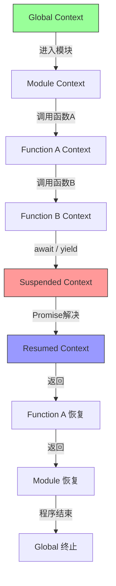

# 运行时模型范畴语义

> **核心命题**：JavaScript 运行时的每个组件——Event Loop、调用栈、JIT 编译器、垃圾回收器——都不是随意设计的黑盒，而是具有明确数学结构的范畴论构造。理解这些结构，可以揭示运行时行为背后的深层统一性。

---

## 引言

当你写下一段 JavaScript 代码时，你通常不会思考运行时正在做什么。
但运行时的每个部分——Event Loop 的任务调度、调用栈的嵌套关系、V8 的编译优化、垃圾回收器的可达性分析——都是为了保持某种**结构不变**而设计的。

范畴论提供了一种理解这些结构的透镜。关键问题不是"V8 源码第 3000 行在做什么"，而是：

- Event Loop 保持什么不变？→ 任务的**执行顺序**。
- 调用栈保持什么不变？→ 函数调用的**嵌套关系**。
- JIT 编译器保持什么不变？→ 程序的**语义**。
- GC 保持什么不变？→ 可达对象的**引用结构**。

这些问题有精确的数学答案。
本章将用范畴论的工具重新诠释 JavaScript 运行时的核心组件，从 Event Loop 的余单子结构到编译管道的函子性，从调用栈的链式复形到垃圾回收的遗忘函子。

JavaScript 诞生于 1995 年， Brendan Eich 在 10 天内完成了原型实现。
单线程执行模型是当时的关键决策：DOM 操作必须是确定性的，多线程并发修改会导致不可预测的状态。
但单线程的致命问题是**阻塞**——如果执行耗时操作，整个浏览器界面会冻结。
解决方案是**异步回调**：浏览器提供 API 允许 JavaScript 注册回调函数，当异步操作完成时，回调被放入队列等待主线程空闲时执行。
这个队列加单线程主循环的结构，就是 Event Loop 的雏形。
从范畴论角度看，这是一个**从同步范畴到异步范畴的函子**——同步范畴中的态射（顺序执行）被映射到异步范畴中的态射（回调注册加事件触发）。

---

## 理论严格表述

### Event Loop 作为余单子

如果说单子（Monad）是"在容器里计算"，那么**余单子（Comonad）**就是"在上下文中观察"。
单子让你**放入**值，余单子让你**提取**值并基于上下文做决策。

Event Loop 可以被建模为一个余单子：

```typescript
// Event Loop 是一个 Comonad：
// W<A> = "当前值 A + 未来值序列"

type EventLoop<A> = {
  current: A;
  next: () => EventLoop<A>;
};

// extract：获取当前正在处理的任务
const extract = <A>(w: EventLoop<A>): A => w.current;

// extend：基于当前状态安排未来的计算
const extend = <A, B>(w: EventLoop<A>, f: (w: EventLoop<A>) => B): EventLoop<B> => ({
  current: f(w),
  next: () => extend(w.next(), f)
}));
```

余单子的核心操作与 Event Loop 的语义精确对应：

| 余单子操作 | Event Loop 对应 |
|-----------|----------------|
| `extract: W<A> → A` | 执行当前任务 |
| `extend: W<A> → (W<A> → B) → W<B>` | 基于当前状态调度未来任务 |
| `duplicate: W<A> → W<W<A>>` | 创建嵌套的 Event Loop 上下文 |

**微任务与宏任务的范畴差异**在于：微任务是当前余单子上下文内的 `extend` 操作，宏任务是创建新的余单子上下文。
这就是为什么微任务队列清空后才执行宏任务——这对应于"在同一个 `W<A>` 内完成所有 `extend` 后再调用 `next`"。

```typescript
async function demonstrate() {
  console.log('1. Script start');
  setTimeout(() => console.log('5. Macro task'), 0);
  Promise.resolve().then(() => console.log('3. Micro task 1'));
  Promise.resolve().then(() => console.log('4. Micro task 2'));
  console.log('2. Script end');
}
// 输出顺序：1, 2, 3, 4, 5
// 范畴论语义：1-2 是同步执行（extract），3-4 是微任务（当前上下文内的 extend），5 是宏任务（新上下文的 extract）
```

### 执行上下文堆栈作为链式复形

调用栈可以看作一个**链**（Chain）：`Global → Module → Function A → Function B → Function C`。
每个箭头代表一个"进入"操作，函数返回对应"退出"操作。

在范畴论语义中，调用栈是**余切片范畴**（Coslice Category）中的一个对象：

- **对象** = 执行上下文
- **态射** = 变量查找链（从内层上下文到外层上下文）

变量查找就是沿着态射链走：

```typescript
function lookupVariable(ctx: ExecutionContext, name: string): unknown | undefined {
  if (ctx.variables.has(name)) {
    return ctx.variables.get(name);
  }
  if (ctx.parent) {
    return lookupVariable(ctx.parent, name); // 沿着态射链向上走
  }
  return undefined;
}
```

每个执行上下文的生命周期——**创建 → 激活 → 挂起 → 恢复 → 销毁**——本身也构成一个范畴。
对象是生命周期的各个状态，态射是状态之间的转换。
异步函数遇到 `await` 时，执行上下文从 `active` 态射到 `suspended`；Promise 解决后，从 `suspended` 态射到 `active`。

**闭包环境与切片范畴**密切相关。闭包是"捕获了特定切片范畴"的函数。
切片范畴 `(C ↓ A)` 的对象是到 `A` 的态射。在编程中，闭包的环境就是"捕获变量时的执行上下文切片"。

### 编译管道的函子性

V8 的编译管道 `SourceCode → Parser → AST → Ignition → Bytecode → TurboFan → MachineCode` 中，每个阶段都是**保持语义的变换**——也就是函子。

```typescript
interface SourceCode { text: string; }
interface AST { type: 'ast'; nodes: unknown[]; }
interface Bytecode { type: 'bytecode'; ops: unknown[]; }
interface MachineCode { type: 'machine'; instructions: unknown[]; }

// Parser: SourceCode -> AST
const parse = (source: SourceCode): AST => ({ type: 'ast', nodes: [{ kind: 'parsed', source: source.text }] });

// Ignition: AST -> Bytecode
const compileToBytecode = (ast: AST): Bytecode => ({ type: 'bytecode', ops: ast.nodes.map(n => ({ kind: 'bytecode-op', node: n })) });

// TurboFan: Bytecode -> MachineCode
const optimize = (bc: Bytecode): MachineCode => ({ type: 'machine', instructions: bc.ops.map(op => ({ kind: 'asm', op })) });

// 完整管道 = 态射组合
const compile = (source: SourceCode): MachineCode => optimize(compileToBytecode(parse(source)));
```

编译正确性的范畴论表达：存在一个**求值函子** `Eval: ProgramCategory → ValueCategory`，使得 `Eval_source ≅ Eval_machine ∘ Compile`。
这意味着在源代码层面等价的程序，编译后在机器码层面也等价。

### 优化作为自然变换

**自然变换**（Natural Transformation）是范畴论中描述"结构保持映射之间的映射"的工具。
V8 的优化可以看作从"解释执行"到"编译执行"的自然变换。

自然性条件的图示：

```
SourceCode --parse--> AST --interpret--> Value
     |                        |
  compile                 identity
     |                        |
     v                        v
MachineCode --execute--> Value
```

条件：`interpret ∘ parse = execute ∘ compile`。
这就是"优化不改变语义"的精确数学表达。

**内联缓存（Inline Cache）**是从"通用求值函子"到"特化求值函子"的自然变换。
通用求值 `Eval_generic: AST → (Environment → Value)` 每次都要查找原型链，而特化求值 `Eval_specialized: AST → Value` 直接访问属性。
当输入模式变化时，IC 需要"去优化"（deoptimize），这对应自然变换的"条件性"：只在特定子范畴上成立。

### 内存管理与 GC 的范畴模型

垃圾回收的核心——从根对象出发标记所有可达对象——可以建模为**遗忘函子**（Forgetful Functor）：从"所有对象"的范畴映射到"可达对象"的子范畴。

```typescript
function markReachable(heap: MemoryHeap): Set<string> {
  const reachable = new Set<string>();
  const queue = [...heap.roots];
  while (queue.length > 0) {
    const id = queue.shift()!;
    if (reachable.has(id)) continue;
    reachable.add(id);
    const obj = heap.objects.get(id);
    if (obj) queue.push(...obj.references);
  }
  return reachable;
}
```

遗忘函子的直觉是"遗忘"掉不可达对象，保留可达对象之间的所有引用关系。
引用计数则假设对象的"生命周期"可以由局部引用关系决定，但循环引用破坏了这种局部性。
可达性分析使用全局范畴结构，因此比引用计数更通用。

### 微任务队列的余极限解释

微任务队列可以看作一个**余极限**（Colimit）——它把多个异步操作的结果"合并"到一个统一的执行流中。
微任务队列是一个"推出"（Pushout），把多个并发的执行路径"粘合"到一个统一的输出路径上。
宏任务队列则是"新的极限上下文"，每次创建新的对象。

---

## 工程实践映射

### 微任务饥饿的实际陷阱

```typescript
function microtaskStarvation(): void {
  console.log('Start');
  function loop(): void {
    Promise.resolve().then(() => {
      console.log('Microtask');
      loop(); // 无限产生微任务
    });
  }
  loop();
  setTimeout(() => console.log('This never prints'), 0);
}
// 宏任务永远得不到执行，因为微任务队列永远不为空
// 范畴论语义：extend 操作无限递归，next 永远不会被调用
```

### 闭包延长生命周期的陷阱

```typescript
function leakingLifecycle() {
  const bigData = new Array(1000000).fill('x');
  return function() {
    return bigData[0]; // 闭包保持了对 bigData 的引用
  };
}
const leak = leakingLifecycle();
// leakingLifecycle 的执行上下文理论上应该销毁
// 但闭包保持了对 bigData 的引用，导致上下文无法完全释放
```

### JIT 去优化的工程影响

```typescript
function getPropertyGeneric(obj: any, key: string): any {
  return obj[key]; // 每次都要查找原型链
}

// V8 的 IC 优化后：
function getPropertyIC(obj: { x: number }): number {
  return obj.x; // 直接访问，跳过查找
}

// 反例：假设 obj 突然变成 { y: string }
// getPropertyIC 的假设失效，必须回退到 getPropertyGeneric
// 这对应范畴论中的"类型变化导致自然变换失效"
```

### 内存泄漏的范畴论诊断

内存泄漏是可达性分析无法识别的"不必要可达性"。
从范畴论角度，这是子范畴的嵌入不完全——泄漏对象在"可达子范畴"中，但应该在"必要可达子范畴"之外。

全局变量泄漏：全局对象是**终对象**（terminal object），任何指向终对象的态射都是不可逆的，对象永远可达。
闭包泄漏：闭包的环境是切片范畴中的对象，包含了所有捕获的变量，即使只使用了其中一部分，导致"不必要可达性"。
事件监听器泄漏：事件监听器数组是一个余单子上下文，监听器被 `extend` 到上下文中，但从未被 `extract` 和清理。

---

## Mermaid 图表

### Event Loop 余单子结构与任务调度

```mermaid
graph TD
    subgraph 宏任务上下文 W&#123;Macro&#125;
        M1[宏任务1: setTimeout] -->|next| M2[宏任务2: I/O回调]
        M2 -->|next| M3[宏任务3: UI渲染]
    end

    subgraph 微任务上下文 extend
        U1[微任务1: Promise.then] -->|extend| U2[微任务2: queueMicrotask]
        U2 -->|extend| U3[微任务3: MutationObserver]
    end

    M1 -.->|extract 当前任务| E1[执行当前宏任务]
    E1 -->|产生微任务| U1
    U1 --> U2 --> U3
    U3 -.->|清空后 next| M2

    style M1 fill:#f9f,stroke:#333
    style U1 fill:#bbf,stroke:#333
```

### 编译管道的函子性

```mermaid
graph LR
    subgraph SourceCategory
        S1[SourceCode: '1 + 2']
        S2[SourceCode: '2 + 1']
    end

    subgraph ASTCategory
        A1[AST: Add(1,2)]
        A2[AST: Add(2,1)]
    end

    subgraph BytecodeCategory
        B1[Bytecode: LOAD 1; LOAD 2; ADD]
        B2[Bytecode: LOAD 2; LOAD 1; ADD]
    end

    subgraph MachineCategory
        M[MachineCode: ADD R1, R2]
    end

    subgraph ValueCategory
        V[Value: 3]
    end

    S1 -->|parse 函子| A1
    S2 -->|parse 函子| A2
    A1 -->|compileToBytecode 函子| B1
    A2 -->|compileToBytecode 函子| B2
    B1 -->|optimize 函子| M
    B2 -->|optimize 函子| M
    S1 -.->|Eval_source| V
    M -.->|Eval_machine| V

    style M fill:#9f9,stroke:#333
    style V fill:#ff9,stroke:#333
```

### 执行上下文链式复形与生命周期



---

## 理论要点总结

1. **Event Loop 的余单子结构**：Event Loop 的核心是 `extract`（执行当前任务）和 `extend`（调度未来任务）。微任务在当前余单子上下文内完成所有 `extend` 后才进入下一个宏任务的 `next`，这解释了微任务优先的语义。

2. **调用栈作为链式复形**：调用栈是余切片范畴中的对象，变量查找是沿着态射链的遍历。执行上下文的生命周期（创建 → 激活 → 挂起 → 恢复 → 销毁）构成一个独立的范畴。

3. **编译管道的函子性**：V8 编译的每个阶段都是保持语义的函子。编译正确性的范畴论表达是 `Eval_source ≅ Eval_machine ∘ Compile`，确保源代码等价蕴含机器码等价。

4. **优化作为自然变换**：内联缓存是从通用求值函子到特化求值函子的自然变换。去优化对应自然变换在类型变化时的失效，这要求引擎在运行时维护类型假设的校验。

5. **GC 作为遗忘函子**：标记-清除算法的可达性分析是从 HeapCategory 到 ReachableSubcategory 的遗忘函子。内存泄漏的本质是"不必要可达性"——对象在可达子范畴中，但语义上不需要。

6. **范畴论的边界**：JIT 编译的不确定性、物理内存布局、真实时间的流逝、Host 环境差异、`Math.random()` 的非确定性、WeakRef 的弱引用语义——这些运行时行为超出了纯粹范畴结构的描述范围，属于操作语义和物理现实的领域。

---

## 参考资源

1. Moggi, E. (1991). "Notions of Computation and Monads." *Information and Computation*, 93(1), 55-92. 奠定了计算效应的单子语义基础，Promise 和异步计算的单子解释直接源于此。

2. Harper, R. (2016). *Practical Foundations for Programming Languages* (2nd ed.). Cambridge University Press. 提供了编程语言语义的系统形式化框架，环境记录和存储范畴的理论基础。

3. Jacobs, B. (1999). *Categorical Logic and Type Theory*. Elsevier. 第 5-6 章详细讨论了纤维化、余单子与计算语义的关系，Event Loop 的纤维化表示参考于此。

4. Jones, R., & Lins, R. (1996). *Garbage Collection: Algorithms for Automatic Dynamic Memory Management*. Wiley. 垃圾回收算法的权威著作，可达性分析与引用计数的工程实现细节。

5. ECMA-262. *ECMAScript 2025 Language Specification*. 特别是第 9 章（执行上下文）和第 27 章（Agents），提供了 JavaScript 运行时的规范级定义。
