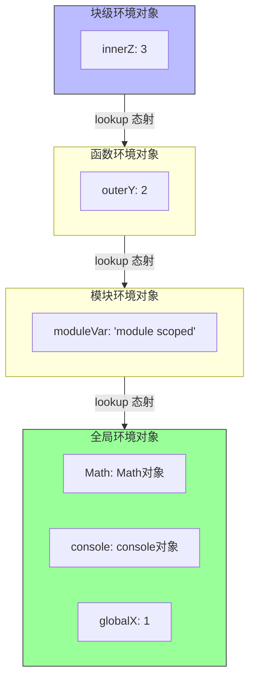

# 变量系统范畴分析

> **核心命题**：变量不是"盒子"，而是态射——从环境到值的映射。解构赋值是积的投影，闭包是指数对象，作用域链是余切片范畴，TDZ 是时态逻辑的必然算子。范畴论提供了比"盒子隐喻"更精确、与运行时结构同构的认知模型。

---

## 引言

编程教学中，变量常常被比喻为"盒子"——你可以把值放进盒子，也可以从盒子里取出值。
这个比喻对新手有帮助，但它隐藏了关键细节：如果两个变量"指向同一个盒子"会发生什么？盒子在什么时候被创建和销毁？为什么在某些代码位置访问变量会报错？

范畴论提供了更精确的视角：**变量不是盒子，而是态射**——从环境（Environment）到值的映射。
本章用范畴论分析 JavaScript 的变量系统：绑定、闭包、作用域、TDZ。每个概念都配有代码示例和精确直觉类比。

想象你在 2015 年维护一个大型 JavaScript 代码库。
一个生产环境的 Bug 让你追查了三小时：循环中的计数器变量在异步回调中总是返回最终值，而不是迭代时的值。
问题根源是 `var` 声明的变量提升导致所有回调共享同一个绑定。
这个 Bug 的本质不是语法错误，而是**认知模型与运行时现实之间的错位**。
你把变量想象成了独立的盒子，但运行时把它们放在了同一个共享空间中。
范畴论强迫你建立与运行时结构同构的认知模型，当认知模型与代码实际语义一致时，这类 Bug 在编码阶段就能被预防。

从物理存储出发，逐步走向抽象：**第一层物理现实**是引擎在内存中为变量分配存储空间；
**第二层环境记录**（Environment Record）是 ECMAScript 规范的抽象，一个从标识符到值的映射表；
**第三层范畴论对象**中，环境记录被看作一个对象，其元素是绑定，但范畴论处理动态结构的方式不是让对象随时间变化，而是让时间本身成为结构的一部分——特定时刻的环境记录状态是对象，环境状态之间的转换（变量声明、赋值、作用域进入/退出）是态射。

---

## 理论严格表述

### 变量绑定作为积的投影

在范畴论中，**积**（Product）是两个对象的配对，带有投影态射 π₁ 和 π₂。解构赋值就是投影：

```typescript
// 积的构造：A × B
const pair: [number, string] = [42, "hello"];

// 投影：π₁(pair) = 42, π₂(pair) = "hello"
const [a, b] = pair;  // 解构赋值就是投影

// 对象解构也是投影
const person = { name: "Alice", age: 30 };
const { name, age } = person;
// name = π_name(person) = "Alice", age = π_age(person) = 30
```

嵌套解构是多层投影的复合：`π_name ∘ π_profile ∘ π_user`。中间结果不会被命名，这正是为什么 `const { user: { profile: { name } } } = data` 不会创建 `user` 或 `profile` 变量。

函数参数解构是积的投影在函数签名中的直接应用。带默认值的解构等于投影与单位态射的复合：`π ∪ η`。

```typescript
function makeRequest({
  url,
  method = 'GET',   // 默认值：如果不存在，使用终对象 'GET'
  body,
  headers = {}      // 默认值：空对象作为终对象
}: RequestOptions): Promise<Response> { ... }
```

### 闭包作为指数对象

在笛卡尔闭范畴（Cartesian Closed Category, CCC）中，**指数对象** B^A 表示从 A 到 B 的所有函数。Currying 是积与指数之间的同构：`Hom(A × B, C) ≅ Hom(A, C^B)`。

```typescript
// 未 Curry 的版本：接受两个参数
const add = (a: number, b: number): number => a + b;

// Curry 版本：接受一个参数，返回一个函数
const addCurried = (a: number) => (b: number): number => a + b;

// 闭包：返回的函数"捕获"了 a 的值
const add5 = addCurried(5);  // add5 = (b) => 5 + b
console.log(add5(3));        // 8

// 范畴论语义：addCurried: number -> (number -> number)
// 即 addCurried: A -> B^A（指数对象）
```

闭包不仅仅是指数对象，它还是**环境范畴中的态射**。闭包把环境"编码"到函数的行为中。两个闭包有独立的环境（不同的对象），因此互不影响。

### 作用域链作为余切片范畴

JavaScript 的作用域链是嵌套的环境记录链。在范畴论中，这对应于**余切片范畴**（Coslice Category）。

- 每个作用域是一个**对象**
- 从内层作用域到外层作用域的查找是一个**态射**
- 作用域链是这些态射的**复合**

```
BlockEnv --lookup--> FunctionEnv --lookup--> ModuleEnv --lookup--> GlobalEnv
```

变量查找的时间复杂度是 O(n) 的线性遍历，这与作用域链作为链表的结构一致。但作用域链在创建后是只读的——环境记录的 `parent` 不可变，这与普通链表不同。

**闭包环境的"快照"机制**：闭包不仅捕获变量，还捕获变量所在的**环境链**。每个函数调用创建一个新的环境对象，不同闭包指向不同的环境对象，因此具有完全独立的状态。

### let / var / const 的范畴论语义差异

三种声明定义了**不同的环境转换规则**：

- `var`：在**函数环境对象**上添加绑定，允许覆盖已有绑定
- `let`：在**块环境对象**上添加绑定，不允许覆盖，有 TDZ
- `const`：在**块环境对象**上添加绑定，且该绑定指向的值引用不可变

`var` 的问题在于它打破了**块结构的数学美感**。在 Algol、Pascal 等块结构语言中，块（`{...}`）定义了作用域边界，但 `var` 让块变成了"透明"的。`let` 的引入恢复了块结构的一致性：块就是作用域边界。`const` 则进一步引入了**引用不变性**——从范畴论角度，`const` 声明的绑定是一个终对象上的常量态射，一旦定义就不再变化。

### TDZ 的时态逻辑解释

TDZ（Temporal Dead Zone，临时死区）是 ES6 引入 `let`/`const` 时的关键设计。时态逻辑可以精确描述 TDZ：

```
□(time < declaration_time → ¬accessible(x))
```

读作："在所有时间点上，如果在声明时间之前，那么 x 不可访问"。

```typescript
let x = 1;
{
  console.log(x);  // ReferenceError！不是 1！
  let x = 2;       // 块级 x 的 TDZ 覆盖了外部 x
}
```

第二个例子报错而不是输出 1，因为 JavaScript 的变量查找是**静态作用域**（Lexical Scoping）。在块级作用域中找到了 `x` 的声明，就使用这个绑定——即使它在 TDZ 中。从范畴论角度看，这是**态射复合的局部性**：变量查找的态射链在找到第一个匹配时就停止，不会继续向上遍历。

### 解构赋值的普遍性质

数组解构是**积的投影**，对象解构是**记录的投影**（带标签的积）。重命名解构等于投影后应用**同构映射**。默认值等于投影与**终对象**的复合。剩余模式 `...rest` 对应于**余积的注入**：原始对象是积（所有属性的配对），解构后等于显式命名的投影加剩余部分的"打包"，`rest` 是原始积的一个"子积"（通过遗忘函子得到）。

### 环境范畴的整体构造

将上述洞察整合为**环境范畴**（Environment Category）的完整模型：

- **对象**：特定时刻的环境记录状态（包含类型、绑定映射、父环境指针）
- **态射**：环境状态之间的转换
  1. `Declare(name, mutable)`: Env → Env（添加绑定）
  2. `Initialize(name, value)`: Env → Env（结束 TDZ）
  3. `Assign(name, value)`: Env → Env（修改值）
  4. `EnterScope(type)`: Env → Env'（创建子环境）
  5. `ExitScope()`: Env' → Env（销毁子环境）

变量查找可以看作**遗忘函子**（Forgetful Functor）——从"带结构的环境"映射到"纯值"，它"遗忘"了环境结构，只保留值。

---

## 工程实践映射

### 嵌套解构的认知陷阱

```typescript
const data = { user: { profile: { name: "Alice", settings: { theme: "dark" } } } };
const { user: { profile: { name } } } = data;
// 等价于：name = π_name(π_profile(π_user(data)))

console.log(user);     // ReferenceError: user is not defined
console.log(profile);  // ReferenceError: profile is not defined
// 只有 name 被创建了——中间层不创建变量
```

### 循环中的闭包陷阱

```typescript
// 经典陷阱
const functions = [];
for (var i = 0; i < 3; i++) {
  functions.push(() => i);
}
console.log(functions[0]());  // 3（不是 0！）

// 原因：所有闭包捕获的是同一个变量 i
// 范畴论语义：var i 的闭包共享同一个环境对象

// 修正 1：使用 let（块级作用域）
const functions2 = [];
for (let i = 0; i < 3; i++) {
  functions2.push(() => i);  // 每个迭代有自己的 i
}
console.log(functions2[0]());  // 0 ✅

// 修正 2：使用 IIFE 创建新的作用域
const functions3 = [];
for (var i = 0; i < 3; i++) {
  (function(capturedI) {
    functions3.push(() => capturedI);
  })(i);
}
```

### 对象引用捕获陷阱

```typescript
function createObjectSnapshot(obj: { value: number }): () => number {
  return () => obj.value; // 捕获的是引用，不是值
}
const shared = { value: 42 };
const snapshot1 = createObjectSnapshot(shared);
const snapshot2 = createObjectSnapshot(shared);
shared.value = 100;
console.log(snapshot1()); // 100（也被修改了！）

// 修正：创建深拷贝来"真正冻结"值
function createTrueSnapshot(obj: { value: number }): () => number {
  const frozen = { value: obj.value }; // 创建新对象
  return () => frozen.value;
}
```

### var 提升的意外行为

```typescript
console.log(x);  // undefined（不是 ReferenceError！）
var x = 5;
// 实际执行顺序：var x; console.log(x); x = 5;

// 函数级作用域导致的泄漏
for (var i = 0; i < 3; i++) {
  setTimeout(() => console.log(i), 100);
}
// 输出：3, 3, 3（不是 0, 1, 2）

// var 允许重复声明而不报错
var a = 1;
var a = 2;  // 不报错！只是重新赋值
```

### TDZ 的边界情况

```typescript
// typeof 在 TDZ 中也报错
{
  // console.log(typeof tdzVar);  // ReferenceError —— TDZ 中的变量
  let tdzVar = 1;
}

// 函数参数的 TDZ
function foo(a = b, b) { return a; }
// foo(undefined, 1);  // ReferenceError
// 因为 a 的默认值 b 在 b 的 TDZ 中被访问

// class 的 TDZ
{
  // const instance = new MyClass();  // ReferenceError
  class MyClass {}
}

// TDZ 与闭包的交互
function tdzClosure() {
  const f = () => x; // 闭包"承诺"在运行时查找 x
  // f(); // 如果在这里调用，x 还在 TDZ 中
  let x = 42;
  return f;
}
const closure = tdzClosure();
console.log(closure()); // 42（此时 TDZ 已结束）
```

### 闭包共享环境的陷阱

```typescript
function createSharedState() {
  let state = { value: 0 };
  return {
    increment: () => { state.value++; return state.value; },
    getState: () => state // 直接暴露引用！
  };
}
const api = createSharedState();
const leakedState = api.getState();
leakedState.value = 999;  // 从外部修改内部状态
console.log(api.getState().value); // 999（封装被破坏）

// 修正：不暴露内部引用
function createSafeState() {
  let state = { value: 0 };
  return {
    increment: () => { state.value++; return state.value; },
    getState: () => ({ value: state.value }) // 返回拷贝
  };
}
```

---

## Mermaid 图表

### 作用域链的余切片范畴模型



### 环境范畴的态射结构

```mermaid
graph LR
    subgraph 环境对象
        E1["Env&#123; bindings: &#123;&#125;, parent: null &#125;"]
        E2["Env&#123; bindings: &#123;x: 5&#125;, parent: E1 &#125;"]
        E3["Env&#123; bindings: &#123;x: 5, y: 10&#125;, parent: E1 &#125;"]
        E4["Env&#123; bindings: &#123;x: 20, y: 10&#125;, parent: E1 &#125;"]
    end

    subgraph 态射转换
        D["declare(x, 5)"]
        A["assign(y, 10)"]
        U["update(x, 20)"]
    end

    E1 -->|declare| E2
    E2 -->|declare| E3
    E3 -->|assign| E4

    style E1 fill:#f9f,stroke:#333
    style E4 fill:#9f9,stroke:#333
```



### 变量声明类型的范畴差异

```mermaid
graph TD
    subgraph var语义
        V1["函数环境对象"] -->|添加可变绑定| V2["允许覆盖"]
        V2 -->|提升| V3["初始化为undefined"]
        V3 -->|重复声明| V4["静默覆盖"]
    end

    subgraph let语义
        L1["块环境对象"] -->|添加绑定| L2["TDZ状态"]
        L2 -->|初始化| L3["可访问"]
        L3 -->|重复声明| L4["SyntaxError"]
    end

    subgraph const语义
        C1["块环境对象"] -->|添加绑定| C2["mutable=false"]
        C2 -->|赋值尝试| C3["TypeError"]
    end

    style var语义 fill:#f99,stroke:#333
    style let语义 fill:#99f,stroke:#333
    style const语义 fill:#9f9,stroke:#333
```



---

## 理论要点总结

1. **变量绑定作为积的投影**：解构赋值（数组、对象、嵌套）本质上是积类型的投影操作 `π₁, π₂, ...`。带默认值的解构是投影与单位态射的复合，剩余模式 `...rest` 是余积注入。嵌套解构的认知陷阱源于投影复合的中间结果不被命名。

2. **闭包作为指数对象**：在笛卡尔闭范畴中，闭包是指数对象 B^A 的元素。Currying `Hom(A × B, C) ≅ Hom(A, C^B)`  precisely 对应了多参数函数到闭包链的转换。闭包也是环境范畴中的态射，携带了捕获的环境（存储状态的切片）。

3. **作用域链作为余切片范畴**：JavaScript 的作用域链是余切片范畴中的对象链 `BlockEnv → FunctionEnv → ModuleEnv → GlobalEnv`，变量查找是沿着态射链的遍历。闭包环境的"快照"机制对应于切片范畴中的独立对象创建。

4. **let/var/const 的环境转换规则**：三种声明定义了不同的环境转换态射。`var` 在函数环境上添加可变绑定，`let` 在块环境上添加带 TDZ 的绑定，`const` 在块环境上添加不可变绑定。ES6 引入 `let`/`const` 是对 `var` 设计缺陷的范畴论修正，恢复了块结构的数学美感。

5. **TDZ 的时态逻辑形式化**：TDZ 可用时态逻辑的必然算子描述：`□(time < declaration_time → ¬accessible(x))`。静态作用域中的 TDZ 覆盖体现了态射复合的局部性——找到第一个匹配就停止，不会继续向上遍历。

6. **环境范畴的整体构造**：环境范畴的对象是环境记录状态，态射是声明、初始化、赋值、作用域进入/退出。变量查找是遗忘函子 `EnvironmentCategory → ValueCategory`，它保持结构但"遗忘"了环境细节。

---

## 参考资源

1. Pierce, B. C. (2002). *Types and Programming Languages*. MIT Press. 类型论与编程语言语义的权威教材，变量绑定、环境记录和作用域规则的形式化基础。

2. Harper, R. (2016). *Practical Foundations for Programming Languages* (2nd ed.). Cambridge University Press. 提供了编程语言语义的实用形式化框架，环境范畴和存储范畴的理论来源。

3. ECMA-262. *ECMAScript 2025 Language Specification*. 特别是第 9 章（环境记录）和第 10 章（执行上下文），JavaScript 变量系统的规范级定义。

4. Wadler, P. (1992). "Comprehending Monads." *Mathematical Structures in Computer Science*, 2(4), 461-493. 单子与计算效应的经典论文，闭包作为指数对象和柯里化的范畴论语义。

5. Reynolds, J. C. (1998). *Theories of Programming Languages*. Cambridge University Press. 编程语言理论的系统阐述，存储范畴（Store Category）和变量语义的数学模型。
