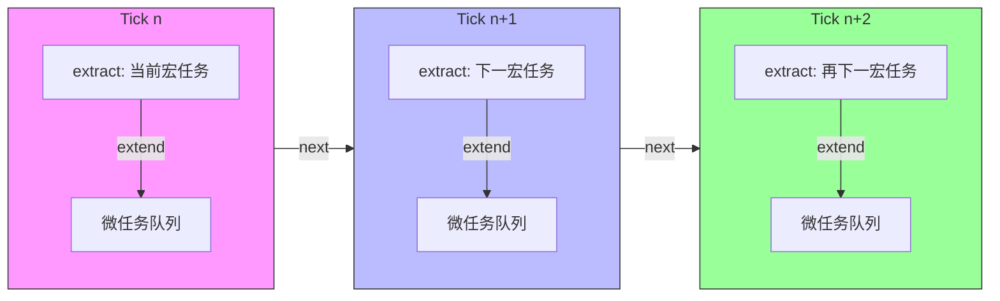

# 事件系统与消息传递范畴语义

> **核心命题**：事件、消息、流、Promise、Stream、Observable 在范畴论中都有统一的数学结构。理解这些结构，可以揭示不同并发/异步模型之间的深层联系与本质差异，为工程选型提供理论依据。

---

## 引言

异步编程模型的演化，本质上是对"时间"这一维度的不同数学处理方式的探索。
从 1970 年代的协程到 2020 年代的代数效应，每一种模型都是对"计算在时间上如何展开"的不同抽象：

| 年代 | 模型 | 时间抽象 |
|------|------|---------|
| 1970s | 协程（Coroutine） | 显式挂起/恢复 |
| 1980s | Futures/Promises | 值的"稍后可用" |
| 1990s | 事件驱动（Event Loop） | 离散的事件点 |
| 2000s | Reactive Extensions（Rx） | 可观察的流 |
| 2010s | async/await | 伪同步语法糖 |
| 2020s | 代数效应（Algebraic Effects） | 可组合的计算效应 |

范畴论提供了一种统一的语言来描述这些抽象。
本章将探讨事件系统作为范畴、Promise 的 Kleisli 范畴、Stream 的时间索引函子、Actor 模型的余单子 Coalgebra、CSP 的进程代数、Pub-Sub 的切片范畴，以及消息总线的纤维化结构。

在 JavaScript 生态中，这些理论有直接的工程对应：原生的 `Promise` 和 `async/await`、RxJS 的 `Observable`、Node.js 的 `EventEmitter`、`MessageChannel` 的 CSP 信道、WebSocket 的实时双向通信。
理解它们背后的范畴结构，可以帮助开发者在面对复杂异步需求时做出更精确的技术选型。

---

## 理论严格表述

### 事件系统作为范畴

**事件范畴 Event** 的对象是事件类型，态射是事件处理器（回调函数）。

```
对象：E, F, G, ...（事件类型：click, load, error, ...）
态射：f: E → F（当 E 发生时，产生 F）
组合：g ∘ f: E → G（事件链）
恒等：id_E: E → E（直接传递事件）
```

```typescript
type EventHandler<E, F> = (event: E) => F;

// 组合 = 事件链
function composeEvents<E, F, G>(
  f: EventHandler<E, F>,
  g: EventHandler<F, G>
): EventHandler<E, G> {
  return (event) => g(f(event));
}
```

事件总线（Event Bus）是事件范畴中的**余积构造器**：`emit` 对应余积的 injection，`on` 对应余积的 case 分析。
事件委托则是**投影态射**加**过滤子对象**——从所有 click 事件中筛选出 button 点击，这是子对象分类器的特征函数的应用。

### Promise 与 Future 的 Monad 语义

Promise 构成了一个 **Kleisli 范畴**，其底层 Monad 是 **Future Monad**。

```
对象：类型 A, B, C, ...
Kleisli 态射：A → Promise<B>（异步计算）
组合（Kleisli 复合）：(f >=> g)(a) = f(a).then(g)
单位：return(a) = Promise.resolve(a)
```

```typescript
type Kleisli<A, B> = (a: A) => Promise<B>;

function kleisliCompose<A, B, C>(
  f: Kleisli<A, B>,
  g: Kleisli<B, C>
): Kleisli<A, C> {
  return (a) => f(a).then(g);
}

// 单位元
function kleisliReturn<A>(a: A): Promise<A> {
  return Promise.resolve(a);
}
```

Promise 满足 Monad 律：左单位律 `Promise.resolve(x).then(f) === f(x)`，右单位律 `p.then(Promise.resolve) === p`，结合律 `p.then(f).then(g).then(h)` 与嵌套 then 等价。

`Promise.all` 看起来像积，但实际上是**幺半群积**（monoidal product），不是范畴积。`Promise.race` 看起来像余积，但它不满足余积的泛性质——没有显式的 `injectLeft` 和 `injectRight`，且 race 是"非确定性"的，破坏了范畴论的确定性假设。修正方案是使用 `Either` 类型显式建模选择。

### Stream 与 Observable 的函子结构

Stream（或 Observable）可以看作一个**时间索引的函子**。
时间范畴 `T` 的对象是时间点，态射是时间流逝 `ti → tj`（i ≤ j）。
Stream 函子 `S: T → Set` 把每个时间点映射到该时刻为止观察到的所有值的集合。

```typescript
// map = 函子性（保持结构）
function streamMap<A, B>(f: (a: A) => B): (stream: Stream<A>) => Stream<B> {
  return (stream) => ({
    subscribe: (observer) => stream.subscribe({
      next: (a) => observer.next(f(a)),
      error: (err) => observer.error(err),
      complete: () => observer.complete(),
    }),
  });
}
```

Observable 在组合操作下构成一个**幺半群**（Monoid）。
`merge` 是二元运算，`empty` 是单位元。但 `merge` 不是范畴积或余积——没有投影态射，你无法从 `merge(s1, s2)` 中"提取" `s1`。

### Actor 模型的范畴论视角

Actor 可以从**余单子 Coalgebra** 的角度理解。
余单子 `W` 有 `extract: W(A) → A`（当前状态）和 `extend: W(A) → W(W(A))`（历史/上下文）。
Actor 是 `W(Behavior)` 的余代数：`behavior: Actor → W(Behavior)`，其中 `Behavior = Message → Actor`。

Actor 的监督树是余代数的分层结构。
当子 Actor 崩溃时，`restart` 策略用新的 coalgebra 重启（重置状态），`escalate` 将错误传递给父 Actor，`stop` 终止子 Actor。
从范畴论视角，监督树是 Actor 范畴中的"余极限"，父 Actor 是子 Actor 的"推出"（pushout）。

需要注意的是，Actor 模型**不满足笛卡尔闭范畴**（CCC）的条件：两个 Actor 的"积"需要额外的同步机制，"从 Actor A 到 Actor B 的函数"不是一个 Actor（因为 Actor 的行为基于消息历史动态变化）。
Actor 模型需要更复杂的范畴结构，如余单子范畴或反应式范畴。

### CSP 的代数结构

CSP（Communicating Sequential Processes）的代数结构可以直接对应到范畴论：

| CSP 运算 | 范畴论结构 | 直观含义 |
|---------|-----------|---------|
| 前缀 `a → P` | 余自由构造 | "先做 a，然后..." |
| 外部选择 `P □ Q` | 余积（coproduct） | 环境做选择 |
| 内部选择 `P ⊓ Q` | 积的弱化 | 进程做选择 |
| 并行 `P \|\|\| Q` | 拉回（pullback） | 同步约束 |
| 隐藏 `P \\ A` | 余等化子（coequalizer） | 遗忘信息 |

### Event Loop 的余单子解释

JavaScript 的 Event Loop 可以从 **Store Comonad** 的角度理解：

```
Store Comonad S(E)：
  S(E) = E^S × S  （状态 S 下的事件序列）
  extract: S(E) → E（当前事件）
  extend: S(E) → S(S(E))（下一步的 Event Loop）

Event Loop = Store Comonad 的余代数
  next: EventLoop → Store(EventLoop)
```

宏任务等于**大粒度的状态转换**（长态射），微任务等于**小粒度的状态转换**（短态射）。优先执行微任务等于优先完成"短态射"的复合，再执行"长态射"，这保证了两次宏任务之间系统状态达到"局部稳定"。

### Pub-Sub 与消息总线的范畴模型

发布-订阅（Pub-Sub）模型可以看作 **切片范畴**（Slice Category）的实例。在切片范畴 `C/B` 中，对象是到"主题空间" `B` 的态射 `f: A → B`，态射是满足三角形交换律的映射。发布等于沿 `f` 的推送（pushforward），订阅等于沿 `f` 的拉回（pullback）。

消息总线可以看作一个**纤维化**（Fibration）：总空间 `E` 是所有消息的集合，基空间 `B` 是主题/通道的集合，投影 `π: E → B` 是消息到其主题/通道的映射。订阅是纤维的选择，发布是纤维的填充。

### 事件 vs 消息 vs 流的范畴论对比

| 维度 | 事件（Event） | 消息（Message） | 流（Stream） |
|------|-------------|---------------|------------|
| 时间 | 离散的时间点 | 有载荷的通信单元 | 连续的时间序列 |
| 状态 | 无状态的通知 | 可能包含状态 | 可观察的值序列 |
| 范畴 | Event（对象=事件类型，态射=处理器） | Msg（对象=地址，态射=传递路径） | Stream = Set^T（时间索引预层） |

对称差分析：事件比消息更轻量（无地址/路由）、广播语义、不可回溯；消息比事件有明确的目标地址、可以包含回复（request/response）、可以排队和持久化；流比事件和消息有时间维度显式化、可组合的操作符（map, filter, reduce）、支持背压（backpressure）。

---

## 工程实践映射

### 异步模型的范畴论选型

```
需要容错和隔离？
  ├─ 是 → Actor 模型
  └─ 否 →
      需要连续数据流？
        ├─ 是 → Stream/Observable
        └─ 否 →
            需要请求-响应？
              ├─ 是 → Promise/async-await
              └─ 否 → 事件总线/Pub-Sub
```

### TypeScript 生态中的实现选择

| 模型 | 库/原生 API | 范畴论特征 | 适用场景 |
|------|------------|-----------|---------|
| Promise | 原生 | Kleisli 范畴 | 单次异步计算 |
| async/await | 原生 | Promise 的语法糖 | 线性异步流程 |
| Observable | RxJS | 时间索引函子 | 复杂事件处理 |
| EventEmitter | Node.js 原生 | 余积构造 | 模块间通信 |
| MessageChannel | 原生 | CSP 信道 | Worker 通信 |
| WebSocket | 原生 | Stream 实例 | 实时双向通信 |

### 幂等消息处理器

分布式系统中的消息传递必须考虑容错。幂等性是核心策略之一——确保重复处理不会产生副作用。从范畴论角度，幂等性对应 **f ∘ f = f**（幂等态射）。

```typescript
class IdempotentHandler<T> {
  private processedIds = new Set<string>();

  async handle(message: { id: string; payload: T }): Promise<void> {
    if (this.processedIds.has(message.id)) {
      return;  // 已处理，跳过
    }
    await this.process(message.payload);
    this.processedIds.add(message.id);
  }

  protected async process(payload: T): Promise<void> {
    // 子类实现
  }
}
```

### Event Sourcing 的消息回放

事件溯源（Event Sourcing）是消息传递模式在数据持久化中的应用。传统 CRUD 中状态是数据库中的当前值，更新是直接修改状态；事件溯源中状态是所有历史事件的 fold，更新是追加新事件。

范畴论视角：事件流是**自由幺半群**（事件的序列），当前状态是幺半群到状态范畴的幺半群同态，回放是重新计算同态。

```typescript
type Event =
  | { type: 'Deposit'; amount: number }
  | { type: 'Withdraw'; amount: number };

interface AccountState { balance: number; }

function reduce(state: AccountState, event: Event): AccountState {
  switch (event.type) {
    case 'Deposit': return { balance: state.balance + event.amount };
    case 'Withdraw': return { balance: state.balance - event.amount };
  }
}

// 当前状态 = 所有事件的 fold
function currentState(events: Event[]): AccountState {
  return events.reduce(reduce, { balance: 0 });
}
```

### Saga 模式的补偿操作

Saga 模式用于管理分布式事务。正向流程是**态射复合** `T1 ∘ T2 ∘ T3 ∘ ... ∘ Tn`，失败回滚是**逆向补偿** `Cn ∘ ... ∘ C3 ∘ C2 ∘ C1`，其中 `Ci` 是 `Ti` 的"逆"（在某种意义上的）。

```typescript
interface SagaStep<T> {
  execute(): Promise<T>;
  compensate(): Promise<void>;
}

class Saga<T> {
  private steps: SagaStep<unknown>[] = [];
  private completed: SagaStep<unknown>[] = [];

  async execute(): Promise<T> {
    try {
      for (const step of this.steps) {
        await step.execute();
        this.completed.push(step);
      }
      return null as T;
    } catch (error) {
      for (const step of this.completed.reverse()) {
        await step.compensate();
      }
      throw error;
    }
  }
}
```

---

## Mermaid 图表

### 异步模型范畴结构总览

```mermaid
graph TD
    subgraph 事件范畴
        E1[click事件] -->|处理器f| E2[void]
        E3[load事件] -->|处理器g| E4[void]
    end

    subgraph Promise Kleisli范畴
        P1[A] -->|f: A→Promise&#123;B&#125;| P2[B]
        P2 -->|g: B→Promise&#123;C&#125;| P3[C]
        P1 -.->|f >=> g| P3
    end

    subgraph Stream函子
        S1[Stream&#123;A&#125;] -->|streamMap f| S2[Stream&#123;B&#125;]
    end

    subgraph Actor余代数
        A1[Actor] -->|behavior| A2[W&#123;Behavior&#125;]
        A2 -->|extract| A3[当前状态]
    end

    subgraph CSP进程代数
        C1[P □ Q] -->|外部选择| C2[环境选择P或Q]
        C3[P ||| Q] -->|并行| C4[同步约束]
    end

    style P1 fill:#bbf,stroke:#333
    style A1 fill:#f9f,stroke:#333
    style C1 fill:#9f9,stroke:#333
```

### 消息总线的纤维化结构

```mermaid
graph TD
    subgraph 基空间B["主题/通道集合"]
        T1["topic: user-created"]
        T2["topic: order-placed"]
        T3["topic: payment-received"]
    end

    subgraph 总空间E["所有消息的集合"]
        M1["&#123;userId: 1, name: 'Alice'&#125;"]
        M2["&#123;orderId: 101, items: [...]&#125;"]
        M3["&#123;paymentId: 501, amount: 100&#125;"]
    end

    subgraph 订阅者
        S1[用户服务]
        S2[订单服务]
        S3[支付服务]
    end

    M1 -->|π: E→B| T1
    M2 -->|π: E→B| T2
    M3 -->|π: E→B| T3

    T1 -.->|订阅| S1
    T2 -.->|订阅| S2
    T3 -.->|订阅| S3

    style 基空间B fill:#bbf,stroke:#333
    style 总空间E fill:#9f9,stroke:#333
```



### Event Loop 的 Store Comonad 模型



---

## 理论要点总结

1. **事件系统作为范畴**：事件范畴的对象是事件类型，态射是事件处理器。事件总线是余积构造器，`emit` 是 injection，`on` 是 case 分析。事件委托是投影态射加子对象过滤。

2. **Promise 的 Kleisli 范畴**：Promise 构成 Kleisli 范畴，底层是 Future Monad。`then` 对应 Kleisli 复合，`.resolve` 对应单位元。`Promise.all` 是幺半群积而非范畴积，`Promise.race` 因非确定性不满足余积泛性质，应使用 `Either` 显式建模选择。

3. **Stream 的时间索引函子**：Stream 是时间范畴 `T` 到集合范畴 `Set` 的函子，`map` 保持结构（函子性）。Observable 的 `merge` 构成幺半群，但不是范畴积/余积——缺乏投影态射。

4. **Actor 的余单子 Coalgebra**：Actor 是 `W(Behavior)` 的余代数，监督树是余极限结构。Actor 模型不满足 CCC 条件，需要更复杂的范畴结构（余单子范畴或反应式范畴）。

5. **CSP 的进程代数**：CSP 运算与范畴结构有精确对应——前缀对应余自由构造，外部选择对应余积，并行对应拉回，隐藏对应余等化子。

6. **Event Loop 的 Store Comonad**：Event Loop 是 Store Comonad 的余代数，`extract` 获取当前事件，`extend` 产生下一步状态。微任务是短态射的复合，宏任务是长态射，优先微任务确保局部稳定。

7. **Pub-Sub 的切片范畴与纤维化**：Pub-Sub 是切片范畴 `C/B` 的实例，消息总线是纤维化 `π: E → B`。订阅是纤维选择，发布是纤维填充。

8. **范畴论的边界**：时间本身不是范畴的对象——`setTimeout(fn, 100)` 和 `setTimeout(fn, 200)` 的差异属于操作语义。性能（内存分配、GC 压力、CPU 缓存）不是范畴的性质。调试和可观测性（消息追踪、内存泄漏检测、操作符链可视化）是工程工具的问题，不是数学结构的问题。范畴论提供"是什么"的理解，工程工具提供"怎么看"的能力。

---

## 参考资源

1. Hoare, C. A. R. (1978). "Communicating Sequential Processes." *Communications of the ACM*, 21(8), 666-677. CSP 进程代数的奠基论文，为消息传递并发模型的代数结构提供了形式化基础。

2. Hewitt, C., Bishop, P., & Steiger, R. (1973). "A Universal Modular Actor Formalism for Artificial Intelligence." *IJCAI*. Actor 模型的原始论文，奠定了 Actor 作为独立计算单元和消息传递并发范式的理论基础。

3. Moggi, E. (1991). "Notions of Computation and Monads." *Information and Computation*, 93(1), 55-92. 计算效应的单子语义奠基之作，Promise 和异步计算的单子解释直接源于此。

4. Meijer, E. (2012). "Your Mouse is a Database." *Communications of the ACM*, 55(5), 66-73. Reactive Extensions 的理论宣言，将事件流视为可查询的数据库，奠定了 Observable 的时间索引函子视角。

5. Jacobs, B. (1999). *Categorical Logic and Type Theory*. Elsevier. 第 5-6 章详细讨论了纤维化、余单子与计算语义的关系，是消息总线纤维化结构和 Event Loop 余单子解释的理论来源。
