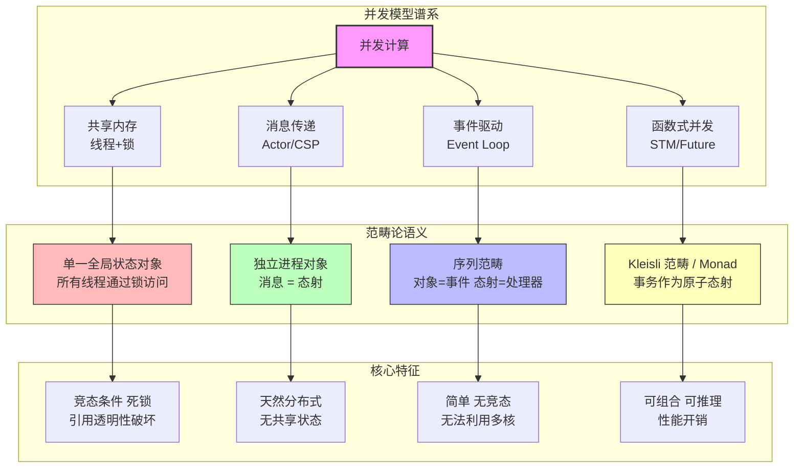
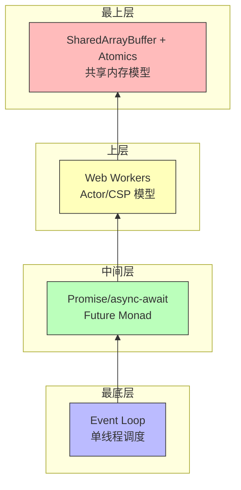
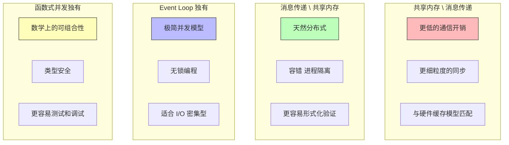

# 并发计算模型的范畴论语义：从进程代数到单子范畴

> **核心命题**：并发不是"同时做很多事"那么简单。从范畴论和进程代数的角度，并发是一种基本的计算结构，与顺序计算具有同等的数学深度——π演算的表达力甚至超越了 λ 演算。

---

## 引言

1960 年代，IBM OS/360 首次让多个程序"同时"驻留内存，程序员们欢呼雀跃——但很快发现，"同时"只是时分复用的幻象。
1970 年代 Unix 的 `fork/exec` 模型引入了真正的进程概念，却带来了竞态条件与死锁的噩梦。
1980 年代线程让并发更轻量，锁、信号量、条件变量成为标配。2010 年代 `async/await` 用语法糖掩盖了回调地狱，但并发的本质问题——**如何证明两个并发实现是等价的**——始终悬而未决。

范畴论和进程代数提供了回答这个问题的工具。CCS 的互模拟定义了"行为等价"的严格标准；
π 演算将通道提升为一等公民，使并发拓扑可以动态演化；
CSP 的代数定律让并发程序可以被形式化地推导和优化；
Actor 模型用消息传递消除了共享状态；Petri 网用图形化的令牌流动捕捉真正的并发语义。
而在所有这些模型的底层，**单子范畴（Monoidal Category）** 提供了统一的数学框架——它的张量积 `⊗` 不是笛卡尔积，没有投影，因此天然地描述了"不可分割的并行"。

本文从进程代数出发，穿越 π 演算、CSP、Actor 与 Petri 网的形式化丛林，最终在范畴论的高地上俯瞰 JavaScript 的 Event Loop 与 Promise 代数，为 TypeScript/JavaScript 生态中的并发编程提供一张严格的数学地图。

---

## 理论严格表述

### 1. 进程代数基础：CCS 与互模拟

进程代数（Process Algebra）是用代数方法描述并发系统的形式化工具。
CCS（Calculus of Communicating Systems）由 Robin Milner 提出，其基本语法为：

```
P, Q ::= 0 | a.P | P + Q | P | Q | P \ a | P[f] | A
```

其中 `0` 是终止进程，`a.P` 是前缀（执行动作 `a` 后行为像 `P`），`P + Q` 是非确定性选择，`P | Q` 是并行组合，`P \ a` 是限制（隐藏动作 `a`）。

**互模拟（Bisimulation）** 是判断两个进程"行为等价"的核心概念。
关系 `R` 是互模拟，当且仅当：如果 `P R Q`，那么对于 `P` 能做的每个动作 `a → P'`，`Q` 也能做同样的动作 `a → Q'` 且 `P' R Q'`；反之亦然。
两个进程"等价"意味着存在互模拟关系连接它们。

互模拟的检查复杂度是 PSPACE-complete，因此在工业上主要用测试和模型检查来近似。
但它的理论价值不可估量：**它精确地定义了"重构后的代码是否保持原有行为"**。

### 2. π 演算：将通道作为一等公民

π 演算是 Milner 对 CCS 的扩展，其核心创新是**将通道（channel）作为可以像数据一样传递的一等公民**：

```
P, Q ::= ... | x(y).P | x<y>.P | *P
```

`x(y).P` 表示在通道 `x` 上接收 `y` 然后像 `P`；`x<y>.P` 表示在通道 `x` 上发送 `y` 然后像 `P`。
关键特性是通道拓扑可以动态改变——这模拟了"移动计算"（mobile computation）。

**定理：π 演算可以编码 λ 演算**。这意味着 π 演算的表达力 ≥ λ 演算——并发不是顺序计算的"附加物"，而是一种基本的计算结构。
编码思路：λ 项中的变量 = π 演算中的通道；函数应用 = 在通道上发送参数并等待结果；β 归约 = 通道通信 + 进程替换。

**反例：π 演算不是笛卡尔闭范畴（CCC）**。它不满足 CCC 的条件：两个进程的"积"没有自然的投影态射；"从进程 P 到进程 Q 的函数"不是一个进程，因为进程的行为是动态的、非确定性的。
π 演算需要更一般的范畴结构，如"反应式范畴"或"进程范畴"。

### 3. CSP 的代数定律与失败语义

CSP（Communicating Sequential Processes）由 Tony Hoare 提出，提供了一套丰富的代数定律：

```
顺序组合： (a → b → P) = (a → (b → P))           （结合律）
选择交换：  P □ Q = Q □ P                         （交换律）
选择结合：  P □ (Q □ R) = (P □ Q) □ R            （结合律）
并行交换：  P ||| Q = Q ||| P                     （交换律）
```

利用这些定律，编译器可以优化并发程序——例如将 `(a → P) ||| (a → Q)` 在 `a` 是内部动作时优化为 `(P ||| Q) \ a`，消除不必要的同步点。

CSP 使用**失败集（Failures）** 定义进程语义：失败 = (轨迹, 拒绝集)。
轨迹是进程执行过的动作序列；拒绝集是进程在某个状态下拒绝执行的动作集合。
两个进程等价 = 它们有相同的失败集。这比互模拟更粗糙（区分的进程更少），但更容易计算和验证。

### 4. Actor 模型的余代数形式化

Carl Hewitt 的 Actor 模型有三个基本公理：

1. **创建**：Actor 可以创建新的 Actor
2. **发送**：Actor 可以向其他 Actor 发送消息
3. **配置**：Actor 的行为由它接收的消息序列决定

从范畴论视角，**Actor 系统 = 余单子（Coalgebra）范畴**。
Actor 可以表示为余代数 `Actor → F(Actor)`，其中 `F` 是描述 Actor 行为的函子。
行为函数的类型是 `消息 × 状态 → 新状态 × 新 Actor × 发送的消息列表`。

Actor 的监督树可以用**余极限**形式化：当子 Actor 失败时，`restart` 对应初始代数（父 Actor 创建新的子 Actor）；
`escalate` 对应推出（父 Actor 将失败传递给祖父 Actor）；
`stop` 对应终对象（父 Actor 终止子 Actor）。
监督策略 = 从"失败事件"到"处理方式"的态射。

### 5. Petri 网与真正并发

Petri 网是描述并发系统的图形化形式化工具，由位置（Place，圆形）、变迁（Transition，方形）、弧（Arc）和令牌（Token）组成。
**并发性 = 多个变迁可以同时"激发"，如果它们不共享输入位置**。

从范畴论视角，Petri 网可以看作一个范畴：对象是标记的多重集（markings），态射是变迁的激发序列。
但这只是"顺序"语义。要描述真正的并发，需要引入**交换箭图**：如果两个变迁 `t1` 和 `t2` 不共享输入位置，那么 `t1; t2 = t2; t1`（交换性）。
这正是"真正并发"（true concurrency）的范畴论表达！

### 6. 单子范畴：并发的统一框架

并发系统的范畴论基础通常是**单子范畴（Monoidal Category）**，而非笛卡尔闭范畴：

```
单子范畴 (C, ⊗, I)：
  ⊗: C × C → C  （张量积，表示"并行组合"）
  I: 单位对象    （空进程）
```

与 CCC 的关键区别：CCC 的积有投影（可以提取分量），单子范畴的张量积没有投影（并行组合是不可分割的）。
这正是并发的本质：`P ⊗ Q` 表示"P 和 Q 同时运行"，但你不能"提取" P 或 Q——它们是纠缠的！

**Traced 单子范畴** 在单子范畴基础上增加了 trace 操作：`trace: Hom(A ⊗ X, B ⊗ X) → Hom(A, B)`。
直观含义是将输出 `X` 反馈到输入 `X`，形成循环。这对应于递归进程定义、反馈控制系统和循环消息传递。

---

## 工程实践映射

### JavaScript Event Loop 的进程代数模型

JavaScript 的 Event Loop 可以从进程代数角度形式化为一个无限循环进程：

```
Loop = dequeue(task); execute(task); Loop
```

其中 `dequeue` 是从队列中取任务的原子操作，`execute` 是任务的执行（可能产生新任务）。
宏任务队列和微任务队列分别是两个进程通道（channel），微任务通道具有更高优先级。

```typescript
// Event Loop 的进程代数模型（简化）
interface Task {
  execute(): void;
  priority: 'macro' | 'micro';
}

class EventLoopProcess {
  private macrotasks: Task[] = [];
  private microtasks: Task[] = [];

  async run(): Promise<never> {
    while (true) {
      while (this.microtasks.length > 0) {
        this.microtasks.shift()!.execute();
      }
      if (this.macrotasks.length > 0) {
        this.macrotasks.shift()!.execute();
      }
      if (this.macrotasks.length === 0 && this.microtasks.length === 0) {
        await new Promise(resolve => setTimeout(resolve, 0));
      }
    }
  }
}
```

### Promise 的并发代数

Promise 的组合操作形成了一个并发代数：

- `Promise.all` = 张量积（monoidal product）：`Promise.all([p1, p2]) = p1 ⊗ p2`
- `Promise.race` = 弱余积（weak coproduct）：`Promise.race([p1, p2]) = p1 ⊕ p2`
- `Promise.then` = Kleisli 复合：`p.then(f) = f ∘ p`

这些操作满足某些代数定律，但不是严格的范畴积/余积——Promise 的语义比纯范畴构造更复杂（例如错误处理引入了非对称性）。

### Web Workers 与 SharedArrayBuffer 的形式化

```typescript
// Web Workers = 进程代数中的并行组合
// 主线程 = P, Worker 1 = Q1, Worker 2 = Q2
// 整体系统 = P | Q1 | Q2
// 通信 = 通过 postMessage 的消息传递 = π 演算中的通道通信

// SharedArrayBuffer = 共享状态范畴
const buffer = new SharedArrayBuffer(1024);
const view = new Int32Array(buffer);
Atomics.add(view, 0, 1); // 原子递增
```

从范畴论视角，`SharedArrayBuffer` 是共享对象（多个态射可以访问），`Atomics` 确保某些操作是"原子态射"（不可分割）。
这打破了"无共享状态"的 Actor 模型假设。但注意 Spectre 漏洞利用 `SharedArrayBuffer` 进行定时攻击——范畴论的安全模型需要考虑"时序信道"，而传统范畴论不区分"快"和"慢"的态射。

### 并发模型的工程选型

| 场景 | 推荐模型 | 理由 |
|------|---------|------|
| CPU 密集型计算 | Worker/多线程 | 利用多核 |
| I/O 密集型（Web 服务器）| Event Loop + async/await | 高并发，低资源 |
| 分布式系统 | Actor/消息队列 | 容错，隔离 |
| 实时系统 | CSP/同步消息 | 可预测性 |
| 复杂状态管理 | STM/函数式 | 可组合，可测试 |
| 前端 UI | Event Loop + Signals | 响应式，简单 |

---

## Mermaid 图表

### 图 1：四大并发模型的范畴论对应



### 图 2：JavaScript 并发模型的分层结构



### 图 3：并发范畴论中的单子范畴结构

```mermaid
graph LR
    subgraph 单子范畴 C&#40;⊗, I&#41;
        A[对象 A] ---|⊗| B[对象 B]
        C[对象 C] ---|⊗| D[对象 D]
        I[单位对象 I<br/>空进程]
    end

    subgraph 与 CCC 的对比
        CCC[笛卡尔闭范畴<br/>A × B] --> |投影 π₁| A
        CCC --> |投影 π₂| B
        MC[单子范畴<br/>A ⊗ B] -.-> |无投影| X[不可分割的并行]
    end

    subgraph Traced 单子范畴
        T1[输入 A ⊗ X] --> |f| T2[输出 B ⊗ X]
        T2 --> |trace| T3[结果 B<br/>反馈循环]
    end

    style I fill:#f9f,stroke:#333
    style X fill:#fbb,stroke:#333
    style T3 fill:#bfb,stroke:#333
```

### 图 4：并发模型的对称差分析



---

## 理论要点总结

1. **并发不是并行的同义词**。并发（Concurrency）是结构上的"交织"——多个计算同时存在，对应交错范畴；并行（Parallelism）是物理上的"同时"——多个计算同时执行，对应并行范畴（张量积）。JavaScript 的 `async/await` 是并发，`Web Workers` 才是并行。

2. **π 演算的表达力超越 λ 演算**。π 演算可以编码 λ 演算，但反之不成立。这意味着并发是一种基本的计算结构，不是顺序计算的"附加物"。通道作为一等公民使并发拓扑可以动态演化。

3. **单子范畴是并发的统一数学框架**。张量积 `⊗` 没有投影，因此天然描述了"不可分割的并行"——`P ⊗ Q` 表示 P 和 Q 同时运行，但你不能"提取" P 或 Q。这与 CCC 的笛卡尔积形成根本对比。

4. **互模拟定义了"行为等价"的标准**。两个进程等价当且仅当存在互模拟关系连接它们。这一概念精确地回答了"重构后的代码是否保持原有行为"，但检查复杂度为 PSPACE-complete。

5. **Actor 模型 = 余代数范畴**。Actor 的行为可以表示为余代数 `Actor → F(Actor)`，监督树的容错策略可以用余极限形式化。消息传递消除了共享状态，使分布式系统更容易推理。

6. **Petri 网的交换箭图表达真正并发**。当两个变迁不共享输入位置时，`t1; t2 = t2; t1`——这一交换性正是"真正并发"的范畴论表达，区别于简单的交错语义。

7. **范畴论不关心时间**。`P ⊗ Q` 不区分真正并行、交错执行还是不同 CPU 上的执行。但在工程中，真正并行 vs 伪并行 = 性能差异巨大；CPU 缓存一致性 = 共享内存的关键问题；网络延迟 = 分布式系统的核心约束。范畴论提供"结构直觉"，但不提供"性能预测"。

---

## 参考资源

1. **Milner, R. (1989)**. *Communication and Concurrency*. Prentice Hall. 进程代数与 CCS 的经典教材，系统阐述了并发系统的代数方法与互模拟理论。

2. **Milner, R. (1999)**. *Communicating and Mobile Systems: The π Calculus*. Cambridge University Press. π 演算的权威专著，证明 π 演算可以编码 λ 演算，确立了并发作为基本计算结构的地位。

3. **Hoare, C. A. R. (1985)**. *Communicating Sequential Processes*. Prentice Hall. CSP 的奠基之作，提供了丰富的代数定律和失败语义理论，是形式化并发推理的标准参考。

4. **Agha, G. (1986)**. *Actors: A Model of Concurrent Computation in Distributed Systems*. MIT Press. Actor 模型的形式化基础，从余代数视角阐述了消息传递系统的数学结构。

5. **Joyal, A., Street, R., & Verity, D. (1996)**. "Traced Monoidal Categories." *Mathematical Proceedings of the Cambridge Philosophical Society*, 119(3), 447-468. 将反馈循环纳入单子范畴的严格框架，为递归并发和循环消息传递提供了统一的数学描述。
