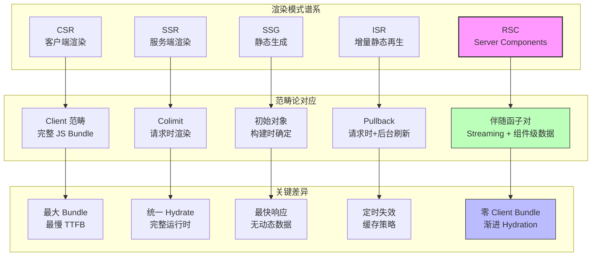
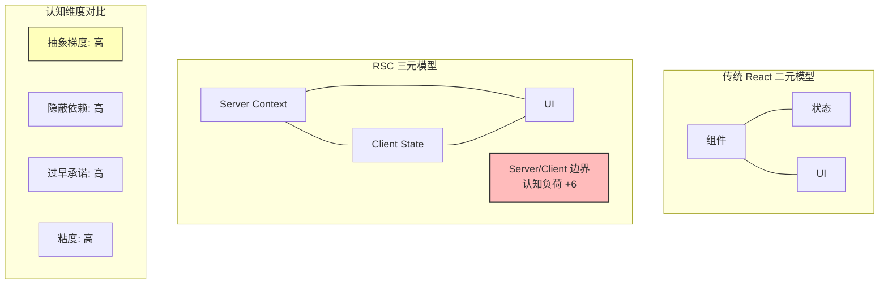

# React Server Components 的范畴语义：伴随函子、Streaming 与余极限

> **核心命题**：React Server Components (RSC) 不是"在服务器上运行的组件"这么简单。从范畴论视角，RSC 引入了一种根本性的计算分层——Server/Client 边界不是部署位置的差异，而是**两种不同计算范畴之间的伴随函子**。

---

## 引言

2013 年，Facebook 的工程师们面对一个看似不可能完成的任务：News Feed 需要在用户滚动时即时加载新内容，但每条内容背后的数据查询涉及数十个微服务。传统的客户端渲染方案要求浏览器先下载一个空壳应用，然后再发起数十个 API 请求——首屏时间（TTFB）超过 4 秒，在当时的 3G 网络下几乎不可用。

SSR（Server-Side Rendering）似乎是解决方案：在服务器上渲染首屏 HTML，用户立即看到内容。但 SSR 在 2013 年带来了新的问题——为了生成 HTML，服务器需要执行完整的 React 应用，包括所有组件的生命周期、状态管理和副作用。这意味着服务器必须加载与客户端完全相同的 JavaScript 包——一个 2MB 的 bundle 在服务器上运行，仅仅是为了生成 HTML。

Dan Abramov 在 2020 年的 RSC 提案中提出了一个根本性的问题：**"如果我们把组件分为两类——一类只在服务器上运行（可以访问数据库），一类在客户端运行（可以响应用户交互），会发生什么？"** 这个看似简单的问题触及了计算理论的核心：组件不是统一的计算实体，它们分布在不同的计算环境中，每个环境有其自身的计算能力和限制。从范畴论视角，这引入了一个根本性的**计算分层**——不是部署位置的差异，而是**两种不同计算范畴的存在**。

---

## 理论严格表述

### 1. 传统组件模型的破裂

在传统 React 中，所有组件共享同一个计算模型：`组件 = (props, state, context) => UI`。这个模型假设组件可以在任何环境中运行——服务器、客户端、Web Worker——因为所有输入都是自包含的。但当组件需要访问数据库时，这个假设就破裂了。在服务器上，`useEffect` 不会执行；在客户端，`fetch('/api/users')` 引入了一个外部依赖。同一个组件在不同环境中表现出**根本不同的语义**。

RSC 将组件分为两类：

**Server Components (SC)**：`SC: Props × ServerContext → Async〈VDOM〉`

- 输入：props + 服务器上下文（数据库连接、文件系统、环境变量）
- 输出：异步的虚拟 DOM 描述
- 限制：不能使用 `useState`、`useEffect`、浏览器 API

**Client Components (CC)**：`CC: Props × ClientState → VDOM`

- 输入：props + 客户端状态
- 输出：同步的虚拟 DOM 描述
- 能力：完整的 React 运行时、浏览器 API、用户交互

### 2. Server/Client 作为伴随函子对

从范畴论视角，Server Components 和 Client Components 生活在两个不同的范畴中：

**Server 范畴 Server**：对象是服务器可访问的数据源（数据库、文件系统、API），态射是异步数据转换 `(a: A) => Promise<B>`，组合是 Promise 链式调用（Kleisli 组合），单子是 Promise/Async 单子。

**Client 范畴 Client**：对象是 UI 状态和 DOM 元素，态射是同步状态更新 `(state: S) => S'`，组合是函数组合，单子是状态单子（State Monad）。

RSC 的核心创新：这两个范畴之间存在一个**伴随函子对（Adjunction）**：`F ⊣ U: Client ⇄ Server`。

- `F`: Client → Server（自由函子）：将纯 UI 组件提升到服务器渲染上下文
- `U`: Server → Client（遗忘函子）：忘记服务器能力，只保留最终渲染结果

**伴随关系的核心等式**：`Server(F(CC), SC) ≅ Client(CC, U(SC))`

左侧：将 Client Component 提升到 Server 后与 Server Component 组合的方式；右侧：Client Component 与 Server Component 的序列化输出组合的方式。伴随关系保证这两种组合方式在语义上等价。

**三角恒等式**：`ε_F ∘ F(η) = id_F` 保证客户端收到与原始组件等价的可交互组件；`U(ε) ∘ η_U = id_U` 保证客户端的 UI 状态与服务器输出一致。

### 3. 数据获取的范畴语义：Kleisli 范畴中的组合

RSC 允许组件直接 `await` 数据。从范畴论语义，这对应于**Kleisli 范畴中的组合**：

```
PostList: 1 ──db.posts.findMany──→ Promise〈Post[]〉──render──→ Promise〈VDOM〉
```

每个数据获取步骤都是一个 Kleisli 箭头（`A → Promise<B>`），组件的渲染是这些箭头的组合。这消除了传统 SSR 中的 waterfalls 问题——传统模式下组件的数据获取是串行的（一个组件的数据获取阻塞下一个组件），而 RSC 中所有数据获取同时发起。

### 4. Streaming SSR 的余极限解释

RSC 的 Streaming 机制允许服务器在数据准备就绪时逐步发送内容。从范畴论视角，Streaming 是**余极限的渐进构造**：

```
colim_{i ∈ I} VDOM_i = VDOM_final
```

其中 `I` 是时间索引范畴，每个 `VDOM_i` 是时间 `i` 时的部分虚拟 DOM。最终输出是所有部分 DOM 的合并。

React 的 `<Suspense>` 组件在范畴论语义中扮演**余锥（Cocone）**的顶点角色。每个异步组件是一个"对象"，Suspense 是"余锥"——它接收所有异步组件的输出，并在它们就绪时更新显示。

Streaming SSR 的普遍性质：对于任何其他"逐步显示"的策略，存在唯一的映射到 Streaming 策略。设 `D: I → VDOM` 是异步组件的依赖关系图，则 Streaming SSR 的输出是 `D` 的余极限 `Streaming(D) = colim(D)`。

### 5. RSC 的笛卡尔闭结构

Server Components 和 Client Components 的联合系统构成一个**笛卡尔闭范畴（CCC）**：

- **积（Product）**：Server Component 包裹多个 Client Component，对应范畴论中的积 `A × B`
- **指数（Exponential）**：Server Component 通过 props 传递函数给 Client Component，对应指数对象 `B^A`
- **终端对象（Terminal）**：`null` 或空渲染对应终对象 `1`

Server Action 构成了一个 Kleisli 三元组：`η: A → T(A)` = `'use server' 标记`；`μ: T(T(A)) → T(A)` = `Server Action 的组合`。其中 `T(A) = ServerAction〈A〉`。

React 的 Suspense 可以看作**代数效应（Algebraic Effects）** 的一种实现。从范畴论语义，代数效应对应**余单子（Comonad）** 的结构——效应处理器（Effect Handler）是余单子的提取操作（extract）。

---

## 工程实践映射

### Server Component 的基本结构

```typescript
// Server Component: 在服务器上执行，可以访问数据库
async function UserProfile({ userId }: { userId: string }) {
  const user = await db.users.findById(userId); // 直接数据库查询
  return (
    <div>
      <h1>{user.name}</h1>
      <ClientAvatar initial={user.name[0]} /> {/* Client Component 边界 */}
    </div>
  );
}
```

### Client Component 的边界标记

```typescript
// 标记 Client Component
'use client';

import { useState } from 'react';

export function ClientAvatar({ initial }: { initial: string }) {
  const [hovered, setHovered] = useState(false);
  return (
    <div
      onMouseEnter={() => setHovered(true)}
      onMouseLeave={() => setHovered(false)}
      style={{ transform: hovered ? 'scale(1.1)' : 'scale(1)' }}
    >
      {initial}
    </div>
  );
}
```

### Streaming 的渐进渲染

```typescript
import { Suspense } from 'react';

function Page() {
  return (
    <div>
      <h1>Dashboard</h1>
      <Suspense fallback={<Skeleton />}>
        <RevenueChart /> {/* 异步数据，流式传输 */}
      </Suspense>
      <Suspense fallback={<Skeleton />}>
        <RecentOrders /> {/* 另一个异步数据 */}
      </Suspense>
    </div>
  );
}
```

### Server Action 的函子性

```typescript
// Server Action: 在服务器上执行的函数
'use server';

export async function updateUserName(userId: string, newName: string) {
  await db.users.update(userId, { name: newName });
  revalidatePath('/profile');
}

// Client 调用
function EditForm({ userId }: { userId: string }) {
  return (
    <form action={updateUserName.bind(null, userId)}>
      <input name="newName" />
      <button>Update</button>
    </form>
  );
}
```

### RSC Payload 的序列化格式

```typescript
interface RSCPayload {
  chunks: Array<{
    id: string;
    type: 'component' | 'text' | 'suspense';
    data: unknown;
    clientRefs?: string[]; // 对 Client Components 的引用
  }>;
}
```

RSC 序列化输出不是 HTML，而是 React 元素的序列化表示。这对应伴随函子 `U` 的"遗忘"操作——忘记服务器能力，只保留客户端可理解的静态描述。

### Server/Client 范畴边界的类型安全

TypeScript 的类型系统可以与 RSC 的 Server/Client 边界结合：

```typescript
// 定义可序列化的 Props 类型
type ServerProps = {
  title: string;
  count: number;
  items: Array<{ id: string; name: string }>;
};

// 服务器端：直接查询数据库
async function ServerList(props: ServerProps) {
  const data = await db.query`SELECT * FROM items LIMIT ${props.count}`;
  return (
    <ul>
      {data.map(item => (
        <li key={item.id}>{item.name}</li>
      ))}
    </ul>
  );
}
```

类型系统保证 ServerList 只能接收可序列化的 props。如果尝试传递函数，TypeScript 会报错——这对应边界类型系统中的 **Serializable** 类型集合。

---

## Mermaid 图表

### 图 1：RSC 的伴随函子对结构

```mermaid
graph TB
    subgraph Server 范畴
        S1[数据库查询]
        S2[文件系统访问]
        S3[内部 API 调用]
        S4[异步计算]
        SC[Server Component]
    end

    subgraph Client 范畴
        C1[UI 状态]
        C2[DOM 元素]
        C3[浏览器 API]
        C4[用户交互]
        CC[Client Component]
    end

    subgraph 伴随函子对 F &#8869; U
        F[自由函子 F<br/>Client &#8594; Server]
        U[遗忘函子 U<br/>Server &#8594; Client]
    end

    CC -->|F| SC
    SC -->|U| CC
    S1 -->|序列化| C1
    S2 -->|序列化| C1

    style F fill:#bfb,stroke:#333
    style U fill:#bbf,stroke:#333
    style SC fill:#f9f,stroke:#333,stroke-width:2px
    style CC fill:#f9f,stroke:#333,stroke-width:2px
```

### 图 2：Streaming SSR 的余极限构造

```mermaid
graph LR
    subgraph 时间索引范畴 I
        t1[t1: 发送 HTML shell]
        t2[t2: Suspense fallback]
        t3[t3: UserProfile 就绪]
        t4[t4: Posts 就绪]
    end

    subgraph 部分 VDOM
        v1["&#60;html&#62;&#60;body&#62;&#60;h1&#62;Loading...&#60;/h1&#62;"]
        v2["&#60;Suspense&#62;&#60;Skeleton /&#62;&#60;/Suspense&#62;"]
        v3["&#60;Suspense&#62;&#60;UserProfile name='Alice' /&#62;&#60;/Suspense&#62;"]
        v4["最终完整 VDOM"]
    end

    subgraph 余极限构造
        c1[余锥顶点<br/>Streaming 输出]
    end

    t1 --> v1 --> c1
    t2 --> v2 --> c1
    t3 --> v3 --> c1
    t4 --> v4 --> c1

    style c1 fill:#f9f,stroke:#333,stroke-width:2px
    style v4 fill:#bfb,stroke:#333
```



### 图 3：RSC 与其他渲染模式的对比



### 图 4：RSC 的认知负荷模型



---

## 理论要点总结

1. **Server/Client 边界是伴随函子对，不是部署位置差异**。`F ⊣ U: Client ⇄ Server` 中，自由函子 `F` 将纯 UI 提升到服务器上下文，遗忘函子 `U` 忘记服务器能力只保留序列化输出。三角恒等式保证 Client Component 经过 Server 预渲染后再 Hydrate，恢复到原始组件。

2. **数据获取是 Kleisli 范畴中的组合**。RSC 中组件直接 `await` 数据库查询，每个步骤都是 Kleisli 箭头 `A → Promise<B>`，整个渲染是这些箭头的复合。这消除了传统 SSR 中的 waterfalls 问题。

3. **Streaming 是余极限的渐进构造**。`colim_{i ∈ I} VDOM_i = VDOM_final`，其中 `I` 是时间索引范畴。Suspense 组件扮演余锥顶点的角色，接收所有异步组件的输出并在它们就绪时更新显示。

4. **RSC 联合系统构成笛卡尔闭范畴**。积对应 Server Component 包裹多个 Client Component；指数对象对应 Server Component 通过 props 传递函数；终端对象对应空渲染。Server Action 构成 Kleisli 三元组。

5. **Suspense 是代数效应的编程实现**。从范畴论语义，代数效应对应余单子的结构——效应处理器是余单子的提取操作。`throw new Promise(...)` 实际上是代数效应中的"操作"抛出。

6. **RSC 的认知负荷约等于从 jQuery 切换到 React**。三元模型（Server Context + Client State + UI）占用 3 个工作记忆槽位，留给业务逻辑的只有 1-2 个槽位。最常见的错误：在 Server Component 中使用 `useState`（35%）、在 Client Component 中直接访问数据库（28%）、忘记添加 `'use client'`（22%）。

7. **范畴论模型的盲区包括：性能、安全性和用户体验**。RSC 的 Streaming 在数学上优雅，但网络分区时可能产生不一致的 UI；Server Action 的延迟对客户端是黑盒；两个 API 在范畴论语义上等价，但一个返回 200ms，一个返回 2s。范畴论是必要但不充分的分析工具。

---

## 参考资源

1. **React Team (2020)**. "React Server Components" (RFC). React 官方 RFC 文档，首次系统提出 Server/Client 组件分离的概念，奠定了 RSC 的理论基础。

2. **Dan Abramov (2023)**. "The Two Reacts." React 核心开发者博客，从哲学层面阐述了 Server Components 引入的"两种 React"的认知框架，是理解 RSC 心智模型的必读文章。

3. **Milner, R. (1989)**. *Communication and Concurrency*. Prentice Hall. 进程代数与并发理论的经典教材，为理解 Server/Client 通信的异步语义提供了形式化基础。

4. **Moggi, E. (1991)**. "Notions of Computation and Monads." *Information and Computation*, 93(1), 55-92. 单子作为计算效应统一模型的奠基论文，Server Action 的 Kleisli 三元组结构直接源于此。

5. **Plotkin, G., & Power, J. (2001)**. "Adequacy for Algebraic Effects." 代数效应的形式化基础，为理解 React Suspense 作为代数效应实现提供了严格的数学框架。
