# Signals 范式的范畴论：从余预层到细粒度响应式的统一数学模型

> **核心命题**：Signal 不是"更细粒度的 useState"。从范畴论视角，Signal 是**时间索引范畴上的余预层（Copresheaf）**——它编码了"值如何随时间变化"的完整信息，而不仅仅是某个时刻的快照。

---

## 引言

2019 年，Ryan Carniato 在构建一个高频数据更新的金融仪表盘时遇到了一个 React 无法优雅解决的问题：股票价格每 100ms 更新一次，而 React 的 Virtual DOM Diff 在处理这种粒度时引入了不可接受的延迟。每次更新触发的完整组件树重渲染，即使只有一行数字变化，也需要 16ms 以上的时间——在 60fps 的帧预算中占据了整整一帧。

Carniato 的洞察是：**问题不在于 React 慢，而在于 React 的抽象层次不对**。React 的更新粒度是"组件"，但真正的变化粒度是"值"。如果能让"值的变化"直接映射到"DOM 的更新"，而不经过组件树的重新执行，就能消除 Virtual DOM 的固有开销。这就是 SolidJS Signals 的起源。

但 Signals 不是 Solid 独有的发明——它是响应式编程思想在 UI 框架中的回归。从 2022 年 Angular 引入 Signals，到 2024 年 Vue 的 Vapor Mode 和 Svelte 5 的 Runes，整个前端生态正在经历一场从"组件驱动"到"信号驱动"的范式转移。从范畴论视角，这一转移的数学本质是：**从组件范畴（以树为结构）到 Signal 范畴（以图为结构）的函子转换**。

---

## 理论严格表述

### 1. Signal 作为时间索引范畴上的余预层

从范畴论视角，Signal 最深刻的数学结构是**时间索引范畴上的余预层（Copresheaf）**。

**时间索引范畴 T**：

- 对象：时间点 `t_0, t_1, t_2, ...`
- 态射：时间流逝 `t_i → t_j`（当 `i ≤ j`）

**Signal 作为 Copresheaf**：`S: T → Set`

对每个时间点 `t`，`S(t)` 给出该时刻 Signal 的值。时间流逝 `t_i → t_j` 映射为值的演变 `S(t_i) → S(t_j)`。这意味着 Signal 不仅记录当前值，还记录了值如何在时间中演化——它编码了"值如何随时间变化"的完整信息。

### 2. Signal 的函子性

Signal 的 `map` 操作对应 Copresheaf 的**自然变换**：

```
map(f): S ⇒ S'  其中  S'(t) = f(S(t))
```

即：对每个时间点 `t`，将值 `S(t)` 通过 `f` 转换为 `S'(t)`，且这种转换与时间结构兼容。这保证了 `map` 的复合满足函子律：`map(g ∘ f) = map(g) ∘ map(f)`。

### 3. Effect 作为余预层的截面

Effect 对应 Copresheaf 的**截面（Section）**：

```
effect: ∏_{t ∈ T} S(t) → Action
```

即：Effect 观察 Signal 在所有时间点的取值，并在每次变化时执行动作。这与数学中的"截面"概念精确对应——截面是从基空间（时间）到全空间（Signal 的值）的连续映射。

### 4. Memo 作为余极限

Memo（派生 Signal）对应**余极限（Colimit）**：

```
memo = colim(S_1, S_2, ..., S_n)
```

即：Memo 是其所有依赖 Signal 的"合并"——当任何依赖变化时，Memo 重新计算。在范畴论中，余极限是从一组对象和它们之间的态射构造出一个新对象，使得所有映射到新对象的箭头都满足交换性。

### 5. Signal 范畴的笛卡尔闭结构

我们可以形式化地定义 Signal 范畴 **Signal**：

- **对象**：Signal 的类型（`Signal<T>`）
- **态射**：Signal 之间的转换函数 `map: (a: A) => B`
- **组合**：函数组合
- **恒等**：`id = x => x`

**定理**：**Signal** 是笛卡尔闭范畴。

**证明概要**：

1. **积**：`createMemo(() => [signalA(), signalB()])` 对应积 `A × B`
2. **余积**：`createMemo(() => condition() ? signalA() : signalB())` 对应余积 `A + B`
3. **指数**：`createMemo(() => fn()(signalA()))` 对应指数对象 `B^A`

### 6. Signal 的伴随关系

Signal 的 `createMemo` 和 `createEffect` 之间存在**伴随关系**：`Memo ⊣ Effect`

- **Memo**：从多个 Signal 构造一个派生 Signal（左伴随）
- **Effect**：从一个 Signal 触发副作用（右伴随）

这种伴随关系保证了：Memo 的计算结果自动传播到所有依赖它的 Effect。这是 Signal 系统"自动依赖追踪"的数学基础。

### 7. Signal vs Observable 的范畴论对称差

RxJS 的 Observable 是**推送流**的数学抽象：`O: Time^{op} → Set`。注意这是**反变函子**——时间倒流时，Observable 可以"重新订阅"。

| 特性 | Signal | Observable | 范畴论解释 |
|------|--------|-----------|-----------|
| 拉/推 | 拉（读取时获取值） | 推（值变化时推送） | Signal = 预层；Observable = 层 |
| 同步性 | 同步 | 可异步 | Signal 在离散时间范畴；Observable 在连续时间范畴 |
| 多播 | 自动（所有依赖共享） | 需显式（shareReplay） | Signal 的余预层结构天然多播 |
| 生命周期 | 与作用域绑定 | 需显式订阅/取消 | Signal 的图结构自动管理 |

对称差的形式化：`Δ(Signal, Observable) = { 同步读取, 自动依赖追踪, 图结构 } ∪ { 时间操作符, 异步组合, 冷/热 Observable }`

---

## 工程实践映射

### SolidJS：最纯粹的 Signal 实现

Solid 的 Signal API 是最接近数学原型的实现：

```typescript
import { createSignal, createEffect, createMemo } from 'solid-js';

// 核心三元组：[read, write, signal]
const [count, setCount] = createSignal(0);

// createEffect = 建立依赖边（自然变换）
createEffect(() => {
  console.log(count()); // 读取时自动注册依赖
});

// createMemo = 派生 Signal（余极限）
const doubled = createMemo(() => count() * 2);

// 更新触发自动传播
setCount(5); // Effect 和 Memo 自动重新执行
```

范畴论对应：`createSignal` = 构造 Copresheaf 的对象；`createEffect` = 建立 Copresheaf 之间的自然变换；`createMemo` = 构造余极限。

### Angular Signals：企业级封装

Angular 在 v16 引入 Signals，v17 设为默认：

```typescript
import { signal, computed, effect } from '@angular/core';

const count = signal(0);
const doubled = computed(() => count() * 2);

effect(() => {
  console.log(`Count: ${count()}`);
});

count.set(5); // 触发 effect
count.update(c => c + 1); // 函数式更新
```

Angular 的 `computed` 等价于 Solid 的 `createMemo`；`effect` 需要显式清理（`DestroyRef`）。Angular Signals 与 Zone.js 解耦，实现无 Zone 变更检测。

### Vue Vapor Mode：编译时 Signal 化

Vue Vapor Mode 将模板编译为直接的 Signal 操作，跳过 Virtual DOM：

```typescript
// 编译前（模板）
// <script setup>
// const count = ref(0)
// </script>
// <template>
//   <button @click="count++">{{ count }}</button>
// </template>

// 编译后（近似 Signal 实现）
const count = ref(0);
const t0 = () => count.value; // 读取 Signal
const n0 = () => {
  const el = document.createElement('button');
  el.onclick = () => count.value++;
  return el;
};
// Vapor runtime 自动追踪 t0 的依赖并更新 DOM
```

从范畴论视角，Vapor Mode 是**编译时范畴转换**——将组件范畴（Virtual DOM）转换为 Signal 范畴（直接 DOM）。对应编译时函子：`Vapor: Component_{VDOM} → Component_{Signal}`。

### Svelte 5 Runes：显式化响应式

Svelte 5 引入 Runes 取代隐式的 `$:` 响应式：

```typescript
let count = $state(0);        // $state = Signal
let doubled = $derived(count * 2);  // $derived = Memo

$effect(() => {               // $effect = Effect
  console.log(`Count: ${count}`);
});
```

设计哲学：从"编译时魔法"转向"显式原语"——Runes 使响应式依赖关系在源代码中可见，降低了认知负荷。

### Signal 的图论模型

```typescript
interface SignalNode<T> {
  readonly id: string;
  readonly value: T;
  readonly observers: Set<EffectNode>;
  readonly sources: Set<SignalNode<unknown>>;
}

interface EffectNode {
  readonly id: string;
  readonly execute: () => void;
  readonly sources: Set<SignalNode<unknown>>;
}

// 依赖图：Signal &#8594; Effect 的有向无环图
class SignalGraph {
  private signals = new Map<string, SignalNode<unknown>>();
  private effects = new Map<string, EffectNode>();

  addEffect(id: string, fn: () => void, deps: SignalNode<unknown>[]): void {
    const effect: EffectNode = { id, execute: fn, sources: new Set(deps) };
    deps.forEach(dep => dep.observers.add(effect));
    this.effects.set(id, effect);
  }

  // 拓扑排序执行：确保依赖先更新
  propagate(sourceId: string): void {
    const visited = new Set<string>();
    const source = this.signals.get(sourceId);
    if (!source) return;

    const queue: EffectNode[] = [];
    source.observers.forEach(obs => {
      if (!visited.has(obs.id)) {
        visited.add(obs.id);
        queue.push(obs);
      }
    });
    queue.forEach(effect => effect.execute());
  }
}
```

### Signal 的批量更新与事务

```typescript
import { createSignal, createEffect, batch } from 'solid-js';

const [firstName, setFirstName] = createSignal('John');
const [lastName, setLastName] = createSignal('Doe');

createEffect(() => {
  console.log(`Name: ${firstName()} ${lastName()}`);
});

// 独立更新：触发两次 Effect
setFirstName('Jane'); // Effect 触发
setLastName('Smith'); // Effect 再次触发

// 批量更新：只触发一次 Effect
batch(() => {
  setFirstName('Alice');
  setLastName('Johnson');
}); // Effect 只触发一次
```

批量更新对应范畴论中的"合并多个时间点的变化为一个有效变化"——将离散时间范畴中的多个态射压缩为一个复合态射。

---

## Mermaid 图表

### 图 1：Signal 作为时间索引范畴上的余预层

```mermaid
graph TB
    subgraph 时间索引范畴 T
        t0[t0]
        t1[t1]
        t2[t2]
        t3[t3]
        t0 --> t1 --> t2 --> t3
    end

    subgraph Signal 作为 Copresheaf S: T &#8594; Set
        s0[S(t0) = 0]
        s1[S(t1) = 1]
        s2[S(t2) = 2]
        s3[S(t3) = 3]
    end

    subgraph 值的演变
        v0[值: 0]
        v1[值: 1]
        v2[值: 2]
        v3[值: 3]
    end

    t0 --> s0 --> v0
    t1 --> s1 --> v1
    t2 --> s2 --> v2
    t3 --> s3 --> v3

    style t0 fill:#bbf,stroke:#333
    style s0 fill:#bfb,stroke:#333
```

### 图 2：Signal-Effect 依赖图的 DAG 结构

```mermaid
graph TD
    subgraph Signal-Effect 图
        S1[Signal count<br/>value = 5]
        S2[Signal firstName<br/>value = 'Alice']
        S3[Signal lastName<br/>value = 'Smith']

        M1[Memo doubled<br/>count * 2 = 10]
        M2[Memo fullName<br/>firstName + lastName]

        E1[Effect 1<br/>console.log(doubled)]
        E2[Effect 2<br/>console.log(fullName)]
        E3[Effect 3<br/>update DOM]
    end

    S1 --> M1
    M1 --> E1
    S1 --> E3

    S2 --> M2
    S3 --> M2
    M2 --> E2
    M2 --> E3

    style S1 fill:#bbf,stroke:#333
    style S2 fill:#bbf,stroke:#333
    style S3 fill:#bbf,stroke:#333
    style M1 fill:#bfb,stroke:#333
    style M2 fill:#bfb,stroke:#333
    style E1 fill:#fbb,stroke:#333
    style E2 fill:#fbb,stroke:#333
    style E3 fill:#fbb,stroke:#333
```

### 图 3：四大框架 Signal 实现的范畴论对应

```mermaid
graph TB
    subgraph 框架实现
        SOL[SolidJS]
        ANG[Angular]
        VUE[Vue Vapor]
        SVE[Svelte 5]
    end

    subgraph 范畴论语义
        SOL --> S1[运行时 Copresheaf<br/>createSignal/createEffect]
        ANG --> A1[类型安全 Signal<br/>signal/computed/effect]
        VUE --> V1[编译时函子<br/>Component_VDOM &#8594; Component_Signal]
        SVE --> SV1[显式原语<br/>$state/$derived/$effect]
    end

    subgraph 核心特征
        S1 --> F1[最纯粹数学原型<br/>无 Virtual DOM]
        A1 --> F2[企业级封装<br/>Zone.js 替代]
        V1 --> F3[编译时优化<br/>零运行时开销]
        SV1 --> F4[最小运行时<br/>显式依赖降低认知负荷]
    end

    subgraph 统一数学结构
        U1[Copresheaf 范畴]
        U2[自然变换]
        U3[余极限]
        U4[笛卡尔闭范畴]
    end

    F1 --> U1
    F2 --> U1
    F3 --> U1
    F4 --> U1
    F1 --> U2
    F1 --> U3
    F1 --> U4

    style SOL fill:#f9f,stroke:#333
    style U1 fill:#bfb,stroke:#333,stroke-width:2px
```



### 图 4：Signal 范式与 Virtual DOM 范式的对称差

```mermaid
graph TB
    subgraph Signal 独有
        S1[细粒度更新<br/>O&#40;1&#41; 复杂度]
        S2[自动依赖追踪<br/>无需依赖数组]
        S3[图结构<br/>DAG 传播]
        S4[无 Virtual DOM<br/>直接 DOM 操作]
        S5[引用语义<br/>跨组件共享自然]
    end

    subgraph Virtual DOM 独有
        V1[组件级抽象<br/>树结构]
        V2[Hooks 规则<br/>调用顺序约束]
        V3[庞大生态<br/>DevTools/生态库]
        V4[时间切片<br/>并发渲染]
        V5[声明式 UI<br/>JSX 统一抽象]
    end

    style S1 fill:#bfb,stroke:#333
    style S2 fill:#bfb,stroke:#333
    style S3 fill:#bfb,stroke:#333
    style S4 fill:#bfb,stroke:#333
    style S5 fill:#bfb,stroke:#333
    style V1 fill:#bbf,stroke:#333
    style V2 fill:#bbf,stroke:#333
    style V3 fill:#bbf,stroke:#333
    style V4 fill:#bbf,stroke:#333
    style V5 fill:#bbf,stroke:#333
```



---

## 理论要点总结

1. **Signal 是时间索引范畴上的余预层**。`S: T → Set` 编码了值在所有时间点的完整信息，而不仅仅是当前快照。这是 Signal 与 useState 的根本区别：useState 是某一时刻的值，Signal 是值随时间变化的完整行为。

2. **Effect 是 Copresheaf 的截面，Memo 是余极限**。`effect: ∏_{t ∈ T} S(t) → Action` 观察 Signal 在所有时间点的取值；`memo = colim(S_1, ..., S_n)` 是依赖 Signal 的合并。这些不是比喻，而是严格的数学对应。

3. **Signal 范畴是笛卡尔闭范畴**。积对应组合多个 Signal；余积对应条件选择；指数对象对应函数传递。这保证了 Signal 的组合具有严格的数学结构——你可以安全地重构和组合 Signal，而不破坏语义。

4. **Memo ⊣ Effect 的伴随关系是自动依赖追踪的数学基础**。左伴随 Memo 从多个 Signal 构造派生 Signal，右伴随 Effect 从 Signal 触发副作用。伴随关系保证 Memo 的计算结果自动传播到所有依赖它的 Effect。

5. **Signal vs Observable 的差异是协变 vs 反变**。Signal 是协变函子 `S: T → Set`（时间正向流逝）；Observable 是反变函子 `O: T^{op} → Set`（可以重新订阅过去）。这解释了为什么 Signal 是"拉"（读取时获取值），Observable 是"推"（值变化时推送）。

6. **从 Virtual DOM 到 Signal 是范畴转换**。Vue Vapor Mode 的编译时函子 `Vapor: Component_{VDOM} → Component_{Signal}` 将 Virtual DOM 范畴中的对象映射到 Signal 范畴中的对象。这不是优化，是结构转换。

7. **Signal 的"隐形图"是核心认知挑战**。依赖链 `count → doubled → effect` 在代码中不可见，只在运行时建立。这引入了隐蔽依赖的认知维度问题。缓解策略：显式依赖声明、Signal 图可视化工具、TypeScript 类型辅助。

---

## 参考资源

1. **Elliott, C., & Hudak, P. (1997)**. "Functional Reactive Animation." *ICFP 1997*. 函数式响应式编程（FRP）的奠基论文，首次将响应式系统建立在严格的时间索引范畴语义之上，为 Signal 的 Copresheaf 解释提供了理论源头。

2. **Ryan Carniato (2022)**. "SolidJS: Reactivity to Rendering." SolidJS 核心开发者的技术博客，详细阐述了 Signal 范式的实现原理和与 Virtual DOM 范式的根本差异。

3. **Angular Team (2023)**. "Angular Signals Guide." Angular 官方 Signals 文档，展示了如何将 Signal 范式引入企业级框架，包括与 RxJS 的互操作和无 Zone 变更检测的实现。

4. **Vue.js Team (2024)**. "Vue Vapor Mode RFC." Vue Vapor Mode 的设计文档，从编译器视角阐述了如何将模板编译为直接 DOM 操作 + Signal 追踪，实现零 Virtual DOM 运行时开销。

5. **TC39 Signals Proposal (2024)**. "JavaScript Signals Standard." TC39 的 Signal 标准化提案，目标是将 Signal 纳入 JavaScript 语言标准，使其成为跨框架的通用原语——类似于 Promise 成为异步编程的标准。
